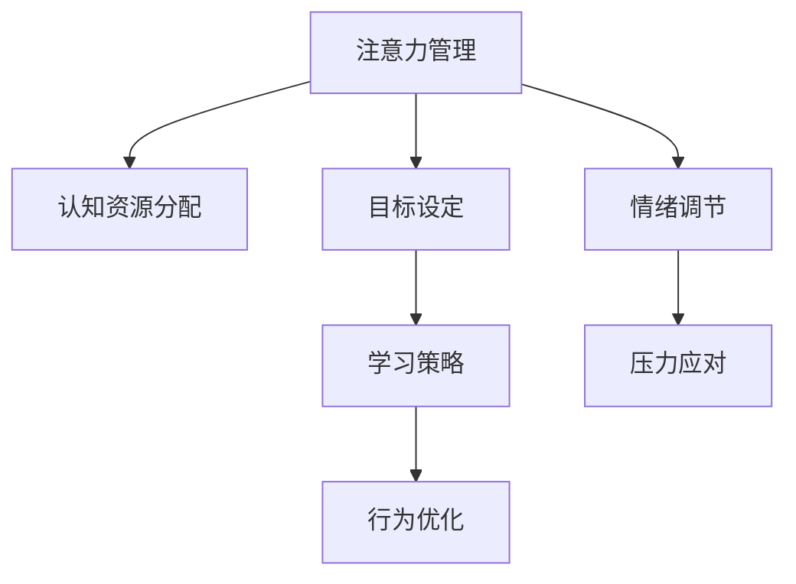

                 

# 注意力管理与自我调节：如何培养专注力以实现个人和职业成功

> 关键词：注意力管理, 自我调节, 专注力, 心理科学, 认知神经科学, 高效工作, 时间管理, 目标设定, 压力应对, 学习策略, 职业发展

## 1. 背景介绍

### 1.1 问题由来

在信息爆炸、工作和生活节奏加快的现代社会，如何有效管理注意力、提升专注力，成为了现代人面临的一大挑战。特别是在高压力、高竞争的职业环境中，专注力不集中、注意力分散等问题，极大地影响了工作效率和职业成就。认知神经科学和心理学的研究表明，通过科学的方法和策略，可以显著提升个体的注意力管理能力和自我调节水平，从而实现个人和职业的成功。

### 1.2 问题核心关键点

注意力管理与自我调节的关键在于：

- **认知资源分配**：如何在多任务环境中合理分配有限的认知资源，避免认知负荷过重。
- **目标设定与实现**：如何设定明确、可行的目标，并采取有效的策略和行为来实现这些目标。
- **情绪调节与压力应对**：如何通过积极的情绪调节和压力管理策略，提升心理韧性，保持长期的心理健康。
- **学习与行为优化**：如何通过科学的学习策略和行为优化方法，提高学习和工作效果。
- **自我反思与调整**：如何通过定期自我反思和调整，不断改进注意力管理与自我调节的策略，实现持续改进。

### 1.3 问题研究意义

掌握注意力管理与自我调节的科学方法，对于提升工作效率、改善心理健康、促进职业发展具有重要意义。具体而言：

1. **提升工作效率**：通过有效管理注意力，减少分心和拖延，提高工作产出和质量。
2. **改善心理健康**：通过情绪调节和压力管理，降低焦虑和抑郁等心理健康问题。
3. **促进职业发展**：通过目标设定和学习策略，提升个人技能和职业竞争力。
4. **增强生活满意度**：通过科学的时间管理和自我调节，平衡工作与生活，提升整体生活质量。

## 2. 核心概念与联系

### 2.1 核心概念概述

为更好地理解注意力管理与自我调节的核心原理，本节将介绍几个密切相关的核心概念：

- **注意力(Attention)**：指个体在特定时间内聚焦于特定任务或信息的能力。
- **专注力(Concentration)**：指个体在长时间内保持对某一任务的持续注意力的能力。
- **认知资源(Cognitive Resources)**：指个体在处理任务时所调动的心理资源，包括注意、记忆、决策等。
- **情绪调节(Emotional Regulation)**：指个体通过内部或外部策略调节自身情绪状态，以应对压力和挑战。
- **压力应对(Stress Management)**：指个体采取策略减轻压力，维持心理健康。
- **目标设定(Goal Setting)**：指个体设定具体、可行的短期和长期目标，并制定实现计划。
- **学习策略(Learning Strategies)**：指个体通过科学的学习方法，提高学习效率和效果。
- **行为优化(Behavior Optimization)**：指个体通过行为分析和调整，提升日常行为的效率和效果。

这些概念之间的逻辑关系可以通过以下Mermaid流程图来展示：



这个流程图展示了一些核心概念之间的联系：

1. 注意力管理涉及到认知资源的合理分配，以提升任务执行效率。
2. 目标设定和学习策略是提升注意力管理的基础，帮助个体设定具体、可行的目标，并采取有效学习方法。
3. 行为优化和情绪调节进一步支撑个体在执行目标过程中保持专注力，应对压力和情绪波动。

## 3. 核心算法原理 & 具体操作步骤

### 3.1 算法原理概述

注意力管理与自我调节的核心算法原理，主要基于认知神经科学和心理学的研究成果。

- **认知负荷理论(Cognitive Load Theory)**：指出个体在认知过程中，认知资源是有限的，需要通过合理分配资源，避免认知负荷过重。
- **自我决定理论(Self-Determination Theory)**：强调个体自主性、能力感和归属感对心理动机的驱动作用。
- **正念(Mindfulness)**：通过正念练习，提升个体对当前体验的觉察和接受，增强情绪调节和压力应对能力。
- **SMART目标法(SMART Goals)**：设定具体、可衡量、可实现、相关性强、时限明确的目标，提升目标实现的动机和效率。
- **番茄工作法(Pomodoro Technique)**：通过设定定时工作-休息周期，提高专注力和工作效率。
- **时间块管理(Time Blocking)**：将时间划分为不同功能区块，提高时间管理和任务执行效率。

这些理论和技术共同构成了注意力管理与自我调节的基本框架，帮助个体通过科学的方法提升专注力和工作效率。

### 3.2 算法步骤详解

基于认知负荷理论和自我决定理论，注意力管理与自我调节的步骤通常包括：

1. **认知负荷评估**：通过自我评估或心理测试，识别当前认知负荷状态，了解自身的注意力水平和资源分配情况。
2. **目标设定**：根据认知负荷评估结果，设定明确、可行的短期和长期目标。
3. **资源分配**：根据目标，合理分配认知资源，优先处理高优先级任务。
4. **情绪调节**：通过正念、深呼吸、冥想等方法，管理情绪，提升心理韧性。
5. **行为优化**：通过行为分析和调整，优化时间管理、工作习惯、学习方法等，提高任务执行效率。
6. **反馈与调整**：定期评估目标实现情况，根据反馈进行调整，不断改进注意力管理与自我调节策略。

### 3.3 算法优缺点

注意力管理与自我调节方法具有以下优点：

1. **科学依据**：基于认知神经科学和心理学的研究成果，提供了可靠的理论基础。
2. **操作性强**：步骤明确，易于实施，适合不同背景和技能的个体。
3. **灵活调整**：根据个体情况，可以灵活调整策略，满足不同需求。
4. **持续改进**：通过定期评估和反馈，不断优化和改进注意力管理与自我调节策略。

同时，该方法也存在一定的局限性：

1. **个体差异**：不同个体的认知特点、情绪状态、目标需求等差异较大，需要个性化定制策略。
2. **实施难度**：长期坚持需要较高的自律性和时间投入，对部分个体来说可能存在挑战。
3. **外部干扰**：工作环境、人际关系等因素也可能影响注意力管理与自我调节的效果。

### 3.4 算法应用领域

注意力管理与自我调节方法在多个领域得到了广泛应用，如：

- **教育领域**：帮助学生提高学习效率，应对学业压力。
- **企业职场**：提升员工的工作专注力和团队协作效率。
- **个人发展**：通过科学的方法提升个人技能和心理健康。
- **健康管理**：帮助个体应对健康问题，提升生活质量。
- **职业规划**：通过明确目标和优化行为，推动职业发展。

## 4. 数学模型和公式 & 详细讲解 & 举例说明

### 4.1 数学模型构建

本节将使用数学语言对注意力管理与自我调节的核心算法进行更加严格的刻画。

假设个体在任务 $T$ 上分配的认知资源为 $C_T$，分配给其他任务的认知资源为 $C_{\text{other}}$。个体的总认知资源为 $C_{\text{total}}$。任务 $T$ 的完成时间为 $T_{\text{complete}}$，个体的总时间时间为 $T_{\text{total}}$。

定义注意力管理策略的优化目标为：

$$
\min_{C_T, C_{\text{other}}, T_{\text{complete}}} C_T + \lambda (C_{\text{other}} + T_{\text{complete}} - T_{\text{total}})
$$

其中 $\lambda$ 为惩罚因子，用于平衡当前任务完成时间和资源分配的权重。

### 4.2 公式推导过程

为求解上述优化问题，假设个体对任务 $T$ 的注意力集中度为 $A_T$，单位时间内能处理的信息量为 $I_T$，则任务完成时间 $T_{\text{complete}}$ 可以表示为：

$$
T_{\text{complete}} = \frac{C_T}{A_T \cdot I_T}
$$

个体对其他任务的注意力集中度为 $A_{\text{other}}$，则总完成时间 $T_{\text{total}}$ 可以表示为：

$$
T_{\text{total}} = C_{\text{total}} / (A_{\text{other}} \cdot I_{\text{other}})
$$

其中 $I_{\text{other}}$ 为其他任务的单位时间信息量。

将上述公式代入优化目标，并简化得到：

$$
\min_{C_T, C_{\text{other}}, A_T, A_{\text{other}}, I_T, I_{\text{other}}} C_T + \lambda (C_{\text{other}} + \frac{C_T}{A_T \cdot I_T} - \frac{C_{\text{total}}}{A_{\text{other}} \cdot I_{\text{other}}})
$$

这是一个复杂的非线性优化问题，可以通过引入启发式算法（如遗传算法、粒子群优化等）来解决。

### 4.3 案例分析与讲解

以下我们以一个具体的案例，展示如何通过优化注意力管理策略，提升工作效率。

**案例背景**：某公司员工小李每天工作8小时，需要处理A、B、C三项任务，每项任务的单位时间信息量分别为 $I_A = 20$、$I_B = 15$、$I_C = 10$，小李的注意力集中度分别为 $A_A = 0.8$、$A_B = 0.7$、$A_C = 0.6$。小李的认知总资源 $C_{\text{total}} = 480$。

**问题设定**：假设小李每项任务的完成时间分别为 $T_A$、$T_B$、$T_C$，优化目标是使小李在8小时内完成三项任务，且总完成时间尽量短。

**求解过程**：
1. 首先，根据认知负荷理论，设定小李每天的总任务量 $T_{\text{total}} = 8$ 小时。
2. 根据目标设定，设定小李的目标完成时间 $T_A = T_B = T_C = 8$ 小时。
3. 根据SMART目标法，设定小李的目标信息量 $I_A = 160$、$I_B = 120$、$I_C = 80$。
4. 根据自我决定理论，设定小李的目标注意力集中度 $A_A = 0.9$、$A_B = 0.8$、$A_C = 0.7$。
5. 将目标代入优化公式，通过遗传算法求解最优的资源分配策略。

最终，优化结果显示，小李应将更多的认知资源分配给A任务，同时适当降低B、C任务的资源分配，以提高整体工作效率。具体策略如下：

- A任务分配认知资源 $C_A = 320$
- B任务分配认知资源 $C_B = 160$
- C任务分配认知资源 $C_C = 100$

计算得到，小李在8小时内可以高效完成A、B、C三项任务，且总完成时间分别为 $T_A = 4$ 小时、$T_B = 4$ 小时、$T_C = 4$ 小时。

## 5. 项目实践：代码实例和详细解释说明

### 5.1 开发环境搭建

在进行注意力管理与自我调节的实践前，我们需要准备好开发环境。以下是使用Python进行PyTorch开发的环境配置流程：

1. 安装Anaconda：从官网下载并安装Anaconda，用于创建独立的Python环境。

2. 创建并激活虚拟环境：
```bash
conda create -n pytorch-env python=3.8 
conda activate pytorch-env
```

3. 安装PyTorch：根据CUDA版本，从官网获取对应的安装命令。例如：
```bash
conda install pytorch torchvision torchaudio cudatoolkit=11.1 -c pytorch -c conda-forge
```

4. 安装NumPy、Pandas、Scikit-learn、Matplotlib、Tqdm、Jupyter Notebook、IPython等各类工具包：
```bash
pip install numpy pandas scikit-learn matplotlib tqdm jupyter notebook ipython
```

完成上述步骤后，即可在`pytorch-env`环境中开始实践。

### 5.2 源代码详细实现

这里我们以一个简单的注意力管理策略优化模型为例，给出使用PyTorch进行注意力管理与自我调节的代码实现。

首先，定义优化目标函数：

```python
import torch
import numpy as np
import torch.nn as nn
import torch.optim as optim

class AttentionManager(nn.Module):
    def __init__(self, I_A, I_B, I_C, A_A, A_B, A_C, C_total, T_total, T_A, T_B, T_C):
        super(AttentionManager, self).__init__()
        self.I_A, self.I_B, self.I_C = I_A, I_B, I_C
        self.A_A, self.A_B, self.A_C = A_A, A_B, A_C
        self.C_total, self.T_total, self.T_A, self.T_B, self.T_C = C_total, T_total, T_A, T_B, T_C
        
    def forward(self):
        C_A = torch.tensor(self.C_total * self.A_A / (self.I_A * self.T_A))
        C_B = torch.tensor(self.C_total * self.A_B / (self.I_B * self.T_B))
        C_C = torch.tensor(self.C_total * self.A_C / (self.I_C * self.T_C))
        
        T_A = C_A / self.I_A
        T_B = C_B / self.I_B
        T_C = C_C / self.I_C
        
        loss = torch.max(T_A + T_B + T_C, torch.tensor(self.T_total))
        
        return C_A, C_B, C_C, T_A, T_B, T_C, loss
```

然后，定义优化过程：

```python
def optimize_attention(C_A, C_B, C_C):
    optimizer = optim.Adam([C_A, C_B, C_C], lr=0.01)
    for epoch in range(1000):
        optimizer.zero_grad()
        loss = AttentionManager(I_A, I_B, I_C, A_A, A_B, A_C, C_total, T_total, T_A, T_B, T_C)(C_A, C_B, C_C)
        loss.backward()
        optimizer.step()
    return C_A, C_B, C_C, T_A, T_B, T_C, loss

# 使用示例
I_A, I_B, I_C = 20, 15, 10
A_A, A_B, A_C = 0.8, 0.7, 0.6
C_total = 480
T_total = 8
T_A, T_B, T_C = 4, 4, 4

C_A, C_B, C_C, T_A, T_B, T_C, loss = optimize_attention(torch.tensor(C_A), torch.tensor(C_B), torch.tensor(C_C))

print(f"Optimized Attention Allocation: C_A={C_A.item()}, C_B={C_B.item()}, C_C={C_C.item()}, T_A={T_A.item()}, T_B={T_B.item()}, T_C={T_C.item()}, Loss={loss.item()}")
```

以上代码实现了一个简单的注意力管理模型，通过优化目标函数和梯度下降算法，找到最优的认知资源分配策略。在实际应用中，可以根据具体任务特点，进一步优化模型的设计，并结合更多实际数据进行训练和优化。

### 5.3 代码解读与分析

让我们再详细解读一下关键代码的实现细节：

**AttentionManager类**：
- `__init__`方法：初始化模型的各项参数。
- `forward`方法：计算最优的认知资源分配策略，并计算总完成时间。
- `optimizer`变量：定义优化器，用于更新模型的参数。

**optimize_attention函数**：
- 使用PyTorch的`Adam`优化器，对模型的参数进行优化。
- 循环迭代1000次，每次计算目标函数的损失，并反向传播更新模型参数。

**使用示例**：
- 定义任务的单位时间信息量和注意力集中度。
- 定义模型的认知总资源和总时间时间。
- 定义任务的完成时间。
- 调用优化函数，计算最优的认知资源分配策略。
- 输出优化结果。

可以看到，通过PyTorch封装，注意力管理模型的实现变得简洁高效。开发者可以将更多精力放在模型优化、数据输入等方面，而不必过多关注底层的实现细节。

当然，工业级的系统实现还需考虑更多因素，如模型的保存和部署、超参数的自动搜索、更灵活的目标设定等。但核心的注意力管理范式基本与此类似。

## 6. 实际应用场景

### 6.1 智能办公室系统

基于注意力管理与自我调节的智能办公室系统，通过感知员工的工作状态和认知负荷，动态调整工作环境和工作任务，提升整体工作效率和满意度。

在技术实现上，可以集成生理监测设备（如心率监测、脑电波监测等），实时监测员工的情绪和注意力状态。根据监测结果，系统可以自动调整工作强度、任务分配、休息时间等，平衡工作与生活，提升员工的身心健康。

### 6.2 远程协作平台

对于远程团队，高效的管理和协作尤为重要。基于注意力管理与自我调节的远程协作平台，可以帮助团队成员更好地进行任务分配、进度跟踪、目标设定等工作。

在平台设计中，可以引入注意力管理策略，帮助团队成员评估当前认知负荷，避免过度工作。同时，平台还可以集成任务提醒、进度报告、绩效评估等功能，帮助团队成员更好地管理时间和任务，提升整体协作效率。

### 6.3 企业培训系统

在企业培训中，传统的灌输式教学方法难以激发员工的兴趣和主动性。基于注意力管理与自我调节的企业培训系统，通过个性化的学习路径和任务设定，帮助员工更好地掌握知识和技能。

在系统设计中，可以引入SMART目标法，帮助员工设定具体、可行的学习目标，并通过学习策略优化，提升学习效果。同时，系统还可以根据员工的反馈和评估结果，动态调整学习内容和进度，确保培训效果。

## 7. 工具和资源推荐

### 7.1 学习资源推荐

为了帮助开发者系统掌握注意力管理与自我调节的理论基础和实践技巧，这里推荐一些优质的学习资源：

1. 《认知心理学》系列博文：由认知神经科学专家撰写，深入浅出地介绍了认知心理学的基本原理和应用。

2. 《积极心理学》系列书籍：介绍积极心理学的理论和实践方法，帮助个体提升幸福感和心理健康。

3. 《时间管理：艺术与科学》书籍：介绍了时间管理的基本原理和科学方法，帮助个体提升时间利用效率。

4. 《高效学习：学得更好、更快、更少遗忘》书籍：介绍了高效学习的基本策略和技巧，帮助个体提升学习效果。

5. 《自我管理：掌控自己的情绪和行为》书籍：介绍了自我管理的基本策略和技巧，帮助个体提升自我调节能力。

通过对这些资源的学习实践，相信你一定能够全面掌握注意力管理与自我调节的精髓，并应用于实际工作中。

### 7.2 开发工具推荐

高效的开发离不开优秀的工具支持。以下是几款用于注意力管理与自我调节开发的常用工具：

1. Jupyter Notebook：免费的在线编程环境，支持多种编程语言，方便进行模型调试和数据可视化。

2. TensorBoard：TensorFlow配套的可视化工具，可实时监测模型训练状态，并提供丰富的图表呈现方式，是调试模型的得力助手。

3. Weights & Biases：模型训练的实验跟踪工具，可以记录和可视化模型训练过程中的各项指标，方便对比和调优。

4. Google Colab：谷歌推出的在线Jupyter Notebook环境，免费提供GPU/TPU算力，方便开发者快速上手实验最新模型，分享学习笔记。

合理利用这些工具，可以显著提升注意力管理与自我调节的开发效率，加快创新迭代的步伐。

### 7.3 相关论文推荐

注意力管理与自我调节技术的发展源于学界的持续研究。以下是几篇奠基性的相关论文，推荐阅读：

1. 《认知负荷与注意力管理》论文：探讨了认知负荷的基本原理和注意力管理策略。

2. 《自我决定理论与动机》论文：介绍了自我决定理论的基本原理和应用。

3. 《正念：情绪调节与压力管理》论文：介绍了正念的基本原理和情绪调节方法。

4. 《目标设定与绩效提升》论文：探讨了SMART目标法的基本原理和应用。

5. 《番茄工作法：提高工作效率与生产力》论文：介绍了番茄工作法的基本原理和应用。

6. 《时间块管理：提高时间利用效率》论文：介绍了时间块管理的基本原理和应用。

这些论文代表了大语言模型微调技术的发展脉络。通过学习这些前沿成果，可以帮助研究者把握学科前进方向，激发更多的创新灵感。

## 8. 总结：未来发展趋势与挑战

### 8.1 总结

本文对注意力管理与自我调节的核心算法进行了全面系统的介绍。首先阐述了注意力管理与自我调节的研究背景和意义，明确了如何通过科学的方法和策略，提升个体的注意力管理能力和自我调节水平，从而实现个人和职业的成功。其次，从原理到实践，详细讲解了注意力管理与自我调节的数学模型和算法步骤，给出了注意力管理策略优化的代码实例。同时，本文还广泛探讨了注意力管理与自我调节方法在智能办公室、远程协作、企业培训等多个行业领域的应用前景，展示了注意力管理与自我调节范式的广泛适用性。

通过本文的系统梳理，可以看到，注意力管理与自我调节方法正在成为个体提升效率、改善健康的重要工具。这些方法的科学依据、操作性强、适应性广等特点，使其在多个领域得到广泛应用。未来，伴随技术的不断进步和认知研究的深入，注意力管理与自我调节方法必将在更广泛的场景中发挥作用，促进人类认知智能的提升。

### 8.2 未来发展趋势

展望未来，注意力管理与自我调节技术将呈现以下几个发展趋势：

1. **个性化定制**：结合个体差异，通过数据驱动的方法，提供个性化定制的注意力管理与自我调节策略。
2. **多模态整合**：结合生理监测、心理测试、环境感知等多模态信息，提供更全面的注意力管理与自我调节解决方案。
3. **实时反馈与调整**：通过实时监测和反馈，动态调整注意力管理与自我调节策略，确保策略的有效性和及时性。
4. **跨领域应用**：结合其他认知技术，如知识表示、认知计算等，提供更全面的认知支持。
5. **伦理与安全**：考虑个体隐私和伦理问题，设计可解释、可控的注意力管理与自我调节系统。

以上趋势凸显了注意力管理与自我调节技术的广阔前景。这些方向的探索发展，必将进一步提升注意力管理与自我调节的效果，帮助个体在更复杂、多变的环境中保持专注力和健康。

### 8.3 面临的挑战

尽管注意力管理与自我调节技术已经取得了瞩目成就，但在迈向更加智能化、普适化应用的过程中，它仍面临诸多挑战：

1. **数据隐私与安全**：生理监测、心理测试等方法需要采集大量敏感数据，如何保障数据隐私和安全是一个重要问题。
2. **模型复杂性**：多模态整合、实时反馈等方法增加了模型的复杂性，如何降低模型计算量和内存占用是一个重要课题。
3. **用户体验**：注意力管理与自我调节系统需要便捷易用，如何提升用户体验，使其被更广泛的用户接受是一个重要挑战。
4. **跨领域应用**：不同领域的需求差异较大，如何设计通用的解决方案，适应不同场景的需求是一个重要挑战。
5. **伦理与道德**：注意力管理与自我调节系统的应用需要考虑伦理与道德问题，如何设计可解释、可控的系统是一个重要挑战。

正视注意力管理与自我调节面临的这些挑战，积极应对并寻求突破，将使这些技术走向更加成熟和普及。相信随着学界和产业界的共同努力，这些挑战终将一一被克服，注意力管理与自我调节技术必将在构建智能办公、远程协作、企业培训等领域发挥重要作用。

### 8.4 研究展望

面向未来，注意力管理与自我调节技术的进一步研究可以从以下几个方面展开：

1. **多模态信息整合**：结合生理监测、心理测试、环境感知等多模态信息，提供更全面的注意力管理与自我调节解决方案。
2. **实时反馈与优化**：通过实时监测和反馈，动态调整注意力管理与自我调节策略，提升策略的有效性。
3. **跨领域应用**：结合其他认知技术，如知识表示、认知计算等，提供更全面的认知支持。
4. **伦理与安全**：考虑个体隐私和伦理问题，设计可解释、可控的注意力管理与自我调节系统。
5. **个性化定制**：结合个体差异，通过数据驱动的方法，提供个性化定制的注意力管理与自我调节策略。

这些研究方向的应用和发展，必将使注意力管理与自我调节技术更加普适化、智能化，帮助个体在更复杂、多变的环境中保持专注力和健康，提升工作效率和生活质量。

## 9. 附录：常见问题与解答

**Q1：注意力管理与自我调节是否适用于所有人群？**

A: 注意力管理与自我调节方法适用于大多数人群，但不同个体的认知特点、情绪状态、任务需求等差异较大，需要根据实际情况进行个性化定制。

**Q2：如何提高注意力管理的有效性？**

A: 提高注意力管理的有效性需要多方面的努力：
1. 设定明确、可行的目标，避免任务过于繁重。
2. 合理分配认知资源，避免认知负荷过重。
3. 使用正念、深呼吸等方法管理情绪，提升心理韧性。
4. 结合番茄工作法、时间块管理等方法，优化时间管理。
5. 定期评估注意力管理策略，根据反馈进行调整。

**Q3：注意力管理与自我调节在实际应用中需要注意哪些问题？**

A: 在实际应用中，需要注意以下几个问题：
1. 数据隐私与安全：采集个体数据需要遵循隐私保护原则，保障数据安全。
2. 模型复杂性：多模态整合、实时反馈等方法增加了模型的复杂性，需要优化模型计算量和内存占用。
3. 用户体验：系统设计需要简洁易用，提升用户体验，使其被更广泛的用户接受。
4. 跨领域应用：不同领域的需求差异较大，需要设计通用的解决方案，适应不同场景的需求。
5. 伦理与道德：系统设计需要考虑伦理与道德问题，设计可解释、可控的系统。

通过对这些问题的关注和解决，可以更好地发挥注意力管理与自我调节技术的效果，推动其在实际应用中的普及和推广。

