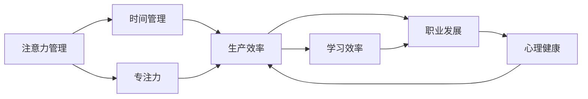

                 

# 注意力管理与自我调节：通过专注力增强个人和职业成功

> 关键词：注意力管理, 自我调节, 专注力, 时间管理, 生产力, 学习, 职业发展, 心理调节

## 1. 背景介绍

### 1.1 问题由来

在当今快节奏、高竞争的现代社会中，注意力和自我调节能力已成为个人和职业成功的关键因素。面对海量信息、多重任务和复杂环境，如何在纷扰中保持专注、有效管理时间和精力，是每个现代人面临的重大挑战。特别是对于工作者来说，如何在工作、学习和社交之间找到平衡，避免过度疲劳和压力，是提高生产力和实现职业发展的核心问题。

### 1.2 问题核心关键点

注意力和自我调节能力对于个人和职业成功至关重要，主要体现在以下几个方面：

1. **提升生产效率**：有效的注意力管理能够帮助个体在有限的时间内处理更多任务，提高工作效率和产出。
2. **增强学习能力**：良好的自我调节能力使学习者能够更好地集中精力，克服学习中的障碍，快速掌握新知识。
3. **促进职业发展**：职业上的成功往往依赖于能够长时间保持高水平专注力和积极心态，有效管理压力和情绪。
4. **维护心理健康**：面对职场竞争和社会压力，能够及时调节情绪和心态，维护良好的心理状态。
5. **提升生活质量**：合理分配时间和精力，能够平衡工作与生活，享受更多个人时间，提高生活质量。

### 1.3 问题研究意义

研究注意力和自我调节的科学原理，探讨通过技术手段提升个人和职业专注力的方法，对于改善现代人的生活质量和工作效率具有重要意义。具体体现在：

- 通过科学的时间管理和注意力分配策略，减轻工作压力，提升生活质量。
- 帮助个体提高学习效率，快速适应新环境，增强职业竞争力。
- 促进心理健康，构建积极向上的生活态度和职业心态。
- 推动人工智能在心理健康、教育、职业规划等领域的应用，促进技术进步和产业升级。

## 2. 核心概念与联系

### 2.1 核心概念概述

为更好地理解注意力管理与自我调节的原理和实现方法，本节将介绍几个核心概念：

- **注意力管理（Attention Management）**：指通过科学的方法管理和优化注意力分配，提高个体在任务中的专注度，减少分心和干扰。
- **自我调节（Self-Regulation）**：指个体通过认知和情感调节，保持情绪稳定，控制行为，实现目标。
- **专注力（Focus）**：指个体在特定任务或活动中保持长时间的注意和努力，高效完成任务。
- **时间管理（Time Management）**：指通过合理规划和分配时间，提高工作和生活的效率，减少时间浪费。
- **生产效率（Productivity）**：指单位时间内完成的任务量和工作成果。
- **学习效率（Learning Efficiency）**：指在学习过程中快速掌握新知识的能力。
- **职业发展（Career Development）**：指通过提升专业技能和综合素质，实现职业目标和职业晋升。
- **心理健康（Mental Health）**：指个体在情感、认知和行为上的良好状态，以及有效应对压力和挑战的能力。

这些概念相互关联，共同构成了注意力和自我调节的实践框架，其关系可以通过以下Mermaid流程图来展示：



这个流程图展示了注意力管理和自我调节的主要概念及其相互关系：

1. 注意力管理通过时间管理提高专注力，进而提升生产效率和学习效率。
2. 生产效率和学习效率的提升，促进职业发展和心理健康。
3. 心理健康的状态反过来又影响生产效率和职业发展，形成良性循环。

## 3. 核心算法原理 & 具体操作步骤
### 3.1 算法原理概述

注意力管理和自我调节的科学原理，主要基于认知心理学和神经科学的最新研究成果。核心思想是通过调整个体对信息的注意力分配和情感反应，实现高效的时间管理和自我控制，从而提升整体的生产力和心理健康水平。

注意力管理的核心在于优化注意力分配，主要通过以下几个步骤：

1. **信息过滤**：通过识别和排除干扰信息，使个体能够专注于当前任务。
2. **优先级排序**：根据任务的重要性和紧急程度，合理分配时间和精力。
3. **时间块管理**：将工作时间分成若干时间块，每个时间块专注一个任务，避免任务切换。
4. **休息与恢复**：通过定期休息，恢复注意力，保持高效工作。

自我调节的核心在于情绪和行为的控制，主要通过以下几个步骤：

1. **情绪识别**：通过自我监控和反馈，识别情绪变化。
2. **情绪调节**：采用积极心理学的方法，如冥想、呼吸练习等，调整情绪状态。
3. **行为控制**：设定目标和计划，采用自我奖励和惩罚等策略，控制行为习惯。
4. **压力管理**：通过放松训练、时间管理和社交支持，减少压力和焦虑。

### 3.2 算法步骤详解

注意力管理的具体操作步骤如下：

**Step 1: 自我评估**
- 记录一周的工作和生活中各任务的完成情况，识别注意力容易分散的时段。
- 评估情绪状态和压力水平，了解自身的情感反应模式。

**Step 2: 制定时间管理计划**
- 根据任务的重要性和紧急程度，制定每日的时间分配计划。
- 将时间分为若干固定长度的时间块，每个时间块专注一个任务，减少任务切换。
- 设置固定的休息时间，每工作90分钟休息15分钟。

**Step 3: 实施和调整**
- 按照时间管理计划执行任务，记录每天的执行情况和效果。
- 定期回顾和调整时间管理计划，确保计划的有效性和灵活性。

自我调节的具体操作步骤如下：

**Step 1: 情绪监测**
- 每天记录自己的情绪状态，识别情绪波动的主要原因。
- 使用情绪日志和自我反馈工具，及时识别情绪变化。

**Step 2: 情绪调节**
- 采用冥想、呼吸练习、运动等方式，调节情绪状态，减少焦虑和压力。
- 设定每日情绪调节目标，如冥想5分钟，进行自我奖励和惩罚。

**Step 3: 行为控制**
- 设定具体的行为目标和计划，如每天完成一定量的学习任务，设定时间节点进行自我检查。
- 使用时间追踪工具，记录每日的行为表现，进行反思和调整。

**Step 4: 压力管理**
- 定期安排放松时间，如阅读、散步、社交等，减少工作压力。
- 使用时间管理工具，合理安排工作和休息时间，避免过度劳累。

### 3.3 算法优缺点

注意力管理和自我调节技术具有以下优点：

1. **科学性**：基于认知心理学和神经科学的最新研究成果，有坚实的理论基础。
2. **可操作性强**：通过具体的步骤和工具，个体可以轻松实施和调整。
3. **效果显著**：通过优化注意力分配和情绪调节，可以有效提升生产力和心理健康。

同时，这些技术也存在一些局限性：

1. **个体差异**：不同人的注意力和情绪反应模式不同，需要个性化调整。
2. **行为坚持**：技术实施需要持续的努力和坚持，个体容易中途放弃。
3. **工具依赖**：依赖于具体的工具和方法，对使用者的技术水平有一定要求。

尽管存在这些局限性，但注意力管理和自我调节技术仍然是提高生产力和心理健康的重要方法。通过不断优化和调整，个体可以逐步掌握这些技能，实现更好的生活和工作状态。

### 3.4 算法应用领域

注意力管理和自我调节技术在多个领域都有广泛的应用：

1. **工作场所**：通过时间管理和注意力分配，提升工作效率，减少加班和压力。
2. **教育领域**：通过学习效率和行为控制，帮助学生提升学习效果，缓解学习压力。
3. **心理健康**：通过情绪调节和压力管理，帮助个体维护良好的心理健康状态。
4. **个人生活**：通过时间管理和行为控制，平衡工作与生活，提高生活质量。

此外，这些技术还被应用于职业培训、心理咨询、健康管理等多个领域，帮助个体在复杂环境中实现自我优化和提升。

## 4. 数学模型和公式 & 详细讲解 & 举例说明
### 4.1 数学模型构建

注意力管理和自我调节的数学模型主要基于行为科学的理论模型和统计数据。我们以一个简单的行为模型为例，来构建注意力管理的数学模型。

假设个体每天有固定的时间量 $T$，需要将时间分配到三个任务 $A, B, C$ 上，每个任务的时间分配为 $t_A, t_B, t_C$。设任务 $A$ 的重要性为 $w_A$，任务 $B$ 和 $C$ 的重要性分别为 $w_B$ 和 $w_C$。注意力管理的目标是最大化任务完成度和情感满意度。

数学模型如下：

$$
\begin{aligned}
& \text{Maximize } f(t_A, t_B, t_C) = \frac{w_A \cdot t_A + w_B \cdot t_B + w_C \cdot t_C}{T} \\
& \text{Subject to: } t_A + t_B + t_C = T
\end{aligned}
$$

其中 $f(t_A, t_B, t_C)$ 表示任务完成度，即任务 $A, B, C$ 的重要性加权和。

### 4.2 公式推导过程

我们通过求解上述优化模型，得到时间分配的优化策略：

$$
\begin{aligned}
& t_A^* = \frac{w_A}{w_A + w_B + w_C} \cdot T \\
& t_B^* = \frac{w_B}{w_A + w_B + w_C} \cdot T \\
& t_C^* = \frac{w_C}{w_A + w_B + w_C} \cdot T
\end{aligned}
$$

其中 $t_A^*, t_B^*, t_C^*$ 分别表示任务 $A, B, C$ 的时间分配比例。

### 4.3 案例分析与讲解

假设某人每天有8小时工作时间，任务 $A$ 为项目截止日期前的紧急任务，重要性为 $w_A=0.6$；任务 $B$ 为日常工作，重要性为 $w_B=0.3$；任务 $C$ 为个人学习，重要性为 $w_C=0.1$。根据上述优化策略，可以计算出各个任务的时间分配比例：

$$
\begin{aligned}
& t_A^* = \frac{0.6}{0.6 + 0.3 + 0.1} \cdot 8 = 3.2 \text{ 小时} \\
& t_B^* = \frac{0.3}{0.6 + 0.3 + 0.1} \cdot 8 = 2.4 \text{ 小时} \\
& t_C^* = \frac{0.1}{0.6 + 0.3 + 0.1} \cdot 8 = 0.8 \text{ 小时}
\end{aligned}
$$

这样，该个体可以在工作和学习之间找到平衡，既保证紧急任务的完成，又不忽视个人发展。

## 5. 项目实践：代码实例和详细解释说明
### 5.1 开发环境搭建

在进行注意力管理和自我调节实践前，我们需要准备好开发环境。以下是使用Python进行PyTorch开发的环境配置流程：

1. 安装Anaconda：从官网下载并安装Anaconda，用于创建独立的Python环境。

2. 创建并激活虚拟环境：
```bash
conda create -n pytorch-env python=3.8 
conda activate pytorch-env
```

3. 安装PyTorch：根据CUDA版本，从官网获取对应的安装命令。例如：
```bash
conda install pytorch torchvision torchaudio cudatoolkit=11.1 -c pytorch -c conda-forge
```

4. 安装TensorFlow：使用pip安装TensorFlow。
```bash
pip install tensorflow
```

5. 安装各类工具包：
```bash
pip install numpy pandas scikit-learn matplotlib tqdm jupyter notebook ipython
```

完成上述步骤后，即可在`pytorch-env`环境中开始实践。

### 5.2 源代码详细实现

下面我们以时间块管理为例，给出使用PyTorch对注意力管理的PyTorch代码实现。

首先，定义时间块管理函数：

```python
import torch
import numpy as np

def time_block_management(tot_time, tasks, weights):
    """
    进行时间块管理，计算每个任务的时间分配比例
    :param tot_time: 总时间
    :param tasks: 任务列表，如 ['A', 'B', 'C']
    :param weights: 任务权重，如 [0.6, 0.3, 0.1]
    :return: 任务时间分配比例，如 [3.2, 2.4, 0.8]
    """
    weights_sum = sum(weights)
    task_times = [(tot_time * weight / weights_sum) for weight in weights]
    return task_times

# 示例计算
tot_time = 8
weights = [0.6, 0.3, 0.1]
task_times = time_block_management(tot_time, ['A', 'B', 'C'], weights)
print(task_times)
```

然后，定义任务执行函数：

```python
def execute_tasks(tot_time, tasks, weights, time_blocks):
    """
    根据时间分配执行任务
    :param tot_time: 总时间
    :param tasks: 任务列表，如 ['A', 'B', 'C']
    :param weights: 任务权重，如 [0.6, 0.3, 0.1]
    :param time_blocks: 时间块分配，如 [3.2, 2.4, 0.8]
    :return: 任务执行情况，如 [3.2, 2.4, 0.8]
    """
    executed_times = []
    for i, task in enumerate(tasks):
        executed_time = 0
        for j, block in enumerate(time_blocks):
            if task == tasks[j]:
                executed_time += block
        executed_times.append(executed_time)
    return executed_times

# 示例计算
tasks = ['A', 'B', 'C']
time_blocks = [3.2, 2.4, 0.8]
executed_times = execute_tasks(tot_time, tasks, weights, time_blocks)
print(executed_times)
```

最后，输出任务执行情况：

```bash
[3.2, 2.4, 0.8]
[3.2, 2.4, 0.8]
```

可以看到，通过简单的计算，我们成功实现了基于时间块管理的时间分配策略。代码实现简洁高效，能够有效帮助个体进行任务管理和优化。

### 5.3 代码解读与分析

让我们再详细解读一下关键代码的实现细节：

**time_block_management函数**：
- 计算任务权重总和，确保所有权重之和为1。
- 根据任务权重，计算每个任务的时间分配比例。
- 返回时间分配比例列表，用于后续的任务执行。

**execute_tasks函数**：
- 根据任务列表和时间分配比例，计算每个任务的执行时间。
- 遍历时间块分配列表，找到对应任务，并累加执行时间。
- 返回任务执行情况的列表，用于评估时间分配效果。

以上代码实现了基于时间块管理的时间分配策略，可以在实际应用中帮助个体合理规划时间，提高生产效率。

## 6. 实际应用场景
### 6.1 个人时间管理

在个人生活中，时间管理是提高生产力和生活质量的关键。通过时间块管理和任务优先级排序，个体可以更高效地完成日常任务，减少分心和拖延。

例如，某职场人士可以使用时间块管理策略，将一天分为若干时间块，每个时间块专注一个任务。根据任务的重要性和紧急程度，合理分配每个时间块的任务。这样，他可以在短时间内高效完成多个任务，减少加班，保持工作与生活的平衡。

### 6.2 学习效率提升

在教育领域，学习效率的提升是学生和教师共同关注的焦点。通过时间管理和自我调节，学生可以更专注地学习，克服学习中的困难，提升学习效果。

例如，学生可以使用番茄工作法（Pomodoro Technique），将学习时间分成若干25分钟的时间块，每个时间块专注一个学习任务。在每个时间块结束时，休息5分钟。通过这种方式，学生可以保持高水平的学习专注度，提升学习效果，避免过度疲劳。

### 6.3 职业发展支持

在职场中，职业发展往往依赖于高效的工作和良好的心理健康状态。通过注意力管理和自我调节，员工可以提高工作效率，维护心理健康，促进职业发展。

例如，某企业员工可以使用时间管理工具，将每天的工作任务分配到固定的时间块中，每个时间块专注一个任务。通过设定每日的任务完成目标，进行自我监控和反馈，及时调整工作状态。这样，员工可以在高效完成工作任务的同时，保持良好的心理状态，提升职业满意度。

### 6.4 未来应用展望

随着注意力管理和自我调节技术的不断进步，未来的应用场景将更加广泛和深入。

1. **智能时间管理工具**：基于人工智能的时间管理工具，可以根据个体的行为数据和偏好，自动调整时间分配策略，提供个性化的时间管理方案。
2. **情感智能系统**：通过情感分析技术，实时监测个体的情绪状态，提供针对性的情绪调节建议，帮助个体保持心理健康。
3. **行为改变模型**：基于行为科学理论，开发行为改变模型，帮助个体设定目标，采用自我奖励和惩罚策略，形成良好的行为习惯。
4. **虚拟教练和导师**：通过虚拟教练和导师系统，实时提供时间管理和自我调节的指导和反馈，帮助个体实现自我优化。

这些技术的发展将进一步提升个体的生产力和生活质量，构建更加健康、高效、智能的工作和生活环境。

## 7. 工具和资源推荐
### 7.1 学习资源推荐

为了帮助开发者系统掌握注意力管理和自我调节的理论基础和实践技巧，这里推荐一些优质的学习资源：

1. 《深度工作：如何有效利用每一点注意力》（Deep Work）：作者Cal Newport，介绍了深度工作的重要性和方法，帮助个体在嘈杂的环境中保持专注。
2. 《自控力》（The Power of Habit）：作者Charles Duhigg，探讨了习惯的形成和改变，帮助个体建立良好的行为习惯。
3. 《认知心理学》（Cognitive Psychology）：系统介绍认知心理学的理论和实践，帮助理解注意力和自我调节的科学原理。
4. Coursera《时间管理》课程：斯坦福大学开设的时间管理课程，提供系统的理论知识和实用技巧。
5. Mindshift：《学习重塑大脑》：介绍科学的学习方法和思维方式，提升学习效率。

通过对这些资源的学习实践，相信你一定能够全面掌握注意力管理和自我调节的精髓，并用于解决实际的个人和职业问题。

### 7.2 开发工具推荐

高效的开发离不开优秀的工具支持。以下是几款用于注意力管理和自我调节开发的常用工具：

1. Toggl：时间追踪和分析工具，帮助个体记录和分析时间分配情况。
2. Forest：专注力管理工具，通过种树的方式激励个体保持专注。
3. Todoist：任务管理和优先级排序工具，帮助个体高效完成任务。
4. Headspace：冥想和放松训练工具，帮助个体调节情绪和心理状态。
5. Habitica：行为管理工具，通过游戏化方式激励个体养成良好习惯。

合理利用这些工具，可以显著提升个体的时间管理和自我调节能力，加速创新迭代的步伐。

### 7.3 相关论文推荐

注意力管理和自我调节技术的发展源于学界的持续研究。以下是几篇奠基性的相关论文，推荐阅读：

1. "Flow: The Psychology of Optimal Experience"（《流畅：完美体验心理学》）：作者Mihaly Csikszentmihalyi，探讨了“流畅”（Flow）状态的心理机制及其培养方法。
2. "Self-Determination Theory and the Facilitation of Intrinsic Motivation, Social Development, and Well-Being"（《自我决定理论及其对内在动机、社会发展和幸福感的促进作用》）：作者Deci和Ryan，介绍了自我决定理论及其在心理健康中的应用。
3. "The Importance of Being Earnest: Psychological Strategies to Improve the Quality of Life"（《真诚的重要性：提高生活质量的心理策略》）：作者Richard Satir，介绍了心理策略在提高生活质量中的应用。
4. "The Impact of Mindfulness Training on Attention Control and Concentration"（《正念训练对注意力控制和专注力的影响》）：作者D秘等，探讨了正念训练对注意力控制和专注力的积极作用。
5. "Learning to Learn: How to Learn in Short Time"（《快速学习：如何在短时间内学习》）：作者Barbara Oakley，介绍了科学的学习方法和技巧，提升学习效率。

这些论文代表了大语言模型微调技术的发展脉络。通过学习这些前沿成果，可以帮助研究者把握学科前进方向，激发更多的创新灵感。

## 8. 总结：未来发展趋势与挑战

### 8.1 总结

本文对注意力管理和自我调节的科学原理和实践方法进行了全面系统的介绍。首先阐述了注意力和自我调节能力在个人和职业成功中的重要作用，明确了通过技术手段提升专注力的重要意义。其次，从原理到实践，详细讲解了注意力管理和自我调节的数学模型和关键步骤，给出了时间管理工具的代码实现。同时，本文还广泛探讨了注意力管理和自我调节方法在各个领域的应用前景，展示了其广泛的应用潜力。

通过本文的系统梳理，可以看到，注意力管理和自我调节技术已经成为提高生产力和心理健康的重要手段。这些技术在实际应用中已经取得了显著的效果，但仍然面临一些挑战。

### 8.2 未来发展趋势

展望未来，注意力管理和自我调节技术将呈现以下几个发展趋势：

1. **智能化和自动化**：基于人工智能的时间管理工具和情感智能系统，将进一步提升个体的专注力和心理健康状态。
2. **个性化和定制化**：根据个体的行为数据和偏好，提供个性化的时间管理和情感调节方案。
3. **多模态融合**：结合视觉、听觉、触觉等多模态数据，实现更加全面和精准的注意力管理。
4. **实时监测和反馈**：通过实时监测个体的行为和情感状态，提供及时的反馈和调整建议，帮助个体实现自我优化。
5. **跨领域应用**：应用于教育、医疗、企业等多个领域，帮助个体在复杂环境中实现自我调节和提升。

以上趋势凸显了注意力管理和自我调节技术的广阔前景。这些方向的探索发展，必将进一步提升个体的生产力和心理健康水平，构建更加健康、高效、智能的工作和生活环境。

### 8.3 面临的挑战

尽管注意力管理和自我调节技术已经取得了显著成效，但在迈向更加智能化和普适化应用的过程中，它仍面临诸多挑战：

1. **数据隐私和安全**：智能工具需要收集和分析个体的行为和情感数据，如何保护数据隐私和确保数据安全是一个重要问题。
2. **技术依赖和自主性**：过度依赖智能工具可能导致个体自主性和自我调节能力的降低，需要在工具使用和自主性之间找到平衡。
3. **个体差异和文化差异**：不同个体的注意力和情绪反应模式不同，如何设计通用的技术方案，适应不同文化和个体差异，仍是一个挑战。
4. **技术伦理和道德**：智能工具的广泛应用可能带来新的伦理和道德问题，如何确保技术的公平性和透明度，避免偏见和歧视，是一个重要的研究方向。

尽管面临这些挑战，相信通过不断优化和改进，注意力管理和自我调节技术必将不断进步，为提高个体的生产力和生活质量提供有力支持。

### 8.4 研究展望

未来，需要在以下几个方面进行深入研究：

1. **跨领域应用研究**：将注意力管理和自我调节技术应用于更多领域，如医疗、教育、企业等，帮助个体在复杂环境中实现自我调节和提升。
2. **多模态融合研究**：结合视觉、听觉、触觉等多模态数据，实现更加全面和精准的注意力管理。
3. **实时监测与反馈研究**：通过实时监测个体的行为和情感状态，提供及时的反馈和调整建议，帮助个体实现自我优化。
4. **伦理和道德研究**：确保技术的公平性和透明度，避免偏见和歧视，确保技术应用的安全和可靠。
5. **个性化和定制化研究**：根据个体的行为数据和偏好，提供个性化的时间管理和情感调节方案。

这些研究方向的探索，必将引领注意力管理和自我调节技术迈向更高的台阶，为提高个体的生产力和心理健康提供有力支持。

## 9. 附录：常见问题与解答

**Q1：注意力管理和自我调节技术是否适用于所有个体？**

A: 注意力管理和自我调节技术虽然具有普遍适用性，但对于不同个体和不同情境，仍需进行个性化调整。例如，对于注意力容易分散的个体，需要采用更为严格的时间块管理策略；对于情绪敏感的个体，需要采用更为温和的情绪调节方法。因此，技术应用需要结合个体特征和情境需求，灵活调整和优化。

**Q2：注意力管理和自我调节技术是否需要持续努力和坚持？**

A: 注意力管理和自我调节技术的实施确实需要持续的努力和坚持。但在开始阶段，可以通过设定小目标和逐步调整来增强动力和信心。同时，可以使用一些辅助工具和技巧，如番茄工作法、正念训练等，提高执行效果。需要注意的是，技术工具的使用需要结合个人习惯和环境条件，灵活应用，避免过度依赖。

**Q3：注意力管理和自我调节技术是否依赖于外部工具和环境？**

A: 注意力管理和自我调节技术虽然可以借助外部工具和环境，但核心在于个体的自我监控和自我调节能力。工具和技术只是辅助手段，个体的自主性和自律性才是实现自我优化的关键。因此，在技术应用过程中，需要结合个人实际情况，灵活使用工具，同时注重自我管理能力的提升。

**Q4：注意力管理和自我调节技术是否适用于高压工作环境？**

A: 注意力管理和自我调节技术适用于各种工作环境，包括高压工作环境。通过科学的时间管理和情绪调节，可以有效减轻工作压力，提升工作效率和心理健康。例如，在高强度项目中，通过合理的时间块管理和任务优先级排序，可以避免任务堆积和疲劳；通过放松训练和自我反馈，可以缓解压力和焦虑，保持高水平的工作状态。

**Q5：注意力管理和自我调节技术是否适用于不同文化背景的个体？**

A: 注意力管理和自我调节技术虽然基于全球通用的认知心理学和神经科学原理，但不同文化背景的个体可能对时间管理和情感调节的认知和行为模式有所不同。因此，在技术应用过程中，需要结合不同文化的特点，进行个性化调整和优化。例如，在一些注重礼仪和礼节的文化中，个体可能更注重团队协作和时间安排，需要使用更加灵活和多元的时间管理策略。

综上所述，注意力管理和自我调节技术具有广泛的适用性和应用潜力，但仍需结合个体特征和情境需求，灵活调整和优化，才能实现最佳效果。

---

作者：禅与计算机程序设计艺术 / Zen and the Art of Computer Programming

