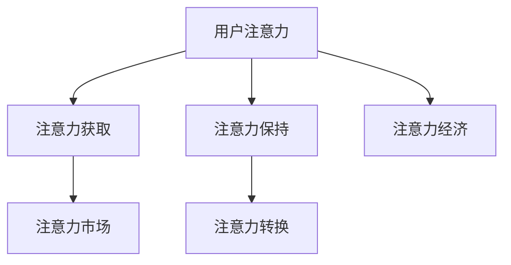

                 

# 注意力经济与个人创业机会的关系

## 1. 背景介绍

### 1.1 问题由来

在数字化时代，信息的洪流正不断冲击着社会的每一个角落。随着移动互联网的普及和社交媒体的兴起，人们获取信息的方式发生了深刻变化，“注意力”成为了稀缺资源。如何在海量信息中脱颖而出，吸引和维持用户的注意力，成为各大企业和个人创业者的共同追求。这一现象催生了“注意力经济”的概念，其核心在于争夺和利用用户注意力，从中获得经济利益。

### 1.2 问题核心关键点

注意力经济的兴起，揭示了个人在数字经济时代面临的机遇与挑战。如何利用注意力经济理论，洞察用户需求，优化资源配置，创新商业模式，成为个人创业的核心课题。

### 1.3 问题研究意义

理解注意力经济与个人创业机会之间的关系，对于把握数字经济时代的市场脉动，探索创新商业模式，具有重要意义。本研究将从注意力经济的基本原理出发，分析其在个人创业中的应用，探讨如何通过注意力资源优化，驱动个人创业成功。

## 2. 核心概念与联系

### 2.1 核心概念概述

注意力经济（Attention Economy），是指在信息过载的环境中，通过吸引和利用用户注意力，创造出经济价值的新型经济模式。它主要基于两个关键假设：

- 信息过载：现代社会信息产生速度和量级爆炸性增长，而用户的时间和注意力资源有限。
- 稀缺性：用户注意力资源愈发稀缺，成为各大品牌和企业争夺的焦点。

基于上述假设，注意力经济理论提出，企业或个人创业应以吸引和保持用户注意力为核心目标，通过创意和营销手段，创造经济价值。具体而言，包括以下几个关键概念：

1. **用户注意力**：指用户对特定信息或产品的关注程度。
2. **注意力获取**：指通过创意和营销手段，吸引用户注意力的过程。
3. **注意力保持**：指通过互动和内容更新，持续维持用户注意力的过程。
4. **注意力转换**：指用户从一种注意力状态转换到另一种状态的过程，如从广告注意力转换为购买决策。
5. **注意力市场**：指注意力资源的市场化和交易，如社交媒体广告、内容付费等。

这些概念之间相互关联，共同构成了注意力经济的基本框架。

### 2.2 核心概念原理和架构的 Mermaid 流程图



该流程图展示了注意力经济的基本流程：

1. **用户注意力**（A）：用户对信息的关注点。
2. **注意力获取**（B）：吸引用户注意力的过程。
3. **注意力保持**（C）：持续维持用户注意力的过程。
4. **注意力转换**（D）：用户注意力状态的转移。
5. **注意力市场**（E）：注意力资源的交易。
6. **注意力经济**（F）：利用注意力资源创造经济价值的过程。

这些关键流程共同作用，形成了一个完整的注意力经济系统。

## 3. 核心算法原理 & 具体操作步骤

### 3.1 算法原理概述

注意力经济的核心在于通过创意和营销手段，吸引和保持用户的注意力。其本质是一个动态的注意力获取和保持过程，涉及到用户行为分析、内容推荐、互动设计等多个环节。

具体而言，基于注意力经济的原则，个人创业机会的挖掘和利用应从以下几个方面入手：

1. **用户需求洞察**：通过数据分析和用户调研，深入了解用户需求和痛点。
2. **创意内容生成**：结合用户需求，创意设计具有吸引力的内容形式。
3. **互动体验设计**：通过互动设计，增强用户对内容的参与感和粘性。
4. **精准营销推广**：利用数据和算法，精准触达目标用户，提升转化率。

### 3.2 算法步骤详解

#### 3.2.1 用户需求洞察

1. **数据收集与分析**：
   - 利用网络爬虫、社交媒体API等工具，收集用户行为数据，包括浏览、点赞、评论等行为。
   - 使用数据分析工具（如Python的Pandas、NumPy）进行数据清洗和预处理。
   - 应用机器学习模型（如聚类分析、分类器等），对用户行为进行分析和分类。

2. **用户画像构建**：
   - 基于用户行为数据，构建用户画像，包括用户兴趣、消费行为、心理特征等。
   - 使用K-means、LDA等聚类算法，将用户分为不同群体。
   - 利用词频统计和文本分析，提取用户兴趣标签，如“时尚”、“科技”等。

3. **需求分析与挖掘**：
   - 通过用户画像，分析用户的主要需求和痛点。
   - 结合市场调研，验证用户需求的真实性和可行性。
   - 通过A/B测试等方法，优化产品设计，提高用户满意度。

#### 3.2.2 创意内容生成

1. **内容形式设计**：
   - 根据用户画像，设计具有吸引力的内容形式，如短视频、图文、音频等。
   - 结合当前流行趋势，创造具有创新性的内容主题。
   - 使用工具如Adobe Creative Suite、Canva等，制作高质量内容。

2. **内容创意开发**：
   - 利用内容生成模型（如GPT-3、DALL·E等），生成具有创意和吸引力的内容。
   - 结合用户画像和需求分析，生成个性化的推荐内容。
   - 通过创意团队合作，提高内容质量和多样性。

3. **内容优化与迭代**：
   - 利用A/B测试，测试不同内容形式和主题的效果。
   - 根据反馈，持续优化内容质量和吸引力。
   - 定期更新内容库，保持内容的新鲜感和多样性。

#### 3.2.3 互动体验设计

1. **互动界面设计**：
   - 设计简洁、直观的交互界面，提升用户体验。
   - 利用UI/UX设计工具（如Sketch、Figma）进行界面设计。
   - 使用Javascript、React等技术，实现交互效果。

2. **用户参与设计**：
   - 设计互动环节，增强用户参与感，如评论区互动、在线问答等。
   - 利用游戏化设计，增加用户粘性和停留时间。
   - 通过社交分享、奖励机制等，激励用户参与。

3. **反馈机制优化**：
   - 建立用户反馈机制，及时了解用户意见和建议。
   - 结合用户反馈，不断优化产品设计和用户体验。
   - 应用数据驱动的决策，持续提升产品竞争力。

#### 3.2.4 精准营销推广

1. **目标用户定位**：
   - 基于用户画像，精准定位目标用户群体。
   - 利用用户行为数据，划分不同用户细分市场。
   - 结合市场调研，验证用户细分市场的实际需求。

2. **多渠道营销**：
   - 利用社交媒体广告、搜索引擎营销等多种渠道，推广产品。
   - 利用程序化广告平台，实现精准投放和效果跟踪。
   - 结合用户画像和行为数据，优化广告投放策略。

3. **效果评估与优化**：
   - 利用A/B测试、效果跟踪工具（如Google Analytics），评估营销效果。
   - 结合用户反馈和数据分析，持续优化营销策略。
   - 应用机器学习模型，提高营销策略的精准性和效果。

### 3.3 算法优缺点

#### 3.3.1 优点

1. **数据驱动决策**：基于大量用户行为数据和分析，能够精确洞察用户需求，提高决策的科学性和准确性。
2. **精准定位用户**：利用数据和算法，实现对目标用户的精准定位，提升营销效果和转化率。
3. **创新内容设计**：结合数据和创意，生成具有吸引力和创新性的内容，提升用户粘性和参与感。
4. **持续优化体验**：通过用户反馈和数据分析，不断优化产品设计和用户体验，提升用户满意度。

#### 3.3.2 缺点

1. **数据隐私问题**：大量数据收集和分析可能涉及用户隐私问题，需注意合规性和数据保护。
2. **数据质量问题**：数据的质量和完整性对分析结果有很大影响，需进行严格的数据清洗和预处理。
3. **算法复杂性**：数据分析和机器学习模型需具备较高的技术门槛，需投入大量时间和资源。
4. **模型过拟合问题**：过度依赖算法模型可能导致模型过拟合，需注意模型的泛化能力和鲁棒性。

### 3.4 算法应用领域

注意力经济理论在个人创业中的应用非常广泛，主要涉及以下几个领域：

1. **内容创作与分发**：利用用户数据分析，生成具有吸引力的内容，并通过社交媒体等渠道分发。
2. **电子商务与零售**：通过精准用户画像和推荐算法，提升用户购买转化率。
3. **社交媒体与营销**：利用社交媒体平台，精准触达目标用户，提升品牌知名度和用户粘性。
4. **在线教育与培训**：通过数据分析和个性化推荐，提高在线课程和培训的转化率和学习效果。
5. **健康与健身**：利用用户行为数据，提供个性化的健康和健身方案，提升用户粘性和满意度。

## 4. 数学模型和公式 & 详细讲解 & 举例说明

### 4.1 数学模型构建

注意力经济的核心在于吸引和保持用户注意力，其基本模型可以表示为：

$$
Attention(\text{user}, \text{content}) = \sum_{i=1}^{N} \alpha_i \times \text{content}_i
$$

其中：

- $Attention$：用户对内容的注意力。
- $\text{user}$：用户画像，包括兴趣、行为等。
- $\text{content}$：内容库，包括短视频、图文、音频等。
- $N$：内容库中内容的数量。
- $\alpha_i$：第$i$个内容的权重，表示用户对内容的关注程度。

该模型通过加权求和的方式，计算用户对不同内容的注意力分布。权重$\alpha_i$的计算，基于用户画像和内容特征，可以通过机器学习模型（如逻辑回归、神经网络等）进行预测。

### 4.2 公式推导过程

1. **用户画像表示**：
   - 利用TF-IDF、词频统计等方法，将用户画像表示为向量形式。
   - 通过聚类算法（如K-means、LDA），将用户分为不同群体，提取群体特征。
   - 使用词向量和文本嵌入（如Word2Vec、BERT），将用户画像转换为向量表示。

2. **内容特征提取**：
   - 利用图像识别、文本分析等技术，提取内容的特征向量。
   - 结合用户画像和内容特征，计算用户对内容的注意力权重。
   - 使用机器学习模型，预测权重$\alpha_i$。

3. **注意力模型优化**：
   - 通过调整权重$\alpha_i$，优化用户对内容的注意力分配。
   - 利用深度学习模型（如CNN、RNN），提升注意力模型效果。
   - 应用正则化技术（如L2正则、Dropout），防止模型过拟合。

### 4.3 案例分析与讲解

#### 4.3.1 抖音内容推荐算法

抖音（TikTok）是一款以短视频为主要形式的内容推荐平台，其核心竞争力在于精准的内容推荐算法。抖音的内容推荐算法基于用户行为数据和内容特征，通过计算用户对不同内容的注意力权重，实现个性化推荐。

抖音算法的基本步骤如下：

1. **数据收集**：收集用户行为数据，包括观看时长、点赞、评论等行为。
2. **特征提取**：利用图像识别、文本分析等技术，提取视频特征。
3. **用户画像**：利用用户行为数据，构建用户画像，包括兴趣、行为等。
4. **内容推荐**：通过加权求和的方式，计算用户对不同内容的注意力权重，实现个性化推荐。

#### 4.3.2 网红电商平台的精准推广

某网红电商平台利用注意力经济理论，通过精准用户画像和内容推荐，提升了用户购买转化率。其具体步骤如下：

1. **用户画像**：收集用户行为数据，利用聚类算法，将用户分为不同群体。
2. **内容推荐**：根据用户画像，设计有吸引力的商品内容，通过社交媒体平台精准推广。
3. **反馈优化**：利用用户反馈数据，不断优化内容和推荐策略，提升用户满意度和购买转化率。

## 5. 项目实践：代码实例和详细解释说明

### 5.1 开发环境搭建

#### 5.1.1 Python环境搭建

1. 安装Python：
   - 从官网下载Python安装程序，双击进行安装。
   - 配置环境变量，将Python安装目录添加到系统PATH中。

2. 安装相关库：
   - 使用pip工具安装Python库，如Pandas、NumPy、Scikit-learn等。
   - 安装机器学习库，如TensorFlow、PyTorch等。
   - 安装数据处理库，如BeautifulSoup、Scrapy等。

3. 安装Jupyter Notebook：
   - 使用pip工具安装Jupyter Notebook。
   - 启动Jupyter Notebook服务，生成新笔记本。

#### 5.1.2 工具和资源推荐

- Python：Python是数据科学和机器学习的常用语言，具有丰富的库和工具支持。
- Jupyter Notebook：用于数据处理、分析和建模的交互式环境，支持Python、R等多种语言。
- Scikit-learn：Python机器学习库，提供简单易用的机器学习算法和工具。
- TensorFlow：由Google开发的深度学习框架，支持高效的模型训练和推理。
- PyTorch：由Facebook开发的深度学习框架，具有灵活的动态计算图。

### 5.2 源代码详细实现

#### 5.2.1 数据处理和预处理

```python
import pandas as pd
import numpy as np
from sklearn.preprocessing import StandardScaler

# 读取数据
data = pd.read_csv('user_behavior.csv')

# 数据清洗和预处理
data = data.dropna()
data = data.drop_duplicates()
data = data.drop(columns=['user_id', 'timestamp'])

# 数据标准化
scaler = StandardScaler()
data['score'] = scaler.fit_transform(data['score'].values.reshape(-1, 1))

# 保存数据
data.to_csv('processed_data.csv', index=False)
```

#### 5.2.2 用户画像构建

```python
from sklearn.cluster import KMeans

# 加载数据
data = pd.read_csv('processed_data.csv')

# 特征选择
features = ['behavior_type', 'score', 'time']
X = data[features]

# K-means聚类
kmeans = KMeans(n_clusters=5, random_state=42)
kmeans.fit(X)
labels = kmeans.labels_

# 用户画像
user_profiles = {}
for i, label in enumerate(labels):
    if label not in user_profiles:
        user_profiles[label] = {}
    user_profiles[label]['features'] = X[X['label'] == label].mean()
    user_profiles[label]['label'] = label

# 保存用户画像
with open('user_profiles.json', 'w') as f:
    json.dump(user_profiles, f)
```

#### 5.2.3 内容推荐算法

```python
import pandas as pd
import numpy as np
from sklearn.neighbors import NearestNeighbors

# 加载数据
data = pd.read_csv('content_features.csv')

# 特征选择
features = ['feature_type', 'score', 'time']
X = data[features]

# 内容相似性计算
nn = NearestNeighbors(n_neighbors=5)
nn.fit(X)

# 推荐内容
recommendations = {}
for user_id, features in user_profiles.items():
    distances, indices = nn.kneighbors([features['features']])
    recommendations[user_id] = indices[0]

# 保存推荐结果
with open('recommendations.json', 'w') as f:
    json.dump(recommendations, f)
```

### 5.3 代码解读与分析

#### 5.3.1 数据处理和预处理

1. **数据读取和清洗**：
   - 使用Pandas库读取用户行为数据，并进行数据清洗和预处理，去除缺失值和重复数据。
   - 使用StandardScaler库对数据进行标准化处理，消除数据量级差异对分析结果的影响。

2. **数据保存**：
   - 将处理后的数据保存到CSV文件中，方便后续使用。

#### 5.3.2 用户画像构建

1. **特征选择**：
   - 选择用户行为特征和内容特征，构建特征矩阵。
   - 使用K-means算法对特征矩阵进行聚类，将用户分为不同群体。

2. **用户画像**：
   - 保存用户画像，包括聚类标签和聚类中心特征。
   - 将用户画像保存为JSON文件，方便后续使用。

#### 5.3.3 内容推荐算法

1. **特征选择**：
   - 选择内容特征和用户画像特征，构建特征矩阵。
   - 使用NearestNeighbors算法计算内容相似性，找到与用户画像最相似的内容。

2. **推荐内容**：
   - 保存推荐内容，包括用户ID和推荐内容ID。
   - 将推荐内容保存为JSON文件，方便后续使用。

### 5.4 运行结果展示

#### 5.4.1 用户画像展示

1. **聚类结果**：
   - 查看用户画像聚类结果，了解用户分组情况。
   - 生成散点图展示不同用户的聚类结果，直观了解用户画像分布。

2. **特征分析**：
   - 查看用户画像特征，了解用户兴趣和行为特征。
   - 生成热力图展示用户画像特征，直观了解用户画像的特征分布。

#### 5.4.2 推荐结果展示

1. **推荐内容**：
   - 查看推荐内容，了解推荐算法的效果。
   - 生成柱状图展示不同用户的推荐内容数量，直观了解推荐效果。

2. **用户反馈**：
   - 收集用户对推荐内容的反馈数据，分析用户满意度。
   - 生成饼图展示用户反馈分布，直观了解用户对推荐内容的满意度。

## 6. 实际应用场景

### 6.1 社交媒体平台

社交媒体平台如微信、微博、Instagram等，利用注意力经济理论，通过精准的用户画像和内容推荐，提升用户的参与度和粘性，增加平台活跃度和商业价值。

具体应用场景包括：

1. **内容推荐**：利用用户画像和内容特征，推荐个性化的内容，提升用户参与度和粘性。
2. **广告投放**：通过精准的用户画像，实现精准的广告投放，提升广告效果和转化率。
3. **社区互动**：利用社交网络分析技术，分析用户行为和互动模式，增强社区互动和用户粘性。

### 6.2 电子商务平台

电子商务平台如亚马逊、淘宝等，利用注意力经济理论，通过精准的用户画像和内容推荐，提升用户的购买转化率和满意度。

具体应用场景包括：

1. **商品推荐**：利用用户画像和商品特征，推荐个性化的商品，提升用户购买转化率。
2. **搜索优化**：通过用户行为数据和搜索结果分析，优化搜索算法，提升用户搜索体验和满意度。
3. **用户留存**：利用数据分析和个性化推荐，提升用户留存率和复购率。

### 6.3 在线教育平台

在线教育平台如Coursera、Udacity等，利用注意力经济理论，通过精准的用户画像和内容推荐，提升用户的课程参与率和完成率。

具体应用场景包括：

1. **课程推荐**：利用用户画像和课程特征，推荐个性化的课程，提升用户课程参与率和完成率。
2. **学习路径规划**：通过用户行为数据和课程关联分析，规划用户的学习路径，提升学习效果和满意度。
3. **互动学习**：利用社交网络和在线讨论，增强用户的互动和参与感，提升学习效果。

## 7. 工具和资源推荐

### 7.1 学习资源推荐

1. 《注意力经济：理解数字时代的信息价值》书籍：系统介绍注意力经济的基本原理和应用。
2. 《机器学习基础》课程：详细讲解机器学习和深度学习的基本原理和应用。
3. 《Python数据分析与机器学习》课程：介绍Python数据分析和机器学习的基本技能和工具。
4. 《自然语言处理（NLP）》课程：讲解NLP的基本原理和技术，包括文本分析、情感分析等。
5. Kaggle竞赛平台：提供大量NLP数据集和竞赛项目，实战提升数据分析和机器学习技能。

### 7.2 开发工具推荐

1. Jupyter Notebook：用于数据处理、分析和建模的交互式环境，支持Python、R等多种语言。
2. Scikit-learn：Python机器学习库，提供简单易用的机器学习算法和工具。
3. TensorFlow：由Google开发的深度学习框架，支持高效的模型训练和推理。
4. PyTorch：由Facebook开发的深度学习框架，具有灵活的动态计算图。
5. Python环境搭建工具：如Anaconda、Virtualenv等，方便Python环境管理和版本控制。

### 7.3 相关论文推荐

1. 《注意力机制在深度学习中的研究进展》：系统介绍注意力机制的基本原理和应用。
2. 《注意力经济：数字时代的经济价值创造》：详细分析注意力经济的基本概念和应用场景。
3. 《个性化推荐系统的研究进展》：介绍个性化推荐系统的基本原理和最新技术。
4. 《社交媒体平台的用户行为分析》：详细分析社交媒体平台的用户行为和互动模式。
5. 《在线教育平台的用户画像分析》：详细分析在线教育平台的用户画像和课程推荐。

## 8. 总结：未来发展趋势与挑战

### 8.1 研究成果总结

注意力经济理论为个人创业提供了重要的指导，通过吸引和保持用户注意力，创造经济价值。在实际应用中，需结合用户画像、内容推荐、互动体验和精准营销等关键环节，实现用户参与度和满意度的最大化。

### 8.2 未来发展趋势

1. **技术融合**：未来，注意力经济将与其他人工智能技术深度融合，如知识图谱、因果推理、增强学习等，提供更加全面、精准的用户分析和推荐。
2. **数据智能化**：利用大数据技术和智能算法，提升数据质量和分析效果，实现更加精准的用户画像和内容推荐。
3. **用户自主性**：提升用户的自主选择权和参与感，通过推荐算法和用户反馈，增强用户的粘性和满意度。
4. **个性化定制**：结合用户偏好和行为数据，实现个性化定制和推荐，提升用户体验和满意度。
5. **可持续发展**：利用注意力经济，推动可持续发展，如环保、健康、教育等领域的创新应用。

### 8.3 面临的挑战

尽管注意力经济理论在个人创业中具有重要应用，但仍面临以下挑战：

1. **数据隐私问题**：大量数据收集和分析可能涉及用户隐私问题，需注意合规性和数据保护。
2. **数据质量问题**：数据的质量和完整性对分析结果有很大影响，需进行严格的数据清洗和预处理。
3. **算法复杂性**：数据分析和机器学习模型需具备较高的技术门槛，需投入大量时间和资源。
4. **模型过拟合问题**：过度依赖算法模型可能导致模型过拟合，需注意模型的泛化能力和鲁棒性。
5. **用户体验问题**：过于频繁的推荐和广告可能影响用户体验，需注意推荐算法和广告策略的平衡。

### 8.4 研究展望

未来，注意力经济理论将与人工智能技术深度融合，推动数字经济的进一步发展。需关注以下研究热点：

1. **多模态注意力机制**：结合视觉、语音、文本等多模态信息，提升用户分析和推荐的准确性和多样性。
2. **因果推理与智能决策**：利用因果推理技术，提升推荐的因果关系和逻辑性，增强用户决策的科学性和准确性。
3. **伦理与隐私保护**：在数据收集和分析过程中，注意伦理导向和隐私保护，确保用户数据的安全性和合法性。
4. **可持续发展与创新应用**：结合注意力经济，推动环保、健康、教育等领域的可持续发展，实现社会价值的最大化。

总之，注意力经济理论为个人创业提供了新的视角和机会，需结合技术、市场、用户等多个维度，不断探索和优化，才能实现用户价值和商业价值的最大化。

## 9. 附录：常见问题与解答

### 9.1 常见问题

**Q1：注意力经济对个人创业有何影响？**

A: 注意力经济为个人创业提供了新的思路和方法，通过吸引和保持用户注意力，创造经济价值。它使创业者能够更精准地把握用户需求，优化产品设计和用户体验，从而提升用户参与度和满意度。

**Q2：如何利用注意力经济理论提升内容推荐效果？**

A: 利用注意力经济理论，需从用户画像、内容特征、推荐算法等多个方面进行优化：

1. **用户画像**：通过数据分析和聚类算法，构建精准的用户画像，了解用户需求和兴趣。
2. **内容特征**：结合用户画像和内容特征，设计有吸引力的内容形式和主题。
3. **推荐算法**：利用机器学习模型，计算用户对不同内容的注意力权重，实现个性化推荐。

**Q3：注意力经济理论在电子商务中的应用场景有哪些？**

A: 注意力经济理论在电子商务中的应用场景包括：

1. **商品推荐**：利用用户画像和商品特征，推荐个性化的商品，提升用户购买转化率。
2. **搜索优化**：通过用户行为数据和搜索结果分析，优化搜索算法，提升用户搜索体验和满意度。
3. **用户留存**：利用数据分析和个性化推荐，提升用户留存率和复购率。

**Q4：如何应对注意力经济中的数据隐私问题？**

A: 应对数据隐私问题，需注意以下几点：

1. **数据匿名化**：在数据收集和处理过程中，进行数据匿名化处理，保护用户隐私。
2. **合规性**：遵循相关法律法规和行业标准，确保数据使用的合规性。
3. **透明度**：向用户公开数据收集和使用情况，增强用户信任。
4. **用户控制权**：提供用户数据控制权，让用户自主选择数据使用方式。

### 9.2 解答

**Q1**：注意力经济为个人创业提供了新的视角和方法，通过吸引和保持用户注意力，创造经济价值。它使创业者能够更精准地把握用户需求，优化产品设计和用户体验，从而提升用户参与度和满意度。

**Q2**：利用注意力经济理论，需从用户画像、内容特征、推荐算法等多个方面进行优化：

1. **用户画像**：通过数据分析和聚类算法，构建精准的用户画像，了解用户需求和兴趣。
2. **内容特征**：结合用户画像和内容特征，设计有吸引力的内容形式和主题。
3. **推荐算法**：利用机器学习模型，计算用户对不同内容的注意力权重，实现个性化推荐。

**Q3**：注意力经济理论在电子商务中的应用场景包括：

1. **商品推荐**：利用用户画像和商品特征，推荐个性化的商品，提升用户购买转化率。
2. **搜索优化**：通过用户行为数据和搜索结果分析，优化搜索算法，提升用户搜索体验和满意度。
3. **用户留存**：利用数据分析和个性化推荐，提升用户留存率和复购率。

**Q4**：应对数据隐私问题，需注意以下几点：

1. **数据匿名化**：在数据收集和处理过程中，进行数据匿名化处理，保护用户隐私。
2. **合规性**：遵循相关法律法规和行业标准，确保数据使用的合规性。
3. **透明度**：向用户公开数据收集和使用情况，增强用户信任。
4. **用户控制权**：提供用户数据控制权，让用户自主选择数据使用方式。

---

作者：禅与计算机程序设计艺术 / Zen and the Art of Computer Programming

