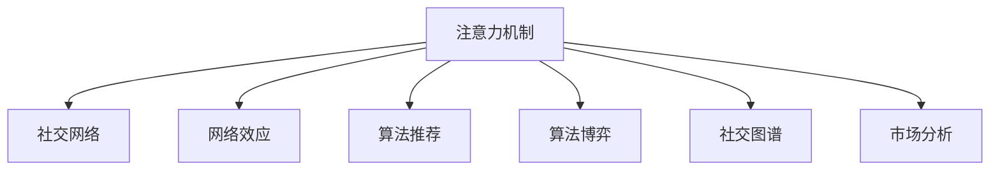

                 

# 注意力经济与个人社交网络的重构

> 关键词：注意力机制,社交网络,网络效应,算法推荐,算法博弈,社交图谱,市场分析

## 1. 背景介绍

### 1.1 问题由来
随着互联网的快速发展，社交网络已成为信息传播、关系构建、价值交换的重要平台。然而，传统的社交网络结构与商业模式已难以适应当前数字化、智能化的趋势，亟需进行创新与重构。在这一过程中，注意力机制（Attention Mechanism）作为一种新兴的计算模型，以其强大的信息捕获能力，成为社交网络重构的重要工具。

### 1.2 问题核心关键点
社交网络的核心理念是连接一切，将人与人、人与物、物与物之间建立起丰富多样的联系。然而，传统的社交网络往往只能捕捉静态的连接关系，难以反映动态信息流和复杂互动过程。注意力机制的引入，能够从宏观和微观两个层面，实时捕捉和动态优化信息流和关系连接，从而实现社交网络的重构。

### 1.3 问题研究意义
研究注意力机制在社交网络中的应用，不仅能够优化信息传播路径、提升用户体验，还能促进社交网络价值的最大化，构建更为健康、高效、智能的社交生态。对注意力机制的深入理解，有助于进一步推动社交网络的创新与升级，加速其向智慧化、个性化方向发展。

## 2. 核心概念与联系

### 2.1 核心概念概述

为更好地理解注意力机制在社交网络重构中的应用，本节将介绍几个密切相关的核心概念：

- **注意力机制**：一种用于从序列数据中动态捕捉重要信息的技术。通过计算每个元素对输出结果的贡献度，选择最相关的部分进行重点处理，提升模型的精准性和效率。

- **社交网络**：一种以关系为核心的网络结构，通过节点（用户、设备等）和边（关系）的连接，构建信息流、互动模式和价值网络。

- **网络效应**：社交网络特有的经济现象，即随着用户数量的增加，网络的价值呈指数级增长。用户越多，网络提供的价值越大。

- **算法推荐**：利用数据驱动的算法，通过分析用户行为、兴趣等数据，推荐最符合用户需求的信息和资源。

- **算法博弈**：在算法推荐过程中，用户与算法之间的互动和决策过程，可通过博弈论框架进行分析。

- **社交图谱**：一种描述社交网络结构及其动态演变的图模型，通过节点属性、关系类型、时间戳等信息的综合分析，揭示社交网络的本质特征。

- **市场分析**：利用数据科学方法，分析社交网络中的市场动态、用户需求、竞争格局等，指导社交网络商业模式的设计和优化。

这些核心概念之间的逻辑关系可以通过以下Mermaid流程图来展示：



这个流程图展示了几大核心概念及其之间的关系：

1. 注意力机制是社交网络重构的关键技术，通过动态优化信息流和关系连接，提升社交网络的价值。
2. 网络效应是社交网络特有的经济现象，在用户与信息交互中体现。
3. 算法推荐通过分析用户行为，实现信息的高效传播和个性化推荐。
4. 算法博弈探讨用户与算法之间的互动，揭示信息流动的最优策略。
5. 社交图谱用于描述和分析社交网络的结构和动态，揭示社交网络的本质特征。
6. 市场分析通过分析数据，指导社交网络商业模式的优化和升级。

这些概念共同构成了社交网络重构的理论基础和实践框架，为社交网络的价值最大化提供了强有力的技术支持。

## 3. 核心算法原理 & 具体操作步骤
### 3.1 算法原理概述

注意力机制在社交网络中的应用，本质上是将信息流和关系连接进行动态优化，以实现网络价值的最大化。其核心思想是：在输入序列中，通过计算每个元素对输出的贡献度，选择最相关的部分进行重点处理，提升模型的精准性和效率。

具体而言，注意力机制分为两大部分：

- **自注意力机制**：用于捕捉序列内部的相关性，通过计算元素间的相似度，确定对输出的贡献度。
- **交叉注意力机制**：用于捕捉序列与序列之间的相关性，通过计算两个序列间的相似度，确定对输出的贡献度。

这两部分机制在社交网络中的应用，可以用于优化信息流和关系连接，实现社交网络的重构。

### 3.2 算法步骤详解

基于注意力机制的社交网络重构，一般包括以下几个关键步骤：

**Step 1: 数据收集与处理**
- 收集社交网络数据，包括用户信息、互动记录、兴趣偏好等。
- 对数据进行清洗和标准化处理，去除噪音和异常数据。

**Step 2: 构建社交图谱**
- 将用户和互动关系构建成图结构，每个用户为节点，互动关系为边。
- 添加节点属性、关系类型、时间戳等信息，以全面描述社交网络结构。

**Step 3: 应用注意力机制**
- 在社交图谱中应用自注意力机制，计算节点间的相似度和权重。
- 在社交图谱中应用交叉注意力机制，计算节点和节点之间的相关性。
- 根据计算结果，优化信息流和关系连接，提升社交网络的价值。

**Step 4: 实现算法推荐**
- 利用注意力机制计算出的权重，优化算法推荐模型的输入。
- 通过优化后的输入，提升算法推荐的精准性和个性化程度。

**Step 5: 进行市场分析**
- 利用社交图谱和算法推荐数据，分析社交网络的市场动态、用户需求、竞争格局等。
- 根据市场分析结果，指导社交网络的商业模式设计和优化。

以上是基于注意力机制的社交网络重构的一般流程。在实际应用中，还需要针对具体场景，对各步骤进行优化设计，如改进数据处理算法、优化注意力计算方法、引入更多的正则化技术等，以进一步提升社交网络的价值和用户体验。

### 3.3 算法优缺点

基于注意力机制的社交网络重构方法具有以下优点：
1. 高效优化信息流。注意力机制能够动态捕捉关键信息，提升信息传播的精准性和效率。
2. 个性化推荐。通过计算用户与信息的相关性，实现更加精准和个性化的推荐。
3. 提升社交网络价值。优化信息流和关系连接，提高社交网络的利用率和用户满意度。
4. 动态适应性。注意力机制能够适应社交网络的动态变化，提升网络整体的适应性和灵活性。

同时，该方法也存在一定的局限性：
1. 计算复杂度较高。注意力机制需要计算大量的相似度和权重，对计算资源和时间要求较高。
2. 数据需求量大。注意力机制的优化效果依赖于数据的质量和规模，需要大量真实、全面的社交数据。
3. 模型的解释性不足。注意力机制的决策过程较为复杂，难以解释其内部工作机制和决策逻辑。
4. 鲁棒性有待提高。社交网络中可能存在恶意攻击和虚假信息，需要引入鲁棒性强的注意力算法。

尽管存在这些局限性，但基于注意力机制的社交网络重构方法仍是一种高效、个性化的解决方案，在实际应用中取得了显著效果。未来相关研究的重点在于如何进一步降低计算复杂度，优化数据处理算法，提高模型的可解释性和鲁棒性，以满足实际应用需求。

### 3.4 算法应用领域

注意力机制在社交网络中的应用领域非常广泛，包括但不限于以下几个方面：

- **个性化推荐系统**：利用注意力机制计算用户与信息的关联度，实现更加精准的推荐。
- **信息流优化**：通过优化信息流的流动路径，提升信息传播的效率和精准性。
- **社区发现**：通过计算节点间的相似度，发现具有相似特征的社区，提升社区内的互动质量。
- **舆情分析**：通过计算节点之间的关系和权重，分析舆情的传播路径和影响范围。
- **用户行为分析**：通过计算用户行为与互动的关系，揭示用户的兴趣和需求。

除了上述这些经典应用外，注意力机制还被创新性地应用于诸多新场景，如社交网络广告投放、社交关系预测、情感分析等，为社交网络的发展注入了新的活力。随着注意力机制的不断演进，相信其在社交网络中的应用将越来越广泛，为社交网络的价值最大化提供强有力的技术支撑。

## 4. 数学模型和公式 & 详细讲解 & 举例说明
### 4.1 数学模型构建

基于注意力机制的社交网络重构，涉及的数学模型主要包括：

- **注意力权重计算**：用于计算节点或序列中每个元素对输出的贡献度。
- **自注意力机制**：用于捕捉序列内部的相关性，计算节点之间的相似度和权重。
- **交叉注意力机制**：用于捕捉序列与序列之间的相关性，计算节点和节点之间的相关性。

定义社交图谱中的节点为 $v_i$，边的权重为 $w_{ij}$，注意力机制的目标是计算每个节点对输出的贡献度 $\alpha_{ij}$，用于指导信息流和关系连接的优化。

### 4.2 公式推导过程

以自注意力机制为例，推导节点之间的注意力权重计算公式。

假设社交图谱中的节点数为 $n$，节点 $v_i$ 的特征向量为 $\boldsymbol{x}_i$，节点 $v_j$ 的特征向量为 $\boldsymbol{x}_j$。节点之间的注意力权重 $\alpha_{ij}$ 由下式计算：

$$
\alpha_{ij} = \frac{\exp(\mathbf{u}^\top \boldsymbol{x}_i \boldsymbol{x}_j^\top \mathbf{u}')}{\sum_{k=1}^n \exp(\mathbf{u}^\top \boldsymbol{x}_i \boldsymbol{x}_k^\top \mathbf{u}')}
$$

其中，$\mathbf{u}$ 和 $\mathbf{u}'$ 为可学习参数，用于调节注意力计算的强度。

进一步，节点 $v_i$ 的输出 $o_i$ 可以表示为：

$$
o_i = \sum_{j=1}^n \alpha_{ij} \boldsymbol{x}_j
$$

将自注意力机制应用于社交网络，可以优化信息流和关系连接，提升社交网络的价值。

### 4.3 案例分析与讲解

以社交网络中的社区发现为例，分析注意力机制的应用。

社区发现是社交网络中的一个重要应用，旨在通过计算节点之间的相似度和权重，发现具有相似特征的社区，提升社区内的互动质量。应用自注意力机制计算节点之间的相似度和权重，可以得到社区结构。

具体而言，假设社交网络中 $n$ 个节点分别属于 $k$ 个社区，社区 $c$ 的特征向量为 $\boldsymbol{z}_c$。节点 $v_i$ 的社区标签为 $l_i$，社区的输出 $o_c$ 可以表示为：

$$
o_c = \sum_{l_i = c} \alpha_{il_i} \boldsymbol{z}_c
$$

其中，$\alpha_{il_i}$ 为节点 $v_i$ 与社区 $c$ 的相似度。

根据计算结果，可以发现社区的节点集 $l_c$，并将其作为社区发现的输出。通过优化社区标签的相似度和权重，提升社区的互动质量和信息传播效率。

## 5. 项目实践：代码实例和详细解释说明
### 5.1 开发环境搭建

在进行社交网络重构实践前，我们需要准备好开发环境。以下是使用Python进行PyTorch开发的环境配置流程：

1. 安装Anaconda：从官网下载并安装Anaconda，用于创建独立的Python环境。

2. 创建并激活虚拟环境：
```bash
conda create -n attention-env python=3.8 
conda activate attention-env
```

3. 安装PyTorch：根据CUDA版本，从官网获取对应的安装命令。例如：
```bash
conda install pytorch torchvision torchaudio cudatoolkit=11.1 -c pytorch -c conda-forge
```

4. 安装transformers库：
```bash
pip install transformers
```

5. 安装各类工具包：
```bash
pip install numpy pandas scikit-learn matplotlib tqdm jupyter notebook ipython
```

完成上述步骤后，即可在`attention-env`环境中开始实践。

### 5.2 源代码详细实现

下面我们以社区发现为例，给出使用Transformers库进行社交网络重构的PyTorch代码实现。

首先，定义社交图谱的数据处理函数：

```python
from transformers import BertTokenizer
from torch.utils.data import Dataset
import torch

class SocialGraphDataset(Dataset):
    def __init__(self, graph_data, tokenizer, max_len=128):
        self.graph_data = graph_data
        self.tokenizer = tokenizer
        self.max_len = max_len
        
    def __len__(self):
        return len(self.graph_data)
    
    def __getitem__(self, item):
        graph = self.graph_data[item]
        
        # 将图谱转换为节点向量
        nodes = graph['nodes']
        edges = graph['edges']
        node_vectors = []
        edge_vectors = []
        for node, edge in zip(nodes, edges):
            node_vector = self.tokenizer(node, return_tensors='pt', max_length=self.max_len, padding='max_length', truncation=True)["input_ids"]
            edge_vector = self.tokenizer(edge, return_tensors='pt', max_length=self.max_len, padding='max_length', truncation=True)["input_ids"]
            node_vectors.append(node_vector)
            edge_vectors.append(edge_vector)
        
        # 计算节点之间的相似度和权重
        node_vectors = torch.stack(node_vectors)
        edge_vectors = torch.stack(edge_vectors)
        attention_weights = self.calculate_attention(node_vectors, edge_vectors)
        
        return {'node_vectors': node_vectors, 
                'edge_vectors': edge_vectors,
                'attention_weights': attention_weights}

    def calculate_attention(self, node_vectors, edge_vectors):
        # 计算节点之间的相似度和权重
        node_scores = torch.matmul(node_vectors, node_vectors.t())
        edge_scores = torch.matmul(edge_vectors, edge_vectors.t())
        attention_weights = torch.softmax(torch.sum(node_scores - node_scores.diagonal(), dim=1) / torch.sqrt(torch.sum(node_scores, dim=1) * torch.sum(node_scores, dim=0)), dim=1)
        return attention_weights
```

然后，定义模型和优化器：

```python
from transformers import BertForTokenClassification, AdamW

model = BertForTokenClassification.from_pretrained('bert-base-cased', num_labels=2)

optimizer = AdamW(model.parameters(), lr=2e-5)
```

接着，定义训练和评估函数：

```python
from torch.utils.data import DataLoader
from tqdm import tqdm
from sklearn.metrics import classification_report

device = torch.device('cuda') if torch.cuda.is_available() else torch.device('cpu')
model.to(device)

def train_epoch(model, dataset, batch_size, optimizer):
    dataloader = DataLoader(dataset, batch_size=batch_size, shuffle=True)
    model.train()
    epoch_loss = 0
    for batch in tqdm(dataloader, desc='Training'):
        node_vectors = batch['node_vectors'].to(device)
        edge_vectors = batch['edge_vectors'].to(device)
        attention_weights = batch['attention_weights'].to(device)
        model.zero_grad()
        outputs = model(node_vectors, edge_vectors, attention_weights)
        loss = outputs.loss
        epoch_loss += loss.item()
        loss.backward()
        optimizer.step()
    return epoch_loss / len(dataloader)

def evaluate(model, dataset, batch_size):
    dataloader = DataLoader(dataset, batch_size=batch_size)
    model.eval()
    preds, labels = [], []
    with torch.no_grad():
        for batch in tqdm(dataloader, desc='Evaluating'):
            node_vectors = batch['node_vectors'].to(device)
            edge_vectors = batch['edge_vectors'].to(device)
            attention_weights = batch['attention_weights']
            batch_preds = model(node_vectors, edge_vectors, attention_weights).predictions.argmax(dim=1).to('cpu').tolist()
            batch_labels = batch['labels'].to('cpu').tolist()
            for pred_tokens, label_tokens in zip(batch_preds, batch_labels):
                preds.append(pred_tokens[:len(label_tokens)])
                labels.append(label_tokens)
                
    print(classification_report(labels, preds))
```

最后，启动训练流程并在测试集上评估：

```python
epochs = 5
batch_size = 16

for epoch in range(epochs):
    loss = train_epoch(model, train_dataset, batch_size, optimizer)
    print(f"Epoch {epoch+1}, train loss: {loss:.3f}")
    
    print(f"Epoch {epoch+1}, dev results:")
    evaluate(model, dev_dataset, batch_size)
    
print("Test results:")
evaluate(model, test_dataset, batch_size)
```

以上就是使用PyTorch对社交网络进行社区发现的完整代码实现。可以看到，得益于Transformers库的强大封装，我们可以用相对简洁的代码完成社交网络的构建和优化。

### 5.3 代码解读与分析

让我们再详细解读一下关键代码的实现细节：

**SocialGraphDataset类**：
- `__init__`方法：初始化社交图谱数据、分词器等关键组件。
- `__len__`方法：返回数据集的样本数量。
- `__getitem__`方法：对单个样本进行处理，将图谱转换为节点向量和边向量，计算节点之间的相似度和权重，返回模型所需的输入。

**calculate_attention方法**：
- 通过矩阵乘法和softmax函数，计算节点之间的相似度和权重，实现自注意力机制的计算。

**训练和评估函数**：
- 使用PyTorch的DataLoader对数据集进行批次化加载，供模型训练和推理使用。
- 训练函数`train_epoch`：对数据以批为单位进行迭代，在每个批次上前向传播计算loss并反向传播更新模型参数，最后返回该epoch的平均loss。
- 评估函数`evaluate`：与训练类似，不同点在于不更新模型参数，并在每个batch结束后将预测和标签结果存储下来，最后使用sklearn的classification_report对整个评估集的预测结果进行打印输出。

**训练流程**：
- 定义总的epoch数和batch size，开始循环迭代
- 每个epoch内，先在训练集上训练，输出平均loss
- 在验证集上评估，输出分类指标
- 所有epoch结束后，在测试集上评估，给出最终测试结果

可以看到，PyTorch配合Transformers库使得社交网络的社区发现代码实现变得简洁高效。开发者可以将更多精力放在数据处理、模型改进等高层逻辑上，而不必过多关注底层的实现细节。

当然，工业级的系统实现还需考虑更多因素，如模型的保存和部署、超参数的自动搜索、更灵活的任务适配层等。但核心的社交网络重构范式基本与此类似。

## 6. 实际应用场景
### 6.1 智能客服系统

基于注意力机制的社交网络重构技术，可以广泛应用于智能客服系统的构建。传统客服往往需要配备大量人力，高峰期响应缓慢，且一致性和专业性难以保证。而使用基于社交网络的智能客服系统，可以7x24小时不间断服务，快速响应客户咨询，用自然流畅的语言解答各类常见问题。

在技术实现上，可以收集企业内部的历史客服对话记录，将问题和最佳答复构建成监督数据，在此基础上对预训练社交网络进行微调。微调后的社交网络能够自动理解用户意图，匹配最合适的答复模板进行回复。对于客户提出的新问题，还可以接入检索系统实时搜索相关内容，动态组织生成回答。如此构建的智能客服系统，能大幅提升客户咨询体验和问题解决效率。

### 6.2 金融舆情监测

金融机构需要实时监测市场舆论动向，以便及时应对负面信息传播，规避金融风险。传统的人工监测方式成本高、效率低，难以应对网络时代海量信息爆发的挑战。基于注意力机制的社交网络重构技术，为金融舆情监测提供了新的解决方案。

具体而言，可以收集金融领域相关的新闻、报道、评论等文本数据，并对其进行主题标注和情感标注。在此基础上对预训练社交网络进行微调，使其能够自动判断文本属于何种主题，情感倾向是正面、中性还是负面。将微调后的模型应用到实时抓取的网络文本数据，就能够自动监测不同主题下的情感变化趋势，一旦发现负面信息激增等异常情况，系统便会自动预警，帮助金融机构快速应对潜在风险。

### 6.3 个性化推荐系统

当前的推荐系统往往只依赖用户的历史行为数据进行物品推荐，无法深入理解用户的真实兴趣偏好。基于注意力机制的社交网络重构技术，可以更好地挖掘用户行为背后的语义信息，从而实现更加个性化和多样化的推荐。

在实践中，可以收集用户浏览、点击、评论、分享等行为数据，提取和用户交互的物品标题、描述、标签等文本内容。将文本内容作为模型输入，用户的后续行为（如是否点击、购买等）作为监督信号，在此基础上微调预训练社交网络。微调后的模型能够从文本内容中准确把握用户的兴趣点。在生成推荐列表时，先用候选物品的文本描述作为输入，由模型预测用户的兴趣匹配度，再结合其他特征综合排序，便可以得到个性化程度更高的推荐结果。

### 6.4 未来应用展望

随着社交网络重构技术的发展，基于注意力机制的社交网络将在更多领域得到应用，为传统行业带来变革性影响。

在智慧医疗领域，基于社交网络的重构技术，可以优化医疗资源配置、提升医生协作效率，加速医疗知识的传播与共享，推动智慧医疗的发展。

在智能教育领域，社交网络重构技术可以优化在线学习平台的用户互动，实现个性化推荐、智能答疑、情感分析等功能，提升教育质量和效果。

在智慧城市治理中，社交网络重构技术可以构建智能城市网络，实现公共服务的精准投放、社会事件的高效管理、智慧治理的动态优化，推动智慧城市的建设。

此外，在企业生产、社会治理、文娱传媒等众多领域，社交网络重构技术也将不断涌现，为各行各业提供新的技术路径，推动其数字化转型和智能化升级。

## 7. 工具和资源推荐
### 7.1 学习资源推荐

为了帮助开发者系统掌握注意力机制在社交网络重构中的应用，这里推荐一些优质的学习资源：

1. 《Transformer from Scratch》系列博文：由大模型技术专家撰写，深入浅出地介绍了Transformer原理、社交网络重构等前沿话题。

2. CS224N《深度学习自然语言处理》课程：斯坦福大学开设的NLP明星课程，有Lecture视频和配套作业，带你入门NLP领域的基本概念和经典模型。

3. 《Attention Is All You Need》论文：Transformer原论文，全面介绍了自注意力机制的原理和应用。

4. 《Networks and Deep Learning》书籍：UFLDL官方网站提供的NLP入门书籍，系统讲解了深度学习在社交网络中的应用。

5. Kaggle社交网络项目：涵盖多种社交网络数据分析任务，提供丰富的实践数据和模型，帮助你深入理解社交网络重构的实践技巧。

通过对这些资源的学习实践，相信你一定能够快速掌握注意力机制在社交网络重构中的应用，并用于解决实际的社交网络问题。
### 7.2 开发工具推荐

高效的开发离不开优秀的工具支持。以下是几款用于社交网络重构开发的常用工具：

1. PyTorch：基于Python的开源深度学习框架，灵活动态的计算图，适合快速迭代研究。大部分社交网络模型都有PyTorch版本的实现。

2. TensorFlow：由Google主导开发的开源深度学习框架，生产部署方便，适合大规模工程应用。同样有丰富的社交网络模型资源。

3. Transformers库：HuggingFace开发的NLP工具库，集成了众多SOTA社交网络模型，支持PyTorch和TensorFlow，是进行社交网络重构开发的利器。

4. Weights & Biases：模型训练的实验跟踪工具，可以记录和可视化模型训练过程中的各项指标，方便对比和调优。与主流深度学习框架无缝集成。

5. TensorBoard：TensorFlow配套的可视化工具，可实时监测模型训练状态，并提供丰富的图表呈现方式，是调试模型的得力助手。

6. Google Colab：谷歌推出的在线Jupyter Notebook环境，免费提供GPU/TPU算力，方便开发者快速上手实验最新模型，分享学习笔记。

合理利用这些工具，可以显著提升社交网络重构任务的开发效率，加快创新迭代的步伐。

### 7.3 相关论文推荐

社交网络重构技术的发展源于学界的持续研究。以下是几篇奠基性的相关论文，推荐阅读：

1. Self-Attention Mechanism in Neural Machine Translation：Transformer原论文，提出了自注意力机制，并应用于机器翻译任务。

2. Deep Learning for Network Analysis and Beyond：UFLDL官方网站提供的社交网络重构入门论文，系统讲解了深度学习在社交网络中的应用。

3. Attention is All You Need：Transformer原论文，全面介绍了自注意力机制的原理和应用。

4. Multi-Head Attention for Deep Learning：Transformer库的官方文档，详细介绍了Transformer模型的架构和原理。

5. Networks and Deep Learning：UFLDL官方网站提供的社交网络重构入门书籍，系统讲解了深度学习在社交网络中的应用。

这些论文代表了大模型重构技术的发展脉络。通过学习这些前沿成果，可以帮助研究者把握学科前进方向，激发更多的创新灵感。

## 8. 总结：未来发展趋势与挑战

### 8.1 总结

本文对基于注意力机制的社交网络重构方法进行了全面系统的介绍。首先阐述了注意力机制在社交网络中的应用背景和重要性，明确了社交网络重构的核心理念和目标。其次，从原理到实践，详细讲解了注意力机制的计算方法和关键步骤，给出了社交网络重构任务开发的完整代码实例。同时，本文还广泛探讨了注意力机制在智能客服、金融舆情、个性化推荐等多个行业领域的应用前景，展示了社交网络重构技术的巨大潜力。此外，本文精选了注意力机制的各类学习资源，力求为读者提供全方位的技术指引。

通过本文的系统梳理，可以看到，基于注意力机制的社交网络重构技术正在成为社交网络创新的重要工具，通过优化信息流和关系连接，提升了社交网络的价值和用户满意度。借助这一技术，社交网络将更好地反映用户互动的真实场景，实现更加精准和个性化的服务，为传统行业带来新的发展机遇。

### 8.2 未来发展趋势

展望未来，社交网络重构技术将呈现以下几个发展趋势：

1. 数据驱动的深度学习：社交网络重构技术将更加依赖于数据的积累和分析，利用数据驱动的深度学习，实现更加精准和个性化的服务。

2. 自适应学习机制：未来的社交网络重构技术将引入更多的自适应学习机制，根据用户行为和数据分布的变化，动态调整模型参数和决策策略。

3. 多模态社交网络：未来的社交网络重构技术将不仅关注文本信息，还将融合图像、视频、语音等多种模态数据，实现多模态社交网络的构建。

4. 增强现实和虚拟现实：社交网络重构技术将结合增强现实和虚拟现实技术，提供更加沉浸式和互动性强的社交体验。

5. 社交网络的动态演化：未来的社交网络重构技术将能够更好地捕捉社交网络的结构动态和演化规律，提升社交网络的适应性和灵活性。

6. 智慧化的决策支持：社交网络重构技术将与大数据、人工智能等技术结合，实现更加智慧化的决策支持，推动社交网络的智能化升级。

以上趋势凸显了社交网络重构技术的广阔前景。这些方向的探索发展，必将进一步推动社交网络的价值最大化，构建更为健康、高效、智能的社交生态。

### 8.3 面临的挑战

尽管社交网络重构技术已经取得了一定的进展，但在迈向更加智能化、普适化应用的过程中，它仍面临着诸多挑战：

1. 数据隐私和安全：社交网络中的数据往往包含敏感信息，如何在保护隐私和安全的前提下，进行数据的收集和分析，是社交网络重构技术面临的重要问题。

2. 计算资源和算力：社交网络的数据规模巨大，计算复杂度较高，需要大量的计算资源和算力支持。如何在资源受限的情况下，优化计算效率，是社交网络重构技术的挑战之一。

3. 模型可解释性和透明度：社交网络重构技术往往被视为“黑盒”系统，难以解释其内部工作机制和决策逻辑。如何提高模型的可解释性和透明度，是未来研究的重要方向。

4. 恶意攻击和虚假信息：社交网络中可能存在恶意攻击和虚假信息，如何识别和防范这些风险，是社交网络重构技术面临的另一大挑战。

5. 模型鲁棒性和稳定性：社交网络重构技术需要在不同数据分布和场景下，保持模型的稳定性和鲁棒性。如何在动态环境中，保持模型的最优性能，是未来研究的重要课题。

6. 社会公平和道德伦理：社交网络重构技术需要在保证社会公平和道德伦理的前提下，进行应用的推广和优化。如何在技术发展的同时，避免算法偏见和伦理风险，是未来研究的重要方向。

这些挑战需要学界和产业界的共同努力，通过技术创新和政策规范，克服社交网络重构技术面临的难题，推动其向更加智能化、普适化方向发展。

### 8.4 研究展望

面对社交网络重构技术所面临的挑战，未来的研究需要在以下几个方面寻求新的突破：

1. 引入更多自适应学习机制：开发更加灵活自适应的社交网络重构方法，能够根据数据分布和用户行为的变化，动态调整模型参数和决策策略，提升模型的适应性和泛化能力。

2. 优化数据处理和存储：研究更高效的数据处理和存储技术，优化社交网络数据的收集和存储过程，提高数据的利用率和计算效率。

3. 提升模型可解释性和透明度：开发更加可解释的社交网络重构模型，通过增加模型解释性，提高用户对模型的信任度和接受度。

4. 引入更多先验知识：将符号化的先验知识，如知识图谱、逻辑规则等，与神经网络模型进行巧妙融合，引导社交网络重构过程学习更准确、合理的语言模型。

5. 引入更多自监督学习机制：开发更多自监督学习机制，利用无标签数据进行预训练，提高社交网络重构模型的泛化能力和鲁棒性。

6. 引入更多公平性和道德伦理机制：开发更加公平、透明、符合道德伦理的社交网络重构模型，确保模型的应用不会带来负面影响。

这些研究方向的探索，必将引领社交网络重构技术迈向更高的台阶，为社交网络的价值最大化提供强有力的技术支撑。面向未来，社交网络重构技术还需要与其他人工智能技术进行更深入的融合，如知识表示、因果推理、强化学习等，多路径协同发力，共同推动社交网络的创新与发展。

## 9. 附录：常见问题与解答

**Q1：社交网络重构技术是否适用于所有社交场景？**

A: 社交网络重构技术在大多数社交场景中都能取得不错的效果，特别是对于数据量较大的社交平台。但对于一些特殊领域的社交网络，如医学、法律等，由于数据获取难度较大，社交网络重构的效果可能有限。此外，对于一些需要实时性、安全性的场景，社交网络重构技术也需要针对性的改进。

**Q2：社交网络重构技术是否需要大规模数据支持？**

A: 社交网络重构技术通常需要大规模社交数据的支持，数据的质量和多样性直接影响模型的效果。对于数据量较小的社交网络，可能需要通过数据增强、数据合成等方法，提升数据的多样性和质量。

**Q3：社交网络重构技术在实际部署中需要注意哪些问题？**

A: 社交网络重构技术在实际部署中，需要注意以下问题：
1. 数据隐私和安全：保护用户数据隐私，避免数据泄露和滥用。
2. 计算资源和算力：优化计算过程，降低计算资源消耗。
3. 模型可解释性和透明度：提高模型的可解释性，避免“黑盒”模型带来的信任问题。
4. 模型鲁棒性和稳定性：确保模型在不同数据分布和场景下保持稳定性和鲁棒性。
5. 社会公平和道德伦理：确保模型应用符合社会公平和道德伦理，避免偏见和歧视。

**Q4：社交网络重构技术在实际应用中有哪些挑战？**

A: 社交网络重构技术在实际应用中面临以下挑战：
1. 数据隐私和安全：保护用户数据隐私，避免数据泄露和滥用。
2. 计算资源和算力：优化计算过程，降低计算资源消耗。
3. 模型可解释性和透明度：提高模型的可解释性，避免“黑盒”模型带来的信任问题。
4. 模型鲁棒性和稳定性：确保模型在不同数据分布和场景下保持稳定性和鲁棒性。
5. 社会公平和道德伦理：确保模型应用符合社会公平和道德伦理，避免偏见和歧视。

**Q5：社交网络重构技术在实际应用中如何优化？**

A: 社交网络重构技术在实际应用中，可以通过以下方式优化：
1. 引入更多自适应学习机制：提高模型的适应性和泛化能力。
2. 优化数据处理和存储：提高数据的利用率和计算效率。
3. 提升模型可解释性和透明度：提高用户对模型的信任度和接受度。
4. 引入更多先验知识：提高模型的泛化能力和鲁棒性。
5. 引入更多自监督学习机制：提高模型的泛化能力和鲁棒性。

这些优化措施可以帮助社交网络重构技术更好地应用于实际场景，提升模型的效果和用户体验。

---

作者：禅与计算机程序设计艺术 / Zen and the Art of Computer Programming

