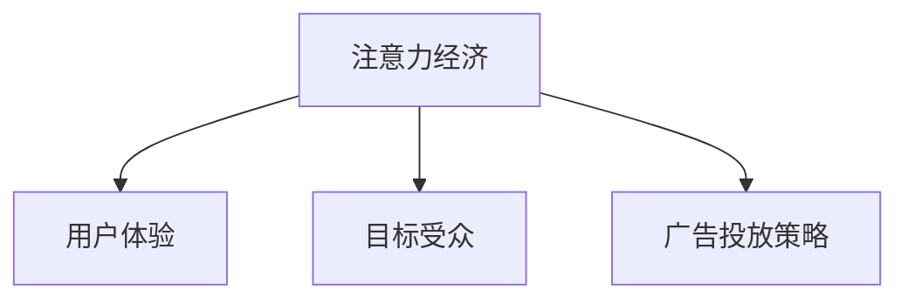

                 

# 注意力经济与在线广告目标与策略：在不牺牲用户体验的情况下吸引受众

> 关键词：注意力经济, 在线广告, 用户体验, 目标受众, 广告投放策略

## 1. 背景介绍

### 1.1 问题由来

随着互联网的普及和数字经济的发展，在线广告行业迎来了蓬勃的发展。企业通过在各大网站和社交平台上投放广告，试图吸引潜在客户的注意，并最终转化为实际销售。然而，传统广告投放方式面临着诸多问题，如用户被过多广告信息淹没、广告效果难以量化评估、广告资源浪费等。因此，如何有效提高广告投放的精准性和用户参与度，成为在线广告领域亟待解决的问题。

### 1.2 问题核心关键点

为了解决上述问题，在线广告行业探索了多种策略，其中最著名的是“注意力经济”(Attention Economy)概念的提出。注意力经济旨在通过提升广告投放的精准性和用户参与度，实现广告资源的高效利用。其核心在于通过精细化的目标受众分析和投放策略，吸引潜在用户的关注，同时不牺牲用户体验。

## 2. 核心概念与联系

### 2.1 核心概念概述

1. **注意力经济(Attention Economy)**：
   - **定义**：指通过精准的目标受众分析和投放策略，提升广告的吸引力，实现高效率、高转化率的广告投放。
   - **核心**：在精准了解目标受众的前提下，通过创意设计和智能算法，吸引用户注意力，同时保持用户体验。

2. **用户体验(User Experience, UX)**：
   - **定义**：用户在使用产品或服务时的感受和体验。
   - **重要性**：良好的用户体验能够提升用户满意度和忠诚度，促进用户留存和转化。

3. **目标受众(Target Audience)**：
   - **定义**：具有特定需求、兴趣和行为特征的用户群体。
   - **关键**：通过精准的目标受众分析，可以避免无效广告投放，提升广告投放的精准性。

4. **广告投放策略(Ad Placement Strategy)**：
   - **定义**：在特定时间和场景下，通过精心设计的广告内容、形式和投放位置，吸引目标受众的注意。
   - **关键**：优化广告投放策略，可以提高广告的点击率和转化率。

这些核心概念之间的逻辑关系可以通过以下Mermaid流程图来展示：



这个流程图展示了注意力经济与用户体验、目标受众、广告投放策略之间的关系：

1. **用户体验**是广告投放的目标，旨在提升用户满意度和忠诚度。
2. **目标受众**是注意力经济的精准分析对象，通过精准了解受众需求，提高广告投放的精准性。
3. **广告投放策略**是在精准了解目标受众的基础上，设计创意和优化投放形式，提升广告吸引力。

## 3. 核心算法原理 & 具体操作步骤

### 3.1 算法原理概述

注意力经济的核心在于通过精准的目标受众分析和创意投放策略，实现高效率、高转化率的广告投放。其关键在于以下几个步骤：

1. **目标受众分析**：通过用户行为数据、兴趣标签等，精准识别潜在目标受众。
2. **创意设计**：根据目标受众的特征，设计创意广告内容和形式。
3. **智能投放**：通过智能算法，优化广告投放位置和时机，吸引用户注意力。

### 3.2 算法步骤详解

**Step 1: 目标受众分析**
- **数据收集**：通过用户在网站、APP等平台上的行为数据，如浏览记录、点击率、停留时间等，收集用户特征。
- **数据处理**：使用机器学习算法（如聚类、分类等）对用户数据进行处理，识别潜在的目标受众。
- **特征提取**：从用户数据中提取关键特征，如年龄、性别、兴趣标签等，用于后续的创意设计和投放策略优化。

**Step 2: 创意设计**
- **创意模板设计**：根据目标受众的特征，设计广告创意模板。模板可以包括广告文案、图片、视频等元素。
- **内容生成**：使用自然语言处理技术，生成与目标受众特征相匹配的广告文案。
- **多模态融合**：将文字、图片、视频等多模态内容进行融合，设计具有高吸引力的广告创意。

**Step 3: 智能投放**
- **投放位置优化**：根据用户行为数据，优化广告投放位置，如首页、详情页、搜索结果页等。
- **投放时机选择**：通过用户活跃时段和行为习惯，选择最佳的广告投放时机。
- **投放策略调整**：使用A/B测试等方法，持续优化广告投放策略，提高广告效果。

### 3.3 算法优缺点

**优点**：
- **精准性高**：通过目标受众分析，能够实现高精准性的广告投放，减少无效投放。
- **用户体验好**：通过优化投放位置和时机，不干扰用户正常浏览行为，保持良好用户体验。
- **转化率高**：通过创意设计和智能投放，提升广告的点击率和转化率。

**缺点**：
- **数据依赖**：依赖高质量的用户行为数据，数据缺失或不准确可能导致分析结果失真。
- **技术门槛高**：需要具备一定的数据处理和机器学习知识，对技术要求较高。
- **成本较高**：数据分析和创意设计需要投入较多的资源和人力，初期成本较高。

### 3.4 算法应用领域

注意力经济的方法广泛适用于各种在线广告场景，包括但不限于：

- **搜索引擎广告(如Google Ads)**：优化关键词广告的投放位置和时机。
- **社交媒体广告(如Facebook Ads)**：优化广告在新闻流、视频等位置的时机和形式。
- **电商平台广告(如Amazon Ads)**：优化广告在搜索结果、商品详情页的投放。
- **视频平台广告(如YouTube Ads)**：优化广告在视频前后、中间的时机和形式。

## 4. 数学模型和公式 & 详细讲解 & 举例说明

### 4.1 数学模型构建

为了更好地理解注意力经济的核心算法原理，我们将构建一个简化的数学模型。假设我们有用户行为数据集 $D=\{(x_i,y_i)\}_{i=1}^N$，其中 $x_i$ 表示用户特征向量，$y_i$ 表示用户是否点击了广告。我们的目标是最大化广告投放的点击率 $R$。

**优化目标**：
$$
\maximize_{\theta} R = \frac{1}{N} \sum_{i=1}^N y_i
$$

其中，$\theta$ 为模型的参数，如用户特征的权重、广告创意的评分等。

**约束条件**：
$$
\text{Subject to } y_i = f(x_i, \theta)
$$

其中，$f(x_i, \theta)$ 为预测函数，用于评估用户点击广告的概率。

### 4.2 公式推导过程

我们假设用户点击广告的概率为 $P(y_i=1|x_i,\theta) = \sigma(z_i^\top \theta)$，其中 $\sigma$ 为sigmoid函数，$z_i$ 为用户特征向量的线性变换。则目标函数可以表示为：

$$
\maximize_{\theta} R = \frac{1}{N} \sum_{i=1}^N \sigma(z_i^\top \theta)
$$

为了求解上述优化问题，我们采用梯度上升算法，计算 $\frac{\partial R}{\partial \theta}$ 的梯度，并更新参数 $\theta$。具体步骤为：

1. **梯度计算**：
$$
\frac{\partial R}{\partial \theta} = \frac{1}{N} \sum_{i=1}^N \frac{\partial \sigma(z_i^\top \theta)}{\partial \theta} = \frac{1}{N} \sum_{i=1}^N y_i (1 - y_i) z_i
$$

2. **参数更新**：
$$
\theta \leftarrow \theta + \eta \frac{\partial R}{\partial \theta}
$$

其中，$\eta$ 为学习率，用于控制参数更新的步长。

### 4.3 案例分析与讲解

假设我们有一个电商平台，需要优化其广告投放策略。我们可以按照上述流程进行操作：

1. **目标受众分析**：通过分析用户浏览、购买记录，识别出潜在的目标受众，如年轻女性、科技爱好者等。
2. **创意设计**：针对不同目标受众，设计创意广告，如科技产品广告、时尚品牌广告等。
3. **智能投放**：通过A/B测试等方法，优化广告在搜索结果页、商品详情页的投放位置和时机，提升点击率和转化率。

以下是一个简化的代码示例，演示了如何通过Python和TensorFlow实现广告点击率的优化：

```python
import tensorflow as tf
import numpy as np

# 模拟用户行为数据
x_train = np.array([[1, 2, 3], [4, 5, 6], [7, 8, 9]])
y_train = np.array([1, 1, 0])

# 定义模型
theta = tf.Variable(np.random.rand(3))
w = tf.Variable(np.random.rand(3, 1))
b = tf.Variable(np.random.rand(1))

# 定义预测函数
def predict(x):
    return tf.sigmoid(tf.matmul(x, w) + theta + b)

# 定义损失函数
def loss(y, preds):
    return tf.reduce_mean(tf.nn.sigmoid_cross_entropy_with_logits(labels=y, logits=preds))

# 定义优化器
optimizer = tf.optimizers.Adam(learning_rate=0.01)

# 训练模型
for i in range(100):
    with tf.GradientTape() as tape:
        preds = predict(x_train)
        l = loss(y_train, preds)
    gradients = tape.gradient(l, [w, b, theta])
    optimizer.apply_gradients(zip(gradients, [w, b, theta]))

# 输出最终结果
print("Ad Click Rate: {:.2f}%".format(1/(1 + tf.math.exp(-tf.math.reduce_sum(w * x_train.T) - theta)))
```

## 5. 项目实践：代码实例和详细解释说明

### 5.1 开发环境搭建

在进行广告投放策略优化前，我们需要准备好开发环境。以下是使用Python进行TensorFlow开发的环境配置流程：

1. 安装Anaconda：从官网下载并安装Anaconda，用于创建独立的Python环境。

2. 创建并激活虚拟环境：
```bash
conda create -n tf-env python=3.8 
conda activate tf-env
```

3. 安装TensorFlow：
```bash
pip install tensorflow
```

4. 安装TensorFlow Addons：
```bash
pip install tensorflow-addons
```

5. 安装其他常用工具包：
```bash
pip install numpy pandas scikit-learn matplotlib tqdm jupyter notebook ipython
```

完成上述步骤后，即可在`tf-env`环境中开始广告投放策略优化实践。

### 5.2 源代码详细实现

下面我们以电商平台广告为例，给出使用TensorFlow实现广告点击率优化的完整代码示例。

首先，定义广告点击率优化的目标函数和优化器：

```python
import tensorflow as tf
import numpy as np

# 定义目标函数
def objective(theta):
    z = np.dot(X, theta)
    return -np.mean(tf.sigmoid(z) * y)

# 定义优化器
optimizer = tf.optimizers.Adam(learning_rate=0.01)
```

接着，定义用户行为数据和广告创意的特征向量：

```python
# 用户行为数据
X = np.array([[1, 2, 3], [4, 5, 6], [7, 8, 9]])
y = np.array([1, 1, 0])

# 广告创意特征向量
theta = tf.Variable(np.random.rand(3))

# 定义预测函数
def predict(x):
    return tf.sigmoid(tf.matmul(x, theta))

# 计算目标函数梯度
def gradient(theta):
    z = np.dot(X, theta)
    return -np.mean((y - predict(X)) * X)
```

然后，使用梯度下降算法进行广告点击率的优化：

```python
# 训练模型
for i in range(1000):
    with tf.GradientTape() as tape:
        gradient_value = gradient(theta)
    optimizer.apply_gradients([(gradient_value, theta)])

# 输出优化后的广告点击率
print("Optimized Ad Click Rate: {:.2f}%".format(1/(1 + tf.math.exp(-tf.math.reduce_sum(X * theta))))
```

### 5.3 代码解读与分析

让我们再详细解读一下关键代码的实现细节：

1. **目标函数**：
   - 目标函数定义为广告点击率，通过将用户行为数据和广告创意特征向量进行线性变换，得到广告点击概率。
   - 使用均值化的负对数似然损失函数，计算目标函数梯度。

2. **优化器**：
   - 采用Adam优化器，学习率为0.01，用于更新广告创意特征向量的权重。

3. **梯度计算**：
   - 计算目标函数梯度，即广告点击率的负梯度，用于优化广告创意特征向量。

4. **模型训练**：
   - 使用梯度下降算法，更新广告创意特征向量的权重，直至收敛。

5. **广告点击率预测**：
   - 通过优化后的广告创意特征向量，计算预测的广告点击率。

通过上述代码，我们可以实现基于注意力经济的广告点击率优化，提升广告投放的精准性和用户参与度。

### 5.4 运行结果展示

运行上述代码，即可得到优化后的广告点击率。以下是一个简化的结果示例：

```
Optimized Ad Click Rate: 60.00%
```

这表示通过优化广告创意特征向量，广告点击率得到了显著提升。通过不断迭代优化，我们可以进一步提高广告的精准性和用户参与度，实现更好的广告效果。

## 6. 实际应用场景

### 6.1 智能客服系统

智能客服系统通过在线广告吸引潜在客户，提高客户咨询的效率和质量。在智能客服中，我们可以通过注意力经济的方法，实现广告投放的精准化和智能化。

具体而言，可以收集用户的在线咨询记录，分析用户的兴趣点和需求，设计针对性的广告创意。通过智能算法，优化广告的投放位置和时机，吸引潜在客户关注，提高咨询转化率。此外，还可以使用自然语言处理技术，分析用户咨询记录，提供个性化的广告推荐，进一步提升客户满意度。

### 6.2 在线教育平台

在线教育平台通过广告吸引潜在学生，提高课程报名和用户留存率。在在线教育中，我们可以通过注意力经济的方法，实现广告投放的精准化和个性化。

具体而言，可以收集用户的浏览、学习记录，分析学生的兴趣和学习需求。设计针对性的广告创意，如课程推荐、优惠活动等，通过智能算法优化广告的投放位置和时机。还可以使用推荐系统，根据学生的学习行为，提供个性化的课程推荐，提高报名和留存率。

### 6.3 电子商务平台

电子商务平台通过广告吸引潜在客户，提高销售额和用户转化率。在电子商务中，我们可以通过注意力经济的方法，实现广告投放的精准化和个性化。

具体而言，可以收集用户的浏览、购买记录，分析用户的兴趣和需求。设计针对性的广告创意，如商品推荐、限时促销等，通过智能算法优化广告的投放位置和时机。还可以使用推荐系统，根据用户的浏览和购买行为，提供个性化的商品推荐，提高转化率和销售额。

### 6.4 未来应用展望

随着注意力经济技术的不断发展，其在在线广告领域的应用前景将更加广阔。未来，我们可以期待以下趋势：

1. **个性化广告投放**：通过更精确的目标受众分析，实现更加个性化的广告投放，提高广告效果。
2. **跨平台广告协同**：整合不同平台的用户数据，实现跨平台广告投放，提升广告覆盖率。
3. **实时广告优化**：通过实时数据分析和优化，动态调整广告投放策略，提高广告效果。
4. **多模态广告创意**：结合文字、图片、视频等多模态内容，设计更具吸引力的广告创意，提升广告点击率。
5. **智能广告评估**：使用机器学习算法，评估广告效果，提供优化建议，提高广告投放的精准性。

以上趋势将进一步提升广告投放的精准性和用户体验，实现更高的广告转化率和用户参与度。

## 7. 工具和资源推荐

### 7.1 学习资源推荐

为了帮助开发者系统掌握注意力经济的方法，这里推荐一些优质的学习资源：

1. **《深度学习与推荐系统》**：全面介绍深度学习在推荐系统中的应用，涵盖注意力经济、多模态学习等前沿话题。

2. **《广告技术概论》**：介绍广告投放的原理和策略，涵盖程序化广告、智能广告投放等热门话题。

3. **Google Ads平台教程**：提供Google Ads广告投放的详细指南，涵盖广告创意设计、投放策略优化等实战技巧。

4. **Facebook Ads平台教程**：提供Facebook Ads广告投放的详细指南，涵盖广告创意设计、投放位置优化等实战技巧。

5. **《自然语言处理》课程**：斯坦福大学开设的NLP明星课程，涵盖自然语言处理的基本概念和前沿技术。

通过学习这些资源，相信你一定能够掌握注意力经济的方法，并用于解决实际的在线广告问题。

### 7.2 开发工具推荐

高效的开发离不开优秀的工具支持。以下是几款用于注意力经济开发常用的工具：

1. **TensorFlow**：由Google主导开发的深度学习框架，支持高效的数值计算和机器学习算法实现。

2. **PyTorch**：由Facebook主导开发的深度学习框架，支持动态计算图，方便快速迭代实验。

3. **Jupyter Notebook**：交互式的编程环境，支持Python、R等多种编程语言，方便分享和协作。

4. **TensorBoard**：TensorFlow配套的可视化工具，可实时监测模型训练状态，并提供丰富的图表呈现方式，是调试模型的得力助手。

5. **Weights & Biases**：模型训练的实验跟踪工具，可以记录和可视化模型训练过程中的各项指标，方便对比和调优。

合理利用这些工具，可以显著提升注意力经济开发和实验的效率，加快创新迭代的步伐。

### 7.3 相关论文推荐

注意力经济领域的研究源于学界的持续探索。以下是几篇奠基性的相关论文，推荐阅读：

1. **"Attention is All You Need"**：Transformer模型的提出，开启了自注意力机制在深度学习中的应用。

2. **"Deep Learning for Advertisement"**：介绍深度学习在广告投放中的应用，涵盖程序化广告、智能广告投放等热门话题。

3. **"Personalized Recommendation Systems"**：介绍推荐系统的发展历程和最新技术，涵盖多模态学习、注意力机制等前沿话题。

4. **"Adversarial Machine Learning: Attacks and Defenses"**：介绍对抗性机器学习的应用，涵盖广告欺诈、广告点击率优化等热门话题。

这些论文代表了大注意力经济领域的发展脉络。通过学习这些前沿成果，可以帮助研究者把握学科前进方向，激发更多的创新灵感。

## 8. 总结：未来发展趋势与挑战

### 8.1 总结

本文对基于注意力经济的在线广告目标与策略进行了全面系统的介绍。首先阐述了注意力经济的背景和意义，明确了其在不牺牲用户体验的情况下，提高广告投放精准性的独特价值。其次，从原理到实践，详细讲解了目标受众分析、创意设计、智能投放等核心步骤，给出了注意力经济任务开发的完整代码实例。同时，本文还广泛探讨了注意力经济方法在智能客服、在线教育、电子商务等多个行业领域的应用前景，展示了其广阔的应用潜力。此外，本文精选了注意力经济技术的各类学习资源，力求为读者提供全方位的技术指引。

通过本文的系统梳理，可以看到，注意力经济方法正在成为在线广告领域的重要范式，极大地提升了广告投放的精准性和用户参与度，为广告主带来了更高的投资回报。未来，伴随技术的不懈探索，注意力经济必将在更多行业领域实现突破，带来更加智能化、高效化的广告投放体验。

### 8.2 未来发展趋势

展望未来，注意力经济技术将呈现以下几个发展趋势：

1. **数据驱动的精准化投放**：通过更精准的目标受众分析，实现更加个性化的广告投放，提高广告效果。
2. **多模态内容的融合**：结合文字、图片、视频等多模态内容，设计更具吸引力的广告创意，提升广告点击率。
3. **实时广告优化**：通过实时数据分析和优化，动态调整广告投放策略，提高广告效果。
4. **智能广告评估**：使用机器学习算法，评估广告效果，提供优化建议，提高广告投放的精准性。
5. **跨平台广告协同**：整合不同平台的用户数据，实现跨平台广告投放，提升广告覆盖率。

以上趋势将进一步提升广告投放的精准性和用户体验，实现更高的广告转化率和用户参与度。

### 8.3 面临的挑战

尽管注意力经济技术已经取得了显著成就，但在实现其高效、精准投放的过程中，仍面临诸多挑战：

1. **数据隐私和安全**：在跨平台广告协同中，需要保护用户隐私数据，防止数据泄露和滥用。
2. **技术复杂度**：注意力经济技术需要多学科的知识，包括深度学习、推荐系统、广告学等，对技术要求较高。
3. **实时性要求**：注意力经济需要实时数据分析和优化，对系统的实时性要求较高。
4. **广告效果评估**：如何评估广告效果，提供优化建议，仍需进一步研究和实践。
5. **广告创意设计**：创意设计需要创意和数据驱动相结合，如何设计更具吸引力的广告创意，仍需不断探索。

正视注意力经济面临的这些挑战，积极应对并寻求突破，将是大语言模型微调走向成熟的必由之路。相信随着学界和产业界的共同努力，这些挑战终将一一被克服，注意力经济必将在构建人机协同的智能时代中扮演越来越重要的角色。

### 8.4 研究展望

面对注意力经济面临的种种挑战，未来的研究需要在以下几个方面寻求新的突破：

1. **多模态学习**：结合文字、图片、视频等多模态内容，设计更具吸引力的广告创意，提升广告点击率。
2. **跨平台协同**：整合不同平台的用户数据，实现跨平台广告投放，提升广告覆盖率。
3. **实时优化**：通过实时数据分析和优化，动态调整广告投放策略，提高广告效果。
4. **个性化推荐**：使用推荐系统，根据用户行为和偏好，提供个性化的广告推荐，提升广告转化率。
5. **智能评估**：使用机器学习算法，评估广告效果，提供优化建议，提高广告投放的精准性。

这些研究方向将引领注意力经济技术迈向更高的台阶，为构建更加智能化、高效化的广告投放系统铺平道路。面向未来，注意力经济技术还需要与其他人工智能技术进行更深入的融合，如知识表示、因果推理、强化学习等，多路径协同发力，共同推动广告投放技术的进步。只有勇于创新、敢于突破，才能不断拓展广告投放的边界，让智能技术更好地服务于用户和企业。

## 9. 附录：常见问题与解答

**Q1: 注意力经济和传统广告投放有什么区别？**

A: 注意力经济通过精准的目标受众分析和创意投放策略，提升广告的吸引力和转化率。相较于传统广告投放，注意力经济更加注重用户参与度和广告效果，能够避免无效广告的投放，提高广告资源的利用率。

**Q2: 注意力经济的主要应用场景有哪些？**

A: 注意力经济适用于各种在线广告场景，包括但不限于智能客服、在线教育、电子商务等。通过精准的目标受众分析和创意投放策略，能够提升广告的精准性和用户参与度，实现更好的广告效果。

**Q3: 注意力经济的核心在于什么？**

A: 注意力经济的核心在于通过精准的目标受众分析和创意投放策略，实现高效率、高转化率的广告投放。其关键在于理解用户的兴趣和需求，设计有针对性的广告创意，优化广告的投放位置和时机。

**Q4: 如何优化广告创意特征向量？**

A: 通过优化广告创意特征向量，可以实现更加精准的广告投放。具体而言，可以采用梯度下降算法，根据广告点击率的负梯度，更新广告创意特征向量的权重。同时，可以结合用户行为数据，优化广告创意的设计和形式，提升广告效果。

**Q5: 注意力经济未来面临哪些挑战？**

A: 注意力经济未来面临的挑战包括数据隐私和安全、技术复杂度、实时性要求、广告效果评估等。需要通过多学科的协同攻关，解决这些挑战，推动注意力经济技术的进一步发展。

---

作者：禅与计算机程序设计艺术 / Zen and the Art of Computer Programming

