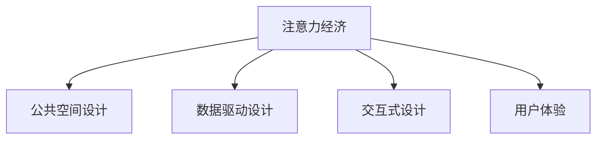

                 

## 1. 背景介绍

随着数字经济的蓬勃发展，全球正进入“注意力经济”时代，决策者在公共空间的设计中，需充分考量各种注意力资源的分布及其对公众行为的影响。然而，城市公共空间的注意力设计依旧依赖于传统的方法和工具，难以有效应对数字时代带来的新挑战。

### 1.1 问题由来
城市公共空间是市民交流互动、休闲娱乐的重要场所，其设计对市民的幸福感和社会满意度有直接影响。传统上，公共空间的设计更多依赖于建筑美学、人体工程学等传统学科的知识，而随着信息技术和数字经济的发展，公共空间设计正面临全新的需求和挑战。

首先，公众行为和决策更多地被数字化设备和在线信息流所影响。相较于以往，市民在公共空间中的注意力分配发生了显著变化，更多的注意力被屏幕和移动设备所吸引，改变了城市公共空间的使用模式和功能需求。

其次，公共空间注意力设计需要考虑数据驱动的决策过程，以便更精准地把握市民的需求和偏好，提升公共空间使用的效率和满意度。传统的设计方法难以兼顾大数据时代的复杂性和多样性，需借助现代信息技术，使设计更具科学性和前瞻性。

### 1.2 问题核心关键点
城市公共空间设计中的注意力问题，可以总结为以下几点：

1. **注意力分配与行为分析**：评估不同设计元素（如座椅、景观、照明等）对市民注意力的吸引程度，理解其在公共空间中的使用行为模式。
2. **数据驱动设计**：利用大数据技术分析市民的偏好和需求，通过科学的数据模型指导设计。
3. **设计优化与迭代改进**：通过迭代试验和优化模型，不断提升公共空间设计效果。
4. **用户参与与反馈机制**：引入市民参与和反馈机制，增强设计的社会责任感和可持续性。
5. **数字技术的应用**：探索AR/VR、物联网、人工智能等技术在公共空间设计中的应用，提升设计的智能化和互动性。

## 2. 核心概念与联系

### 2.1 核心概念概述

为更好地理解数字时代城市公共空间的注意力设计，本节将介绍几个核心概念：

- **注意力经济 (Attention Economy)**：数字时代，决策者需通过吸引注意力来提升产品、服务及内容的影响力。注意力成为一种稀缺资源，拥有更多注意力的产品和服务能够更好地市场竞争。

- **公共空间设计 (Urban Public Space Design)**：包括公园、广场、街道等市民公共活动空间的规划与建设，旨在提升城市生活质量，满足市民的休闲、交通、社交等需求。

- **数据驱动设计 (Data-Driven Design)**：利用大数据、人工智能等技术，分析市民的行为数据和偏好，指导公共空间设计的科学决策。

- **交互式设计 (Interactive Design)**：结合现代技术（如AR、VR、物联网），增强公共空间的环境互动性和用户参与感。

- **用户体验 (User Experience, UX)**：确保公共空间设计的易用性、舒适性和安全性，提升市民的使用体验。

这些概念之间的逻辑关系可以通过以下Mermaid流程图来展示：



这个流程图展示了几大关键概念之间的关系：

1. 注意力经济是公共空间设计的基本驱动因素，设计需吸引市民的注意力。
2. 数据驱动设计、交互式设计和用户体验都是提升注意力效果的关键手段。
3. 这些设计手段彼此关联，通过提升市民的注意和使用体验，进而增强注意力经济价值。

## 3. 核心算法原理 & 具体操作步骤
### 3.1 算法原理概述

基于数据驱动和注意力经济的城市公共空间设计，其核心算法主要包括以下几个环节：

1. **市民行为数据收集**：通过传感器、移动应用、问卷调查等方式，收集市民在公共空间中的行为和偏好数据。
2. **行为数据处理**：对收集到的数据进行清洗、整理和分析，提取市民对空间元素（如座椅、植被、照明等）的注意力指标。
3. **注意力模型构建**：基于市民行为数据，构建注意力模型，预测不同设计元素对市民注意力的影响。
4. **设计优化与迭代改进**：根据注意力模型反馈，调整和优化公共空间设计方案，提升市民的注意力和使用体验。
5. **用户参与与反馈机制**：引入市民参与和反馈机制，不断迭代设计方案，确保设计符合市民需求。

### 3.2 算法步骤详解

以下我们以一个具体的案例来说明数据驱动的公共空间设计过程：

#### Step 1: 数据收集
首先需要通过传感器和移动设备收集市民在公共空间中的行为数据。例如，通过智能座椅上的传感器收集座位使用情况，通过摄像头监控公共空间的客流流量，通过问卷调查收集市民对公共空间的满意度。

#### Step 2: 数据预处理
将收集到的原始数据进行清洗和整理，去除噪音和异常值，对数据进行归一化处理，使其适合后续分析。

#### Step 3: 注意力指标计算
基于处理后的行为数据，计算每个设计元素（如座椅、照明、植被等）对市民注意力的影响。可以使用多种指标，如停留时间、视线路径、使用频率等。

#### Step 4: 注意力模型构建
根据市民行为数据和注意力指标，构建注意力模型。常用的方法包括回归分析、决策树、神经网络等。例如，可以使用随机森林算法，对每个设计元素与市民停留时间之间的关系进行建模。

#### Step 5: 设计优化
根据注意力模型的预测结果，对公共空间设计进行优化。例如，可以增加座椅的数量、调整照明强度、改善植被布局等。

#### Step 6: 迭代改进
不断进行数据收集和模型迭代，提升公共空间设计的科学性和效果。引入市民参与和反馈机制，评估设计改进效果，优化模型参数。

### 3.3 算法优缺点

基于数据驱动的城市公共空间设计方法，具有以下优点：

1. **科学决策**：数据驱动的设计方法能够科学地分析市民行为数据，提供数据支持的决策依据。
2. **高效反馈**：通过实时数据监控和市民反馈，能够快速调整和优化设计，提升公共空间的使用效果。
3. **可持续改进**：通过持续的数据收集和模型迭代，能够不断提升公共空间设计的科学性和前瞻性。
4. **增强参与感**：引入市民参与和反馈机制，增强设计的社会责任感和可持续性。

同时，该方法也存在一定的局限性：

1. **数据隐私**：收集市民的行为数据可能会侵犯隐私，需要严格的数据保护措施。
2. **数据质量**：数据收集和处理过程中，可能会存在误差和噪音，影响分析结果的准确性。
3. **技术成本**：大规模数据收集和处理需要较高的技术成本，对公共空间管理部门的要求较高。
4. **复杂性**：注意力模型和设计优化过程较为复杂，需要专业的技术支持。

尽管存在这些局限性，但就目前而言，基于数据驱动的设计方法已成为城市公共空间设计的重要范式。未来相关研究将进一步降低数据收集和处理的成本，提升模型的准确性和可靠性，同时兼顾市民隐私和数据安全。

### 3.4 算法应用领域

基于数据驱动的公共空间设计方法，已广泛应用于全球多个城市的公共空间改造中，并在实践中取得了显著成效：

1. **智慧城市建设**：多个城市如深圳、北京、伦敦等已引入类似技术，改造公园、广场等公共空间，提升市民满意度。
2. **交通系统优化**：通过数据驱动的公共空间设计，优化市民的交通行为，提升公共空间的使用效率。
3. **公共安全管理**：利用智能监控和数据分析，提高公共空间的安全管理水平。
4. **环境保护**：通过数据收集和分析，优化公共空间的植被和景观设计，提升环境质量和市民健康。
5. **社交互动增强**：结合AR/VR等技术，提升公共空间的互动性和参与感，促进市民的社交互动。

## 4. 数学模型和公式 & 详细讲解 & 举例说明

### 4.1 数学模型构建

本节将使用数学语言对数据驱动的城市公共空间设计进行更加严格的刻画。

记市民行为数据为 $X=\{x_1,x_2,\cdots,x_n\}$，其中 $x_i$ 为第 $i$ 个市民的行为数据。记设计元素为 $Y=\{y_1,y_2,\cdots,y_m\}$，其中 $y_j$ 为第 $j$ 个设计元素。记市民对设计元素的注意力指标为 $A=\{a_1,a_2,\cdots,a_m\}$，其中 $a_j$ 为设计元素 $y_j$ 对市民注意力的影响。

定义注意力模型为 $M_{\theta}(X,Y)=A$，其中 $\theta$ 为模型参数。常见的模型包括线性回归模型、决策树模型、神经网络模型等。

### 4.2 公式推导过程

以线性回归模型为例，其数学推导如下：

记 $x_i=\{x_{i1},x_{i2},\cdots,x_{in}\}$ 为市民 $i$ 的行为数据，$y_j=\{y_{j1},y_{j2},\cdots,y_{jm}\}$ 为设计元素 $j$ 的属性，$a_j$ 为设计元素 $j$ 对市民注意力的影响。

线性回归模型的目标是最小化误差平方和 $SSE=\sum_{i=1}^n\sum_{j=1}^m(a_j-\beta_0-\sum_{k=1}^m \beta_ky_{jk})^2$，其中 $\beta_0$ 和 $\beta_k$ 为模型参数。

根据最小二乘法，求解误差最小化问题，可得：

$$
\hat{\beta}=(X^TX)^{-1}X^TY
$$

其中 $\hat{\beta}$ 为线性回归模型的预测参数，$X$ 为设计元素的属性矩阵，$Y$ 为市民注意力的指标矩阵。

### 4.3 案例分析与讲解

以某个城市的公共空间改造为例，假设该城市有三个公共空间设计元素（座椅、照明、植被），以及市民的停留时间、使用频率等注意力指标。收集了100个市民的行为数据，将其输入模型，得到以下结果：

- 座椅对市民停留时间的预测系数为0.5，表示座椅数量增加1个，市民停留时间增加0.5小时。
- 照明对市民停留时间的预测系数为0.3，表示照明强度增加10%，市民停留时间增加0.3小时。
- 植被对市民停留时间的预测系数为0.2，表示植被面积增加10%，市民停留时间增加0.2小时。

根据预测结果，该城市可以优化座椅和照明的设计，增加市民在公共空间的使用时间，提升市民的幸福感和满意度。

## 5. 项目实践：代码实例和详细解释说明
### 5.1 开发环境搭建

在进行数据驱动的公共空间设计实践前，我们需要准备好开发环境。以下是使用Python进行Scikit-learn开发的环境配置流程：

1. 安装Anaconda：从官网下载并安装Anaconda，用于创建独立的Python环境。

2. 创建并激活虚拟环境：
```bash
conda create -n data-driven-design python=3.8 
conda activate data-driven-design
```

3. 安装Scikit-learn：使用pip安装Scikit-learn。
```bash
pip install scikit-learn
```

4. 安装相关工具包：
```bash
pip install numpy pandas matplotlib seaborn scikit-optimize
```

完成上述步骤后，即可在`data-driven-design`环境中开始实践。

### 5.2 源代码详细实现

下面我们以智慧城市建设中公共空间改造为例，给出使用Scikit-learn进行数据驱动设计的代码实现。

首先，准备数据集：

```python
import pandas as pd
from sklearn.model_selection import train_test_split
from sklearn.linear_model import LinearRegression

# 准备数据
data = pd.read_csv('public_space_data.csv')

# 分割数据集
X = data[['座椅数量', '照明强度', '植被面积']]
y = data['市民停留时间']

X_train, X_test, y_train, y_test = train_test_split(X, y, test_size=0.2, random_state=42)
```

然后，训练模型：

```python
from sklearn.linear_model import LinearRegression

# 训练模型
model = LinearRegression()
model.fit(X_train, y_train)
```

接着，评估模型：

```python
from sklearn.metrics import mean_squared_error, r2_score

# 评估模型
y_pred = model.predict(X_test)
mse = mean_squared_error(y_test, y_pred)
rmse = np.sqrt(mse)
r2 = r2_score(y_test, y_pred)

print(f'RMSE: {rmse:.2f}, R^2: {r2:.2f}')
```

最后，使用模型进行预测和优化：

```python
# 使用模型进行预测和优化
new_data = pd.DataFrame({ '座椅数量': 10, '照明强度': 0.9, '植被面积': 0.8})
new_pred = model.predict(new_data)
print(f'新数据下的市民停留时间预测: {new_pred:.2f}小时')
```

以上代码实现了对市民停留时间的线性回归预测，并展示了如何使用模型对公共空间设计进行优化。

### 5.3 代码解读与分析

让我们再详细解读一下关键代码的实现细节：

**数据准备**：
- 使用Pandas库读取公共空间数据，进行初步数据清洗。
- 利用train_test_split将数据集分为训练集和测试集，以保证模型的泛化能力。

**模型训练**：
- 使用Scikit-learn的LinearRegression模型，对市民停留时间和公共空间设计元素进行线性回归。
- 通过fit方法训练模型，使用训练集进行参数拟合。

**模型评估**：
- 使用mean_squared_error和r2_score评估模型在测试集上的表现。
- 通过rmse计算模型预测误差，r2计算模型拟合程度。

**预测优化**：
- 使用预测模型对新的设计元素进行预测，计算市民停留时间。
- 结合预测结果和市民反馈，不断调整设计方案。

代码中的关键步骤展示了数据驱动设计的基本流程：数据收集、模型训练、模型评估和预测优化。通过使用Scikit-learn库，可以方便地实现这些关键环节，提升公共空间设计的科学性和效果。

## 6. 实际应用场景
### 6.1 智慧城市建设

智慧城市建设中，数据驱动的城市公共空间设计成为重要的应用方向。通过数据驱动的设计，可以优化公共空间的使用效率和市民满意度，提升城市的智能化水平。

具体而言，可以利用数据驱动的设计方法，对智慧城市的公园、广场、步行街等公共空间进行改造。例如，通过分析市民的使用数据，优化座椅和照明设计，增加市民停留时间和使用频率。同时，引入AR/VR等技术，增强公共空间的互动性和参与感，提升市民的幸福感和城市整体的智能化水平。

### 6.2 交通系统优化

交通系统优化是数据驱动设计的重要应用场景。通过数据驱动的公共空间设计，可以优化市民的交通行为，提高公共空间的使用效率。

例如，在交通枢纽中，可以通过数据驱动的设计方法，优化座椅布局、增设自动售货机、引入信息显示屏等，提升市民的出行体验。同时，利用数据分析优化交通流线，减少交通拥堵，提升城市交通系统的运行效率。

### 6.3 公共安全管理

公共安全管理也是数据驱动设计的重要应用场景。通过数据驱动的公共空间设计，可以提高公共空间的安全管理水平。

例如，在公共空间中，可以利用数据驱动的设计方法，优化照明和监控系统，提升公共空间的安全性和使用体验。同时，利用数据分析预测潜在的安全隐患，及时采取防范措施，提升公共空间的安全管理水平。

### 6.4 环境保护

环境保护是数据驱动设计的另一个重要应用场景。通过数据驱动的公共空间设计，可以优化公共空间的植被和景观设计，提升环境质量和市民健康。

例如，在公园和绿地中，可以利用数据驱动的设计方法，优化植被和景观布局，提升公共空间的生态效益和市民的身体健康。同时，利用数据分析预测环境变化趋势，及时采取措施，提升城市环境的可持续发展水平。

## 7. 工具和资源推荐
### 7.1 学习资源推荐

为了帮助开发者系统掌握数据驱动的城市公共空间设计理论基础和实践技巧，这里推荐一些优质的学习资源：

1. **《数据驱动的城市公共空间设计》系列博文**：由城市规划专家撰写，深入浅出地介绍了数据驱动设计的基本概念、方法和工具。

2. **Coursera《数据科学导论》课程**：斯坦福大学开设的课程，涵盖数据驱动设计的基本理论和技术，适合入门学习。

3. **《数据科学与机器学习》书籍**：经典教材，全面介绍了数据科学与机器学习的基本原理和算法，适合进阶学习。

4. **DataCamp平台**：在线学习平台，提供大量数据科学和机器学习课程，适合实践学习和项目练习。

5. **Kaggle平台**：数据科学竞赛平台，提供丰富的数据集和挑战题目，适合数据驱动设计项目实践。

通过对这些资源的学习实践，相信你一定能够快速掌握数据驱动设计的基本思路，并用于解决实际的公共空间设计问题。

### 7.2 开发工具推荐

高效的开发离不开优秀的工具支持。以下是几款用于数据驱动的公共空间设计开发的常用工具：

1. **Python**：数据科学的主流语言，功能强大，生态丰富，适合数据驱动设计的实现。

2. **Scikit-learn**：Python的机器学习库，提供大量经典算法和工具，适合数据驱动设计中的模型训练和评估。

3. **TensorFlow**：Google开发的深度学习框架，支持大规模模型训练和部署，适合复杂数据驱动设计的实现。

4. **Jupyter Notebook**：交互式开发环境，适合数据驱动设计中的项目管理和实验记录。

5. **Tableau**：数据可视化工具，适合数据驱动设计中的数据分析和展示。

合理利用这些工具，可以显著提升数据驱动的公共空间设计的开发效率，加快创新迭代的步伐。

### 7.3 相关论文推荐

数据驱动的城市公共空间设计领域，相关的研究论文众多，以下是几篇奠基性的相关论文，推荐阅读：

1. **《数据驱动的公共空间设计》**：研究了如何使用大数据和机器学习技术，优化公共空间的设计方案。

2. **《基于数据驱动的智慧城市建设》**：研究了数据驱动技术在智慧城市建设中的应用，包括公共空间优化和市民行为分析。

3. **《公共空间设计与市民行为分析》**：研究了如何利用数据分析技术，提升公共空间的使用效率和市民满意度。

4. **《数据科学与城市公共空间设计的结合》**：研究了如何将数据科学方法和工具应用于公共空间设计，提升设计的科学性和效果。

这些论文代表了大数据时代公共空间设计的研究方向，通过学习这些前沿成果，可以帮助研究者把握学科前进方向，激发更多的创新灵感。

## 8. 总结：未来发展趋势与挑战
### 8.1 总结

本文对基于数据驱动的城市公共空间设计方法进行了全面系统的介绍。首先阐述了数据驱动设计在智慧城市、交通系统、公共安全、环境保护等场景的应用背景和意义，明确了数据驱动设计在提升公共空间使用效率和市民满意度方面的独特价值。其次，从原理到实践，详细讲解了数据驱动设计的数学模型和关键步骤，给出了数据驱动设计任务开发的完整代码实例。同时，本文还广泛探讨了数据驱动设计方法在智慧城市、交通系统、公共安全等领域的实际应用前景，展示了数据驱动设计范式的巨大潜力。最后，本文精选了数据驱动设计的各类学习资源，力求为读者提供全方位的技术指引。

通过本文的系统梳理，可以看到，数据驱动的城市公共空间设计方法正在成为智慧城市建设的重要范式，极大地拓展了城市公共空间设计的边界，提升了公共空间的使用效率和市民满意度。未来，伴随数据驱动设计方法的持续演进，相信公共空间设计将更加科学、智能、可持续，为城市发展带来更多机遇和挑战。

### 8.2 未来发展趋势

展望未来，数据驱动的城市公共空间设计将呈现以下几个发展趋势：

1. **多模态数据融合**：随着物联网、AR/VR等技术的发展，公共空间的数据将不再局限于行为数据，图像、声音、传感器数据等都将被纳入数据驱动设计的范畴，提升设计的全面性和准确性。
2. **实时数据处理**：实时数据处理技术将使得公共空间设计能够快速响应市民的需求变化，提升设计的及时性和灵活性。
3. **个性化设计**：利用大数据分析市民的个性化需求，提供定制化的公共空间设计方案，提升市民的使用体验和满意度。
4. **智能化管理**：结合人工智能和物联网技术，实现公共空间的智能化管理和监控，提升公共空间的安全性和使用效率。
5. **跨领域应用**：数据驱动的设计方法将跨界应用于医疗、教育、旅游等多个领域，推动各领域智慧化进程。

以上趋势凸显了数据驱动设计技术的广阔前景。这些方向的探索发展，必将进一步提升公共空间设计的科学性和效果，为城市发展带来更多机遇和挑战。

### 8.3 面临的挑战

尽管数据驱动的城市公共空间设计技术已经取得了瞩目成就，但在迈向更加智能化、普适化应用的过程中，它仍面临着诸多挑战：

1. **数据隐私和安全**：数据驱动的设计方法需要大量市民的行为数据，如何保护市民隐私、确保数据安全是一个重大挑战。
2. **数据质量和可靠性**：数据收集和处理过程中，可能会存在误差和噪音，影响分析结果的准确性。
3. **计算资源和成本**：大规模数据处理需要高性能计算资源，成本较高，限制了数据驱动设计的推广应用。
4. **模型复杂性和可解释性**：数据驱动的设计模型通常较为复杂，如何提高模型的可解释性和鲁棒性，是一个重要的研究方向。
5. **跨部门协作**：数据驱动的设计涉及多个部门和系统，如何实现跨部门协作和数据共享，是一个重要的实施挑战。

尽管存在这些挑战，但数据驱动的设计方法在城市公共空间设计中的应用前景广阔，亟需从数据采集、存储、处理、分析等环节进行系统优化，方能实现大规模、高效、智能的公共空间设计。相信随着技术的不断进步和应用推广，数据驱动的设计方法将在智慧城市建设中发挥更大的作用。

### 8.4 研究展望

面对数据驱动的城市公共空间设计所面临的种种挑战，未来的研究需要在以下几个方面寻求新的突破：

1. **数据隐私保护**：开发数据匿名化、去标识化等技术，保护市民隐私，确保数据安全。
2. **数据质量和可靠性**：研究数据清洗、预处理等技术，提高数据质量和可靠性。
3. **计算资源优化**：探索分布式计算、云计算等技术，降低数据驱动设计的成本，提高处理效率。
4. **模型可解释性**：开发可解释性强的模型，提高模型的透明性和可信度。
5. **跨部门协作**：探索数据共享、标准化的技术和管理机制，实现跨部门协作。

这些研究方向的探索，必将引领数据驱动的城市公共空间设计技术迈向更高的台阶，为智慧城市建设带来更多机遇和挑战。

## 9. 附录：常见问题与解答
----------------------------------------------------------------

**Q1: 数据驱动的公共空间设计是否适用于所有城市？**

A: 数据驱动的公共空间设计对数据的质量和多样性要求较高，因此，不同城市的数据采集能力和数据质量各不相同，适用的程度也会有所不同。对于数据资源丰富、基础设施完善的城市，数据驱动的设计方法可以取得显著的效果。

**Q2: 数据驱动的公共空间设计是否会导致市民隐私泄露？**

A: 数据驱动的设计方法需要收集市民的行为数据，可能会涉及隐私问题。为此，应采取严格的隐私保护措施，如数据匿名化、去标识化等技术，确保数据安全和市民隐私。

**Q3: 数据驱动的公共空间设计是否需要高成本的计算资源？**

A: 数据驱动的设计方法通常需要处理大量数据和复杂模型，确实需要较高的计算资源。但随着云计算和大数据技术的发展，通过分布式计算和云计算平台，可以大幅降低计算成本，提高处理效率。

**Q4: 数据驱动的公共空间设计是否需要跨部门协作？**

A: 数据驱动的设计方法涉及多个部门和系统，如交通、环境、安全等，需要跨部门协作和数据共享。为此，应建立标准化的数据管理和共享机制，确保跨部门的数据一致性和互通性。

**Q5: 数据驱动的公共空间设计是否需要考虑环境因素？**

A: 数据驱动的设计方法需要考虑环境因素，如气候、植被、噪音等，以确保公共空间设计的可持续性和生态效益。为此，应引入环境科学和生态学专家的知识和经验，结合数据驱动设计，提升设计的科学性和效果。

通过本文的系统梳理，可以看到，数据驱动的公共空间设计方法正在成为智慧城市建设的重要范式，极大地拓展了公共空间设计的边界，提升了公共空间的使用效率和市民满意度。未来，伴随数据驱动设计方法的持续演进，相信公共空间设计将更加科学、智能、可持续，为城市发展带来更多机遇和挑战。

