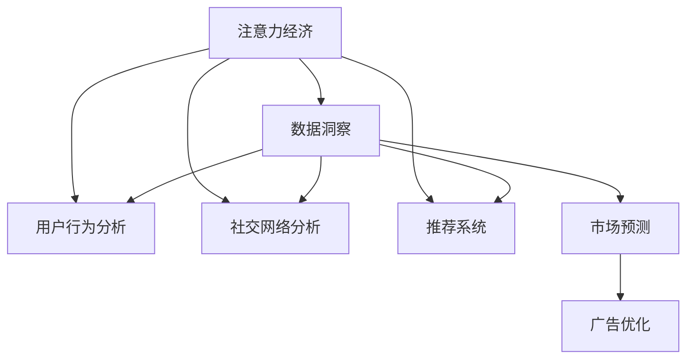

                 

# 注意力经济与数据分析洞见：利用数据理解受众行为

> 关键词：注意力经济,数据洞察,用户行为分析,社交网络,推荐系统,市场预测,广告优化

## 1. 背景介绍

在信息爆炸的时代，注意力成为了一种稀缺资源。如何吸引和保持用户的注意力，提升产品和服务的影响力，成为企业争夺市场的关键所在。随着大数据和人工智能技术的发展，通过对用户行为数据的分析，我们可以更深入地理解受众的心理和行为模式，从而做出更有针对性的营销策略。本文将探讨利用数据分析技术，洞察用户行为，挖掘市场机会，实现注意力经济的最大化。

## 2. 核心概念与联系

### 2.1 核心概念概述

本节将介绍几个关键概念：

- **注意力经济**：指的是在信息泛滥的时代，注意力成为一种重要的经济资源，企业和个人需要通过创意、品牌、内容等方式，吸引和保持用户的注意力，以实现商业价值。
- **数据洞察**：利用数据分析技术，从大量数据中挖掘出有价值的规律和模式，支持决策制定和业务优化。
- **用户行为分析**：通过记录和分析用户在线行为数据，理解用户需求和偏好，改进产品和服务。
- **社交网络分析**：研究社交网络中个体和群体间的互动关系，识别影响和趋势。
- **推荐系统**：利用算法为用户推荐感兴趣的物品，提升用户体验，增加用户粘性。
- **市场预测**：通过对历史数据的分析，预测未来市场的变化趋势，指导企业决策。
- **广告优化**：通过分析广告效果，优化投放策略，提升广告投放的精准度和回报率。

这些概念之间的联系可以通过以下Mermaid流程图来展示：



这个流程图展示了注意力经济与数据洞察之间的因果关系，以及各个子概念之间的相互作用。通过数据分析，我们可以洞察用户行为、社交网络趋势、市场变化等，为广告优化提供依据，从而吸引和保持用户的注意力。

## 3. 核心算法原理 & 具体操作步骤

### 3.1 算法原理概述

利用数据分析技术理解用户行为，通常涉及以下几个步骤：

1. **数据收集**：从各种渠道（如网站、社交媒体、销售系统等）收集用户行为数据。
2. **数据预处理**：清洗和处理数据，确保数据的质量和一致性。
3. **数据分析**：使用统计分析、机器学习等方法，挖掘数据中的模式和趋势。
4. **模型评估**：通过交叉验证等方法，评估模型的性能和稳定性。
5. **业务应用**：将分析结果应用于产品改进、市场策略、广告投放等业务场景。

### 3.2 算法步骤详解

以下是一个具体的数据分析流程示例：

1. **数据收集**：
   - 通过网站分析工具（如Google Analytics）收集用户在网站上的行为数据。
   - 使用社交媒体API获取用户的互动数据。
   - 从销售系统获取用户的购买记录。
   - 汇总数据，确保数据的完整性和准确性。

2. **数据预处理**：
   - 清洗数据，去除噪声和异常值。
   - 进行数据标准化和归一化处理，确保数据的一致性。
   - 使用数据挖掘技术（如聚类、关联规则）发现数据中的模式和规律。

3. **数据分析**：
   - 使用统计分析方法（如描述性统计、时间序列分析），描述数据的基本特征。
   - 应用机器学习算法（如回归分析、分类算法），构建预测模型。
   - 使用深度学习模型（如神经网络、决策树），挖掘数据中的深层次规律。

4. **模型评估**：
   - 使用交叉验证等方法，评估模型的预测性能。
   - 通过A/B测试等方法，验证分析结果的有效性。
   - 调整模型参数，优化模型性能。

5. **业务应用**：
   - 根据分析结果，改进产品和服务，提升用户体验。
   - 制定精准的市场营销策略，提升广告投放的效果。
   - 预测市场趋势，指导企业的战略决策。

### 3.3 算法优缺点

利用数据分析技术理解用户行为，具有以下优点：
- 可以全面、深入地了解用户需求和偏好。
- 通过数据分析，发现潜在的机会和挑战。
- 提升业务决策的科学性和精准性。

同时，也存在一些局限：
- 数据质量对分析结果有直接影响，数据不完整或错误会导致误导性结论。
- 数据分析模型需要适当的训练和调整，才能得到有效的结果。
- 数据隐私和安全问题，需要制定严格的数据保护政策。

### 3.4 算法应用领域

数据分析技术在多个领域都有广泛应用，例如：

- **电子商务**：通过用户行为分析，推荐个性化商品，提升用户购买率。
- **金融服务**：利用用户数据，进行风险评估和客户管理。
- **医疗健康**：分析患者行为，优化诊疗流程，提升医疗服务质量。
- **媒体内容**：通过社交网络分析，优化内容推荐策略，提高用户参与度。
- **市场调研**：预测市场趋势，制定精准的市场策略。
- **广告营销**：分析广告效果，优化投放策略，提升广告ROI。

## 4. 数学模型和公式 & 详细讲解 & 举例说明

### 4.1 数学模型构建

假设我们有一组用户行为数据 $D=\{(x_i,y_i)\}_{i=1}^N$，其中 $x$ 表示用户行为，$y$ 表示用户标签。我们的目标是构建一个预测模型，用于预测用户标签。我们可以使用线性回归、逻辑回归、决策树等经典模型，也可以采用深度学习模型（如神经网络）进行预测。

以线性回归为例，我们的目标是最小化预测误差：

$$
\min_{\theta} \sum_{i=1}^N (y_i - f(x_i;\theta))^2
$$

其中 $f(x;\theta)$ 为线性模型，$\theta$ 为模型参数。

### 4.2 公式推导过程

线性回归的模型为：

$$
f(x;\theta) = \theta_0 + \theta_1x_1 + \theta_2x_2 + \cdots + \theta_kx_k
$$

将 $f(x;\theta)$ 代入损失函数中，得到：

$$
\min_{\theta} \sum_{i=1}^N (y_i - (\theta_0 + \theta_1x_{i1} + \theta_2x_{i2} + \cdots + \theta_kx_{ik}))^2
$$

使用梯度下降法求解 $\theta$，得到：

$$
\theta_{k+1} = \theta_k - \alpha \sum_{i=1}^N 2(x_{ik}(y_i - f(x_i;\theta_k)))
$$

其中 $\alpha$ 为学习率，控制每次参数更新的步长。

### 4.3 案例分析与讲解

以社交网络分析为例，我们可以通过分析用户间的互动关系，发现社交网络中的关键节点和集群。具体步骤如下：

1. **构建网络图**：将用户视为节点，将互动关系视为边，构建社交网络图。
2. **计算中心性**：使用度中心性、接近中心性等指标，计算每个节点的中心性。
3. **识别关键节点**：通过中心性分析，识别网络中的关键节点（如意见领袖）。
4. **发现集群**：使用聚类算法（如K-means），发现社交网络中的集群。

## 5. 项目实践：代码实例和详细解释说明

### 5.1 开发环境搭建

在进行数据分析项目实践前，我们需要准备好开发环境。以下是使用Python进行数据分析实践的环境配置流程：

1. 安装Anaconda：从官网下载并安装Anaconda，用于创建独立的Python环境。

2. 创建并激活虚拟环境：
```bash
conda create -n data-env python=3.8 
conda activate data-env
```

3. 安装相关库：
```bash
pip install pandas numpy scikit-learn matplotlib seaborn plotly
```

完成上述步骤后，即可在`data-env`环境中开始数据分析实践。

### 5.2 源代码详细实现

以下是一个使用Python进行社交网络分析的代码示例：

```python
import networkx as nx
import pandas as pd
import matplotlib.pyplot as plt

# 构建网络图
G = nx.Graph()
with open('social_network.txt', 'r') as f:
    for line in f:
        user1, user2 = line.strip().split()
        G.add_edge(user1, user2)

# 计算中心性
centrality = nx.degree_centrality(G)

# 可视化中心性
plt.bar(centrality.keys(), centrality.values())
plt.xlabel('User')
plt.ylabel('Degree Centrality')
plt.title('Degree Centrality Analysis')
plt.show()

# 发现集群
clusters = nx.cluster.label_connected_subgraphs(G)
num_clusters = len(clusters)
print(f'Number of clusters: {num_clusters}')
```

### 5.3 代码解读与分析

让我们再详细解读一下关键代码的实现细节：

**构建网络图**：
- 使用`networkx`库构建社交网络图，通过读取文本文件，将每行数据解析为一个边，添加到图中。

**计算中心性**：
- 使用`networkx`库的`degree_centrality`函数计算每个节点的度中心性。

**可视化中心性**：
- 使用`matplotlib`库绘制度中心性柱状图，直观展示每个节点的中心性大小。

**发现集群**：
- 使用`networkx`库的`cluster.label_connected_subgraphs`函数，发现网络中的集群。

可以看到，利用Python进行社交网络分析，我们可以轻松地构建网络图、计算中心性、发现集群，为进一步的业务应用打下基础。

## 6. 实际应用场景

### 6.1 智能推荐系统

智能推荐系统已经成为电商、视频、音乐等行业的标配。通过分析用户行为数据，推荐系统可以精准推荐用户感兴趣的商品、内容等，提升用户满意度和粘性。

在技术实现上，可以构建用户行为模型，预测用户对不同商品/内容的兴趣度，然后根据预测结果进行推荐。通过不断优化模型，可以实现个性化推荐，提升推荐效果。

### 6.2 用户画像构建

用户画像构建是市场分析、客户管理的重要手段。通过分析用户的在线行为数据，可以构建详细的用户画像，支持企业制定精准的市场策略。

具体而言，可以收集用户在网站、应用上的行为数据，包括访问页面、点击链接、购物记录等。通过数据挖掘技术，发现用户的行为模式和偏好，构建用户画像，支持精准的市场推广。

### 6.3 社交媒体分析

社交媒体分析是企业了解市场动态、监测品牌声誉的重要工具。通过分析用户在社交媒体上的互动数据，可以发现市场趋势和用户反馈。

具体而言，可以收集用户在社交媒体上的互动数据，包括点赞、评论、转发等。通过社交网络分析，发现用户对不同内容的反应和情感倾向，支持品牌优化内容策略。

### 6.4 未来应用展望

随着数据分析技术的不断进步，未来基于数据洞察的应用将更加广泛和深入：

- **预测分析**：通过时间序列分析、机器学习等方法，预测市场趋势和用户行为。
- **个性化推荐**：利用深度学习模型，实现更精准、个性化的推荐。
- **广告优化**：通过A/B测试、效果评估等方法，优化广告投放策略，提升广告效果。
- **用户体验优化**：通过用户行为分析，改进产品和服务，提升用户体验。
- **市场营销策略**：利用数据分析，制定精准的市场营销策略，提升市场份额。

## 7. 工具和资源推荐

### 7.1 学习资源推荐

为了帮助开发者系统掌握数据分析的理论基础和实践技巧，这里推荐一些优质的学习资源：

1. 《Python数据科学手册》：由知名数据科学家Jake VanderPlas撰写，全面介绍Python数据科学库的使用。
2. 《机器学习实战》：由Peter Harrington撰写，介绍了常用的机器学习算法和应用案例。
3. 《深入理解机器学习：从原理到算法》：由李航撰写，深入浅出地介绍了机器学习的基本原理和算法。
4. Coursera《数据科学专项课程》：由斯坦福大学、密歇根大学等名校提供，涵盖数据科学各个方面。
5. Kaggle数据科学竞赛：通过参与竞赛，实践数据科学项目，积累实战经验。

通过对这些资源的学习实践，相信你一定能够快速掌握数据分析的精髓，并用于解决实际问题。

### 7.2 开发工具推荐

高效的开发离不开优秀的工具支持。以下是几款用于数据分析开发的常用工具：

1. Python：作为数据科学的主流语言，Python拥有丰富的数据科学库和工具，如Pandas、NumPy、Scikit-Learn等。
2. R语言：数据科学中的另一重要工具，拥有强大的统计分析和数据可视化能力。
3. Jupyter Notebook：交互式的数据科学开发环境，支持多种语言和库，便于学习和分享。
4. Tableau：数据可视化工具，支持复杂的数据分析和报表生成。
5. Google Colab：谷歌提供的免费在线Jupyter Notebook环境，支持GPU加速，方便实验和分享。

合理利用这些工具，可以显著提升数据分析任务的开发效率，加快创新迭代的步伐。

### 7.3 相关论文推荐

数据分析技术的发展源于学界的持续研究。以下是几篇奠基性的相关论文，推荐阅读：

1. "The Element of Statistical Learning" by Hastie et al.：介绍了统计学习的基础理论和算法。
2. "Pattern Recognition and Machine Learning" by Bishop：全面介绍了机器学习的基本概念和算法。
3. "The Looming Tower of Big Data" by Cayley：探讨了大数据时代的数据分析方法。
4. "A Survey of Recommender Systems" by Rendle et al.：综述了推荐系统的各种方法和应用。
5. "NetworkX: Network Analysis in Python"：介绍了使用Python进行网络分析的工具库。

这些论文代表了大数据分析技术的发展脉络。通过学习这些前沿成果，可以帮助研究者把握学科前进方向，激发更多的创新灵感。

## 8. 总结：未来发展趋势与挑战

### 8.1 总结

本文对利用数据分析技术理解用户行为进行了全面系统的介绍。首先阐述了数据分析在注意力经济中的重要性和应用价值，明确了数据分析在提升用户满意度和市场竞争力方面的独特作用。其次，从原理到实践，详细讲解了数据分析的数学模型和操作步骤，给出了数据分析项目开发的完整代码实例。同时，本文还广泛探讨了数据分析技术在推荐系统、用户画像、社交媒体分析等多个领域的应用前景，展示了数据分析技术的广阔前景。此外，本文精选了数据分析技术的各类学习资源，力求为读者提供全方位的技术指引。

通过本文的系统梳理，可以看到，数据分析技术正在成为企业赢得市场竞争的重要手段，极大地拓展了企业的业务范围和收入来源。未来，伴随数据分析技术的不断演进，数据分析必将在更多领域大放异彩，深刻影响企业的战略决策和运营管理。

### 8.2 未来发展趋势

展望未来，数据分析技术将呈现以下几个发展趋势：

1. **自动化和智能化**：随着机器学习技术的发展，数据分析将更加自动化和智能化，能够自动发现数据中的规律和趋势，提供更精准的决策支持。
2. **多模态融合**：数据分析将不仅仅局限于结构化数据，能够融合语音、视频、文本等多种模态的数据，提供更全面、更深入的分析结果。
3. **实时性分析**：数据分析将实现实时性，能够及时响应市场变化和用户需求，提升企业的竞争力和灵活性。
4. **跨领域应用**：数据分析技术将跨越不同行业，提供通用的分析方法和工具，支持跨领域的数据融合和应用。
5. **隐私保护**：随着数据隐私和安全问题的日益突出，数据分析将更加注重隐私保护，制定严格的数据使用和管理政策。

以上趋势凸显了数据分析技术的广阔前景。这些方向的探索发展，必将进一步提升数据分析的性能和应用范围，为企业的战略决策和运营管理提供更强大的支持。

### 8.3 面临的挑战

尽管数据分析技术已经取得了显著的进展，但在迈向更加智能化、普适化应用的过程中，它仍面临诸多挑战：

1. **数据质量和数据隐私**：数据的质量和隐私保护是数据分析的基石，但数据的噪声、缺失和泄露仍然是一个挑战。
2. **模型复杂性和可解释性**：复杂的数据分析模型虽然能够提高预测准确性，但模型的可解释性较差，难以理解模型的内部工作机制。
3. **计算资源和成本**：数据分析涉及大量数据的处理和计算，需要高效的计算资源和成本控制。
4. **数据孤岛问题**：不同业务部门的数据难以整合，形成数据孤岛，限制了数据的价值发挥。
5. **跨领域知识融合**：数据分析需要跨领域的知识融合，不同学科的专家协作才能实现更全面、深入的分析。

正视数据分析面临的这些挑战，积极应对并寻求突破，将是大数据分析技术走向成熟的必由之路。相信随着学界和产业界的共同努力，这些挑战终将一一被克服，数据分析必将在构建智能系统、优化业务流程等方面发挥更大的作用。

### 8.4 研究展望

面对数据分析技术所面临的种种挑战，未来的研究需要在以下几个方面寻求新的突破：

1. **自动化数据分析**：开发更加自动化的数据分析工具，提升数据分析的效率和准确性。
2. **解释性数据分析**：研究可解释性的数据分析方法，提高模型的可理解性和可解释性。
3. **隐私保护技术**：开发隐私保护的数据分析方法，保护数据隐私和安全。
4. **多模态融合**：研究多模态数据分析方法，实现不同类型数据的融合分析。
5. **跨领域合作**：推动跨学科的合作研究，整合不同领域的专业知识，提升数据分析的效果和应用范围。

这些研究方向的探索，必将引领数据分析技术迈向更高的台阶，为构建智能系统、优化业务流程等方面提供更强大的支持。面向未来，数据分析技术还需要与其他人工智能技术进行更深入的融合，如自然语言处理、计算机视觉等，多路径协同发力，共同推动数据分析技术的进步。

## 9. 附录：常见问题与解答

**Q1：数据分析技术是否适用于所有行业？**

A: 数据分析技术在各行各业都有广泛应用，但不同行业的业务场景和数据特点不同，需要采用不同的分析方法和工具。数据分析技术可以帮助企业发现数据中的规律和趋势，提升决策的科学性和精准性，但需要根据具体业务进行定制化开发。

**Q2：如何选择合适的数据分析工具？**

A: 选择合适的数据分析工具需要考虑数据类型、数据量和计算资源等因素。对于大规模数据处理和实时分析，可以选择Python和R等高效语言，结合大数据和云计算技术。对于数据可视化，可以选择Tableau、Power BI等工具。合理选择工具，能够提升数据分析的效率和准确性。

**Q3：数据分析过程中如何保证数据质量？**

A: 数据质量是数据分析的基础，需要从数据采集、清洗、存储等方面进行严格控制。数据采集阶段，需要注意数据的来源和采集方法，确保数据的完整性和准确性。数据清洗阶段，需要进行去重、去噪、填补缺失值等操作，保证数据的一致性和可分析性。数据存储阶段，需要合理设计数据存储方案，确保数据的可靠性和可用性。

**Q4：如何处理数据隐私和安全问题？**

A: 数据隐私和安全是数据分析的重要问题，需要制定严格的数据使用和管理政策。可以使用数据匿名化、差分隐私等技术，保护用户的隐私。同时，需要建立安全的数据传输和存储机制，防止数据泄露和攻击。合理处理数据隐私和安全问题，能够提升数据分析的可信度和可靠性。

**Q5：数据分析模型的选择和调优需要注意哪些方面？**

A: 选择和调优数据分析模型需要考虑数据类型、数据量和业务目标等因素。可以选择线性回归、逻辑回归、决策树等经典模型，也可以采用深度学习模型（如神经网络）进行复杂分析。模型调优阶段，需要进行参数调整、模型验证等操作，确保模型的性能和稳定性。合理选择和调优模型，能够提升数据分析的预测效果和应用价值。

综上所述，数据分析技术在企业赢得市场竞争中具有重要价值，能够通过深入挖掘用户行为数据，洞察市场动态，制定精准的营销策略，实现注意力经济的最大化。未来，随着数据分析技术的不断演进，数据分析必将在更多领域大放异彩，深刻影响企业的战略决策和运营管理。

