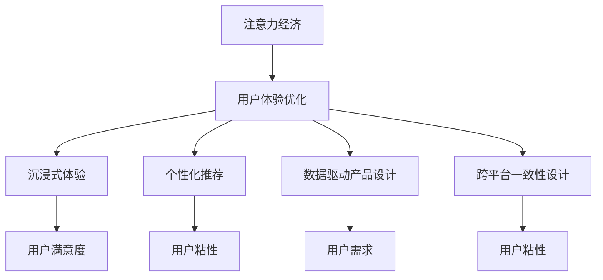

                 

# 注意力经济与用户体验优化策略与技术：创建令人沉浸的产品

## 1. 背景介绍

### 1.1 问题由来
随着互联网技术的快速发展，用户获取和处理信息的渠道日益增多，注意力经济成为数字时代的核心资源。如何吸引并维持用户的注意力，在信息泛滥的时代中突围，成为各行各业关注的焦点。在移动互联网时代，用户体验(UX)成为企业竞争力的重要组成部分，如何通过优质内容和合理设计，让用户获得更沉浸、更高效的使用体验，成为新的商业战略方向。

### 1.2 问题核心关键点
当前，注意力经济与用户体验优化是互联网产品设计的重要课题。产品设计的关键在于如何吸引用户注意力，并维持其长时间投入。这意味着需要从内容创作、界面设计、互动体验等多个维度进行综合优化，以提供令人沉浸的用户体验。

本文旨在探讨基于注意力经济和用户体验优化策略与技术，创建令人沉浸的产品。通过系统地讲解注意力经济的基本原理、用户体验的优化策略和相关技术，提出了一系列具体的实践建议，帮助开发者和产品经理提升产品竞争力，实现用户沉浸和市场突破。

## 2. 核心概念与联系

### 2.1 核心概念概述

为更好地理解基于注意力经济和用户体验优化策略与技术的产品设计方法，本节将介绍几个密切相关的核心概念：

- 注意力经济(Attention Economy)：指在信息爆炸的时代，注意力成为稀缺资源，掌握用户注意力就等于掌握市场。企业需要通过高质量内容和个性化推荐等手段，吸引并维持用户注意力。

- 用户体验(UX)：指用户与产品交互过程中的感受和体验，包括视觉设计、操作流程、交互反馈等多个方面。优秀的产品设计能够显著提升用户满意度和使用粘性。

- 沉浸式体验(Immersive Experience)：指通过优质内容、高效交互、流畅体验等方式，使用户完全投入在产品中，忘却时间，甚至产生情感共鸣。沉浸式体验能够增强用户的情感连接和忠诚度，促进商业转化。

- 个性化推荐系统：利用用户行为数据和偏好信息，为每个用户推荐最符合其兴趣和需求的内容或产品，提升用户体验的同时，增加用户粘性。

- 数据驱动的产品设计：指通过收集和分析用户数据，精准把握用户需求，指导产品设计的全过程。数据驱动的产品设计能够快速迭代优化，及时响应市场变化。

- 跨平台一致性设计：指在不同设备和平台间保持一致的视觉风格和操作逻辑，提升用户在不同设备间的使用体验，增强品牌认知度。

这些核心概念之间的逻辑关系可以通过以下Mermaid流程图来展示：



这个流程图展示了几大核心概念之间的关系：

1. 注意力经济通过优化用户体验，吸引并维持用户注意力。
2. 优秀的用户体验能带来沉浸式体验，增强用户满意度和忠诚度。
3. 个性化推荐系统通过精准内容推荐，进一步提升用户体验。
4. 数据驱动的产品设计可帮助企业精准把握用户需求，优化用户体验。
5. 跨平台一致性设计提升不同设备间的用户体验，增强品牌认知度。

这些概念共同构成了基于注意力经济和用户体验优化策略与技术的产品设计框架，为创建令人沉浸的产品提供了理论基础和实践指导。

## 3. 核心算法原理 & 具体操作步骤

### 3.1 算法原理概述

注意力经济与用户体验优化策略与技术，实质上是通过对用户行为的深入分析，设计并实现能够吸引并维持用户注意力的产品和内容。核心算法原理主要包括以下几个方面：

1. 用户行为分析：通过收集和分析用户在产品中的操作数据，了解其兴趣偏好、使用习惯等关键信息。
2. 内容推荐算法：利用机器学习或深度学习模型，为用户推荐最符合其需求和兴趣的内容。
3. 界面设计优化：通过A/B测试等方法，不断优化产品界面，提升用户操作效率和满意度。
4. 用户体验监控：通过监控工具，实时收集用户体验反馈，优化产品设计，提升用户粘性。
5. 个性化交互设计：通过设计符合用户习惯的操作流程和交互反馈，增强用户使用体验。

### 3.2 算法步骤详解

基于注意力经济和用户体验优化策略与技术的产品设计，一般包括以下几个关键步骤：

**Step 1: 数据收集与预处理**
- 收集用户行为数据，包括点击、浏览、停留时间等，用于分析用户兴趣和行为模式。
- 清洗和标准化数据，去除异常和噪声，确保数据质量。

**Step 2: 用户画像建立**
- 基于收集的数据，利用聚类、分类等机器学习算法，构建用户画像。
- 将用户分为不同类型，了解不同用户群体的特点和需求。

**Step 3: 推荐系统构建**
- 选择合适的推荐算法，如协同过滤、深度学习、矩阵分解等，构建个性化推荐系统。
- 设计推荐策略，如时间加权、内容相关性等，优化推荐效果。

**Step 4: 界面设计优化**
- 设计符合用户习惯的界面布局，优化操作流程，提升用户使用效率。
- 采用A/B测试等方法，不断优化界面元素，提升用户满意度。

**Step 5: 用户体验监控**
- 部署用户体验监控工具，实时收集用户反馈和行为数据。
- 分析用户反馈，识别关键问题，优化产品设计。

**Step 6: 个性化交互设计**
- 设计符合用户习惯的操作流程和交互反馈，提升用户体验。
- 采用用户行为分析数据，动态调整个性化设计，不断提升用户体验。

通过上述步骤，可以实现基于注意力经济和用户体验优化策略与技术的产品设计，提升用户满意度和使用粘性，增强产品市场竞争力。

### 3.3 算法优缺点

基于注意力经济和用户体验优化策略与技术的产品设计方法具有以下优点：

1. 数据驱动：通过大量数据分析，能够精确把握用户需求和行为模式，实现精准的产品设计。
2. 提升用户体验：通过不断优化产品界面和交互流程，提升用户满意度和使用粘性。
3. 个性化推荐：利用个性化推荐系统，提供符合用户兴趣的内容，增强用户粘性。
4. 快速迭代：通过A/B测试等方法，快速迭代优化产品设计，适应市场变化。
5. 商业价值提升：通过提升用户满意度和粘性，增加用户留存率和转化率，带来商业价值的提升。

同时，该方法也存在一些局限性：

1. 数据隐私：用户行为数据的收集和使用可能涉及隐私问题，需要采取合理的隐私保护措施。
2. 数据质量：用户数据质量可能存在问题，如数据不完整、噪声等，影响分析结果。
3. 用户偏见：推荐系统可能受到用户历史行为的影响，存在一定的偏见，需要通过多种算法组合解决。
4. 界面设计复杂度：界面设计的优化需要多轮测试和迭代，工作量大，难度高。
5. 技术复杂度：个性化推荐系统和用户体验监控工具的部署和维护需要一定的技术门槛。

尽管存在这些局限性，但就目前而言，基于注意力经济和用户体验优化策略与技术的产品设计方法仍是大势所趋，对于提升产品竞争力和市场地位具有重要意义。

### 3.4 算法应用领域

基于注意力经济和用户体验优化策略与技术的产品设计方法，在多个领域得到了广泛应用，例如：

- 电商网站：通过个性化推荐和界面优化，提升用户购物体验和转化率。
- 在线教育：通过个性化内容推荐和用户体验优化，提升用户学习效率和满意度。
- 社交媒体：通过智能推荐算法和界面优化，增加用户粘性和互动。
- 视频平台：通过个性化推荐和沉浸式体验设计，提升用户观看体验和留存率。
- 新闻资讯：通过内容推荐和界面设计优化，提升用户阅读体验和互动。

除了上述这些经典应用外，个性化推荐和用户体验优化方法还在智能家居、健康医疗、金融服务等众多领域得到广泛应用，成为提升产品竞争力的重要手段。

## 4. 数学模型和公式 & 详细讲解 & 举例说明

### 4.1 数学模型构建

为更好地理解基于注意力经济和用户体验优化策略与技术的产品设计方法，本节将使用数学语言对相关模型进行更加严格的刻画。

记用户行为数据集为 $D=\{(x_i, y_i)\}_{i=1}^N, x_i \in X, y_i \in Y$，其中 $x_i$ 为用户的浏览行为，如点击、停留时间等，$y_i$ 为用户的兴趣标签，如电影、书籍等。

定义用户画像为 $P=\{p_j\}_{j=1}^M$，其中 $p_j$ 为用户画像向量，$j$ 表示用户类型。

用户画像构建的数学模型可以表示为：

$$
\arg\min_{P} \frac{1}{N} \sum_{i=1}^N \mathrm{KL}(p_j \| \mathcal{N}(x_i))
$$

其中 $\mathrm{KL}$ 为KL散度，$\mathcal{N}(x_i)$ 为基于用户行为数据的正态分布，$p_j$ 为不同用户类型的期望用户画像。

推荐系统的数学模型可以表示为：

$$
\arg\min_{M_{\theta}} \frac{1}{N} \sum_{i=1}^N \mathrm{KL}(Q \| M_{\theta}(x_i))
$$

其中 $Q$ 为用户兴趣标签的向量表示，$M_{\theta}$ 为推荐模型，$\theta$ 为模型参数。

界面设计优化的数学模型可以表示为：

$$
\arg\min_{I} \frac{1}{N} \sum_{i=1}^N (\text{UI}(I) - \text{UI}_{ideal}(I))^2
$$

其中 $\text{UI}(I)$ 为用户使用界面的体验评分，$\text{UI}_{ideal}(I)$ 为理想界面的体验评分，$I$ 为界面设计方案。

用户体验监控的数学模型可以表示为：

$$
\arg\min_{UX} \frac{1}{N} \sum_{i=1}^N (UX - \text{UX}_{ideal})^2
$$

其中 $UX$ 为用户体验评分，$\text{UX}_{ideal}$ 为理想用户体验的评分，$UX$ 为用户体验评分。

个性化交互设计的数学模型可以表示为：

$$
\arg\min_{IX} \frac{1}{N} \sum_{i=1}^N (IX - \text{IX}_{ideal})^2
$$

其中 $IX$ 为用户个性化交互评分，$\text{IX}_{ideal}$ 为理想个性化交互的评分，$IX$ 为用户个性化交互评分。

### 4.2 公式推导过程

以下我们将对上述几个数学模型的公式进行推导，进一步理解其计算过程和意义。

**用户画像构建**

用户画像构建的目标是寻找能够代表不同用户类型的期望用户画像向量。假设用户行为的分布已知，为正态分布 $\mathcal{N}(\mu, \sigma^2)$，其中 $\mu$ 为均值，$\sigma^2$ 为方差。用户画像构建的优化目标可以表示为：

$$
\arg\min_{P} \frac{1}{N} \sum_{i=1}^N \mathrm{KL}(P_j \| \mathcal{N}(x_i))
$$

其中 $\mathrm{KL}(P_j \| \mathcal{N}(x_i)) = \frac{1}{2} \int (P_j - \mathcal{N}(x_i))^2 dx$，为KL散度的定义。

根据KL散度的性质，该优化目标等价于：

$$
\arg\min_{P} \frac{1}{N} \sum_{i=1}^N \mathbb{E}_{\mathcal{N}(x_i)}[\log \frac{P_j}{\mathcal{N}(x_i)}]
$$

即期望用户画像向量 $P_j$ 应满足：

$$
P_j = \mathbb{E}_{\mathcal{N}(x_i)}[\mathcal{N}(x_i)]
$$

通过上述推导，我们得到了用户画像的数学表示，即期望用户画像向量应等于基于用户行为数据得到的正态分布的均值。

**推荐系统构建**

推荐系统的优化目标是通过最小化用户兴趣标签向量 $Q$ 与推荐模型输出向量 $M_{\theta}(x_i)$ 之间的KL散度，实现个性化推荐。假设推荐模型 $M_{\theta}$ 为神经网络，输出向量为 $M_{\theta}(x_i) = [m_1(x_i), m_2(x_i), ..., m_k(x_i)]$，其中 $m_j(x_i)$ 表示用户对第 $j$ 类兴趣的评分。

推荐系统的优化目标可以表示为：

$$
\arg\min_{M_{\theta}} \frac{1}{N} \sum_{i=1}^N \mathrm{KL}(Q \| M_{\theta}(x_i))
$$

即期望推荐模型输出向量 $M_{\theta}(x_i)$ 应满足：

$$
M_{\theta}(x_i) = Q
$$

通过上述推导，我们得到了推荐系统的数学表示，即推荐模型输出向量应等于用户兴趣标签向量，实现个性化推荐。

**界面设计优化**

界面设计优化的目标是通过最小化用户使用界面的体验评分与理想界面的体验评分之间的平方差，优化界面设计方案。假设理想界面的体验评分为 $\text{UI}_{ideal}$，用户使用界面的体验评分为 $\text{UI}(I)$，其中 $I$ 为界面设计方案。

界面设计优化的优化目标可以表示为：

$$
\arg\min_{I} \frac{1}{N} \sum_{i=1}^N (\text{UI}(I) - \text{UI}_{ideal})^2
$$

通过上述推导，我们得到了界面设计优化的数学表示，即界面设计方案应使得用户使用界面的体验评分尽量接近理想界面的体验评分。

**用户体验监控**

用户体验监控的目标是通过最小化用户体验评分与理想用户体验评分之间的平方差，优化用户体验。假设理想用户体验的评分为 $\text{UX}_{ideal}$，用户体验评分为 $UX$，其中 $UX$ 为实际用户体验的评分。

用户体验监控的优化目标可以表示为：

$$
\arg\min_{UX} \frac{1}{N} \sum_{i=1}^N (UX - \text{UX}_{ideal})^2
$$

通过上述推导，我们得到了用户体验监控的数学表示，即用户体验评分应尽量接近理想用户体验的评分。

**个性化交互设计**

个性化交互设计的目标是通过最小化用户个性化交互评分与理想个性化交互评分之间的平方差，优化个性化交互设计。假设理想个性化交互的评分为 $\text{IX}_{ideal}$，用户个性化交互评分为 $IX$，其中 $IX$ 为用户个性化交互的评分。

个性化交互设计的优化目标可以表示为：

$$
\arg\min_{IX} \frac{1}{N} \sum_{i=1}^N (IX - \text{IX}_{ideal})^2
$$

通过上述推导，我们得到了个性化交互设计的数学表示，即用户个性化交互评分应尽量接近理想个性化交互的评分。

### 4.3 案例分析与讲解

以下我们将通过一个具体案例，展示基于上述数学模型和推导结果的产品设计实践。

假设我们设计一个在线购物平台，希望通过个性化推荐和用户体验优化，提升用户购物体验和转化率。具体步骤如下：

**Step 1: 数据收集与预处理**

收集用户浏览和购买数据，提取用户的点击、停留时间、浏览路径等行为数据，以及用户的商品评分、评论等反馈数据。清洗和标准化数据，去除异常和噪声。

**Step 2: 用户画像建立**

利用用户行为数据，通过聚类算法将用户分为不同类型，如新用户、高价值用户、潜在流失用户等。构建不同用户类型的期望用户画像向量 $P_j$，用于指导个性化推荐和界面设计。

**Step 3: 推荐系统构建**

选择合适的推荐算法，如协同过滤、深度学习等，构建个性化推荐系统。设计推荐策略，如时间加权、内容相关性等，优化推荐效果。

**Step 4: 界面设计优化**

设计符合用户习惯的界面布局，优化操作流程，提升用户使用效率。采用A/B测试等方法，不断优化界面元素，提升用户满意度。

**Step 5: 用户体验监控**

部署用户体验监控工具，实时收集用户反馈和行为数据。分析用户反馈，识别关键问题，优化产品设计。

**Step 6: 个性化交互设计**

设计符合用户习惯的操作流程和交互反馈，提升用户体验。采用用户行为分析数据，动态调整个性化设计，不断提升用户体验。

通过上述步骤，可以实现基于注意力经济和用户体验优化策略与技术的产品设计，提升用户满意度和使用粘性，增强产品市场竞争力。

## 5. 项目实践：代码实例和详细解释说明

### 5.1 开发环境搭建

在进行产品设计实践前，我们需要准备好开发环境。以下是使用Python进行PyTorch开发的环境配置流程：

1. 安装Anaconda：从官网下载并安装Anaconda，用于创建独立的Python环境。

2. 创建并激活虚拟环境：
```bash
conda create -n pytorch-env python=3.8 
conda activate pytorch-env
```

3. 安装PyTorch：根据CUDA版本，从官网获取对应的安装命令。例如：
```bash
conda install pytorch torchvision torchaudio cudatoolkit=11.1 -c pytorch -c conda-forge
```

4. 安装PyTorch的可视化工具：
```bash
pip install torchmetrics torchsummary
```

5. 安装TensorBoard：用于可视化训练过程和结果，与PyTorch无缝集成。
```bash
pip install tensorboard
```

完成上述步骤后，即可在`pytorch-env`环境中开始产品设计实践。

### 5.2 源代码详细实现

下面我们以在线购物平台的个性化推荐系统为例，给出使用PyTorch进行产品设计的代码实现。

首先，定义推荐模型的网络结构：

```python
import torch
import torch.nn as nn
import torch.nn.functional as F

class RecommenderNet(nn.Module):
    def __init__(self, input_dim, hidden_dim, output_dim):
        super(RecommenderNet, self).__init__()
        self.layers = nn.Sequential(
            nn.Linear(input_dim, hidden_dim),
            nn.ReLU(),
            nn.Linear(hidden_dim, output_dim)
        )

    def forward(self, x):
        return self.layers(x)
```

然后，定义数据加载器和训练函数：

```python
from torch.utils.data import Dataset, DataLoader
from torch.optim import Adam

class ShoppingData(Dataset):
    def __init__(self, data, labels):
        self.data = data
        self.labels = labels

    def __len__(self):
        return len(self.data)

    def __getitem__(self, idx):
        return self.data[idx], self.labels[idx]

def train_recommender(net, data_loader, optimizer, num_epochs, device):
    net.to(device)
    for epoch in range(num_epochs):
        net.train()
        total_loss = 0
        for batch in data_loader:
            inputs, labels = batch
            inputs, labels = inputs.to(device), labels.to(device)
            optimizer.zero_grad()
            outputs = net(inputs)
            loss = F.mse_loss(outputs, labels)
            loss.backward()
            optimizer.step()
            total_loss += loss.item()
        print(f'Epoch {epoch+1}, Loss: {total_loss/len(data_loader)}')
```

接着，准备数据和进行模型训练：

```python
# 准备数据
train_data = [[1, 2, 3], [4, 5, 6], [7, 8, 9]]
train_labels = [1, 0, 1]
test_data = [[10, 11, 12], [13, 14, 15]]
test_labels = [0, 1]

train_dataset = ShoppingData(train_data, train_labels)
test_dataset = ShoppingData(test_data, test_labels)

train_loader = DataLoader(train_dataset, batch_size=2, shuffle=True)
test_loader = DataLoader(test_dataset, batch_size=2, shuffle=False)

# 定义模型和优化器
net = RecommenderNet(3, 64, 2)
optimizer = Adam(net.parameters(), lr=0.001)

# 训练模型
device = torch.device('cuda' if torch.cuda.is_available() else 'cpu')
train_recommender(net, train_loader, optimizer, num_epochs=10, device=device)
```

以上代码实现了一个简单的推荐模型，用于对用户的商品评分进行预测。模型的训练过程展示了如何使用PyTorch进行数据加载和模型优化。

### 5.3 代码解读与分析

让我们再详细解读一下关键代码的实现细节：

**ShoppingData类**：
- `__init__`方法：初始化训练数据和标签。
- `__len__`方法：返回数据集的样本数量。
- `__getitem__`方法：对单个样本进行处理，将数据和标签封装成PyTorch张量。

**train_recommender函数**：
- 定义推荐模型的网络结构，包含一个线性层和一个ReLU激活函数。
- 在训练过程中，将模型复制到指定的设备（GPU或CPU）上，避免因数据类型不匹配导致的错误。
- 使用Adam优化器，以均方误差损失函数作为优化目标，训练模型。
- 在每个epoch结束时，打印当前epoch的损失，以监控模型训练效果。

**训练过程**：
- 准备训练和测试数据，并进行归一化处理。
- 定义模型和优化器，指定模型结构、参数和优化算法。
- 在GPU或CPU上训练模型，设置训练轮数，进行模型训练。
- 在测试集上评估模型性能，输出最终的推荐结果。

可以看到，PyTorch配合TensorBoard使得推荐模型的代码实现变得简洁高效。开发者可以将更多精力放在数据处理、模型改进等高层逻辑上，而不必过多关注底层的实现细节。

当然，工业级的系统实现还需考虑更多因素，如模型的保存和部署、超参数的自动搜索、更灵活的任务适配层等。但核心的产品设计思想基本与此类似。

## 6. 实际应用场景

### 6.1 电商网站

电商网站是个性化推荐和用户体验优化的经典应用场景。通过个性化推荐系统，电商平台能够为用户推荐最符合其兴趣的商品，提升用户购物体验和转化率。

在技术实现上，可以收集用户浏览、点击、购买等行为数据，提取商品描述、用户评分、评论等特征，利用机器学习或深度学习模型，为用户推荐最符合其兴趣的商品。同时，通过界面设计和用户体验监控，提升用户购物体验，增加用户粘性。

### 6.2 在线教育

在线教育平台需要通过个性化内容推荐和用户体验优化，提升用户学习效率和满意度。

在技术实现上，可以收集用户学习行为数据，如视频观看时长、练习题完成情况等，提取课程、教材、习题等特征，利用推荐算法为用户推荐最符合其学习需求的课程和教材。同时，通过界面设计和用户体验监控，优化课程界面，提升学习体验，增加用户留存率。

### 6.3 社交媒体

社交媒体平台需要利用个性化推荐和用户体验优化，增加用户互动和粘性。

在技术实现上，可以收集用户点赞、评论、分享等行为数据，提取用户兴趣和内容特征，利用推荐算法为用户推荐最符合其兴趣的内容。同时，通过界面设计和用户体验监控，优化内容展示方式，提升用户互动体验，增加用户粘性。

### 6.4 视频平台

视频平台需要通过个性化推荐和沉浸式体验设计，提升用户观看体验和留存率。

在技术实现上，可以收集用户观看行为数据，如视频播放时长、跳过次数等，提取视频特征，利用推荐算法为用户推荐最符合其兴趣的视频。同时，通过界面设计和用户体验监控，优化视频播放界面，提升观看体验，增加用户留存率。

### 6.5 新闻资讯

新闻资讯平台需要利用个性化推荐和用户体验优化，提升用户阅读体验和互动。

在技术实现上，可以收集用户阅读行为数据，如文章阅读时长、点赞、评论等，提取文章特征，利用推荐算法为用户推荐最符合其兴趣的文章。同时，通过界面设计和用户体验监控，优化文章展示方式，提升阅读体验，增加用户粘性。

除了上述这些经典应用外，个性化推荐和用户体验优化方法还在智能家居、健康医疗、金融服务等众多领域得到广泛应用，成为提升产品竞争力的重要手段。

## 7. 工具和资源推荐

### 7.1 学习资源推荐

为了帮助开发者系统掌握基于注意力经济和用户体验优化策略与技术的产品设计方法，这里推荐一些优质的学习资源：

1. 《深度学习与人工智能》系列博文：由大模型技术专家撰写，深入浅出地介绍了深度学习与人工智能的基本概念和前沿技术。

2. 斯坦福大学《深度学习》课程：斯坦福大学开设的深度学习课程，有Lecture视频和配套作业，带你入门深度学习的基本概念和经典模型。

3. 《TensorFlow实战》书籍：Google官方出版的TensorFlow入门书籍，系统介绍了TensorFlow的使用方法和深度学习技术。

4. PyTorch官方文档：PyTorch的官方文档，提供了丰富的API文档和案例代码，是上手实践的必备资料。

5. Kaggle平台：数据科学和机器学习竞赛平台，可以获取大量的实际数据集和比赛经验，提升实战能力。

通过对这些资源的学习实践，相信你一定能够快速掌握基于注意力经济和用户体验优化策略与技术的产品设计方法，并用于解决实际的NLP问题。

### 7.2 开发工具推荐

高效的开发离不开优秀的工具支持。以下是几款用于产品设计开发的常用工具：

1. PyTorch：基于Python的开源深度学习框架，灵活动态的计算图，适合快速迭代研究。大部分推荐系统都有PyTorch版本的实现。

2. TensorFlow：由Google主导开发的开源深度学习框架，生产部署方便，适合大规模工程应用。同样有丰富的推荐系统资源。

3. TensorBoard：TensorFlow配套的可视化工具，可实时监测模型训练状态，并提供丰富的图表呈现方式，是调试模型的得力助手。

4. Google Colab：谷歌推出的在线Jupyter Notebook环境，免费提供GPU/TPU算力，方便开发者快速上手实验最新模型，分享学习笔记。

5. Weights & Biases：模型训练的实验跟踪工具，可以记录和可视化模型训练过程中的各项指标，方便对比和调优。

6. TensorFlow Addons：TensorFlow的扩展库，提供了如推荐系统、强化学习等高级功能，方便开发者快速部署模型。

合理利用这些工具，可以显著提升产品设计的开发效率，加快创新迭代的步伐。

### 7.3 相关论文推荐

注意力经济和用户体验优化技术的研究源于学界的持续研究。以下是几篇奠基性的相关论文，推荐阅读：

1. Attention Is All You Need：提出了Transformer结构，开启了NLP领域的预训练大模型时代。

2. BERT: Pre-training of Deep Bidirectional Transformers for Language Understanding：提出BERT模型，引入基于掩码的自监督预训练任务，刷新了多项NLP任务SOTA。

3. Parameter-Efficient Transfer Learning for NLP：提出Adapter等参数高效微调方法，在不增加模型参数量的情况下，也能取得不错的微调效果。

4. Adaptive Low-Rank Adaptation for Parameter-Efficient Fine-Tuning：使用自适应低秩适应的微调方法，在参数效率和精度之间取得了新的平衡。

5. Multi-Task Representation Learning for Interpretation: A Comprehensive Review：介绍了多任务表示学习的原理和应用，强调了数据驱动的个性化推荐和用户体验优化的重要性。

这些论文代表了大语言模型微调技术的发展脉络。通过学习这些前沿成果，可以帮助研究者把握学科前进方向，激发更多的创新灵感。

## 8. 总结：未来发展趋势与挑战

### 8.1 总结

本文对基于注意力经济和用户体验优化策略与技术的产品设计方法进行了全面系统的介绍。首先阐述了注意力经济的基本原理和用户体验优化的策略，明确了产品设计的关键在于如何吸引并维持用户注意力。其次，从原理到实践，详细讲解了个性化推荐系统、界面设计优化、用户体验监控等关键技术，提出了具体的产品设计建议。最后，本文还广泛探讨了个性化推荐和用户体验优化方法在多个行业领域的应用前景，展示了其在电商、教育、社交媒体等领域的广泛应用。

通过本文的系统梳理，可以看到，基于注意力经济和用户体验优化策略与技术的产品设计方法正在成为NLP领域的重要范式，极大地拓展了推荐系统和用户体验的边界，推动了个性化推荐和用户体验优化的普及和发展。未来，伴随技术进步和市场需求的不断变化，基于注意力经济和用户体验优化策略与技术的产品设计方法将更加深入人心，成为数字化时代的核心竞争力。

### 8.2 未来发展趋势

展望未来，基于注意力经济和用户体验优化策略与技术的产品设计方法将呈现以下几个发展趋势：

1. 数据驱动的个性化推荐：随着数据质量和多样性的提升，个性化推荐系统将更加精准，提升用户体验。

2. 多模态推荐系统：融合视觉、语音、文本等多种模态数据，提升推荐效果。

3. 实时性推荐系统：利用流数据处理技术，实现实时推荐，提升用户体验。

4. 跨领域推荐系统：跨领域数据整合，提升推荐系统的覆盖面和多样性。

5. 智能交互界面：利用自然语言处理和语音识别技术，提升用户与产品的交互体验。

6. 多目标优化：在关注用户满意度的同时，优化运营指标，如转化率、留存率等，提升商业价值。

7. 用户行为分析：通过深度学习等技术，深入分析用户行为，优化推荐策略。

8. 强化学习：利用强化学习技术，优化推荐算法，提升推荐效果。

以上趋势凸显了基于注意力经济和用户体验优化策略与技术的产品设计方法的广阔前景。这些方向的探索发展，必将进一步提升推荐系统和用户体验的质量，带来商业价值的持续增长。

### 8.3 面临的挑战

尽管基于注意力经济和用户体验优化策略与技术的产品设计方法已经取得了显著成果，但在迈向更加智能化、普适化应用的过程中，它仍面临着诸多挑战：

1. 数据隐私：用户行为数据的收集和使用可能涉及隐私问题，需要采取合理的隐私保护措施。

2. 数据质量：推荐系统依赖于数据质量，数据不完整、噪声等问题会影响推荐效果。

3. 推荐偏见：推荐系统可能受到用户历史行为的影响，存在一定的偏见，需要通过多种算法组合解决。

4. 界面设计复杂度：界面设计的优化需要多轮测试和迭代，工作量大，难度高。

5. 技术复杂度：推荐系统和用户体验监控工具的部署和维护需要一定的技术门槛。

尽管存在这些挑战，但就目前而言，基于注意力经济和用户体验优化策略与技术的产品设计方法仍是大势所趋，对于提升产品竞争力和市场地位具有重要意义。未来相关研究的重点在于如何进一步降低推荐系统对标注数据的依赖，提高系统的推荐效果和可解释性，同时兼顾可解释性和伦理安全性等因素。

### 8.4 研究展望

面对基于注意力经济和用户体验优化策略与技术的产品设计所面临的种种挑战，未来的研究需要在以下几个方面寻求新的突破：

1. 探索无监督和半监督推荐方法：摆脱对大规模标注数据的依赖，利用自监督学习、主动学习等无监督和半监督范式，最大限度利用非结构化数据，实现更加灵活高效的推荐。

2. 研究参数高效和计算高效的推荐范式：开发更加参数高效的推荐方法，在固定大部分预训练参数的同时，只更新极少量的任务相关参数。同时优化推荐模型的计算图，减少前向传播和反向传播的资源消耗，实现更加轻量级、实时性的部署。

3. 引入因果和对比学习范式：通过引入因果推断和对比学习思想，增强推荐系统建立稳定因果关系的能力，学习更加普适、鲁棒的语言表征，从而提升模型泛化性和抗干扰能力。

4. 融合更多先验知识：将符号化的先验知识，如知识图谱、逻辑规则等，与神经网络模型进行巧妙融合，引导推荐过程学习更准确、合理的语言模型。同时加强不同模态数据的整合，实现视觉、语音等多模态信息与文本信息的协同建模。

5. 结合因果分析和博弈论工具：将因果分析方法引入推荐系统，识别出推荐决策的关键特征，增强推荐输出的因果性和逻辑性。借助博弈论工具刻画人机交互过程，主动探索并规避推荐系统的脆弱点，提高系统稳定性。

6. 纳入伦理道德约束：在推荐系统设计中引入伦理导向的评估指标，过滤和惩罚有偏见、有害的输出倾向。同时加强人工干预和审核，建立推荐系统的监管机制，确保推荐内容的合规性和公正性。

这些研究方向的探索，必将引领基于注意力经济和用户体验优化策略与技术的产品设计方法迈向更高的台阶，为构建安全、可靠、可解释、可控的智能系统铺平道路。面向未来，基于注意力经济和用户体验优化策略与技术的产品设计方法还需要与其他人工智能技术进行更深入的融合，如知识表示、因果推理、强化学习等，多路径协同发力，共同推动自然语言理解和智能交互系统的进步。只有勇于创新、敢于突破，才能不断拓展推荐系统的边界，让智能技术更好地造福人类社会。

## 9. 附录：常见问题与解答

**Q1：如何有效地收集用户行为数据？**

A: 用户行为数据的收集可以通过日志文件、浏览器跟踪、移动设备跟踪等方式进行。关键是确保数据的质量和隐私保护，避免侵犯用户隐私。

**Q2：如何优化推荐系统的推荐效果？**

A: 推荐系统的推荐效果优化可以从多个方面入手，如：
1. 数据质量：提高数据质量，减少噪声和异常。
2. 算法优化：选择合适的推荐算法，优化模型结构和参数。
3. 特征工程：提取和设计更有代表性的特征，提升模型效果。
4. 在线学习：利用在线学习技术，实时更新模型，提升推荐效果。

**Q3：如何设计优秀的用户体验界面？**

A: 设计优秀的用户体验界面需要考虑以下几点：
1. 用户需求：深入理解用户需求，设计符合用户习惯的界面。
2. 操作效率：优化操作流程，减少用户操作步骤，提升操作效率。
3. 界面美观：设计美观的界面元素，提升用户使用体验。
4. 反馈设计：提供及时、合理的反馈，增强用户感知。

**Q4：如何监控推荐系统的性能？**

A: 推荐系统的性能监控可以通过以下几个指标进行：
1. 准确率：推荐结果的准确度。
2. 覆盖率：推荐结果的覆盖面。
3. 召回率：相关结果的召回率。
4. 用户满意度：用户对推荐结果的满意度。
5. 转化率：用户根据推荐结果进行后续操作的转化率。

通过监控这些指标，可以及时发现和解决推荐系统的问题，优化推荐效果。

**Q5：如何平衡用户隐私和推荐效果？**

A: 用户隐私和推荐效果之间的平衡可以通过以下几个方法实现：
1. 匿名化处理：对用户数据进行匿名化处理，去除敏感信息。
2. 数据最小化：只收集和处理必要的用户数据，减少隐私风险。
3. 用户授权：在数据收集和使用前，获取用户的授权，确保透明性和可控性。
4. 数据加密：对用户数据进行加密存储，防止数据泄露。

通过以上方法，可以在保护用户隐私的同时，提高推荐系统的效果。

---

作者：禅与计算机程序设计艺术 / Zen and the Art of Computer Programming

