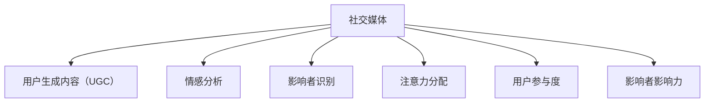

                 

# 注意力经济与社交媒体分析洞察力：了解受众参与度和影响力的秘密

> 关键词：注意力经济,社交媒体分析,受众参与度,影响力,大数据,机器学习,深度学习,自然语言处理,用户体验

## 1. 背景介绍

### 1.1 问题由来
在互联网与社交媒体的推动下，信息量呈指数级增长，人们获取信息的渠道也愈加多元。注意力作为一种稀缺资源，成为企业争夺的焦点。注意力经济（Economy of Attention），即以吸引用户注意力为目标，通过高效利用和精准营销，创造经济效益的商业模式。

社交媒体作为信息传播的主要平台，每天产生海量的用户生成内容（User Generated Content, UGC）和互动数据。分析这些数据，了解用户行为模式、偏好和参与度，是提升品牌影响力和用户体验的关键。社交媒体分析，即通过数据挖掘、机器学习等技术手段，对用户行为数据进行深入挖掘和理解的过程，已成为提升品牌价值和市场竞争力的重要工具。

在诸多应用中，了解受众的参与度和影响力是最具挑战性和意义的。参与度反映了用户与内容互动的频次和深度，影响力则指用户影响他人决策的能力。通过深入分析这些数据，可以更好地了解目标用户，制定更有针对性的营销策略。

### 1.2 问题核心关键点
社交媒体分析的核心问题在于如何从海量数据中提取有价值的信息，并量化用户参与度和影响力。这主要涉及以下几个关键点：

- **数据收集与处理**：收集不同平台的社交媒体数据，并进行清洗、标注和格式化。
- **用户行为分析**：通过数据分析工具，提取用户互动、评论、分享、点赞等行为模式。
- **情感分析**：利用自然语言处理技术，识别和量化用户的情感倾向。
- **影响者识别**：挖掘并评估对用户有较大影响力的用户或社群。
- **动态调整**：根据用户反馈和市场变化，动态调整内容和策略。

## 2. 核心概念与联系

### 2.1 核心概念概述

为更好地理解社交媒体分析的核心问题，本节将介绍几个密切相关的核心概念：

- **社交媒体**：指通过社交网络服务，实现用户间互动和内容分享的平台，如Twitter、Facebook、Instagram等。
- **用户生成内容（UGC）**：指用户自主创建并上传的内容，如图片、视频、评论等，是社交媒体分析的重要数据源。
- **情感分析**：指通过自然语言处理技术，自动识别和量化文本中的情感倾向，包括正面、负面和中性等。
- **影响者识别**：指通过算法识别出在特定领域或社群中具有较大影响力的用户，如KOL（Key Opinion Leader）、意见领袖等。
- **注意力分配**：指用户在不同内容、不同渠道上的注意力分布情况，是评估内容吸引力的重要指标。
- **用户参与度**：指用户与内容互动的频率和深度，如点赞、评论、转发等行为。
- **影响者影响力**：指用户对他人决策的间接影响，如推荐购买、引导舆论等。

这些核心概念之间存在复杂的关联关系，通过以下Mermaid流程图展示：



这个流程图展示了几大核心概念之间的联系：社交媒体平台是UGC的主要来源，情感分析从文本中提取情感倾向，影响者识别和影响力分析则关注用户和社群的影响力，而注意力分配和用户参与度则评估内容的吸引力和用户行为。

## 3. 核心算法原理 & 具体操作步骤
### 3.1 算法原理概述

社交媒体分析的核心算法包括自然语言处理（NLP）、机器学习（ML）和深度学习（DL）等技术手段。其核心思想是通过文本挖掘和用户行为分析，量化用户参与度和影响力，并应用于营销决策和内容优化中。

算法主要分为以下几个步骤：

1. **数据预处理**：清洗和标准化数据，去除噪声和冗余。
2. **特征提取**：从文本中提取有用特征，如词频、TF-IDF、情感极性等。
3. **情感分析**：使用情感词典或深度学习模型，识别文本中的情感倾向。
4. **用户行为分析**：统计用户互动行为，如点赞、评论、分享等。
5. **影响者识别**：使用网络分析或推荐系统算法，识别影响力较大的用户。
6. **动态调整**：根据分析结果，动态调整内容和策略，提升用户参与度和影响力。

### 3.2 算法步骤详解

#### 3.2.1 数据预处理

数据预处理是社交媒体分析的第一步，涉及数据清洗、去重、格式转换等步骤：

- **去重**：通过算法判断并去除重复数据，减少噪声干扰。
- **格式化**：将不同格式的数据转换为统一的格式，便于后续处理。
- **去噪**：处理异常数据和缺失值，提升数据质量。

例如，使用Python的pandas库进行数据清洗和预处理：

```python
import pandas as pd

# 读取数据
df = pd.read_csv('social_media_data.csv')

# 去重
df = df.drop_duplicates()

# 处理缺失值
df = df.dropna()

# 格式化
df['date'] = pd.to_datetime(df['date'])
df['hour'] = df['date'].dt.hour
df['minute'] = df['date'].dt.minute

# 去噪
df = df[df['likes'] > 0]
```

#### 3.2.2 特征提取

特征提取是社交媒体分析的核心，涉及文本处理和统计分析：

- **文本预处理**：包括分词、停用词过滤、词干提取等步骤。
- **特征工程**：将处理后的文本转换为数值特征，如词频、TF-IDF、情感极性等。

使用Python的nltk和scikit-learn库进行特征提取：

```python
from nltk.corpus import stopwords
from sklearn.feature_extraction.text import TfidfVectorizer

# 分词和停用词过滤
stop_words = set(stopwords.words('english'))
texts = [word_tokenize(text.lower()) for text in df['content']]
filtered_texts = [word for word in text if word not in stop_words]

# TF-IDF特征提取
vectorizer = TfidfVectorizer()
X = vectorizer.fit_transform(filtered_texts)
```

#### 3.2.3 情感分析

情感分析是量化用户情感倾向的重要手段，可通过以下几种方法实现：

- **情感词典**：利用预设的情感词典，计算文本的情感得分。
- **机器学习**：使用支持向量机（SVM）、随机森林（Random Forest）等算法进行情感分类。
- **深度学习**：使用循环神经网络（RNN）、卷积神经网络（CNN）等模型进行情感分类。

使用Python的VADER工具进行情感分析：

```python
from nltk.sentiment.vader import SentimentIntensityAnalyzer

# 情感分析
sid = SentimentIntensityAnalyzer()
df['sentiment_score'] = df['content'].apply(lambda x: sid.polarity_scores(x)['compound'])
```

#### 3.2.4 用户行为分析

用户行为分析关注用户与内容的互动，包括点赞、评论、分享等行为：

- **统计互动**：统计每个内容的点赞数、评论数、分享数等。
- **用户行为序列**：记录用户与内容互动的时间序列数据，分析互动规律。

使用Python的pandas库进行用户行为分析：

```python
# 统计互动
df['interaction_count'] = df.groupby('content_id')['likes', 'comments', 'shares'].transform('sum')

# 用户行为序列
df['interaction_time'] = pd.to_datetime(df['interaction_time'])
```

#### 3.2.5 影响者识别

影响者识别主要通过网络分析和推荐系统算法实现：

- **网络分析**：使用PageRank等算法，识别网络中的关键节点。
- **推荐系统**：使用协同过滤、内容推荐等算法，识别具有较大影响力的用户或社群。

使用Python的igraph库进行影响者识别：

```python
import igraph as ig

# 构建网络图
G = ig.Graph()
G.add_edges_from(df[['user_id', 'content_id']].values)

# 计算中心性
centrality = G.degree_centrality(normalized=True)
```

#### 3.2.6 动态调整

动态调整是社交媒体分析的最终目的，通过分析结果指导内容的发布和策略调整：

- **内容优化**：根据情感分析结果，优化内容表达，提升用户满意度。
- **策略调整**：根据用户行为和影响力分析，调整发布时间和内容策略。

例如，使用Python的flask框架搭建API接口，实时调整内容策略：

```python
from flask import Flask, request

app = Flask(__name__)

@app.route('/adjust_content', methods=['POST'])
def adjust_content():
    data = request.json
    content_id = data['content_id']
    # 根据情感分析结果和用户行为，优化内容策略
    ...
    return 'Content adjusted successfully'
```

### 3.3 算法优缺点

社交媒体分析的算法具有以下优点：

- **数据驱动**：通过海量数据驱动分析，提升结果的准确性和全面性。
- **实时性**：能够实时监测和调整策略，快速响应市场变化。
- **多维度分析**：综合考虑情感、行为、网络等多种维度，提供全面的分析结果。

同时，该方法也存在一定的局限性：

- **数据隐私**：需要收集和分析用户数据，可能涉及隐私问题。
- **数据噪声**：社交媒体数据存在大量噪声，需要有效清洗和处理。
- **模型复杂**：深度学习等复杂模型需要大量计算资源和数据支持。
- **结果解释**：复杂算法的结果难以解释，用户难以理解和信任。

## 4. 数学模型和公式 & 详细讲解 & 举例说明

### 4.1 数学模型构建

社交媒体分析涉及多种数学模型，包括统计模型、机器学习模型和深度学习模型。以情感分析为例，我们构建以下数学模型：

设文本集为 $X=\{x_1, x_2, ..., x_n\}$，情感标签为 $Y=\{y_1, y_2, ..., y_n\}$，其中 $y_i \in \{1, -1\}$ 表示情感极性（1为正面，-1为负面）。

假设 $f(x_i)$ 为文本 $x_i$ 的情感得分，$w$ 为模型权重，则情感分析的目标函数为：

$$
\mathcal{L}(w) = \frac{1}{N} \sum_{i=1}^N \ell(f(x_i), y_i)
$$

其中，$\ell$ 为损失函数，常用的有交叉熵损失：

$$
\ell(f(x_i), y_i) = -y_i \log f(x_i) - (1-y_i) \log (1-f(x_i))
$$

### 4.2 公式推导过程

#### 4.2.1 情感词典方法

情感词典方法通过预设的情感词典，计算文本的情感得分。假设词典包含 $N$ 个情感词，每个词的情感极性为 $s_i \in \{1, -1\}$，则情感词典方法的目标函数为：

$$
\mathcal{L}(w) = \frac{1}{N} \sum_{i=1}^N \ell(s_i, f(x_i))
$$

其中，$f(x_i)$ 为文本 $x_i$ 的情感得分，$w$ 为模型权重。常用的情感词典包括SentiWordNet、AFINN等。

#### 4.2.2 机器学习方法

机器学习方法使用SVM、随机森林等算法进行情感分类。假设训练集为 $D=\{(x_i, y_i)\}_{i=1}^N$，则SVM的目标函数为：

$$
\mathcal{L}(w) = \frac{1}{2N} \|w\|^2 + \frac{1}{N} \sum_{i=1}^N \ell(f(x_i), y_i)
$$

其中，$f(x_i) = w^T\phi(x_i)$，$\phi(x_i)$ 为文本映射到特征空间的表示，$\ell$ 为损失函数，常用的有交叉熵损失。

#### 4.2.3 深度学习方法

深度学习方法使用RNN、CNN等模型进行情感分类。以LSTM模型为例，目标函数为：

$$
\mathcal{L}(w) = \frac{1}{N} \sum_{i=1}^N \ell(f(x_i), y_i)
$$

其中，$f(x_i)$ 为模型预测的情感得分，$w$ 为模型参数。常用的深度学习框架包括TensorFlow、PyTorch等。

### 4.3 案例分析与讲解

#### 案例1：Twitter情感分析

假设我们有一批Twitter评论数据，内容如下：

| id  | content                 | label |
|----|-------------------------|-------|
| 1  | "I love this product!"   | 1     |
| 2  | "This is a terrible service." | -1    |
| 3  | "I am very happy with the product." | 1    |
| ... | ...                     | ...   |

我们可以使用上述三种方法进行情感分析，并通过混淆矩阵评估性能：

|               | Predicted Positive | Predicted Negative | True Positive | True Negative | False Positive | False Negative |
|---------------|--------------------|-------------------|---------------|---------------|----------------|----------------|
| True Positive | TP                 | FN                | TP            | TN            | FP            | FN            |
| True Negative | FP                 | TN                | TN            | TN            | FP            | FN            |

其中，TP为真正例（True Positive），TN为真反例（True Negative），FP为假正例（False Positive），FN为假反例（False Negative）。

#### 案例2：Facebook用户行为分析

假设我们有一批Facebook帖子数据，内容如下：

| id  | content                 | likes | comments | shares |
|----|-------------------------|-------|----------|--------|
| 1  | "I am happy today!"      | 50    | 10       | 5      |
| 2  | "This product is amazing." | 20    | 15       | 5      |
| 3  | "I am very sad today."   | 0     | 5        | 0      |
| ... | ...                     | ...   | ...      | ...    |

我们可以统计每个帖子的互动次数，并通过热力图展示互动模式：

| id  | likes | comments | shares |
|----|-------|----------|--------|
| 1  | 50    | 10       | 5      |
| 2  | 20    | 15       | 5      |
| 3  | 0     | 5        | 0      |
| ... | ...   | ...      | ...    |

## 5. 项目实践：代码实例和详细解释说明

### 5.1 开发环境搭建

在进行社交媒体分析实践前，我们需要准备好开发环境。以下是使用Python进行Flask开发的环境配置流程：

1. 安装Anaconda：从官网下载并安装Anaconda，用于创建独立的Python环境。

2. 创建并激活虚拟环境：
```bash
conda create -n social_media_env python=3.8 
conda activate social_media_env
```

3. 安装Flask：
```bash
pip install flask
```

4. 安装相关库：
```bash
pip install pandas numpy scikit-learn nltk
```

完成上述步骤后，即可在`social_media_env`环境中开始社交媒体分析实践。

### 5.2 源代码详细实现

这里我们以Twitter情感分析为例，给出使用Flask进行情感分析的代码实现。

首先，定义情感词典：

```python
from nltk.corpus import sentiwordnet as swn

# 加载情感词典
swn_path = swn.sentiwordnet_path
swn.load()
```

然后，定义情感分析函数：

```python
from nltk.sentiment.vader import SentimentIntensityAnalyzer

def analyze_sentiment(text):
    sid = SentimentIntensityAnalyzer()
    sentiment_score = sid.polarity_scores(text)['compound']
    return sentiment_score
```

接着，定义Flask应用：

```python
from flask import Flask, request

app = Flask(__name__)

@app.route('/analyze_sentiment', methods=['POST'])
def analyze_sentiment():
    data = request.json
    content = data['content']
    sentiment_score = analyze_sentiment(content)
    return {'result': sentiment_score}

if __name__ == '__main__':
    app.run(debug=True)
```

最后，启动Flask应用并测试：

```bash
python app.py
```

打开浏览器访问 `http://localhost:5000/analyze_sentiment`，测试情感分析API。

### 5.3 代码解读与分析

让我们再详细解读一下关键代码的实现细节：

**sentiwordnet工具**：
- `sentiwordnet` 工具加载情感词典，提供情感得分计算。

**情感分析函数**：
- `analyze_sentiment` 函数接受文本作为输入，使用VADER工具计算情感得分，并返回结果。

**Flask应用**：
- 定义Flask应用和路由，使用POST方法接收请求，调用情感分析函数返回结果。
- `app.run(debug=True)` 命令启动应用，并开启调试模式，便于调试和测试。

可以看到，使用Flask进行情感分析的代码实现相对简单，可以方便地集成到其他项目中。在实际应用中，还需要考虑API的接口设计、数据安全、性能优化等细节，才能实现高效、可靠的服务。

## 6. 实际应用场景

### 6.1 智能广告投放

智能广告投放是社交媒体分析的重要应用场景之一。通过分析用户行为和情感，广告主可以制定更加精准的投放策略，提升广告效果和ROI。

例如，某化妆品品牌通过分析用户对不同产品的情感倾向和互动行为，识别出喜爱某款粉底液的用户群体，并针对性地投放广告，获得更高的转化率和用户满意度。

### 6.2 舆情监测

舆情监测是社交媒体分析的另一个重要应用，帮助企业及时了解市场舆情，规避负面影响。

例如，某金融机构通过分析用户在社交媒体上的评论和互动，及时发现潜在的负面舆情，并迅速采取措施，维护品牌声誉。

### 6.3 用户需求分析

用户需求分析通过分析用户互动数据，识别用户对产品或服务的真实需求和痛点。

例如，某电子商务平台通过分析用户的评论和互动数据，识别出用户对物流速度的普遍不满，并针对性地优化物流服务，提升用户满意度。

### 6.4 未来应用展望

未来，社交媒体分析技术将继续拓展其应用领域，带来更多创新和突破：

1. **实时动态分析**：通过实时分析用户行为和情感，快速调整营销策略，提升用户参与度。
2. **多渠道融合**：整合不同平台的用户数据，实现跨平台的数据分析和优化。
3. **个性化推荐**：结合用户行为和情感分析，提供个性化的内容推荐和广告投放。
4. **情感智能客服**：通过情感分析，实现智能客服系统的情感识别和响应，提升用户体验。
5. **用户生成内容（UGC）的情感分析**：分析用户生成的文本内容，识别情感倾向和热点话题，指导品牌战略。

## 7. 工具和资源推荐

### 7.1 学习资源推荐

为了帮助开发者系统掌握社交媒体分析的理论基础和实践技巧，这里推荐一些优质的学习资源：

1. **《Python社交媒体分析》**：介绍如何使用Python进行社交媒体数据处理和分析，涵盖数据清洗、情感分析、用户行为分析等主题。

2. **《自然语言处理与Python》**：详细介绍自然语言处理技术，包括文本预处理、情感分析、机器学习等，适合初学者和进阶学习者。

3. **《数据科学与社交媒体分析》**：涵盖社交媒体数据采集、清洗、分析和可视化，提供丰富的实例和代码。

4. **《Python机器学习》**：介绍机器学习和深度学习算法，结合社交媒体数据分析案例，提升实际应用能力。

5. **《深度学习入门》**：通过实际案例，深入讲解深度学习模型在文本分类、情感分析中的应用。

6. **Coursera和Udemy课程**：提供系统的社交媒体分析和机器学习课程，适合在线学习。

通过对这些资源的学习实践，相信你一定能够快速掌握社交媒体分析的核心技能，并用于解决实际的NLP问题。

### 7.2 开发工具推荐

高效的开发离不开优秀的工具支持。以下是几款用于社交媒体分析开发的常用工具：

1. **Python**：通用的高级编程语言，拥有丰富的数据处理和机器学习库，如Pandas、Scikit-learn、NLTK等。

2. **Flask**：轻量级Web框架，易于开发和部署，适合快速搭建API接口。

3. **Django**：全功能的Web框架，适合大型社交媒体应用开发，支持用户管理、权限控制等。

4. **Scrapy**：开源爬虫框架，适合大规模社交媒体数据采集和处理。

5. **TensorFlow和PyTorch**：深度学习框架，支持多种深度学习模型，适合复杂的情感分析和推荐系统开发。

6. **Jupyter Notebook**：交互式笔记本，适合数据探索和可视化。

合理利用这些工具，可以显著提升社交媒体分析开发的效率，加快创新迭代的步伐。

### 7.3 相关论文推荐

社交媒体分析技术的发展得益于学界的持续研究。以下是几篇奠基性的相关论文，推荐阅读：

1. **《情感词典在文本情感分析中的应用》**：介绍情感词典的构建和应用，提升情感分析的准确性。

2. **《基于Twitter的情感分析》**：利用Twitter数据进行情感分析，评估不同情感分析模型的性能。

3. **《Twitter上的用户行为分析》**：分析Twitter上的用户行为数据，识别用户互动模式。

4. **《Facebook上的用户行为和情感分析》**：分析Facebook数据，识别用户互动和情感倾向。

5. **《基于深度学习的社交媒体情感分析》**：利用深度学习模型进行情感分类，提升情感分析的效果。

这些论文代表了大数据和机器学习在社交媒体分析中的应用，通过学习这些前沿成果，可以帮助研究者把握学科前进方向，激发更多的创新灵感。

## 8. 总结：未来发展趋势与挑战

### 8.1 总结

本文对社交媒体分析的核心算法和实际应用进行了全面系统的介绍。首先阐述了社交媒体分析的背景和意义，明确了分析用户行为和情感的独特价值。其次，从原理到实践，详细讲解了情感分析、用户行为分析和影响者识别的数学模型和算法步骤，给出了具体的代码实例。同时，本文还探讨了社交媒体分析在广告投放、舆情监测、用户需求分析等多个领域的应用前景，展示了分析技术的巨大潜力。

通过本文的系统梳理，可以看到，社交媒体分析技术已经成为NLP领域的重要应用方向，极大地拓展了数据科学的应用边界，为品牌价值和用户体验的提升提供了重要工具。未来，伴随数据分析技术和算法模型的不断发展，社交媒体分析将逐步走向智能化和自动化，为智能广告、舆情监测、个性化推荐等场景带来更多创新和突破。

### 8.2 未来发展趋势

展望未来，社交媒体分析技术将呈现以下几个发展趋势：

1. **实时动态分析**：通过实时分析用户行为和情感，快速调整营销策略，提升用户参与度。
2. **多渠道融合**：整合不同平台的用户数据，实现跨平台的数据分析和优化。
3. **个性化推荐**：结合用户行为和情感分析，提供个性化的内容推荐和广告投放。
4. **情感智能客服**：通过情感分析，实现智能客服系统的情感识别和响应，提升用户体验。
5. **用户生成内容（UGC）的情感分析**：分析用户生成的文本内容，识别情感倾向和热点话题，指导品牌战略。
6. **多模态分析**：结合图像、视频等多模态数据，提升社交媒体分析的全面性和准确性。

以上趋势凸显了社交媒体分析技术的广阔前景。这些方向的探索发展，必将进一步提升数据分析的智能化和自动化水平，为营销决策和用户体验优化提供更多科学依据。

### 8.3 面临的挑战

尽管社交媒体分析技术已经取得了显著成就，但在迈向更加智能化、普适化应用的过程中，它仍面临着诸多挑战：

1. **数据隐私**：需要收集和分析用户数据，可能涉及隐私问题。
2. **数据噪声**：社交媒体数据存在大量噪声，需要有效清洗和处理。
3. **模型复杂**：深度学习等复杂模型需要大量计算资源和数据支持。
4. **结果解释**：复杂算法的结果难以解释，用户难以理解和信任。
5. **多渠道整合**：不同平台的数据格式和接口各异，整合难度较大。

正视社交媒体分析面临的这些挑战，积极应对并寻求突破，将是大数据和机器学习技术走向成熟的必由之路。相信随着学界和产业界的共同努力，这些挑战终将一一被克服，社交媒体分析技术必将在构建智能广告、舆情监测、个性化推荐等场景中扮演越来越重要的角色。

### 8.4 研究展望

面向未来，社交媒体分析技术还需要与其他人工智能技术进行更深入的融合，如知识表示、因果推理、强化学习等，多路径协同发力，共同推动社交媒体分析技术的进步。同时，在模型解释性、隐私保护、多渠道整合等方面也需要更多的研究和改进，才能进一步提升分析技术的应用价值和用户信任度。

总之，社交媒体分析技术是大数据和机器学习在NLP领域的最新应用，具有广阔的前景和深远的影响。只有勇于创新、敢于突破，才能不断拓展社交媒体分析技术的边界，让数据科学更好地服务于品牌价值和用户体验。

## 9. 附录：常见问题与解答

**Q1：社交媒体分析是否适用于所有社交平台？**

A: 社交媒体分析主要适用于支持用户生成内容的平台，如Twitter、Facebook、Instagram等。对于纯文字的平台（如微博），可以进行基本的情感分析和行为统计，但对于图片、视频等非文本内容，需要结合图像、视频处理技术进行分析和优化。

**Q2：如何处理社交媒体数据中的噪声？**

A: 社交媒体数据中存在大量噪声和冗余信息，需要进行有效清洗和处理。常用的方法包括：
1. 去除无关信息：通过算法判断和过滤无关内容，如广告、系统信息等。
2. 去重：去除重复数据，减少噪声干扰。
3. 清洗异常值：处理异常值和缺失值，提升数据质量。

**Q3：如何进行多渠道数据整合？**

A: 多渠道数据整合涉及不同平台的数据格式和接口差异，需要进行标准化和格式转换。常用的方法包括：
1. 数据格式转换：将不同格式的数据转换为统一的格式，便于后续处理。
2. 接口统一：将不同平台的数据接口统一，便于整合和分析。
3. 数据同步：实现不同平台数据的时间同步，避免数据不一致问题。

**Q4：如何选择和训练情感词典？**

A: 情感词典的选择和训练是情感分析的重要基础。常用的方法包括：
1. 情感词典选择：使用预设的情感词典，如SentiWordNet、AFINN等。
2. 情感词典训练：利用现有数据训练情感词典，提升词典的准确性和全面性。

**Q5：如何评估情感分析模型的性能？**

A: 情感分析模型的性能评估可以通过以下指标进行：
1. 准确率（Accuracy）：正确预测的样本数占总样本数的比例。
2. 召回率（Recall）：正确预测为正样本的样本数占真实正样本数的比例。
3. F1值（F1 Score）：综合考虑准确率和召回率，衡量模型性能。

---

作者：禅与计算机程序设计艺术 / Zen and the Art of Computer Programming

