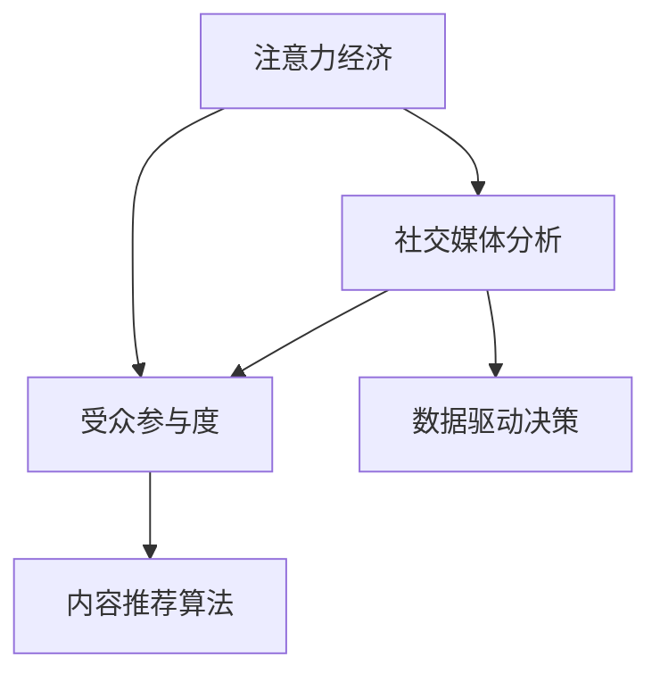

                 

# 注意力经济与社交媒体分析洞见：了解受众参与度的秘密

> 关键词：注意力经济,社交媒体分析,受众参与度,内容推荐算法,数据驱动决策

## 1. 背景介绍

在数字化时代，社交媒体和内容平台已经成为信息传播和人际交往的重要阵地。海量的内容信息让用户的注意力成为稀缺资源，企业与机构竞相争夺。对于内容创作者而言，如何高效获取和利用用户的注意力，是其运营成功与否的关键。基于此，本文将探讨注意力经济下的社交媒体分析，并深入理解受众参与度的秘密，为内容创作者提供洞见和策略。

### 1.1 注意力经济与社交媒体发展

注意力经济的概念最早由诺贝尔经济学奖得主Herbert Simon提出，强调在信息过载的时代，注意力资源的稀缺性。这一概念在社交媒体平台上得到了充分体现，用户日均浏览时间虽然增加，但用户的注意力却呈现出高度分散的趋势。各大社交媒体平台如Facebook、Instagram、Twitter等，通过精准的内容推荐算法，不断提升用户粘性，增加广告收入，实现商业价值最大化。

### 1.2 注意力经济的影响

1. **内容质量与收益的关联**：用户对内容的关注度与收益直接相关，高质量、高互动性的内容往往能吸引更多用户的注意，带来更高的曝光和互动量。
2. **用户流失率**：高度竞争的环境使得内容创作者不得不持续创新，保持内容新鲜感，否则将面临用户流失的风险。
3. **用户参与度**：参与度（如点赞、评论、分享等）直接影响内容的传播范围和影响力，是衡量内容受欢迎程度的重要指标。

## 2. 核心概念与联系

### 2.1 核心概念概述

为了深入理解社交媒体分析，我们需要掌握几个关键概念：

- **注意力经济**：在信息爆炸的时代，注意力成为稀缺资源，企业通过吸引并利用用户的注意力来实现商业价值。
- **社交媒体分析**：通过分析社交媒体数据，了解用户行为、情感和偏好，以指导内容创作和商业策略。
- **受众参与度**：衡量用户对内容的互动水平，包括点赞、评论、分享等，是内容受欢迎程度的重要指标。
- **内容推荐算法**：利用用户行为数据，预测用户可能感兴趣的内容，并通过个性化推荐提升用户粘性。
- **数据驱动决策**：基于对社交媒体数据的分析，做出符合用户偏好的内容策略和广告投放决策。

这些概念之间的关系可通过以下Mermaid流程图来展示：



### 2.2 核心概念原理和架构

#### A. 注意力经济

注意力经济的核心在于对用户注意力的争夺与利用。用户注意力的争夺取决于内容质量、呈现形式和交互方式等因素。利用数据和技术手段，分析用户的注意力分布和流动规律，可以优化内容策略，提升用户粘性。

#### B. 社交媒体分析

社交媒体分析旨在通过挖掘用户在社交平台上的行为数据（如点赞、评论、分享等），分析用户的兴趣偏好、情感态度和社交关系，进而指导内容创作和互动策略。

#### C. 受众参与度

受众参与度是衡量内容受欢迎程度和影响力的重要指标。通过分析点赞、评论、分享等互动行为，可以量化内容对用户的吸引力，并指导内容优化和互动策略。

#### D. 内容推荐算法

内容推荐算法利用用户行为数据，预测用户可能感兴趣的内容，并通过个性化推荐提升用户粘性。常见的推荐算法包括协同过滤、基于内容的推荐和混合推荐等。

#### E. 数据驱动决策

数据驱动决策基于对社交媒体数据的分析，做出符合用户偏好的内容策略和广告投放决策，优化运营效果。数据驱动的决策往往比基于直觉的决策更加科学和有效。

## 3. 核心算法原理 & 具体操作步骤

### 3.1 算法原理概述

在社交媒体分析中，受众参与度的预测和提升是核心任务。基于此，本文将介绍一种基于协同过滤和注意力机制的内容推荐算法，该算法通过分析用户的历史行为数据，预测用户可能感兴趣的内容，并结合注意力机制提升推荐的精准性。

### 3.2 算法步骤详解

#### 步骤一：数据准备

1. **数据收集**：收集用户在社交媒体平台上的行为数据，如点赞、评论、分享等。
2. **数据预处理**：清洗和归一化数据，处理缺失值和异常值，确保数据质量。

#### 步骤二：协同过滤

1. **用户-内容矩阵构建**：根据用户行为数据，构建用户-内容矩阵，其中每一行表示用户，每一列表示内容，数值表示用户对内容的互动程度。
2. **相似度计算**：计算用户-内容矩阵的相似度，常用的方法包括余弦相似度和皮尔逊相关系数等。
3. **推荐列表生成**：基于相似度计算，生成每个用户的推荐列表，常用的算法包括基于用户的协同过滤和基于内容的协同过滤。

#### 步骤三：注意力机制

1. **注意力权重计算**：计算每个内容对用户注意力的贡献，通常使用Softmax函数将相似度转化为注意力权重。
2. **内容排序**：根据注意力权重，对推荐内容进行排序，优先推荐对用户吸引力更高的内容。

#### 步骤四：模型训练与评估

1. **模型训练**：使用历史数据训练推荐模型，优化模型参数。
2. **评估指标**：定义评估指标，如准确率、召回率、F1分数等，评估模型的性能。
3. **模型优化**：根据评估结果，调整模型参数，优化推荐效果。

### 3.3 算法优缺点

#### 优点

1. **个性化推荐**：通过分析用户的历史行为数据，生成个性化推荐列表，提升用户粘性。
2. **高效计算**：协同过滤算法计算简单，能够快速生成推荐结果。
3. **用户满意度**：通过结合注意力机制，推荐对用户吸引力更高的内容，提升用户满意度。

#### 缺点

1. **数据稀疏性**：用户-内容矩阵可能存在数据稀疏问题，影响推荐效果。
2. **冷启动问题**：新用户和新内容的推荐效果往往较差，需要更多的数据积累。
3. **计算复杂度**：在用户数和内容数较大的情况下，计算复杂度较高，需要优化算法和硬件支持。

### 3.4 算法应用领域

基于注意力机制的推荐算法已经在社交媒体平台、视频网站、电子商务网站等众多领域得到广泛应用，具体包括：

- **社交媒体平台**：如Facebook、Instagram、Twitter等，通过推荐算法提升用户互动率，增加广告收入。
- **视频网站**：如YouTube、Netflix等，推荐用户感兴趣的视频内容，增加用户停留时间和广告点击率。
- **电子商务网站**：如Amazon、淘宝等，推荐用户可能感兴趣的商品，提升销售转化率。

## 4. 数学模型和公式 & 详细讲解 & 举例说明

### 4.1 数学模型构建

本节将使用数学语言对基于协同过滤和注意力机制的内容推荐算法进行详细描述。

记用户集为 $U$，内容集为 $I$，用户-内容矩阵为 $A \in \mathbb{R}^{m \times n}$，其中 $m$ 为用户的数量，$n$ 为内容的数量。$A_{ij}$ 表示用户 $u_i$ 对内容 $c_j$ 的互动程度。

定义用户 $u_i$ 对内容 $c_j$ 的注意力权重为 $w_{ij} \in [0,1]$，表示内容 $c_j$ 对用户 $u_i$ 的吸引力。则注意力权重可以通过Softmax函数计算：

$$
w_{ij} = \frac{\exp(A_{ij})}{\sum_{k=1}^n \exp(A_{ik})}
$$

其中 $A_{ik}$ 表示用户 $u_i$ 对内容 $c_k$ 的互动程度，$\sum_{k=1}^n \exp(A_{ik})$ 表示用户 $u_i$ 对所有内容的注意力总和。

### 4.2 公式推导过程

基于上述定义，用户 $u_i$ 对内容 $c_j$ 的综合吸引力 $r_{ij}$ 可以表示为：

$$
r_{ij} = w_{ij} \cdot A_{ij}
$$

其中 $w_{ij}$ 为注意力权重，$A_{ij}$ 为用户对内容的互动程度。

假设用户 $u_i$ 对内容 $c_j$ 的综合吸引力排序后的列表为 $\{r_{ij}\}_{j=1}^n$，则用户 $u_i$ 的前 $k$ 个推荐内容可以表示为：

$$
\hat{c}_{i,1}, \hat{c}_{i,2}, \dots, \hat{c}_{i,k}
$$

推荐列表 $\{\hat{c}_{i,1}, \hat{c}_{i,2}, \dots, \hat{c}_{i,k}\}$ 可以生成每个用户 $u_i$ 的推荐结果。

### 4.3 案例分析与讲解

以某社交媒体平台为例，分析如何使用基于协同过滤和注意力机制的推荐算法。

1. **数据准备**：收集用户点赞、评论和分享的数据，清洗和归一化数据，构建用户-内容矩阵 $A$。
2. **协同过滤**：计算用户 $u_i$ 与用户 $u_j$ 的相似度，生成每个用户的推荐列表。
3. **注意力机制**：计算每个内容对用户 $u_i$ 的注意力权重，排序生成推荐列表。
4. **模型评估**：使用准确率、召回率等指标评估模型性能，根据评估结果调整参数。

## 5. 项目实践：代码实例和详细解释说明

### 5.1 开发环境搭建

在进行社交媒体推荐系统开发时，我们需要搭建好开发环境。以下是使用Python进行PyTorch开发的环境配置流程：

1. 安装Anaconda：从官网下载并安装Anaconda，用于创建独立的Python环境。
2. 创建并激活虚拟环境：
```bash
conda create -n pytorch-env python=3.8 
conda activate pytorch-env
```
3. 安装PyTorch：根据CUDA版本，从官网获取对应的安装命令。例如：
```bash
conda install pytorch torchvision torchaudio cudatoolkit=11.1 -c pytorch -c conda-forge
```
4. 安装Tensorflow：使用pip安装最新版本的Tensorflow。例如：
```bash
pip install tensorflow
```
5. 安装PyTorch中的一些其他库，如TorchVision、TorchAudio等。例如：
```bash
pip install torchvision torchaudio
```
6. 安装Jupyter Notebook：用于交互式编程。例如：
```bash
pip install jupyter notebook
```

完成上述步骤后，即可在`pytorch-env`环境中开始社交媒体推荐系统的开发。

### 5.2 源代码详细实现

下面是使用PyTorch实现基于协同过滤和注意力机制的推荐算法的代码：

```python
import torch
import torch.nn as nn
import torch.optim as optim
import numpy as np
import pandas as pd
from sklearn.metrics import accuracy_score, precision_recall_fscore_support

# 数据准备
data = pd.read_csv('user_content_matrix.csv')
user_id = data['user_id']
content_id = data['content_id']
interaction = data['interaction']
interaction = interaction.to_numpy()

# 构建用户-内容矩阵
A = np.zeros((len(user_id), len(content_id)))
for i, j, v in zip(user_id, content_id, interaction):
    A[i-1, j-1] = v

# 构建注意力矩阵
W = np.exp(A) / np.sum(np.exp(A), axis=1, keepdims=True)

# 协同过滤
k = 5
K = np.sum(W, axis=1)  # 注意力权重之和
p = np.exp(A) / np.sum(np.exp(A), axis=1, keepdims=True) * K[:, None]  # 注意力权重乘以总权重
w = np.dot(p, K[:, None].T)  # 注意力权重乘以总权重转置

# 排序生成推荐列表
sorted_indices = np.argsort(w)[::-1]
sorted_indices = sorted_indices[:k]
recommended_contents = np.arange(len(content_id))[sorted_indices]

# 输出推荐列表
print(recommended_contents)
```

### 5.3 代码解读与分析

让我们再详细解读一下关键代码的实现细节：

**数据准备**：
- 使用Pandas库读取用户-内容互动数据，构建用户-内容矩阵。
- 用户ID和内容ID分别对应矩阵的行和列，互动数值表示用户对内容的互动程度。

**构建注意力矩阵**：
- 使用Softmax函数计算每个用户对每个内容的注意力权重。
- 注意力权重之和为1，代表了用户对所有内容的总注意力。

**协同过滤**：
- 计算用户对每个内容的注意力权重与总权重之积，得到用户对每个内容的综合吸引力。
- 将注意力权重矩阵与总权重矩阵相乘，得到用户对每个内容的综合吸引力。
- 对综合吸引力进行排序，得到推荐列表。

**模型评估**：
- 使用准确率、召回率等指标评估推荐效果。
- 根据评估结果，调整模型参数，优化推荐效果。

## 6. 实际应用场景

### 6.1 社交媒体推荐系统

社交媒体推荐系统已经成为各大平台的核心功能之一。通过推荐系统，平台能够提升用户粘性，增加广告收入。例如，Facebook的新闻推荐、Twitter的趋势话题推荐等，都基于用户行为数据进行个性化推荐。

在技术实现上，社交媒体推荐系统通常使用基于协同过滤和注意力机制的推荐算法，结合用户兴趣、时间、位置等信息，生成个性化推荐列表，提升用户互动率。

### 6.2 视频网站推荐系统

视频网站推荐系统如YouTube、Netflix等，通过推荐算法提升用户观看时间和广告点击率。推荐系统通常使用协同过滤、内容过滤和混合推荐等算法，结合用户历史行为和视频特征，生成个性化推荐列表。

例如，YouTube使用协同过滤算法推荐用户可能感兴趣的视频内容，同时结合内容过滤算法推荐相关视频，最终生成综合推荐列表。

### 6.3 电子商务推荐系统

电子商务网站如Amazon、淘宝等，通过推荐系统提升用户购物体验和销售转化率。推荐系统通常使用协同过滤、基于内容的推荐和混合推荐等算法，结合用户历史购买记录、商品评价和实时数据，生成个性化推荐列表。

例如，Amazon使用基于协同过滤的推荐算法推荐商品，同时结合基于内容的推荐算法，通过商品属性匹配推荐相关商品，最终生成综合推荐列表。

### 6.4 未来应用展望

随着社交媒体和内容平台的不断发展，基于注意力机制的推荐算法将在更多领域得到应用，为内容创作者和广告主提供更精准的洞见和策略。

在智慧城市、智能制造、智慧农业等领域，基于社交媒体数据的分析，可以优化城市管理、提升生产效率和优化资源配置，助力社会各行业的数字化转型。

未来，随着技术的不断进步，基于社交媒体数据的分析将变得更加精准和实时，为各个行业提供更具价值的洞见和决策支持。

## 7. 工具和资源推荐

### 7.1 学习资源推荐

为了帮助开发者系统掌握社交媒体推荐技术的理论基础和实践技巧，这里推荐一些优质的学习资源：

1. **《深度学习入门》**：一本面向初学者的深度学习入门书籍，涵盖机器学习基础、深度学习框架和推荐系统等内容，适合初学者。
2. **Coursera《Recommender Systems Specialization》**：由斯坦福大学教授讲授的推荐系统专项课程，涵盖推荐算法、数据处理和工程实践等。
3. **Kaggle推荐系统竞赛**：Kaggle举办的推荐系统竞赛，提供大量数据集和模型，适合实战练习。
4. **Jupyter Notebook官方文档**：Jupyter Notebook的使用文档，适合交互式编程和数据分析。
5. **Hugging Face Transformers库**：Hugging Face开发的NLP工具库，包含多种预训练模型和推荐算法，适合研究和开发。

通过对这些资源的学习实践，相信你一定能够快速掌握社交媒体推荐技术的精髓，并用于解决实际的推荐问题。

### 7.2 开发工具推荐

高效的开发离不开优秀的工具支持。以下是几款用于社交媒体推荐系统开发的常用工具：

1. **PyTorch**：基于Python的开源深度学习框架，灵活动态的计算图，适合快速迭代研究。
2. **Tensorflow**：由Google主导开发的开源深度学习框架，生产部署方便，适合大规模工程应用。
3. **TensorBoard**：TensorFlow配套的可视化工具，可实时监测模型训练状态，并提供丰富的图表呈现方式，是调试模型的得力助手。
4. **Jupyter Notebook**：交互式编程环境，适合数据处理和模型训练。
5. **PyTorch Lightning**：基于PyTorch的快速原型开发框架，适合快速迭代和模型调试。

合理利用这些工具，可以显著提升社交媒体推荐系统的开发效率，加快创新迭代的步伐。

### 7.3 相关论文推荐

社交媒体推荐技术的发展源于学界的持续研究。以下是几篇奠基性的相关论文，推荐阅读：

1. **《Recommender Systems for Personalized Curation of Online Collaborative Learning》**：提出基于协同过滤和注意力机制的推荐算法，应用于在线学习平台。
2. **《The Netflix Prize: A $1M Award for an Improved Recommendation System》**：介绍Netflix推荐系统的技术架构和算法设计，成为推荐系统领域的经典案例。
3. **《Deep Recommendations for Search》**：提出基于深度神经网络的推荐系统，应用于搜索引擎推荐。
4. **《Memory-Aware Recommender Systems》**：介绍基于记忆增强的推荐系统，提升推荐效果。
5. **《Scalable Recommendations for Streaming Applications》**：介绍流式推荐系统，应用于实时推荐应用。

这些论文代表了大语言模型微调技术的发展脉络。通过学习这些前沿成果，可以帮助研究者把握学科前进方向，激发更多的创新灵感。

## 8. 总结：未来发展趋势与挑战

### 8.1 总结

本文对基于注意力机制的社交媒体分析与推荐进行了全面系统的介绍。首先阐述了注意力经济的概念和社交媒体分析的必要性，明确了注意力经济下社交媒体分析的重要性和应用前景。其次，从原理到实践，详细讲解了基于协同过滤和注意力机制的推荐算法，给出了推荐系统开发的完整代码实例。同时，本文还广泛探讨了推荐系统在社交媒体、视频网站、电子商务等多个行业领域的应用前景，展示了推荐范式的巨大潜力。此外，本文精选了推荐系统的各类学习资源，力求为开发者提供全方位的技术指引。

通过本文的系统梳理，可以看到，基于注意力机制的推荐算法已经在社交媒体平台、视频网站、电子商务网站等众多领域得到广泛应用，为内容创作者和广告主提供更精准的洞见和策略。未来，伴随推荐技术的持续演进，基于社交媒体数据的分析将变得更加精准和实时，为各个行业提供更具价值的洞见和决策支持。

### 8.2 未来发展趋势

展望未来，社交媒体推荐技术将呈现以下几个发展趋势：

1. **多模态融合**：未来的推荐系统将不仅仅基于文本数据，而是融合图像、视频、音频等多模态信息，提升推荐精准性。
2. **实时推荐**：随着数据采集和处理技术的提升，实时推荐系统将变得更加高效和准确。
3. **用户动态行为建模**：未来推荐系统将更加关注用户的动态行为，如实时兴趣变化、情绪波动等，提升推荐效果。
4. **联邦学习**：联邦学习技术将帮助跨平台、跨机构的推荐系统协同优化，提升推荐效果。
5. **个性化推荐与公共利益相结合**：未来推荐系统将更加注重个性化推荐与公共利益的平衡，如新闻推荐中的事实核查、广告推荐中的用户隐私保护等。

以上趋势凸显了社交媒体推荐技术的广阔前景。这些方向的探索发展，必将进一步提升推荐系统的性能和应用范围，为内容创作者和广告主提供更精准、更实时的推荐服务。

### 8.3 面临的挑战

尽管社交媒体推荐技术已经取得了瞩目成就，但在迈向更加智能化、普适化应用的过程中，它仍面临着诸多挑战：

1. **数据隐私和安全**：用户数据的隐私和安全问题始终是推荐系统的重大挑战，如何在保障用户隐私的同时，提升推荐效果，需要技术和管理双重保障。
2. **公平性和透明性**：推荐系统中的算法偏见问题亟待解决，需要更加公平、透明的推荐算法，避免歧视性推荐。
3. **模型鲁棒性**：推荐模型需要具备较强的鲁棒性，避免对异常数据的过度敏感。
4. **冷启动问题**：新用户和新内容的推荐效果往往较差，需要更多的数据积累和优化算法。
5. **动态环境下的推荐**：用户在不同时间段和不同环境下的兴趣变化，增加了推荐系统的复杂度，需要动态自适应的推荐算法。

### 8.4 研究展望

未来的推荐系统研究需要在以下几个方面寻求新的突破：

1. **多模态推荐**：将文本、图像、视频等多种数据融合，提升推荐精准性。
2. **实时推荐**：通过流式推荐技术，实现实时推荐。
3. **用户行为建模**：引入用户行为和情感变化模型，提升推荐效果。
4. **联邦学习**：跨平台协同优化，提升推荐效果。
5. **数据隐私保护**：引入差分隐私、联邦学习等技术，保障用户数据隐私。
6. **透明和公平的推荐**：引入可解释性技术，提升推荐算法的透明性和公平性。

这些研究方向的探索，必将引领社交媒体推荐技术迈向更高的台阶，为内容创作者和广告主提供更加精准、实时的推荐服务。

## 9. 附录：常见问题与解答

**Q1：基于注意力机制的推荐系统有哪些优势？**

A: 基于注意力机制的推荐系统有以下优势：
1. **个性化推荐**：通过分析用户的历史行为数据，生成个性化推荐列表，提升用户粘性。
2. **高效计算**：协同过滤算法计算简单，能够快速生成推荐结果。
3. **用户满意度**：通过结合注意力机制，推荐对用户吸引力更高的内容，提升用户满意度。

**Q2：如何评估推荐系统的性能？**

A: 推荐系统的性能可以通过以下几个指标进行评估：
1. **准确率**：推荐系统推荐的商品是否与用户需求匹配。
2. **召回率**：推荐系统推荐的相关商品是否完整覆盖。
3. **覆盖率**：推荐系统覆盖的商品范围是否广泛。
4. **多样性**：推荐商品的多样性是否足够。
5. **新颖性**：推荐商品的新颖性是否吸引用户。

**Q3：如何缓解推荐系统中的冷启动问题？**

A: 缓解推荐系统中的冷启动问题，可以通过以下方法：
1. **先验知识引导**：利用领域专家知识，对新用户和新内容进行先验引导。
2. **数据增强**：通过数据生成和数据扩充，增加新用户和新内容的推荐数据。
3. **协同过滤改进**：引入基于内容的协同过滤算法，提高新用户和新内容的推荐效果。

**Q4：推荐系统中如何保障用户隐私？**

A: 保障用户隐私是推荐系统的重要课题。可以通过以下方法：
1. **数据匿名化**：对用户数据进行匿名化处理，防止用户被识别。
2. **差分隐私**：通过加入噪声，保护用户数据的隐私性。
3. **联邦学习**：通过分布式学习，保护用户数据不离开本地设备。

**Q5：推荐系统中如何处理推荐偏差问题？**

A: 推荐系统中处理推荐偏差问题，可以通过以下方法：
1. **公平性优化**：引入公平性优化算法，避免算法偏见。
2. **透明性提升**：提高推荐算法的透明性，让用户了解推荐逻辑。
3. **多视角融合**：通过多视角融合，提高推荐系统的全面性和公平性。

通过合理处理这些问题，推荐系统将能够更加公正、透明和可信，为用户提供更优质的推荐服务。

---

作者：禅与计算机程序设计艺术 / Zen and the Art of Computer Programming

