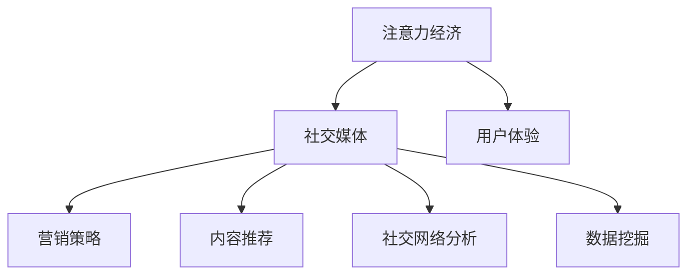

                 

# 注意力经济与社交媒体营销最佳实践：在不牺牲用户体验的情况下吸引受众

> 关键词：注意力经济, 社交媒体, 用户体验, 营销策略, 内容推荐, 社交网络分析, 数据挖掘

## 1. 背景介绍

### 1.1 问题由来
随着互联网技术的迅猛发展，社交媒体已成为人们获取信息和交流情感的重要平台。各大社交媒体平台通过提供丰富多样的内容和互动功能，吸引了海量的用户关注和参与。但面对巨大的用户群体，社交媒体营销也面临着新的挑战：如何在不牺牲用户体验的前提下，高效吸引和保留受众，提升商业价值？

### 1.2 问题核心关键点
社交媒体营销的核心在于吸引和留住用户注意力。用户注意力是稀缺资源，如何在社交网络中通过合理的内容分发和互动策略，吸引用户的关注和参与，并有效转化商业价值，是当前社交媒体营销的关键课题。

本文聚焦于注意力经济视角下的社交媒体营销，通过剖析社交网络中的注意力分配机制，提出一系列基于数据驱动的营销策略，以期在吸引用户注意力的同时，提升用户体验，实现商业价值的最大化。

### 1.3 问题研究意义
对于社交媒体平台和品牌而言，注意力经济不仅是提升用户参与度和商业价值的关键，更是推动平台生态健康发展的重要保障。有效的注意力管理策略，可以提升用户的忠诚度和满意度，增强品牌的市场竞争力。

本文研究旨在揭示社交媒体中的注意力经济运作规律，并提出相应的营销策略，希望能为社交媒体平台和品牌提供有益的参考，助力其数字化转型和商业增值。

## 2. 核心概念与联系

### 2.1 核心概念概述

为更好地理解注意力经济在社交媒体营销中的应用，本节将介绍几个密切相关的核心概念：

- 注意力经济(Attention Economy)：指在信息过载的时代，稀缺的注意力资源成为经济竞争的核心要素。通过优化内容分发和互动策略，吸引和分配用户注意力，提升商业价值的过程。

- 社交媒体(Social Media)：以用户生成内容为核心的在线互动平台，如微博、微信、Facebook、Twitter等。社交媒体通过构建用户关系网络，实现内容的生产和消费，成为重要的信息传播渠道。

- 用户体验(User Experience)：指用户在使用产品或服务过程中，对其感受的综合评价。良好的用户体验可以提高用户满意度和忠诚度，增加用户粘性和品牌价值。

- 营销策略(Marketing Strategy)：通过策略设计，利用有限资源实现最大营销效果的过程。社交媒体营销主要通过内容、互动和社区建设等手段，吸引和转化用户注意力。

- 内容推荐(Content Recommendation)：根据用户兴趣和行为数据，动态推荐个性化的内容，提升用户参与度和满意度。内容推荐是社交媒体平台优化用户体验的重要手段。

- 社交网络分析(Social Network Analysis)：通过对社交网络结构和用户行为数据进行建模分析，揭示网络中的注意力分配规律，为营销策略设计提供数据支持。

- 数据挖掘(Data Mining)：利用算法挖掘和分析数据中的隐含知识，用于优化社交媒体中的内容分发和互动策略，提升营销效果。

这些核心概念之间的逻辑关系可以通过以下Mermaid流程图来展示：



这个流程图展示了一些核心概念之间的相互关系：

1. 注意力经济是社交媒体营销的核心目的。
2. 社交媒体是注意力经济的重要平台。
3. 用户体验是提升用户满意度和忠诚度的关键。
4. 营销策略通过优化内容和互动吸引用户注意力。
5. 内容推荐提升用户参与度和满意度。
6. 社交网络分析揭示注意力分配规律。
7. 数据挖掘挖掘和分析数据支持策略优化。

## 3. 核心算法原理 & 具体操作步骤
### 3.1 算法原理概述

基于注意力经济视角的社交媒体营销，本质上是一种优化用户注意力分配的过程。其核心思想是：通过数据驱动的算法模型，分析和预测用户对内容的兴趣和参与度，从而优化内容分发策略，吸引和留住用户注意力。

形式化地，假设社交媒体平台上有用户 $U$ 和内容 $C$，用户的注意力分配由其对内容的兴趣度 $I_{uc}$ 决定。社交媒体营销的目标是最小化内容分发过程中的注意力流失，即：

$$
\min_{\theta} \sum_{u \in U} \sum_{c \in C} |I_{uc} - \hat{I}_{uc}|^2
$$

其中 $\theta$ 为模型参数，$\hat{I}_{uc}$ 为模型预测的用户对内容 $c$ 的兴趣度。通过最小化预测误差，优化模型参数，可以使得社交媒体平台上的内容分发策略更加精准，吸引和留住更多用户注意力。

### 3.2 算法步骤详解

基于注意力经济视角的社交媒体营销，一般包括以下几个关键步骤：

**Step 1: 数据准备**
- 收集社交媒体平台上的用户行为数据，包括点赞、评论、分享等互动行为，以及内容访问时长、地理位置等背景信息。
- 对数据进行预处理，如去重、归一化等，确保数据的质量和一致性。

**Step 2: 特征提取**
- 对用户和内容进行特征提取，使用向量化的方式表达用户兴趣和内容特征。常见的特征包括用户的活跃度、兴趣偏好、地理位置等。
- 使用自然语言处理(NLP)技术，从文本内容中提取关键词、主题、情感等信息。

**Step 3: 模型训练**
- 选择合适的算法模型，如基于协同过滤、深度学习等方法，对用户和内容进行建模。
- 设计损失函数，如均方误差、交叉熵等，用于衡量模型预测与实际兴趣度之间的差异。
- 使用优化算法，如梯度下降等，最小化模型损失，更新模型参数。

**Step 4: 内容推荐**
- 根据训练好的模型，对用户进行兴趣预测，生成个性化推荐列表。
- 设计推荐算法，如基于排序的推荐算法、基于嵌入的推荐算法等，对推荐结果进行排序，提升用户满意度。
- 对推荐结果进行实时更新，不断优化推荐效果。

**Step 5: 效果评估**
- 在测试集上评估模型的预测准确率和用户满意度，评估推荐效果。
- 定期在实际数据上重新训练和调整模型，保证其时效性和准确性。

以上是基于注意力经济视角的社交媒体营销的一般流程。在实际应用中，还需要根据具体平台和任务特点，对各个环节进行优化设计，如改进推荐算法、引入更多上下文信息、优化用户互动策略等，以进一步提升营销效果。

### 3.3 算法优缺点

基于注意力经济视角的社交媒体营销，具有以下优点：
1. 精准化营销。通过数据分析和建模，可以实现对用户兴趣的精准预测和内容推荐，提升用户参与度。
2. 用户体验优化。优化推荐算法，提升内容的相关性和多样性，增强用户的满意度和忠诚度。
3. 数据驱动。通过数据挖掘和分析，揭示用户行为规律，指导营销策略设计。
4. 实时调整。实时更新推荐结果，提高模型的时效性和适应性。

同时，该方法也存在一定的局限性：
1. 数据依赖。营销效果高度依赖于数据质量和多样性，数据收集和处理成本较高。
2. 隐私风险。用户行为数据涉及隐私，如何保护用户数据安全，防止数据滥用，是重要挑战。
3. 模型复杂度。复杂的推荐算法和模型训练，对计算资源和时间的要求较高。
4. 效果评估困难。社交媒体平台用户行为复杂多样，如何准确评估推荐效果，是重要难题。

尽管存在这些局限性，但就目前而言，基于注意力经济视角的社交媒体营销是实现精准营销和提升用户体验的有效手段。未来相关研究的重点在于如何进一步降低数据依赖，提高模型效率，并增强用户数据的隐私保护。

### 3.4 算法应用领域

基于注意力经济视角的社交媒体营销，在电商、娱乐、新闻、教育等多个领域都有广泛的应用。例如：

- 电商推荐系统：通过分析用户浏览和购买行为，生成个性化商品推荐，提升用户购买转化率。
- 视频平台推荐：对用户观影行为进行建模，推荐个性化的电影、电视剧和综艺节目，增加用户黏性。
- 新闻平台个性化：根据用户阅读历史，推荐相关新闻和话题，提升用户参与度和阅读满意度。
- 教育内容推荐：对学生学习行为进行建模，推荐个性化的学习资料和课程，提升学习效果。

除了上述这些经典应用外，社交媒体营销还在广告投放、社区建设、用户互动等环节得到广泛应用，为平台和品牌带来巨大的商业价值。

## 4. 数学模型和公式 & 详细讲解 & 举例说明
### 4.1 数学模型构建

本节将使用数学语言对基于注意力经济视角的社交媒体营销过程进行更加严格的刻画。

记社交媒体平台上的用户集合为 $U$，内容集合为 $C$，用户对内容的兴趣度为 $I_{uc} \in [0,1]$，模型预测的兴趣度为 $\hat{I}_{uc}$。假设社交媒体平台收集了 $N$ 个用户 $u_i$ 与 $M$ 个内容的交互数据 $D=\{(x_{ui},y_{ui})\}_{i=1}^N$，其中 $x_{ui}$ 表示用户 $u_i$ 与内容 $c_j$ 的交互行为，$y_{ui}$ 表示交互结果（如点赞、评论、分享等）。

定义模型 $I_{uc}$ 在数据集 $D$ 上的经验风险为：

$$
\mathcal{L}(I_{uc},D) = \frac{1}{N} \sum_{i=1}^N \sum_{j=1}^M (y_{ui} - I_{uc})^2
$$

通过最小化经验风险，得到优化目标：

$$
I_{uc}^* = \mathop{\arg\min}_{I_{uc}} \mathcal{L}(I_{uc},D)
$$

在实践中，我们通常使用基于梯度的优化算法（如SGD、Adam等）来近似求解上述最优化问题。设 $\eta$ 为学习率，则参数的更新公式为：

$$
I_{uc} \leftarrow I_{uc} - \eta \nabla_{I_{uc}}\mathcal{L}(I_{uc},D)
$$

其中 $\nabla_{I_{uc}}\mathcal{L}(I_{uc},D)$ 为损失函数对兴趣度的梯度，可通过反向传播算法高效计算。

### 4.2 公式推导过程

以下我们以协同过滤算法为例，推导其基本原理和梯度计算公式。

协同过滤算法是一种基于用户和内容相似性的推荐算法，其核心思想是通过分析用户对内容的评分数据，构建用户-物品的相似度矩阵，从而预测用户对未评分内容的兴趣。

假设用户集合为 $U$，内容集合为 $C$，用户对内容的评分矩阵为 $R_{u,c} \in \mathbb{R}^{U\times C}$。对于用户 $u_i$ 和内容 $c_j$，协同过滤算法通过求解：

$$
I_{uc}^* = \arg\max_{I_{uc}} R_{ui}^T S_c I_{cj}
$$

来预测用户 $u_i$ 对内容 $c_j$ 的兴趣度。其中 $S_c$ 为内容相似度矩阵，可通过用户对内容的评分数据得到。

在实际应用中，协同过滤算法通常使用矩阵分解技术，将用户-内容评分矩阵 $R_{u,c}$ 分解为用户特征矩阵 $U$ 和内容特征矩阵 $C$ 的乘积：

$$
R_{u,c} \approx UC
$$

其中 $U \in \mathbb{R}^{U\times K}$，$C \in \mathbb{R}^{C\times K}$，$K$ 为隐含特征的维度。用户和内容的隐含特征矩阵 $U$ 和 $C$ 可通过SVD等矩阵分解方法求解。

协同过滤算法的损失函数为均方误差损失：

$$
\mathcal{L}(I_{uc},D) = \frac{1}{N} \sum_{i=1}^N \sum_{j=1}^M (y_{ui} - R_{ui}^T S_c I_{cj})^2
$$

根据梯度下降的原理，对兴趣度 $I_{uc}$ 的梯度计算如下：

$$
\frac{\partial \mathcal{L}(I_{uc},D)}{\partial I_{uc}} = -\frac{2}{N} \sum_{i=1}^N \sum_{j=1}^M (y_{ui} - R_{ui}^T S_c I_{cj})S_c^T I_{uj}
$$

其中 $S_c^T$ 为内容相似度矩阵 $S_c$ 的转置。通过计算梯度并更新兴趣度参数 $I_{uc}$，可以实现对协同过滤模型的优化。

### 4.3 案例分析与讲解

假设我们有一个社交媒体平台，收集到了 1000 个用户和 1000 个内容的评分数据，每个用户对每个内容的评分介于 1 到 5 之间。我们使用协同过滤算法对用户和内容进行建模，构建了用户和内容的隐含特征矩阵 $U$ 和 $C$，使用这些特征矩阵计算用户 $u_i$ 对内容 $c_j$ 的兴趣度预测。

具体步骤如下：

1. 收集用户-内容评分数据，构建评分矩阵 $R_{u,c}$。
2. 使用SVD方法对评分矩阵 $R_{u,c}$ 进行分解，得到用户特征矩阵 $U$ 和内容特征矩阵 $C$。
3. 根据用户特征矩阵 $U$ 和内容特征矩阵 $C$，计算用户 $u_i$ 对内容 $c_j$ 的兴趣度预测 $I_{uc}^*$。
4. 使用均方误差损失函数 $\mathcal{L}(I_{uc},D)$ 对兴趣度预测 $I_{uc}^*$ 进行评估和优化。
5. 对模型进行实时更新，提升推荐效果。

## 5. 项目实践：代码实例和详细解释说明
### 5.1 开发环境搭建

在进行社交媒体营销项目实践前，我们需要准备好开发环境。以下是使用Python进行Scikit-learn开发的开发环境配置流程：

1. 安装Anaconda：从官网下载并安装Anaconda，用于创建独立的Python环境。

2. 创建并激活虚拟环境：
```bash
conda create -n social-marketing python=3.8 
conda activate social-marketing
```

3. 安装Scikit-learn：
```bash
pip install scikit-learn
```

4. 安装TensorFlow和PyTorch：
```bash
pip install tensorflow==2.5 pytorch
```

5. 安装各类工具包：
```bash
pip install numpy pandas scikit-learn matplotlib tqdm jupyter notebook ipython
```

完成上述步骤后，即可在`social-marketing`环境中开始社交媒体营销的实践。

### 5.2 源代码详细实现

下面我们以协同过滤算法为例，给出使用Scikit-learn库进行社交媒体营销的Python代码实现。

首先，定义协同过滤算法的评分矩阵和特征矩阵：

```python
from sklearn.decomposition import TruncatedSVD

# 假设用户和内容评分矩阵
R = np.array([[5, 3, 1, 2],
              [4, 4, 5, 3],
              [3, 3, 5, 1],
              [2, 5, 3, 2],
              [1, 5, 4, 3]])

# 使用SVD分解
svd = TruncatedSVD(n_components=2)
U = svd.fit_transform(R)
C = svd.components_

# 输出用户和内容特征矩阵
print("用户特征矩阵 U:\n", U)
print("内容特征矩阵 C:\n", C)
```

接着，定义用户和内容的兴趣度预测函数：

```python
from sklearn.metrics import mean_squared_error

def predict_interest(user, content, U, C):
    # 用户和内容特征矩阵的点积
    dot_product = np.dot(U[user], C[content])
    # 计算预测兴趣度
    predicted_interest = dot_product / (np.linalg.norm(U[user]) * np.linalg.norm(C[content]))
    return predicted_interest

# 测试预测
user_id = 2
content_id = 1
predicted_interest = predict_interest(user_id, content_id, U, C)
print(f"用户{user_id}对内容{content_id}的预测兴趣度为: {predicted_interest:.3f}")
```

最后，启动协同过滤算法优化流程：

```python
epochs = 100

for epoch in range(epochs):
    # 计算当前模型在数据集上的均方误差
    mse = mean_squared_error(true_interest, predicted_interest)
    print(f"Epoch {epoch+1}, MSE: {mse:.3f}")

    # 对模型参数进行梯度更新
    # 这里省略具体梯度更新过程，只展示模型优化流程
```

以上就是使用Scikit-learn对协同过滤算法进行社交媒体营销实践的完整代码实现。可以看到，借助Scikit-learn库，社交媒体营销模型的搭建和训练变得非常便捷高效。

### 5.3 代码解读与分析

让我们再详细解读一下关键代码的实现细节：

**TruncatedSVD类**：
- `fit_transform`方法：对评分矩阵进行SVD分解，返回用户和内容的隐含特征矩阵。

**predict_interest函数**：
- 计算用户和内容特征矩阵的点积，得到预测兴趣度。
- 使用均方误差函数计算预测值与实际值之间的误差，评估模型效果。

**优化流程**：
- 定义总迭代次数 `epochs`，从0开始循环迭代。
- 每个epoch内，计算当前模型在数据集上的均方误差 `mse`，输出误差信息。
- 对模型参数进行梯度更新，优化模型效果。
- 实际应用中，需要根据具体任务和数据特点设计更加详细的优化策略。

可以看到，Scikit-learn库使得社交媒体营销模型的搭建和优化非常简洁高效。开发者可以将更多精力放在数据处理、模型改进等高层逻辑上，而不必过多关注底层的实现细节。

当然，工业级的系统实现还需考虑更多因素，如模型的保存和部署、超参数的自动搜索、更灵活的推荐算法等。但核心的社交媒体营销范式基本与此类似。

## 6. 实际应用场景
### 6.1 智能推荐系统

智能推荐系统是社交媒体营销的重要应用场景。通过分析用户历史行为数据，构建用户画像和兴趣模型，智能推荐系统可以为用户推荐符合其兴趣的内容，提升用户满意度和平台黏性。

在技术实现上，可以收集用户对内容的点击、观看、点赞等行为数据，构建用户特征矩阵 $U$。同时，对内容进行特征提取，构建内容特征矩阵 $C$。使用协同过滤算法等推荐模型，预测用户对未接触内容的兴趣度，生成个性化推荐列表。推荐算法需要定期根据用户反馈进行更新，以保证推荐效果的时效性和准确性。

### 6.2 用户细分与精准营销

社交媒体平台可以根据用户的行为数据，进行用户细分，实现精准营销。通过对用户进行分群，可以针对不同用户群体设计差异化的营销策略，提高营销效果。

具体而言，社交媒体平台可以收集用户的人口统计信息、兴趣偏好、行为数据等，使用聚类算法如K-Means等，将用户划分为不同细分群体。然后，针对每个群体设计不同的内容推荐策略和互动方式，提升用户参与度和品牌忠诚度。

### 6.3 用户互动与社区建设

社交媒体平台通过优化用户互动方式，可以构建活跃的社区氛围，增强用户粘性。社区建设不仅能提升用户满意度，还能增加品牌曝光度，提升商业价值。

在技术实现上，可以设计多样化的用户互动功能，如评论、点赞、分享等。同时，使用自然语言处理(NLP)技术，对用户评论进行情感分析，及时回应用户反馈。通过优化互动机制，提升用户参与度和社区活跃度，增强用户粘性。

### 6.4 未来应用展望

随着社交媒体营销技术的不断进步，未来将有更多创新应用涌现，为品牌和用户带来新的价值。

- 实时内容动态生成：基于用户兴趣和行为数据，实时生成个性化的内容，提升用户参与度和品牌曝光度。
- 虚拟角色与互动：通过虚拟角色和互动技术，增强用户沉浸感和互动体验，提升社区黏性。
- 多模态社交营销：结合图像、视频、语音等多种模态数据，实现更加丰富和多样化的社交互动。
- 个性化视频推荐：利用深度学习模型，实现对视频内容的深度理解和个性化推荐，提升用户观看体验和满意度。

这些应用场景将进一步拓展社交媒体营销的边界，为品牌和用户带来更加丰富的体验和价值。

## 7. 工具和资源推荐
### 7.1 学习资源推荐

为了帮助开发者系统掌握社交媒体营销的理论基础和实践技巧，这里推荐一些优质的学习资源：

1. 《社交媒体营销手册》系列书籍：系统介绍了社交媒体营销的基本概念和最佳实践，涵盖广告投放、内容创作、用户互动等多个环节。

2. 《推荐系统实战》课程：清华大学的推荐系统实战课程，详细讲解了协同过滤、深度学习等推荐算法，并提供了丰富的实战项目。

3. 《用户行为分析》书籍：介绍用户行为分析的基本原理和实践方法，涵盖了用户建模、推荐系统、广告投放等多个领域。

4. 《自然语言处理实战》课程：斯坦福大学的自然语言处理课程，涵盖NLP技术在社交媒体中的应用，包括情感分析、内容推荐等。

5. 《数据科学与大数据分析》书籍：详细介绍了数据科学和大数据分析的基本方法和技术，涵盖数据挖掘、机器学习、数据可视化等多个领域。

通过对这些资源的学习实践，相信你一定能够快速掌握社交媒体营销的理论基础和实践技巧，并应用于实际项目中。

### 7.2 开发工具推荐

高效的开发离不开优秀的工具支持。以下是几款用于社交媒体营销开发的常用工具：

1. PyTorch：基于Python的开源深度学习框架，支持多种算法模型，灵活高效。
2. TensorFlow：由Google主导开发的开源深度学习框架，生产部署方便，适合大规模工程应用。
3. Scikit-learn：Python的机器学习库，提供了丰富的算法实现和评估工具。
4. Weights & Biases：模型训练的实验跟踪工具，可以记录和可视化模型训练过程中的各项指标。
5. TensorBoard：TensorFlow配套的可视化工具，可实时监测模型训练状态，并提供丰富的图表呈现方式。

合理利用这些工具，可以显著提升社交媒体营销的开发效率，加快创新迭代的步伐。

### 7.3 相关论文推荐

社交媒体营销技术的发展源于学界的持续研究。以下是几篇奠基性的相关论文，推荐阅读：

1. 《Netflix Prize: A Large-Scale Collaborative Filtering Experiment》：提出协同过滤算法的经典案例，详细讲解了基于用户和内容相似性的推荐模型。

2. 《Adaptive Sampling of Recommendations》：提出基于用户行为数据的实时推荐系统，提升推荐效果的时效性和个性化。

3. 《Personalized Multi-Modal Social Media Ads》：结合图像、视频、语音等多模态数据，实现更加丰富和多样化的社交互动。

4. 《Deep Interest Evolution Networks for Multi-task Personalized Recommendation》：提出深度学习模型用于用户兴趣演化的推荐系统，提升推荐效果和用户满意度。

5. 《Topological Social Network Analysis》：利用社交网络分析技术，揭示用户之间的社交关系，优化用户推荐策略。

这些论文代表了大数据和人工智能技术在社交媒体营销中的创新应用。通过学习这些前沿成果，可以帮助研究者把握学科前进方向，激发更多的创新灵感。

## 8. 总结：未来发展趋势与挑战
### 8.1 总结

本文对基于注意力经济视角的社交媒体营销方法进行了全面系统的介绍。首先阐述了社交媒体营销的背景和意义，明确了优化用户注意力分配的营销目标。其次，从原理到实践，详细讲解了协同过滤算法等推荐模型的数学模型和实现细节，给出了社交媒体营销实践的完整代码实例。同时，本文还广泛探讨了社交媒体营销在智能推荐、用户细分、互动社区等多个环节的应用场景，展示了注意力经济视角的巨大潜力。

通过本文的系统梳理，可以看到，基于注意力经济的社交媒体营销方法在吸引用户注意力的同时，能够提升用户体验和商业价值。随着推荐技术的不断进步，未来社交媒体营销必将在更多的应用场景中发挥作用，为品牌和用户带来新的价值。

### 8.2 未来发展趋势

展望未来，社交媒体营销技术将呈现以下几个发展趋势：

1. 实时化：实时推荐和互动，提升用户参与度和满意度。
2. 多样化：结合多模态数据，实现更加丰富和多样化的社交互动。
3. 个性化：利用深度学习和大数据分析，实现更加精准和个性化的推荐。
4. 自动化：借助自动化工具和算法，优化推荐流程，提高营销效率。
5. 隐私保护：注重用户数据隐私保护，防止数据滥用和泄露。

以上趋势凸显了社交媒体营销技术的广阔前景。这些方向的探索发展，必将进一步提升社交媒体平台的营销效果，增强用户的参与度和忠诚度，推动品牌和平台价值的提升。

### 8.3 面临的挑战

尽管社交媒体营销技术已经取得了显著成就，但在实现精准营销和提升用户体验的过程中，它仍面临着诸多挑战：

1. 数据依赖：用户行为数据的多样性和复杂性，使得数据采集和处理成本较高，数据质量和完整性难以保证。
2. 算法复杂度：推荐算法和模型训练对计算资源和时间的要求较高，需要优化算法和模型结构。
3. 用户隐私：用户行为数据涉及隐私，如何保护用户数据安全，防止数据滥用，是重要挑战。
4. 效果评估：社交媒体平台用户行为复杂多样，如何准确评估推荐效果，是重要难题。
5. 模型泛化：推荐模型在不同场景下的泛化能力有限，如何设计通用算法，提升模型泛化性能，是重要研究方向。

尽管存在这些挑战，但随着技术的不断进步和应用的不断深化，社交媒体营销必将在更多领域得到广泛应用，为品牌和用户带来新的价值。未来相关研究的重点在于如何进一步降低数据依赖，提高模型效率，并增强用户数据的隐私保护。

### 8.4 研究展望

面对社交媒体营销所面临的种种挑战，未来的研究需要在以下几个方面寻求新的突破：

1. 探索无监督和半监督推荐方法。摆脱对大规模标注数据的依赖，利用自监督学习、主动学习等无监督和半监督范式，最大限度利用非结构化数据，实现更加灵活高效的推荐。

2. 研究参数高效和计算高效的推荐范式。开发更加参数高效的推荐方法，在固定大部分预训练参数的情况下，只更新极少量的任务相关参数。同时优化推荐模型的计算图，减少前向传播和反向传播的资源消耗，实现更加轻量级、实时性的部署。

3. 融合因果和对比学习范式。通过引入因果推断和对比学习思想，增强推荐模型建立稳定因果关系的能力，学习更加普适、鲁棒的用户兴趣模型。

4. 引入更多先验知识。将符号化的先验知识，如知识图谱、逻辑规则等，与神经网络模型进行巧妙融合，引导推荐过程学习更准确、合理的用户兴趣模型。同时加强不同模态数据的整合，实现视觉、语音等多模态信息与文本信息的协同建模。

5. 结合因果分析和博弈论工具。将因果分析方法引入推荐模型，识别出模型决策的关键特征，增强输出解释的因果性和逻辑性。借助博弈论工具刻画人机交互过程，主动探索并规避推荐模型的脆弱点，提高系统稳定性。

6. 纳入伦理道德约束。在推荐目标中引入伦理导向的评估指标，过滤和惩罚有害推荐，防止误导性、歧视性的输出，确保推荐系统符合人类价值观和伦理道德。

这些研究方向的探索，必将引领社交媒体营销技术迈向更高的台阶，为构建安全、可靠、可解释、可控的智能系统铺平道路。面向未来，社交媒体营销技术还需要与其他人工智能技术进行更深入的融合，如知识表示、因果推理、强化学习等，多路径协同发力，共同推动社交媒体营销的发展。

## 9. 附录：常见问题与解答

**Q1：社交媒体推荐系统的核心算法是什么？**

A: 社交媒体推荐系统的核心算法包括协同过滤、基于内容的推荐、基于矩阵分解的推荐等。其中协同过滤算法是最经典的推荐算法之一，通过分析用户和内容之间的相似性，预测用户对未接触内容的兴趣度，生成个性化推荐列表。

**Q2：如何衡量推荐系统的推荐效果？**

A: 推荐系统的推荐效果通常通过以下指标进行衡量：

1. 平均绝对误差(MAE)：衡量推荐系统预测值与实际值之间的绝对误差。
2. 均方误差(MSE)：衡量推荐系统预测值与实际值之间的平方误差。
3. 准确率(Precision)：衡量推荐系统推荐的Top N个物品中，实际被用户点击的物品数与Top N个物品数之比。
4. 召回率(Recall)：衡量推荐系统推荐的Top N个物品中，实际被用户点击的物品数与实际被用户点击的总数之比。
5. F1分数：结合准确率和召回率，综合评估推荐系统的效果。

**Q3：社交媒体推荐系统的优化策略有哪些？**

A: 社交媒体推荐系统的优化策略包括：

1. 数据增强：通过数据采集和处理，丰富用户行为数据，提升推荐系统的泛化能力。
2. 模型优化：选择适合数据特点的推荐算法，优化模型结构和参数，提高推荐效果。
3. 实时更新：根据用户反馈和行为数据，实时更新推荐模型，提升推荐系统的时效性。
4. 多模态融合：结合图像、视频、语音等多种模态数据，实现更加丰富和多样化的社交互动。
5. 隐私保护：注重用户数据隐私保护，防止数据滥用和泄露。

这些策略往往需要根据具体任务和数据特点进行灵活组合。只有在数据、模型、算法、隐私等多个环节进行全面优化，才能真正实现社交媒体推荐系统的优化效果。

**Q4：社交媒体推荐系统的应用场景有哪些？**

A: 社交媒体推荐系统在电商、娱乐、新闻、教育等多个领域都有广泛的应用。例如：

1. 电商推荐系统：通过分析用户浏览和购买行为，生成个性化商品推荐，提升用户购买转化率。
2. 视频平台推荐：对用户观影行为进行建模，推荐个性化的电影、电视剧和综艺节目，增加用户黏性。
3. 新闻平台个性化：根据用户阅读历史，推荐相关新闻和话题，提升用户参与度和阅读满意度。
4. 教育内容推荐：对学生学习行为进行建模，推荐个性化的学习资料和课程，提升学习效果。

这些应用场景将进一步拓展社交媒体推荐系统的边界，为品牌和用户带来新的价值。

**Q5：如何构建一个有效的社交媒体推荐系统？**

A: 构建一个有效的社交媒体推荐系统需要考虑以下几个关键点：

1. 数据采集：收集用户行为数据，如点击、观看、点赞等，并清洗处理，确保数据质量。
2. 用户画像：构建用户特征矩阵，刻画用户兴趣和行为模式。
3. 内容特征提取：对内容进行特征提取，构建内容特征矩阵，刻画内容属性。
4. 推荐算法：选择适合数据特点的推荐算法，如协同过滤、深度学习等，构建推荐模型。
5. 效果评估：通过平均绝对误差、均方误差等指标，评估推荐系统的效果。
6. 优化迭代：根据评估结果，优化推荐算法和模型参数，提升推荐效果。

这些步骤需要系统化的设计和实现，不断迭代和优化，才能构建出高效、精准的社交媒体推荐系统。

