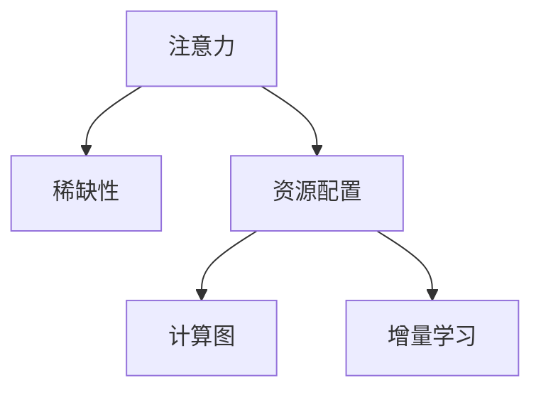

                 

## 1. 背景介绍

在人工智能(AI)时代，注意力作为稀缺资源，正逐渐成为各领域的核心竞争力。无论是搜索推荐、内容分发，还是深度学习模型训练，“注意力”机制的巧妙运用，都极大地推动了技术进步和业务发展。本文将系统探讨“注意力”的经济学原理，深入分析其在AI技术中的独特作用，并展望其未来的发展方向。

## 2. 核心概念与联系

### 2.1 核心概念概述

为更好地理解“注意力”的经济学原理，本节将介绍几个密切相关的核心概念：

- 注意力(Attention)：指模型对输入数据的特定部分进行关注，选择重要的特征进行学习和推理。在深度学习中，注意力机制常用于提取局部信息，增强长距离依赖，优化模型计算。

- 稀缺性(Scarcity)：指资源的供应量相对需求量不足，进而影响决策和行为。在AI时代，计算资源、数据资源等都存在稀缺性问题。

- 资源配置(Resource Allocation)：指在资源有限的情况下，合理分配资源，提高资源利用效率。注意力机制正是通过优化资源配置，实现模型的高效训练和推理。

- 计算图(Computational Graph)：指深度学习模型中的计算流程和数据流向，用于指导模型的计算过程。注意力机制通过在计算图中引入额外的节点，实现了信息的选择和聚焦。

- 增量学习(Incremental Learning)：指模型在部分数据上不断更新，避免从头训练，加快学习速度。注意力机制可以引导模型在原有知识的基础上，快速适应新数据。

这些核心概念之间的逻辑关系可以通过以下Mermaid流程图来展示：



这个流程图展示了一系列关键概念之间的联系：注意力通过优化资源配置，在计算图中实现信息选择和聚焦，同时支持增量学习，从而提升深度学习模型的性能。

## 3. 核心算法原理 & 具体操作步骤
### 3.1 算法原理概述

“注意力”经济学原理，本质上是一种基于“稀缺资源”的优化策略，通过“资源配置”机制，使得模型能够在有限的计算和存储资源下，选择和利用最有价值的信息。

具体而言，在深度学习模型中，注意力机制可以通过将“查询向量”与“键向量”进行矩阵乘法，计算“注意力得分”，从而得到“值向量”的加权和。这个过程中，模型通过自适应调整权重，优化了资源的分配和使用，实现了信息的选择和聚焦。

### 3.2 算法步骤详解

以下将详细讲解“注意力”机制的数学原理和操作步骤。

**Step 1: 查询向量生成**
- 假设输入为向量 $x$，与查询向量 $q$ 进行矩阵乘法，得到查询结果 $q'$
$$
q' = Qx
$$
其中 $Q$ 为查询矩阵，通常为可学习的参数。

**Step 2: 键向量生成**
- 同样，假设输入为向量 $k$，与键向量 $k'$ 进行矩阵乘法，得到键结果 $k'$
$$
k' = Kk
$$
其中 $K$ 为键矩阵，同样为可学习的参数。

**Step 3: 注意力得分计算**
- 将查询结果 $q'$ 与键结果 $k'$ 进行矩阵乘法，得到注意力得分矩阵 $S$
$$
S = q'k'
$$
其中 $S$ 为 $n \times m$ 的矩阵，$n$ 为查询向量的维度，$m$ 为键向量的维度。

**Step 4: 注意力权重计算**
- 对注意力得分 $S$ 进行Softmax操作，得到注意力权重 $a$
$$
a = \text{Softmax}(S)
$$
其中 $a$ 为 $n \times m$ 的矩阵。

**Step 5: 值向量加权求和**
- 将注意力权重 $a$ 与值向量 $v$ 进行元素乘法，得到加权和 $v^*$ 
$$
v^* = \sum_{i=1}^{m} a_{i,:} v_{i,:}
$$
其中 $v^*$ 为 $n \times 1$ 的向量。

**Step 6: 输出结果**
- 将加权和 $v^*$ 作为模型的输出结果。

### 3.3 算法优缺点

注意力机制在深度学习中的应用，具有以下优点：
1. 提升模型表达能力：通过引入额外的“注意力”节点，增强了模型对输入信息的理解能力和表达能力。
2. 优化资源配置：通过自适应调整注意力权重，模型能够在有限资源下，优先关注最重要的信息。
3. 实现长距离依赖：注意力机制可以打破局部性假设，增强模型对长距离信息的利用。
4. 提高计算效率：注意力机制可以优化计算图，减少不必要的计算和存储开销。

同时，注意力机制也存在一定的局限性：
1. 计算复杂度高：计算注意力得分时需要进行矩阵乘法和Softmax操作，计算量较大。
2. 模型结构复杂：注意力机制的引入增加了模型结构的复杂度，可能导致过拟合风险增加。
3. 参数可解释性差：注意力权重的具体含义难以解释，难以对模型的决策过程进行调试和优化。

尽管存在这些局限性，但就目前而言，注意力机制在大规模深度学习模型中得到了广泛应用，成为推动模型性能提升的重要因素。

### 3.4 算法应用领域

注意力机制已经被广泛应用于各种深度学习模型中，特别是在以下几个领域：

- 计算机视觉：在图像分类、目标检测、图像生成等任务中，注意力机制能够提升模型的特征选择能力和表达能力。
- 自然语言处理：在机器翻译、文本摘要、问答系统等任务中，注意力机制能够增强模型的语义理解能力和上下文关联能力。
- 语音识别：在语音识别任务中，注意力机制能够优化模型的特征融合过程，提高识别精度。
- 推荐系统：在推荐系统中，注意力机制能够优化用户与物品之间的关系建模，提高推荐效果。
- 搜索引擎：在搜索引擎中，注意力机制能够优化查询结果的相关性排序，提升搜索结果质量。

这些应用领域展示了注意力机制的强大实力，推动了深度学习模型在多个领域的技术突破和应用落地。

## 4. 数学模型和公式 & 详细讲解 & 举例说明
### 4.1 数学模型构建

本节将使用数学语言对“注意力”机制的原理进行更加严格的刻画。

假设输入为向量 $x$，查询向量为 $q$，键向量为 $k$，值向量为 $v$。在注意力机制中，模型的输出结果 $y$ 可以通过以下公式计算：

$$
y = \text{Attention}(x, q, k, v) = \text{Softmax}(QxK^T)Kv
$$

其中 $Q$ 为查询矩阵，$K$ 为键矩阵，$V$ 为值矩阵，均为可学习的参数。该公式计算了注意力得分矩阵 $S = QxK^T$，并对每个位置的得分进行Softmax归一化，得到注意力权重 $a = \text{Softmax}(S)$。最后，通过加权求和得到输出结果 $y = aV$。

### 4.2 公式推导过程

假设 $x$ 为输入向量，$q$ 为查询向量，$k$ 为键向量，$v$ 为值向量。注意力机制的计算过程可以表示为：

1. 查询向量生成：$Qx$
2. 键向量生成：$Kk$
3. 注意力得分计算：$QxK^T$
4. 注意力权重计算：$\text{Softmax}(QxK^T)$
5. 值向量加权求和：$\sum_{i=1}^{m} \text{Softmax}(QxK^T)_{i,:} v_{i,:}$

下面以一个简单的例子，来详细说明注意力机制的计算过程。

**Example**: 假设输入 $x = [1, 2, 3]$，查询向量 $q = [1, 2]$，键向量 $k = [1, 2, 3]$，值向量 $v = [1, 2, 3]$。

**Step 1: 查询向量生成**
$$
Qx = Q \begin{bmatrix} 1 \\ 2 \end{bmatrix} = \begin{bmatrix} 1 \\ 2 \end{bmatrix}
$$

**Step 2: 键向量生成**
$$
Kk = K \begin{bmatrix} 1 \\ 2 \\ 3 \end{bmatrix} = \begin{bmatrix} 1 & 1 \\ 2 & 2 \\ 3 & 3 \end{bmatrix}
$$

**Step 3: 注意力得分计算**
$$
QxK^T = \begin{bmatrix} 1 & 2 \end{bmatrix} \begin{bmatrix} 1 & 1 \\ 2 & 2 \\ 3 & 3 \end{bmatrix} = \begin{bmatrix} 1 & 3 \\ 2 & 6 \end{bmatrix}
$$

**Step 4: 注意力权重计算**
$$
a = \text{Softmax}(QxK^T) = \text{Softmax} \begin{bmatrix} 1 & 3 \\ 2 & 6 \end{bmatrix} = \begin{bmatrix} \frac{1}{13} & \frac{3}{13} \\ \frac{2}{13} & \frac{6}{13} \end{bmatrix}
$$

**Step 5: 值向量加权求和**
$$
v^* = \sum_{i=1}^{3} a_{i,:} v_{i,:} = \frac{1}{13} \begin{bmatrix} 1 \\ 2 \\ 3 \end{bmatrix} + \frac{3}{13} \begin{bmatrix} 1 \\ 2 \\ 3 \end{bmatrix} + \frac{2}{13} \begin{bmatrix} 1 \\ 2 \\ 3 \end{bmatrix} + \frac{6}{13} \begin{bmatrix} 1 \\ 2 \\ 3 \end{bmatrix} = \begin{bmatrix} 1 \\ 2 \\ 3 \end{bmatrix}
$$

**Step 6: 输出结果**
$$
y = v^* = \begin{bmatrix} 1 \\ 2 \\ 3 \end{bmatrix}
$$

通过以上步骤，我们可以看到，注意力机制通过自适应调整注意力权重，使得模型能够更有效地利用输入信息，提升输出精度。

## 5. 项目实践：代码实例和详细解释说明
### 5.1 开发环境搭建

在进行注意力机制的实践前，我们需要准备好开发环境。以下是使用Python进行PyTorch开发的环境配置流程：

1. 安装Anaconda：从官网下载并安装Anaconda，用于创建独立的Python环境。

2. 创建并激活虚拟环境：
```bash
conda create -n attention-env python=3.8 
conda activate attention-env
```

3. 安装PyTorch：根据CUDA版本，从官网获取对应的安装命令。例如：
```bash
conda install pytorch torchvision torchaudio cudatoolkit=11.1 -c pytorch -c conda-forge
```

4. 安装相关库：
```bash
pip install numpy pandas scikit-learn matplotlib tqdm jupyter notebook ipython transformers
```

完成上述步骤后，即可在`attention-env`环境中开始注意力机制的实践。

### 5.2 源代码详细实现

下面我们以一个简单的注意力机制为例，给出使用PyTorch实现注意力机制的代码实现。

首先，定义注意力机制函数：

```python
import torch
import torch.nn as nn

class Attention(nn.Module):
    def __init__(self, dim):
        super(Attention, self).__init__()
        self.query = nn.Linear(dim, dim)
        self.key = nn.Linear(dim, dim)
        self.value = nn.Linear(dim, dim)
        self.out = nn.Linear(dim, dim)
        self.softmax = nn.Softmax(dim=-1)
        
    def forward(self, query, key, value):
        query = self.query(query)
        key = self.key(key)
        value = self.value(value)
        
        attn_weights = self.softmax(torch.matmul(query, key.transpose(1, 2)))
        attn_weights = attn_weights / torch.sqrt(query.size(-1))
        out = torch.matmul(attn_weights, value)
        out = self.out(out)
        return out
```

然后，使用这个注意力机制函数构建模型：

```python
class Model(nn.Module):
    def __init__(self, input_dim, output_dim):
        super(Model, self).__init__()
        self.encoder = nn.Linear(input_dim, 64)
        self.attention = Attention(64)
        self.decoder = nn.Linear(64, output_dim)
        
    def forward(self, x, y, z):
        x = self.encoder(x)
        attention = self.attention(x, y, z)
        out = self.decoder(attention)
        return out
```

最后，构建一个简单的训练循环：

```python
model = Model(10, 5)
optimizer = torch.optim.Adam(model.parameters(), lr=0.001)
criterion = nn.MSELoss()

for epoch in range(1000):
    x = torch.randn(10, 1, requires_grad=True)
    y = torch.randn(1, 1)
    z = torch.randn(1, 1)
    y_hat = model(x, y, z)
    loss = criterion(y_hat, y)
    optimizer.zero_grad()
    loss.backward()
    optimizer.step()
```

以上就是使用PyTorch实现注意力机制的完整代码实现。可以看到，通过简单的线性变换和Softmax操作，即可实现注意力机制的计算。

### 5.3 代码解读与分析

让我们再详细解读一下关键代码的实现细节：

**Attention类**：
- `__init__`方法：初始化注意力机制的各个线性变换层和Softmax层。
- `forward`方法：实现注意力机制的计算过程，包括查询向量生成、键向量生成、注意力得分计算、注意力权重计算和值向量加权求和。

**Model类**：
- `__init__`方法：定义模型的各个层，包括编码器、注意力机制和解码器。
- `forward`方法：实现模型的前向传播过程，将输入通过编码器、注意力机制和解码器，最终输出结果。

在注意力机制的实践中，关键在于理解各个线性变换层的输入和输出维度，以及Softmax层的作用。通过合理设计这些层，可以构建出高效的注意力模型。

## 6. 实际应用场景

### 6.1 推荐系统

在推荐系统中，注意力机制可以用于优化用户与物品之间的关系建模，提高推荐效果。具体而言，可以构建一个用户-物品的注意力矩阵，通过对用户历史行为和物品特征的加权求和，得到用户对物品的兴趣度。

### 6.2 图像识别

在图像识别任务中，注意力机制可以用于提取图像中的关键区域，增强模型的特征选择能力。具体而言，可以对图像的每个像素点进行注意力得分计算，选择得分较高的像素点进行重点关注，从而提高模型对图像细节的捕捉能力。

### 6.3 自然语言处理

在自然语言处理任务中，注意力机制可以用于增强模型的语义理解能力和上下文关联能力。具体而言，可以在机器翻译、文本摘要、问答系统等任务中，通过注意力机制对输入序列进行加权求和，得到更有意义的输出。

## 7. 工具和资源推荐

### 7.1 学习资源推荐

为了帮助开发者系统掌握注意力机制的理论基础和实践技巧，这里推荐一些优质的学习资源：

1. Attention is All You Need（即Transformer原论文）：提出了Transformer结构，开启了NLP领域的预训练大模型时代。

2. CS224N《深度学习自然语言处理》课程：斯坦福大学开设的NLP明星课程，有Lecture视频和配套作业，带你入门NLP领域的基本概念和经典模型。

3. 《Natural Language Processing with Transformers》书籍：Transformers库的作者所著，全面介绍了如何使用Transformers库进行NLP任务开发，包括注意力在内的诸多范式。

4. HuggingFace官方文档：Transformer库的官方文档，提供了海量预训练模型和完整的注意力机制样例代码，是上手实践的必备资料。

5. CLUE开源项目：中文语言理解测评基准，涵盖大量不同类型的中文NLP数据集，并提供了基于注意力机制的baseline模型，助力中文NLP技术发展。

通过对这些资源的学习实践，相信你一定能够快速掌握注意力机制的精髓，并用于解决实际的NLP问题。

### 7.2 开发工具推荐

高效的开发离不开优秀的工具支持。以下是几款用于注意力机制开发的常用工具：

1. PyTorch：基于Python的开源深度学习框架，灵活动态的计算图，适合快速迭代研究。大部分深度学习模型都有PyTorch版本的实现。

2. TensorFlow：由Google主导开发的开源深度学习框架，生产部署方便，适合大规模工程应用。同样有丰富的深度学习模型资源。

3. Transformers库：HuggingFace开发的NLP工具库，集成了众多SOTA深度学习模型，支持PyTorch和TensorFlow，是进行注意力机制开发的利器。

4. Weights & Biases：模型训练的实验跟踪工具，可以记录和可视化模型训练过程中的各项指标，方便对比和调优。与主流深度学习框架无缝集成。

5. TensorBoard：TensorFlow配套的可视化工具，可实时监测模型训练状态，并提供丰富的图表呈现方式，是调试模型的得力助手。

6. Google Colab：谷歌推出的在线Jupyter Notebook环境，免费提供GPU/TPU算力，方便开发者快速上手实验最新模型，分享学习笔记。

合理利用这些工具，可以显著提升注意力机制的开发效率，加快创新迭代的步伐。

### 7.3 相关论文推荐

注意力机制的发展源于学界的持续研究。以下是几篇奠基性的相关论文，推荐阅读：

1. Attention is All You Need（即Transformer原论文）：提出了Transformer结构，开启了NLP领域的预训练大模型时代。

2. The Annotator: Shuffling, Summarization, and Attention Weight Learning with Imagery: 探讨了图像标注、总结和注意力权重学习的融合方法，展示了注意力机制在图像处理中的应用潜力。

3. Multi-Head Attention for Deep Visual Prediction: 引入多头注意力机制，显著提升了图像预测任务的精度。

4. AlphaGo Zero: Mastering the Game of Go without Human Knowledge: 展示了注意力机制在棋类游戏中的成功应用，推动了强化学习领域的发展。

5. Attention is All You Need（2017版）: 对Transformer结构进行了改进，提升了模型的计算效率和精度。

这些论文代表了大注意力机制的发展脉络。通过学习这些前沿成果，可以帮助研究者把握学科前进方向，激发更多的创新灵感。

## 8. 总结：未来发展趋势与挑战

### 8.1 总结

本文对“注意力”机制的经济学原理进行了全面系统的介绍。首先阐述了“注意力”机制在深度学习中的重要地位，明确了其在提升模型性能、优化资源配置方面的独特价值。其次，从原理到实践，详细讲解了注意力机制的数学原理和关键操作步骤，给出了注意力机制任务开发的完整代码实例。同时，本文还广泛探讨了注意力机制在推荐系统、图像识别、自然语言处理等领域的实际应用，展示了其强大的实力。

通过本文的系统梳理，可以看到，“注意力”机制作为稀缺资源的优化策略，在AI技术中具有不可替代的作用。它在深度学习模型的训练和推理过程中，通过自适应调整权重，实现了信息的选择和聚焦，极大地提升了模型的表达能力和计算效率。未来，随着“注意力”机制的不断发展，深度学习模型的应用范围将进一步拓展，技术突破将更加令人瞩目。

### 8.2 未来发展趋势

展望未来，注意力机制将呈现以下几个发展趋势：

1. 注意力机制将进一步普及和深入。随着深度学习模型在各个领域的广泛应用，注意力机制的应用范围将更加广泛，优化效果将更加显著。

2. 多注意力机制将得到更多关注。当前主流模型通常采用单一注意力机制，未来可能会引入多注意力机制，增强模型的表达能力和计算效率。

3. 自适应注意力将提升模型的鲁棒性。通过自适应调节注意力权重，模型能够更好地适应不同任务和数据分布，增强模型的泛化能力和鲁棒性。

4. 多任务注意力将实现更好的资源利用。通过在多个任务间共享注意力机制，模型能够更高效地利用计算资源和存储空间。

5. 联合注意力将提升模型的综合能力。联合注意力机制在多个模态信息间进行信息融合，能够提升模型的综合表达能力和鲁棒性。

6. 注意力机制将与其他AI技术进行更深入的融合。注意力机制可以与其他AI技术如强化学习、知识图谱等进行结合，提升模型的综合性能。

以上趋势凸显了注意力机制的广阔前景。这些方向的探索发展，必将进一步提升深度学习模型的性能和应用范围，为人类认知智能的进化带来深远影响。

### 8.3 面临的挑战

尽管注意力机制在大规模深度学习模型中得到了广泛应用，但在迈向更加智能化、普适化应用的过程中，它仍面临着诸多挑战：

1. 计算复杂度问题。注意力机制在计算复杂度上较高，特别是在大规模数据集上，计算开销较大。如何优化注意力机制的计算过程，提高计算效率，是未来需要重点解决的问题。

2. 模型结构复杂度问题。注意力机制的引入增加了模型结构的复杂度，可能导致过拟合风险增加。如何设计更加简洁有效的注意力机制，提高模型的泛化能力，是未来需要研究的方向。

3. 可解释性问题。注意力权重的具体含义难以解释，难以对模型的决策过程进行调试和优化。如何增强模型的可解释性，提供更有意义的注意力权重解释，是未来需要解决的问题。

4. 数据分布不均问题。注意力机制在处理数据分布不均的情况下，容易忽略少数类别样本，导致模型性能下降。如何改进注意力机制，处理数据分布不均的问题，是未来需要研究的方向。

5. 鲁棒性问题。当前注意力机制在对抗样本攻击等鲁棒性测试中表现不佳。如何提高注意力机制的鲁棒性，保证模型在实际应用中的安全性，是未来需要研究的方向。

6. 参数初始化问题。注意力机制的性能高度依赖于参数初始化，如何设计更加有效的初始化方法，提高模型的收敛速度和泛化能力，是未来需要研究的方向。

正视注意力机制面临的这些挑战，积极应对并寻求突破，将是大规模深度学习模型迈向成熟的必由之路。相信随着学界和产业界的共同努力，这些挑战终将一一被克服，注意力机制必将在构建人机协同的智能时代中扮演越来越重要的角色。

### 8.4 研究展望

面对注意力机制面临的种种挑战，未来的研究需要在以下几个方面寻求新的突破：

1. 探索无监督和半监督注意力机制。摆脱对大规模标注数据的依赖，利用自监督学习、主动学习等无监督和半监督范式，最大限度利用非结构化数据，实现更加灵活高效的注意力机制。

2. 研究多任务和联合注意力机制。通过在多个任务间共享注意力机制，提高模型的资源利用效率，增强模型的综合能力。

3. 引入因果推理和博弈论工具。将因果推理和博弈论思想引入注意力机制，增强模型的决策逻辑性和鲁棒性。

4. 融合知识图谱和符号化知识。将知识图谱和符号化知识与神经网络模型进行结合，增强模型的信息整合能力，提高模型的准确性和鲁棒性。

5. 采用动态调整机制。通过引入动态调整机制，如自适应调节注意力权重，增强模型的泛化能力和鲁棒性。

6. 优化计算过程。通过优化计算图和算法，减少不必要的计算和存储开销，提高计算效率和资源利用效率。

这些研究方向的探索，必将引领注意力机制的进一步发展，为深度学习模型带来更高的性能和更广泛的应用场景。只有勇于创新、敢于突破，才能不断拓展注意力机制的边界，推动深度学习技术向更高的层次演进。

## 9. 附录：常见问题与解答

**Q1：注意力机制是否适用于所有深度学习模型？**

A: 注意力机制在深度学习中的应用非常广泛，适用于各种类型的模型，如卷积神经网络、循环神经网络、变压器模型等。不过，对于某些模型，如深度信念网络等，由于其结构特殊，引入注意力机制的效果可能不佳，需要结合具体任务进行评估。

**Q2：注意力机制如何与深度学习模型相结合？**

A: 注意力机制通常与深度学习模型的不同层进行结合，如编码器、解码器、卷积层、全连接层等。通过在模型中引入额外的注意力节点，实现信息的选择和聚焦，提升模型的表达能力和计算效率。

**Q3：注意力机制的计算复杂度如何？**

A: 注意力机制的计算复杂度较高，尤其是在大规模数据集上。不过，通过优化计算过程，如使用矩阵乘法替代点乘运算，可以提高计算效率。同时，引入自适应调整机制，如Softmax归一化，也能减少计算开销。

**Q4：注意力机制在模型中的作用是什么？**

A: 注意力机制通过自适应调整权重，实现信息的选择和聚焦，增强了模型的表达能力和计算效率。在深度学习模型中，注意力机制可以用于特征选择、上下文关联、长距离依赖等多个方面，提升模型的综合性能。

**Q5：如何评估注意力机制的效果？**

A: 评估注意力机制的效果，可以通过多个指标进行评估，如模型精度、推理速度、计算效率等。通过与无注意力机制的模型进行对比，可以评估注意力机制的性能提升效果。同时，通过可视化注意力权重，可以直观地了解模型在不同输入上的关注重点。

总之，注意力机制作为稀缺资源的优化策略，在深度学习中具有不可替代的作用。通过合理的模型设计和参数设置，可以显著提升深度学习模型的性能和泛化能力。未来，随着注意力机制的不断发展，其在AI技术中的应用将更加广泛，推动深度学习模型的进一步演进。

---

作者：禅与计算机程序设计艺术 / Zen and the Art of Computer Programming

