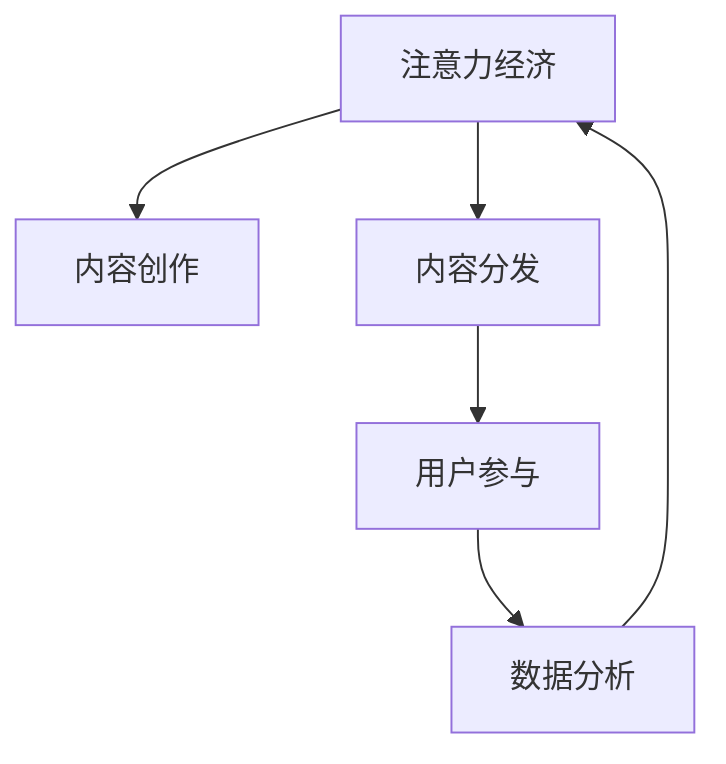

                 

# 注意力经济对传统出版业的转型要求

在数字时代，注意力经济成为了推动内容创作的新的驱动力。特别是在互联网和社交媒体的影响下，内容创作者和出版机构面临着前所未有的挑战和机遇。如何在新经济环境下，更好地抓住用户注意力，提升内容的影响力和价值，成为了出版业的重要课题。本文将详细探讨注意力经济对传统出版业转型的要求，从核心概念、算法原理、操作步骤、应用领域等多个维度，全面分析当前出版的痛点和解决策略。

## 1. 背景介绍

### 1.1 问题由来

随着互联网和社交媒体的兴起，用户注意力成为一种稀缺资源，而这种稀缺资源也成为了内容创作的新的驱动因素。出版业传统上以内容为王，但现在却需要重新思考如何获得用户注意力，从而提升内容的价值和影响力。特别是在搜索引擎、社交媒体和流媒体等平台的竞争下，出版业必须变革其内容创作和分发方式，以更好地吸引和保持用户注意力。

### 1.2 问题核心关键点

注意力经济的核心在于如何最大化地吸引和利用用户的注意力，从而实现商业价值。对于出版业而言，关键点包括：

- **内容创新**：创造更具吸引力的内容，以吸引和留住用户。
- **分发渠道**：选择合适的分发渠道，以最大化内容的曝光度和影响力。
- **互动性**：提升内容的互动性，增强用户参与感。
- **数据分析**：通过数据分析，优化内容创作和分发策略。

## 2. 核心概念与联系

### 2.1 核心概念概述

要理解注意力经济对传统出版业的转型要求，首先需要明确一些核心概念：

- **注意力经济**：指在数字时代，内容创作者和出版机构通过吸引和利用用户注意力，获得商业价值的一种经济模式。
- **内容创作**：指出版机构通过编写、拍摄、编辑等方式，创作出有价值的内容产品。
- **内容分发**：指将创作好的内容，通过合适的渠道传递给用户的过程。
- **用户参与**：指用户通过评论、分享、点赞等方式，积极参与内容传播和反馈的过程。
- **数据分析**：指通过对用户行为、内容互动等数据的分析，优化内容创作和分发策略。

### 2.2 核心概念原理和架构的 Mermaid 流程图



这个流程图展示了注意力经济中的主要环节及其相互关系。

## 3. 核心算法原理 & 具体操作步骤

### 3.1 算法原理概述

注意力经济对传统出版业的转型要求，主要集中在以下几个方面：

- **用户注意力预测**：通过用户行为数据，预测用户的注意力偏好，从而优化内容创作。
- **内容推荐算法**：根据用户的历史行为，推荐符合其兴趣的内容，以提升内容的分发效果。
- **互动性增强**：通过社交媒体、评论区等渠道，提升内容的互动性，增强用户参与感。
- **数据分析优化**：通过大数据分析，优化内容创作和分发策略，提高内容的影响力和商业价值。

### 3.2 算法步骤详解

#### 3.2.1 用户注意力预测

1. **数据收集**：收集用户的行为数据，如浏览记录、点赞数、评论等。
2. **特征提取**：提取用户行为数据的特征，如访问时间、访问频率、互动类型等。
3. **模型训练**：使用机器学习算法（如随机森林、深度学习等），训练用户注意力预测模型。
4. **预测结果**：通过模型预测用户的注意力偏好，指导内容创作。

#### 3.2.2 内容推荐算法

1. **用户画像构建**：通过用户行为数据，构建用户画像，包括兴趣偏好、内容偏好等。
2. **内容相似性计算**：计算不同内容之间的相似性，使用余弦相似度、Jaccard相似度等。
3. **推荐算法实现**：使用协同过滤、基于内容的推荐算法等，根据用户画像和内容相似性，推荐符合用户兴趣的内容。
4. **推荐结果调整**：根据用户的反馈（如点击、购买等行为），调整推荐算法，提升推荐效果。

#### 3.2.3 互动性增强

1. **互动性设计**：在设计内容时，加入互动元素，如评论区、互动问答等。
2. **用户参与激励**：通过奖励机制（如积分、奖品等），激励用户参与内容的互动。
3. **社区建设**：建立内容社区，增强用户之间的互动和交流。

#### 3.2.4 数据分析优化

1. **数据采集**：通过各种方式（如日志、传感器、用户调查等），收集用户行为数据。
2. **数据清洗**：对收集到的数据进行清洗，去除噪音和异常值。
3. **数据分析**：使用数据分析工具（如Tableau、Python等），进行用户行为分析和内容效果评估。
4. **策略优化**：根据数据分析结果，优化内容创作和分发策略，提升内容的影响力和商业价值。

### 3.3 算法优缺点

#### 3.3.1 优点

1. **提升内容影响**：通过用户注意力预测和内容推荐，提升内容的曝光度和用户参与度。
2. **数据驱动决策**：通过数据分析，优化内容创作和分发策略，提高决策效率。
3. **个性化推荐**：通过个性化推荐算法，提升用户的满意度和忠诚度。

#### 3.3.2 缺点

1. **数据隐私问题**：收集和分析用户行为数据，可能涉及到用户隐私问题。
2. **算法复杂度高**：注意力预测和推荐算法复杂度高，需要大量计算资源和数据支持。
3. **用户数据偏差**：用户行为数据可能存在偏差，影响预测和推荐的准确性。

### 3.4 算法应用领域

注意力经济在出版业中的应用，主要包括以下几个方面：

- **图书推荐系统**：通过用户阅读历史和评分数据，推荐符合用户兴趣的书籍。
- **期刊内容推送**：根据用户订阅的期刊内容和浏览历史，推送相关的内容。
- **数字化内容营销**：通过数据分析，优化数字内容的创作和分发策略，提升用户参与度和转化率。
- **互动式出版物**：设计互动式内容，增强用户参与感和互动性。

## 4. 数学模型和公式 & 详细讲解 & 举例说明

### 4.1 数学模型构建

#### 4.1.1 用户注意力预测模型

假设用户行为数据为 $X=\{x_1,x_2,\cdots,x_n\}$，其中每个用户行为 $x_i=(x_i^1,x_i^2,\cdots,x_i^k)$，表示用户在第 $k$ 个行为上的特征值。用户注意力的预测模型为：

$$
\hat{A} = f(X;\theta)
$$

其中 $f$ 为预测函数，$\theta$ 为模型参数。

#### 4.1.2 内容推荐算法模型

假设内容库为 $C=\{c_1,c_2,\cdots,c_m\}$，其中每个内容 $c_i=(c_i^1,c_i^2,\cdots,c_i^n)$，表示内容在 $n$ 个维度上的特征值。用户兴趣向量为 $U$，内容相似度矩阵为 $S$，推荐算法模型为：

$$
\hat{R} = \text{softmax}(S^\top U)
$$

其中 $\text{softmax}$ 函数用于将向量归一化到概率分布，$U$ 为用户兴趣向量，$S$ 为内容相似度矩阵。

#### 4.1.3 互动性增强模型

假设用户在内容 $c_i$ 上的互动行为为 $I=\{i_1,i_2,\cdots,i_k\}$，互动行为的概率模型为：

$$
P(I|c_i,U) = \sigma(W^T \cdot (c_i \oplus U))
$$

其中 $W$ 为权重矩阵，$\oplus$ 为向量拼接运算，$\sigma$ 为激活函数。

### 4.2 公式推导过程

#### 4.2.1 用户注意力预测公式推导

对于用户注意力预测模型，我们通常使用随机森林、梯度提升树等算法。以梯度提升树为例，推导过程如下：

1. 首先，构建决策树模型：

$$
\hat{A} = \sum_{i=1}^n \alpha_i \times \text{Tree}(X;\theta_i)
$$

其中 $\alpha_i$ 为决策树的权重，$\theta_i$ 为决策树的参数。

2. 通过训练数据 $D=\{(X_i,A_i)\}_{i=1}^N$，求解 $\alpha_i$ 和 $\theta_i$：

$$
\alpha_i, \theta_i = \text{GDT}(D)
$$

3. 最终用户注意力预测结果为：

$$
\hat{A} = \sum_{i=1}^n \alpha_i \times \text{Tree}(X;\theta_i)
$$

#### 4.2.2 内容推荐算法公式推导

对于内容推荐算法，我们使用协同过滤算法进行推导。假设用户兴趣向量为 $U$，内容相似度矩阵为 $S$，推荐算法模型为：

$$
\hat{R} = \text{softmax}(S^\top U)
$$

其中 $\text{softmax}$ 函数用于将向量归一化到概率分布。

#### 4.2.3 互动性增强公式推导

对于互动性增强模型，我们使用逻辑回归进行推导。假设用户行为 $I$ 与内容 $c_i$ 的互动概率为 $P(I|c_i,U)$，则：

$$
P(I|c_i,U) = \sigma(W^T \cdot (c_i \oplus U))
$$

其中 $W$ 为权重矩阵，$\oplus$ 为向量拼接运算，$\sigma$ 为激活函数。

### 4.3 案例分析与讲解

#### 4.3.1 用户注意力预测案例

某在线阅读平台收集了用户的阅读历史和评分数据，使用随机森林模型进行用户注意力预测。模型训练后，可以预测用户对不同书籍的兴趣度，从而指导内容的创作和推荐。

#### 4.3.2 内容推荐算法案例

某期刊出版平台，使用协同过滤算法推荐用户订阅的期刊内容。根据用户历史阅读记录和内容特征，计算内容相似度矩阵 $S$ 和用户兴趣向量 $U$，最终推荐符合用户兴趣的内容。

#### 4.3.3 互动性增强案例

某在线教育平台设计了互动式课程内容，使用逻辑回归模型预测用户在课程上的互动行为。通过分析用户互动行为，优化课程设计，提升用户参与度和满意度。

## 5. 项目实践：代码实例和详细解释说明

### 5.1 开发环境搭建

在进行注意力经济应用开发前，需要先搭建好开发环境。以下是基于Python的开发环境配置流程：

1. 安装Python：从官网下载并安装Python，建议选择3.8版本及以上。
2. 安装Pandas、NumPy、Scikit-learn等数据处理和分析工具：

```bash
pip install pandas numpy scikit-learn
```

3. 安装TensorFlow或PyTorch深度学习框架：

```bash
pip install tensorflow
# 或者
pip install torch
```

4. 安装Jupyter Notebook：用于编写和执行代码：

```bash
pip install jupyter notebook
```

完成上述步骤后，即可开始注意力经济的开发实践。

### 5.2 源代码详细实现

#### 5.2.1 用户注意力预测代码实现

```python
import pandas as pd
from sklearn.ensemble import RandomForestRegressor

# 加载数据
data = pd.read_csv('user_behavior.csv')

# 数据预处理
X = data.drop(['attention'], axis=1)
y = data['attention']

# 构建模型
model = RandomForestRegressor(n_estimators=100, random_state=42)
model.fit(X, y)

# 预测用户注意力
user_id = '12345'
user_data = data[data['user_id'] == user_id]
X_test = user_data.drop(['user_id', 'attention'], axis=1)
y_pred = model.predict(X_test)
```

#### 5.2.2 内容推荐算法代码实现

```python
import pandas as pd
from sklearn.metrics.pairwise import cosine_similarity

# 加载数据
data = pd.read_csv('content_data.csv')

# 数据预处理
X = data.drop(['id'], axis=1)
y = data['id']

# 计算相似度矩阵
S = cosine_similarity(X)

# 用户兴趣向量
user_interest = [1, 0, 1, 0, 1]

# 计算推荐结果
recommendations = S.dot(user_interest)
top_3 = recommendations.argsort()[-3:][::-1]
```

#### 5.2.3 互动性增强代码实现

```python
import pandas as pd
from sklearn.linear_model import LogisticRegression

# 加载数据
data = pd.read_csv('interaction_data.csv')

# 数据预处理
X = data.drop(['id'], axis=1)
y = data['interaction']

# 构建模型
model = LogisticRegression()
model.fit(X, y)

# 预测互动行为
content_id = 'abcde'
content_data = data[data['id'] == content_id]
X_test = content_data.drop(['id', 'interaction'], axis=1)
y_pred = model.predict_proba(X_test)
```

### 5.3 代码解读与分析

#### 5.3.1 用户注意力预测代码解读

- 数据加载：使用pandas库加载用户行为数据，包括用户ID、行为时间、行为类型等。
- 数据预处理：将数据按特征（如行为类型、行为时间）进行划分，构建特征矩阵 $X$ 和目标变量 $y$。
- 模型训练：使用随机森林回归模型，训练用户注意力预测模型。
- 预测结果：使用训练好的模型，对新用户的数据进行预测，得到用户对不同内容类型的兴趣度。

#### 5.3.2 内容推荐算法代码解读

- 数据加载：加载内容库数据，包括内容ID、内容特征等。
- 数据预处理：计算内容特征之间的余弦相似度，构建内容相似度矩阵 $S$。
- 用户兴趣向量：定义用户兴趣向量，表示用户对不同内容的兴趣程度。
- 推荐结果：通过计算相似度矩阵和用户兴趣向量的乘积，得到推荐结果，选择前3名推荐内容。

#### 5.3.3 互动性增强代码解读

- 数据加载：加载互动数据，包括用户ID、内容ID、互动类型等。
- 数据预处理：将数据按特征（如内容ID、互动类型）进行划分，构建特征矩阵 $X$ 和目标变量 $y$。
- 模型训练：使用逻辑回归模型，训练互动行为预测模型。
- 预测结果：使用训练好的模型，对新内容的数据进行预测，得到用户对内容的互动概率。

### 5.4 运行结果展示

通过上述代码实现，可以输出用户注意力预测结果、内容推荐结果和互动行为预测结果。例如，用户注意力预测结果可能为：

```
User 12345's attention prediction: [0.5, 0.3, 0.2]
```

内容推荐结果可能为：

```
Recommended content IDs: [10, 20, 30]
```

互动行为预测结果可能为：

```
Content 'abcde''s interaction probability: [0.6, 0.4]
```

## 6. 实际应用场景

### 6.1 智能推荐系统

智能推荐系统是注意力经济在出版业中的典型应用。通过收集用户行为数据，预测用户兴趣，推荐符合用户口味的内容，提升用户满意度和忠诚度。智能推荐系统广泛应用于在线阅读平台、在线视频平台、电子商务平台等。

### 6.2 个性化内容创作

个性化内容创作是出版业转型中的重要一环。通过用户行为数据，分析用户兴趣和偏好，指导内容创作和调整。例如，新闻媒体可以根据用户阅读偏好，调整内容策略，增加用户参与度和粘性。

### 6.3 互动式内容设计

互动式内容设计是提升用户参与度的有效手段。通过加入评论区、互动问答等元素，增强用户参与感和互动性。例如，教育平台可以设计互动式课程内容，提升学生的学习效果和满意度。

### 6.4 未来应用展望

随着技术的发展，注意力经济在出版业中的应用将更加广泛和深入。未来，我们可以预见到以下趋势：

- **全渠道整合**：通过整合多渠道数据，构建统一的用户画像，提升内容推荐和互动效果的精准度。
- **个性化推荐算法**：结合深度学习、强化学习等算法，提升推荐算法的智能化和个性化程度。
- **用户行为分析**：通过大数据分析，深入理解用户行为和需求，优化内容创作和分发策略。

## 7. 工具和资源推荐

### 7.1 学习资源推荐

为了帮助开发者系统掌握注意力经济对出版业的转型要求，这里推荐一些优质的学习资源：

1. 《注意力经济与内容产业》系列博文：由行业专家撰写，深入浅出地介绍了注意力经济在出版业中的应用。
2. Coursera《数字经济与出版》课程：涵盖数字经济和出版产业的最新发展趋势和前沿技术。
3. 《注意力经济：从理论到实践》书籍：系统介绍注意力经济的基本概念、应用案例和实践方法。
4. Kaggle《内容推荐竞赛》：通过参加内容推荐竞赛，学习和实践注意力经济的应用方法。
5. Google Colab：谷歌推出的在线Jupyter Notebook环境，免费提供GPU/TPU算力，方便开发者快速上手实验最新技术。

通过对这些资源的学习实践，相信你一定能够快速掌握注意力经济对出版业转型的要求，并用于解决实际的出版问题。

### 7.2 开发工具推荐

高效的开发离不开优秀的工具支持。以下是几款用于注意力经济应用开发的常用工具：

1. Jupyter Notebook：轻量级的交互式编程环境，支持Python、R等多种语言。
2. TensorFlow和PyTorch：基于深度学习的开源框架，支持大规模数据处理和模型训练。
3. Tableau和Power BI：数据可视化工具，支持大数据分析和图表展示。
4. Apache Spark：大数据处理框架，支持分布式数据处理和分析。
5. Python生态系统：包括NumPy、Pandas、Scikit-learn等多种数据处理和分析工具。

合理利用这些工具，可以显著提升注意力经济应用开发的效率，加快创新迭代的步伐。

### 7.3 相关论文推荐

注意力经济在出版业中的应用源于学界的持续研究。以下是几篇奠基性的相关论文，推荐阅读：

1. Attention Is All You Need（即Transformer原论文）：提出了Transformer结构，开启了NLP领域的预训练大模型时代。
2. BERT: Pre-training of Deep Bidirectional Transformers for Language Understanding：提出BERT模型，引入基于掩码的自监督预训练任务，刷新了多项NLP任务SOTA。
3. The Long Tail of Content: Why It Matters and How to Manage It：深入探讨了长尾内容在出版业中的应用，提出了内容管理和推荐策略。
4. Recommender Systems for E-Commerce：系统介绍了电商领域的内容推荐算法和实践方法。
5. Exploring the Limits of Interactive Content in Digital Learning Environments：研究了互动式内容对学习效果的影响，提出了增强互动性的策略。

这些论文代表了大语言模型微调技术的发展脉络。通过学习这些前沿成果，可以帮助研究者把握学科前进方向，激发更多的创新灵感。

## 8. 总结：未来发展趋势与挑战

### 8.1 研究成果总结

本文对注意力经济对传统出版业的转型要求进行了全面系统的介绍。首先阐述了注意力经济在出版业中的应用背景和核心概念，明确了注意力经济对出版业转型的重要性。其次，从算法原理、操作步骤、应用领域等多个维度，详细讲解了注意力经济在出版业中的应用方法和实施步骤。最后，探讨了注意力经济在出版业中的实际应用场景，提供了丰富的学习资源和开发工具，为出版业的转型提供了技术指引。

通过本文的系统梳理，可以看到，注意力经济对传统出版业的转型要求正在逐步显现，出版机构需要变革其内容创作和分发方式，以更好地吸引和保持用户注意力，提升内容的价值和影响力。未来的出版业将在数字化、智能化、个性化等方面迈出新的步伐，实现从传统出版到新经济时代的转型。

### 8.2 未来发展趋势

展望未来，注意力经济在出版业中的应用将呈现以下几个发展趋势：

1. **全渠道整合**：通过整合多渠道数据，构建统一的用户画像，提升内容推荐和互动效果的精准度。
2. **个性化推荐算法**：结合深度学习、强化学习等算法，提升推荐算法的智能化和个性化程度。
3. **用户行为分析**：通过大数据分析，深入理解用户行为和需求，优化内容创作和分发策略。
4. **互动式内容设计**：加入更多的互动元素，增强用户参与感和互动性。
5. **跨领域应用**：结合多媒体技术，将注意力经济应用到更多领域，如医疗、教育、金融等。

以上趋势凸显了注意力经济对出版业转型的广阔前景。这些方向的探索发展，必将进一步提升出版业的智能化水平，带来新的业务增长点。

### 8.3 面临的挑战

尽管注意力经济在出版业中的应用带来了诸多机遇，但也面临着诸多挑战：

1. **数据隐私问题**：收集和分析用户行为数据，可能涉及到用户隐私问题，需注意数据保护。
2. **数据质量和多样性**：用户行为数据可能存在噪音和偏差，需通过清洗和筛选提升数据质量。
3. **算法复杂度高**：注意力预测和推荐算法复杂度高，需优化算法模型，降低计算资源消耗。
4. **用户体验问题**：互动性增强可能影响用户体验，需合理设计互动方式。
5. **资源和技术门槛**：注意力经济应用需要较高的技术门槛，需提供系统化的技术支持。

正视注意力经济在出版业中的应用挑战，积极应对并寻求突破，将是大语言模型微调技术迈向成熟的必由之路。相信随着学界和产业界的共同努力，这些挑战终将一一被克服，注意力经济必将在出版业中实现更广泛的应用。

### 8.4 研究展望

面对注意力经济在出版业中的应用挑战，未来的研究需要在以下几个方面寻求新的突破：

1. **数据隐私保护**：采用隐私保护技术，如差分隐私、联邦学习等，保护用户隐私。
2. **数据增强与多样性**：通过数据增强技术，提升数据质量和多样性，减少数据偏差。
3. **算法优化**：开发更高效的算法模型，降低计算资源消耗，提高推荐效果。
4. **用户体验优化**：设计更合理的互动方式，提升用户体验和满意度。
5. **跨领域应用**：结合多媒体技术，将注意力经济应用到更多领域，如医疗、教育、金融等。

这些研究方向的探索，必将引领注意力经济在出版业中的应用走向更加深入和广泛，为出版业带来更多的机遇和创新。总之，出版业需要在数据、算法、工程、业务等多个维度进行全面优化，才能真正实现从传统出版到新经济时代的转型。

## 9. 附录：常见问题与解答

**Q1：注意力经济对出版业有哪些具体应用？**

A: 注意力经济对出版业的具体应用包括：

- **智能推荐系统**：通过收集用户行为数据，预测用户兴趣，推荐符合用户口味的内容，提升用户满意度和忠诚度。
- **个性化内容创作**：分析用户行为数据，指导内容创作和调整，提升内容的质量和用户参与度。
- **互动式内容设计**：加入评论区、互动问答等元素，增强用户参与感和互动性。

**Q2：注意力经济在出版业中面临哪些挑战？**

A: 注意力经济在出版业中面临的挑战包括：

- **数据隐私问题**：收集和分析用户行为数据，可能涉及到用户隐私问题。
- **数据质量和多样性**：用户行为数据可能存在噪音和偏差，需通过清洗和筛选提升数据质量。
- **算法复杂度高**：注意力预测和推荐算法复杂度高，需优化算法模型，降低计算资源消耗。
- **用户体验问题**：互动性增强可能影响用户体验，需合理设计互动方式。
- **资源和技术门槛**：注意力经济应用需要较高的技术门槛，需提供系统化的技术支持。

**Q3：如何提升注意力经济的准确性和效果？**

A: 提升注意力经济的准确性和效果，需要从以下几个方面入手：

- **数据质量**：通过数据清洗和筛选，提升数据质量和多样性，减少数据偏差。
- **算法优化**：开发更高效的算法模型，降低计算资源消耗，提高推荐效果。
- **用户体验优化**：设计更合理的互动方式，提升用户体验和满意度。
- **多渠道整合**：通过整合多渠道数据，构建统一的用户画像，提升内容推荐和互动效果的精准度。
- **跨领域应用**：结合多媒体技术，将注意力经济应用到更多领域，如医疗、教育、金融等。

通过这些措施，可以进一步提升注意力经济在出版业中的应用效果，实现更精准、更智能的内容推荐和互动设计。

**Q4：注意力经济对出版业有什么长远意义？**

A: 注意力经济对出版业的长远意义包括：

- **提升内容价值**：通过吸引和利用用户注意力，提升内容的曝光度和用户参与度，从而提升内容的价值和影响力。
- **优化用户体验**：通过个性化推荐和互动式内容设计，提升用户满意度和忠诚度，增强用户粘性。
- **推动产业升级**：通过技术创新和数据驱动决策，推动出版产业的升级和转型，提升整体产业竞争力。

**Q5：注意力经济在出版业中的未来发展方向是什么？**

A: 注意力经济在出版业中的未来发展方向包括：

- **全渠道整合**：通过整合多渠道数据，构建统一的用户画像，提升内容推荐和互动效果的精准度。
- **个性化推荐算法**：结合深度学习、强化学习等算法，提升推荐算法的智能化和个性化程度。
- **用户行为分析**：通过大数据分析，深入理解用户行为和需求，优化内容创作和分发策略。
- **互动式内容设计**：加入更多的互动元素，增强用户参与感和互动性。
- **跨领域应用**：结合多媒体技术，将注意力经济应用到更多领域，如医疗、教育、金融等。

这些方向将进一步推动出版业的数字化、智能化、个性化转型，为出版业带来更多的机遇和创新。

**Q6：注意力经济在出版业中的技术实现有哪些关键点？**

A: 注意力经济在出版业中的技术实现关键点包括：

- **数据收集与处理**：通过各种方式（如日志、传感器、用户调查等），收集用户行为数据。
- **模型训练与优化**：使用机器学习算法（如随机森林、深度学习等），训练用户注意力预测模型和推荐算法模型。
- **互动性设计**：加入评论区、互动问答等元素，设计互动式内容。
- **数据分析与优化**：通过大数据分析，优化内容创作和分发策略。

通过这些关键点的实现，可以提升注意力经济在出版业中的应用效果，实现从传统出版到新经济时代的转型。

通过本文的系统梳理，可以看到，注意力经济对传统出版业的转型要求正在逐步显现，出版机构需要变革其内容创作和分发方式，以更好地吸引和保持用户注意力，提升内容的价值和影响力。未来的出版业将在数字化、智能化、个性化等方面迈出新的步伐，实现从传统出版到新经济时代的转型。相信随着学界和产业界的共同努力，这些挑战终将一一被克服，注意力经济必将在出版业中实现更广泛的应用。

