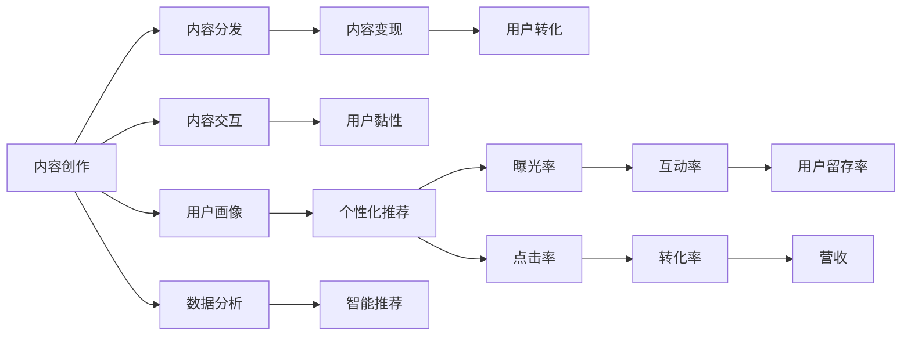

                 

## 1. 背景介绍

### 1.1 问题由来

在信息爆炸的时代，传统媒体面临着前所未有的挑战和机遇。一方面，数字媒体和社交平台的崛起，使得内容的分发和消费方式发生了根本性变革；另一方面，人们对于信息的需求和消费习惯也在发生深刻变化。这种背景下，传统媒体如何适应新的市场环境，重塑自身的生态，成为亟需解决的问题。

### 1.2 问题核心关键点

注意力经济是指在信息过载的时代，媒体竞争的核心是争夺用户的注意力。在新的经济模式下，传统媒体需要重新思考内容创作、分发、交互、变现等各个环节，以实现价值最大化。具体问题包括：

- 如何提高内容吸引力，增加用户黏性？
- 如何通过数据挖掘和智能推荐，精准触达用户需求？
- 如何构建多元化变现模式，实现持续盈利？
- 如何在移动互联时代，保持品牌影响力和用户信任度？

### 1.3 问题研究意义

研究注意力经济对传统媒体生态的重塑，对于传统媒体的转型升级具有重要意义：

1. 提升竞争力：通过精准触达用户需求，提高内容的点击率和转化率，帮助传统媒体在数字时代保持竞争力。
2. 增强品牌价值：通过智能化互动和个性化推荐，提升用户体验，增强用户对品牌的忠诚度和信任感。
3. 实现多元变现：通过内容付费、广告变现、社群电商等多种方式，探索新的盈利模式，实现传统媒体的持续发展。
4. 重塑生态系统：通过对用户数据的深度挖掘和分析，推动传统媒体生态向数据驱动、智能化的方向发展，实现媒体内容的全面升级。

## 2. 核心概念与联系

### 2.1 核心概念概述

注意力经济是指在信息过载的时代，媒体竞争的核心是争夺用户的注意力。传统媒体在新的经济模式下，需要重新思考内容创作、分发、交互、变现等各个环节，以实现价值最大化。

注意力经济的核心在于通过精准触达用户需求，提升内容的吸引力和用户黏性。具体而言，包括：

- **内容创作**：通过数据分析和用户画像，创作有吸引力的内容，满足用户多样化的需求。
- **内容分发**：利用智能推荐算法，将内容精准推送给潜在用户，提高内容的曝光率和点击率。
- **内容交互**：通过互动形式（如评论、点赞、分享）增强用户参与感，提升用户黏性和活跃度。
- **内容变现**：通过内容付费、广告变现、社群电商等多种方式，实现内容的商业价值。

### 2.2 核心概念原理和架构的 Mermaid 流程图



这个流程图展示了注意力经济的核心环节及其相互关系。通过内容创作、分发、交互、变现等环节的紧密配合，传统媒体可以更有效地吸引用户注意力，提升用户黏性，最终实现商业价值。

## 3. 核心算法原理 & 具体操作步骤

### 3.1 算法原理概述

注意力经济的实现，离不开数据驱动和算法支持。基于机器学习和人工智能技术，媒体机构可以对用户行为数据进行深度挖掘和分析，从而精准触达用户需求，实现内容的个性化推荐和互动。

核心算法包括：

- **用户画像**：通过数据分析，构建用户画像，了解用户兴趣、行为、偏好等信息。
- **个性化推荐**：利用协同过滤、内容推荐、混合推荐等算法，向用户推荐感兴趣的内容。
- **智能互动**：通过自然语言处理（NLP）、情感分析、语音识别等技术，实现智能客服、聊天机器人、互动问答等功能。

### 3.2 算法步骤详解

基于注意力经济的媒体生态重塑，主要包括以下几个关键步骤：

**Step 1: 数据采集与预处理**

- 收集用户行为数据，包括浏览记录、点击行为、互动数据等。
- 对数据进行清洗和处理，去除噪音和异常值，生成标准化的数据集。

**Step 2: 用户画像构建**

- 通过数据分析，提取用户的基本属性、兴趣标签、行为特征等信息，构建用户画像。
- 利用聚类、分类等算法，对用户进行分组和分类，形成不同的用户群体。

**Step 3: 个性化推荐**

- 设计推荐算法，利用协同过滤、基于内容的推荐、混合推荐等技术，生成个性化推荐列表。
- 对推荐结果进行评分排序，选择最符合用户兴趣的内容进行推送。

**Step 4: 智能互动**

- 开发智能客服、聊天机器人等系统，实现与用户的实时互动。
- 利用NLP技术，对用户输入进行解析和理解，生成自然语言回复。

**Step 5: 效果评估与优化**

- 利用A/B测试、点击率、互动率、转化率等指标，评估推荐系统的效果。
- 根据评估结果，优化推荐算法和互动功能，提升用户满意度和黏性。

### 3.3 算法优缺点

基于注意力经济的媒体生态重塑，具有以下优点：

- **精准触达用户**：通过数据分析和用户画像，实现内容的精准推送，提高内容的曝光率和点击率。
- **提升用户黏性**：通过智能互动和个性化推荐，增强用户参与感和满意度，提升用户黏性和活跃度。
- **多元变现模式**：通过内容付费、广告变现、社群电商等多种方式，实现内容的商业价值。

同时，该方法也存在一些局限性：

- **数据隐私和安全**：用户数据的收集和分析可能涉及隐私和安全问题，需要严格的数据保护措施。
- **算法复杂度高**：用户画像的构建和个性化推荐的实现，涉及复杂的数据挖掘和算法优化，需要较高的技术水平和计算资源。
- **用户接受度**：部分用户可能对个性化推荐和智能互动存在抵触情绪，需要逐步培养用户习惯。

### 3.4 算法应用领域

注意力经济的应用范围广泛，涵盖各类媒体和内容平台：

- **新闻媒体**：通过智能推荐和个性化新闻，提升用户点击率和互动率。
- **出版行业**：利用推荐算法和互动功能，推动数字图书和电子书的销售。
- **影视娱乐**：通过个性化推荐和智能互动，提升用户观影体验和会员留存率。
- **体育赛事**：利用互动和推荐技术，增强用户参与感和赛事体验。
- **旅游行业**：通过个性化推荐和智能客服，提升用户旅游体验和预订成功率。

## 4. 数学模型和公式 & 详细讲解 & 举例说明

### 4.1 数学模型构建

基于注意力经济的媒体生态重塑，可以构建以下数学模型：

- **用户画像模型**：通过对用户行为数据进行聚类和分类，构建用户画像向量 $\mathbf{u}_i$，其中 $i$ 表示用户编号。
- **个性化推荐模型**：利用协同过滤、基于内容的推荐、混合推荐等算法，生成推荐列表 $\mathbf{r}_i$。
- **智能互动模型**：利用NLP技术，对用户输入进行解析和理解，生成自然语言回复 $\mathbf{a}_i$。

### 4.2 公式推导过程

以协同过滤算法为例，推导个性化推荐模型的公式。

设用户 $i$ 对物品 $j$ 的评分矩阵为 $R_{ij}$，用户画像向量为 $\mathbf{u}_i$，物品特征向量为 $\mathbf{v}_j$，则协同过滤算法可以表示为：

$$
\mathbf{r}_i = \arg\min_{\mathbf{v}_j} \|\mathbf{R}_{ij} - \mathbf{u}_i \mathbf{v}_j^T\|_F^2
$$

其中 $\|\cdot\|_F$ 表示矩阵的 Frobenius 范数。

### 4.3 案例分析与讲解

假设某新闻媒体收集到用户点击新闻的记录数据，通过协同过滤算法，为用户 $i$ 推荐新闻 $j$。根据用户行为数据，构建用户画像向量 $\mathbf{u}_i$ 和物品特征向量 $\mathbf{v}_j$。利用上述公式，计算推荐结果 $\mathbf{r}_i$，对推荐列表进行排序，选择最符合用户兴趣的新闻进行推送。

## 5. 项目实践：代码实例和详细解释说明

### 5.1 开发环境搭建

在进行注意力经济相关的开发时，需要一个功能强大且易于扩展的开发环境。以下是使用Python进行开发的环境配置流程：

1. 安装Anaconda：从官网下载并安装Anaconda，用于创建独立的Python环境。

2. 创建并激活虚拟环境：
```bash
conda create -n attention-env python=3.8 
conda activate attention-env
```

3. 安装所需的Python包：
```bash
pip install pandas numpy scikit-learn tensorflow transformers scipy
```

4. 安装Transformer库：
```bash
pip install transformers
```

5. 安装TensorFlow：
```bash
pip install tensorflow
```

完成上述步骤后，即可在`attention-env`环境中开始开发实践。

### 5.2 源代码详细实现

下面以推荐系统的开发为例，给出使用TensorFlow进行个性化推荐算法的代码实现。

首先，定义推荐系统的数据处理函数：

```python
import tensorflow as tf
import numpy as np

def preprocess_data(data, num_users, num_items):
    user_ids = np.zeros((len(data)), dtype=int)
    item_ids = np.zeros((len(data)), dtype=int)
    ratings = np.zeros((len(data)), dtype=float)
    
    for i, entry in enumerate(data):
        user_ids[i] = entry['user_id']
        item_ids[i] = entry['item_id']
        ratings[i] = entry['rating']
    
    user_ids = user_ids - 1
    item_ids = item_ids - 1
    
    return user_ids, item_ids, ratings

def train_model(data, num_users, num_items, embedding_dim, num_epochs):
    user_ids, item_ids, ratings = preprocess_data(data, num_users, num_items)
    
    # 定义模型
    user_embeddings = tf.Variable(tf.random.normal([num_users, embedding_dim]))
    item_embeddings = tf.Variable(tf.random.normal([num_items, embedding_dim]))
    preds = tf.matmul(tf.gather(user_embeddings, user_ids), tf.gather(item_embeddings, item_ids))
    loss = tf.reduce_mean(tf.square(preds - ratings))
    
    optimizer = tf.keras.optimizers.Adam(learning_rate=0.01)
    for epoch in range(num_epochs):
        with tf.GradientTape() as tape:
            loss = loss
        grads = tape.gradient(loss, [user_embeddings, item_embeddings])
        optimizer.apply_gradients(zip(grads, [user_embeddings, item_embeddings]))
    
    return user_embeddings, item_embeddings
```

然后，定义推荐函数：

```python
def recommend(user_ids, user_embeddings, item_embeddings, num_items, top_k=5):
    user_emb = tf.gather(user_embeddings, user_ids)
    item_emb = tf.gather(item_embeddings, item_ids)
    scores = tf.matmul(user_emb, item_emb, transpose_b=True)
    top_items = tf.argsort(scores, axis=1)[-top_k:]
    
    return [item_ids[i] for i in top_items]
```

最后，启动训练流程并在推荐结果上进行评估：

```python
num_users = 1000
num_items = 10000
embedding_dim = 32
num_epochs = 100

user_embeddings, item_embeddings = train_model(data, num_users, num_items, embedding_dim, num_epochs)

test_user_ids = np.random.randint(0, num_users, size=(100, 1))
recommended_items = recommend(test_user_ids, user_embeddings, item_embeddings, num_items)

print(recommended_items)
```

以上就是使用TensorFlow进行个性化推荐算法的完整代码实现。可以看到，通过定义数据处理、模型训练、推荐函数等关键组件，可以轻松实现个性化推荐系统的开发。

### 5.3 代码解读与分析

让我们再详细解读一下关键代码的实现细节：

**preprocess_data函数**：
- 定义了数据预处理函数，将原始数据集转换成训练模型所需的格式。

**train_model函数**：
- 定义了协同过滤模型的训练函数，通过最小化均方误差损失函数，更新用户和物品的嵌入向量。
- 利用Adam优化器进行模型训练，设置学习率为0.01。

**recommend函数**：
- 定义了推荐函数，根据用户嵌入向量和物品嵌入向量，计算推荐结果。
- 通过argsort函数，获取推荐列表中最高的k个物品ID。

**训练流程**：
- 定义了模型参数和训练轮数，启动训练循环。
- 在每个epoch内，前向传播计算损失函数，反向传播更新模型参数。
- 训练结束后，返回用户和物品的嵌入向量。

可以看到，TensorFlow提供了简洁易用的API，使得开发者可以轻松实现个性化推荐算法的训练和推荐。通过这些代码实现，可以方便地扩展和优化算法，提升推荐系统的性能。

## 6. 实际应用场景

### 6.1 智能新闻推荐

智能新闻推荐系统可以根据用户的浏览历史、点击行为、兴趣爱好等信息，生成个性化的新闻推荐列表。通过推荐系统，用户可以更快地找到感兴趣的新闻，提升新闻点击率和互动率，增强用户的媒体黏性。

**实现方式**：
- 收集用户的浏览记录和点击行为，构建用户画像。
- 利用协同过滤算法，生成个性化推荐列表。
- 将推荐结果通过推送系统发送给用户。

### 6.2 内容付费订阅

内容付费订阅模式通过向用户提供优质的内容，实现收入多元化。推荐系统可以根据用户的行为数据，精准推荐优质内容，增加用户的订阅和付费转化率。

**实现方式**：
- 收集用户订阅和付费行为，构建用户画像。
- 利用个性化推荐算法，推荐用户感兴趣的内容。
- 在内容页面设置付费按钮，通过推荐系统引导用户付费订阅。

### 6.3 广告精准投放

广告精准投放系统可以根据用户的兴趣和行为，推荐相关广告，提高广告的点击率和转化率。推荐系统可以提升广告投放的效率和效果，降低广告成本。

**实现方式**：
- 收集用户的浏览记录和点击行为，构建用户画像。
- 利用协同过滤算法，生成个性化推荐广告。
- 在广告页面设置点击追踪，收集广告点击数据，优化广告投放策略。

### 6.4 未来应用展望

随着技术的不断进步，基于注意力经济的媒体生态重塑将呈现以下几个趋势：

1. **深度个性化**：利用深度学习和大数据技术，实现更高精度的用户画像和个性化推荐，提高用户满意度和忠诚度。
2. **多模态融合**：通过融合文本、图像、视频等多种信息，提供更丰富的用户体验。
3. **智能互动**：通过智能客服、聊天机器人等互动形式，增强用户参与感和互动体验。
4. **跨平台整合**：将不同的平台和设备进行整合，提供无缝的媒体体验。
5. **隐私保护**：在用户数据隐私和安全方面，采用更先进的加密和匿名化技术，保障用户隐私。

## 7. 工具和资源推荐

### 7.1 学习资源推荐

为了帮助开发者系统掌握注意力经济的理论和实践，这里推荐一些优质的学习资源：

1. 《推荐系统实战》系列博文：由大模型技术专家撰写，深入浅出地介绍了推荐系统的工作原理和实际应用。

2. 《深度学习与推荐系统》课程：斯坦福大学开设的深度学习课程，介绍了推荐系统的基本概念和前沿技术。

3. 《推荐系统：算法与应用》书籍：全面介绍了推荐系统的工作流程和常用算法，是推荐系统学习的经典教材。

4. Google TensorFlow官网：提供了TensorFlow的详细文档和示例代码，是学习TensorFlow的重要资源。

5. GitHub上的推荐系统项目：收集了大量的推荐系统实现案例和代码，是学习推荐系统的实战手册。

通过对这些资源的学习实践，相信你一定能够快速掌握注意力经济的相关技术，并应用于实际媒体推荐场景中。

### 7.2 开发工具推荐

高效的开发离不开优秀的工具支持。以下是几款用于注意力经济相关开发的常用工具：

1. TensorFlow：基于Python的开源深度学习框架，灵活的计算图设计，适合复杂的推荐系统模型实现。

2. PyTorch：另一个流行的深度学习框架，提供了丰富的优化器和模型库，支持高效的模型训练和推理。

3. Scikit-learn：基于Python的机器学习库，提供了多种常用的机器学习算法和工具，适合简单的推荐系统实现。

4. Weights & Biases：模型训练的实验跟踪工具，可以记录和可视化模型训练过程中的各项指标，方便对比和调优。

5. Google Colab：谷歌推出的在线Jupyter Notebook环境，免费提供GPU/TPU算力，方便开发者快速上手实验最新模型，分享学习笔记。

合理利用这些工具，可以显著提升注意力经济相关应用的开发效率，加快创新迭代的步伐。

### 7.3 相关论文推荐

注意力经济的发展离不开学界的持续研究。以下是几篇奠基性的相关论文，推荐阅读：

1. Matrix Factorization Techniques for Recommender Systems（矩阵分解算法）：介绍了协同过滤算法的数学原理和实现细节。

2. Deep Collaborative Filtering：通过深度神经网络实现推荐系统，提升了推荐精度和泛化能力。

3. Attention Is All You Need（Transformer论文）：提出了Transformer结构，开创了自注意力机制在推荐系统中的应用。

4. NMF-based Recommender Systems：介绍了矩阵分解算法的原理和实际应用，是推荐系统理论的重要参考。

5. Attention-based Recommender Systems：利用自注意力机制，提升推荐系统的推荐效果。

这些论文代表了大规模推荐系统的发展脉络。通过学习这些前沿成果，可以帮助研究者把握学科前进方向，激发更多的创新灵感。

## 8. 总结：未来发展趋势与挑战

### 8.1 研究成果总结

本文对注意力经济对传统媒体生态的重塑进行了全面系统的介绍。首先阐述了注意力经济的研究背景和意义，明确了精准触达用户需求、提升用户黏性和实现多元变现的重要性。其次，从原理到实践，详细讲解了用户画像构建、个性化推荐和智能互动等关键技术。最后，探讨了注意力经济在未来媒体应用中的趋势和挑战。

### 8.2 未来发展趋势

展望未来，注意力经济在媒体生态中的应用将呈现以下几个趋势：

1. **技术融合**：注意力经济将与其他人工智能技术，如自然语言处理、计算机视觉等进行深入融合，推动媒体技术的全面升级。
2. **数据驱动**：媒体机构将更加注重数据的收集和分析，通过数据驱动的方式，实现精准触达和个性化推荐。
3. **多模态融合**：通过融合多种模态的信息，提升用户体验和互动效果。
4. **用户隐私**：在用户数据隐私和安全方面，将采用更加先进的加密和匿名化技术，保障用户隐私。

### 8.3 面临的挑战

尽管注意力经济带来了诸多机遇，但在实际应用中也面临不少挑战：

1. **数据质量**：用户数据的收集和处理需要严格的规范和标准，避免噪音和异常值的干扰。
2. **算法复杂度**：推荐算法和互动系统需要较高的技术水平和计算资源，开发和维护成本较高。
3. **用户体验**：过度推荐和广告投放可能影响用户体验，需要平衡推荐和用户体验的关系。
4. **隐私安全**：用户数据的收集和使用需要严格的数据保护措施，避免数据泄露和滥用。

### 8.4 研究展望

面对注意力经济在媒体生态中的挑战，未来的研究需要在以下几个方面寻求新的突破：

1. **数据增强**：通过增强数据多样性和质量，提高推荐系统的性能。
2. **跨模态融合**：融合多种模态的数据，提升推荐系统的全面性和准确性。
3. **用户交互**：通过设计更好的交互方式，增强用户参与感和满意度。
4. **隐私保护**：通过隐私保护技术，保障用户数据的安全和隐私。

这些研究方向的探索，必将引领注意力经济在媒体应用中的进一步发展，推动媒体技术的智能化和个性化。相信随着技术的不断进步和应用的深入，注意力经济将为传统媒体带来更大的价值和机会。

## 9. 附录：常见问题与解答

**Q1：如何提高推荐系统的个性化效果？**

A: 提高推荐系统的个性化效果需要从多个方面入手：

- **数据收集**：通过多种渠道收集用户行为数据，包括浏览记录、点击行为、互动数据等，构建全面的用户画像。
- **算法优化**：选择合适的推荐算法，如协同过滤、基于内容的推荐、混合推荐等，优化算法参数和模型结构。
- **模型融合**：通过模型融合技术，如加权平均、特征组合等，提升推荐系统的多样性和准确性。
- **用户反馈**：通过用户反馈机制，不断优化推荐算法，提升用户的满意度。

**Q2：推荐系统如何平衡推荐效果和用户隐私？**

A: 推荐系统在实现个性化推荐的同时，需要注意用户隐私保护。

- **匿名化处理**：在数据处理过程中，对用户信息进行匿名化处理，保护用户隐私。
- **数据最小化**：只收集必要的用户数据，避免过度收集和使用。
- **用户控制**：提供用户数据控制选项，让用户选择是否共享数据和接收推荐。
- **隐私政策**：制定透明的隐私政策，告知用户数据的收集和使用方式，获得用户同意。

**Q3：推荐系统如何实现跨平台整合？**

A: 推荐系统可以通过跨平台整合，提供无缝的媒体体验。

- **统一用户画像**：在不同平台间共享用户画像，实现统一的用户画像管理。
- **跨平台推荐**：在不同平台间进行推荐内容分发，提升用户的整体体验。
- **数据同步**：实现不同平台间的用户数据同步，增强推荐系统的个性化和多样性。

**Q4：推荐系统如何提升广告效果？**

A: 推荐系统可以通过精准投放广告，提升广告效果。

- **精准定向**：通过用户画像和行为数据，精准定向广告内容，提高广告的点击率和转化率。
- **A/B测试**：通过A/B测试，对比不同广告策略的效果，选择最优广告方案。
- **实时调整**：根据广告投放效果，实时调整广告策略，提高广告投放效率。

**Q5：推荐系统如何应对用户变化的需求？**

A: 推荐系统需要不断适应用户需求的变化，提升推荐系统的适应性和灵活性。

- **用户画像更新**：定期更新用户画像，捕捉用户行为变化，提升推荐系统的准确性。
- **数据更新**：及时更新推荐系统所需的数据，确保推荐内容的时效性和多样性。
- **算法优化**：根据用户需求的变化，优化推荐算法，提升推荐系统的个性化和多样性。

这些问题的解答，有助于理解注意力经济在媒体应用中的实际挑战和解决方案，为推荐系统的开发和应用提供指导。

