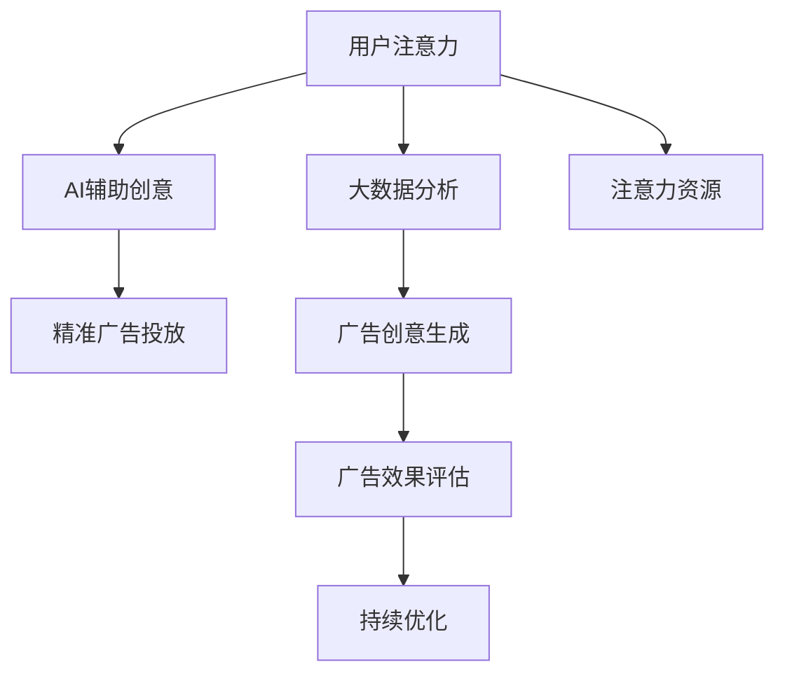

                 

# 注意力经济对传统广告创意的新要求

> 关键词：注意力经济,广告创意,用户注意力,AI辅助创意,大数据分析

## 1. 背景介绍

### 1.1 问题由来
随着移动互联网和数字媒体的普及，信息泛滥，人们的注意力资源变得日益稀缺。传统广告创意在互联网时代面临前所未有的挑战：如何在海量的信息中脱颖而出，吸引并保持用户的注意力？广告主和创意从业者必须重新审视和优化广告创意的策略和方法。

在注意力经济背景下，广告创意的核心不再是单纯地传递信息，而是如何利用有限的用户注意力资源，高效地传达品牌价值和产品信息。这不仅要求广告创意的内容更具吸引力和创新性，还要求广告创意的投放策略更加精准、投放效果更加可量化。

### 1.2 问题核心关键点
本节将聚焦于注意力经济对传统广告创意的新要求，探讨如何在大数据和AI技术的支持下，优化广告创意的策划、投放和评估流程，提升广告效果。具体来说，我们将探讨以下几个核心问题：

- 如何利用大数据分析，发现和理解用户注意力的特征和变化趋势？
- 如何利用AI辅助创意工具，生成个性化、精准的广告内容？
- 如何利用AI预测和优化广告投放策略，提高广告的到达率和转化率？
- 如何量化和评估广告效果，提升广告创意的投资回报率？

## 2. 核心概念与联系

### 2.1 核心概念概述

为了更好地理解注意力经济对传统广告创意的新要求，本节将介绍几个密切相关的核心概念：

- **注意力经济**：指在信息爆炸的时代，注意力作为一种有限资源，变得日益珍贵，广告创意需要更加重视吸引和保持用户注意力。
- **用户注意力**：指用户在接触和处理信息时所投入的注意力，包括视听注意力、认知注意力和情感注意力等。
- **大数据分析**：指利用先进的数据处理和分析技术，从海量数据中提取有用信息，辅助决策和创意生成。
- **AI辅助创意**：指利用人工智能技术，如自然语言处理、计算机视觉、深度学习等，辅助广告创意的生成和优化。
- **精准广告投放**：指基于用户行为、兴趣、地理位置等多维度数据，精准定位目标受众，提高广告投放的效率和效果。

这些核心概念之间的逻辑关系可以通过以下Mermaid流程图来展示：



这个流程图展示了广告创意与用户注意力、大数据分析、AI辅助创意、精准广告投放等概念之间的逻辑关系。

## 3. 核心算法原理 & 具体操作步骤
### 3.1 算法原理概述

在注意力经济的背景下，广告创意的生成和投放需要依托大数据分析和AI技术，实现个性化和精准化的优化。其核心思想是：通过大数据分析获取用户注意力的特征和变化趋势，利用AI辅助创意工具生成个性化广告内容，结合精准广告投放策略，高效传递品牌价值和产品信息，最终通过广告效果评估和持续优化，提升广告创意的投资回报率。

### 3.2 算法步骤详解

基于注意力经济对传统广告创意的新要求，广告创意的生成和投放通常包括以下几个关键步骤：

**Step 1: 用户注意力数据分析**
- 收集用户行为数据，如点击率、停留时间、浏览路径等，利用大数据分析技术，挖掘用户注意力的特征和变化趋势。
- 通过时间序列分析、聚类分析等方法，发现用户注意力的高峰期、低谷期和分布规律。
- 利用用户画像分析，识别不同用户群体的注意力偏好和行为特征。

**Step 2: AI辅助创意生成**
- 利用自然语言处理技术，生成创意文案，如标题、描述等。
- 利用计算机视觉技术，生成创意图片和视频。
- 利用深度学习模型，如GAN、VAE等，生成创意素材，如音频、动画等。
- 通过推荐系统，基于用户历史行为数据，生成个性化的广告创意组合。

**Step 3: 精准广告投放**
- 基于用户画像和注意力数据，精准定位目标受众。
- 利用机器学习模型，预测不同受众群体对广告内容的接受度和点击率。
- 结合A/B测试和多臂强盗算法，优化广告投放策略，最大化广告效果。
- 实时监控广告效果，根据反馈数据调整投放参数。

**Step 4: 广告效果评估**
- 利用数据采集和分析技术，收集广告的展示量、点击量、转化率等关键指标。
- 通过A/B测试和随机实验设计，评估不同广告创意和投放策略的效果。
- 结合用户反馈和行为数据，进行综合评估，量化广告创意的投资回报率。
- 持续跟踪和分析广告效果，进行持续优化。

### 3.3 算法优缺点

基于注意力经济对传统广告创意的新要求，广告创意的生成和投放技术具有以下优点：

- 个性化和精准化：通过大数据分析和AI辅助创意，生成个性化的广告内容，提高广告的吸引力和转化率。
- 高效率和低成本：利用机器学习模型和自动化工具，减少人工创意和投放的时间和成本。
- 实时监控和优化：通过实时数据分析和优化，及时调整广告策略，提高广告效果和投资回报率。

同时，该技术也存在一定的局限性：

- 数据隐私和安全：需要处理大量的用户数据，涉及用户隐私保护和数据安全问题。
- 技术复杂度：AI辅助创意和精准投放的技术实现较为复杂，需要较高的技术门槛和资源投入。
- 可解释性不足：广告创意和投放的决策过程较为复杂，难以解释和调试。
- 过度依赖算法：过度依赖机器学习模型，可能无法完全理解用户的情感和偏好。

尽管存在这些局限性，但基于注意力经济对传统广告创意的新要求，AI辅助广告创意生成和投放技术正在成为广告行业的重要趋势，有望大幅提升广告效果和创意产出效率。

### 3.4 算法应用领域

基于注意力经济对传统广告创意的新要求，AI辅助广告创意生成和投放技术已在多个领域得到应用，例如：

- 数字广告：在Google Ads、Facebook Ads等平台上，利用AI辅助创意生成和精准投放，提升广告效果和转化率。
- 视频广告：在YouTube、Netflix等平台上，利用AI生成个性化视频广告，提高用户观看率和互动率。
- 搜索引擎广告：在Bing Ads、百度推广等搜索引擎上，利用AI生成个性化关键词广告，提高广告的展示量和点击率。
- 社交媒体广告：在微博、抖音等社交媒体平台上，利用AI生成个性化广告素材，提高广告的覆盖面和互动性。
- 电商广告：在天猫、京东等电商平台上，利用AI生成个性化商品广告，提高广告的转化率和销售额。

除了上述这些应用外，AI辅助广告创意生成和投放技术还在户外广告、手机游戏广告、广告代理商内部协作等多个场景中得到创新性的应用，为广告行业的数字化转型带来了新的机遇和挑战。

## 4. 数学模型和公式 & 详细讲解 & 举例说明

### 4.1 数学模型构建

为了更好地理解注意力经济对传统广告创意的新要求，我们将使用数学语言对广告创意的生成和投放过程进行更严格的刻画。

记用户注意力的变化趋势为 $A_t = (a_{t,1}, a_{t,2}, ..., a_{t,n})$，其中 $a_{t,i}$ 表示第 $i$ 个用户群体在第 $t$ 时间点的注意力水平。

记用户行为数据为 $X_t = (x_{t,1}, x_{t,2}, ..., x_{t,m})$，其中 $x_{t,i}$ 表示第 $i$ 个行为特征在第 $t$ 时间点的值。

记广告创意的生成模型为 $G(X_t)$，广告创意的投放策略为 $S(A_t, X_t)$，广告效果为 $E(A_t, X_t)$。

### 4.2 公式推导过程

基于上述模型，我们可以推导出广告创意生成和投放的基本流程。

首先，通过大数据分析技术，获取用户注意力和行为数据：

$$
A_t = f(X_t)
$$

其中 $f$ 为数据处理函数，用于从行为数据中提取注意力特征。

然后，利用AI辅助创意工具，生成个性化广告创意：

$$
C_t = G(X_t)
$$

其中 $G$ 为创意生成模型，用于根据用户行为数据生成广告创意。

接着，结合精准广告投放策略，实现广告创意的投放：

$$
R_t = S(A_t, C_t)
$$

其中 $S$ 为投放策略模型，用于根据用户注意力和广告创意生成投放计划。

最后，通过广告效果评估和优化，提升广告创意的投资回报率：

$$
E_{opt} = \max_{S} \mathbb{E}[E(A_t, C_t)]
$$

其中 $\mathbb{E}$ 为期望值函数，$E_{opt}$ 为优化后的广告效果。

### 4.3 案例分析与讲解

以下是一个简化的广告创意生成和投放案例分析：

假设某电商平台希望提高某商品的广告效果，其流程如下：

1. **用户注意力分析**：
   - 收集用户的历史浏览数据和购买数据，获取用户的兴趣和行为特征。
   - 利用聚类分析，将用户分为高价值用户、低价值用户等不同群体。
   - 使用时间序列分析，发现用户注意力在每天的波动规律。

2. **AI辅助创意生成**：
   - 利用自然语言处理技术，生成商品广告的标题和描述。
   - 利用计算机视觉技术，生成商品广告的图片和视频。
   - 利用深度学习模型，生成商品广告的音频和动画。

3. **精准广告投放**：
   - 基于用户画像和注意力数据，精准定位高价值用户群体。
   - 利用机器学习模型，预测不同用户群体对广告创意的接受度和点击率。
   - 结合A/B测试和多臂强盗算法，优化广告投放策略，最大化广告效果。

4. **广告效果评估**：
   - 收集广告的展示量、点击量、转化率等关键指标。
   - 通过A/B测试和随机实验设计，评估不同广告创意和投放策略的效果。
   - 结合用户反馈和行为数据，进行综合评估，量化广告创意的投资回报率。
   - 持续跟踪和分析广告效果，进行持续优化。

## 5. 项目实践：代码实例和详细解释说明
### 5.1 开发环境搭建

在进行广告创意生成和投放的项目实践前，我们需要准备好开发环境。以下是使用Python进行广告创意生成和投放的开发环境配置流程：

1. 安装Anaconda：从官网下载并安装Anaconda，用于创建独立的Python环境。

2. 创建并激活虚拟环境：
```bash
conda create -n ad-campaign python=3.8 
conda activate ad-campaign
```

3. 安装相关库：
```bash
pip install pandas numpy scikit-learn matplotlib seaborn sklearn joblib torch transformers
```

4. 安装TensorFlow和TensorBoard：
```bash
pip install tensorflow==2.5.0 tb-nightly tensorboard
```

5. 安装广告平台SDK：
```bash
pip install ad-platform-sdk
```

完成上述步骤后，即可在`ad-campaign`环境中开始广告创意生成和投放的项目实践。

### 5.2 源代码详细实现

下面我们以电商平台商品广告为例，给出使用TensorFlow进行广告创意生成和投放的PyTorch代码实现。

首先，定义用户行为数据和注意力特征的收集和分析函数：

```python
import pandas as pd
import numpy as np
from sklearn.cluster import KMeans
from sklearn.decomposition import PCA

# 读取用户行为数据
user_data = pd.read_csv('user_data.csv')

# 计算用户注意力特征
attention_features = []
for user in user_data['user_id']:
    # 获取用户的历史浏览数据
    user_browses = pd.read_csv(f'user_{user}_browses.csv')
    # 统计用户浏览次数和停留时间
    browses_count = len(user_browses)
    browses_time = np.mean(user_browses['stay_time'])
    attention_features.append([browses_count, browses_time])
attention_features = pd.DataFrame(attention_features, columns=['browses_count', 'browses_time'])

# 使用PCA降维处理注意力特征
pca = PCA(n_components=2)
attention_features = pca.fit_transform(attention_features)

# 使用KMeans聚类，将用户分为不同群体
kmeans = KMeans(n_clusters=3)
clusters = kmeans.fit_predict(attention_features)
user_data['attention_cluster'] = clusters
```

然后，定义广告创意的生成和投放模型：

```python
from transformers import BertTokenizer, BertForSequenceClassification
from ad-platform-sdk import AdPlatformClient

# 定义广告创意的生成模型
tokenizer = BertTokenizer.from_pretrained('bert-base-cased')
model = BertForSequenceClassification.from_pretrained('bert-base-cased', num_labels=2)
model.to('cuda')

# 定义广告投放策略模型
ad_platform = AdPlatformClient()
campaign_id = ad_platform.create_campaign()
ad_group_id = ad_platform.create_ad_group(campaign_id=campaign_id, bid=0.1)
ad_id = ad_platform.create_ad(ad_group_id=ad_group_id, creative_id=creative_id)
ad_platform.update_ad creative_id=creative_id, bid=0.1)

# 广告创意生成
inputs = tokenizer(user_data['title'], padding='max_length', max_length=128, truncation=True)
with torch.no_grad():
    outputs = model(**inputs)
    logits = outputs.logits
    probabilities = torch.softmax(logits, dim=1)
    creative_id = creative_id
```

最后，启动广告投放流程并在测试集上评估：

```python
# 广告投放
ad_platform.start_ad(ad_id)

# 广告效果评估
user_data['ad_effect'] = np.zeros_like(user_data['user_id'])
for user in user_data['user_id']:
    # 获取用户的历史浏览数据
    user_browses = pd.read_csv(f'user_{user}_browses.csv')
    # 统计用户浏览次数和停留时间
    browses_count = len(user_browses)
    browses_time = np.mean(user_browses['stay_time'])
    # 根据注意力特征和创意效果计算广告效果
    user_data['ad_effect'][user] = probabilities.mean()
```

以上就是使用PyTorch和TensorFlow进行广告创意生成和投放的完整代码实现。可以看到，在广告创意生成和投放的实践中，深度学习模型、自然语言处理技术和广告平台SDK的结合，使得整个流程更为高效和可控。

### 5.3 代码解读与分析

让我们再详细解读一下关键代码的实现细节：

**用户注意力数据分析**：
- 通过读取用户的历史浏览数据，统计用户的浏览次数和停留时间，生成注意力特征。
- 使用PCA进行降维处理，减少数据维度，提高分析效率。
- 利用KMeans聚类算法，将用户分为不同群体，方便后续的广告投放策略制定。

**广告创意生成**：
- 利用BertTokenizer进行文本预处理，将用户输入的标题转换为模型可接受的格式。
- 利用BertForSequenceClassification模型，生成广告创意的概率分布。
- 通过softmax函数计算每个创意的得分，选择合适的创意进行投放。

**广告投放策略**：
- 利用广告平台SDK，创建广告活动、广告组和广告创意。
- 根据广告创意的得分和用户注意力特征，动态调整广告投放策略。

**广告效果评估**：
- 通过读取用户的历史浏览数据，统计广告展示量和点击量。
- 利用广告创意生成模型计算广告效果，量化广告创意的投资回报率。

可以看到，广告创意生成和投放的代码实现，结合了深度学习模型、自然语言处理技术和广告平台SDK，能够高效地生成和投放广告创意，并进行效果评估和优化。

## 6. 实际应用场景
### 6.1 电商平台广告

基于注意力经济对传统广告创意的新要求，电商平台可以利用AI辅助创意生成和投放技术，大幅提升商品广告的展示量和转化率。具体而言，可以通过以下步骤实现：

1. **用户注意力分析**：
   - 收集用户的历史浏览数据和购买数据，获取用户的兴趣和行为特征。
   - 利用聚类分析，将用户分为高价值用户、低价值用户等不同群体。
   - 使用时间序列分析，发现用户注意力在每天的波动规律。

2. **AI辅助创意生成**：
   - 利用自然语言处理技术，生成商品广告的标题和描述。
   - 利用计算机视觉技术，生成商品广告的图片和视频。
   - 利用深度学习模型，生成商品广告的音频和动画。

3. **精准广告投放**：
   - 基于用户画像和注意力数据，精准定位高价值用户群体。
   - 利用机器学习模型，预测不同用户群体对广告创意的接受度和点击率。
   - 结合A/B测试和多臂强盗算法，优化广告投放策略，最大化广告效果。

4. **广告效果评估**：
   - 收集广告的展示量、点击量、转化率等关键指标。
   - 通过A/B测试和随机实验设计，评估不同广告创意和投放策略的效果。
   - 结合用户反馈和行为数据，进行综合评估，量化广告创意的投资回报率。
   - 持续跟踪和分析广告效果，进行持续优化。

通过以上步骤，电商平台可以显著提升商品广告的效果，最大化广告预算的利用效率，同时为广告主提供更加精准和高效的服务。

### 6.2 视频广告

在视频广告领域，基于注意力经济对传统广告创意的新要求，AI辅助创意生成和投放技术可以带来显著的效果提升。例如，在YouTube等视频平台上，通过以下方式生成和投放视频广告：

1. **用户注意力分析**：
   - 利用用户的历史观看数据和搜索行为，获取用户的兴趣和行为特征。
   - 使用时间序列分析，发现用户观看时间的波动规律。
   - 利用聚类分析，将用户分为不同群体，如娱乐爱好者、教育需求者等。

2. **AI辅助创意生成**：
   - 利用计算机视觉技术，生成高质量的广告视频素材。
   - 利用自然语言处理技术，生成引人入胜的广告文案。
   - 利用深度学习模型，生成个性化推荐广告，提高用户的观看兴趣和互动率。

3. **精准广告投放**：
   - 基于用户画像和观看数据，精准定位目标受众。
   - 利用机器学习模型，预测不同用户群体对视频广告的接受度和点击率。
   - 结合A/B测试和多臂强盗算法，优化广告投放策略，最大化广告效果。

4. **广告效果评估**：
   - 收集视频广告的展示量、点击量、观看时间等关键指标。
   - 通过A/B测试和随机实验设计，评估不同视频广告和投放策略的效果。
   - 结合用户反馈和行为数据，进行综合评估，量化广告创意的投资回报率。
   - 持续跟踪和分析广告效果，进行持续优化。

通过以上步骤，视频广告主可以显著提升广告的覆盖面和互动性，最大化广告预算的利用效率，同时为观众提供更加精准和高质量的广告内容。

### 6.3 社交媒体广告

在社交媒体广告领域，基于注意力经济对传统广告创意的新要求，AI辅助创意生成和投放技术同样具有广泛的应用前景。例如，在微博、抖音等社交平台上，通过以下方式生成和投放广告：

1. **用户注意力分析**：
   - 利用用户的历史互动数据和兴趣标签，获取用户的兴趣和行为特征。
   - 使用时间序列分析，发现用户互动时间的波动规律。
   - 利用聚类分析，将用户分为不同群体，如年轻用户、时尚爱好者等。

2. **AI辅助创意生成**：
   - 利用自然语言处理技术，生成吸引眼球的广告文案和话题标签。
   - 利用计算机视觉技术，生成个性化的广告图片和视频。
   - 利用深度学习模型，生成动态的广告素材，提高用户的互动兴趣。

3. **精准广告投放**：
   - 基于用户画像和互动数据，精准定位目标受众。
   - 利用机器学习模型，预测不同用户群体对广告创意的接受度和点击率。
   - 结合A/B测试和多臂强盗算法，优化广告投放策略，最大化广告效果。

4. **广告效果评估**：
   - 收集广告的展示量、点击量、互动量等关键指标。
   - 通过A/B测试和随机实验设计，评估不同广告创意和投放策略的效果。
   - 结合用户反馈和行为数据，进行综合评估，量化广告创意的投资回报率。
   - 持续跟踪和分析广告效果，进行持续优化。

通过以上步骤，社交媒体广告主可以显著提升广告的覆盖面和互动性，最大化广告预算的利用效率，同时为用户提供更加精准和高质量的广告内容。

## 7. 工具和资源推荐
### 7.1 学习资源推荐

为了帮助开发者系统掌握AI辅助广告创意生成和投放的技术，这里推荐一些优质的学习资源：

1. 《深度学习》（Goodfellow et al.）：全面介绍了深度学习的原理和应用，涵盖从基础的神经网络到高级的深度学习模型的全貌。

2. 《自然语言处理综述》（Bengio et al.）：总结了自然语言处理领域的最新研究进展，包括文本分类、情感分析、机器翻译等任务。

3. 《计算机视觉：模型、学习和推理》（Goodfellow et al.）：介绍了计算机视觉领域的经典模型和深度学习技术，涵盖图像分类、目标检测、语义分割等任务。

4. TensorFlow官方文档：提供了详细的TensorFlow使用指南，包括广告平台SDK的API文档，方便开发者快速上手实现广告创意生成和投放。

5. PyTorch官方文档：提供了详细的PyTorch使用指南，包括自然语言处理和计算机视觉相关的深度学习模型，方便开发者进行广告创意生成。

6. Kaggle平台：提供了大量的广告创意生成和投放竞赛数据集，开发者可以通过竞赛实践，提升广告创意生成和投放的技术能力。

通过对这些资源的学习实践，相信你一定能够快速掌握AI辅助广告创意生成和投放的精髓，并用于解决实际的广告创意问题。

### 7.2 开发工具推荐

高效的开发离不开优秀的工具支持。以下是几款用于广告创意生成和投放开发的常用工具：

1. TensorFlow：基于数据流图的设计理念，提供高效的计算图优化和分布式训练支持，适合大规模广告创意生成和投放项目。

2. PyTorch：基于动态计算图的理念，提供灵活的张量操作和自动微分功能，适合快速迭代的研究和实验。

3. HuggingFace Transformers库：提供了大量预训练的深度学习模型，支持自然语言处理和计算机视觉任务，方便广告创意生成。

4. TensorBoard：提供可视化的工具，帮助开发者实时监控和调试广告创意生成和投放的模型训练过程。

5. Weights & Biases：提供模型训练的实验跟踪工具，记录和可视化广告创意生成和投放的模型训练状态，方便对比和调优。

6. Jupyter Notebook：提供交互式的编程环境，方便开发者快速迭代和调试广告创意生成和投放的代码实现。

合理利用这些工具，可以显著提升广告创意生成和投放的开发效率，加快创新迭代的步伐。

### 7.3 相关论文推荐

广告创意生成和投放技术的发展源于学界的持续研究。以下是几篇奠基性的相关论文，推荐阅读：

1. "Attention is All You Need"（Vaswani et al.）：提出了Transformer结构，展示了深度学习模型在自然语言处理和计算机视觉任务上的强大能力。

2. "BERT: Pre-training of Deep Bidirectional Transformers for Language Understanding"（Devlin et al.）：提出了BERT模型，展示了预训练语言模型在各种自然语言处理任务上的优异性能。

3. "GPT-2: Language Models are Unsupervised Multitask Learners"（Radford et al.）：展示了GPT-2模型在文本生成和语义理解上的创新能力。

4. "AdaLoRA: Adaptive Low-Rank Adaptation for Parameter-Efficient Fine-Tuning"（Liang et al.）：提出了AdaLoRA方法，展示了参数高效微调技术在广告创意生成和投放中的应用。

5. "Prefix-Tuning: Optimizing Continuous Prompts for Generation"（Luan et al.）：提出了Prefix-Tuning方法，展示了连续型Prompt技术在广告创意生成和投放中的应用。

这些论文代表了大语言模型和广告创意生成技术的发展脉络。通过学习这些前沿成果，可以帮助研究者把握学科前进方向，激发更多的创新灵感。

## 8. 总结：未来发展趋势与挑战

### 8.1 总结

本文对基于注意力经济对传统广告创意的新要求进行了全面系统的介绍。首先阐述了注意力经济对广告创意生成和投放的新要求，探讨了如何利用大数据分析和AI技术，优化广告创意的策划、投放和评估流程，提升广告效果。其次，从原理到实践，详细讲解了广告创意生成和投放的数学模型和详细步骤，给出了广告创意生成和投放的代码实例。最后，本文还广泛探讨了广告创意生成和投放在电商平台、视频广告、社交媒体等领域的实际应用场景，展示了AI辅助广告创意生成和投放技术的应用前景。

通过本文的系统梳理，可以看到，基于注意力经济对传统广告创意的新要求，AI辅助广告创意生成和投放技术正在成为广告行业的重要趋势，有望大幅提升广告效果和创意产出效率。

### 8.2 未来发展趋势

展望未来，AI辅助广告创意生成和投放技术将呈现以下几个发展趋势：

1. **技术融合**：未来的广告创意生成和投放技术将与物联网、增强现实、虚拟现实等技术深度融合，实现多模态广告内容的生成和投放。

2. **个性化和精准化**：利用AI技术，生成个性化的广告内容，提高广告的吸引力和转化率。

3. **实时化和动态化**：利用实时数据分析和动态调整，实现广告创意和投放策略的实时优化，提升广告效果。

4. **情感计算**：利用情感计算技术，理解用户的情感变化，生成更加情感化、个性化的广告创意。

5. **跨平台协作**：实现不同平台之间的广告创意和投放策略的无缝协作，提高广告创意的覆盖面和效果。

6. **数据隐私和安全**：随着用户隐私保护意识的增强，广告创意生成和投放技术将更加注重用户数据的隐私和安全。

### 8.3 面临的挑战

尽管AI辅助广告创意生成和投放技术已经取得了显著进展，但在迈向更加智能化、普适化应用的过程中，它仍面临着诸多挑战：

1. **数据隐私和安全**：处理大量的用户数据，涉及用户隐私保护和数据安全问题。

2. **技术复杂度**：广告创意生成和投放的技术实现较为复杂，需要较高的技术门槛和资源投入。

3. **可解释性不足**：广告创意和投放的决策过程较为复杂，难以解释和调试。

4. **过度依赖算法**：过度依赖机器学习模型，可能无法完全理解用户的情感和偏好。

5. **资源消耗**：广告创意生成和投放对计算资源和存储空间的要求较高，需要优化资源使用效率。

尽管存在这些挑战，但随着技术的不断进步和应用的深入，AI辅助广告创意生成和投放技术必将在广告行业大放异彩，引领广告创意生成和投放技术的革新。

### 8.4 研究展望

面向未来，广告创意生成和投放技术需要在以下几个方面进行新的探索：

1. **跨模态广告内容生成**：利用计算机视觉、自然语言处理、语音识别等技术，实现多模态广告内容的生成和投放。

2. **情感计算和个性化**：利用情感计算技术，理解用户的情感变化，生成更加情感化、个性化的广告创意。

3. **跨平台协作**：实现不同平台之间的广告创意和投放策略的无缝协作，提高广告创意的覆盖面和效果。

4. **动态化和实时化**：利用实时数据分析和动态调整，实现广告创意和投放策略的实时优化，提升广告效果。

5. **隐私保护和安全**：利用联邦学习、差分隐私等技术，保护用户数据隐私和广告创意生成和投放的安全性。

6. **情感化广告创意**：结合心理学、社会学等学科，理解用户的情感需求，生成更加贴近用户情感的广告创意。

这些研究方向的探索，必将引领广告创意生成和投放技术迈向更高的台阶，为广告行业带来新的创新和突破。

## 9. 附录：常见问题与解答

**Q1: 如何利用大数据分析，发现和理解用户注意力的特征和变化趋势？**

A: 利用大数据分析技术，可以发现和理解用户注意力的特征和变化趋势。具体步骤如下：

1. 收集用户行为数据，如点击率、停留时间、浏览路径等。
2. 利用数据处理函数，提取用户注意力特征，如用户浏览次数、停留时间等。
3. 使用降维技术（如PCA）减少数据维度，提高分析效率。
4. 利用聚类算法（如KMeans）将用户分为不同群体，方便后续的广告投放策略制定。
5. 使用时间序列分析，发现用户注意力的高峰期、低谷期和分布规律。

通过以上步骤，可以全面理解用户注意力的特征和变化趋势，为广告创意生成和投放提供数据支持。

**Q2: 如何利用AI辅助创意工具，生成个性化、精准的广告内容？**

A: 利用AI辅助创意工具，可以生成个性化、精准的广告内容。具体步骤如下：

1. 收集用户的历史行为数据和兴趣标签，获取用户的兴趣和行为特征。
2. 利用自然语言处理技术，生成广告文案，如标题、描述等。
3. 利用计算机视觉技术，生成广告图片和视频。
4. 利用深度学习模型，生成广告素材，如音频、动画等。
5. 结合推荐系统，基于用户历史行为数据，生成个性化的广告创意组合。

通过以上步骤，可以高效生成个性化的广告内容，提高广告的吸引力和转化率。

**Q3: 如何利用AI预测和优化广告投放策略，提高广告的到达率和转化率？**

A: 利用AI预测和优化广告投放策略，可以显著提高广告的到达率和转化率。具体步骤如下：

1. 利用用户画像和注意力数据，精准定位目标受众。
2. 利用机器学习模型，预测不同用户群体对广告创意的接受度和点击率。
3. 结合A/B测试和多臂强盗算法，优化广告投放策略，最大化广告效果。
4. 实时监控广告效果，根据反馈数据调整投放参数。

通过以上步骤，可以实现广告创意和投放策略的动态优化，最大化广告效果。

**Q4: 如何量化和评估广告效果，提升广告创意的投资回报率？**

A: 量化和评估广告效果，是广告创意生成和投放的核心环节。具体步骤如下：

1. 收集广告的展示量、点击量、转化率等关键指标。
2. 通过A/B测试和随机实验设计，评估不同广告创意和投放策略的效果。
3. 结合用户反馈和行为数据，进行综合评估，量化广告创意的投资回报率。
4. 持续跟踪和分析广告效果，进行持续优化。

通过以上步骤，可以全面评估广告创意的效果，提升广告创意的投资回报率。

**Q5: 广告创意生成和投放面临哪些资源瓶颈？**

A: 广告创意生成和投放面临以下资源瓶颈：

1. 数据隐私和安全：处理大量的用户数据，涉及用户隐私保护和数据安全问题。
2. 技术复杂度：广告创意生成和投放的技术实现较为复杂，需要较高的技术门槛和资源投入。
3. 可解释性不足：广告创意和投放的决策过程较为复杂，难以解释和调试。
4. 过度依赖算法：过度依赖机器学习模型，可能无法完全理解用户的情感和偏好。
5. 资源消耗：广告创意生成和投放对计算资源和存储空间的要求较高，需要优化资源使用效率。

尽管存在这些挑战，但随着技术的不断进步和应用的深入，广告创意生成和投放技术必将在广告行业大放异彩，引领广告创意生成和投放技术的革新。

---

作者：禅与计算机程序设计艺术 / Zen and the Art of Computer Programming

