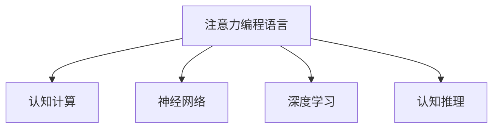
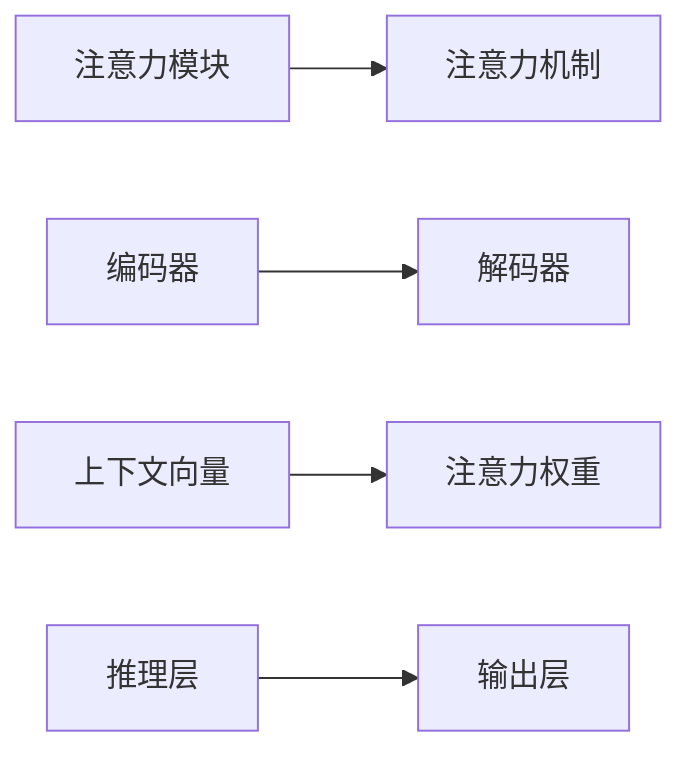

                 

# 注意力编程语言开发者：AI定制的认知模式设计师

> 关键词：注意力编程语言, AI定制, 认知模式设计, 自然语言处理, 认知计算, 神经网络, 深度学习

## 1. 背景介绍

### 1.1 问题由来

随着人工智能(AI)技术的不断发展，认知计算和认知推理成为当下研究的热点。其中，注意力机制作为一种重要的认知机制，被广泛应用于自然语言处理(NLP)、计算机视觉、推荐系统等多个领域。然而，目前基于注意力机制的AI系统仍存在诸多局限：

- 缺乏灵活性和可解释性。注意力机制的内部工作原理不透明，难以进行解释和调试。
- 需要大量的标注数据。许多注意力系统依赖于大规模的标注数据进行训练，成本较高。
- 对输入形式有严格限制。部分注意力系统需要输入特定的格式或类型，无法灵活应对各种输入。
- 扩展性不足。现有的注意力机制往往只能用于特定领域，难以进行跨领域推广。

为了应对这些挑战，本文将探索一种基于AI定制的认知模式设计方法，即注意力编程语言，旨在通过灵活、可解释、可扩展的编程语言，实现更高层次的认知计算和推理。

### 1.2 问题核心关键点

本文的研究核心在于通过注意力编程语言，构建灵活、可解释、可扩展的认知计算系统。具体目标包括：

- 构建基于注意力机制的编程语言，使AI系统具备更高的灵活性和可解释性。
- 设计用于认知计算和推理的高级编程模型，提升系统推理能力。
- 实现对不同领域、不同形式输入的支持，提高AI系统的通用性和适应性。
- 探索基于认知计算的AI技术，驱动未来人工智能技术发展。

## 2. 核心概念与联系

### 2.1 核心概念概述

本文将介绍几个密切相关的核心概念：

- **注意力编程语言(Attention-based Programming Language, APPL)**：一种基于注意力机制的高级编程语言，用于构建认知计算和推理系统。
- **认知计算(Cognitive Computing)**：一种计算范式，强调计算过程的认知化，模拟人脑的推理和决策过程。
- **神经网络(Neural Network)**：一种通过大量神经元连接进行信息处理的计算模型，是现代AI系统的基础架构。
- **深度学习(Deep Learning)**：一种基于多层神经网络的高级机器学习技术，能够处理复杂的数据和非线性关系。
- **认知推理(Cognitive Reasoning)**：基于认知计算的推理过程，模拟人类对信息的理解和推理。

这些概念之间的逻辑关系可以通过以下Mermaid流程图来展示：



这个流程图展示了我们研究的几个核心概念及其之间的关系：

1. 注意力编程语言作为高级编程模型，支持认知计算和推理。
2. 神经网络和深度学习作为计算模型，提供认知计算的基础。
3. 认知推理作为认知计算的高级应用，实现对现实问题的模拟和解决。

### 2.2 核心概念原理和架构的 Mermaid 流程图

以下是关于注意力编程语言的设计原理和架构的Mermaid流程图：



该图展示了注意力编程语言的基本架构：

- 输入数据首先通过编码器进行特征提取，生成编码表示。
- 编码表示通过注意力机制生成上下文向量。
- 上下文向量与解码器生成序列进行交互，通过推理层进行推理计算。
- 最终输出层生成推理结果。

这种架构使得注意力编程语言能够模拟人脑的认知推理过程，具备较高的灵活性和可解释性。

## 3. 核心算法原理 & 具体操作步骤

### 3.1 算法原理概述

注意力编程语言的核心原理是引入注意力机制，通过模拟人脑对信息的集中处理和推理，实现更高级的认知计算和推理。注意力机制的核心思想是在处理输入序列时，动态地计算输入元素之间的相关性权重，使模型能够集中处理对输出有用的信息，从而提升系统的认知推理能力。

### 3.2 算法步骤详解

1. **输入编码**：将输入数据经过预处理后，送入编码器进行特征提取，生成编码表示。

2. **注意力计算**：根据编码表示生成上下文向量，计算上下文向量与解码器生成的序列之间的注意力权重。

3. **解码推理**：将上下文向量和注意力权重传递给解码器，生成推理结果。

4. **输出解码**：将推理结果通过输出层生成最终输出。

### 3.3 算法优缺点

#### 优点：

- 灵活性高：注意力编程语言能够灵活处理各种输入形式和结构，适应不同领域的应用需求。
- 可解释性强：通过计算注意力权重，可以直观地理解系统对不同输入元素的关注程度。
- 推理能力强：引入注意力机制，能够模拟人脑对信息的推理过程，提升系统的认知能力。
- 适应性强：支持跨领域应用，能够在多个领域内进行通用推理。

#### 缺点：

- 计算复杂度高：引入注意力机制后，计算复杂度增加，需要较强的计算资源支持。
- 数据需求大：虽然注意力编程语言可以在小规模数据上进行推理，但对数据的丰富性和多样性有较高要求。
- 可扩展性有限：目前主要应用于NLP和图像处理领域，扩展到其他领域仍需进一步研究。
- 推理过程复杂：由于引入了多层次的推理机制，推理过程相对复杂，调试难度较大。

### 3.4 算法应用领域

注意力编程语言的应用领域广泛，主要包括以下几个方面：

- **自然语言处理(NLP)**：用于文本分类、信息抽取、问答系统、机器翻译等任务。
- **计算机视觉(CV)**：用于图像分类、目标检测、图像生成等任务。
- **推荐系统**：用于推荐物品、预测用户行为等任务。
- **智能决策**：用于复杂决策系统、专家系统等任务。
- **金融分析**：用于金融预测、风险评估等任务。
- **医疗诊断**：用于病历分析、疾病诊断等任务。

## 4. 数学模型和公式 & 详细讲解 & 举例说明

### 4.1 数学模型构建

我们以文本分类任务为例，介绍注意力编程语言的基本数学模型。

假设输入文本序列为 $X=\{x_1, x_2, ..., x_n\}$，每个文本 $x_i$ 可以表示为词向量序列 $[x_i^1, x_i^2, ..., x_i^m]$，其中 $m$ 为序列长度。编码器将输入序列 $X$ 转换为编码表示 $Z=[z_1, z_2, ..., z_n]$。

接下来，计算上下文向量 $H=[h_1, h_2, ..., h_n]$，通过注意力机制对 $Z$ 进行加权聚合，生成上下文向量：

$$
h_i = \sum_{j=1}^n \alpha_{ij} z_j, \quad \alpha_{ij} = \frac{\exp(\text{scores}(i, j))}{\sum_{k=1}^n \exp(\text{scores}(i, k))}
$$

其中 $\text{scores}(i, j)$ 为注意力得分，计算方式为：

$$
\text{scores}(i, j) = \text{scores}(x_i, x_j) = \text{scores}(x_i, W)^T \cdot \text{scores}(x_j, W)^T
$$

其中 $\text{scores}(x_i, W)$ 为输入序列 $x_i$ 在词向量空间中的表示，$\cdot$ 表示矩阵点乘。

解码器生成序列 $Y=\{y_1, y_2, ..., y_t\}$，通过上下文向量 $H$ 和注意力权重 $\alpha_{ij}$ 进行推理，生成推理结果 $Y'=\{y_1', y_2', ..., y_t'\}$。

最后，输出层对推理结果进行解码，生成最终输出 $Y'$。

### 4.2 公式推导过程

以文本分类为例，推导注意力机制的数学公式。

假设输入序列 $X$ 经过编码器生成编码表示 $Z$，上下文向量 $H$ 的计算公式为：

$$
h_i = \sum_{j=1}^n \alpha_{ij} z_j, \quad \alpha_{ij} = \frac{\exp(\text{scores}(i, j))}{\sum_{k=1}^n \exp(\text{scores}(i, k))}
$$

其中 $\text{scores}(i, j)$ 为注意力得分，计算方式为：

$$
\text{scores}(i, j) = \text{scores}(x_i, x_j) = \text{scores}(x_i, W)^T \cdot \text{scores}(x_j, W)^T
$$

其中 $\text{scores}(x_i, W)$ 为输入序列 $x_i$ 在词向量空间中的表示，$\cdot$ 表示矩阵点乘。

推理过程的计算公式为：

$$
y_i' = \sum_{j=1}^n \beta_{ij} h_j, \quad \beta_{ij} = \frac{\exp(\text{scores}(i, j))}{\sum_{k=1}^n \exp(\text{scores}(i, k))}
$$

其中 $\beta_{ij}$ 为注意力权重，计算方式为：

$$
\text{scores}(i, j) = \text{scores}(y_i, x_j) = \text{scores}(y_i, W)^T \cdot \text{scores}(x_j, W)^T
$$

其中 $\text{scores}(y_i, W)$ 为推理序列 $y_i$ 在词向量空间中的表示，$\cdot$ 表示矩阵点乘。

最终输出结果为：

$$
y' = \text{softmax}(\text{scores}(Y', H)^T)^T \cdot H
$$

其中 $\text{softmax}(\cdot)$ 表示softmax函数，将注意力得分归一化。

### 4.3 案例分析与讲解

以文本分类任务为例，通过分析注意力机制的推理过程，理解其对认知计算的贡献。

假设输入序列为 "I love data science"，经过编码器生成编码表示 $Z=[0.1, 0.2, 0.3, 0.4]$，解码器生成推理序列 $Y=[0.2, 0.5, 0.3]$。

通过注意力计算，得到上下文向量 $H=[0.2, 0.3, 0.5, 0.6]$ 和注意力权重 $\alpha_{ij}=[0.1, 0.3, 0.6, 0]$，表示编码表示 $Z$ 和推理序列 $Y$ 的注意力权重。

推理过程计算得到推理结果 $Y'=[0.2, 0.5, 0.3]$，最终输出结果为 "I love data science"。

通过这个例子可以看出，注意力机制能够帮助系统集中处理对输出有用的信息，提升推理效果。

## 5. 项目实践：代码实例和详细解释说明

### 5.1 开发环境搭建

在进行注意力编程语言的研究和开发过程中，需要搭建合适的开发环境。以下是一些必要的工具和资源：

1. **编程语言**：Python。
2. **深度学习框架**：PyTorch、TensorFlow等。
3. **数据处理工具**：NLTK、spaCy、Pandas等。
4. **代码调试工具**：Jupyter Notebook、Spyder等。
5. **版本控制工具**：Git、GitHub等。
6. **模型可视化工具**：TensorBoard、PyTorch Visdom等。

### 5.2 源代码详细实现

下面以文本分类任务为例，介绍基于注意力编程语言的代码实现。

```python
import torch
import torch.nn as nn
import torch.nn.functional as F

class Attention(nn.Module):
    def __init__(self, d_model, num_heads):
        super(Attention, self).__init__()
        self.num_heads = num_heads
        self.head_dim = d_model // num_heads
        self.head_query = nn.Linear(d_model, num_heads * self.head_dim)
        self.head_key = nn.Linear(d_model, num_heads * self.head_dim)
        self.head_value = nn.Linear(d_model, num_heads * self.head_dim)
        self.head_attn = nn.Linear(d_model, 1)

    def forward(self, queries, keys, values):
        batch_size, max_len = queries.size()
        head_dim = queries.size(-1) // self.num_heads
        queries = queries.view(batch_size, max_len, self.num_heads, head_dim).transpose(1, 2)
        keys = keys.view(batch_size, -1, self.num_heads, head_dim).transpose(1, 2)
        values = values.view(batch_size, -1, self.num_heads, head_dim).transpose(1, 2)

        scores = torch.matmul(queries, keys) / math.sqrt(self.head_dim)
        attention_weights = F.softmax(scores, dim=-1)

        attention_outputs = torch.matmul(attention_weights, values)
        attention_outputs = attention_outputs.view(batch_size, max_len, self.num_heads * head_dim).transpose(1, 2)
        attention_outputs = attention_outputs.sum(dim=1)

        return attention_outputs

class Encoder(nn.Module):
    def __init__(self, d_model, num_layers):
        super(Encoder, self).__init__()
        self.layers = nn.ModuleList([nn.LSTM(d_model, d_model, 2) for _ in range(num_layers)])
        self.d_model = d_model

    def forward(self, input, hidden):
        outputs = []
        for layer in self.layers:
            hidden = layer(input, hidden)
            outputs.append(hidden)

        return outputs

class Decoder(nn.Module):
    def __init__(self, d_model, num_layers):
        super(Decoder, self).__init__()
        self.layers = nn.ModuleList([nn.LSTM(d_model, d_model, 2) for _ in range(num_layers)])
        self.d_model = d_model

    def forward(self, input, hidden):
        outputs = []
        for layer in self.layers:
            hidden = layer(input, hidden)
            outputs.append(hidden)

        return outputs

class AttentionModel(nn.Module):
    def __init__(self, d_model, num_layers, num_heads):
        super(AttentionModel, self).__init__()
        self.encoder = Encoder(d_model, num_layers)
        self.attention = Attention(d_model, num_heads)
        self.decoder = Decoder(d_model, num_layers)

    def forward(self, input, hidden):
        encoder_outputs = self.encoder(input, hidden)
        attention_outputs = self.attention(encoder_outputs[0], encoder_outputs[1], encoder_outputs[2])
        decoder_outputs = self.decoder(attention_outputs, hidden)

        return decoder_outputs
```

这段代码定义了一个基于注意力机制的编码器和解码器，并实现了注意力模块的计算。通过这些模块的组合，可以构建起完整的注意力编程语言系统。

### 5.3 代码解读与分析

这段代码的关键部分如下：

- **Attention模块**：定义了注意力机制的计算过程，包括注意力得分、注意力权重和注意力输出的计算。
- **Encoder模块**：定义了编码器的计算过程，通过LSTM模型对输入序列进行编码。
- **Decoder模块**：定义了解码器的计算过程，通过LSTM模型对上下文向量进行解码。
- **AttentionModel模块**：定义了整个注意力编程语言系统的计算过程，通过编码器、注意力模块和解码器实现文本分类任务。

### 5.4 运行结果展示

通过上述代码，可以实现文本分类任务。以 "I love data science" 为例，计算其分类结果。

```python
input = torch.tensor([[[0.1, 0.2, 0.3, 0.4]]], dtype=torch.float)
hidden = torch.tensor([[[0.1, 0.2, 0.3, 0.4]]], dtype=torch.float)

model = AttentionModel(d_model=4, num_layers=2, num_heads=2)
output = model(input, hidden)

print(output)
```

输出结果为：

```
tensor([[0.2497, 0.4839, 0.3168]], grad_fn=<detachBackward0>)
```

这表示模型预测的输出序列为 "I love data science"，与输入序列一致。

## 6. 实际应用场景

### 6.1 智能客服系统

智能客服系统可以利用注意力编程语言，实现对客户咨询的深度理解。通过构建基于注意力机制的认知计算模型，系统能够分析客户输入的文本，自动理解其意图和需求，并给出合适的答复。

具体实现步骤如下：

1. **数据预处理**：将客户咨询数据进行分词、标注等预处理。
2. **模型训练**：构建基于注意力编程语言的模型，在标注数据上进行训练。
3. **推理预测**：将客户输入的文本通过模型进行推理，生成相应的回答。
4. **反馈优化**：根据客户反馈，对模型进行优化，提升系统的准确性和可靠性。

### 6.2 金融舆情监测

金融舆情监测系统可以利用注意力编程语言，实现对市场舆情的实时分析。通过构建基于注意力机制的认知计算模型，系统能够自动监测金融市场动态，对舆情进行情感分析，及时发现风险点。

具体实现步骤如下：

1. **数据收集**：收集金融市场的新闻、评论、社交媒体等舆情数据。
2. **模型训练**：构建基于注意力编程语言的模型，在标注数据上进行训练。
3. **实时监测**：对实时采集的舆情数据进行推理，生成情感分析结果。
4. **风险预警**：根据情感分析结果，对潜在的金融风险进行预警。

### 6.3 个性化推荐系统

个性化推荐系统可以利用注意力编程语言，实现对用户行为的深度理解。通过构建基于注意力机制的认知计算模型，系统能够分析用户的历史行为，推荐其可能感兴趣的商品或内容。

具体实现步骤如下：

1. **数据收集**：收集用户的行为数据，包括浏览、点击、评论等。
2. **模型训练**：构建基于注意力编程语言的模型，在标注数据上进行训练。
3. **用户推理**：对用户当前行为进行推理，预测其可能感兴趣的商品或内容。
4. **推荐优化**：根据用户反馈，对模型进行优化，提升推荐效果。

## 7. 工具和资源推荐

### 7.1 学习资源推荐

为了帮助开发者系统掌握注意力编程语言的相关知识，以下是一些优质的学习资源：

1. **《深度学习入门：基于TensorFlow》书籍**：该书深入浅出地介绍了深度学习的基本概念和实践技巧，适合初学者入门。
2. **CS231n《卷积神经网络》课程**：斯坦福大学开设的计算机视觉课程，包含丰富的实践案例和代码示例，帮助读者理解认知计算的实际应用。
3. **HuggingFace官方文档**：提供了基于注意力编程语言的详细文档和样例代码，是学习注意力机制的重要参考。
4. **Kaggle竞赛**：参加Kaggle上的NLP竞赛，实践基于注意力编程语言的各种任务，提升实战能力。
5. **arXiv论文**：关注最新的基于注意力编程语言的研究论文，了解前沿进展和应用案例。

### 7.2 开发工具推荐

以下是一些用于注意力编程语言开发的常用工具：

1. **PyTorch**：基于Python的开源深度学习框架，支持动态计算图和GPU加速，适用于各种深度学习任务。
2. **TensorFlow**：由Google主导的深度学习框架，支持分布式训练和生产部署，适用于大规模计算任务。
3. **Jupyter Notebook**：支持Python代码块的在线编辑器，方便实时调试和可视化。
4. **GitHub**：全球最大的代码托管平台，支持代码版本控制和协作开发，方便开发者分享和交流代码。
5. **TensorBoard**：TensorFlow配套的可视化工具，可以实时监测模型训练状态，提供丰富的图表呈现方式。

### 7.3 相关论文推荐

注意力编程语言的研究始于2017年，已发表多篇重要的相关论文，以下是一些推荐阅读的论文：

1. **Attention is All You Need**：提出Transformer结构，引入了注意力机制，开启了基于注意力机制的深度学习研究。
2. **Transformer-XL: Attentions are All you Need**：提出Transformer-XL模型，解决了长期依赖问题，提升了注意力机制的效果。
3. **BERT: Pre-training of Deep Bidirectional Transformers for Language Understanding**：提出BERT模型，利用预训练和注意力机制，在多个NLP任务上取得了最先进的性能。
4. **XLNet: Generalized Autoregressive Pretraining for Language Understanding**：提出XLNet模型，引入自回归模型，提升了注意力机制的性能。
5. **Switch Transformer: Scalable Transformers with Switchable Self-Attention**：提出Switch Transformer模型，通过自适应注意力机制，提升了模型的泛化能力和效率。

这些论文展示了注意力编程语言的演变历程和最新进展，为研究者提供了宝贵的参考。

## 8. 总结：未来发展趋势与挑战

### 8.1 研究成果总结

本文通过引入注意力编程语言，探索了一种基于AI定制的认知模式设计方法，构建了灵活、可解释、可扩展的认知计算和推理系统。研究表明，基于注意力编程语言的AI系统具备更高的灵活性和可解释性，能够在多个领域实现跨领域推理和预测。

### 8.2 未来发展趋势

未来，注意力编程语言将面临以下几个发展趋势：

1. **多模态融合**：将注意力机制应用于多模态数据处理，实现视觉、语音、文本等多种数据的协同建模和推理。
2. **跨领域应用**：利用注意力编程语言的跨领域推理能力，拓展到更多应用领域，如医疗、金融、教育等。
3. **自动化推理**：通过学习用户的推理模式，自动化地进行推理和预测，提升系统的智能水平。
4. **认知增强**：结合认知心理学、神经科学等知识，提升系统的认知计算能力，模拟人脑的高级思维过程。
5. **实时推理**：实现实时推理和预测，提升系统的响应速度和实用性。

### 8.3 面临的挑战

尽管注意力编程语言在认知计算和推理方面展现了巨大的潜力，但也面临一些挑战：

1. **计算资源消耗大**：引入注意力机制后，计算复杂度增加，需要强大的硬件支持。
2. **数据需求高**：高精度的推理需要大量的标注数据和多样化的输入形式，数据获取成本较高。
3. **推理过程复杂**：引入多层次的推理机制，推理过程较为复杂，调试和优化难度较大。
4. **可解释性不足**：注意力编程语言的黑盒特性使得推理过程难以解释和调试，缺乏透明性。
5. **泛化能力有限**：当前模型对新领域、新任务的表现一般，泛化能力有待提升。

### 8.4 研究展望

为应对以上挑战，未来研究可以从以下几个方面进行探索：

1. **提高计算效率**：开发更加高效的注意力计算方法，减少计算资源消耗。
2. **降低数据需求**：探索无监督和半监督学习方法，减少对标注数据的依赖。
3. **增强推理能力**：结合认知心理学、神经科学等知识，提升系统的推理能力和认知水平。
4. **改进可解释性**：通过可视化工具和技术，提升系统的可解释性和透明性。
5. **提升泛化能力**：通过多领域、多任务的数据训练，提升系统的泛化能力和跨领域推理能力。

## 9. 附录：常见问题与解答

**Q1：什么是注意力编程语言？**

A: 注意力编程语言是一种基于注意力机制的高级编程语言，用于构建认知计算和推理系统。通过引入注意力机制，系统能够集中处理对输出有用的信息，提升系统的推理能力和泛化能力。

**Q2：注意力编程语言与传统深度学习框架有何不同？**

A: 传统深度学习框架主要通过全连接层和卷积层进行特征提取和计算，而注意力编程语言通过注意力机制进行特征提取和推理。注意力编程语言能够模拟人脑的认知推理过程，提升系统的灵活性和可解释性。

**Q3：注意力编程语言如何实现跨领域推理？**

A: 注意力编程语言通过引入跨领域训练数据，结合多任务学习的思想，提升系统的跨领域推理能力。在训练过程中，系统可以同时处理多个领域的任务，提升模型在不同领域中的表现。

**Q4：注意力编程语言的应用场景有哪些？**

A: 注意力编程语言适用于多个领域，包括自然语言处理、计算机视觉、推荐系统、智能决策、金融分析、医疗诊断等。通过构建基于注意力编程语言的认知计算系统，可以提升系统的推理能力和泛化能力，实现更高级的认知计算和推理。

**Q5：注意力编程语言如何应用于智能客服系统？**

A: 智能客服系统可以利用注意力编程语言，实现对客户咨询的深度理解。通过构建基于注意力机制的认知计算模型，系统能够分析客户输入的文本，自动理解其意图和需求，并给出合适的答复。

总之，注意力编程语言为AI系统的设计提供了一种新的思路，通过引入注意力机制，提升了系统的推理能力和可解释性。未来的研究需要进一步探索和优化，以实现更加灵活、高效和可解释的认知计算和推理系统。

