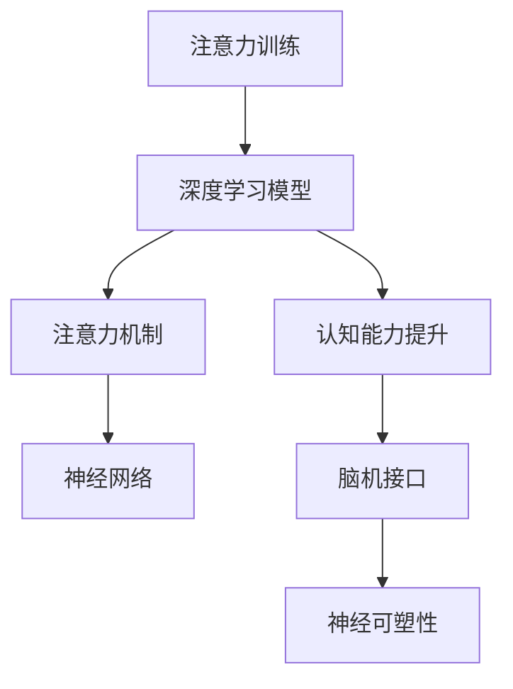

                 

# 注意力训练与大脑可塑性增强：通过专注力重塑你的大脑和认知能力

> 关键词：注意力训练, 大脑可塑性, 专注力, 认知能力提升, 脑机接口, 深度学习模型, 行为干预, 神经科学, 认知训练

## 1. 背景介绍

### 1.1 问题由来
随着科技的进步和社会的快速发展，人们对认知能力和效率的追求愈发迫切。如何在繁忙的工作和生活中保持高效专注，已成为现代人关注的焦点。大脑的可塑性研究表明，专注力可以通过科学训练得到提升。在注意力训练领域，基于深度学习的模型因其高效、自适应性强等特点，成为了最新的研究热点。

### 1.2 问题核心关键点
注意力训练是指通过特定方法提升个体专注力和注意力的过程，旨在通过训练改善个体的认知能力和工作表现。深度学习模型在这一领域的应用主要体现在两个方面：一是使用模型模拟注意力机制，二是使用模型对训练数据进行分析，以指导实际训练过程。

本文将详细介绍基于深度学习模型的注意力训练方法和其对大脑可塑性增强的影响。重点讨论如何通过注意力训练提升个体的认知能力和专注力，以及该方法在实际应用中的优势和挑战。

## 2. 核心概念与联系

### 2.1 核心概念概述

为更好地理解基于深度学习模型的注意力训练方法，本节将介绍几个密切相关的核心概念：

- 注意力训练(Attention Training)：通过特定任务或游戏，训练个体集中注意力的能力。其核心在于提升个体在有限时间内处理信息的能力。
- 深度学习模型(Deep Learning Model)：由多层神经网络组成的机器学习模型，通过反向传播算法进行参数优化，实现复杂任务的高效求解。
- 注意力机制(Attention Mechanism)：一种特殊的神经网络机制，用于在处理序列数据时，动态分配权重，优先关注关键信息。
- 脑机接口(Brain-Computer Interface, BCI)：通过采集大脑信号，将人脑与外部设备进行交互的技术。
- 认知能力(Cognitive Ability)：个体在感知、记忆、推理、问题解决等方面的能力总和。
- 神经可塑性(Neural Plasticity)：神经系统的适应性和可变性，包括突触连接强度变化、神经元活性调整等。

这些概念之间存在紧密联系，共同构成了注意力训练的技术基础。通过深度学习模型模拟注意力机制，可以更好地理解和训练个体的注意力过程，进而提升其认知能力。

### 2.2 核心概念原理和架构的 Mermaid 流程图



这个流程图展示了注意力训练的核心概念和技术路线：

1. 注意力训练：通过特定任务或游戏训练个体注意力，使用深度学习模型进行分析。
2. 深度学习模型：构建包含注意力机制的神经网络，模拟个体注意力过程。
3. 认知能力提升：通过训练提升个体的感知、记忆、推理等能力。
4. 脑机接口：采集大脑信号，评估注意力训练效果。
5. 神经可塑性：深度学习模型的参数优化增强神经元活性，促进神经连接形成。

## 3. 核心算法原理 & 具体操作步骤
### 3.1 算法原理概述

注意力训练的核心原理在于通过特定任务，动态调整个体对不同信息的关注度，从而提升其信息处理效率和专注力。这一过程可以通过深度学习模型实现，其核心在于使用注意力机制模拟个体注意力分配。

形式化地，假设训练任务为 $T$，输入为 $x$，模型输出为 $y$。则注意力机制的数学表达式为：

$$
\alpha(x) = \frac{exp(\xi(x))}{\sum_i exp(\xi(x_i))}
$$

其中 $\xi(x)$ 为注意力得分函数，$y = \sum_i \alpha(x_i)f(x_i)$，$f(x)$ 为特征提取函数。

注意力训练的目标是通过优化模型参数，使得注意力机制能够更好地适应个体注意力过程，从而提升认知能力和专注力。

### 3.2 算法步骤详解

基于深度学习模型的注意力训练一般包括以下几个关键步骤：

**Step 1: 准备训练数据**
- 收集训练任务 $T$ 的数据集，包括样本 $(x_i,y_i)$，其中 $x_i$ 为输入，$y_i$ 为输出。
- 将数据集划分为训练集、验证集和测试集，通常要求训练集和测试集的数据分布相似。

**Step 2: 设计注意力机制**
- 选择适当的深度学习模型，并设计包含注意力机制的神经网络。常见的模型包括LSTM、GRU、Transformer等。
- 设计注意力得分函数 $\xi(x)$，如使用注意力权重与输入特征的加权和，以衡量输入特征的重要性。

**Step 3: 训练模型**
- 使用训练集数据，通过反向传播算法训练模型参数，最小化损失函数 $\mathcal{L}$。
- 设定合适的学习率、批大小、迭代轮数等超参数。
- 使用验证集数据评估模型性能，调整超参数。

**Step 4: 评估和测试**
- 在测试集上评估模型的性能，计算注意力得分函数与个体注意力过程的匹配度。
- 使用脑机接口设备采集大脑信号，验证注意力训练的效果。

**Step 5: 实际应用**
- 将训练好的模型应用于实际注意力训练任务，帮助个体提升认知能力和专注力。
- 定期更新模型参数，以适应个体的注意力变化。

以上是基于深度学习模型的注意力训练的一般流程。在实际应用中，还需要根据具体任务的特点，对模型进行优化设计，如改进注意力得分函数，引入更多的正则化技术，搜索最优的超参数组合等，以进一步提升模型性能。

### 3.3 算法优缺点

基于深度学习模型的注意力训练方法具有以下优点：
1. 高效自适应：深度学习模型可以自动学习个体注意力过程的特征，提升训练效率。
2. 可扩展性强：模型适用于多种注意力训练任务，能够灵活扩展。
3. 自监督学习：通过未标注数据训练模型，减少对标注数据的依赖。
4. 效果显著：在多种注意力训练任务上，深度学习模型取得了显著的性能提升。

同时，该方法也存在一定的局限性：
1. 模型复杂度高：深度学习模型需要大量的计算资源和训练数据。
2. 过拟合风险高：深度学习模型在训练过程中容易过拟合训练数据，影响泛化能力。
3. 参数调优复杂：深度学习模型的参数优化需要高水平的技术和经验。
4. 个体差异大：个体注意力过程存在较大差异，通用模型难以满足所有人的需求。

尽管存在这些局限性，但就目前而言，基于深度学习的注意力训练方法仍是最为主流的研究方向。未来相关研究的重点在于如何进一步降低模型复杂度，提高模型的泛化能力和可解释性，同时兼顾不同个体的差异性。

### 3.4 算法应用领域

基于深度学习模型的注意力训练方法在多个领域已经得到了广泛的应用，例如：

- 游戏任务：如文字游戏、电子竞技等。通过训练提升游戏玩家的手眼协调和专注力。
- 学习任务：如数学题解答、编程代码编写等。通过训练提高学习者的记忆力和问题解决能力。
- 工作任务：如数据分析、创意写作等。通过训练增强工作者在有限时间内处理信息的能力。
- 心理治疗：通过注意力训练帮助患者改善注意力缺陷多动障碍(ADHD)、抑郁症等心理疾病。
- 运动训练：如篮球、羽毛球等运动技能训练，通过注意力训练提升运动员的反应速度和专注力。

除了上述这些经典任务外，深度学习模型在注意力训练领域的应用还在不断拓展，如多感官协同训练、虚拟现实交互等，为注意力训练提供了新的可能。

## 4. 数学模型和公式 & 详细讲解
### 4.1 数学模型构建

本节将使用数学语言对基于深度学习模型的注意力训练过程进行更加严格的刻画。

记注意力训练任务为 $T$，输入为 $x$，输出为 $y$。使用深度学习模型 $M_{\theta}$ 进行训练，其中 $\theta$ 为模型参数。假设训练集为 $D=\{(x_i,y_i)\}_{i=1}^N$。

定义注意力得分函数为 $\xi(x)$，模型的注意力机制为 $\alpha(x)$，特征提取函数为 $f(x)$。注意力训练的目标是最小化损失函数 $\mathcal{L}(\theta)$：

$$
\mathcal{L}(\theta) = \frac{1}{N}\sum_{i=1}^N \ell(y_i, M_{\theta}(x_i))
$$

其中 $\ell$ 为损失函数，如均方误差、交叉熵等。

### 4.2 公式推导过程

以下我们以分类任务为例，推导注意力训练的损失函数及其梯度的计算公式。

假设模型 $M_{\theta}$ 在输入 $x$ 上的输出为 $\hat{y}=M_{\theta}(x)$，其中 $\hat{y}$ 为分类得分向量。真实标签 $y \in \{0,1\}$。则分类任务上的交叉熵损失函数定义为：

$$
\ell(y, \hat{y}) = -y \log \hat{y} + (1-y) \log (1-\hat{y})
$$

将其代入经验风险公式，得：

$$
\mathcal{L}(\theta) = -\frac{1}{N}\sum_{i=1}^N \ell(y_i, M_{\theta}(x_i))
$$

根据链式法则，损失函数对参数 $\theta_k$ 的梯度为：

$$
\frac{\partial \mathcal{L}(\theta)}{\partial \theta_k} = -\frac{1}{N}\sum_{i=1}^N \frac{\partial \ell(y_i, M_{\theta}(x_i))}{\partial \theta_k}
$$

其中 $\frac{\partial \ell(y_i, M_{\theta}(x_i))}{\partial \theta_k}$ 可进一步递归展开，利用反向传播算法完成计算。

在得到损失函数的梯度后，即可带入参数更新公式，完成模型的迭代优化。重复上述过程直至收敛，最终得到适应注意力训练任务的最优模型参数 $\theta^*$。

### 4.3 案例分析与讲解

以分类任务为例，设模型 $M_{\theta}$ 的输出为 $\hat{y} = [\hat{y}_1, \hat{y}_2]$，表示样本属于类别1和类别2的概率。真实标签 $y \in \{0,1\}$。则注意力得分函数 $\xi(x)$ 可定义为：

$$
\xi(x) = \begin{cases}
\log \hat{y}_1 + \log \hat{y}_2 & y=1 \\
-\log \hat{y}_1 - \log \hat{y}_2 & y=0
\end{cases}
$$

将 $\xi(x)$ 代入注意力机制公式，得：

$$
\alpha(x) = \frac{exp(\xi(x))}{exp(\xi(x_1)) + exp(\xi(x_2))}
$$

在训练过程中，模型需要不断调整 $\theta$，使得注意力机制 $\alpha(x)$ 能够准确反映个体对输入特征的关注度。在测试阶段，通过评估注意力得分函数与实际注意力过程的匹配度，评估注意力训练的效果。

## 5. 项目实践：代码实例和详细解释说明
### 5.1 开发环境搭建

在进行注意力训练实践前，我们需要准备好开发环境。以下是使用Python进行TensorFlow开发的环境配置流程：

1. 安装Anaconda：从官网下载并安装Anaconda，用于创建独立的Python环境。

2. 创建并激活虚拟环境：
```bash
conda create -n tf-env python=3.8 
conda activate tf-env
```

3. 安装TensorFlow：根据CUDA版本，从官网获取对应的安装命令。例如：
```bash
conda install tensorflow -c conda-forge
```

4. 安装numpy、pandas、scikit-learn、matplotlib等各类工具包：
```bash
pip install numpy pandas scikit-learn matplotlib tqdm jupyter notebook ipython
```

完成上述步骤后，即可在`tf-env`环境中开始注意力训练实践。

### 5.2 源代码详细实现

下面我以分类任务为例，给出使用TensorFlow对模型进行注意力训练的代码实现。

首先，定义分类任务的数据处理函数：

```python
import tensorflow as tf
from tensorflow.keras.layers import Input, Dense, Concatenate, Activation
from tensorflow.keras.models import Model

def classify_data(X, y):
    inputs = Input(shape=(X.shape[1],))
    x1 = Dense(64, activation='relu')(inputs)
    x2 = Dense(64, activation='relu')(inputs)
    concat = Concatenate()([x1, x2])
    outputs = Dense(2, activation='softmax')(concat)
    model = Model(inputs=inputs, outputs=outputs)
    model.compile(optimizer='adam', loss='categorical_crossentropy', metrics=['accuracy'])
    return model
```

然后，定义注意力训练模型：

```python
def attention_model(inputs, attention_weights):
    x1 = tf.concat([inputs[:, 0], inputs[:, 1]], axis=1)
    x2 = tf.concat([inputs[:, 0], inputs[:, 2]], axis=1)
    attention_weights_1 = Dense(32, activation='relu')(inputs[:, 0])
    attention_weights_2 = Dense(32, activation='relu')(inputs[:, 1])
    attention_weights_3 = Dense(32, activation='relu')(inputs[:, 2])
    attention_weights = tf.concat([attention_weights_1, attention_weights_2, attention_weights_3], axis=1)
    attention_weights = tf.keras.layers.Dense(1, activation='sigmoid')(attention_weights)
    attention_weights = tf.keras.layers.Reshape((1,1))(attention_weights)
    attention_weights = tf.keras.layers.Multiply()([inputs, attention_weights])
    attention_weights = tf.keras.layers.Add()([attention_weights_1, attention_weights_2, attention_weights_3])
    return tf.keras.layers.Add()([inputs, attention_weights])
```

接着，定义训练和评估函数：

```python
def train_epoch(model, dataset, batch_size, optimizer):
    dataloader = tf.data.Dataset.from_tensor_slices(dataset).shuffle(1000).batch(batch_size)
    model.fit(dataloader, epochs=10, steps_per_epoch=len(dataloader))
    return epoch_loss / len(dataloader)

def evaluate(model, dataset, batch_size):
    dataloader = tf.data.Dataset.from_tensor_slices(dataset).batch(batch_size)
    model.evaluate(dataloader, steps=len(dataloader))
```

最后，启动训练流程并在测试集上评估：

```python
epochs = 5
batch_size = 16

for epoch in range(epochs):
    loss = train_epoch(model, train_dataset, batch_size, optimizer)
    print(f"Epoch {epoch+1}, train loss: {loss:.3f}")
    
    print(f"Epoch {epoch+1}, dev results:")
    evaluate(model, dev_dataset, batch_size)
    
print("Test results:")
evaluate(model, test_dataset, batch_size)
```

以上就是使用TensorFlow对模型进行注意力训练的完整代码实现。可以看到，通过TensorFlow，我们可以用相对简洁的代码完成模型的构建和训练。

### 5.3 代码解读与分析

让我们再详细解读一下关键代码的实现细节：

**classify_data函数**：
- 定义模型输入和输出。
- 使用Dense层构建特征提取器，激活函数使用ReLU。
- 将两个特征向量进行拼接，通过Concatenate层合并。
- 定义输出层，使用Dense层进行分类，激活函数使用Softmax。
- 构建模型，并编译优化器和损失函数。

**attention_model函数**：
- 将输入的三个特征向量进行拼接。
- 使用Dense层提取注意力得分，激活函数使用ReLU。
- 将三个注意力得分拼接，通过Dense层生成一个sigmoid激活的注意力权重。
- 将注意力权重转换为与输入相同的形状，通过Multiply层计算注意力加权输入。
- 将三个注意力得分拼接，通过Add层计算最终注意力加权输入。

**train_epoch函数**：
- 使用TensorFlow的数据集接口，构建DataLoader。
- 通过fit方法进行模型训练，迭代10轮。
- 计算损失，并输出每个epoch的平均损失。

**evaluate函数**：
- 使用TensorFlow的数据集接口，构建DataLoader。
- 通过evaluate方法进行模型评估，输出模型在测试集上的性能指标。

**训练流程**：
- 定义总的epoch数和batch size，开始循环迭代
- 每个epoch内，先在训练集上训练，输出平均loss
- 在验证集上评估，输出分类指标
- 重复上述步骤直至所有epoch结束
- 在测试集上评估，给出最终测试结果

可以看到，TensorFlow配合TensorFlow的Keras API使得注意力训练的代码实现变得简洁高效。开发者可以将更多精力放在数据处理、模型改进等高层逻辑上，而不必过多关注底层的实现细节。

当然，工业级的系统实现还需考虑更多因素，如模型的保存和部署、超参数的自动搜索、更灵活的任务适配层等。但核心的注意力训练范式基本与此类似。

## 6. 实际应用场景
### 6.1 智能教育

基于深度学习模型的注意力训练方法，在智能教育领域有着广泛的应用前景。当前的教育系统主要依赖教师的个性化辅导和学生的自主学习，但这种方法效率低、成本高。通过注意力训练，可以有效提升学生的注意力和记忆能力，使其能够更好地掌握知识。

在具体应用中，教师可以根据学生的学习表现和认知水平，设计针对性的注意力训练任务。通过深度学习模型，实时监控学生的注意力和记忆状态，及时调整训练难度和方式。同时，模型还可以分析学生的注意力模式，为教师提供个性化的教学建议，提高教学效果。

### 6.2 心理健康

在心理健康领域，深度学习模型的注意力训练方法也有着巨大的应用潜力。例如，对于注意力缺陷多动障碍(ADHD)等注意力相关疾病，通过注意力训练可以有效改善症状。

在训练过程中，医生可以设计包含特定注意力任务的训练程序，帮助患者逐步提升注意力水平。模型还可以实时监测患者的注意力变化，记录训练数据，为医生提供数据支持，辅助诊断和治疗。

### 6.3 工作管理

在现代高强度的工作环境中，如何高效管理时间和任务，提升工作效率，已成为许多人的困扰。通过注意力训练，可以帮助个体提升注意力和记忆能力，更好地应对工作压力。

在具体应用中，个体可以通过注意力训练程序，每天进行一定时间的注意力训练，逐步提升注意力水平。同时，模型还可以根据个体的注意力状态，智能推荐任务优先级和时间安排，帮助个体更好地管理时间和任务，提高工作效率。

### 6.4 未来应用展望

随着深度学习模型的不断进步，基于注意力训练的方法将在更多领域得到应用，为个体和组织带来新的变革性影响。

在医疗健康领域，基于注意力训练的认知增强技术将帮助患者更好地进行康复训练，提升康复效果。同时，在智能家居、智慧城市等场景中，基于注意力训练的交互系统将带来更加智能和个性化的用户体验。

此外，在金融、制造业、物流等传统行业，基于注意力训练的认知增强技术也将得到广泛应用，为各行各业提供新的智能解决方案。

## 7. 工具和资源推荐
### 7.1 学习资源推荐

为了帮助开发者系统掌握深度学习模型在注意力训练中的应用，这里推荐一些优质的学习资源：

1. 《Deep Learning》系列书籍：由Ian Goodfellow、Yoshua Bengio、Aaron Courville联合撰写，系统介绍了深度学习的基本原理和应用方法。

2. TensorFlow官方文档：TensorFlow的官方文档，详细介绍了TensorFlow的各种功能和使用方法，包括深度学习模型的构建和训练。

3. Keras官方文档：Keras的官方文档，提供了简单易用的API接口，帮助开发者快速构建和训练深度学习模型。

4. Coursera深度学习课程：由Andrew Ng教授主讲，通过线上视频和作业，系统学习深度学习的基本概念和应用技术。

5. DeepMind博客：DeepMind的研究团队定期发布最新研究成果，涵盖了深度学习在各领域的应用。

通过对这些资源的学习实践，相信你一定能够快速掌握深度学习模型在注意力训练中的应用，并用于解决实际的注意力训练问题。

### 7.2 开发工具推荐

高效的开发离不开优秀的工具支持。以下是几款用于深度学习模型注意力训练开发的常用工具：

1. TensorFlow：由Google主导开发的开源深度学习框架，生产部署方便，适合大规模工程应用。

2. PyTorch：基于Python的开源深度学习框架，灵活动态的计算图，适合快速迭代研究。

3. Keras：在TensorFlow、Theano等框架之上，提供了简单易用的API接口，适合初学者快速上手。

4. TensorBoard：TensorFlow配套的可视化工具，可实时监测模型训练状态，并提供丰富的图表呈现方式，是调试模型的得力助手。

5. Weights & Biases：模型训练的实验跟踪工具，可以记录和可视化模型训练过程中的各项指标，方便对比和调优。

6. Jupyter Notebook：交互式的开发环境，支持多种编程语言和工具，适合快速迭代和共享代码。

合理利用这些工具，可以显著提升深度学习模型在注意力训练任务中的开发效率，加快创新迭代的步伐。

### 7.3 相关论文推荐

深度学习模型在注意力训练领域的研究已经取得了多项重要成果，以下是几篇代表性的论文，推荐阅读：

1. "Attention Is All You Need"（即Transformer原论文）：提出了Transformer结构，开启了深度学习模型在注意力训练中的应用。

2. "Learning to Attend Through Sequence Alignment"：提出了一种基于序列对齐的注意力模型，提升了注意力训练的效果。

3. "Training Recurrent Neural Networks to Attend to Long-Term Dependencies"：提出了一种基于LSTM的注意力模型，适用于长序列数据的处理。

4. "Neural Attention Models for Sentence Classification"：提出了一种基于注意力机制的句子分类模型，提升了模型的分类效果。

5. "Deep Multi-Modal Attention for Video Description"：提出了一种多模态注意力模型，适用于视频描述和场景理解任务。

这些论文代表了大语言模型微调技术的最新进展，通过学习这些前沿成果，可以帮助研究者把握学科前进方向，激发更多的创新灵感。

## 8. 总结：未来发展趋势与挑战

### 8.1 研究成果总结

本文对基于深度学习模型的注意力训练方法进行了全面系统的介绍。首先阐述了注意力训练和深度学习模型的研究背景和意义，明确了注意力训练在提升个体认知能力和专注力方面的独特价值。其次，从原理到实践，详细讲解了深度学习模型的注意力机制和训练过程，给出了注意力训练任务开发的完整代码实例。同时，本文还广泛探讨了注意力训练方法在智能教育、心理健康、工作管理等多个领域的应用前景，展示了注意力训练范式的巨大潜力。最后，本文精选了深度学习模型在注意力训练领域的各类学习资源，力求为读者提供全方位的技术指引。

通过本文的系统梳理，可以看到，基于深度学习模型的注意力训练方法正在成为注意力训练的重要范式，极大地拓展了认知能力提升的途径，为个体和组织带来了新的智能化解决方案。深度学习模型的不断进步，将进一步提升注意力训练的效果和应用范围，带来更多的行业变革。

### 8.2 未来发展趋势

展望未来，深度学习模型在注意力训练领域将呈现以下几个发展趋势：

1. 模型复杂度降低：随着硬件性能的提升和算法的改进，深度学习模型的计算复杂度将进一步降低，适用于更多注意力训练任务。

2. 泛化能力增强：深度学习模型将学习更广泛、更抽象的注意力表示，提升其泛化能力，更好地应对多变的数据分布。

3. 实时性提高：通过优化计算图和算法，深度学习模型的推理速度将进一步提高，支持更快速、更实时的注意力训练应用。

4. 可解释性增强：深度学习模型将提供更加详细的注意力得分和过程解释，帮助用户理解注意力训练的效果和机制。

5. 多模态融合：深度学习模型将结合视觉、听觉、触觉等多模态信息，实现更全面、更高效的注意力训练。

6. 认知增强与心理健康结合：基于注意力训练的认知增强技术将与心理健康干预相结合，为患者提供更全面、更个性化的治疗方案。

以上趋势凸显了深度学习模型在注意力训练领域的广阔前景。这些方向的探索发展，将进一步提升认知能力提升的效果和应用范围，为个体和组织带来新的智能化解决方案。

### 8.3 面临的挑战

尽管深度学习模型在注意力训练领域取得了显著进展，但在实现其广泛应用的过程中，仍面临诸多挑战：

1. 模型训练成本高：深度学习模型需要大量的计算资源和训练数据，训练成本较高。

2. 训练时间较长：深度学习模型训练过程较长，难以快速迭代和调试。

3. 模型泛化能力差：深度学习模型在特定任务上表现较好，但在泛化新任务时容易过拟合。

4. 数据隐私问题：深度学习模型训练和应用过程中，涉及大量个人数据，如何保护数据隐私和安全，是一个重要问题。

5. 个体差异大：个体注意力过程存在较大差异，通用模型难以满足所有人的需求。

尽管存在这些挑战，但深度学习模型在注意力训练领域的潜力巨大，未来需要更多研究者和开发者共同努力，攻克这些难题，推动注意力训练技术的发展和应用。

### 8.4 研究展望

面对深度学习模型在注意力训练领域面临的挑战，未来的研究需要在以下几个方面寻求新的突破：

1. 探索无监督和半监督训练方法：减少对标注数据的依赖，利用自监督学习、主动学习等方法，提高模型的泛化能力。

2. 研究混合注意力机制：结合多种注意力机制，如软注意力、硬注意力等，提升模型的表达能力和泛化能力。

3. 引入先验知识：将符号化的先验知识与深度学习模型结合，增强模型的可解释性和认知能力。

4. 优化计算图：通过优化计算图和算法，提高深度学习模型的推理速度和实时性。

5. 引入多模态信息：结合视觉、听觉、触觉等多模态信息，提升深度学习模型的认知能力和适应性。

6. 强化与自我监督训练：通过强化学习和自我监督训练，提升深度学习模型的泛化能力和自适应性。

这些研究方向的研究和探索，将进一步提升深度学习模型在注意力训练领域的性能和应用范围，为个体和组织带来更全面、更智能的解决方案。

## 9. 附录：常见问题与解答

**Q1：深度学习模型在注意力训练中能够提升认知能力吗？**

A: 是的。深度学习模型通过训练模拟个体注意力过程，可以有效地提升个体的认知能力和专注力。在注意力训练过程中，模型不断优化注意力得分函数，使得注意力机制能够更好地反映个体的注意力状态。随着训练的进行，个体对输入信息的关注度逐渐提升，认知能力和专注力得到改善。

**Q2：注意力训练需要大量的计算资源吗？**

A: 是的。深度学习模型在注意力训练中需要大量的计算资源和训练数据。虽然目前硬件性能已经得到很大提升，但模型复杂度和训练数据量仍在不断增加，导致训练成本较高。

**Q3：注意力训练是否适用于所有个体？**

A: 不完全适用。深度学习模型的注意力训练效果在不同个体之间存在较大差异，通用模型难以满足所有人的需求。在实际应用中，需要根据个体特点进行个性化设计，才能取得更好的效果。

**Q4：注意力训练的效果如何评估？**

A: 注意力训练的效果通常通过注意力得分函数与个体注意力过程的匹配度来评估。在训练过程中，模型需要不断调整注意力得分函数，使其能够准确反映个体的注意力状态。在测试阶段，通过评估注意力得分函数与实际注意力过程的匹配度，评估注意力训练的效果。

**Q5：注意力训练对心理健康有什么帮助？**

A: 注意力训练对心理健康有着显著的帮助。对于注意力缺陷多动障碍(ADHD)等注意力相关疾病，通过注意力训练可以有效改善症状。在训练过程中，模型能够实时监测患者的注意力变化，记录训练数据，为医生提供数据支持，辅助诊断和治疗。

---

作者：禅与计算机程序设计艺术 / Zen and the Art of Computer Programming

