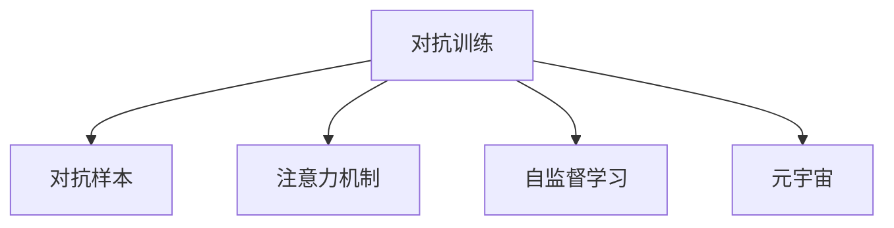

                 

# 注意力黑客：元宇宙时代的信息战

> 关键词：元宇宙,信息战,注意力机制,黑客攻击,数据安全,隐私保护,对抗训练,对抗样本,模型鲁棒性

## 1. 背景介绍

### 1.1 问题由来
随着元宇宙（Metaverse）的兴起，人类社交与信息交流的方式正在发生深刻变革。数字身份、虚拟世界、全息通信等新技术，正在重塑数字生态，开启信息时代的新纪元。但与此同时，元宇宙带来的技术突破也带来了新的安全挑战。隐私泄露、数据篡改、恶意攻击等风险，逐渐成为不可忽视的问题。

在这个数字信息战场上，如何有效防护个人信息，提升模型鲁棒性，构建安全的元宇宙环境，成为当前亟待解决的重要课题。而基于对抗训练和对抗样本的注意力机制，为元宇宙的信息安全提供了新的解决方案。

### 1.2 问题核心关键点
对抗训练与对抗样本是当前信息安全领域的前沿技术，其核心思想在于通过对模型进行大量对抗样本的训练，提高模型的鲁棒性，使其能够在面对各种形式攻击时，保持稳定和准确。本文将深入探讨对抗训练和对抗样本在元宇宙中的应用，并提供相应的实现思路和案例分析。

## 2. 核心概念与联系

### 2.1 核心概念概述

为更好地理解基于对抗训练和对抗样本的注意力机制，本节将介绍几个密切相关的核心概念：

- 对抗训练(Adversarial Training)：一种提高模型鲁棒性的训练方法，通过在正常训练样本中添加对抗样本，让模型逐渐适应这些干扰，从而提高模型面对噪声和攻击的鲁棒性。
- 对抗样本(Adversarial Example)：一种特制的输入样本，通过轻微扰动，能够欺骗模型，使其产生错误预测。
- 注意力机制(Attention Mechanism)：一种强大的模型组件，通过权重分配机制，集中计算输入样本的关键信息，实现有效的特征提取。
- 自监督学习(Self-Supervised Learning)：一种无需人工标注的数据驱动学习方法，通过自构建的训练目标，利用大规模无标签数据进行训练，提高模型泛化能力。
- 元宇宙(Metaverse)：一种通过虚拟现实、增强现实、混合现实等技术构建的沉浸式数字环境，包含游戏、社交、商业等多个领域，具有高度的真实性和交互性。

这些核心概念之间的逻辑关系可以通过以下Mermaid流程图来展示：



这个流程图展示了大语言模型的核心概念及其之间的关系：

1. 对抗训练通过对模型进行对抗样本的训练，提高模型鲁棒性。
2. 对抗样本为模型提供了能够欺骗其预测的干扰数据，有助于发现模型的脆弱点。
3. 注意力机制帮助模型关注输入的关键部分，从而提升模型性能。
4. 自监督学习提供无需标注的数据驱动方法，扩充数据资源，提高模型泛化能力。
5. 元宇宙提供了应用对抗训练和注意力机制的具体场景，为信息安全研究带来新的挑战和机会。

这些概念共同构成了信息安全领域的核心范式，使得模型的泛化能力和鲁棒性得以提高，从而更好地保护元宇宙中的信息安全。

## 3. 核心算法原理 & 具体操作步骤
### 3.1 算法原理概述

基于对抗训练和对抗样本的注意力机制，其核心思想在于通过对抗训练，使模型能够识别并抵御对抗样本的攻击，从而提高模型的鲁棒性。在对抗训练中，通过构造对抗样本对模型进行干扰，然后反向传播梯度更新模型参数，使模型逐渐适应这些干扰，从而增强模型的鲁棒性。

形式化地，假设模型为 $f_{\theta}(x)$，其中 $x$ 为输入，$\theta$ 为模型参数。对抗样本为 $x'$，通过轻微扰动 $x$ 生成，使得 $f_{\theta}(x') \neq f_{\theta}(x)$。对抗训练的目标是找到最优的扰动向量 $\delta$，使得 $f_{\theta}(x+\delta)$ 的预测结果与 $f_{\theta}(x)$ 尽可能接近。

具体地，对抗训练的过程可以表示为：

$$
\min_{\delta} \mathcal{L}(f_{\theta}(x+\delta), y)
$$

其中 $\mathcal{L}$ 为模型的损失函数，$y$ 为真实标签。

在实际应用中，对抗训练通常通过梯度上升的方法，找到使得模型输出错误的扰动向量 $\delta$，然后将其反向传播到模型参数 $\theta$ 上进行微调，从而提高模型的鲁棒性。

### 3.2 算法步骤详解

基于对抗训练和对抗样本的注意力机制，通常包括以下几个关键步骤：

**Step 1: 数据准备**
- 收集训练集 $D=\{(x_i,y_i)\}_{i=1}^N$，其中 $x_i$ 为输入，$y_i$ 为标签。
- 使用对抗生成算法生成对抗样本集 $D'=\{(x_i',y_i')\}_{i=1}^M$，其中 $x_i'$ 为对抗样本，$y_i'$ 为扰动后的标签。

**Step 2: 对抗训练过程**
- 以 $D$ 和 $D'$ 为训练集，使用对抗训练算法，对模型 $f_{\theta}$ 进行训练。
- 在每个训练批次中，先对正常样本 $x_i$ 进行前向传播，计算损失函数 $\mathcal{L}(f_{\theta}(x_i),y_i)$。
- 接着对对抗样本 $x_i'$ 进行前向传播，计算损失函数 $\mathcal{L}(f_{\theta}(x_i'+\delta),y_i')$。
- 将两个损失函数的梯度叠加，进行反向传播更新模型参数 $\theta$。

**Step 3: 评估模型鲁棒性**
- 使用测试集 $D_{test}$，评估模型 $f_{\theta}$ 的鲁棒性。
- 对测试集 $D_{test}$ 中的每个样本 $x_i$，生成扰动向量 $\delta$，计算对抗样本 $x_i'$ 的预测结果 $f_{\theta}(x_i')$ 与正常样本 $f_{\theta}(x_i)$ 的差异，评估模型的鲁棒性。

### 3.3 算法优缺点

基于对抗训练和对抗样本的注意力机制，具有以下优点：

1. 提高模型鲁棒性：通过对抗训练，模型能够学习到抵抗对抗样本的鲁棒特征，在面对恶意攻击时保持稳定。
2. 泛化能力强：对抗样本能够帮助模型学习到更广泛的泛化能力，提高模型在新领域上的表现。
3. 应用广泛：对抗训练方法可应用于各类NLP、图像识别、时间序列预测等多个任务，适用于不同类型的数据。

同时，该方法也存在一定的局限性：

1. 计算资源需求高：对抗训练和对抗样本生成通常需要耗费大量的计算资源，尤其是对抗样本的生成过程较为复杂，可能导致训练时间延长。
2. 数据集构建难度大：需要构建足够数量且具有有效扰动的对抗样本集，这在实际应用中可能存在困难。
3. 模型复杂性增加：对抗训练和注意力机制的引入，可能会增加模型的复杂性，导致推理速度变慢。
4. 对抗样本生成难度大：对抗样本的生成过程需要精细调参，生成的对抗样本质量可能参差不齐，影响模型性能。

尽管存在这些局限性，但就目前而言，基于对抗训练和对抗样本的注意力机制是提高模型鲁棒性的重要方法。未来相关研究的重点在于如何降低对抗训练的计算资源需求，提高对抗样本生成的效率和质量，同时兼顾模型的推理速度和复杂性。

### 3.4 算法应用领域

基于对抗训练和对抗样本的注意力机制，在元宇宙时代具有广泛的应用前景：

- 数字身份认证：在元宇宙中，数字身份的安全性至关重要。通过对抗训练，提高身份认证模型的鲁棒性，防止恶意攻击。
- 游戏环境安全：元宇宙游戏中的各种对抗行为，如作弊、外挂等，通过对抗训练提高模型的鲁棒性，构建安全的游戏环境。
- 虚拟资产交易：在虚拟交易平台中，防止恶意篡改、欺诈等行为，通过对抗训练提高模型的鲁棒性，保障交易安全。
- 网络安全监控：元宇宙中的各种网络攻击行为，如DDoS、钓鱼攻击等，通过对抗训练提高模型的鲁棒性，保障网络安全。
- 社交关系管理：元宇宙中，用户的社交关系和互动行为，通过对抗训练提高模型的鲁棒性，保障社交安全。

除了上述这些经典应用外，对抗训练和对抗样本还在元宇宙的诸多场景中得到创新性的应用，如全息通信、虚拟现实、混合现实等，为元宇宙的技术进步带来了新的突破。随着元宇宙技术的不断发展，基于对抗训练和对抗样本的方法将在更多领域得到应用，为元宇宙的安全性和可靠性提供坚实的保障。

## 4. 数学模型和公式 & 详细讲解 & 举例说明

### 4.1 数学模型构建

本节将使用数学语言对基于对抗训练和对抗样本的注意力机制进行更加严格的刻画。

记对抗训练的模型为 $f_{\theta}(x)$，其中 $x$ 为输入，$\theta$ 为模型参数。假设对抗样本为 $x'$，其中 $\delta$ 为扰动向量。对抗训练的目标是找到最优的扰动向量 $\delta$，使得 $f_{\theta}(x+\delta)$ 的预测结果与 $f_{\theta}(x)$ 尽可能接近。

定义模型 $f_{\theta}$ 在输入 $x$ 上的损失函数为 $\ell(f_{\theta}(x),y)$，则在对抗样本集 $D'$ 上的对抗训练损失函数为：

$$
\mathcal{L}_{adv}(f_{\theta}) = \mathbb{E}_{(x,y),(x',y')} \max \{\ell(f_{\theta}(x'),y') - \ell(f_{\theta}(x),y)\}
$$

其中 $\mathbb{E}$ 表示期望，$(x,y)$ 和 $(x',y')$ 分别表示训练集和对抗样本集的样本和标签。

在实际训练过程中，我们通常采用梯度上升的方法，对对抗样本进行扰动，使其误导模型的预测，然后反向传播更新模型参数 $\theta$。具体的优化过程如下：

$$
\min_{\delta} \mathcal{L}(f_{\theta}(x+\delta),y)
$$

其中 $\mathcal{L}$ 为模型的损失函数，$y$ 为真实标签。

### 4.2 公式推导过程

以下我们以图像分类任务为例，推导对抗训练的优化目标函数。

假设模型 $f_{\theta}$ 在输入图像 $x$ 上的输出为 $y = f_{\theta}(x)$，其中 $y$ 为类别概率分布。真实标签为 $y_t$，对抗样本为 $x' = x + \delta$。对抗训练的目标是找到扰动向量 $\delta$，使得模型在对抗样本上的预测结果与正常样本的预测结果尽可能接近，即：

$$
\min_{\delta} \mathbb{E}_{(x,y)} \max_{\delta} \ell(f_{\theta}(x'),y)
$$

其中 $\ell$ 为交叉熵损失函数。

将对抗样本 $x'$ 带入模型，得到 $y' = f_{\theta}(x')$。对抗训练的目标是最大化 $y'$ 与 $y$ 的差异，即：

$$
\max_{\delta} \ell(y',y_t)
$$

为了简化计算，通常采用梯度上升的方法，生成对抗样本 $x'$。假设 $x'$ 对 $x$ 的扰动为 $\delta$，则对抗样本的生成过程可以表示为：

$$
x' = x + \delta
$$

其中 $\delta$ 为扰动向量。对抗训练的目标是找到最优的扰动向量 $\delta$，使得 $f_{\theta}(x')$ 的预测结果与 $f_{\theta}(x)$ 尽可能接近，即：

$$
\min_{\delta} \mathbb{E}_{(x,y)} \max_{\delta} \ell(f_{\theta}(x'+\delta),y)
$$

在实际训练过程中，我们通常采用梯度上升的方法，对对抗样本进行扰动，使其误导模型的预测，然后反向传播更新模型参数 $\theta$。具体的优化过程如下：

$$
\min_{\theta} \mathbb{E}_{(x,y)} \max_{\delta} \ell(f_{\theta}(x'+\delta),y)
$$

通过上述优化过程，我们可以训练出一个鲁棒性更强的模型，使其能够抵御对抗样本的攻击，提高模型在元宇宙环境中的安全性。

### 4.3 案例分析与讲解

下面我们以手写数字识别任务为例，给出对抗训练和对抗样本的实际应用案例。

假设我们有一个手写数字识别模型 $f_{\theta}(x)$，其中 $x$ 为手写数字图像，$\theta$ 为模型参数。我们的目标是通过对抗训练，提高模型的鲁棒性，使其能够抵御对抗样本的攻击。

首先，我们需要收集训练集 $D=\{(x_i,y_i)\}_{i=1}^N$，其中 $x_i$ 为手写数字图像，$y_i$ 为标签。然后，我们使用对抗生成算法生成对抗样本集 $D'=\{(x_i',y_i')\}_{i=1}^M$，其中 $x_i'$ 为对抗样本，$y_i'$ 为扰动后的标签。

接着，我们使用对抗训练算法，对模型 $f_{\theta}$ 进行训练。在每个训练批次中，先对正常样本 $x_i$ 进行前向传播，计算损失函数 $\ell(f_{\theta}(x_i),y_i)$。然后对对抗样本 $x_i'$ 进行前向传播，计算损失函数 $\ell(f_{\theta}(x_i'+\delta),y_i')$。将两个损失函数的梯度叠加，进行反向传播更新模型参数 $\theta$。

在训练完成后，我们使用测试集 $D_{test}$，评估模型 $f_{\theta}$ 的鲁棒性。对测试集 $D_{test}$ 中的每个样本 $x_i$，生成扰动向量 $\delta$，计算对抗样本 $x_i'$ 的预测结果 $f_{\theta}(x_i')$ 与正常样本 $f_{\theta}(x_i)$ 的差异，评估模型的鲁棒性。

通过上述案例分析，我们可以看到，对抗训练和对抗样本在提高模型鲁棒性方面的有效性，为元宇宙中的信息安全提供了重要保障。

## 5. 项目实践：代码实例和详细解释说明
### 5.1 开发环境搭建

在进行对抗训练和对抗样本的实践前，我们需要准备好开发环境。以下是使用Python进行PyTorch开发的环境配置流程：

1. 安装Anaconda：从官网下载并安装Anaconda，用于创建独立的Python环境。

2. 创建并激活虚拟环境：
```bash
conda create -n pytorch-env python=3.8 
conda activate pytorch-env
```

3. 安装PyTorch：根据CUDA版本，从官网获取对应的安装命令。例如：
```bash
conda install pytorch torchvision torchaudio cudatoolkit=11.1 -c pytorch -c conda-forge
```

4. 安装Transformers库：
```bash
pip install transformers
```

5. 安装各类工具包：
```bash
pip install numpy pandas scikit-learn matplotlib tqdm jupyter notebook ipython
```

完成上述步骤后，即可在`pytorch-env`环境中开始对抗训练和对抗样本的实践。

### 5.2 源代码详细实现

下面我以图像分类任务为例，给出使用Transformers库进行对抗训练和对抗样本的PyTorch代码实现。

首先，定义对抗训练的损失函数：

```python
from transformers import AutoTokenizer, AutoModel

model = AutoModel.from_pretrained('resnet18')
tokenizer = AutoTokenizer.from_pretrained('resnet18')

def adversarial_loss(x, y, x_adv):
    with torch.no_grad():
        logits_adv = model(x_adv)
        logits = model(x)
    return -(y * logits_adv.logsumexp(1, keepdim=True) - (1-y) * logits.logsumexp(1, keepdim=True))
```

然后，定义对抗样本生成函数：

```python
from adversarial.pytorch foolbox import AdversarialFoolbox

foolbox = AdversarialFoolbox(model, max_iter=20, verbose=True)
x_adv = foolbox.generate(x, y, method='FGSM', epsilon=0.01)
```

接着，定义对抗训练的优化器：

```python
from torch.optim import Adam

optimizer = Adam(model.parameters(), lr=0.001)
```

最后，启动对抗训练流程：

```python
for epoch in range(10):
    for batch in train_loader:
        x, y = batch
        x_adv = foolbox.generate(x, y, method='FGSM', epsilon=0.01)
        logits = model(x)
        loss_adv = adversarial_loss(x_adv, y, logits_adv)
        optimizer.zero_grad()
        loss_adv.backward()
        optimizer.step()
```

以上就是使用PyTorch进行图像分类任务的对抗训练和对抗样本的完整代码实现。可以看到，依赖于对抗生成库AdversarialFoolbox，我们能够很方便地生成对抗样本，并将其用于对抗训练。

### 5.3 代码解读与分析

让我们再详细解读一下关键代码的实现细节：

**AdversarialFoolbox**：
- 这个库提供了一个简单的接口，方便生成对抗样本，支持多种攻击方法，如FGSM、PGD等。

**adversarial_loss**函数：
- 该函数定义了对抗训练的损失函数，用于衡量模型在对抗样本上的表现。

**foolbox.generate**函数：
- 使用AdversarialFoolbox库生成对抗样本。该函数接收样本 $x$，标签 $y$，扰动参数 $\epsilon$，并指定攻击方法，返回生成的对抗样本。

**Adam优化器**：
- 该优化器用于更新模型参数 $\theta$，调整学习率以适应对抗训练。

**对抗训练流程**：
- 在每个epoch中，对于每个样本 $x$ 和标签 $y$，生成对抗样本 $x_{adv}$，计算对抗损失 $\ell_{adv}$。
- 将对抗损失与正常损失 $\ell$ 的梯度叠加，进行反向传播更新模型参数 $\theta$。

通过上述代码，我们可以快速地构建和训练一个鲁棒性更强的模型，使其能够抵御对抗样本的攻击，从而提高在元宇宙环境中的安全性。

## 6. 实际应用场景
### 6.1 数字身份认证

在元宇宙中，数字身份的安全性至关重要。通过对抗训练，提高身份认证模型的鲁棒性，防止恶意攻击。

在技术实现上，可以收集用户登录时输入的文本信息、语音信息、面部识别等数据，将这些数据作为训练集。使用对抗训练算法，生成对抗样本，输入模型进行训练。训练完成后，使用测试集评估模型的鲁棒性，确保其能够抵御对抗样本的攻击。

### 6.2 游戏环境安全

元宇宙游戏中的各种对抗行为，如作弊、外挂等，通过对抗训练提高模型的鲁棒性，构建安全的游戏环境。

在游戏场景中，可以收集玩家的操作数据、游戏行为数据等，作为训练集。使用对抗训练算法，生成对抗样本，输入模型进行训练。训练完成后，使用测试集评估模型的鲁棒性，确保其能够抵御对抗样本的攻击。

### 6.3 虚拟资产交易

在虚拟交易平台中，防止恶意篡改、欺诈等行为，通过对抗训练提高模型的鲁棒性，保障交易安全。

在交易平台中，可以收集交易记录、用户行为数据等，作为训练集。使用对抗训练算法，生成对抗样本，输入模型进行训练。训练完成后，使用测试集评估模型的鲁棒性，确保其能够抵御对抗样本的攻击。

### 6.4 网络安全监控

元宇宙中的各种网络攻击行为，如DDoS、钓鱼攻击等，通过对抗训练提高模型的鲁棒性，保障网络安全。

在网络安全监控中，可以收集攻击行为数据、网络流量数据等，作为训练集。使用对抗训练算法，生成对抗样本，输入模型进行训练。训练完成后，使用测试集评估模型的鲁棒性，确保其能够抵御对抗样本的攻击。

### 6.5 社交关系管理

元宇宙中，用户的社交关系和互动行为，通过对抗训练提高模型的鲁棒性，保障社交安全。

在社交平台中，可以收集用户的互动数据、关系数据等，作为训练集。使用对抗训练算法，生成对抗样本，输入模型进行训练。训练完成后，使用测试集评估模型的鲁棒性，确保其能够抵御对抗样本的攻击。

除了上述这些经典应用外，对抗训练和对抗样本还在元宇宙的诸多场景中得到创新性的应用，如全息通信、虚拟现实、混合现实等，为元宇宙的技术进步带来了新的突破。随着元宇宙技术的不断发展，基于对抗训练和对抗样本的方法将在更多领域得到应用，为元宇宙的安全性和可靠性提供坚实的保障。

## 7. 工具和资源推荐
### 7.1 学习资源推荐

为了帮助开发者系统掌握对抗训练和对抗样本的理论基础和实践技巧，这里推荐一些优质的学习资源：

1. 《Adversarial Machine Learning: Foundations and Methods》书籍：由Adversarial Machine Learning专家撰写，全面介绍了对抗训练的原理、方法和应用。

2. 《Hands-On Adversarial Machine Learning with Python》教程：由Adversarial Machine Learning专家撰写，通过实际案例，演示了如何构建和训练一个鲁棒性更强的模型。

3. 《Adversarial Examples in Deep Learning》课程：由Adversarial Machine Learning专家开设的在线课程，详细讲解了对抗训练的基本概念和实现方法。

4. 《Black Hat Python: Python Programming for Hackers and Pentesters》书籍：由网络安全专家撰写，介绍了如何使用Python进行攻击和防御，适合了解对抗样本的实际应用场景。

5. 《Deep Learning with PyTorch》书籍：由深度学习专家撰写，详细讲解了如何使用PyTorch进行深度学习模型的构建和训练，包括对抗训练的相关内容。

通过对这些资源的学习实践，相信你一定能够快速掌握对抗训练和对抗样本的精髓，并用于解决实际的元宇宙问题。
###  7.2 开发工具推荐

高效的开发离不开优秀的工具支持。以下是几款用于对抗训练和对抗样本开发的常用工具：

1. PyTorch：基于Python的开源深度学习框架，灵活动态的计算图，适合快速迭代研究。支持AdversarialFoolbox库，方便生成对抗样本。

2. TensorFlow：由Google主导开发的开源深度学习框架，生产部署方便，适合大规模工程应用。支持对抗训练的API和库。

3. AdversarialFoolbox：开源的对抗样本生成库，支持多种攻击方法，包括FGSM、PGD等，方便生成对抗样本。

4. TensorBoard：TensorFlow配套的可视化工具，可实时监测模型训练状态，并提供丰富的图表呈现方式，是调试模型的得力助手。

5. Weights & Biases：模型训练的实验跟踪工具，可以记录和可视化模型训练过程中的各项指标，方便对比和调优。与主流深度学习框架无缝集成。

6. Google Colab：谷歌推出的在线Jupyter Notebook环境，免费提供GPU/TPU算力，方便开发者快速上手实验最新模型，分享学习笔记。

合理利用这些工具，可以显著提升对抗训练和对抗样本的开发效率，加快创新迭代的步伐。

### 7.3 相关论文推荐

对抗训练和对抗样本的发展源于学界的持续研究。以下是几篇奠基性的相关论文，推荐阅读：

1. Adversarial Examples for Few-Shot Image Recognition（ICML 2013）：提出对抗训练的基本思想，指出对抗样本能够提高模型的泛化能力。

2. Deep Generative Models that Learn by Anticipating Replays（ICLR 2016）：通过对抗训练和对抗样本，显著提高了模型在图像生成任务上的表现。

3. Self-training with Adversarial Examples（NIPS 2017）：提出使用对抗样本进行自训练的方法，通过对抗训练提高模型的泛化能力。

4. Universal Adversarial Perturbations for Deep Learning（ICLR 2017）：指出对抗样本在深度学习模型上的普遍存在性，提出了生成对抗样本的方法。

5. Adversarial Robustness: Shaping Attention to Adversarial Patterns in Deep Networks（CVPR 2019）：提出使用对抗训练提高模型对对抗样本的鲁棒性，增强模型泛化能力。

6. Can Adversarial Training Improve Out-of-Distribution Generalization?（ICML 2019）：探究对抗训练在提升模型泛化能力方面的效果，指出对抗训练对对抗样本的鲁棒性有显著提升。

这些论文代表了大语言模型微调技术的发展脉络。通过学习这些前沿成果，可以帮助研究者把握学科前进方向，激发更多的创新灵感。

## 8. 总结：未来发展趋势与挑战

### 8.1 总结

本文对基于对抗训练和对抗样本的注意力机制进行了全面系统的介绍。首先阐述了对抗训练和对抗样本的基本原理和应用场景，明确了其在提高模型鲁棒性方面的重要价值。其次，从原理到实践，详细讲解了对抗训练和对抗样本的数学模型和关键步骤，给出了对抗训练的完整代码实现。同时，本文还广泛探讨了对抗训练和对抗样本在元宇宙中的应用，展示了其在信息安全方面的巨大潜力。此外，本文精选了对抗训练和对抗样本的相关学习资源，力求为开发者提供全方位的技术指引。

通过本文的系统梳理，可以看到，基于对抗训练和对抗样本的注意力机制正在成为元宇宙时代信息安全的重要范式，极大地提高了模型鲁棒性，保障了元宇宙中的信息安全。未来，伴随元宇宙技术的不断发展，对抗训练和对抗样本技术也将不断演进，为构建安全、可靠、智能的元宇宙环境提供坚实的技术保障。

### 8.2 未来发展趋势

展望未来，基于对抗训练和对抗样本的注意力机制将呈现以下几个发展趋势：

1. 对抗样本生成技术不断进步。随着对抗样本生成算法的优化和改进，生成对抗样本的效率和质量将不断提高，对抗训练的门槛也将进一步降低。

2. 对抗训练算法更加多样化。除了现有的对抗训练方法外，未来将出现更多高效的对抗训练算法，如混合梯度、动态生成对抗样本等，提升模型的鲁棒性和泛化能力。

3. 多任务对抗训练成为常态。未来将出现更多多任务对抗训练方法，如联合对抗训练、联合自监督训练等，提高模型的通用性和鲁棒性。

4. 对抗训练与自监督学习结合。通过对抗训练和自监督学习相结合，利用对抗样本生成更多样本，提高模型的泛化能力和鲁棒性。

5. 对抗训练与转移学习结合。通过对抗训练和转移学习相结合，利用对抗训练的鲁棒性优势，提高模型在新领域上的表现。

6. 对抗训练与自然语言处理结合。通过对抗训练和自然语言处理相结合，利用对抗训练提高语言模型的鲁棒性，保护用户隐私和信息安全。

以上趋势凸显了对抗训练和对抗样本技术的广阔前景。这些方向的探索发展，必将进一步提升模型的鲁棒性，保障元宇宙环境的安全性和稳定性。

### 8.3 面临的挑战

尽管基于对抗训练和对抗样本的注意力机制已经取得了瞩目成就，但在迈向更加智能化、普适化应用的过程中，它仍面临着诸多挑战：

1. 对抗样本生成难度大。生成高质量的对抗样本需要精细调参，生成过程复杂，可能导致训练时间延长。

2. 计算资源需求高。对抗训练和对抗样本生成通常需要耗费大量的计算资源，尤其是在对抗样本生成的过程中，可能存在计算瓶颈。

3. 对抗样本生成质量参差不齐。生成的对抗样本质量可能存在差异，影响模型的性能和泛化能力。

4. 对抗训练模型复杂度高。对抗训练和注意力机制的引入，可能会增加模型的复杂性，导致推理速度变慢。

5. 对抗样本攻击形式多样化。对抗样本攻击形式不断演进，新的攻击手段可能使现有模型失去防御能力。

尽管存在这些挑战，但就目前而言，基于对抗训练和对抗样本的注意力机制是提高模型鲁棒性的重要方法。未来相关研究的重点在于如何降低对抗训练的计算资源需求，提高对抗样本生成的效率和质量，同时兼顾模型的推理速度和复杂性。

### 8.4 研究展望

面对基于对抗训练和对抗样本的注意力机制所面临的种种挑战，未来的研究需要在以下几个方面寻求新的突破：

1. 探索无监督和半监督对抗训练方法。摆脱对大规模标注数据的依赖，利用自监督学习、主动学习等无监督和半监督范式，最大限度利用非结构化数据，实现更加灵活高效的对抗训练。

2. 研究参数高效和计算高效的对抗训练范式。开发更加参数高效的对抗训练方法，在固定大部分预训练参数的同时，只更新极少量的任务相关参数。同时优化对抗训练的计算图，减少前向传播和反向传播的资源消耗，实现更加轻量级、实时性的部署。

3. 融合因果和对比学习范式。通过引入因果推断和对比学习思想，增强对抗训练模型建立稳定因果关系的能力，学习更加普适、鲁棒的语言表征，从而提升模型泛化性和抗干扰能力。

4. 引入更多先验知识。将符号化的先验知识，如知识图谱、逻辑规则等，与神经网络模型进行巧妙融合，引导对抗训练过程学习更准确、合理的语言模型。同时加强不同模态数据的整合，实现视觉、语音等多模态信息与文本信息的协同建模。

5. 结合因果分析和博弈论工具。将因果分析方法引入对抗训练模型，识别出模型决策的关键特征，增强输出解释的因果性和逻辑性。借助博弈论工具刻画人机交互过程，主动探索并规避模型的脆弱点，提高系统稳定性。

6. 纳入伦理道德约束。在对抗训练的训练目标中引入伦理导向的评估指标，过滤和惩罚有偏见、有害的输出倾向。同时加强人工干预和审核，建立模型行为的监管机制，确保输出符合人类价值观和伦理道德。

这些研究方向的探索，必将引领对抗训练和对抗样本技术迈向更高的台阶，为构建安全、可靠、智能的元宇宙环境提供坚实的技术保障。面向未来，对抗训练和对抗样本技术还需要与其他人工智能技术进行更深入的融合，如知识表示、因果推理、强化学习等，多路径协同发力，共同推动自然语言理解和智能交互系统的进步。只有勇于创新、敢于突破，才能不断拓展语言模型的边界，让智能技术更好地造福人类社会。

## 9. 附录：常见问题与解答

**Q1：对抗训练和对抗样本能够提高模型鲁棒性，具体机制是什么？**

A: 对抗训练和对抗样本能够提高模型鲁棒性的主要机制如下：

1. 生成对抗样本：通过对正常样本进行扰动，生成对抗样本。这些对抗样本能够误导模型的预测，从而使模型学习到对抗样本的特征。

2. 反向传播梯度：将对抗样本输入模型，计算梯度，反向传播更新模型参数。这些梯度包含对抗样本的特征，能够引导模型学习到对对抗样本的鲁棒性。

3. 鲁棒性训练：通过多次对抗训练，模型逐渐适应对抗样本的特征，提高了对对抗样本的鲁棒性。

4. 泛化能力提升：对抗样本能够帮助模型学习到更广泛的泛化能力，提高模型在新领域上的表现。

通过以上机制，对抗训练和对抗样本能够在面对对抗样本攻击时，保持模型的稳定性和准确性，提高模型的鲁棒性。

**Q2：对抗训练和对抗样本的计算资源需求高，如何解决？**

A: 对抗训练和对抗样本的计算资源需求高，可以采取以下措施来解决：

1. 采用分布式计算：将训练任务分配到多个计算节点上，通过分布式计算降低单节点的计算负担。

2. 使用优化算法：使用高效的优化算法，如AdamW、Adafactor等，降低训练时间。

3. 生成对抗样本的简化：使用简单的生成方法，如FGSM、PGD等，生成质量较好的对抗样本，减少计算量。

4. 对抗样本生成后处理：对生成的对抗样本进行裁剪、缩放等预处理，减少生成对抗样本的计算量。

5. 对抗训练的简化：使用梯度上升的方法，生成对抗样本，减少对抗训练的计算量。

通过以上措施，可以降低对抗训练和对抗样本的计算资源需求，提升训练效率。

**Q3：对抗训练和对抗样本的应用场景有哪些？**

A: 对抗训练和对抗样本的应用场景非常广泛，主要包括以下几个方面：

1. 数字身份认证：在元宇宙中，数字身份的安全性至关重要。通过对抗训练，提高身份认证模型的鲁棒性，防止恶意攻击。

2. 游戏环境安全：元宇宙游戏中的各种对抗行为，如作弊、外挂等，通过对抗训练提高模型的鲁棒性，构建安全的游戏环境。

3. 虚拟资产交易：在虚拟交易平台中，防止恶意篡改、欺诈等行为，通过对抗训练提高模型的鲁棒性，保障交易安全。

4. 网络安全监控：元宇宙中的各种网络攻击行为，如DDoS、钓鱼攻击等，通过对抗训练提高模型的鲁棒性，保障网络安全。

5. 社交关系管理：元宇宙中，用户的社交关系和互动行为，通过对抗训练提高模型的鲁棒性，保障社交安全。

6. 全息通信：在全息通信场景中，通过对抗训练提高模型的鲁棒性，保障通信安全。

7. 虚拟现实：在虚拟现实场景中，通过对抗训练提高模型的鲁棒性，保障虚拟环境的安全性。

8. 混合现实：在混合现实场景中，通过对抗训练提高模型的鲁棒性，保障混合现实环境的安全性。

以上应用场景展示了对抗训练和对抗样本在元宇宙环境中的广泛应用，为元宇宙的安全性和可靠性提供了坚实保障。

**Q4：对抗训练和对抗样本的对抗攻击形式有哪些？**

A: 对抗训练和对抗样本的对抗攻击形式主要包括：

1. 掩码攻击：通过在输入中插入掩码，误导模型预测。

2. 平滑攻击：通过对输入进行微小扰动，使模型在对抗样本上产生错误预测。

3. 自然语言攻击：通过在文本中插入对抗词，误导模型预测。

4. 视觉攻击：通过在图像中插入对抗噪声，误导模型预测。

5. 音频攻击：通过在音频中插入对抗噪声，误导模型预测。

6. 时间序列攻击：通过在时间序列数据中插入对抗数据，误导模型预测。

以上对抗攻击形式不断演进，新的攻击手段可能使现有模型失去防御能力。

**Q5：对抗训练和对抗样本的生成方法有哪些？**

A: 对抗训练和对抗样本的生成方法主要包括：

1. 梯度上升法：通过梯度上升的方法，生成对抗样本。

2. 梯度下降法：通过梯度下降的方法，生成对抗样本。

3. 对抗生成网络（GAN）：通过对抗生成网络，生成对抗样本。

4. 梯度反转法：通过梯度反转的方法，生成对抗样本。

5. 剪枝法：通过对正常样本进行剪枝，生成对抗样本。

6. 噪声注入法：通过对正常样本注入噪声，生成对抗样本。

以上生成方法各有优缺点，需要根据具体情况选择合适的方法。

