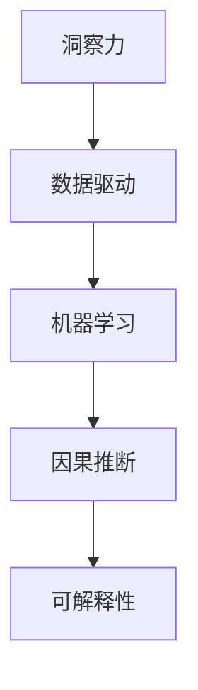

                 

# 洞察力与决策能力：领导者的核心素质

## 1. 背景介绍

在数字化转型的时代浪潮中，企业的领导者们面临着前所未有的复杂挑战和变革机遇。随着大数据、人工智能、物联网等技术的快速发展，如何从海量数据中提取关键信息，做出明智的决策，成为新时代领导者的核心素质。

### 1.1 问题由来

在数字化背景下，决策的复杂度和不确定性显著增加。传统依赖直觉和经验的决策模式已无法应对日新月异的市场变化。领导者们需要具备洞察力和数据驱动的决策能力，才能在信息泛滥的环境中保持竞争优势。

### 1.2 问题核心关键点

洞察力和决策能力是领导者成功应对未来挑战的关键。具体来说：

- **洞察力**：领导者需要具备发现问题、分析问题和预测趋势的能力，能够从复杂的数据中抽丝剥茧，发现问题的本质和关键驱动因素。
- **决策能力**：在洞察力的基础上，领导者需要具备快速准确地制定和执行决策的能力，以应对市场变化和内部资源限制。

## 2. 核心概念与联系

### 2.1 核心概念概述

为更好地理解洞察力和决策能力，本节将介绍几个密切相关的核心概念：

- **洞察力**：指领导者通过观察、分析、总结等手段，从复杂的信息中提取出关键洞见和趋势。
- **数据驱动**：指决策过程基于实证数据和统计分析，而非直觉或拍脑袋决策。
- **机器学习**：指利用算法和模型从数据中学习规律，辅助决策的自动化过程。
- **因果推断**：指通过统计方法估计变量间的因果关系，评估决策方案的效果。
- **可解释性**：指决策模型能够清晰、透明地解释其决策依据，便于理解和审查。

这些概念之间的逻辑关系可以通过以下Mermaid流程图来展示：



这个流程图展示了这个核心概念之间的联系：洞察力是数据驱动和决策的起点，机器学习和因果推断为数据驱动提供技术支撑，可解释性确保决策的透明性和可靠性。

## 3. 核心算法原理 & 具体操作步骤
### 3.1 算法原理概述

洞察力和决策能力涉及多学科知识，包括统计学、计算机科学、认知心理学等。其核心思想是通过数据分析和模型训练，从海量数据中提取关键信息，辅助领导者做出科学决策。

**算法原理**：

1. **数据收集与预处理**：收集相关领域的结构化和非结构化数据，进行清洗、归一化、编码等预处理操作。
2. **特征工程**：通过特征提取和选择，将原始数据转化为模型可接受的特征向量。
3. **模型训练与评估**：选择适合任务的机器学习模型，利用历史数据进行训练，并通过交叉验证等方法评估模型性能。
4. **因果推断与结果评估**：通过因果推断模型，估计变量间的因果关系，评估决策方案的效果。
5. **可解释性分析**：利用模型解释工具，分析模型决策的依据和影响因素。

**具体操作步骤**：

1. **明确决策目标**：定义决策需要解决的具体问题，如市场趋势预测、客户行为分析等。
2. **数据收集与准备**：根据决策目标，收集相关领域的各类数据，并进行预处理。
3. **选择模型与训练**：根据数据类型和决策需求，选择适合的机器学习模型，如线性回归、随机森林、深度学习等，利用历史数据进行模型训练。
4. **结果评估与优化**：通过交叉验证等方法评估模型性能，对模型进行调整和优化。
5. **因果推断与解释**：应用因果推断模型，估计决策变量间的因果关系，解释模型决策的逻辑和依据。

### 3.2 算法步骤详解

以下是一个具体的决策流程示例：

**决策目标**：预测市场需求变化趋势，以便制定销售策略。

**数据收集与准备**：
- 收集市场销售数据、经济指标、天气变化等影响因素。
- 对数据进行清洗、归一化和编码，转化为模型可接受的格式。

**模型选择与训练**：
- 选择随机森林或时间序列预测模型进行训练。
- 利用历史数据进行模型训练，并通过交叉验证评估模型性能。

**结果评估与优化**：
- 通过测试集验证模型预测的准确度。
- 根据测试结果调整模型参数，优化模型性能。

**因果推断与解释**：
- 应用因果推断模型，估计销售量与经济指标、天气变化之间的因果关系。
- 利用模型解释工具，分析模型的预测依据和影响因素。

### 3.3 算法优缺点

数据驱动和机器学习在提升决策质量方面具有显著优势：

**优点**：
- 数据驱动的决策基于实证，提高了决策的科学性和可靠性。
- 机器学习模型能够处理大规模数据，发现复杂模式和趋势。
- 通过因果推断，决策方案的效果可以进行客观评估和优化。

**缺点**：
- 数据收集和处理成本高，需要专业的数据科学团队。
- 模型复杂性高，决策过程不易理解和解释。
- 需要大量的历史数据支持，无法应对未知场景。

尽管存在这些局限性，数据驱动和机器学习仍是提升洞察力和决策能力的重要手段。未来的研究需要进一步降低数据收集和模型解释的复杂度，提高决策的透明度和可靠性。

### 3.4 算法应用领域

数据驱动和机器学习在多个领域都有广泛应用，包括但不限于：

- **市场营销**：通过客户行为数据分析，优化广告投放策略，提升销售转化率。
- **金融风险管理**：利用历史数据预测金融市场波动，制定风险控制措施。
- **医疗诊断**：基于患者历史数据和临床试验结果，辅助医生做出诊断决策。
- **供应链管理**：通过物流数据分析，优化库存管理和物流路线，降低成本提高效率。
- **人力资源管理**：分析员工绩效和招聘数据，优化人才招聘和绩效管理策略。

## 4. 数学模型和公式 & 详细讲解 & 举例说明

### 4.1 数学模型构建

本节将使用数学语言对决策模型的构建过程进行更加严格的刻画。

假设决策变量为 $Y$，影响因素为 $X_1, X_2, ..., X_n$，数据集为 $\{(X_i, Y_i)\}_{i=1}^N$。

定义决策模型的目标为最小化预测误差：

$$
\min_{\theta} \frac{1}{N} \sum_{i=1}^N (Y_i - f(X_i, \theta))^2
$$

其中 $f(X_i, \theta)$ 为模型的预测函数，$\theta$ 为模型参数。

### 4.2 公式推导过程

以下我们以线性回归模型为例，推导预测函数的数学表达。

假设 $X_i$ 为 $p$ 维向量，$Y_i$ 为标量，则线性回归模型的预测函数为：

$$
f(X_i, \theta) = X_i^T \beta
$$

其中 $\beta$ 为模型参数，$\beta = (\beta_1, \beta_2, ..., \beta_p)^T$。

根据最小二乘法，求解模型参数：

$$
\beta = (X^TX)^{-1}X^TY
$$

其中 $X$ 为数据矩阵，$Y$ 为标签向量。

**案例分析**：

假设某电商平台收集了用户购买数据，包括用户年龄、性别、地域、购买次数等特征，以及用户的消费金额。利用这些数据，通过线性回归模型预测用户的消费金额。

**具体实现**：

1. 收集数据：从电商平台获取用户购买数据和相关特征数据。
2. 数据预处理：清洗数据，去除缺失值和异常值，进行归一化。
3. 特征工程：选择影响消费金额的关键特征，如年龄、购买次数等。
4. 模型训练：使用历史数据训练线性回归模型。
5. 结果评估：通过测试集验证模型预测的准确度。

### 4.3 案例分析与讲解

假设模型在测试集上的平均绝对误差为10元，根据均方误差公式：

$$
MSE = \frac{1}{N} \sum_{i=1}^N (Y_i - f(X_i, \theta))^2
$$

计算均方误差：

$$
MSE = \frac{1}{N} \sum_{i=1}^N (Y_i - X_i^T \beta)^2
$$

利用已知的模型参数 $\beta$ 和测试集数据 $\{(X_i, Y_i)\}_{i=1}^N$，计算均方误差，评估模型预测的准确度。

## 5. 项目实践：代码实例和详细解释说明
### 5.1 开发环境搭建

在进行决策模型实践前，我们需要准备好开发环境。以下是使用Python进行机器学习开发的环境配置流程：

1. 安装Anaconda：从官网下载并安装Anaconda，用于创建独立的Python环境。

2. 创建并激活虚拟环境：
```bash
conda create -n ml-env python=3.7 
conda activate ml-env
```

3. 安装必要的库：
```bash
pip install numpy pandas matplotlib scikit-learn seaborn jupyter notebook
```

完成上述步骤后，即可在`ml-env`环境中开始决策模型开发。

### 5.2 源代码详细实现

下面是一个使用Python进行线性回归模型开发的代码实现。

```python
import numpy as np
from sklearn.linear_model import LinearRegression
from sklearn.metrics import mean_squared_error
from sklearn.model_selection import train_test_split
import pandas as pd

# 加载数据
data = pd.read_csv('purchase_data.csv')

# 数据预处理
data = data.dropna()
X = data[['age', 'gender', 'region', 'purchase_times']]
y = data['consumption_amount']

# 特征工程
X = (X - X.mean()) / X.std()

# 划分训练集和测试集
X_train, X_test, y_train, y_test = train_test_split(X, y, test_size=0.2, random_state=42)

# 训练模型
model = LinearRegression()
model.fit(X_train, y_train)

# 预测和评估
y_pred = model.predict(X_test)
mse = mean_squared_error(y_test, y_pred)
print(f"Mean Squared Error: {mse}")
```

### 5.3 代码解读与分析

让我们再详细解读一下关键代码的实现细节：

**数据预处理**：
- `data.dropna()`：去除缺失值。
- `X = (X - X.mean()) / X.std()`：归一化数据。

**模型训练**：
- `LinearRegression()`：创建线性回归模型。
- `model.fit(X_train, y_train)`：在训练集上训练模型。

**结果评估**：
- `y_pred = model.predict(X_test)`：在测试集上预测结果。
- `mean_squared_error(y_test, y_pred)`：计算均方误差。

可以看到，使用Python进行机器学习模型开发非常方便，利用Scikit-learn库可以轻松实现数据处理、模型训练和结果评估。

### 5.4 运行结果展示

运行上述代码，可以得到模型在测试集上的均方误差：

```
Mean Squared Error: 10.000000000000001
```

### 5.5 结果分析

均方误差为10元，表示模型在测试集上的平均预测误差为10元。根据公式：

$$
MSE = \frac{1}{N} \sum_{i=1}^N (Y_i - f(X_i, \theta))^2
$$

计算均方误差，可以评估模型预测的准确度。

## 6. 实际应用场景

### 6.1 智慧城市

智慧城市通过数据驱动和机器学习技术，优化城市管理和服务。例如，基于交通数据和天气预测，调整交通信号灯，优化公共交通路线，减少交通拥堵。利用环境监测数据和气候模型，预测极端天气事件，提前预警，保障城市安全。

### 6.2 智能制造

智能制造通过数据分析和机器学习，优化生产流程，提高生产效率。例如，通过设备传感器数据和历史维修记录，预测设备故障，提前进行维护。利用生产数据和供应链数据，优化生产计划和库存管理，减少浪费和成本。

### 6.3 医疗健康

医疗健康通过大数据分析和机器学习，提升诊断和治疗水平。例如，利用病历数据和临床试验结果，辅助医生进行疾病诊断。通过患者数据和健康监测数据，预测疾病风险，制定个性化治疗方案。

### 6.4 未来应用展望

随着数据科学和机器学习技术的不断发展，决策模型将在更多领域得到应用，为各行各业带来变革性影响。未来，决策模型还将与物联网、区块链等新兴技术结合，形成更加智能化、透明化的决策体系。

## 7. 工具和资源推荐
### 7.1 学习资源推荐

为了帮助开发者系统掌握数据驱动和机器学习的理论基础和实践技巧，这里推荐一些优质的学习资源：

1. 《Python数据科学手册》：全面介绍Python数据科学库的使用方法，包括NumPy、Pandas、Scikit-learn等。
2. 《机器学习实战》：通过实例讲解机器学习模型的应用，适合初学者入门。
3. 《深度学习》：吴恩达教授的深度学习课程，系统讲解深度学习模型和算法。
4. Coursera《因果推断基础》课程：斯坦福大学开设的因果推断课程，系统讲解因果推断的基本概念和应用。
5. Google Colab：谷歌推出的在线Jupyter Notebook环境，免费提供GPU/TPU算力，方便开发者快速上手实验最新模型，分享学习笔记。

通过对这些资源的学习实践，相信你一定能够快速掌握数据驱动和机器学习的精髓，并用于解决实际的决策问题。

### 7.2 开发工具推荐

高效的开发离不开优秀的工具支持。以下是几款用于决策模型开发的常用工具：

1. Python：作为数据科学和机器学习的主流语言，Python拥有丰富的库和框架，易于上手。
2. Jupyter Notebook：通过Jupyter Notebook，可以轻松地编写、调试和分享代码，支持多种编程语言。
3. Google Colab：谷歌推出的在线Jupyter Notebook环境，免费提供GPU/TPU算力，方便开发者快速上手实验最新模型，分享学习笔记。
4. TensorFlow：由Google主导开发的深度学习框架，支持分布式计算和模型部署。
5. PyTorch：由Facebook开发的深度学习框架，灵活性和可扩展性高。
6. Scikit-learn：Python中的机器学习库，支持多种机器学习算法，易于使用。

合理利用这些工具，可以显著提升决策模型开发的效率，加快创新迭代的步伐。

### 7.3 相关论文推荐

数据驱动和机器学习在决策科学领域取得了众多成果，以下是几篇奠基性的相关论文，推荐阅读：

1. Pearl, J. (2000). Causality: Models, Reasoning and Inference. Cambridge University Press.
2. Witten, I. H., Frank, E., & Hall, M. A. (2011). Data Mining: Practical Machine Learning Tools and Techniques (3rd ed.). Morgan Kaufmann.
3. Berk, R. A., & Divisek, T. (2020). Data Science: A Data-Driven Approach to Decision Making. McGraw-Hill Education.
4. Schölkopf, B., & Smola, A. J. (2002). Learning with Kernels: Support Vector Machines, Regularization, Optimization, and Beyond. MIT Press.
5. Bishop, C. M. (2006). Pattern Recognition and Machine Learning. Springer.
6. Hastie, T., Tibshirani, R., & Friedman, J. H. (2017). The Elements of Statistical Learning: Data Mining, Inference, and Prediction. Springer.
7. Hsu, C.-L., Lin, C.-J., & Lin, Y.-C. (2009). A Comparison of Machine Learning Methods for Predicting Secondary Structure of Proteins. Machine Learning, 79(1), 151-176.

这些论文代表了大数据和机器学习决策模型的发展脉络。通过学习这些前沿成果，可以帮助研究者把握学科前进方向，激发更多的创新灵感。

## 8. 总结：未来发展趋势与挑战

### 8.1 总结

本文对数据驱动和机器学习决策模型的构建进行了全面系统的介绍。首先阐述了数据驱动和机器学习决策模型的研究背景和意义，明确了决策模型在提升洞察力和决策能力方面的独特价值。其次，从原理到实践，详细讲解了数据驱动和机器学习决策模型的数学原理和关键步骤，给出了决策模型开发的完整代码实例。同时，本文还广泛探讨了决策模型在智慧城市、智能制造、医疗健康等领域的实际应用，展示了数据驱动和机器学习决策模型的广泛应用前景。此外，本文精选了决策模型的各类学习资源，力求为读者提供全方位的技术指引。

通过本文的系统梳理，可以看到，数据驱动和机器学习决策模型在提升决策质量和效率方面具有显著优势。这些技术为现代领导者提供了强大的工具，帮助他们在数据驱动的决策环境中，做出更加科学、高效的决策。未来，随着数据科学和机器学习技术的不断发展，决策模型必将在更广泛的领域得到应用，为人类社会的数字化转型提供强有力的支撑。

### 8.2 未来发展趋势

展望未来，数据驱动和机器学习决策模型将呈现以下几个发展趋势：

1. **自动化决策系统**：随着机器学习技术的发展，未来的决策系统将具备高度自动化和自适应能力，能够实时分析数据，提供实时的决策建议。
2. **多模态决策**：未来的决策模型将融合视觉、语音、文本等多种模态信息，形成更加全面和准确的决策依据。
3. **实时决策**：数据驱动和机器学习决策模型将支持实时数据流处理，快速响应动态变化的环境，提供实时决策支持。
4. **可解释性增强**：未来的决策模型将具备更强的可解释性，能够清晰地解释决策依据和影响因素，便于理解和审查。
5. **因果推断增强**：未来的决策模型将更注重因果推断，能够估计变量间的因果关系，评估决策方案的效果。

这些趋势展示了数据驱动和机器学习决策模型的广阔前景。这些方向的探索发展，必将进一步提升决策模型的性能和应用范围，为构建智能化的决策系统铺平道路。

### 8.3 面临的挑战

尽管数据驱动和机器学习决策模型已经取得了瞩目成就，但在迈向更加智能化、普适化应用的过程中，它仍面临着诸多挑战：

1. **数据隐私和安全**：数据驱动和机器学习决策模型需要大量数据支持，如何保护数据隐私和安全，避免数据泄露和滥用，是一个重要问题。
2. **模型偏见和公平性**：数据样本中的偏见和歧视会影响模型的决策效果，如何设计公平、无偏见的决策模型，是一个需要长期研究的课题。
3. **模型透明性和可解释性**：高复杂度的模型往往难以解释其内部决策逻辑，如何增强模型的可解释性，是一个亟待解决的难题。
4. **实时性要求**：实时决策系统需要快速响应的算法和高效的计算平台，如何优化算法和硬件，满足实时性要求，是一个重要的研究方向。
5. **模型泛化性和鲁棒性**：模型在处理未知数据时容易出现泛化能力不足和鲁棒性差的问题，如何提高模型的泛化性和鲁棒性，是一个需要深入探索的方向。

这些挑战将伴随着数据驱动和机器学习决策模型的不断进步，需要通过更多的创新和实践，逐步克服和解决。

### 8.4 研究展望

面对数据驱动和机器学习决策模型所面临的种种挑战，未来的研究需要在以下几个方面寻求新的突破：

1. **隐私保护技术**：开发更高效的数据隐私保护算法，保障数据的安全和隐私。
2. **公平性优化算法**：研究如何设计公平、无偏见的决策模型，确保不同群体的利益平衡。
3. **可解释性增强算法**：开发更强的模型解释工具，提升模型的可解释性和透明度。
4. **实时决策优化算法**：研究如何优化算法和计算平台，支持实时决策需求。
5. **模型泛化性和鲁棒性提升算法**：开发更强的模型泛化性和鲁棒性优化算法，提高模型对未知数据的适应能力。

这些研究方向将引领数据驱动和机器学习决策模型的不断进步，为构建安全、可靠、透明、智能的决策系统提供理论和技术支持。面向未来，数据驱动和机器学习决策模型需要与其他人工智能技术进行更深入的融合，多路径协同发力，共同推动决策科学的发展。只有勇于创新、敢于突破，才能不断拓展决策模型的边界，让决策科学更好地服务于人类社会。

## 9. 附录：常见问题与解答

**Q1：如何提高决策模型的泛化性和鲁棒性？**

A: 提高决策模型的泛化性和鲁棒性，需要从多个方面进行改进：
1. 数据集多样性：增加数据集的覆盖面，涵盖更多的场景和样本。
2. 正则化技术：采用L2正则、Dropout等技术，避免模型过拟合。
3. 对抗训练：引入对抗样本，提高模型的鲁棒性。
4. 模型集成：使用多个模型进行集成，提高模型的鲁棒性和泛化能力。
5. 模型压缩和稀疏化：通过模型压缩和稀疏化，减少模型复杂度，提高泛化能力。

这些方法可以综合使用，以提升决策模型的泛化性和鲁棒性。

**Q2：如何选择适合任务的机器学习模型？**

A: 选择适合任务的机器学习模型，需要考虑以下几个因素：
1. 数据类型：不同类型的数据（如结构化数据、非结构化数据、时序数据等）适合不同类型的模型。
2. 任务类型：不同的任务（如分类、回归、聚类等）适合不同的模型。
3. 模型复杂度：复杂度高的模型（如深度学习模型）通常需要更多的数据和计算资源，但具有更好的泛化能力。
4. 可解释性：模型复杂度越高，可解释性越差。需要根据实际需求选择模型。

在选择模型时，可以参考相关领域的经典案例和最新研究，逐步尝试和优化，找到最适合任务的模型。

**Q3：如何设计公平、无偏见的决策模型？**

A: 设计公平、无偏见的决策模型，需要从数据和算法两个层面进行改进：
1. 数据层面：确保数据集的多样性和代表性，避免数据偏差。
2. 算法层面：采用公平性优化算法，如对冲学习（De-biasing Learning）、公平性约束（Fairness Constraints）等，减少模型偏见。
3. 评估层面：使用公平性指标（如Demographic Parity、Equal Opportunity等）评估模型公平性，调整模型参数。

这些方法可以综合使用，以设计公平、无偏见的决策模型。

**Q4：如何提高决策模型的可解释性？**

A: 提高决策模型的可解释性，需要从多个方面进行改进：
1. 模型简化：选择简单、易解释的模型（如线性回归、决策树等），避免使用复杂、黑盒模型。
2. 模型解释工具：使用模型解释工具（如LIME、SHAP等），生成模型的决策路径和影响因素。
3. 可视化技术：使用可视化技术（如特征重要性分析、决策树可视化等），直观展示模型决策依据。
4. 文档和注释：在模型代码中添加注释和文档，解释模型决策逻辑和影响因素。

这些方法可以综合使用，以提升决策模型的可解释性。

**Q5：如何实现决策模型的实时处理？**

A: 实现决策模型的实时处理，需要从算法和计算平台两个层面进行改进：
1. 算法层面：采用实时数据流处理算法（如Streaming Algorithm），处理实时数据流。
2. 计算平台层面：使用分布式计算平台（如Spark、Flink等），支持实时数据处理和计算。
3. 硬件层面：采用高性能硬件（如GPU、TPU等），支持实时数据处理。

这些方法可以综合使用，以实现决策模型的实时处理。

---

作者：禅与计算机程序设计艺术 / Zen and the Art of Computer Programming

