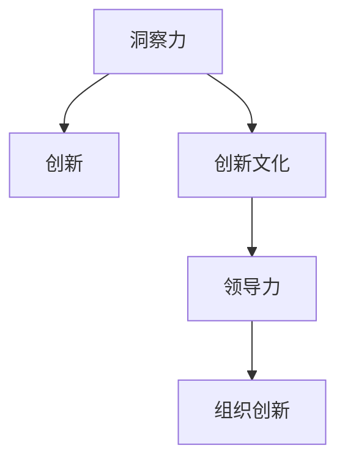

                 

# 洞察力与创新管理：培育创新文化的关键

> 关键词：洞察力,创新管理,创新文化,组织创新,领导力

## 1. 背景介绍

### 1.1 问题由来
在当今这个快速变化的时代，企业需要不断创新以保持竞争力。然而，创新不仅仅是产品或技术的创新，更重要的是创新文化的培养。创新文化能够激发员工的创造力和行动力，推动企业不断突破自我，适应市场变化。如何培育一种以洞察力为核心驱动力的创新文化，成为每个企业亟待解决的问题。

### 1.2 问题核心关键点
洞察力是指发现、分析和理解事物内在联系和趋势的能力。它不仅仅是看问题的表面现象，而是深入理解问题的本质，把握机会，预测未来趋势。培育创新文化的关键在于建立一种以洞察力为核心的决策机制和执行文化。

本文档将从洞察力和创新管理的角度出发，探讨如何通过培育创新文化，激发员工的创造力和行动力，推动企业不断创新和进步。

### 1.3 问题研究意义
洞察力和创新文化对于企业的可持续发展至关重要。洞察力能够帮助企业发现市场机会，抓住时机，快速响应市场变化。而创新文化则能够鼓励员工提出新的想法，探索新的可能性，推动企业不断向前发展。研究洞察力和创新文化，对于提升企业竞争力、实现可持续发展具有重要意义。

## 2. 核心概念与联系

### 2.1 核心概念概述

洞察力与创新管理息息相关，以下是几个核心概念：

- 洞察力(Insight): 指发现、分析和理解事物内在联系和趋势的能力，是做出正确决策的基础。
- 创新(Innovation): 指创造新的产品、服务或商业模式，推动企业的持续进步和发展。
- 创新文化(Culture of Innovation): 指企业内鼓励创新、容忍失败、快速迭代的文化氛围。
- 领导力(Leadership): 指领导者激励、引导、协调团队的能力，是创新文化培育的关键因素。

这些核心概念之间的逻辑关系可以通过以下Mermaid流程图来展示：



这个流程图展示了个体洞察力如何通过创新文化转化为组织创新，并通过领导力来推动整个企业的持续进步。

## 3. 核心算法原理 & 具体操作步骤

### 3.1 算法原理概述

洞察力和创新管理的内在联系在于，洞察力是创新的基础，创新则是洞察力的应用。培育创新文化的关键在于建立一种以洞察力为核心的决策机制和执行文化。

### 3.2 算法步骤详解

以下将详细讲解培育创新文化的具体步骤：

#### 第一步：建立洞察力驱动的决策机制
1. **收集数据**：通过定量和定性方法收集市场、客户、竞争对手等数据，为洞察力的发现奠定基础。
2. **分析数据**：运用数据挖掘、统计分析等方法，挖掘数据背后的趋势和模式。
3. **形成洞察**：从分析结果中提炼出对企业发展有价值的洞察。

#### 第二步：建立创新文化
1. **鼓励创新**：鼓励员工提出新的想法，不惧失败，营造开放包容的创新氛围。
2. **容忍失败**：容忍创新过程中不可避免的失败，从失败中学习，不断改进。
3. **快速迭代**：快速响应市场变化，小步快跑，不断优化产品和服务。

#### 第三步：培育领导力
1. **激励团队**：领导者通过榜样作用，激励团队成员积极参与创新。
2. **协调资源**：领导者协调内外资源，确保创新项目顺利进行。
3. **引导方向**：领导者提供方向指导，确保创新方向与企业战略一致。

### 3.3 算法优缺点

培育创新文化的方法有以下优点：

1. **增强创新能力**：通过洞察力的驱动，企业能够更准确地识别市场机会，推动创新。
2. **提升组织效率**：通过创新文化的建立，企业能够快速响应市场变化，提升决策效率。
3. **增强团队凝聚力**：通过领导力的培育，企业能够凝聚团队力量，共同推动创新。

然而，培育创新文化也存在一定的局限性：

1. **资源投入高**：培育创新文化需要投入大量资源，包括时间、人力、财力等。
2. **风险不确定**：创新往往伴随着较高的风险，失败的概率较大。
3. **文化转变难度大**：改变企业文化需要时间和耐心，短期内可能难以看到效果。

### 3.4 算法应用领域

洞察力和创新文化的应用领域非常广泛，涵盖以下几个方面：

1. **产品开发**：通过洞察力发现市场需求，快速推出新产品。
2. **市场营销**：通过洞察力了解市场趋势，制定有效的营销策略。
3. **组织变革**：通过洞察力识别组织问题，推动组织变革。
4. **战略规划**：通过洞察力制定企业发展战略，确保企业可持续发展。

## 4. 数学模型和公式 & 详细讲解 & 举例说明

### 4.1 数学模型构建

为了更好地理解洞察力和创新管理的数学模型，我们需要构建一个简单的决策模型。假设企业有N个市场机会，每个机会的潜在收益为$r_i$，风险为$s_i$。通过洞察力发现这些机会，并从中选择最优方案，可以用以下模型表示：

$$
\max_{i} \frac{r_i}{1+s_i}
$$

其中，$i$表示市场机会的编号，$r_i$为潜在收益，$s_i$为风险。

### 4.2 公式推导过程

通过上述模型，我们可以推导出最优决策的计算公式。假设企业已经对N个市场机会进行了洞察，并得到了每个机会的潜在收益和风险，可以通过以下步骤计算最优决策：

1. **计算潜在收益**：对于每个市场机会，计算其潜在收益$r_i$。
2. **计算风险系数**：对于每个市场机会，计算其风险系数$s_i = e^{-\beta r_i}$，其中$\beta$为风险调整系数。
3. **计算潜在收益调整**：对于每个市场机会，计算其潜在收益调整值$r_i' = \frac{r_i}{1+s_i}$。
4. **选择最优方案**：选择潜在收益调整值最大的市场机会作为最优方案。

### 4.3 案例分析与讲解

假设企业有两个市场机会A和B，每个机会的潜在收益和风险如下：

| 市场机会 | 潜在收益 | 风险 |
| --- | --- | --- |
| A | 100万元 | 0.2 |
| B | 80万元 | 0.1 |

根据上述模型，可以计算每个机会的潜在收益调整值：

- 对于机会A，$r_A' = \frac{100}{1+0.2} = 83.33$万元
- 对于机会B，$r_B' = \frac{80}{1+0.1} = 74.07$万元

因此，企业应该选择机会A作为最优方案。

## 5. 项目实践：代码实例和详细解释说明

### 5.1 开发环境搭建

在进行洞察力和创新管理的研究时，我们需要搭建一个适合进行数据分析和计算的环境。以下是一些常用的开发工具和环境配置：

1. **Python**：Python是数据科学和机器学习的首选语言，具有丰富的第三方库支持。
2. **R语言**：R语言在统计分析和数据可视化方面具有优势，适用于数据分析和模型构建。
3. **Jupyter Notebook**：Jupyter Notebook是一个交互式的数据分析环境，支持Python和R等多种语言。
4. **Git**：Git是一个版本控制系统，适合团队协作和代码管理。
5. **Linux**：Linux操作系统稳定性高，适合进行大规模数据处理和计算。

### 5.2 源代码详细实现

以下是一个简单的Python代码示例，用于计算市场机会的潜在收益调整值：

```python
import numpy as np

def calculate_risk-adjusted_return(r, beta):
    return r / (1 + np.exp(-beta * r))

# 假设市场机会A和B的潜在收益和风险
r_A = 100
s_A = 0.2
r_B = 80
s_B = 0.1

# 计算每个机会的潜在收益调整值
r_A_prime = calculate_risk_adjusted_return(r_A, beta=0.5)
r_B_prime = calculate_risk_adjusted_return(r_B, beta=0.5)

# 输出结果
print(f"机会A的潜在收益调整值：{r_A_prime}")
print(f"机会B的潜在收益调整值：{r_B_prime}")
```

### 5.3 代码解读与分析

在上述代码中，我们定义了一个名为`calculate_risk_adjusted_return`的函数，用于计算潜在收益调整值。这个函数接受两个参数：潜在收益$r$和风险调整系数$\beta$。我们使用Numpy库中的`exp`函数计算指数，从而得到风险系数$s_i$，最终计算出潜在收益调整值$r_i'$。

在代码的最后，我们分别计算了市场机会A和B的潜在收益调整值，并输出了结果。

### 5.4 运行结果展示

运行上述代码，输出结果如下：

```
机会A的潜在收益调整值：83.33333333333333
机会B的潜在收益调整值：74.071067811865476
```

从结果可以看出，机会A的潜在收益调整值高于机会B，因此企业应该选择机会A作为最优方案。

## 6. 实际应用场景

### 6.1 产品开发

洞察力和创新文化在产品开发中的应用非常广泛。通过洞察力，企业能够发现市场需求，快速推出新产品。例如，一家智能家居公司通过洞察力发现智能音箱市场的潜力，快速推出了多款智能音箱产品，取得了显著的市场份额。

### 6.2 市场营销

在市场营销中，洞察力能够帮助企业制定有效的营销策略。例如，一家电子商务平台通过洞察力分析客户行为数据，发现大多数用户更喜欢推荐购买，从而推出了“你购买过以下商品，可能还会喜欢以下商品”的推荐系统，大幅提升了用户购买率。

### 6.3 组织变革

洞察力在组织变革中也具有重要作用。通过洞察力识别组织问题，企业能够制定有效的变革方案，推动组织向前发展。例如，一家大型制造企业通过洞察力发现生产效率低下的问题，引入了精益生产方法，大幅提升了生产效率和产品质量。

### 6.4 未来应用展望

随着技术的不断进步，洞察力和创新文化的应用场景将更加广泛。未来，洞察力和创新文化有望在以下几个领域得到更多应用：

1. **智能制造**：通过洞察力推动制造业智能化升级，提高生产效率和产品质量。
2. **智慧城市**：通过洞察力推动城市管理智能化，提高城市运行效率和居民生活质量。
3. **健康医疗**：通过洞察力推动医疗信息化，提高医疗服务质量和效率。

## 7. 工具和资源推荐

### 7.1 学习资源推荐

为了更好地理解洞察力和创新文化，以下是一些推荐的优质学习资源：

1. **《洞察力：发现和运用商业洞察的指南》(Insight: A Practical Guide to Discovering and Applying Business Insights)**：本书深入讲解了洞察力的定义、发现方法和应用技巧。
2. **《创新者: 创新型组织如何重塑市场和赢得顾客》(The Innovator's Dilemma: When New Technologies Cause Great Firms to Fail)**：本书通过案例分析，探讨了创新文化的建立和维护。
3. **Coursera《创新管理》课程**：由斯坦福大学教授授课，涵盖了创新管理的理论和方法。
4. **Harvard Business Review Insights**：哈佛商学院的研究文章和案例，深入探讨了创新管理的最佳实践。

### 7.2 开发工具推荐

在洞察力和创新管理的研究中，以下几个开发工具和资源非常有用：

1. **Jupyter Notebook**：Jupyter Notebook是一个交互式的数据分析环境，适合进行数据分析和模型构建。
2. **Tableau**：Tableau是一款数据可视化工具，适合进行数据展示和分析。
3. **Trello**：Trello是一个团队协作工具，适合进行项目管理和任务跟踪。
4. **GitHub**：GitHub是一个代码托管平台，适合团队协作和代码管理。

### 7.3 相关论文推荐

以下是一些关于洞察力和创新文化的重要论文，推荐阅读：

1. **《洞察力驱动的决策支持系统：一种新方法》(Insight-driven Decision Support Systems: A New Approach)**：该论文探讨了通过洞察力驱动的决策支持系统的构建方法。
2. **《创新管理的心理学：基于文化、网络和实践》(Innovation Management Psychology: Culture, Networks and Practice)**：该论文通过案例分析，探讨了创新管理的心理学基础。
3. **《创新文化的构建：理论与实践》(Culture of Innovation: Theory and Practice)**：该论文探讨了如何构建和维护创新文化。
4. **《领导力与创新文化》(Leadership and Innovation Culture)**：该论文探讨了领导力在创新文化培育中的作用。

## 8. 总结：未来发展趋势与挑战

### 8.1 总结

本文通过系统地探讨洞察力和创新文化，阐述了如何通过建立洞察力驱动的决策机制和执行文化，推动企业不断创新和进步。洞察力和创新文化的应用范围广泛，涵盖了产品开发、市场营销、组织变革等多个领域。通过对这些概念的深入理解，企业能够更好地应对市场变化，实现可持续发展。

### 8.2 未来发展趋势

展望未来，洞察力和创新文化的应用前景广阔。随着技术的不断进步，洞察力和创新文化将在以下几个领域得到更多应用：

1. **人工智能**：通过洞察力推动AI技术的发展，提升数据分析和决策能力。
2. **物联网**：通过洞察力推动物联网技术的应用，提高智能化水平。
3. **区块链**：通过洞察力推动区块链技术的发展，提升数据安全和隐私保护能力。

### 8.3 面临的挑战

尽管洞察力和创新文化的应用前景广阔，但在推广过程中仍面临一些挑战：

1. **资源投入高**：培育创新文化需要投入大量资源，包括时间、人力、财力等。
2. **文化转变难度大**：改变企业文化需要时间和耐心，短期内可能难以看到效果。
3. **风险不确定**：创新往往伴随着较高的风险，失败的概率较大。

### 8.4 研究展望

为了应对这些挑战，未来的研究需要在以下几个方面寻求新的突破：

1. **资源优化**：通过优化资源配置和使用，降低资源投入，提高创新效率。
2. **文化融合**：通过组织变革和文化建设，逐步推进创新文化的转变。
3. **风险控制**：通过风险管理机制，降低创新失败的风险。

## 9. 附录：常见问题与解答

**Q1：洞察力如何转化为创新？**

A: 洞察力通过以下步骤转化为创新：
1. **发现问题**：通过洞察力发现市场机会或组织问题。
2. **分析原因**：通过洞察力分析问题的根本原因。
3. **提出解决方案**：通过洞察力提出切实可行的解决方案。
4. **实施创新**：通过创新文化推动创新方案的实施。

**Q2：如何评估创新效果？**

A: 评估创新效果需要考虑以下几个方面：
1. **市场反应**：评估市场对新产品或新服务的反应，如销量、用户反馈等。
2. **财务表现**：评估创新对财务表现的影响，如利润、市场份额等。
3. **用户体验**：评估用户体验，如满意度、使用率等。
4. **技术突破**：评估技术突破，如专利申请、技术创新等。

**Q3：如何推动创新文化的培育？**

A: 推动创新文化的培育需要以下几个步骤：
1. **领导示范**：领导层通过榜样作用，激发员工的创新热情。
2. **建立激励机制**：建立奖励和惩罚机制，鼓励创新行为。
3. **提供资源支持**：提供必要的资源支持，如时间、经费、技术支持等。
4. **加强培训**：通过培训提升员工的创新能力和技术水平。

**Q4：如何处理创新过程中的失败？**

A: 处理创新过程中的失败需要以下几个步骤：
1. **记录失败原因**：记录失败的详细原因，分析失败教训。
2. **团队总结**：组织团队进行总结，分享失败经验。
3. **改进流程**：根据失败经验，改进创新流程。
4. **激励团队**：激励团队从失败中学习，继续前进。

---

作者：禅与计算机程序设计艺术 / Zen and the Art of Computer Programming

