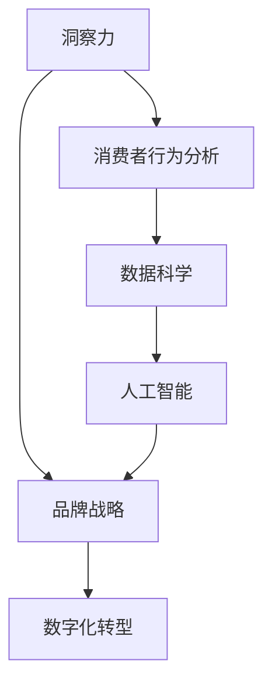

                 

# 洞察力与品牌战略：市场洞察的艺术

> 关键词：洞察力,品牌战略,市场洞察,数据科学,消费者行为分析,数字化转型,人工智能,机器学习

## 1. 背景介绍

### 1.1 问题由来

在当今快速变化的商业环境中，品牌和市场洞察力是企业成功的关键。市场洞察力可以帮助企业理解消费者的需求和行为，制定有效的品牌战略。随着大数据和人工智能技术的发展，市场洞察力变得更加重要。但传统的数据分析方法已无法满足需求，需要引入更先进的技术手段。

### 1.2 问题核心关键点

- **洞察力与品牌战略的关联性**：如何利用洞察力制定有效的品牌战略？
- **数据科学在市场洞察中的应用**：如何利用数据科学提升洞察力的准确性和效率？
- **人工智能与市场洞察的结合**：人工智能如何帮助企业进行市场洞察？

### 1.3 问题研究意义

市场洞察力是企业制定品牌战略的基础，有助于提升企业竞争力。结合数据科学和人工智能技术，可以更全面、准确地理解市场，从而制定出更加有效的品牌战略。这不仅能提升企业的市场表现，还能促进企业的数字化转型，推动行业创新。

## 2. 核心概念与联系

### 2.1 核心概念概述

- **洞察力**：通过数据分析、用户行为研究等方式，获得对市场和消费者行为的深入理解。
- **品牌战略**：企业为实现品牌目标而采取的长期和全面的规划。
- **数据科学**：使用数据和算法来提取有用信息和知识，辅助决策。
- **人工智能**：通过算法和模型来处理大量数据，辅助业务决策。
- **消费者行为分析**：研究消费者的购买行为、偏好等，以指导产品设计和营销策略。
- **数字化转型**：企业利用数字技术和工具，优化业务流程，提升运营效率。

这些核心概念之间相互关联，共同构成企业市场洞察力和品牌战略的框架。

### 2.2 核心概念原理和架构的 Mermaid 流程图



此图展示了市场洞察力和品牌战略的核心概念及它们之间的关系。洞察力通过消费者行为分析，应用数据科学和人工智能技术，最终指导品牌战略的制定，推动企业的数字化转型。

## 3. 核心算法原理 & 具体操作步骤

### 3.1 算法原理概述

市场洞察力和品牌战略的制定涉及多个环节，包括数据收集、消费者行为分析、数据科学建模、人工智能应用等。其核心算法原理是通过数据科学和人工智能技术，分析消费者行为，从中提取有用的洞察力，从而指导品牌战略的制定。

### 3.2 算法步骤详解

#### 3.2.1 数据收集

数据收集是市场洞察力的第一步，包括消费者行为数据、市场趋势数据、竞争对手数据等。数据收集可通过问卷调查、社交媒体分析、销售记录等方式进行。

#### 3.2.2 消费者行为分析

消费者行为分析通过数据分析方法，如聚类分析、回归分析、关联规则挖掘等，识别消费者的需求、偏好和行为模式。

#### 3.2.3 数据科学建模

数据科学建模使用机器学习算法，如分类、回归、聚类等，对消费者行为数据进行分析，提取有用的洞察力。

#### 3.2.4 人工智能应用

人工智能应用通过深度学习、自然语言处理等技术，进一步分析消费者行为数据，提取更深入的洞察力。

#### 3.2.5 洞察力分析与报告

洞察力分析将以上步骤提取的洞察力进行综合分析，形成报告，供品牌战略制定者参考。

### 3.3 算法优缺点

#### 优点：

- **全面性**：数据科学和人工智能技术可以处理大量的数据，全面分析消费者行为。
- **准确性**：机器学习模型能够发现数据中的模式和规律，提升洞察力的准确性。
- **实时性**：人工智能模型可以快速处理实时数据，提供及时的洞察力。

#### 缺点：

- **复杂性**：数据科学和人工智能技术需要专业的知识和技能，操作复杂。
- **数据质量**：数据质量对分析结果有重要影响，低质量的数据可能导致误导性的洞察力。
- **隐私问题**：消费者行为数据可能涉及隐私问题，需要谨慎处理。

### 3.4 算法应用领域

- **零售行业**：通过消费者行为分析，优化库存管理和商品推荐。
- **金融行业**：通过市场趋势分析，预测金融市场变化，制定投资策略。
- **制造业**：通过消费者需求分析，优化产品设计和生产流程。
- **服务业**：通过用户行为分析，提升客户体验和满意度。

## 4. 数学模型和公式 & 详细讲解 & 举例说明

### 4.1 数学模型构建

市场洞察力的分析涉及多个数学模型，包括聚类分析、回归分析、分类模型等。这里以回归分析为例，构建数学模型。

### 4.2 公式推导过程

假设有一个消费者行为数据集，包含购买频率、购买金额、产品类别等特征。回归分析的目标是找到这些特征与购买金额之间的关系，构建回归模型。

$$
Y = \beta_0 + \beta_1 X_1 + \beta_2 X_2 + \ldots + \beta_n X_n + \epsilon
$$

其中，$Y$ 为购买金额，$X_i$ 为第 $i$ 个特征，$\beta_i$ 为特征的系数，$\epsilon$ 为误差项。

通过最小二乘法求解上述方程，可以得到回归系数，从而构建回归模型。

### 4.3 案例分析与讲解

假设有一个电商平台，收集了用户的购买数据。通过回归分析，可以发现购买金额与购买频率之间存在正相关关系。即购买频率越高，购买金额也越高。

## 5. 项目实践：代码实例和详细解释说明

### 5.1 开发环境搭建

为进行市场洞察力的分析，需要搭建合适的开发环境。以下是搭建Python开发环境的步骤：

1. 安装Python：从官网下载并安装Python。
2. 安装必要的库：如Pandas、NumPy、Scikit-Learn等，用于数据处理和建模。
3. 安装可视化工具：如Matplotlib、Seaborn，用于数据可视化。

### 5.2 源代码详细实现

以下是使用Python和Scikit-Learn库进行消费者行为分析的代码实现。

```python
import pandas as pd
from sklearn.linear_model import LinearRegression
from sklearn.model_selection import train_test_split
from sklearn.metrics import mean_squared_error

# 加载数据
data = pd.read_csv('consumer_data.csv')

# 特征工程
X = data[['purchase_frequency', 'product_category']]
y = data['purchase_amount']

# 数据分割
X_train, X_test, y_train, y_test = train_test_split(X, y, test_size=0.2, random_state=42)

# 构建模型
model = LinearRegression()
model.fit(X_train, y_train)

# 预测和评估
y_pred = model.predict(X_test)
mse = mean_squared_error(y_test, y_pred)
print('均方误差:', mse)
```

### 5.3 代码解读与分析

代码首先加载数据，进行特征工程，将购买频率和产品类别作为特征，购买金额作为目标变量。接着，使用train_test_split函数将数据分为训练集和测试集。然后，构建线性回归模型，并用训练集进行拟合。最后，使用测试集进行预测和评估，输出均方误差。

### 5.4 运行结果展示

运行代码后，输出均方误差。均方误差越小，说明模型预测的准确性越高。

## 6. 实际应用场景

### 6.1 智能零售

智能零售通过消费者行为分析，优化商品推荐和库存管理，提升用户体验和销售业绩。通过数据科学和人工智能技术，可以精准预测消费者需求，优化供应链管理。

### 6.2 金融市场

金融市场利用市场趋势分析，预测股票价格变化，制定投资策略。通过机器学习模型，可以实时监测市场动态，辅助投资决策。

### 6.3 制造业

制造业通过消费者需求分析，优化产品设计和生产流程。通过数据科学和人工智能技术，可以识别出消费者对产品的偏好和需求，指导产品开发。

### 6.4 未来应用展望

未来，市场洞察力和品牌战略的制定将更加依赖于人工智能技术。通过大数据和深度学习技术，可以更全面、准确地理解市场和消费者，从而制定出更加有效的品牌战略。同时，数据隐私和安全也将成为关注的重点。

## 7. 工具和资源推荐

### 7.1 学习资源推荐

- **《数据科学导论》**：介绍数据科学的基本概念和应用，适合初学者学习。
- **Coursera 数据科学课程**：由斯坦福大学开设，系统介绍数据科学的基础知识和实践技能。
- **Kaggle**：数据科学竞赛平台，提供大量真实的数据集和竞赛，提升实践能力。

### 7.2 开发工具推荐

- **Jupyter Notebook**：数据科学和机器学习常用的开发环境，支持代码执行和可视化。
- **TensorFlow**：开源深度学习框架，适合进行复杂的数据建模和分析。
- **Matplotlib**：Python的绘图库，用于数据可视化。

### 7.3 相关论文推荐

- **《消费者行为分析与建模》**：介绍消费者行为分析的基本方法和应用。
- **《大数据时代下的市场洞察》**：讨论大数据技术在市场洞察中的应用。

## 8. 总结：未来发展趋势与挑战

### 8.1 研究成果总结

本文系统介绍了市场洞察力和品牌战略的制定方法，通过数据科学和人工智能技术，全面分析消费者行为，提升洞察力的准确性和效率。

### 8.2 未来发展趋势

1. **技术进步**：随着技术的不断进步，市场洞察力分析将更加全面和精准。
2. **数据质量提升**：数据质量对分析结果有重要影响，未来将更加注重数据质量管理。
3. **隐私保护**：数据隐私和安全问题将成为关注的重点，需要采用更先进的技术手段。

### 8.3 面临的挑战

1. **数据隐私**：消费者行为数据涉及隐私问题，需要谨慎处理。
2. **数据质量**：低质量的数据可能导致误导性的洞察力。
3. **技术复杂性**：数据科学和人工智能技术需要专业的知识和技能。

### 8.4 研究展望

未来，市场洞察力和品牌战略的制定将更加依赖于数据科学和人工智能技术，需要不断提升技术水平和数据质量管理能力。同时，隐私保护和数据安全问题也需要引起重视。

## 9. 附录：常见问题与解答

### Q1: 什么是市场洞察力？

A: 市场洞察力是通过数据分析和消费者行为研究，获得对市场和消费者行为的深入理解。

### Q2: 数据科学和人工智能在市场洞察中的应用有哪些？

A: 数据科学和人工智能可以用于消费者行为分析、市场趋势预测、竞争对手分析等，提升洞察力的准确性和效率。

### Q3: 如何处理数据隐私问题？

A: 数据隐私问题可以通过匿名化、加密等方式处理，确保数据安全。

### Q4: 数据质量对洞察力分析结果有哪些影响？

A: 数据质量对洞察力分析结果有重要影响，低质量的数据可能导致误导性的洞察力，需要注重数据质量管理。

### Q5: 市场洞察力和品牌战略的制定有何关联？

A: 市场洞察力是品牌战略制定的基础，通过分析市场和消费者行为，制定有效的品牌战略，提升企业竞争力。

