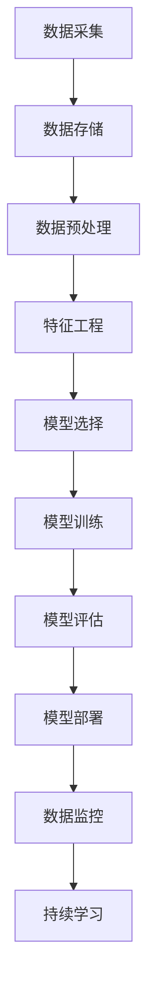

                 

# 洞察力与预测：未来思维的培养

> 关键词：数据洞察, 预测模型, 机器学习, 数据科学, 深度学习, 大数据, 未来思维, 人工智能

## 1. 背景介绍

### 1.1 问题由来
在当今快速变化的商业和科技环境中，企业需要不断适应并预测未来的趋势和变化。传统的数据分析和业务洞察方法，往往无法满足对动态市场环境的快速反应和深度理解需求。如何在海量数据中挖掘出有价值的洞见，并进行高效准确的预测，是当前企业关注的焦点。

### 1.2 问题核心关键点
机器学习和大数据技术的迅猛发展，为解决这一问题提供了新的思路。通过构建强大的预测模型，企业可以从历史数据中挖掘出有价值的洞见，并准确预测未来的市场变化和趋势。机器学习和大数据技术的核心在于“洞察力与预测”，即通过数据挖掘和建模，从历史数据中提取规律和趋势，并基于这些洞见进行未来预测。

### 1.3 问题研究意义
1. 提升决策效率：通过机器学习和数据科学方法，企业可以快速从数据中挖掘出有价值的洞察，辅助决策。
2. 优化业务流程：基于预测模型的自动化决策，可以优化业务流程，提高效率。
3. 创造新价值：洞察和预测能力的提升，有助于企业发掘新商机，实现创新。
4. 增强市场竞争力：准确的市场预测和业务洞察，使企业在竞争中占据优势。

## 2. 核心概念与联系

### 2.1 核心概念概述

为更好地理解“洞察力与预测”，本节将介绍几个关键概念：

- 数据洞察(Data Insights)：从原始数据中挖掘出有用的信息和规律，辅助决策。
- 预测模型(Prediction Model)：利用机器学习算法建立的数据模型，对未来进行预测。
- 数据科学(Data Science)：一门通过数据分析、建模和可视化等手段，提取数据价值并进行决策的学科。
- 深度学习(Deep Learning)：一种基于神经网络算法的机器学习技术，用于处理非结构化数据。
- 大数据(Big Data)：处理和分析海量数据的技术和工具，包括数据采集、存储、处理和分析等。
- 未来思维(Future Thinking)：一种以数据和模型为基础，预测未来趋势，并制定战略规划的思维方式。

这些核心概念之间相互关联，共同构成了“洞察力与预测”的核心框架，为企业的数据驱动决策提供了坚实的理论基础和实用工具。

### 2.2 核心概念原理和架构的 Mermaid 流程图(Mermaid 流程节点中不要有括号、逗号等特殊字符)


这个流程图展示了“洞察力与预测”的主要流程：
1. 从数据采集到模型部署，企业需要经过数据采集、存储、预处理、特征工程、模型训练、评估、部署等多个步骤。
2. 数据监控和持续学习是模型长期有效运行的重要环节。

## 3. 核心算法原理 & 具体操作步骤

### 3.1 算法原理概述

“洞察力与预测”的核心算法，是基于数据科学的建模和预测技术。其基本原理是通过数据分析和机器学习算法，从历史数据中提取有价值的洞察，并基于这些洞察进行未来预测。

形式化地，设历史数据集为 $D=\{(x_i,y_i)\}_{i=1}^N, x_i \in \mathcal{X}, y_i \in \mathcal{Y}$，其中 $x_i$ 表示输入特征，$y_i$ 表示输出标签。模型的目标是找到一个映射函数 $f: \mathcal{X} \rightarrow \mathcal{Y}$，使得 $f(x_i)$ 尽可能逼近 $y_i$。通过最小化损失函数 $\mathcal{L}(f)$，优化模型参数 $\theta$，最终得到预测函数 $f^*(x)=M_{\theta}(x)$。

### 3.2 算法步骤详解

基于“洞察力与预测”的建模和预测流程，一般包括以下几个关键步骤：

**Step 1: 数据采集与预处理**
- 收集企业内外部数据，如销售记录、市场调研、客户反馈等。
- 对数据进行清洗、去重、填充缺失值等预处理操作，确保数据质量。

**Step 2: 特征工程**
- 从原始数据中提取有意义的特征，如时间特征、地理位置、用户行为等。
- 应用特征工程技术，如编码、归一化、降维等，增强特征的表达能力。

**Step 3: 模型选择与训练**
- 根据数据特点和业务需求，选择合适的机器学习算法，如线性回归、决策树、随机森林、神经网络等。
- 使用训练数据集对模型进行训练，最小化损失函数，更新模型参数。

**Step 4: 模型评估与优化**
- 在验证数据集上评估模型性能，如均方误差(MSE)、均方根误差(RMSE)、R^2等指标。
- 根据评估结果，调整模型参数、特征工程策略等，优化模型性能。

**Step 5: 模型部署与应用**
- 将优化后的模型部署到生产环境，进行实时预测。
- 集成模型到业务系统中，辅助业务决策和运营。

**Step 6: 数据监控与持续学习**
- 实时监控模型性能，及时发现异常和偏差。
- 定期更新模型，加入新数据，进行持续学习和优化。

### 3.3 算法优缺点

基于“洞察力与预测”的算法，具有以下优点：
1. 高效自动化：通过机器学习和自动化工具，可以快速从大量数据中提取洞见和预测，减少人工干预。
2. 灵活性高：模型可以根据数据特点和业务需求进行灵活调整，适应不同场景。
3. 预测准确：通过数据驱动的建模，可以提供较高的预测准确度。
4. 自动化决策：模型可以辅助决策过程，提升决策效率和质量。

同时，该算法也存在一些局限性：
1. 数据质量要求高：模型性能依赖于数据质量，需保证数据的完整性、一致性和代表性。
2. 模型解释性不足：许多高级算法如深度学习模型难以解释其内部决策逻辑。
3. 需要专家知识：构建高质量的预测模型，需要数据科学家和领域专家的配合。
4. 算法复杂度高：高级模型如深度学习，需要较高的计算资源和时间成本。
5. 风险偏见：模型可能因训练数据偏差而产生偏见，影响预测结果。

尽管存在这些局限性，基于“洞察力与预测”的算法仍是大数据时代的重要工具，广泛应用于金融、电商、医疗等领域，为企业的决策和运营带来了显著价值。

### 3.4 算法应用领域

“洞察力与预测”技术，在多个行业和领域中得到了广泛应用：

- 金融行业：用于风险评估、信用评分、投资预测等，提升决策效率和准确性。
- 电子商务：用于客户行为预测、商品推荐、库存优化等，提高运营效率和客户满意度。
- 医疗行业：用于疾病预测、患者诊疗、药物研发等，提升医疗服务质量和效率。
- 制造业：用于质量控制、设备维护、供应链管理等，优化生产流程和资源配置。
- 政府和公共事业：用于政策制定、社会治理、应急响应等，增强公共服务效能。

这些领域的应用，展示了“洞察力与预测”技术的重要性和广泛性，为企业和社会的数字化转型提供了强大支持。

## 4. 数学模型和公式 & 详细讲解 & 举例说明

### 4.1 数学模型构建

本节将使用数学语言对“洞察力与预测”的建模和预测过程进行更加严格的刻画。

设历史数据集为 $D=\{(x_i,y_i)\}_{i=1}^N, x_i \in \mathcal{X}, y_i \in \mathcal{Y}$，模型参数为 $\theta$，损失函数为 $\mathcal{L}$。模型的目标是最小化经验风险 $\mathcal{L}(\theta)$，得到预测函数 $f^*(x)=M_{\theta}(x)$。

### 4.2 公式推导过程

以线性回归模型为例，其损失函数为均方误差（MSE）：

$$
\mathcal{L}(\theta) = \frac{1}{N}\sum_{i=1}^N (y_i - M_{\theta}(x_i))^2
$$

在最小化损失函数时，使用梯度下降法更新参数 $\theta$：

$$
\theta \leftarrow \theta - \eta \nabla_{\theta} \mathcal{L}(\theta)
$$

其中 $\eta$ 为学习率，$\nabla_{\theta} \mathcal{L}(\theta)$ 为损失函数对参数 $\theta$ 的梯度。

### 4.3 案例分析与讲解

考虑一个电商平台的销售预测模型，假设模型输入为历史销售数据，输出为未来销售量。在模型训练阶段，使用历史销售数据进行最小二乘法拟合，得到预测模型：

$$
y_i = \theta_0 + \theta_1 x_{i1} + \theta_2 x_{i2} + \ldots + \theta_n x_{in}
$$

其中 $x_{ij}$ 为输入特征，$\theta_j$ 为模型参数。在模型评估阶段，使用验证集数据进行MSE评估，得到模型性能指标：

$$
MSE = \frac{1}{N}\sum_{i=1}^N (y_i - \hat{y}_i)^2
$$

通过不断调整模型参数，优化模型性能，最终得到预测模型。

## 5. 项目实践：代码实例和详细解释说明

### 5.1 开发环境搭建

在进行“洞察力与预测”实践前，我们需要准备好开发环境。以下是使用Python进行Scikit-Learn和TensorFlow开发的环境配置流程：

1. 安装Anaconda：从官网下载并安装Anaconda，用于创建独立的Python环境。

2. 创建并激活虚拟环境：
```bash
conda create -n sklearn-env python=3.8 
conda activate sklearn-env
```

3. 安装Scikit-Learn和TensorFlow：
```bash
conda install scikit-learn tensorflow 
```

4. 安装TensorBoard：
```bash
pip install tensorboard
```

5. 安装PyTorch：
```bash
pip install torch torchvision torchaudio
```

完成上述步骤后，即可在`sklearn-env`环境中开始实践。

### 5.2 源代码详细实现

下面我以销售预测模型为例，给出使用Scikit-Learn和TensorFlow进行线性回归的PyTorch代码实现。

首先，定义数据处理函数：

```python
import pandas as pd
from sklearn.model_selection import train_test_split
from sklearn.preprocessing import StandardScaler

def load_data(file_path):
    df = pd.read_csv(file_path)
    X = df.drop('Sales', axis=1)
    y = df['Sales']
    X_train, X_test, y_train, y_test = train_test_split(X, y, test_size=0.2, random_state=42)
    scaler = StandardScaler()
    X_train = scaler.fit_transform(X_train)
    X_test = scaler.transform(X_test)
    return X_train, X_test, y_train, y_test
```

然后，定义模型和优化器：

```python
from sklearn.linear_model import LinearRegression
from sklearn.metrics import mean_squared_error

X_train, X_test, y_train, y_test = load_data('sales_data.csv')

model = LinearRegression()

optimizer = SGD(model.coef_, 0.01)
```

接着，定义训练和评估函数：

```python
import numpy as np

def train_epoch(model, X_train, y_train, optimizer):
    model.fit(X_train, y_train)
    return np.mean(np.square(model.predict(X_train) - y_train))

def evaluate(model, X_test, y_test):
    y_pred = model.predict(X_test)
    mse = mean_squared_error(y_test, y_pred)
    return mse
```

最后，启动训练流程并在测试集上评估：

```python
epochs = 100

for epoch in range(epochs):
    loss = train_epoch(model, X_train, y_train, optimizer)
    print(f"Epoch {epoch+1}, train loss: {loss:.3f}")
    
print(f"Epoch {epoch+1}, dev results:")
mse = evaluate(model, X_test, y_test)
print(f"Mean Squared Error: {mse:.3f}")
```

以上就是使用Scikit-Learn和TensorFlow进行线性回归的完整代码实现。可以看到，借助Scikit-Learn的封装功能，我们可以快速构建和训练预测模型。

### 5.3 代码解读与分析

让我们再详细解读一下关键代码的实现细节：

**load_data函数**：
- 读取数据集，进行特征选择和数据分割。
- 对特征进行标准化处理，增强模型训练效果。

**train_epoch函数**：
- 使用随机梯度下降法（SGD）更新模型参数。
- 计算训练集上的均方误差，作为模型性能指标。

**evaluate函数**：
- 计算测试集上的均方误差，评估模型预测准确度。

**训练流程**：
- 定义总的迭代次数，开始循环迭代。
- 每个epoch内，在训练集上训练模型，输出训练集均方误差。
- 在测试集上评估模型，输出测试集均方误差。

可以看到，Scikit-Learn和TensorFlow的结合，使得模型构建和训练的过程更加高效便捷。开发者可以将更多精力放在数据处理、模型改进等高层逻辑上，而不必过多关注底层实现细节。

当然，工业级的系统实现还需考虑更多因素，如模型的保存和部署、超参数的自动搜索、更灵活的特征工程等。但核心的建模和预测流程基本与此类似。

## 6. 实际应用场景

### 6.1 电商销售预测

基于“洞察力与预测”的销售预测模型，可以广泛应用于电商平台的销售预测，帮助企业优化库存管理和商品推荐。传统的手工预测方法依赖经验，且效率低下，难以满足实时需求。使用机器学习模型，可以实时分析和预测销售趋势，优化库存和促销策略，提高销售额。

在技术实现上，可以使用电商平台的交易数据、用户行为数据等，构建销售预测模型。通过训练和评估，优化模型参数，最终部署到实时预测系统中，实时生成销售预测结果，辅助决策。

### 6.2 金融风险评估

在金融领域，风险评估是核心业务之一。传统的手工评估方法耗时费力，难以适应高频率、高复杂度的业务需求。基于“洞察力与预测”的模型，可以高效、准确地评估贷款申请者的信用风险，提高审批效率和质量。

具体而言，可以收集金融机构的客户数据，包括信用记录、收入情况、消费行为等，构建信用评分模型。通过训练和评估，优化模型参数，实现对客户信用风险的实时评估。模型可以在新客户申请贷款时，自动评估其信用风险，辅助信贷决策。

### 6.3 医疗疾病预测

在医疗领域，预测疾病发生和进展是提高诊疗效率和治疗效果的重要手段。传统的手工预测方法依赖经验，且难以覆盖所有病例。使用机器学习模型，可以高效、准确地预测疾病发生和进展，辅助医生制定诊疗方案，提高治疗效果。

具体而言，可以收集医疗机构的病历数据、检测结果、用药记录等，构建疾病预测模型。通过训练和评估，优化模型参数，实现对疾病发生和进展的实时预测。模型可以在新病人入院时，自动预测其疾病风险和治疗效果，辅助医生决策。

### 6.4 未来应用展望

随着“洞察力与预测”技术的发展，未来将有更多领域受益于数据驱动的决策和预测。

在智慧城市治理中，实时预测交通流量、环境污染等数据，可以优化城市管理，提升公共服务效能。在农业生产中，预测天气变化、农作物产量等数据，可以优化种植策略，提高农业生产效率。在教育领域，预测学生成绩、学习行为等数据，可以个性化教学，提升教育质量。

此外，在供应链管理、物流配送、智能家居等众多领域，基于“洞察力与预测”的模型也将不断涌现，为各行各业带来新的变革。相信随着技术不断进步，“洞察力与预测”将成为数据驱动决策的重要工具，推动社会各领域的数字化转型。

## 7. 工具和资源推荐

### 7.1 学习资源推荐

为了帮助开发者系统掌握“洞察力与预测”的理论基础和实践技巧，这里推荐一些优质的学习资源：

1. 《机器学习实战》（Russell E. Smith）：该书介绍了机器学习的基本概念和实战案例，适合入门学习。
2. Coursera《机器学习》课程：由斯坦福大学Andrew Ng教授主讲，内容全面，涵盖机器学习的各个方面。
3. Kaggle数据竞赛：通过实际数据竞赛项目，实战提升数据挖掘和模型构建能力。
4. 《深度学习》（Ian Goodfellow, Yoshua Bengio, Aaron Courville）：全面介绍深度学习的原理和应用，适合深入学习。
5. TensorFlow官方文档：提供丰富的API文档和代码示例，适合实际开发。

通过对这些资源的学习实践，相信你一定能够快速掌握“洞察力与预测”的精髓，并用于解决实际的业务问题。

### 7.2 开发工具推荐

高效的开发离不开优秀的工具支持。以下是几款用于“洞察力与预测”开发的常用工具：

1. Jupyter Notebook：免费的交互式编程环境，支持Python、R等多种语言，便于实验和分享。
2. PyTorch：基于Python的开源深度学习框架，灵活高效，支持动态计算图。
3. Scikit-Learn：基于Python的机器学习库，封装了多种常用算法，适合快速原型开发。
4. TensorFlow：由Google主导开发的深度学习框架，支持分布式训练和生产部署。
5. TensorBoard：TensorFlow配套的可视化工具，实时监测模型训练状态，提供丰富的图表呈现方式。
6. Pandas：数据处理和分析库，支持高效的数据清洗、预处理和可视化。

合理利用这些工具，可以显著提升“洞察力与预测”任务的开发效率，加快创新迭代的步伐。

### 7.3 相关论文推荐

“洞察力与预测”技术的发展源于学界的持续研究。以下是几篇奠基性的相关论文，推荐阅读：

1. 《Google Brain公司人工智能实验室》（Jeff Dean）：介绍Google AI的研究进展和未来方向，涵盖深度学习、数据科学等多个领域。
2. 《Deep Learning for Healthcare》（Andrew Ng, Catherine K.W. Yu, Haesun Park）：介绍深度学习在医疗领域的应用，包括疾病预测、图像识别等。
3. 《机器学习实战》（Russell E. Smith）：介绍机器学习的基本概念和实战案例，适合入门学习。
4. 《TensorFlow: A System for Large-Scale Machine Learning》（Martín Abadi, Ashish Chandra, Paul Haessig, Andrew M. Ng, Jeff Dean, Ken Russell, 等）：介绍TensorFlow的设计和实现，适合深入学习。
5. 《An Overview of Deep Learning for Finance》（Muharem Kantarcioglu, Huapeng Xu, Denny Zhou, Bartek Krawczyk, Julian Chen, Erandio Blanco, Hong Xu, Xinghua Zhou, 等）：介绍深度学习在金融领域的应用，涵盖信用评分、风险评估等。

这些论文代表了大数据时代的数据科学和机器学习技术的发展脉络。通过学习这些前沿成果，可以帮助研究者把握学科前进方向，激发更多的创新灵感。

## 8. 总结：未来发展趋势与挑战

### 8.1 总结

本文对“洞察力与预测”的数据科学和机器学习范式进行了全面系统的介绍。首先阐述了“洞察力与预测”的核心概念和研究背景，明确了其在数据驱动决策中的重要作用。其次，从原理到实践，详细讲解了“洞察力与预测”的数学模型和实现步骤，给出了“洞察力与预测”任务开发的完整代码实例。同时，本文还广泛探讨了“洞察力与预测”在电商、金融、医疗等多个行业领域的应用前景，展示了其巨大的应用潜力和价值。此外，本文精选了“洞察力与预测”的学习资源和开发工具，力求为读者提供全方位的技术指引。

通过本文的系统梳理，可以看到，“洞察力与预测”技术正在成为企业数据驱动决策的重要工具，为各行各业带来了显著的业务价值和效率提升。未来，伴随数据科学和机器学习技术的不断进步，“洞察力与预测”必将在更多领域得到应用，推动人工智能技术在各行各业的大规模落地。

### 8.2 未来发展趋势

展望未来，“洞察力与预测”技术将呈现以下几个发展趋势：

1. 数据规模和质量提升：随着数据采集和存储技术的进步，数据规模将持续增长，数据质量也将逐步提高。
2. 模型复杂度和精度提升：深度学习等高级算法的不断优化，将使得模型复杂度和精度不断提升，预测能力更强。
3. 多模态数据融合：除了传统的结构化数据，未来的模型将更多地融合非结构化数据（如图像、音频、文本等），提升数据表示能力。
4. 实时性和自动化提升：实时分析和自动化决策将成为主流需求，模型需要具备快速响应和高效计算能力。
5. 跨领域知识整合：模型需要更多地融合领域知识，增强预测的准确性和可解释性。
6. 模型透明化和可解释性提升：未来模型将更加透明，具备更好的可解释性和可审计性。

这些趋势将推动“洞察力与预测”技术向更智能、更普适、更透明的方向发展，为企业和社会的数字化转型提供更强大的支持。

### 8.3 面临的挑战

尽管“洞察力与预测”技术已经取得了瞩目成就，但在迈向更加智能化、普适化应用的过程中，它仍面临着诸多挑战：

1. 数据质量瓶颈：高质量、完整的数据是“洞察力与预测”技术的前提，数据缺失和噪声将影响模型的准确性。
2. 模型复杂度提升：深度学习等高级算法的复杂度增加，需要更高的计算资源和时间成本。
3. 模型透明性不足：许多高级算法如深度学习模型难以解释其内部决策逻辑，影响模型的信任度和可解释性。
4. 技术复杂度高：“洞察力与预测”需要多学科的协同合作，技术难度和复杂度较高。
5. 数据隐私和安全：数据采集和处理过程中，需要严格保护用户隐私和数据安全。

这些挑战需要在技术、组织、管理等多个层面进行全面应对，以确保“洞察力与预测”技术的可持续发展。

### 8.4 研究展望

面对“洞察力与预测”技术所面临的挑战，未来的研究需要在以下几个方面寻求新的突破：

1. 数据预处理技术：研究高效、鲁棒的数据预处理技术，提高数据质量和可用性。
2. 轻量级模型设计：研究更高效、更轻量级的模型设计，降低计算资源和时间成本。
3. 可解释性增强：研究模型透明化技术，提高模型的可解释性和可审计性。
4. 跨领域知识融合：研究跨领域知识的整合技术，增强模型的泛化能力和应用场景。
5. 数据隐私保护：研究数据隐私保护技术，确保数据采集和使用过程中的安全性。

这些研究方向将引领“洞察力与预测”技术的不断进步，推动其在更多领域和应用场景中发挥更大的作用。相信通过学术界和产业界的共同努力，“洞察力与预测”必将成为数据驱动决策的重要工具，为各行各业带来更强大的价值。

## 9. 附录：常见问题与解答

**Q1：“洞察力与预测”技术是否适用于所有数据驱动决策场景？**

A: “洞察力与预测”技术适用于大多数数据驱动决策场景，特别是在数据量较大、业务复杂度高、预测准确性要求高的场景中。但对于一些实时性要求极高、决策风险极高的场景，需要结合人工干预和领域专家的知识。

**Q2：数据质量对“洞察力与预测”技术的影响有多大？**

A: 数据质量对“洞察力与预测”技术的影响非常大。高质量的数据集是建立高效、准确预测模型的前提，数据缺失、噪声和偏见将严重影响模型的性能。因此，在数据采集、清洗、预处理等环节，需要投入大量精力确保数据质量。

**Q3：如何处理高维数据？**

A: 高维数据的处理是“洞察力与预测”技术的一大挑战。常用的处理方法包括特征降维、特征选择、特征工程等。可以使用PCA、LDA、主成分分析等算法进行特征降维，使用相关性分析、特征重要性排序等方法进行特征选择。

**Q4：如何提高模型的可解释性？**

A: 提高模型的可解释性是当前研究的重要方向。可以使用特征重要性排序、局部可解释模型、模型可视化等方法，增强模型的透明度和可解释性。同时，结合领域知识和专家经验，提供更加详细的预测解释。

**Q5：如何处理缺失值和异常值？**

A: 缺失值和异常值处理是数据预处理的重要环节。常用的处理方法包括均值填充、中值填充、插值填充等。可以使用回归模型、聚类算法等方法，识别和处理异常值。

这些常见问题的解答，希望能够帮助读者更好地理解“洞察力与预测”技术的应用实践，为实际项目提供参考。

---

作者：禅与计算机程序设计艺术 / Zen and the Art of Computer Programming

