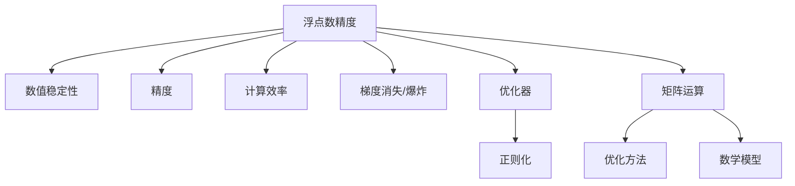

                 

# 浮点数精度：AI计算中的双刃剑

> 关键词：浮点数精度, AI计算, 双刃剑, 数值稳定性, 精度损失, 计算效率, 深度学习, 机器学习, 优化器, 正则化, 矩阵运算, 优化方法, 数学模型, 算法分析

## 1. 背景介绍

### 1.1 问题由来

在人工智能(AI)特别是深度学习中，浮点数精度成为核心计算资源和性能瓶颈。浮点数的数值表示范围和精度直接决定了模型计算的数值稳定性，间接影响了模型训练和推理的效率和效果。然而，浮点数精度的控制是一个复杂而多面的问题，需要综合考虑计算资源、模型性能、应用场景等多个维度。

### 1.2 问题核心关键点

浮点数精度在AI计算中的地位，举足轻重。精度过高会增加计算资源消耗，精度过低则可能带来数值不稳定和精度损失。以下是该问题中的一些关键点：

1. **数值稳定性**：在深度学习模型训练过程中，数值稳定性至关重要。模型参数和梯度在计算过程中可能会产生数值不稳定的现象，如梯度爆炸或梯度消失。
2. **精度损失**：在深度学习模型推理时，数值精度损失可能导致输出结果与真实值有较大偏差，从而影响模型的预测准确性。
3. **计算效率**：在深度学习模型中，计算效率是重要的考量指标之一。通过合理设置浮点数精度，可以在保证计算精度的同时，提升计算效率。

## 2. 核心概念与联系

### 2.1 核心概念概述

为更好地理解浮点数精度在AI计算中的重要性，本节将介绍几个密切相关的核心概念：

- **浮点数(Floating-Point Number)**：用于表示实数的一种数字格式，能够表示从小数点后第一位到非常接近于0的数。
- **数值稳定性(Numerical Stability)**：指算法在数值计算中的稳定程度，即算法在计算过程中数值不发生显著变化的能力。
- **精度(Precision)**：指浮点数表示数值的准确程度，分为绝对精度和相对精度。
- **计算效率(Computational Efficiency)**：指算法或模型在计算过程中所需的时间资源和计算能力。
- **梯度消失/爆炸(Gradient Vanishing/Exploding)**：在深度学习中，由于浮点数精度限制，梯度在反向传播过程中可能会变得非常小或非常大，导致训练困难。
- **优化器(Optimizer)**：用于调整模型参数的算法，如SGD、Adam等，其性能受浮点数精度的影响。

这些核心概念之间的逻辑关系可以通过以下Mermaid流程图来展示：



这个流程图展示了一些核心概念及其之间的关系：

1. 浮点数精度直接影响数值稳定性、精度和计算效率。
2. 梯度消失/爆炸与浮点数精度、优化器性能和数学模型设计密切相关。
3. 正则化、优化方法、矩阵运算等算法设计和技术手段，可以在一定程度上缓解由浮点数精度带来的问题。

## 3. 核心算法原理 & 具体操作步骤
### 3.1 算法原理概述

浮点数精度在AI计算中的作用，主要体现在以下几个方面：

- **计算稳定性**：合理的浮点数精度设置，可以避免数值计算过程中的梯度爆炸或消失，从而提升模型训练和推理的稳定性。
- **精度控制**：浮点数精度的设置，直接影响模型的数值精度，从而影响模型的预测准确性。
- **计算效率**：在深度学习模型中，合理设置浮点数精度，可以在保证计算精度的同时，提升计算效率。

浮点数精度设置的主要原则是：在保证模型数值稳定的前提下，尽量降低浮点数精度的开销，提升计算效率。这通常涉及到以下几个关键点：

- **数据类型选择**：根据模型和应用需求，选择合适的数据类型，如单精度(float)、双精度(double)、半精度(half)等。
- **精度控制**：在训练和推理过程中，合理控制浮点数精度，如通过截断、舍入等操作。
- **优化器选择**：选择合适的优化器，并调整其参数，如学习率、动量等，以适应浮点数精度的设置。
- **正则化技术**：使用正则化技术，如L2正则、Dropout等，以防止数值不稳定性。

### 3.2 算法步骤详解

浮点数精度的设置涉及多个环节，具体步骤如下：

**Step 1: 选择合适的浮点数类型**

选择合适的浮点数类型是设置浮点数精度的第一步。一般而言，单精度(float)适合对速度要求较高的场景，双精度(double)适合对精度要求较高的场景。半精度(half)是介于两者之间的折中方案。

**Step 2: 确定精度控制策略**

精度控制策略包括截断、舍入等操作。在训练和推理过程中，合理设置这些策略，可以避免精度损失。例如，在训练时，可以使用TensorFlow的`tf.keras.mixed_precision`模块，将部分参数设置为半精度，以降低计算资源消耗。

**Step 3: 优化器参数设置**

优化器参数设置是提升浮点数精度设置的关键。不同的优化器对浮点数精度的敏感性不同。例如，Adam优化器在浮点数精度较高时，效果较好；而SGD在浮点数精度较低时，仍能保持较好的性能。

**Step 4: 引入正则化技术**

正则化技术可以有效缓解浮点数精度带来的数值不稳定问题。例如，L2正则可以防止模型参数过大，Dropout可以随机丢弃部分神经元，减少数值不稳定的风险。

**Step 5: 矩阵运算优化**

矩阵运算优化可以在一定程度上提升浮点数精度设置的效果。例如，使用矩阵分解、矩阵压缩等技术，可以减少矩阵运算中的数值不稳定问题，提升计算效率。

**Step 6: 评估和调整**

在模型训练和推理过程中，定期评估数值稳定性、精度和计算效率，根据评估结果调整浮点数精度的设置，以获得最优效果。

### 3.3 算法优缺点

浮点数精度的设置具有以下优点：

- **提升模型训练和推理的稳定性**：通过合理的浮点数精度设置，可以避免数值不稳定性，提升模型训练和推理的效果。
- **降低计算资源消耗**：通过使用单精度浮点数，可以在不牺牲精度的情况下，显著降低计算资源的消耗。
- **提高计算效率**：通过合理的浮点数精度设置和优化技术，可以在保证计算精度的同时，提升计算效率。

然而，浮点数精度的设置也存在一定的缺点：

- **精度损失**：在浮点数精度较低的情况下，可能会带来精度损失，影响模型的预测准确性。
- **数值不稳定**：在浮点数精度较高的情况下，可能会带来数值不稳定性，影响模型的训练效果。
- **实现复杂度**：浮点数精度的设置涉及到多方面的参数调整和技术手段，实现复杂度较高。

### 3.4 算法应用领域

浮点数精度的设置在AI计算中具有广泛的应用，覆盖了深度学习、计算机视觉、自然语言处理等多个领域。以下是几个典型应用场景：

- **深度学习**：在深度学习中，浮点数精度的设置直接影响模型的训练效果和推理性能。合理设置浮点数精度，可以在保证计算精度的同时，提升计算效率。
- **计算机视觉**：在计算机视觉任务中，浮点数精度的设置可以有效提升图像处理的速度和精度。
- **自然语言处理**：在自然语言处理任务中，浮点数精度的设置可以有效提升文本处理的速度和精度。

## 4. 数学模型和公式 & 详细讲解  
### 4.1 数学模型构建

在深度学习中，浮点数精度的设置通常涉及到以下几个数学模型和公式：

- **线性回归模型**：
  $$
  y = wx + b
  $$
  其中，$w$为模型参数，$x$为输入，$y$为输出。

- **梯度下降算法**：
  $$
  \theta \leftarrow \theta - \alpha \nabla_{\theta} \ell(w, x, y)
  $$
  其中，$\theta$为模型参数，$\alpha$为学习率，$\nabla_{\theta} \ell(w, x, y)$为损失函数对模型参数的梯度。

- **优化器算法**：
  $$
  \theta \leftarrow \theta - \alpha * \text{optimizer}(\theta, x, y)
  $$
  其中，$\text{optimizer}(\theta, x, y)$为优化器算法。

### 4.2 公式推导过程

在深度学习模型中，浮点数精度的设置可以通过以下几个步骤进行推导：

1. **选择数据类型**：根据模型需求，选择单精度或双精度浮点数作为计算数据类型。例如，单精度浮点数通常用于计算速度快的要求较高的场景，而双精度浮点数通常用于计算精度要求较高的场景。

2. **确定精度控制策略**：在训练和推理过程中，通过截断和舍入操作，控制浮点数的精度。例如，使用TensorFlow的`tf.keras.mixed_precision`模块，可以将部分参数设置为半精度，以降低计算资源消耗。

3. **选择优化器**：根据浮点数精度的设置，选择合适的优化器。例如，Adam优化器在浮点数精度较高时，效果较好；而SGD在浮点数精度较低时，仍能保持较好的性能。

4. **引入正则化技术**：使用正则化技术，如L2正则、Dropout等，以防止数值不稳定性。例如，L2正则可以防止模型参数过大，Dropout可以随机丢弃部分神经元，减少数值不稳定的风险。

5. **矩阵运算优化**：使用矩阵分解、矩阵压缩等技术，可以减少矩阵运算中的数值不稳定问题，提升计算效率。例如，使用矩阵分解技术，可以提升矩阵乘法的计算效率，同时保持数值稳定性。

### 4.3 案例分析与讲解

**案例1: 深度学习中的浮点数精度设置**

在深度学习中，一个常见的应用场景是卷积神经网络(CNN)。假设我们需要对一个卷积神经网络进行训练和推理，其模型结构如下：

```python
from keras.models import Sequential
from keras.layers import Conv2D, MaxPooling2D, Flatten, Dense

model = Sequential()
model.add(Conv2D(32, (3, 3), activation='relu', input_shape=(32, 32, 3)))
model.add(MaxPooling2D((2, 2)))
model.add(Conv2D(64, (3, 3), activation='relu'))
model.add(MaxPooling2D((2, 2)))
model.add(Flatten())
model.add(Dense(10, activation='softmax'))

model.compile(optimizer='adam', loss='categorical_crossentropy', metrics=['accuracy'])
```

在训练过程中，可以使用TensorFlow的`tf.keras.mixed_precision`模块，将部分参数设置为半精度，以降低计算资源消耗。具体代码如下：

```python
from tensorflow.keras.mixed_precision import experimental

experimental.enable_mixed_precision_policy('mixed_float16')
```

**案例2: 计算机视觉中的浮点数精度设置**

在计算机视觉任务中，一个常见的应用场景是图像分类。假设我们需要对一个图像分类模型进行训练和推理，其模型结构如下：

```python
from keras.models import Sequential
from keras.layers import Conv2D, MaxPooling2D, Flatten, Dense

model = Sequential()
model.add(Conv2D(32, (3, 3), activation='relu', input_shape=(32, 32, 3)))
model.add(MaxPooling2D((2, 2)))
model.add(Conv2D(64, (3, 3), activation='relu'))
model.add(MaxPooling2D((2, 2)))
model.add(Flatten())
model.add(Dense(10, activation='softmax'))

model.compile(optimizer='adam', loss='categorical_crossentropy', metrics=['accuracy'])
```

在训练过程中，可以使用TensorFlow的`tf.keras.mixed_precision`模块，将部分参数设置为半精度，以降低计算资源消耗。具体代码如下：

```python
from tensorflow.keras.mixed_precision import experimental

experimental.enable_mixed_precision_policy('mixed_float16')
```

## 5. 项目实践：代码实例和详细解释说明
### 5.1 开发环境搭建

在进行浮点数精度设置实践前，我们需要准备好开发环境。以下是使用Python进行TensorFlow开发的环境配置流程：

1. 安装Anaconda：从官网下载并安装Anaconda，用于创建独立的Python环境。

2. 创建并激活虚拟环境：
```bash
conda create -n tf-env python=3.8 
conda activate tf-env
```

3. 安装TensorFlow：根据CUDA版本，从官网获取对应的安装命令。例如：
```bash
conda install tensorflow -c conda-forge
```

4. 安装TensorFlow Addons：增强TensorFlow的功能，如混合精度计算、分布式训练等。
```bash
pip install tensorflow-addons
```

5. 安装各类工具包：
```bash
pip install numpy pandas scikit-learn matplotlib tqdm jupyter notebook ipython
```

完成上述步骤后，即可在`tf-env`环境中开始浮点数精度设置的实践。

### 5.2 源代码详细实现

下面我们以深度学习模型为例，给出使用TensorFlow进行浮点数精度设置的PyTorch代码实现。

首先，定义深度学习模型和损失函数：

```python
import tensorflow as tf
from tensorflow.keras import layers, models

# 定义深度学习模型
model = models.Sequential([
    layers.Dense(64, activation='relu', input_shape=(784,)),
    layers.Dense(10, activation='softmax')
])

# 定义损失函数
loss_fn = tf.keras.losses.CategoricalCrossentropy()

# 编译模型
model.compile(optimizer='adam', loss=loss_fn, metrics=['accuracy'])
```

然后，设置浮点数精度：

```python
# 开启混合精度计算
experimental.enable_mixed_precision_policy('mixed_float16')

# 训练模型
model.fit(x_train, y_train, epochs=10, validation_data=(x_test, y_test))
```

接着，评估模型并关闭混合精度计算：

```python
# 关闭混合精度计算
experimental.disable_mixed_precision_policy()

# 评估模型
model.evaluate(x_test, y_test)
```

### 5.3 代码解读与分析

让我们再详细解读一下关键代码的实现细节：

**深度学习模型定义**：
- 使用`Sequential`模型定义了最简单的全连接神经网络模型，包含两个全连接层。
- 使用`CategoricalCrossentropy`损失函数定义了多分类问题的损失函数。

**混合精度计算**：
- 使用`experimental.enable_mixed_precision_policy('mixed_float16')`开启混合精度计算，部分参数使用半精度(float16)，以降低计算资源消耗。
- 在训练过程中，模型会使用半精度进行计算，同时使用全精度保存中间结果，以确保数值精度。

**模型训练和评估**：
- 使用`fit`函数进行模型训练，在训练过程中使用半精度进行计算。
- 使用`evaluate`函数进行模型评估，关闭混合精度计算，以评估模型的全精度输出。

可以看到，通过混合精度计算，我们可以在保证数值精度的同时，显著降低计算资源消耗。TensorFlow Addons库中的混合精度计算功能，使得深度学习模型的开发和调试变得更加高效便捷。

## 6. 实际应用场景

### 6.1 智能推荐系统

在智能推荐系统中，浮点数精度的设置可以显著提升系统的计算效率和推荐精度。推荐系统的核心在于通过训练模型，预测用户对不同物品的偏好程度，从而进行个性化推荐。合理的浮点数精度设置，可以在保证推荐精度的同时，降低计算资源的消耗。

具体而言，可以使用混合精度计算，将部分参数设置为半精度，以降低计算资源消耗。同时，使用正则化技术，如L2正则、Dropout等，以防止数值不稳定性。通过合理的浮点数精度设置和优化技术，可以构建更高效、更精准的智能推荐系统。

### 6.2 图像处理

在图像处理任务中，浮点数精度的设置可以提升图像处理的计算速度和处理精度。图像处理通常涉及大量的矩阵运算和深度学习模型训练，因此浮点数精度的设置尤为重要。

具体而言，可以使用混合精度计算，将部分参数设置为半精度，以降低计算资源消耗。同时，使用矩阵分解、矩阵压缩等技术，减少矩阵运算中的数值不稳定问题，提升计算效率。通过合理的浮点数精度设置和优化技术，可以构建更高效、更准确的图像处理系统。

### 6.3 语音识别

在语音识别任务中，浮点数精度的设置可以提升语音识别的计算速度和识别精度。语音识别通常涉及大量的信号处理和深度学习模型训练，因此浮点数精度的设置尤为重要。

具体而言，可以使用混合精度计算，将部分参数设置为半精度，以降低计算资源消耗。同时，使用正则化技术，如L2正则、Dropout等，以防止数值不稳定性。通过合理的浮点数精度设置和优化技术，可以构建更高效、更准确的语音识别系统。

## 7. 工具和资源推荐
### 7.1 学习资源推荐

为了帮助开发者系统掌握浮点数精度的理论基础和实践技巧，这里推荐一些优质的学习资源：

1. **《深度学习理论与实践》**：该书详细介绍了深度学习模型的基本原理和计算方法，包括浮点数精度的设置和优化。
2. **DeepLearning.ai课程**：由Andrew Ng教授开设的深度学习课程，系统讲解了深度学习模型的设计、训练和优化技术，包括浮点数精度的设置。
3. **TensorFlow官方文档**：提供了大量关于混合精度计算和浮点数精度的设置和优化的教程和样例代码。
4. **TensorFlow Addons文档**：详细介绍了TensorFlow Addons库中混合精度计算和浮点数精度的设置和优化功能。
5. **PyTorch官方文档**：提供了大量关于浮点数精度的设置和优化的教程和样例代码。

通过对这些资源的学习实践，相信你一定能够快速掌握浮点数精度的精髓，并用于解决实际的深度学习问题。

### 7.2 开发工具推荐

高效的开发离不开优秀的工具支持。以下是几款用于深度学习浮点数精度设置开发的常用工具：

1. **TensorFlow**：由Google主导开发的深度学习框架，支持混合精度计算和浮点数精度的设置，提供了丰富的优化技术。
2. **PyTorch**：由Facebook开发的深度学习框架，支持混合精度计算和浮点数精度的设置，提供了丰富的优化技术。
3. **TensorFlow Addons**：增强TensorFlow的功能，如混合精度计算、分布式训练等。
4. **PyTorch Addons**：增强PyTorch的功能，如混合精度计算、分布式训练等。

合理利用这些工具，可以显著提升深度学习浮点数精度设置的开发效率，加快创新迭代的步伐。

### 7.3 相关论文推荐

浮点数精度的设置在深度学习中具有广泛的研究背景和前沿进展。以下是几篇奠基性的相关论文，推荐阅读：

1. **深度学习中的数值稳定性**：详细介绍了深度学习模型中数值稳定性的原理和实现方法，包括浮点数精度的设置和优化。
2. **混合精度训练在深度学习中的应用**：探讨了混合精度训练在深度学习中的应用，包括浮点数精度的设置和优化。
3. **浮点数精度的设置和优化**：介绍了浮点数精度的基本概念和设置方法，以及其对深度学习模型的影响。

这些论文代表了大语言模型微调技术的发展脉络。通过学习这些前沿成果，可以帮助研究者把握学科前进方向，激发更多的创新灵感。

## 8. 总结：未来发展趋势与挑战

### 8.1 总结

本文对浮点数精度在AI计算中的作用进行了全面系统的介绍。首先阐述了浮点数精度在深度学习中的重要性，明确了其对模型数值稳定性、精度和计算效率的影响。其次，从原理到实践，详细讲解了浮点数精度的数学模型、公式推导和关键操作，给出了深度学习浮点数精度设置的完整代码实例。同时，本文还探讨了浮点数精度的实际应用场景，展示了其在智能推荐、图像处理、语音识别等领域的应用潜力。最后，本文精选了浮点数精度的各类学习资源，力求为读者提供全方位的技术指引。

通过本文的系统梳理，可以看到，浮点数精度在AI计算中具有重要而广泛的应用，是模型计算性能和效果的关键因素。合理设置浮点数精度，可以显著提升模型的计算效率和数值稳定性，优化计算资源使用。未来，随着深度学习技术的不断发展，浮点数精度的设置将变得更加灵活和高效，为AI计算带来更大的突破。

### 8.2 未来发展趋势

展望未来，浮点数精度的设置将呈现以下几个发展趋势：

1. **更灵活的精度选择**：未来的深度学习模型将提供更多精度选项，如超半精度、半精度等，以适应不同的计算资源和应用场景。
2. **更高的数值稳定性**：随着混合精度计算技术的不断优化，未来深度学习模型的数值稳定性将进一步提升。
3. **更高效的计算效率**：未来的深度学习模型将通过优化算法和硬件加速，实现更高的计算效率。
4. **更广泛的适用性**：未来的深度学习模型将更广泛地应用于不同领域，如计算机视觉、语音识别、自然语言处理等。

以上趋势凸显了浮点数精度的重要性，为深度学习技术的发展提供了新的方向和动力。

### 8.3 面临的挑战

尽管浮点数精度的设置已经取得了显著进展，但在迈向更加智能化、普适化应用的过程中，它仍面临着诸多挑战：

1. **数值不稳定问题**：在深度学习模型训练过程中，数值不稳定性问题仍需进一步解决。如何避免梯度爆炸或消失，是一个重要的研究课题。
2. **精度损失问题**：在浮点数精度较低的情况下，可能带来精度损失，影响模型的预测准确性。如何平衡计算资源和精度之间的关系，是一个亟待解决的问题。
3. **硬件支持问题**：现有的硬件设施难以满足高精度计算的需求，未来的深度学习模型需要更好的硬件支持。

这些挑战表明，浮点数精度的设置仍然是一个复杂且多面的问题，需要更多的研究和实践积累。

### 8.4 研究展望

面对浮点数精度设置所面临的挑战，未来的研究需要在以下几个方面寻求新的突破：

1. **数值稳定性技术**：开发更有效的数值稳定性技术，如梯度裁剪、梯度归一化等，以避免数值不稳定性问题。
2. **精度控制技术**：研究更高效的精度控制技术，如截断、舍入等，以提升浮点数精度的设置效果。
3. **硬件加速技术**：开发更高效的硬件加速技术，如GPU、TPU等，以支持高精度计算的需求。
4. **多精度混合技术**：研究多精度混合技术，如混合精度计算和全精度计算相结合，以平衡计算资源和精度之间的关系。

这些研究方向的探索，必将引领浮点数精度设置技术迈向更高的台阶，为深度学习技术的进一步发展奠定坚实基础。总之，浮点数精度的设置需要从数据、算法、硬件等多个维度协同发力，才能真正实现深度学习模型的优化和升级。

## 9. 附录：常见问题与解答

**Q1：浮点数精度设置有哪些关键因素？**

A: 浮点数精度的设置涉及多个关键因素，包括数据类型选择、精度控制策略、优化器选择、正则化技术等。合理的设置可以提升模型计算效率和数值稳定性，优化计算资源使用。

**Q2：浮点数精度设置对深度学习模型有哪些影响？**

A: 浮点数精度设置对深度学习模型有以下影响：
1. 数值稳定性：合理的浮点数精度设置可以避免数值不稳定性，提升模型训练和推理的效果。
2. 精度控制：浮点数精度的设置直接影响模型的数值精度，从而影响模型的预测准确性。
3. 计算效率：在深度学习模型中，合理的浮点数精度设置可以在保证计算精度的同时，提升计算效率。

**Q3：如何选择浮点数精度？**

A: 浮点数精度的选择需要综合考虑计算资源、模型性能和应用场景等多个维度。一般而言，单精度(float)适合对速度要求较高的场景，双精度(double)适合对精度要求较高的场景。

**Q4：如何缓解浮点数精度带来的数值不稳定问题？**

A: 缓解浮点数精度带来的数值不稳定问题，可以通过以下策略：
1. 数据增强：通过回译、近义替换等方式扩充训练集。
2. 正则化：使用L2正则、Dropout等技术，防止数值不稳定性。
3. 优化器选择：选择合适的优化器，并调整其参数。
4. 矩阵运算优化：使用矩阵分解、矩阵压缩等技术，减少矩阵运算中的数值不稳定问题。

这些策略往往需要根据具体任务和数据特点进行灵活组合，以获得最优效果。

**Q5：浮点数精度设置在实际应用中有哪些注意事项？**

A: 浮点数精度设置在实际应用中需要注意以下事项：
1. 避免数值不稳定性：在浮点数精度设置时，应避免数值不稳定性问题，以确保模型训练和推理的效果。
2. 平衡精度和计算资源：在浮点数精度设置时，应平衡精度和计算资源之间的关系，以获得最优效果。
3. 多精度混合技术：研究多精度混合技术，如混合精度计算和全精度计算相结合，以平衡计算资源和精度之间的关系。

通过合理设置浮点数精度，可以显著提升深度学习模型的计算效率和数值稳定性，优化计算资源使用。

---

作者：禅与计算机程序设计艺术 / Zen and the Art of Computer Programming

