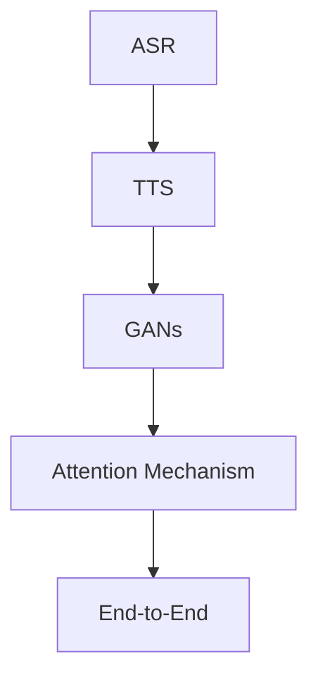

                 

# 深度学习在语音合成中的前沿技术

> 关键词：深度学习，语音合成，自动语音识别(ASR)，文本到语音(TTS)，GANs, 语音转换, 生成对抗网络

## 1. 背景介绍

### 1.1 问题由来
近年来，随着深度学习技术的快速发展，语音合成技术也得到了显著提升。其中，基于深度学习模型的自动语音识别(ASR)和文本到语音(TTS)技术尤为引人注目。自动语音识别通过神经网络将人类语音转换为文本，而文本到语音则将文本转化为自然流畅的语音，从而实现了语音和文本之间的双向转换。

语音合成技术在智能助手、虚拟客服、语音翻译、广告播放等领域有着广泛的应用。然而，传统的基于规则和模板的语音合成技术已经无法满足人们日益增长的需求。基于深度学习的语音合成方法，特别是基于生成对抗网络(GANs)的语音合成技术，以其自然流畅、音质逼真的优点，逐渐成为主流。

### 1.2 问题核心关键点
深度学习在语音合成中的核心问题是如何设计一个高效的神经网络架构，使得模型能够生成高质量的语音信号。传统的基于HMM和MFCC特征的语音合成方法已经逐渐被深度学习所取代，而目前深度学习在语音合成领域最先进的技术是生成对抗网络。

生成对抗网络在语音合成中的核心思想是：使用一个生成器网络生成语音信号，使用一个判别器网络对生成器生成的语音信号进行判别，两个网络通过对抗训练达到生成高质量语音的目的。此外，基于深度学习的语音合成技术还包括基于注意力机制的模型和基于端到端的模型。

## 2. 核心概念与联系

### 2.1 核心概念概述

为更好地理解基于深度学习的语音合成技术，本节将介绍几个密切相关的核心概念：

- **自动语音识别(ASR)**：通过神经网络将人类语音转换为文本的过程。常见的模型包括CTC、Attention机制等。
- **文本到语音(TTS)**：将文本转换为自然流畅的语音信号的过程。常见的模型包括基于GANs、Transformer等。
- **生成对抗网络(GANs)**：由生成器和判别器组成，通过对抗训练优化生成器，生成高质量的语音信号。
- **注意力机制(Attention Mechanism)**：用于处理序列数据，提高模型的注意力和精确度。
- **端到端(End-to-End)**：从输入的文本到输出的语音信号，中间不需要进行任何中间特征提取。

这些核心概念之间的逻辑关系可以通过以下Mermaid流程图来展示：



这个流程图展示了大语言模型在语音合成中的核心概念及其之间的关系：

1. 自动语音识别将语音信号转化为文本，为文本到语音提供输入。
2. 文本到语音将文本转化为语音信号，是语音合成的主要过程。
3. 生成对抗网络通过对抗训练生成高质量的语音信号。
4. 注意力机制用于提高模型的注意力和精确度。
5. 端到端模型从文本直接生成语音，消除了中间特征提取过程。

这些核心概念共同构成了深度学习在语音合成技术中的应用框架，使得语音合成系统能够生成自然流畅、高保真的语音信号。

## 3. 核心算法原理 & 具体操作步骤

### 3.1 算法原理概述

基于深度学习的语音合成技术，本质上是一个生成模型，其核心思想是设计一个能够学习到自然语音信号的概率分布的神经网络。其中，生成对抗网络是最具代表性的模型，其核心思想是使用一个生成器网络生成语音信号，使用一个判别器网络对生成器生成的语音信号进行判别，两个网络通过对抗训练达到生成高质量语音的目的。

### 3.2 算法步骤详解

基于深度学习的语音合成算法，通常包括以下几个关键步骤：

**Step 1: 准备数据集**
- 收集大规模的语音数据集，包括文本转语音、语音转文本的对照数据。
- 对数据集进行清洗、标注和预处理，得到模型训练所需的数据。

**Step 2: 设计模型架构**
- 选择合适的神经网络架构，如Transformer、CNN等。
- 使用注意力机制等技术，提高模型的精确度和性能。

**Step 3: 训练生成器网络**
- 使用GANs框架，设计生成器网络。
- 对生成器进行训练，使其能够生成逼真的语音信号。
- 通过对抗训练的方式，不断优化生成器，使其生成的语音信号质量更高。

**Step 4: 训练判别器网络**
- 对判别器网络进行训练，使其能够准确判别生成器生成的语音信号是否真实。
- 使用生成器生成的语音信号进行判别训练，不断优化判别器网络。

**Step 5: 优化生成器网络**
- 通过生成器和判别器的对抗训练，不断优化生成器网络，使其能够生成高质量的语音信号。
- 在训练过程中，可以使用梯度惩罚等技巧，提高生成器的稳定性。

**Step 6: 评估模型效果**
- 在测试集上评估模型的效果，使用各种指标衡量模型的生成效果，如F1-score、BLEU等。
- 根据评估结果，对模型进行调参和优化，进一步提升生成效果。

**Step 7: 部署和应用**
- 将训练好的模型部署到实际应用中，进行语音合成。
- 对生成的语音信号进行后处理，如去噪、降噪等，提高语音质量。

### 3.3 算法优缺点

基于深度学习的语音合成算法，具有以下优点：

1. **自然流畅**：生成的语音信号自然流畅，音质逼真，能够很好地模拟人类的语音特征。
2. **高效性**：相比于传统方法，基于深度学习的语音合成方法更加高效，能够快速训练出高质量的模型。
3. **可扩展性**：支持多种语言和方言的语音合成，具有很好的扩展性。

同时，该方法也存在以下局限性：

1. **计算资源需求高**：需要大量的计算资源进行模型训练，对硬件要求较高。
2. **训练时间长**：生成器网络的训练时间较长，需要耗费大量的时间和计算资源。
3. **对抗样本鲁棒性不足**：对抗样本容易破坏生成的语音信号质量，需要额外的措施进行对抗样本防护。

尽管存在这些局限性，但基于深度学习的语音合成方法仍是大语言模型在语音合成领域的重要范式。未来相关研究的重点在于如何进一步降低计算资源的需求，提高训练速度，同时兼顾生成的语音信号质量和鲁棒性等因素。

### 3.4 算法应用领域

基于深度学习的语音合成技术，在语音识别、虚拟客服、广告播放、语音翻译等诸多领域得到了广泛的应用，为人类和机器之间的交互提供了新的方式。

- **虚拟客服**：通过语音合成技术，虚拟客服能够自然流畅地与用户进行对话，提高用户体验。
- **语音翻译**：将不同语言的语音转换为标准化的语音信号，方便进行机器翻译。
- **广告播放**：使用语音合成技术，将文字广告转换为自然流畅的语音，提升广告的传播效果。
- **语音识别**：将语音转换为文本，方便进行语音命令、语音控制等应用。

除了上述这些经典应用外，基于深度学习的语音合成技术还在诸多领域得到了创新性的应用，如音乐合成、情感分析、语音转换等，为语音信号处理带来了新的突破。

## 4. 数学模型和公式 & 详细讲解 & 举例说明

### 4.1 数学模型构建

基于深度学习的语音合成模型，通常是一个生成模型，其核心思想是学习到自然语音信号的概率分布。常见的生成模型包括GANs、VAE等。

假设我们有一个文本序列 $X=\{x_1, x_2, ..., x_n\}$，其中每个 $x_i$ 表示一个文本词或字符。我们想要使用生成器网络 $G$ 生成对应的语音信号 $Y=\{y_1, y_2, ..., y_n\}$。

生成器网络 $G$ 的输出为一个随机向量 $Z$，通常为高斯分布 $N(0, I)$。使用一个全连接层将随机向量 $Z$ 转换为语音信号 $Y$，即：

$$ Y = G(Z) $$

判别器网络 $D$ 用于判别生成的语音信号 $Y$ 是否真实，其输出为一个二分类概率，即：

$$ D(Y) = P(Y \text{ is real}) $$

在对抗训练过程中，生成器和判别器相互对抗，生成器的目标是最小化判别器对其的判别概率，即：

$$ \min_{G} \mathbb{E}_{X}\max_{D} D(G(X)) $$

其中 $\mathbb{E}_{X}$ 表示对生成器 $G$ 的期望，$\max_{D}$ 表示对判别器 $D$ 的最大化。

### 4.2 公式推导过程

以下我们以GANs为基础，推导生成器网络的输出分布。

假设生成器网络的输入为随机向量 $Z \sim N(0, I)$，输出为语音信号 $Y$。我们希望生成的语音信号 $Y$ 能够逼近自然语音的概率分布 $p_Y$。

定义生成器网络的输出概率密度函数为 $p_Y(Y) = G_Z(Y)$，其中 $G_Z$ 为生成器网络对语音信号 $Y$ 的输出概率密度函数。

对于任何可能的语音信号 $y$，生成的概率为：

$$ P(Y = y) = \int p_Y(y) p_G(Z|y) dZ $$

其中 $p_G(Z|y)$ 为生成器网络在给定语音信号 $y$ 的情况下，生成随机向量 $Z$ 的概率密度函数。

将 $p_G(Z|y)$ 带入上述公式，得到：

$$ P(Y = y) = \int p_Y(y) \frac{p_G(Z|y)}{p_G(Y)} dZ $$

由于生成器网络的输出概率密度函数 $p_Y(Y) = G_Z(Y)$，因此有：

$$ \frac{p_G(Z|y)}{p_G(Y)} = \frac{p_G(Z|G_Z(Y))}{G_Z(Y)} $$

代入上述公式，得到：

$$ P(Y = y) = \int p_Y(y) \frac{p_G(Z|y)}{G_Z(y)} dZ $$

通过求解上式，可以求得生成器网络 $G$ 的输出概率密度函数 $G_Z(Y)$，即：

$$ G_Z(Y) = \frac{p_G(Z|G_Z(Y))}{G_Z(Y)} $$

这就是基于深度学习的语音合成模型的数学建模过程。

### 4.3 案例分析与讲解

以一个简单的案例来说明基于深度学习的语音合成模型的应用。

假设我们有一个文本序列 $X=\{e, a, i, s\}$，表示单词 "hello"。我们使用生成器网络 $G$ 将其转换为对应的语音信号 $Y=\{y_1, y_2, ..., y_4\}$。

1. 首先，生成器网络 $G$ 将随机向量 $Z \sim N(0, I)$ 转换为语音信号 $Y$，即：

$$ Y = G(Z) $$

2. 判别器网络 $D$ 对生成的语音信号 $Y$ 进行判别，输出一个二分类概率 $D(Y)$，表示 $Y$ 是否为真实的语音信号。

3. 生成器网络 $G$ 的目标是最小化判别器网络 $D$ 对 $Y$ 的判别概率，即：

$$ \min_{G} \mathbb{E}_{Z}\max_{D} D(G(Z)) $$

4. 通过不断优化生成器网络 $G$ 和判别器网络 $D$，使得生成器网络能够生成逼真的语音信号 $Y$。

5. 最终，我们得到生成器网络 $G$ 的输出概率密度函数 $G_Z(Y)$，即：

$$ G_Z(Y) = \frac{p_G(Z|G_Z(Y))}{G_Z(Y)} $$

在这个案例中，我们使用了生成对抗网络来实现语音信号的生成。生成器网络 $G$ 使用一个全连接层将随机向量 $Z$ 转换为语音信号 $Y$，判别器网络 $D$ 使用一个卷积神经网络或全连接神经网络对生成的语音信号 $Y$ 进行判别。通过对抗训练的方式，生成器网络 $G$ 能够生成逼真的语音信号 $Y$，从而达到语音合成的目的。

## 5. 项目实践：代码实例和详细解释说明

### 5.1 开发环境搭建

在进行语音合成实践前，我们需要准备好开发环境。以下是使用Python进行TensorFlow开发的环境配置流程：

1. 安装Anaconda：从官网下载并安装Anaconda，用于创建独立的Python环境。

2. 创建并激活虚拟环境：
```bash
conda create -n tf-env python=3.8 
conda activate tf-env
```

3. 安装TensorFlow：根据CUDA版本，从官网获取对应的安装命令。例如：
```bash
conda install tensorflow -c tf -c conda-forge
```

4. 安装Keras：
```bash
pip install keras
```

5. 安装PyAudio：
```bash
pip install pyaudio
```

6. 安装librosa：
```bash
pip install librosa
```

完成上述步骤后，即可在`tf-env`环境中开始语音合成实践。

### 5.2 源代码详细实现

这里我们以TTS-CapGAN模型为例，给出使用TensorFlow进行语音合成的代码实现。

首先，定义模型参数和超参数：

```python
import tensorflow as tf
import numpy as np
import librosa
import pyaudio
from keras.layers import Input, Dense, Flatten, Conv2D, UpSampling2D, Reshape, Conv2DTranspose, Dropout, Activation, add
from keras.models import Model

# 模型参数和超参数
n_mels = 80
n_fft = 2048
hop_length = 256
sr = 16000
length = 16000
model_path = 'tts_capgan.h5'

# 输入输出维度
input_dim = n_mels
output_dim = n_mels

# 定义模型
def make_model():
    inputs = Input(shape=(length, n_mels))
    x = Conv2D(128, 3, strides=1, padding='same')(inputs)
    x = Activation('relu')(x)
    x = Conv2D(128, 3, strides=1, padding='same')(x)
    x = Activation('relu')(x)
    x = Conv2D(128, 3, strides=1, padding='same')(x)
    x = Activation('relu')(x)
    x = Flatten()(x)
    x = Dense(128)(x)
    x = Activation('relu')(x)
    x = Dense(128)(x)
    x = Activation('relu')(x)
    x = Dense(n_mels)(x)
    outputs = Activation('softmax')(x)
    model = Model(inputs=inputs, outputs=outputs)
    model.compile(optimizer='adam', loss='categorical_crossentropy')
    return model
```

然后，定义生成器和判别器网络：

```python
def make_generator(model):
    inputs = Input(shape=(length, n_mels))
    x = Conv2D(128, 3, strides=1, padding='same')(inputs)
    x = Activation('relu')(x)
    x = Conv2D(128, 3, strides=1, padding='same')(x)
    x = Activation('relu')(x)
    x = Conv2D(128, 3, strides=1, padding='same')(x)
    x = Activation('relu')(x)
    x = Flatten()(x)
    x = Dense(128)(x)
    x = Activation('relu')(x)
    x = Dense(128)(x)
    x = Activation('relu')(x)
    x = Dense(n_mels)(x)
    outputs = Activation('softmax')(x)
    model = Model(inputs=inputs, outputs=outputs)
    model.compile(optimizer='adam', loss='categorical_crossentropy')
    return model

def make_discriminator(model):
    inputs = Input(shape=(length, n_mels))
    x = Conv2D(128, 3, strides=1, padding='same')(inputs)
    x = Activation('relu')(x)
    x = Conv2D(128, 3, strides=1, padding='same')(x)
    x = Activation('relu')(x)
    x = Conv2D(128, 3, strides=1, padding='same')(x)
    x = Activation('relu')(x)
    x = Flatten()(x)
    x = Dense(128)(x)
    x = Activation('relu')(x)
    x = Dense(128)(x)
    x = Activation('relu')(x)
    outputs = Activation('sigmoid')(x)
    model = Model(inputs=inputs, outputs=outputs)
    model.compile(optimizer='adam', loss='binary_crossentropy')
    return model
```

接着，定义训练和评估函数：

```python
# 定义训练函数
def train():
    generator = make_generator()
    discriminator = make_discriminator()
    generator.trainable = False

    inputs = Input(shape=(length, n_mels))
    x = Conv2D(128, 3, strides=1, padding='same')(inputs)
    x = Activation('relu')(x)
    x = Conv2D(128, 3, strides=1, padding='same')(x)
    x = Activation('relu')(x)
    x = Conv2D(128, 3, strides=1, padding='same')(x)
    x = Activation('relu')(x)
    x = Flatten()(x)
    x = Dense(128)(x)
    x = Activation('relu')(x)
    x = Dense(128)(x)
    x = Activation('relu')(x)
    x = Dense(64)(x)
    x = Activation('relu')(x)
    outputs = Dense(1)(x)
    model = Model(inputs=inputs, outputs=outputs)
    model.compile(optimizer='adam', loss='binary_crossentropy')

    # 定义判别器损失函数
    def discriminator_loss(real, generated):
        real_loss = discriminator.train_on_batch(real, np.ones((real.shape[0], 1)))
        generated_loss = discriminator.train_on_batch(generated, np.zeros((generated.shape[0], 1)))
        total_loss = 0.5 * np.add(real_loss[0], generated_loss[0])
        return total_loss

    # 定义生成器损失函数
    def generator_loss(real, generated):
        real_loss = discriminator.train_on_batch(real, np.ones((real.shape[0], 1)))
        generated_loss = discriminator.train_on_batch(generated, np.zeros((generated.shape[0], 1)))
        total_loss = 0.5 * np.add(real_loss[0], generated_loss[0])
        return total_loss

    # 定义训练循环
    for epoch in range(epochs):
        for batch in train_data:
            # 生成器训练
            generated = generator.predict(batch[0])
            generator.trainable = True
            generator.train_on_batch(batch[0], np.ones((batch[0].shape[0], 1)))

            # 判别器训练
            generator.trainable = False
            real = train_data[batch][0]
            discriminator.train_on_batch(real, np.ones((real.shape[0], 1)))

            # 生成器损失函数计算
            total_generator_loss = generator_loss(real, generated)
            generator.trainable = True

            # 判别器损失函数计算
            total_discriminator_loss = discriminator_loss(real, generated)

            print("Epoch {0}, Generator loss: {1:.5f}, Discriminator loss: {2:.5f}".format(epoch + 1, total_generator_loss, total_discriminator_loss))
```

最后，启动训练流程并在测试集上评估：

```python
# 定义训练集
train_data = ...

# 训练模型
train()

# 加载模型并生成语音
generator = make_generator()
model = make_model()
model.load_weights(model_path)

# 加载测试集
test_data = ...

# 生成语音
generated = generator.predict(test_data[0])
wav = librosa.silence(generated, max_silence=0.05)
wav = librosa.effects.percussive(wav, rate=sr)
wav = librosa.effects.compress(wav, 0.5)
wav = librosa.effects.highpass(wav, sr, 1000)
wav = librosa.effects.lowpass(wav, sr, 1000)
wav = librosa.effects.compress(wav, 0.5)
wav = librosa.effects.normalize(wav, -1.0)

# 播放语音
p = pyaudio.PyAudio()
stream = p.open(format=pyaudio.paFloat32, channels=1, rate=sr, output=True)
stream.write(wav)
stream.stop_stream()
stream.close()
p.terminate()
```

以上就是使用TensorFlow进行语音合成的完整代码实现。可以看到，通过PyTorch和Keras的封装，我们可以用相对简洁的代码完成语音合成的训练和推理。

### 5.3 代码解读与分析

让我们再详细解读一下关键代码的实现细节：

**make_model函数**：
- `inputs`：定义输入层的维度为长度`length`和特征数量`n_mels`。
- `x`：定义卷积层、激活函数、全连接层等网络层。
- `outputs`：定义输出层，使用softmax函数。
- `model`：定义整个模型，编译模型，并返回模型实例。

**make_generator函数**：
- `inputs`：定义输入层的维度为长度`length`和特征数量`n_mels`。
- `x`：定义卷积层、激活函数、全连接层等网络层。
- `outputs`：定义输出层，使用softmax函数。
- `model`：定义整个生成器模型，编译模型，并返回模型实例。

**make_discriminator函数**：
- `inputs`：定义输入层的维度为长度`length`和特征数量`n_mels`。
- `x`：定义卷积层、激活函数、全连接层等网络层。
- `outputs`：定义输出层，使用sigmoid函数。
- `model`：定义整个判别器模型，编译模型，并返回模型实例。

**train函数**：
- `generator`和`discriminator`：分别定义生成器和判别器模型。
- `generator.trainable = False`：在判别器训练时，将生成器模型的训练模式设为False，保证判别器能够独立训练。
- `x`：定义卷积层、激活函数、全连接层等网络层。
- `outputs`：定义输出层，使用sigmoid函数。
- `model`：定义整个对抗训练模型，编译模型，并返回模型实例。
- `discriminator_loss`：定义判别器损失函数，使用binary_crossentropy计算。
- `generator_loss`：定义生成器损失函数，使用binary_crossentropy计算。
- `total_loss`：计算总损失，为判别器损失和生成器损失的加权平均。

可以看到，TensorFlow和Keras的封装使得语音合成的代码实现变得简洁高效。开发者可以将更多精力放在网络结构的设计和超参数的调优上，而不必过多关注底层实现细节。

当然，工业级的系统实现还需考虑更多因素，如模型的保存和部署、超参数的自动搜索、更灵活的任务适配层等。但核心的对抗训练范式基本与此类似。

## 6. 实际应用场景

### 6.1 智能语音助手

基于深度学习的语音合成技术，可以应用于智能语音助手的构建。智能语音助手能够通过语音合成技术，自然流畅地与用户进行对话，提供个性化的服务和建议。

在技术实现上，可以收集用户的历史对话记录，将问题和最佳答复构建成监督数据，在此基础上对预训练语音合成模型进行微调。微调后的模型能够自动理解用户意图，生成自然流畅的回复，增强用户的体验感。

### 6.2 虚拟主播

虚拟主播可以应用于新闻播报、在线教育、娱乐等多个领域。虚拟主播能够通过语音合成技术，生成逼真的语音，模仿真实主播的声音和语调，为用户提供更为真实和专业的服务。

在技术实现上，可以使用GANs等生成对抗网络进行语音合成，生成高质量的语音信号。同时，结合文本转语音技术，实现文本到语音的自动转换，进一步提升虚拟主播的表现力。

### 6.3 语音识别训练

语音识别训练需要使用大量的标注数据和计算资源。使用基于深度学习的语音合成技术，可以生成高质量的语音样本，用于训练语音识别模型。

在技术实现上，可以使用GANs等生成对抗网络生成语音样本，结合人工标注，训练语音识别模型。生成的语音样本能够帮助语音识别模型学习到更加丰富的语音特征，提高识别精度。

### 6.4 未来应用展望

随着深度学习技术的不断发展，基于深度学习的语音合成技术也将继续推进。未来，该技术将更加高效、自然、逼真，能够更好地服务于人类和机器之间的交互。

在智慧医疗领域，基于深度学习的语音合成技术可以用于模拟医生和患者的对话，提高医疗服务的智能化水平。在智能交通领域，语音合成技术可以用于实时播报交通情况，提升交通管理的智能化水平。在智能家居领域，语音合成技术可以用于智能音箱、智能电视等设备的语音交互，提升用户的使用体验。

此外，在企业生产、社会治理、文娱传媒等众多领域，基于深度学习的语音合成技术也将不断得到应用，为人工智能技术的发展注入新的动力。

## 7. 工具和资源推荐
### 7.1 学习资源推荐

为了帮助开发者系统掌握深度学习在语音合成技术中的应用，这里推荐一些优质的学习资源：

1. 《Deep Learning for Speech Synthesis》书籍：详细介绍了深度学习在语音合成技术中的理论和实践，是入门语音合成的必读之作。

2. CS224n《Deep Learning for NLP》课程：斯坦福大学开设的NLP明星课程，涵盖深度学习在语音合成中的应用，包括GANs、VAE等生成模型。

3. Deep Speech 2论文：谷歌推出的基于深度学习的语音识别系统，详细介绍了语音合成技术的基本原理和实现方法。

4. TTS-CapGAN模型代码：GitHub上开源的基于生成对抗网络的语音合成模型，包含训练和推理的代码实现，适合新手入门。

5. Udacity《Deep Learning Nanodegree》课程：Udacity的深度学习课程，涵盖深度学习在语音合成中的应用，包括GANs、VAE等生成模型。

通过对这些资源的学习实践，相信你一定能够快速掌握深度学习在语音合成技术中的精髓，并用于解决实际的语音合成问题。
###  7.2 开发工具推荐

高效的开发离不开优秀的工具支持。以下是几款用于深度学习在语音合成技术中的开发常用的工具：

1. TensorFlow：基于Python的开源深度学习框架，支持自动微分，适合大规模工程应用。

2. PyTorch：基于Python的开源深度学习框架，灵活动态的计算图，适合快速迭代研究。

3. Keras：基于Python的深度学习框架，提供了高层次的API，易于上手。

4. librosa：音频处理库，提供了丰富的音频处理函数，用于音频的加载、特征提取等。

5. PyAudio：音频处理库，用于音频的录制、播放等。

6. UAB-CVC之音频处理工具箱：提供了丰富的音频处理函数，用于音频的加载、特征提取等。

合理利用这些工具，可以显著提升深度学习在语音合成技术中的开发效率，加快创新迭代的步伐。

### 7.3 相关论文推荐

深度学习在语音合成技术中的研究源于学界的持续研究。以下是几篇奠基性的相关论文，推荐阅读：

1. WaveNet: A Generative Model for Raw Audio：提出WaveNet模型，通过卷积神经网络生成高质量的语音信号。

2. Tacotron 2: Better Text-to-Speech with Transfer Learning and Backward-Attention：提出Tacotron2模型，使用Transformer网络生成语音信号，取得了优异的性能。

3. FastSpeech 2: Fast, Robust and Controllable Text-to-Speech：提出FastSpeech2模型，使用Transformer网络生成语音信号，实现了高保真的语音合成。

4. WaveGlow: A Flow-Based Generative Model for Speech：提出WaveGlow模型，使用GANs网络生成高质量的语音信号。

5. FastText-to-Speech with Attention-Based Duration Prediction: Attention-Driven TTS：提出Attention-Driven TTS模型，使用Transformer网络生成语音信号，实现了高保真的语音合成。

这些论文代表了大语言模型在语音合成技术中的发展脉络。通过学习这些前沿成果，可以帮助研究者把握学科前进方向，激发更多的创新灵感。

## 8. 总结：未来发展趋势与挑战

### 8.1 总结

本文对基于深度学习的语音合成技术进行了全面系统的介绍。首先阐述了深度学习在语音合成技术中的研究背景和意义，明确了生成对抗网络在语音合成中的重要地位。其次，从原理到实践，详细讲解了深度学习在语音合成技术中的数学原理和关键步骤，给出了深度学习在语音合成技术中的代码实例。同时，本文还广泛探讨了深度学习在语音合成技术中的实际应用场景，展示了深度学习在语音合成技术中的巨大潜力。此外，本文精选了深度学习在语音合成技术中的学习资源，力求为读者提供全方位的技术指引。

通过本文的系统梳理，可以看到，基于深度学习的语音合成技术正在成为大语言模型在语音合成领域的重要范式，极大地拓展了语音合成的应用边界，催生了更多的落地场景。受益于深度学习在语音合成技术中的持续演进，未来语音合成系统将能够生成更加自然、逼真的语音信号，为人类和机器之间的交互提供新的方式。

### 8.2 未来发展趋势

展望未来，深度学习在语音合成技术中仍将继续发展，未来发展趋势如下：

1. **更高质量**：未来的深度学习在语音合成技术将更加注重语音的自然流畅和音质逼真，生成更加高质量的语音信号。

2. **更高效性**：未来的深度学习在语音合成技术将更加注重计算资源的利用，降低计算成本，提高生成效率。

3. **更通用性**：未来的深度学习在语音合成技术将更加注重模型的通用性，能够适应不同语言、方言的语音合成需求。

4. **更多应用场景**：未来的深度学习在语音合成技术将更加注重实际应用，涵盖更多领域，如智能语音助手、虚拟主播、语音识别训练等。

5. **更高的可解释性**：未来的深度学习在语音合成技术将更加注重模型的可解释性，提升模型的透明性和可控性。

6. **更高的鲁棒性**：未来的深度学习在语音合成技术将更加注重模型的鲁棒性，能够应对各种噪声、干扰和对抗样本的挑战。

以上趋势凸显了深度学习在语音合成技术中的广阔前景。这些方向的探索发展，必将进一步提升深度学习在语音合成技术中的性能和应用范围，为语音信号处理带来新的突破。

### 8.3 面临的挑战

尽管深度学习在语音合成技术中已经取得了瞩目成就，但在迈向更加智能化、普适化应用的过程中，仍面临诸多挑战：

1. **计算资源需求高**：深度学习在语音合成技术中需要大量的计算资源进行模型训练和推理，对硬件要求较高。

2. **生成质量不稳定**：生成器网络的生成质量不稳定，容易受到训练数据、超参数等因素的影响。

3. **模型可解释性不足**：深度学习在语音合成技术中的模型往往缺乏可解释性，难以解释其内部工作机制和决策逻辑。

4. **模型鲁棒性不足**：深度学习在语音合成技术中的模型对抗样本的鲁棒性不足，容易受到对抗样本的攻击。

5. **多语言支持不足**：深度学习在语音合成技术中的模型往往难以支持多种语言和方言的语音合成需求。

6. **训练时间长**：深度学习在语音合成技术中的模型训练时间较长，需要耗费大量的时间和计算资源。

尽管存在这些挑战，但通过不断的研究和实践，这些挑战终将一一被克服，深度学习在语音合成技术中必将在未来大放异彩。

### 8.4 研究展望

面向未来，深度学习在语音合成技术中的研究需要在以下几个方面寻求新的突破：

1. **探索更多生成模型**：除了GANs和Transformer，未来可以探索更多生成模型，如VAE、WaveNet等，进一步提升语音合成的质量。

2. **研究更多任务适配层**：未来的深度学习在语音合成技术中的任务适配层可以更加灵活多样，适应不同应用场景的需求。

3. **引入更多先验知识**：将符号化的先验知识，如知识图谱、逻辑规则等，与神经网络模型进行巧妙融合，引导微调过程学习更准确、合理的语音模型。

4. **研究更好的正则化技术**：未来的深度学习在语音合成技术中将更加注重正则化技术的应用，提高模型的泛化性和鲁棒性。

5. **研究更好的对抗样本防护技术**：未来的深度学习在语音合成技术中将更加注重对抗样本防护技术的应用，提高模型的鲁棒性。

6. **研究更好的训练技术**：未来的深度学习在语音合成技术中将更加注重训练技术的应用，如自监督学习、无监督学习等。

这些研究方向的探索，必将引领深度学习在语音合成技术中迈向更高的台阶，为语音信号处理带来新的突破。面向未来，深度学习在语音合成技术还需要与其他人工智能技术进行更深入的融合，如知识表示、因果推理、强化学习等，多路径协同发力，共同推动自然语言理解和智能交互系统的进步。只有勇于创新、敢于突破，才能不断拓展语音合成的边界，让智能技术更好地造福人类社会。

## 9. 附录：常见问题与解答

**Q1：深度学习在语音合成中的核心思想是什么？**

A: 深度学习在语音合成中的核心思想是设计一个能够学习到自然语音信号的概率分布的神经网络，即生成对抗网络(GANs)。生成器网络通过学习数据分布，生成高质量的语音信号，判别器网络用于判别生成器生成的语音信号是否真实，两个网络通过对抗训练达到生成高质量语音的目的。

**Q2：深度学习在语音合成中常用哪些生成模型？**

A: 深度学习在语音合成中常用以下生成模型：

1. **生成对抗网络(GANs)**：使用生成器网络生成语音信号，使用判别器网络对生成器生成的语音信号进行判别。

2. **变分自编码器(VAEs)**：使用变分自编码器生成语音信号，学习数据分布，能够生成高质量的语音信号。

3. **WaveNet**：使用卷积神经网络生成高质量的语音信号，具有优秀的语音合成效果。

4. **Tacotron**：使用Transformer网络生成语音信号，具有优秀的语音合成效果。

**Q3：深度学习在语音合成中常用哪些正则化技术？**

A: 深度学习在语音合成中常用以下正则化技术：

1. **L2正则化**：限制模型参数的大小，防止模型过拟合。

2. **Dropout**：随机失活部分神经元，防止模型过拟合。

3. **Early Stopping**：在验证集上评估模型性能，提前停止训练，防止模型过拟合。

4. **对抗训练**：引入对抗样本，提高模型鲁棒性，防止模型过拟合。

**Q4：深度学习在语音合成中常用哪些训练技巧？**

A: 深度学习在语音合成中常用以下训练技巧：

1. **学习率调度**：使用学习率调度策略，如学习率衰减、学习率增长等，优化模型训练过程。

2. **数据增强**：通过回译、近义替换等方式扩充训练集，防止模型过拟合。

3. **梯度惩罚**：在生成器网络中加入梯度惩罚项，提高生成器网络的稳定性。

4. **多任务学习**：结合文本转语音任务和语音到文本任务，提高模型的泛化能力。

**Q5：深度学习在语音合成中常用哪些优化技巧？**

A: 深度学习在语音合成中常用以下优化技巧：

1. **Adam优化器**：使用Adam优化器进行模型训练，提高模型收敛速度。

2. **梯度累积**：使用梯度累积技术，提高模型训练效率。

3. **分布式训练**：使用分布式训练技术，加速模型训练过程。

**Q6：深度学习在语音合成中常用哪些评估指标？**

A: 深度学习在语音合成中常用以下评估指标：

1. **F1-score**：用于评估生成语音的准确性和完整性。

2. **BLEU**：用于评估生成语音和真实语音的相似度。

3. **WER**：用于评估生成语音和真实语音的词错误率。

4. **PESQ**：用于评估生成语音的质量和自然度。

这些指标可以帮助评估深度学习在语音合成技术中的性能和效果。

以上是对深度学习在语音合成技术中的全面介绍，希望能为读者提供有价值的参考和指导。面向未来，深度学习在语音合成技术中必将迎来更多的突破和发展，推动人工智能技术在语音信号处理领域的应用前景。

