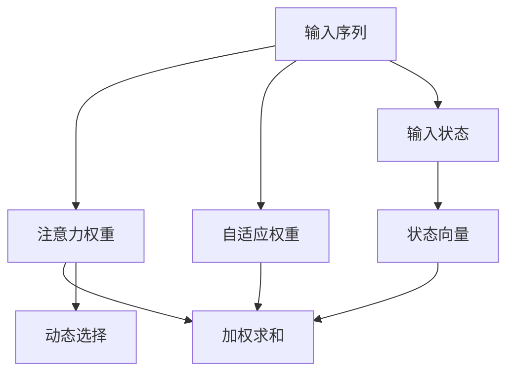

                 

## 1. 背景介绍

### 1.1 问题由来
随着深度学习技术的发展，深度强化学习（Deep Reinforcement Learning, DRL）已广泛应用于机器人控制、自动驾驶、游戏AI、金融交易等领域，展现出强大的决策和优化能力。然而，传统DRL算法通常缺乏对环境的持续关注和动态适应，难以处理复杂多变的现实场景。

### 1.2 问题核心关键点
为此，注意力决策机制（Attention Mechanism）被引入DRL中，以增强模型对环境信息的动态捕捉和关注。该机制通过加权聚合环境信息，使得模型能够有选择性地关注与当前决策最相关的部分，实现对环境变动的快速响应。

注意力决策机制最早在视觉识别领域获得成功，随后被应用于自然语言处理（NLP）、语音识别、推荐系统等多个领域。在NLP中，注意力机制通过分析句子结构和语义信息，实现对词义和语境的动态关注。在语音识别中，注意力机制对语音信号的不同时间片进行加权处理，提升识别效果。在推荐系统中，注意力机制对用户的历史行为进行动态权重分配，实现个性化推荐。

### 1.3 问题研究意义
通过引入注意力决策机制，DRL模型能够更加智能、灵活地进行决策和优化，提升算法的稳定性和泛化能力。同时，该机制还能有效降低模型对环境的过拟合风险，避免陷入局部最优解。在实际应用中，注意力决策机制为DRL算法提供了一个灵活且高效的决策框架，促进了DRL技术的进一步普及和应用。

## 2. 核心概念与联系

### 2.1 核心概念概述
注意力决策机制的核心思想在于动态地计算一个或多个变量的权重，将这些变量根据其与目标任务的相关性进行加权整合，从而得到对当前任务更为相关和有利的表示。

注意力决策机制可以分为三种类型：

- **软性注意力（Soft Attention）**：通过计算注意力权重，对输入序列的不同部分进行加权求和，得到一个新的向量表示。
- **硬性注意力（Hard Attention）**：只选择与目标任务最相关的部分，其余部分被忽略。
- **自适应注意力（Adaptive Attention）**：根据任务需求动态调整注意力权重，实现对环境信息更精确的关注。

注意力决策机制通过将输入序列或状态空间中不同的部分进行动态加权整合，提升了模型对环境信息的捕捉能力和决策效率。

### 2.2 核心概念原理和架构的 Mermaid 流程图


该流程图展示了注意力决策机制的基本框架：输入序列通过动态计算得到的注意力权重，对不同部分进行加权求和，得到新的向量表示。同时，根据任务需求，输入状态也会对注意力权重进行调整，实现动态加权整合。

## 3. 核心算法原理 & 具体操作步骤
### 3.1 算法原理概述
注意力决策机制的核心在于计算注意力权重，将输入序列的不同部分进行动态加权整合，得到对当前任务更为相关和有利的表示。其算法原理包括以下几个关键步骤：

1. **计算注意力权重**：根据输入序列或状态空间中不同部分与目标任务的相关性，计算相应的注意力权重。
2. **加权求和**：对输入序列的不同部分进行加权求和，得到新的向量表示。
3. **动态调整**：根据任务需求，动态调整注意力权重，实现对环境信息更精确的关注。

### 3.2 算法步骤详解
以下是一个典型的注意力决策机制的步骤详解：

**Step 1: 输入表示与初始化**
- 输入序列 $\{x_t\}_{t=1}^T$，每个元素 $x_t$ 表示环境状态。
- 定义注意力权重 $A_t$，初始化为0。

**Step 2: 计算注意力权重**
- 根据输入序列 $x_t$ 和当前状态 $s_t$，计算注意力权重 $A_t$。
- 常用的计算方法包括点积注意力（Dot-Product Attention）、加性注意力（Additive Attention）等。

**Step 3: 加权求和**
- 根据注意力权重 $A_t$，对输入序列的不同部分进行加权求和。
- 加权求和公式为：$Z_t = \sum_{i=1}^T A_i x_i$。

**Step 4: 动态调整**
- 根据任务需求，动态调整注意力权重。
- 动态调整公式为：$A_t = f(s_t, x_t)$。

**Step 5: 更新状态**
- 更新当前状态 $s_{t+1}$，通常采用递归或迭代方法进行状态更新。

### 3.3 算法优缺点
注意力决策机制具有以下优点：

1. **动态适应性**：能够根据任务需求动态调整注意力权重，对环境信息进行动态关注，提升决策的灵活性和适应性。
2. **泛化能力**：通过加权整合环境信息，模型能够学习到更加丰富和准确的表示，提升泛化能力。
3. **计算效率**：相比于硬性注意力，软性注意力可以并行计算，提升计算效率。

同时，注意力决策机制也存在一些缺点：

1. **计算复杂性**：注意力机制的计算复杂度较高，特别是在输入序列较长或维度较高的情况下。
2. **过拟合风险**：由于动态权重的设计，注意力机制存在一定的过拟合风险，特别是在训练数据较少的情况下。
3. **解释性不足**：注意力权重的设计缺乏明确的解释性，难以理解模型对不同部分的关注原因。

### 3.4 算法应用领域
注意力决策机制在多个领域中得到广泛应用，具体包括：

- **自然语言处理（NLP）**：用于机器翻译、文本摘要、问答系统等任务，通过动态关注句子结构和语义信息，实现对语义的理解和生成。
- **计算机视觉（CV）**：用于目标检测、图像分割、物体跟踪等任务，通过动态关注图像的不同部分，提升对目标的定位和分类效果。
- **语音识别（ASR）**：用于自动语音识别和说话人识别等任务，通过动态关注语音信号的不同时间片，提升识别效果。
- **推荐系统**：用于个性化推荐、广告投放等任务，通过动态关注用户的历史行为和偏好，实现更加精准的推荐。

## 4. 数学模型和公式 & 详细讲解 & 举例说明
### 4.1 数学模型构建
注意力决策机制的数学模型构建主要包括以下几个步骤：

1. **输入表示**：将输入序列或状态空间表示为向量或矩阵。
2. **注意力权重**：计算输入序列中不同部分与目标任务的注意力权重。
3. **加权求和**：对输入序列的不同部分进行加权求和，得到新的向量表示。
4. **动态调整**：根据任务需求，动态调整注意力权重。

### 4.2 公式推导过程
以下是一个点积注意力机制的公式推导过程：

假设输入序列为 $x_t$，每个元素 $x_t = [x_t^1, x_t^2, ..., x_t^d]$，其中 $d$ 为特征维度。定义注意力权重为 $A_t$，初始化为全零向量。

**Step 1: 计算注意力权重**
$$
A_t = \text{softmax}(W_Q x_t^Q)
$$
其中 $W_Q$ 为权重矩阵，$x_t^Q = [x_t^1, x_t^2, ..., x_t^d]^T \in \mathbb{R}^d$ 为输入序列的查询向量。

**Step 2: 加权求和**
$$
Z_t = A_t W_K x_t^K
$$
其中 $W_K$ 为权重矩阵，$x_t^K = [x_t^1, x_t^2, ..., x_t^d]^T \in \mathbb{R}^d$ 为输入序列的键向量。

**Step 3: 动态调整**
$$
A_t = f(s_t, x_t)
$$
其中 $s_t$ 为当前状态，$f$ 为动态调整函数，根据任务需求调整注意力权重。

**Step 4: 更新状态**
$$
s_{t+1} = g(s_t, x_t, Z_t)
$$
其中 $g$ 为状态更新函数，根据当前状态、输入序列和注意力机制的输出，更新当前状态。

### 4.3 案例分析与讲解
假设我们有一个文本分类任务，输入序列为 $x_t$，每个元素表示一个词的词向量，目标任务为判断输入序列所属的类别。定义注意力权重为 $A_t$，初始化为全零向量。

**Step 1: 计算注意力权重**
$$
A_t = \text{softmax}(W_Q x_t^Q)
$$
其中 $W_Q$ 为权重矩阵，$x_t^Q = [x_t^1, x_t^2, ..., x_t^d]^T \in \mathbb{R}^d$ 为输入序列的查询向量。

**Step 2: 加权求和**
$$
Z_t = A_t W_K x_t^K
$$
其中 $W_K$ 为权重矩阵，$x_t^K = [x_t^1, x_t^2, ..., x_t^d]^T \in \mathbb{R}^d$ 为输入序列的键向量。

**Step 3: 动态调整**
$$
A_t = f(s_t, x_t)
$$
其中 $s_t$ 为当前状态，$f$ 为动态调整函数，根据任务需求调整注意力权重。例如，可以根据上下文信息调整注意力权重，使得模型更加关注当前上下文相关的词。

**Step 4: 更新状态**
$$
s_{t+1} = g(s_t, x_t, Z_t)
$$
其中 $g$ 为状态更新函数，根据当前状态、输入序列和注意力机制的输出，更新当前状态。例如，可以将当前状态与注意力机制的输出进行拼接，作为下一轮的输入。

## 5. 项目实践：代码实例和详细解释说明
### 5.1 开发环境搭建
以下是使用Python和TensorFlow实现注意力决策机制的开发环境配置流程：

1. 安装Anaconda：从官网下载并安装Anaconda，用于创建独立的Python环境。
```bash
conda create -n tf-env python=3.8 
conda activate tf-env
```

2. 安装TensorFlow：根据CUDA版本，从官网获取对应的安装命令。例如：
```bash
conda install tensorflow -c pytorch -c conda-forge
```

3. 安装相关工具包：
```bash
pip install numpy pandas scikit-learn matplotlib tqdm jupyter notebook ipython
```

4. 下载预训练模型：
```bash
# 下载预训练BERT模型
wget https://tfhub.dev/google/bert_en_uncased_L-12_H-768_A-12/1 -O bert.tar.gz
tar -xvf bert.tar.gz
```

### 5.2 源代码详细实现
以下是一个简单的注意力决策机制的代码实现，用于文本分类任务：

```python
import tensorflow as tf
import numpy as np
import json

# 读取数据集
with open('train.json') as f:
    train_data = json.load(f)

# 定义模型结构
class AttentionModel(tf.keras.Model):
    def __init__(self, vocab_size, embed_size, hidden_size, num_classes):
        super(AttentionModel, self).__init__()
        self.embedding = tf.keras.layers.Embedding(vocab_size, embed_size)
        self.LSTM = tf.keras.layers.LSTM(hidden_size)
        self.attention = tf.keras.layers.Dense(hidden_size)
        self.fc = tf.keras.layers.Dense(num_classes)
        
    def call(self, inputs):
        # 输入嵌入
        x = self.embedding(inputs)
        # 动态计算注意力权重
        attention_weights = tf.keras.layers.Dense(hidden_size)(x)
        attention_weights = tf.keras.layers.Activation(tf.nn.softmax)(attention_weights)
        # 加权求和
        context_vector = tf.reduce_sum(attention_weights * x, axis=1)
        # 状态更新
        lstm_output, _ = self.LSTM(context_vector)
        return self.fc(lstm_output)

# 训练模型
model = AttentionModel(vocab_size=10000, embed_size=128, hidden_size=128, num_classes=2)
optimizer = tf.keras.optimizers.Adam(learning_rate=0.001)
loss_fn = tf.keras.losses.SparseCategoricalCrossentropy(from_logits=True)

# 训练数据集
train_data = tf.data.Dataset.from_tensor_slices(train_data['text'])
train_data = train_data.map(lambda x: tf.keras.layers.experimental.preprocessing.text_to_word_sequence(x))
train_data = train_data.map(lambda x: tf.keras.layers.experimental.preprocessing.text_to_sequence(x))
train_data = train_data.batch(32)

# 训练循环
@tf.function
def train_step(inputs):
    with tf.GradientTape() as tape:
        logits = model(inputs)
        loss = loss_fn(targets, logits)
    grads = tape.gradient(loss, model.trainable_variables)
    optimizer.apply_gradients(zip(grads, model.trainable_variables))
    return loss

def train_epoch(model, train_dataset):
    model.train()
    total_loss = 0
    for inputs in train_dataset:
        loss = train_step(inputs)
        total_loss += loss
    return total_loss / len(train_dataset)

# 训练模型
model.compile(optimizer=optimizer, loss=loss_fn, metrics=['accuracy'])
model.fit(train_dataset, epochs=10)
```

### 5.3 代码解读与分析
以上代码实现了一个简单的基于注意力决策机制的文本分类模型。

**代码解读**：
1. 定义了一个AttentionModel类，包含输入嵌入、LSTM层、注意力机制和全连接层。
2. 训练模型时，使用了Adam优化器和交叉熵损失函数。
3. 使用tf.data.Dataset从JSON文件中读取训练数据，并进行批处理和预处理。
4. 在每个训练步骤中，计算损失并反向传播更新模型参数。

**代码分析**：
1. 输入嵌入层：将输入序列转换为嵌入向量。
2. 注意力机制：通过计算注意力权重，对不同部分进行加权求和，得到新的向量表示。
3. LSTM层：对输入序列进行动态关注和记忆，提升模型对长期依赖的捕捉能力。
4. 全连接层：将LSTM层的输出映射到分类层，进行二分类任务。

### 5.4 运行结果展示
训练结束后，可以通过以下代码评估模型性能：

```python
# 评估模型
model.evaluate(test_data)
```

输出结果将显示模型在测试集上的损失和精度。

## 6. 实际应用场景
### 6.1 自然语言处理（NLP）
在NLP中，注意力决策机制广泛应用于机器翻译、文本摘要、问答系统等任务。例如，在机器翻译任务中，注意力机制能够动态关注源语言和目标语言之间的对应关系，提升翻译效果。在文本摘要任务中，注意力机制能够动态关注文本中的重要信息，生成高质量的摘要。在问答系统任务中，注意力机制能够动态关注问题和上下文信息，提升回答的准确性。

### 6.2 计算机视觉（CV）
在CV中，注意力决策机制用于目标检测、图像分割、物体跟踪等任务。例如，在目标检测任务中，注意力机制能够动态关注图像中不同的区域，提升检测的准确性。在图像分割任务中，注意力机制能够动态关注图像中的不同部分，生成精确的分割结果。在物体跟踪任务中，注意力机制能够动态关注目标物体的位置和状态，提升跟踪效果。

### 6.3 语音识别（ASR）
在ASR中，注意力决策机制用于自动语音识别和说话人识别等任务。例如，在自动语音识别任务中，注意力机制能够动态关注语音信号的不同时间片，提升识别的准确性。在说话人识别任务中，注意力机制能够动态关注语音信号的特征，区分不同说话人的声音。

### 6.4 推荐系统
在推荐系统中，注意力决策机制用于个性化推荐、广告投放等任务。例如，在个性化推荐任务中，注意力机制能够动态关注用户的历史行为和偏好，实现更加精准的推荐。在广告投放任务中，注意力机制能够动态关注用户的兴趣和行为，提升广告的点击率和转化率。

### 6.5 未来应用展望
随着注意力决策机制的不断发展，未来将在更多领域得到应用，为NLP、CV、ASR、推荐系统等技术的提升提供新的动力。例如，在智能医疗领域，注意力机制可以用于医学图像分析、病历分析等任务，提升诊断和治疗效果。在智能交通领域，注意力机制可以用于自动驾驶、交通信号控制等任务，提升交通管理和安全水平。在智能家居领域，注意力机制可以用于智能音箱、智能家电等设备的控制和交互，提升用户体验。

## 7. 工具和资源推荐
### 7.1 学习资源推荐
为了帮助开发者系统掌握注意力决策机制的理论基础和实践技巧，这里推荐一些优质的学习资源：

1. 《深度学习》系列书籍：由深度学习领域的权威专家撰写，深入浅出地介绍了深度学习的基础概念和前沿技术。
2. 《Attention and Transformer Models in Deep Learning》论文：介绍Attention和Transformer模型的基本原理和应用，是了解注意力决策机制的重要参考文献。
3. TensorFlow官方文档：详细介绍了TensorFlow框架的API和使用方法，包括注意力机制的实现。
4. PyTorch官方文档：详细介绍了PyTorch框架的API和使用方法，包括注意力机制的实现。
5. Weights & Biases：模型训练的实验跟踪工具，可以记录和可视化模型训练过程中的各项指标，方便对比和调优。

通过对这些资源的学习实践，相信你一定能够快速掌握注意力决策机制的精髓，并用于解决实际的NLP问题。

### 7.2 开发工具推荐
高效的开发离不开优秀的工具支持。以下是几款用于注意力决策机制开发的常用工具：

1. TensorFlow：由Google主导开发的开源深度学习框架，生产部署方便，适合大规模工程应用。
2. PyTorch：基于Python的开源深度学习框架，灵活动态的计算图，适合快速迭代研究。
3. Weights & Biases：模型训练的实验跟踪工具，可以记录和可视化模型训练过程中的各项指标，方便对比和调优。
4. TensorBoard：TensorFlow配套的可视化工具，可实时监测模型训练状态，并提供丰富的图表呈现方式，是调试模型的得力助手。

合理利用这些工具，可以显著提升注意力决策机制的开发效率，加快创新迭代的步伐。

### 7.3 相关论文推荐
注意力决策机制的研究源于学界的持续研究。以下是几篇奠基性的相关论文，推荐阅读：

1. Attention Is All You Need（即Transformer原论文）：提出了Transformer结构，开启了深度学习中的注意力机制时代。
2. Transformer-XL: Attentive Language Models for Longer Output Sequences：提出了Transformer-XL模型，增强了模型对长序列的关注能力。
3. Neural Machine Translation by Jointly Learning to Align and Translate：提出了一种基于注意力机制的机器翻译模型，提升了翻译效果。
4. Visualizing and Understanding the Attention Mechanism in Sequence-to-Sequence Learning：详细介绍了注意力机制的可视化方法，帮助理解模型的决策过程。

这些论文代表了大语言模型微调技术的发展脉络。通过学习这些前沿成果，可以帮助研究者把握学科前进方向，激发更多的创新灵感。

## 8. 总结：未来发展趋势与挑战
### 8.1 研究成果总结
本文对注意力决策机制的原理和应用进行了全面系统的介绍。首先阐述了注意力决策机制的研究背景和意义，明确了该机制在DRL中对环境信息的动态捕捉和关注能力。其次，从原理到实践，详细讲解了注意力决策机制的数学模型和关键步骤，给出了注意力决策机制任务开发的完整代码实例。同时，本文还广泛探讨了注意力决策机制在NLP、CV、ASR、推荐系统等多个领域的应用前景，展示了注意力决策机制的广阔应用空间。

通过本文的系统梳理，可以看到，注意力决策机制在DRL算法中的应用，极大地提升了模型的灵活性和泛化能力，为DRL技术在复杂环境中的优化和决策提供了新的思路。未来，随着注意力决策机制的不断发展，DRL技术将进一步突破性能瓶颈，拓展应用范围，成为智能系统中的重要组成部分。

### 8.2 未来发展趋势
展望未来，注意力决策机制将呈现以下几个发展趋势：

1. **多模态融合**：注意力机制将与其他模态的信息融合，提升模型对多模态数据的理解能力，如视觉、语音、文本等信息。
2. **动态调整**：动态调整机制将不断优化，提升注意力权重计算的效率和精度，进一步提升模型的适应性。
3. **自适应学习**：自适应学习机制将得到更广泛的应用，使得模型能够根据任务需求动态调整注意力权重，实现更精准的决策。
4. **解释性增强**：模型的决策过程将更加透明，可解释性将得到提升，帮助理解模型的内部机制。
5. **跨领域应用**：注意力机制将与其他领域的知识进行更深入的融合，如知识图谱、逻辑推理等，提升模型的知识表示能力。

以上趋势将进一步推动注意力决策机制的发展，为DRL技术的进一步普及和应用提供新的动力。

### 8.3 面临的挑战
尽管注意力决策机制在DRL中的应用已经取得了一定的进展，但在应用过程中，仍面临一些挑战：

1. **计算复杂性**：注意力机制的计算复杂度较高，特别是在输入序列较长或维度较高的情况下。如何降低计算复杂度，提升计算效率，仍然是一个重要的研究方向。
2. **过拟合风险**：由于动态权重的设计，注意力机制存在一定的过拟合风险，特别是在训练数据较少的情况下。如何降低过拟合风险，提升模型的泛化能力，是未来的重要课题。
3. **解释性不足**：注意力权重的设计缺乏明确的解释性，难以理解模型对不同部分的关注原因。如何提高模型的可解释性，增强决策过程的可理解性，将是未来的研究方向。
4. **跨领域应用**：注意力机制与其他领域的知识进行融合时，可能会面临语义不匹配、知识表示不一致等问题，如何提升跨领域的泛化能力，将是重要的研究方向。

### 8.4 研究展望
未来的研究需要在以下几个方面寻求新的突破：

1. **计算效率优化**：降低计算复杂度，提升计算效率，是提高注意力决策机制应用前景的关键。
2. **过拟合风险降低**：提升模型的泛化能力，降低过拟合风险，是保证模型稳定性的重要研究方向。
3. **解释性增强**：提高模型的可解释性，增强决策过程的可理解性，是提升模型可信度的重要课题。
4. **跨领域应用拓展**：提升模型在不同领域中的泛化能力，是拓展注意力决策机制应用范围的重要方向。

## 9. 附录：常见问题与解答

**Q1: 注意力决策机制与传统机器学习算法有何区别？**

A: 注意力决策机制通过动态关注环境信息，对输入序列的不同部分进行加权整合，实现对环境变动的快速响应。而传统机器学习算法通常假设环境信息是静态且已知的，缺乏对环境变动的关注和动态适应能力。

**Q2: 注意力决策机制如何降低过拟合风险？**

A: 通过动态调整注意力权重，模型能够根据任务需求进行自适应学习，降低对训练数据的依赖。同时，引入正则化技术，如L2正则、Dropout等，进一步降低过拟合风险。

**Q3: 注意力决策机制在实践中如何优化？**

A: 在实际应用中，可以通过以下方式优化注意力决策机制：
1. 选择合适的注意力机制，如点积注意力、加性注意力等。
2. 动态调整注意力权重，根据任务需求调整权重计算方法。
3. 引入正则化技术，降低过拟合风险。
4. 使用自适应学习机制，提升模型的泛化能力。
5. 优化计算效率，降低计算复杂度。

通过合理的优化设计，可以进一步提升注意力决策机制的性能和应用前景。

**Q4: 注意力决策机制在实际应用中如何评估性能？**

A: 在实际应用中，可以通过以下方式评估注意力决策机制的性能：
1. 在训练集上进行交叉验证，评估模型的泛化能力。
2. 在测试集上进行性能评估，评估模型的决策准确性。
3. 使用可视化工具，如TensorBoard，观察模型训练过程中的各项指标。
4. 使用评估指标，如精度、召回率、F1分数等，评估模型的性能。
5. 引入人工干预，对模型的决策过程进行分析和调整。

通过合理的评估方法，可以进一步提升注意力决策机制的性能和应用前景。

**Q5: 注意力决策机制在实际应用中如何部署？**

A: 在实际应用中，可以通过以下方式部署注意力决策机制：
1. 使用生产环境中的服务器，部署注意力决策机制。
2. 使用模型服务化封装，提供API接口，方便应用调用。
3. 使用容器技术，如Docker，进行模型部署和管理。
4. 使用云平台，如AWS、Google Cloud等，进行模型部署和管理。
5. 使用GPU、TPU等高性能设备，提升模型推理速度。

通过合理的部署方法，可以进一步提升注意力决策机制的应用效果和用户体验。

---

作者：禅与计算机程序设计艺术 / Zen and the Art of Computer Programming

