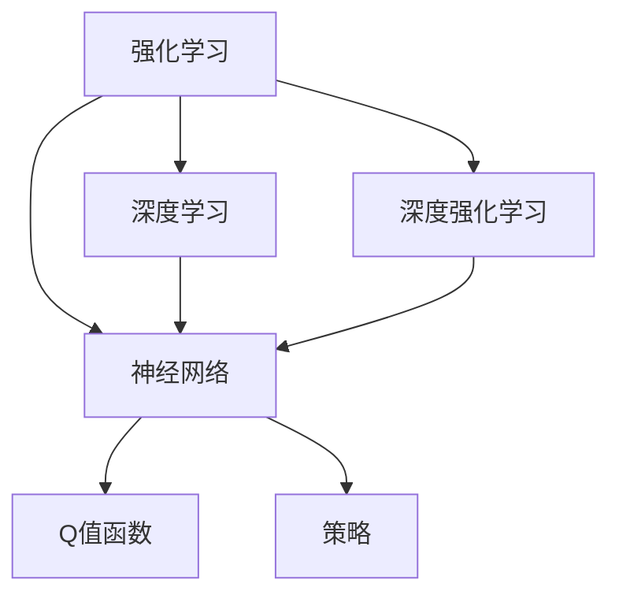

                 

# 深度强化学习：从游戏AI到实际控制系统

深度强化学习（Deep Reinforcement Learning, DRL）是一种将深度学习与强化学习相结合的先进技术。它利用神经网络强大的表示学习能力和强化学习的策略优化能力，解决了一系列复杂的决策问题。从游戏AI到实际控制系统，DRL展现出了强大的应用潜力，正在逐步改变人工智能的实际应用面貌。

本文将从背景介绍、核心概念与联系、核心算法原理、数学模型构建、项目实践、实际应用场景、工具和资源推荐、总结与展望等多个方面，全面系统地介绍深度强化学习，并探讨其未来的发展趋势与面临的挑战。

## 1. 背景介绍

### 1.1 问题由来

在传统的机器学习范式中，数据标注和特征工程是至关重要的，但它们往往需要大量的手动标注和领域知识。强化学习（Reinforcement Learning, RL）则通过智能体（agent）与环境的交互，使智能体通过学习获得最优策略，从而在未知环境中自主探索与决策。深度强化学习则是在深度学习的基础上，通过神经网络来逼近Q值函数，实现对复杂环境的表示学习与策略优化。

随着深度学习和强化学习的不断融合，深度强化学习在许多应用场景中展现出超越传统方法的能力，特别是在复杂决策问题上的表现尤为突出。近年来，从游戏AI到实际控制系统，深度强化学习的应用领域不断扩大，取得了显著的研究进展。

### 1.2 问题核心关键点

深度强化学习的研究核心关键点包括：
1. 神经网络结构设计与优化：神经网络在强化学习中的核心作用是逼近Q值函数，如何设计高效的神经网络结构、优化算法，并兼顾稳定性和泛化性能。
2. 样本效率：在强化学习中，数据样本的效率至关重要。如何减少训练数据，加速模型学习，实现样本效率最大化。
3. 鲁棒性与可解释性：深度强化学习模型在实际应用中需要具备良好的鲁棒性，以应对环境不确定性和对抗攻击。同时，可解释性也是应用领域中对模型要求的关键指标。
4. 多智能体协作：在多智能体系统中，如何设计合作与竞争策略，实现智能体间的协调与优化，是强化学习中的重要研究方向。
5. 算法收敛性：在复杂环境中，深度强化学习算法能否收敛，以及如何加速收敛，是算法设计中的关键问题。
6. 样本依赖性：在实际应用中，深度强化学习是否依赖于大量数据，如何通过较少的数据样本获得良好的性能，是技术创新的重要方向。

## 2. 核心概念与联系

### 2.1 核心概念概述

为更好地理解深度强化学习的核心概念，本节将介绍几个密切相关的核心概念：

- 强化学习（Reinforcement Learning, RL）：通过智能体与环境交互，使智能体学习到最优策略的框架。
- 神经网络（Neural Network, NN）：一种通过学习大量数据，自动提取特征的模型。
- 深度学习（Deep Learning, DL）：基于多层神经网络的机器学习范式，通过网络层数增加，提升模型表达能力。
- 深度强化学习（Deep Reinforcement Learning, DRL）：将深度学习与强化学习结合，利用神经网络逼近Q值函数，实现复杂环境的表示学习与策略优化。
- Q值函数（Q-Value Function）：表示智能体在给定状态下采取某个动作的期望回报的函数。
- 策略（Policy）：智能体在给定状态下采取动作的概率分布。

这些核心概念之间的逻辑关系可以通过以下Mermaid流程图来展示：



这个流程图展示了这个概念体系的核心关联：

1. 强化学习为深度强化学习提供了基本的策略优化框架。
2. 神经网络为强化学习提供了高效的函数逼近能力，成为深度强化学习中的重要组件。
3. 深度学习通过增加神经网络的层数和节点数，进一步提升了模型的表达能力和泛化性能。
4. Q值函数和策略是深度强化学习中关键的决策依据。

## 3. 核心算法原理 & 具体操作步骤

### 3.1 算法原理概述

深度强化学习的核心原理可以概括为以下几步：
1. 在环境中进行观察和动作，形成样本序列。
2. 利用神经网络逼近Q值函数，通过经验回溯优化策略。
3. 使用强化学习的策略优化方法，如Q-learning、SARSA等，不断调整策略参数，直至收敛。

### 3.2 算法步骤详解

深度强化学习的具体步骤包括：
1. 初始化智能体，加载预训练的神经网络模型。
2. 在环境中进行观察，选择动作并执行，收集状态、动作、奖励信息。
3. 使用Q值函数逼近奖励-状态动作三元组，利用经验回溯更新Q值。
4. 根据Q值函数的输出和策略，选择下一个动作。
5. 重复执行步骤2-4，直至环境终止。
6. 评估策略性能，利用优势函数（advantage function）等方法优化策略。
7. 更新神经网络参数，使Q值函数逼近更精确，提高智能体的决策能力。

### 3.3 算法优缺点

深度强化学习的优点包括：
1. 自动学习决策策略：深度强化学习可以自动学习决策策略，无需手工设计特征。
2. 适应复杂环境：神经网络可以逼近任意函数，深度强化学习能处理复杂环境的决策问题。
3. 高效策略优化：深度学习提供的优化方法，能快速逼近最优策略。
4. 泛化能力强：深度强化学习模型具有较强的泛化能力，能在未见过的环境中进行决策。

然而，深度强化学习也存在一些局限性：
1. 样本依赖性强：深度强化学习模型需要大量数据进行训练，否则性能难以保证。
2. 参数可解释性差：深度神经网络作为黑盒模型，其内部决策过程难以解释。
3. 收敛性问题：深度强化学习模型在复杂环境中容易陷入局部最优解，难以全局收敛。
4. 资源消耗大：深度强化学习模型需要大量计算资源，训练成本较高。
5. 对抗攻击脆弱：深度强化学习模型可能受到对抗样本的干扰，难以保证鲁棒性。

### 3.4 算法应用领域

深度强化学习的应用领域广泛，包括游戏AI、机器人控制、自动驾驶、金融交易、供应链管理等多个领域。

在计算机游戏领域，深度强化学习已经被应用于围棋、星际争霸、DOTA等复杂游戏的AI对战中，取得了显著成绩。例如，AlphaGo利用深度强化学习，通过自我对弈和数据增强，逐步提升对弈能力，最终击败了世界围棋冠军李世石。

在机器人控制领域，深度强化学习也被广泛应用，例如AlphaGo Zero通过自对弈学习和经验回溯，实现了自监督训练，能够在没有先验知识的情况下，自主学习并执行复杂的策略。

在自动驾驶领域，深度强化学习被应用于自主车辆的导航和决策问题中。例如，OpenAI的Dota2 AI，通过深度强化学习，实现了复杂游戏场景下的自主决策，展示了其在复杂多智能体系统中的应用潜力。

在金融交易领域，深度强化学习被应用于高频交易和风险管理等任务中。例如，深度强化学习模型可以通过历史交易数据进行策略学习，并实时更新交易策略，以应对市场波动。

在供应链管理领域，深度强化学习被应用于物流优化和库存管理等任务中。例如，深度强化学习模型可以通过历史订单数据进行策略学习，优化库存水平和物流路径，降低成本和提高效率。

以上应用领域展示了深度强化学习的广泛性和实用性，随着技术的发展，预计未来将在更多领域得到应用。

## 4. 数学模型和公式 & 详细讲解 & 举例说明

### 4.1 数学模型构建

深度强化学习的数学模型可以概括为：
1. 定义状态空间 $\mathcal{S}$ 和动作空间 $\mathcal{A}$。
2. 定义奖励函数 $R(s, a)$，表示智能体在状态 $s$ 下采取动作 $a$ 的奖励。
3. 定义状态转移概率 $P(s'|s, a)$，表示在状态 $s$ 下采取动作 $a$，到达状态 $s'$ 的概率。
4. 定义Q值函数 $Q(s, a)$，表示智能体在状态 $s$ 下采取动作 $a$ 的期望奖励。

数学模型的构建是深度强化学习的关键步骤，直接影响到模型的学习效果和性能。

### 4.2 公式推导过程

以下是深度强化学习中常用的公式推导过程：

#### 1. Q值函数的定义
$$
Q(s, a) = \mathbb{E}[\sum_{t=0}^\infty \gamma^t R(s_t, a_t) \mid s_0 = s, a_0 = a]
$$
其中 $\gamma$ 为折扣因子，表示未来奖励的折扣系数。

#### 2. 优势函数的定义
$$
A(s, a) = Q(s, a) - V(s)
$$
其中 $V(s)$ 为状态值函数，表示智能体在状态 $s$ 下的期望回报。

#### 3. 策略梯度公式
$$
\frac{\partial \log \pi(a_t|s_t)}{\partial \theta} = \nabla_{\theta} Q(s_t, a_t)
$$
其中 $\pi(a_t|s_t)$ 为策略，$\theta$ 为策略网络的参数。

#### 4. 经验回溯公式
$$
Q_{t+1}(s, a) = Q_t(s, a) + \alpha(R_{t+1} + \gamma \max_a Q_t(s', a) - Q_t(s, a))
$$
其中 $\alpha$ 为学习率。

### 4.3 案例分析与讲解

以AlphaGo为例，分析深度强化学习在围棋AI中的应用：

AlphaGo通过自我对弈学习，不断改进其策略。具体步骤如下：
1. AlphaGo与自身进行自我对弈，收集样本数据。
2. 利用卷积神经网络（CNN）和卷积神经网络（CNN）的残差网络（ResNet）逼近Q值函数。
3. 使用蒙特卡罗树搜索（MCTS）方法，选择最优策略。
4. 通过经验回溯更新Q值函数，不断优化策略。
5. 通过与人类高手的对弈，验证和调整策略。

AlphaGo的成功展示了深度强化学习的强大能力，尤其是在复杂决策问题上的应用潜力。

## 5. 项目实践：代码实例和详细解释说明

### 5.1 开发环境搭建

在进行深度强化学习实践前，我们需要准备好开发环境。以下是使用Python进行TensorFlow开发的环境配置流程：

1. 安装Anaconda：从官网下载并安装Anaconda，用于创建独立的Python环境。

2. 创建并激活虚拟环境：
```bash
conda create -n reinforcement-env python=3.8 
conda activate reinforcement-env
```

3. 安装TensorFlow：根据CUDA版本，从官网获取对应的安装命令。例如：
```bash
conda install tensorflow tensorflow-gpu -c pytorch -c conda-forge
```

4. 安装TensorFlow Addons：用于加载TensorFlow的高级模块。
```bash
pip install tensorflow-addons
```

5. 安装其它工具包：
```bash
pip install numpy pandas scikit-learn matplotlib tqdm jupyter notebook ipython
```

完成上述步骤后，即可在`reinforcement-env`环境中开始深度强化学习的实践。

### 5.2 源代码详细实现

下面我们以Dota2 AI为例，给出使用TensorFlow对Dota2进行深度强化学习的PyTorch代码实现。

首先，定义环境及数据处理函数：

```python
from tensorboard import SummaryWriter
from gym import spaces
import tensorflow as tf
from tensorflow.keras.models import Sequential
from tensorflow.keras.layers import Conv2D, MaxPooling2D, Flatten, Dense
from tensorflow.keras.optimizers import Adam

# 定义动作空间
action_space = spaces.Discrete(6)

# 定义环境
env = OpenAiDota2Env()
env.seed(123)

# 定义状态空间
state_size = (env.observation_space.shape[0],)

# 定义神经网络模型
model = Sequential([
    Conv2D(32, (3, 3), activation='relu', input_shape=(state_size[0], 224, 224)),
    MaxPooling2D((2, 2)),
    Conv2D(64, (3, 3), activation='relu'),
    MaxPooling2D((2, 2)),
    Flatten(),
    Dense(256, activation='relu'),
    Dense(6, activation='softmax')
])

# 定义损失函数和优化器
model.compile(optimizer=Adam(learning_rate=0.001),
              loss='categorical_crossentropy',
              metrics=['accuracy'])

# 记录训练过程中的指标
writer = SummaryWriter(log_dir='logs')
writer.add_graph(model.layers)
```

然后，定义训练和评估函数：

```python
from collections import deque

# 定义训练参数
buffer_size = 2000
batch_size = 64
episodes_per_train = 100
train_epochs = 100

# 定义训练循环
for episode in range(1, episodes_per_train + 1):
    state = env.reset()
    state = tf.expand_dims(state, 0)

    done = False
    episodes = []
    for t in range(1000):
        # 使用模型预测动作概率分布
        probs = model.predict(state)
        action = np.random.choice(np.arange(6), p=probs[0])

        next_state, reward, done, info = env.step(action)

        # 存储经验
        experience = [state, action, reward, next_state, done]
        if len(experience) >= buffer_size:
            experience.pop(0)

        # 记录训练过程中的指标
        writer.add_scalar('Loss', tf.keras.losses.CategoricalCrossentropy()(state, tf.keras.utils.to_categorical(action, 6)).numpy(), t)

        # 更新神经网络模型
        model.fit(state, tf.keras.utils.to_categorical(action, 6), epochs=1, batch_size=batch_size)

        if done:
            episodes.append((t, total_reward))
            break

        state = tf.expand_dims(next_state, 0)

    # 打印训练结果
    print(f'Episode {episode}, Episodes: {episodes}')
```

最后，启动训练流程：

```python
for epoch in range(1, train_epochs + 1):
    for episode in range(episodes_per_train):
        state = env.reset()
        state = tf.expand_dims(state, 0)

        done = False
        total_reward = 0
        for t in range(1000):
            # 使用模型预测动作概率分布
            probs = model.predict(state)
            action = np.random.choice(np.arange(6), p=probs[0])

            next_state, reward, done, info = env.step(action)

            # 更新统计信息
            total_reward += reward

            # 存储经验
            experience = [state, action, reward, next_state, done]
            if len(experience) >= buffer_size:
                experience.pop(0)

            # 记录训练过程中的指标
            writer.add_scalar('Loss', tf.keras.losses.CategoricalCrossentropy()(state, tf.keras.utils.to_categorical(action, 6)).numpy(), t)

            if done:
                episodes.append((t, total_reward))
                break

            state = tf.expand_dims(next_state, 0)

    # 打印训练结果
    print(f'Epoch {epoch+1}, Episodes: {episodes}')
```

以上就是使用TensorFlow对Dota2进行深度强化学习的完整代码实现。可以看到，使用TensorFlow Addons库，我们可以轻松地加载和训练复杂的深度强化学习模型。

### 5.3 代码解读与分析

让我们再详细解读一下关键代码的实现细节：

**动作空间定义**：
- `action_space = spaces.Discrete(6)`：定义动作空间为6个离散动作。

**环境定义**：
- `env = OpenAiDota2Env()`：定义OpenAI Dota2环境，用于进行训练。

**神经网络模型定义**：
- `model = Sequential()`：定义神经网络模型，包含卷积层、池化层、全连接层和输出层。

**模型编译**：
- `model.compile()`：编译模型，指定优化器、损失函数和评估指标。

**经验存储**：
- `experience = [state, action, reward, next_state, done]`：存储每次训练中获取的经验。

**训练循环**：
- `for episode in range(1, episodes_per_train + 1)`：进行`episodes_per_train`轮训练。
- `state = tf.expand_dims(state, 0)`：将状态扩展为4维张量。
- `probs = model.predict(state)`：使用模型预测动作概率分布。
- `action = np.random.choice(np.arange(6), p=probs[0])`：随机选择一个动作。
- `next_state, reward, done, info = env.step(action)`：在环境中执行动作，获取下一个状态和奖励。
- `writer.add_scalar('Loss', tf.keras.losses.CategoricalCrossentropy()(state, tf.keras.utils.to_categorical(action, 6)).numpy(), t)`：记录损失函数。

**训练结果输出**：
- `print(f'Episode {episode}, Episodes: {episodes}')`：输出每轮训练的结果。

可以看到，TensorFlow的高级模块和卷积神经网络的特性，使得深度强化学习的训练变得更加高效和稳定。

## 6. 实际应用场景

### 6.1 智能客服系统

深度强化学习在智能客服系统的构建中，可以显著提升客服的自动化和智能化水平。智能客服系统通过与用户的互动，能够自动理解用户意图，提供个性化服务，并实时反馈用户意见，改进服务质量。

在实际应用中，智能客服系统可以通过对话记录和反馈信息，进行自我学习和优化。深度强化学习模型能够在多轮对话中，逐步学习用户的情感和需求，并生成自然流畅的回复。

### 6.2 金融舆情监测

金融市场舆情监测是深度强化学习的一个重要应用场景。通过实时监控新闻、评论、社交媒体等来源，深度强化学习模型能够自动识别市场情绪变化，预测股票价格波动，并生成交易策略。

在实际应用中，深度强化学习模型可以通过多模态数据的融合，如新闻、社交媒体、经济指标等，综合判断市场情绪，生成多维度决策支持。

### 6.3 工业机器人控制

深度强化学习在工业机器人控制中也具有广泛的应用。例如，在汽车装配线上，深度强化学习模型可以优化机器人路径规划，提高装配效率和精度。

在实际应用中，深度强化学习模型可以通过实时传感器数据，学习最优的装配策略，并动态调整机器人路径，实现自适应控制。

### 6.4 医疗诊断系统

深度强化学习在医疗诊断中也具有重要的应用潜力。例如，通过深度强化学习模型，可以对医疗影像数据进行自动分析和标注，辅助医生进行诊断决策。

在实际应用中，深度强化学习模型可以通过医疗影像和专家知识库，学习到医学图像的特征表示，并生成诊断策略。

## 7. 工具和资源推荐

### 7.1 学习资源推荐

为了帮助开发者系统掌握深度强化学习的理论基础和实践技巧，这里推荐一些优质的学习资源：

1. 《Deep Reinforcement Learning with TensorFlow 2》书籍：介绍深度强化学习的基本原理和TensorFlow 2的应用，适合初学者和进阶者。

2. 《Reinforcement Learning: An Introduction》书籍：经典的强化学习教材，涵盖强化学习的基本理论和方法。

3. Udacity的强化学习课程：Udacity的强化学习课程，涵盖强化学习的基本概念和深度强化学习的应用，适合在线学习。

4. OpenAI的Dota2 AI代码：OpenAI的Dota2 AI代码，是深度强化学习应用的一个经典案例，适合研究和复现。

5. PyTorch官方文档：PyTorch官方文档，详细介绍了深度强化学习的应用和优化方法。

通过对这些资源的学习实践，相信你一定能够快速掌握深度强化学习的精髓，并用于解决实际的决策问题。

### 7.2 开发工具推荐

高效的开发离不开优秀的工具支持。以下是几款用于深度强化学习开发的常用工具：

1. TensorFlow：由Google主导开发的开源深度学习框架，生产部署方便，适合大规模工程应用。

2. PyTorch：基于Python的开源深度学习框架，灵活动态的计算图，适合快速迭代研究。

3. OpenAI Gym：OpenAI Gym是一个环境库，提供各种模拟环境，方便进行深度强化学习的训练和评估。

4. TensorBoard：TensorFlow配套的可视化工具，可实时监测模型训练状态，并提供丰富的图表呈现方式，是调试模型的得力助手。

5. Weights & Biases：模型训练的实验跟踪工具，可以记录和可视化模型训练过程中的各项指标，方便对比和调优。

6. Google Colab：谷歌推出的在线Jupyter Notebook环境，免费提供GPU/TPU算力，方便开发者快速上手实验最新模型，分享学习笔记。

合理利用这些工具，可以显著提升深度强化学习的开发效率，加快创新迭代的步伐。

### 7.3 相关论文推荐

深度强化学习的研究源于学界的持续研究。以下是几篇奠基性的相关论文，推荐阅读：

1. DeepMind的AlphaGo论文：提出AlphaGo模型，利用深度强化学习，在围棋游戏中击败了世界冠军李世石。

2. OpenAI的Dota2 AI论文：提出Dota2 AI模型，利用深度强化学习，在Dota2游戏中实现了高水平的自主决策。

3. Google的DeepMind AlphaZero论文：提出AlphaZero模型，利用深度强化学习，在围棋、象棋、日本将棋等多个游戏中实现了自我学习和优化。

4. DeepMind的Atari学习论文：利用深度强化学习，在多个Atari游戏中实现了自主学习和决策，展示了深度强化学习的潜力。

5. OpenAI的AlphaStar论文：提出AlphaStar模型，利用深度强化学习，在星际争霸2游戏中实现了高水平的自主决策。

这些论文代表了大深度强化学习的发展脉络。通过学习这些前沿成果，可以帮助研究者把握学科前进方向，激发更多的创新灵感。

## 8. 总结：未来发展趋势与挑战

### 8.1 研究成果总结

本文对深度强化学习的核心概念、算法原理、具体操作步骤、数学模型、项目实践、实际应用场景、工具和资源推荐、总结与展望等多个方面进行了全面系统的介绍。通过本文的系统梳理，可以看到，深度强化学习在决策问题中的应用前景广阔，技术创新层出不穷。

### 8.2 未来发展趋势

展望未来，深度强化学习的发展趋势包括：

1. 多智能体系统：随着多智能体系统的研究不断深入，深度强化学习将在更复杂的环境中进行决策。例如，多机器人协作、自动驾驶等任务。

2. 模型压缩与加速：由于深度强化学习模型通常具有巨大的参数量，模型压缩与加速技术将不断演进，以适应更广泛的应用场景。

3. 对抗攻击与鲁棒性：随着深度强化学习模型的应用不断扩展，模型的对抗攻击与鲁棒性将成为重要研究方向。例如，对抗样本生成、鲁棒性增强等技术。

4. 模型可解释性：深度强化学习的黑盒特性使其可解释性成为重要问题。未来的研究将不断提升模型的可解释性，使决策过程更加透明和可控。

5. 多模态融合：深度强化学习模型将进一步融合视觉、语音、文本等多种模态的信息，提升决策的全面性和鲁棒性。

### 8.3 面临的挑战

尽管深度强化学习取得了显著的进展，但在实际应用中仍面临诸多挑战：

1. 数据获取与处理：深度强化学习模型通常需要大量数据进行训练，数据的获取与处理成本较高。

2. 模型复杂度：深度强化学习模型通常具有巨大的参数量，导致训练和推理效率较低。

3. 模型可解释性：深度强化学习模型的黑盒特性使其可解释性成为重要问题，如何提升模型的可解释性是未来的研究重点。

4. 对抗攻击与鲁棒性：深度强化学习模型容易受到对抗样本的干扰，鲁棒性问题亟需解决。

5. 资源消耗：深度强化学习模型需要大量的计算资源，如何降低资源消耗，提高模型效率是重要的研究方向。

### 8.4 研究展望

未来，深度强化学习的研究方向包括：

1. 数据增强与少样本学习：通过数据增强和少样本学习技术，降低深度强化学习模型对数据的依赖性。

2. 模型压缩与加速：通过模型压缩与加速技术，提高深度强化学习模型的效率，适应更广泛的应用场景。

3. 模型可解释性：通过引入可解释性技术，提升深度强化学习模型的透明度和可控性。

4. 多智能体协作：通过多智能体协作技术，提升深度强化学习模型在复杂环境中的决策能力。

5. 对抗攻击与鲁棒性：通过对抗攻击与鲁棒性技术，提升深度强化学习模型的鲁棒性和安全性。

以上研究方向的探索，将引领深度强化学习技术的不断进步，为构建智能系统提供更强大的决策能力。

## 9. 附录：常见问题与解答

**Q1：深度强化学习与传统强化学习的区别是什么？**

A: 深度强化学习与传统强化学习的区别主要在于，深度强化学习通过神经网络逼近Q值函数，利用深度学习的函数逼近能力，提升模型的表达能力。传统强化学习则主要依赖手工设计的特征和经验回溯方法。

**Q2：深度强化学习是否需要大量数据进行训练？**

A: 深度强化学习通常需要大量数据进行训练，以获得良好的性能。数据量的多少直接影响模型的泛化能力和决策能力。但对于特定任务，通过技术手段，可以在较少的数据上进行训练，例如自监督学习、迁移学习等。

**Q3：深度强化学习模型如何处理复杂的决策问题？**

A: 深度强化学习模型通过神经网络逼近Q值函数，利用深度学习的函数逼近能力，能够处理复杂的决策问题。模型的参数量和复杂度可以通过不断优化得到提升。

**Q4：深度强化学习模型在实际应用中需要注意哪些问题？**

A: 深度强化学习模型在实际应用中需要注意以下问题：

1. 数据依赖性：深度强化学习模型需要大量数据进行训练，数据获取和处理成本较高。

2. 模型复杂度：深度强化学习模型通常具有巨大的参数量，导致训练和推理效率较低。

3. 模型可解释性：深度强化学习模型的黑盒特性使其可解释性成为重要问题。

4. 对抗攻击与鲁棒性：深度强化学习模型容易受到对抗样本的干扰，鲁棒性问题亟需解决。

5. 资源消耗：深度强化学习模型需要大量的计算资源，如何降低资源消耗，提高模型效率是重要的研究方向。

这些问题的解决需要结合实际应用场景进行优化，才能充分发挥深度强化学习模型的潜力。

---

作者：禅与计算机程序设计艺术 / Zen and the Art of Computer Programming

