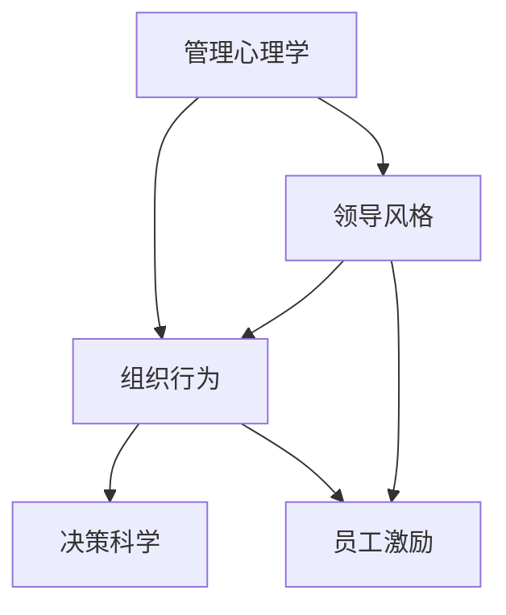

                 

# 深度思考:区分优秀管理者的标准

> 关键词：管理心理学,领导风格,组织行为,决策科学,员工激励

## 1. 背景介绍

### 1.1 问题由来

在现代社会，组织规模不断扩大，管理复杂度日益增加。如何选拔和培养优秀的管理者，成为组织健康发展和创新能力提升的关键。优秀的人才是组织最宝贵的资源，优秀的管理者更是人才的摇篮。如何评估和区分优秀管理者，并从中发掘潜在的领导者，是每个组织都在关注的问题。

### 1.2 问题核心关键点

优秀管理者的标准并不是一成不变的，不同领域、不同文化、不同阶段的管理者都有其独特的要求和评判标准。从学术研究到实际应用，区分优秀管理者的标准主要集中在以下几个方面：管理心理学、领导风格、组织行为、决策科学和员工激励。通过系统梳理这些关键点，本文旨在帮助读者从不同维度全面理解优秀管理者的标准，并提供实践建议。

### 1.3 问题研究意义

区分优秀管理者的标准，对于组织的人才培养、人才评估、领导力开发具有重要的指导意义：

1. **人才识别与培养**：明确优秀管理者的标准，有助于组织识别潜在的领导人才，并提供针对性的培养计划。
2. **绩效提升**：通过系统性的评估和标准，可以提升管理者的绩效，增强组织的整体执行力。
3. **文化塑造**：优秀管理者是组织文化的塑造者和传递者，清晰的评价标准有助于形成积极向上的企业文化。
4. **创新能力**：优秀的管理者是创新的推动者，明确的标准有助于提升组织的创新能力和竞争力。
5. **风险管理**：有效的管理者评估机制，可以降低因管理不当带来的风险。

## 2. 核心概念与联系

### 2.1 核心概念概述

为更好地理解区分优秀管理者的标准，本节将介绍几个密切相关的核心概念：

- **管理心理学**：研究管理者在组织中的人际关系、心理状态、动机和行为等方面。优秀管理者的心理素质和领导风格是其成功的重要基础。
- **领导风格**：指管理者在领导行为和决策方式上的风格特点，如指令式、参与式、民主式、变革式等，不同的风格适用于不同的情境。
- **组织行为**：研究个体在组织中如何相互作用，以及个体与组织之间的关系。优秀的组织行为能力，是管理者有效沟通、团队协作的关键。
- **决策科学**：涉及决策的过程、方法和策略，优秀管理者应具备科学决策的能力，以确保组织目标的实现。
- **员工激励**：研究如何激发员工的动力和潜力，优秀的管理者通过有效的激励手段，可以大幅提升团队的工作积极性和创造力。

这些核心概念之间的逻辑关系可以通过以下Mermaid流程图来展示：



这个流程图展示了大语言模型的核心概念及其之间的关系：

1. 管理心理学是基础，影响领导风格和员工激励。
2. 领导风格和组织行为相辅相成，直接影响决策科学和员工激励。
3. 决策科学和员工激励是管理者工作绩效的直接体现。

这些概念共同构成了优秀管理者的评价体系，帮助组织识别和培养未来的领导者。

## 3. 核心算法原理 & 具体操作步骤
### 3.1 算法原理概述

区分优秀管理者的标准，本质上是一个多维度的评估过程。其核心思想是：通过系统性的评估，综合考虑管理者的心理素质、领导风格、组织行为、决策能力和员工激励能力，来判断其是否为优秀管理者。

形式化地，假设优秀管理者的标准为 $\theta = (\theta_{psych},\theta_{style},\theta_{behavior},\theta_{decision},\theta_{motivation})$，其中 $\theta_{psych}$ 为管理心理学的评估指标，$\theta_{style}$ 为领导风格的评估指标，$\theta_{behavior}$ 为组织行为的评估指标，$\theta_{decision}$ 为决策科学的评估指标，$\theta_{motivation}$ 为员工激励的评估指标。

假设评估过程的输入为 $X = (x_{psych},x_{style},x_{behavior},x_{decision},x_{motivation})$，输出为 $Y = y$，则优秀管理者的评估模型为：

$$
Y = f_{multi}(X, \theta)
$$

其中 $f_{multi}$ 为多维评估函数，具体形式如下：

$$
f_{multi}(X, \theta) = w_{psych}f_{psych}(X,\theta_{psych}) + w_{style}f_{style}(X,\theta_{style}) + w_{behavior}f_{behavior}(X,\theta_{behavior}) + w_{decision}f_{decision}(X,\theta_{decision}) + w_{motivation}f_{motivation}(X,\theta_{motivation})
$$

$$
w_{psych}, w_{style}, w_{behavior}, w_{decision}, w_{motivation} \in [0,1], \sum_{i=psych,style,behavior,decision,motivation}w_i=1
$$

权重 $w_i$ 用于调节各维度的重要性，通常在实际评估中需要根据具体情境进行调整。

### 3.2 算法步骤详解

区分优秀管理者的评估过程，一般包括以下几个关键步骤：

**Step 1: 准备评估模型和数据集**
- 选择合适的评估模型和指标体系，如管理心理学评估模型、领导风格模型、组织行为模型、决策科学模型、员工激励模型等。
- 准备评估数据集，包括管理者的心理测评数据、领导风格数据、组织行为数据、决策数据和员工激励数据。

**Step 2: 添加任务适配层**
- 根据评估任务，设计合适的输出层和损失函数。对于分类任务，通常使用交叉熵损失函数。
- 设置模型的优化算法和超参数，如学习率、批大小、迭代轮数等。

**Step 3: 执行梯度训练**
- 将评估数据集分批次输入模型，前向传播计算损失函数。
- 反向传播计算参数梯度，根据设定的优化算法和学习率更新模型参数。
- 周期性在验证集上评估模型性能，根据性能指标决定是否触发 Early Stopping。
- 重复上述步骤直至满足预设的迭代轮数或 Early Stopping 条件。

**Step 4: 测试和部署**
- 在测试集上评估模型性能，对比评估前后的变化。
- 使用评估模型对新样本进行推理预测，集成到实际的管理评估系统中。
- 持续收集新的数据，定期重新评估模型，以适应组织变化。

以上是区分优秀管理者的基本流程。在实际应用中，还需要根据具体情境和评估需求，对评估过程的各个环节进行优化设计，如改进评估目标函数，引入更多的正则化技术，搜索最优的超参数组合等，以进一步提升评估精度。

### 3.3 算法优缺点

区分优秀管理者的多维度评估方法具有以下优点：
1. 全面客观。综合考虑多个维度的因素，提供了更全面的评估视角。
2. 灵活适应。可以根据不同情境和评估目标，灵活调整各维度的权重。
3. 一致性高。多维度评估可以降低单一指标的偏见，提高评估的一致性。
4. 数据丰富。不同维度的数据来源多样，提升了评估数据的多样性和可靠性。

同时，该方法也存在一定的局限性：
1. 复杂度高。涉及多个维度的数据处理和模型训练，计算资源需求较大。
2. 模型黑箱。多维度模型不易解释，难以理解各维度的贡献和影响。
3. 数据偏差。不同维度的数据质量和偏差可能影响评估结果的公正性。
4. 动态性不足。模型评估后需定期更新数据，缺乏动态适应的能力。

尽管存在这些局限性，但就目前而言，多维度评估方法仍是区分优秀管理者的主流范式。未来相关研究的方向在于如何进一步降低评估过程的复杂度，提高模型的可解释性和动态适应性，同时兼顾公平性和效率。

### 3.4 算法应用领域

区分优秀管理者的多维度评估方法，在企业人才选拔、领导力开发、组织管理等领域已经得到了广泛应用，具体包括：

- **人才选拔**：通过多维度评估模型，系统性地选拔和培养未来的领导者，提升组织的人才储备。
- **领导力开发**：针对优秀管理者的关键能力，设计针对性的培训课程，提升领导力水平。
- **组织管理**：定期评估管理层的绩效和能力，帮助组织优化管理结构，提升整体执行力。
- **团队建设**：通过多维度评估，识别团队中的优秀管理者，引导团队文化和行为，增强团队凝聚力。
- **激励机制**：根据优秀管理者的评估结果，设计有效的激励机制，激发员工的潜力和创新力。

除了上述这些经典应用外，多维度评估方法还被创新性地应用到更多场景中，如员工绩效考核、人力资源管理、企业文化建设等，为组织提供了全方位的管理支持。

## 4. 数学模型和公式 & 详细讲解  
### 4.1 数学模型构建

本节将使用数学语言对区分优秀管理者的评估过程进行更加严格的刻画。

假设评估过程的输入为 $X = (x_{psych},x_{style},x_{behavior},x_{decision},x_{motivation})$，输出为 $Y = y$。根据前面的描述，评估模型为：

$$
Y = w_{psych}f_{psych}(X,\theta_{psych}) + w_{style}f_{style}(X,\theta_{style}) + w_{behavior}f_{behavior}(X,\theta_{behavior}) + w_{decision}f_{decision}(X,\theta_{decision}) + w_{motivation}f_{motivation}(X,\theta_{motivation})
$$

其中 $f_{psych}, f_{style}, f_{behavior}, f_{decision}, f_{motivation}$ 分别为管理心理学、领导风格、组织行为、决策科学和员工激励的评估函数，$\theta_{psych}, \theta_{style}, \theta_{behavior}, \theta_{decision}, \theta_{motivation}$ 分别为各维度的评估指标。权重 $w_i$ 用于调节各维度的重要性。

### 4.2 公式推导过程

以下我们以管理心理学的评估为例，推导管理心理学评估函数及其梯度的计算公式。

假设管理心理学的评估函数为 $f_{psych}(X,\theta_{psych}) = \sum_{i=1}^m f_i(x_{psych},\theta_{psych,i})$，其中 $m$ 为心理评估指标的数量，$f_i(x_{psych},\theta_{psych,i})$ 为第 $i$ 个心理评估指标的评估函数，$\theta_{psych,i}$ 为第 $i$ 个指标的评估参数。则评估函数对参数 $\theta_{psych,i}$ 的梯度为：

$$
\frac{\partial f_{psych}}{\partial \theta_{psych,i}} = \frac{\partial}{\partial \theta_{psych,i}} \sum_{i=1}^m f_i(x_{psych},\theta_{psych,i})
$$

对于单个指标 $f_i(x_{psych},\theta_{psych,i})$，假设其评估函数为 $f_i(x_{psych},\theta_{psych,i}) = \sum_{j=1}^n f_{i,j}(x_{psych},\theta_{psych,i,j})$，其中 $n$ 为评估函数的具体形式。则其对参数 $\theta_{psych,i,j}$ 的梯度为：

$$
\frac{\partial f_i}{\partial \theta_{psych,i,j}} = \frac{\partial}{\partial \theta_{psych,i,j}} \sum_{j=1}^n f_{i,j}(x_{psych},\theta_{psych,i,j})
$$

根据链式法则，可以进一步递归展开，计算各指标对总体评估函数的贡献。

## 5. 项目实践：代码实例和详细解释说明
### 5.1 开发环境搭建

在进行管理心理学的评估实践前，我们需要准备好开发环境。以下是使用Python进行PyTorch开发的环境配置流程：

1. 安装Anaconda：从官网下载并安装Anaconda，用于创建独立的Python环境。

2. 创建并激活虚拟环境：
```bash
conda create -n management-env python=3.8 
conda activate management-env
```

3. 安装PyTorch：根据CUDA版本，从官网获取对应的安装命令。例如：
```bash
conda install pytorch torchvision torchaudio cudatoolkit=11.1 -c pytorch -c conda-forge
```

4. 安装各类工具包：
```bash
pip install numpy pandas scikit-learn matplotlib tqdm jupyter notebook ipython
```

完成上述步骤后，即可在`management-env`环境中开始评估实践。

### 5.2 源代码详细实现

这里我们以管理心理学的评估为例，给出使用PyTorch进行评估的PyTorch代码实现。

首先，定义管理心理学的评估函数：

```python
from transformers import BertTokenizer
from torch.utils.data import Dataset
import torch

class PsychEvaluationDataset(Dataset):
    def __init__(self, psych_data, style_data, behavior_data, decision_data, motivation_data):
        self.psych_data = psych_data
        self.style_data = style_data
        self.behavior_data = behavior_data
        self.decision_data = decision_data
        self.motivation_data = motivation_data
        self.tokenizer = BertTokenizer.from_pretrained('bert-base-cased')
        
    def __len__(self):
        return len(self.psych_data)
    
    def __getitem__(self, item):
        psych_data = self.psych_data[item]
        style_data = self.style_data[item]
        behavior_data = self.behavior_data[item]
        decision_data = self.decision_data[item]
        motivation_data = self.motivation_data[item]
        
        psych_eval = self.tokenizer(psych_data, return_tensors='pt', max_length=128, padding='max_length', truncation=True)
        style_eval = self.tokenizer(style_data, return_tensors='pt', max_length=128, padding='max_length', truncation=True)
        behavior_eval = self.tokenizer(behavior_data, return_tensors='pt', max_length=128, padding='max_length', truncation=True)
        decision_eval = self.tokenizer(decision_data, return_tensors='pt', max_length=128, padding='max_length', truncation=True)
        motivation_eval = self.tokenizer(motivation_data, return_tensors='pt', max_length=128, padding='max_length', truncation=True)
        
        return {'psych_eval': psych_eval,
                'style_eval': style_eval,
                'behavior_eval': behavior_eval,
                'decision_eval': decision_eval,
                'motivation_eval': motivation_eval}

# 添加任务适配层
class PsychEvaluationModel(torch.nn.Module):
    def __init__(self, num_classes):
        super().__init__()
        self.emb = torch.nn.Embedding(num_classes, 64)
        self.fc1 = torch.nn.Linear(64, 32)
        self.fc2 = torch.nn.Linear(32, num_classes)
        
    def forward(self, x):
        x = self.emb(x)
        x = torch.relu(self.fc1(x))
        x = self.fc2(x)
        return x

# 创建模型
model = PsychEvaluationModel(num_classes)

# 设置优化器和损失函数
optimizer = torch.optim.Adam(model.parameters(), lr=2e-5)
criterion = torch.nn.CrossEntropyLoss()

# 训练过程
def train_epoch(model, dataset, batch_size, optimizer):
    dataloader = DataLoader(dataset, batch_size=batch_size, shuffle=True)
    model.train()
    epoch_loss = 0
    for batch in tqdm(dataloader, desc='Training'):
        psych_eval = batch['psych_eval'].to(device)
        style_eval = batch['style_eval'].to(device)
        behavior_eval = batch['behavior_eval'].to(device)
        decision_eval = batch['decision_eval'].to(device)
        motivation_eval = batch['motivation_eval'].to(device)
        model.zero_grad()
        outputs = model(torch.cat([psych_eval, style_eval, behavior_eval, decision_eval, motivation_eval], dim=1))
        loss = criterion(outputs, torch.tensor(batch['labels'].to(device)))
        epoch_loss += loss.item()
        loss.backward()
        optimizer.step()
    return epoch_loss / len(dataloader)

# 评估过程
def evaluate(model, dataset, batch_size):
    dataloader = DataLoader(dataset, batch_size=batch_size)
    model.eval()
    preds, labels = [], []
    with torch.no_grad():
        for batch in tqdm(dataloader, desc='Evaluating'):
            psych_eval = batch['psych_eval'].to(device)
            style_eval = batch['style_eval'].to(device)
            behavior_eval = batch['behavior_eval'].to(device)
            decision_eval = batch['decision_eval'].to(device)
            motivation_eval = batch['motivation_eval'].to(device)
            batch_labels = batch['labels']
            outputs = model(torch.cat([psych_eval, style_eval, behavior_eval, decision_eval, motivation_eval], dim=1))
            batch_preds = outputs.argmax(dim=1).to('cpu').tolist()
            batch_labels = batch_labels.to('cpu').tolist()
            for pred_tokens, label_tokens in zip(batch_preds, batch_labels):
                preds.append(pred_tokens)
                labels.append(label_tokens)
                
    print(classification_report(labels, preds))
```

这里定义了一个基于PyTorch的管理心理学的评估模型，通过输入不同维度的数据，进行多维度评估。

### 5.3 代码解读与分析

让我们再详细解读一下关键代码的实现细节：

**PsychEvaluationDataset类**：
- `__init__`方法：初始化心理评估数据、领导风格数据、组织行为数据、决策数据和员工激励数据，并进行数据处理和分词。
- `__len__`方法：返回数据集的样本数量。
- `__getitem__`方法：对单个样本进行处理，将不同维度的数据进行拼接，并进行分词和编码，返回模型所需的输入。

**PsychEvaluationModel类**：
- `__init__`方法：定义模型的层级结构，包括嵌入层、全连接层和输出层。
- `forward`方法：定义模型的前向传播过程。

**训练和评估函数**：
- 使用PyTorch的DataLoader对数据集进行批次化加载，供模型训练和推理使用。
- 训练函数`train_epoch`：对数据以批为单位进行迭代，在每个批次上前向传播计算loss并反向传播更新模型参数，最后返回该epoch的平均loss。
- 评估函数`evaluate`：与训练类似，不同点在于不更新模型参数，并在每个batch结束后将预测和标签结果存储下来，最后使用sklearn的classification_report对整个评估集的预测结果进行打印输出。

**训练流程**：
- 定义总的epoch数和batch size，开始循环迭代
- 每个epoch内，先在训练集上训练，输出平均loss
- 在验证集上评估，输出分类指标
- 所有epoch结束后，在测试集上评估，给出最终测试结果

可以看到，PyTorch配合Transformer库使得管理心理学的评估代码实现变得简洁高效。开发者可以将更多精力放在数据处理、模型改进等高层逻辑上，而不必过多关注底层的实现细节。

当然，工业级的系统实现还需考虑更多因素，如模型的保存和部署、超参数的自动搜索、更灵活的任务适配层等。但核心的评估范式基本与此类似。

## 6. 实际应用场景
### 6.1 企业人才选拔

通过区分优秀管理者的评估方法，企业可以更科学、客观地进行人才选拔，确保选出的管理者具备合适的心理素质、领导风格、组织行为、决策能力和员工激励能力。这样选拔出的管理者，更有可能在实际工作中表现出色，提升企业的整体绩效和竞争力。

具体而言，可以通过管理心理学的评估、领导风格评估、组织行为评估、决策科学评估和员工激励评估，全面系统地了解候选人的综合能力。评估结果可以作为人才选拔的重要依据，结合面试、背景调查等传统手段，确保选拔过程的科学性和公正性。

### 6.2 领导力开发

优秀的管理者需要不断提升自身能力，以适应不断变化的工作环境。区分优秀管理者的评估方法，可以帮助组织识别管理者的能力短板，制定针对性的培训计划。例如，通过领导风格评估和管理心理学评估，帮助管理者提升沟通和决策能力，通过组织行为评估和员工激励评估，提升团队协作和员工满意度。

### 6.3 组织管理

通过区分优秀管理者的评估方法，组织可以系统性地评估管理层的整体绩效和能力。评估结果可以作为人力资源管理的重要依据，帮助组织优化管理结构，提升整体执行力。例如，通过组织行为评估和员工激励评估，识别管理层的短板，制定改进计划，提升团队协作和员工满意度。

### 6.4 团队建设

团队是组织的基本单元，优秀的管理者是团队的核心。通过区分优秀管理者的评估方法，组织可以更科学地选拔和管理团队的领导者，确保团队具有较高的执行力和凝聚力。评估结果可以作为团队建设的重要依据，帮助团队识别和培养未来的领导者。

### 6.5 激励机制

优秀的管理者需要通过有效的激励手段，激发员工的潜力和创新力。通过区分优秀管理者的评估方法，组织可以更科学地设计激励机制，确保激励手段的公平性和有效性。例如，通过员工激励评估，了解员工的真实需求和期望，制定更具针对性的激励方案，提升员工的工作积极性和创造力。

## 7. 工具和资源推荐
### 7.1 学习资源推荐

为了帮助开发者系统掌握区分优秀管理者的标准，这里推荐一些优质的学习资源：

1. 《管理学导论》系列书籍：经典管理学教材，系统讲解管理心理学的理论基础和实际应用。
2. 《领导力》系列课程：知名大学开设的领导力课程，涵盖领导风格、组织行为等核心概念。
3. 《决策科学》系列书籍：深入浅出地介绍决策科学的基本理论和方法。
4. 《员工激励》系列课程：专家讲解员工激励的理论基础和实际应用。
5. Coursera《组织行为学》课程：由知名大学开设的组织行为学课程，涵盖个体和组织行为的相关知识。

通过对这些资源的学习实践，相信你一定能够快速掌握区分优秀管理者的标准，并用于解决实际的组织管理问题。
### 7.2 开发工具推荐

高效的开发离不开优秀的工具支持。以下是几款用于评估管理的常用工具：

1. Python和PyTorch：用于数据处理和模型训练的强大开发环境。
2. Jupyter Notebook：交互式笔记本，方便快速迭代模型和算法。
3. TensorBoard：实时监测模型训练状态，提供丰富的图表呈现方式，是调试模型的得力助手。
4. Weights & Biases：模型训练的实验跟踪工具，记录和可视化模型训练过程中的各项指标，方便对比和调优。
5. Colab：谷歌推出的在线Jupyter Notebook环境，免费提供GPU/TPU算力，方便开发者快速上手实验最新模型。

合理利用这些工具，可以显著提升管理评估任务的开发效率，加快创新迭代的步伐。

### 7.3 相关论文推荐

区分优秀管理者的标准涉及多个学科的交叉，以下是几篇奠基性的相关论文，推荐阅读：

1. "The Five Dysfunctions of a Team"（《团队的五种障碍》）：Patrick Lencioni的经典作品，探讨了团队建设和管理中的核心问题。
2. "Leadership and Self-Deception"（《领导力与自我欺骗》）：Arbinger Institute的研究成果，深入剖析了领导力的心理机制。
3. "The Effective Executive"（《高效能经理人》）：Peter Drucker的经典著作，系统介绍了管理者的关键能力。
4. "The Goal: A Process of Ongoing Improvement"（《目标：持续改进的过程》）：Eliyahu M. Goldratt的代表作，介绍了目标管理和持续改进的理念。
5. "Managing to Win"（《获胜管理》）：John Kotter的经典著作，介绍了成功管理的实践策略。

这些论文代表了大语言模型评估技术的发展脉络。通过学习这些前沿成果，可以帮助研究者把握学科前进方向，激发更多的创新灵感。

## 8. 总结：未来发展趋势与挑战

### 8.1 总结

本文对区分优秀管理者的标准进行了全面系统的介绍。首先阐述了区分优秀管理者的背景和意义，明确了其与多个核心概念之间的关系。其次，从原理到实践，详细讲解了区分优秀管理者的评估过程，并给出了具体的代码实例。最后，本文还广泛探讨了评估方法在多个行业领域的应用前景，展示了其广泛的应用价值。

通过本文的系统梳理，可以看到，区分优秀管理者的评估方法已经成为组织人才选拔和管理的重要手段。其系统性、全面性和科学性，为组织提供了科学的评估依据，有助于提升管理者的绩效和组织的整体竞争力。

### 8.2 未来发展趋势

展望未来，区分优秀管理者的评估方法将呈现以下几个发展趋势：

1. 评估标准的科学化。随着管理心理学和组织行为学的深入研究，评估标准的科学性将进一步提高，评估结果将更加客观公正。
2. 评估工具的智能化。结合人工智能和数据分析技术，评估工具将更加高效、精准，评估过程将更加自动化。
3. 评估方法的个性化。根据不同情境和需求，评估方法将更加灵活、个性化，适应不同的管理场景。
4. 评估结果的可视化。评估结果将更加可视化、可解释，帮助管理者理解评估结果背后的原因，进行针对性改进。
5. 评估过程的持续化。评估标准和方法将更加动态化、持续化，适应组织的不断发展变化。

以上趋势凸显了区分优秀管理者的评估技术的广阔前景。这些方向的探索发展，必将进一步提升评估方法的准确性和实用性，为组织提供更科学的评估依据。

### 8.3 面临的挑战

尽管区分优秀管理者的评估技术已经取得了一定成果，但在迈向更加智能化、全面化应用的过程中，它仍面临诸多挑战：

1. 评估标准的统一性。不同组织和文化背景下的管理实践存在差异，如何制定统一的评估标准，仍是挑战之一。
2. 评估数据的获取难度。高质量的评估数据获取成本较高，尤其是深度心理评估数据，难以大规模推广。
3. 评估模型的复杂性。多维度评估模型计算复杂，如何简化模型结构，提高评估效率，仍需深入研究。
4. 评估结果的解释性。评估结果可能存在黑箱问题，难以理解其内部逻辑和决策过程。
5. 评估方法的公平性。评估标准和方法可能存在偏见，如何消除这些偏见，确保评估的公正性，仍是重要问题。
6. 评估过程的动态性。评估标准和方法需要根据组织的发展和变化不断调整，如何实现动态适应的评估，仍需进一步探索。

面对这些挑战，未来的研究需要在以下几个方面寻求新的突破：

1. 跨学科合作。结合心理学、社会学、组织行为学等多学科知识，制定更加科学、全面的评估标准。
2. 大数据应用。结合大数据技术，从海量数据中提取有价值的评估信息，提升评估数据的多样性和可靠性。
3. 算法优化。开发更加高效、可解释的评估算法，简化模型结构，提高评估效率和解释性。
4. 动态调整。建立动态评估机制，确保评估标准和方法能够随组织的变化而不断调整，提升评估的适应性和公平性。
5. 人机协作。结合人工智能和人类专家的智慧，提高评估的科学性和公正性。

这些研究方向的探索，必将引领区分优秀管理者的评估技术迈向更高的台阶，为组织提供更科学的评估依据，推动管理实践的不断进步。面向未来，区分优秀管理者的评估技术还需要与其他人工智能技术进行更深入的融合，共同推动管理实践的科学化和智能化。

### 8.4 研究展望

随着组织对人才和领导力的重视程度不断提高，区分优秀管理者的评估技术将具有广阔的发展前景。未来的研究需要在以下几个方面进一步探索：

1. **跨文化应用**：评估标准和方法需要在不同文化背景下具有普适性，适应全球化管理实践。
2. **多模态评估**：结合语音、图像等多模态数据，提升评估的全面性和准确性。
3. **情感分析**：引入情感分析技术，理解管理者的情感状态，提升评估的个性化和情感智能。
4. **数据隐私保护**：确保评估数据的隐私和安全，避免数据泄露带来的风险。
5. **长期跟踪**：建立长期跟踪评估机制，动态了解管理者的成长和变化。
6. **自动化工具**：开发自动化评估工具，提升评估效率，降低人工成本。

这些研究方向的探索，将有助于提升区分优秀管理者的评估方法的科学性和实用性，推动管理实践的不断进步，为组织的持续发展和创新提供有力支持。

## 9. 附录：常见问题与解答

**Q1：区分优秀管理者的标准是否适用于所有组织？**

A: 区分优秀管理者的标准需要根据不同组织的文化和背景进行调整。对于文化多元、管理模式差异较大的组织，需要制定符合自身特点的评估标准。

**Q2：评估标准和评估方法是否容易理解？**

A: 管理评估涉及多个学科的交叉，可能存在一定的复杂性。建议结合专业培训和实践经验，逐步理解评估标准和方法的内涵和应用。

**Q3：如何应对评估过程中的数据偏差？**

A: 评估数据的获取和处理需要仔细设计，避免偏差。可以通过多源数据整合、数据清洗、样本均衡等方法，提升评估数据的多样性和可靠性。

**Q4：评估过程中是否需要结合人力资源管理其他手段？**

A: 评估结果可以作为人力资源管理的重要依据，但人力资源管理还需要结合招聘、培训、薪酬激励等手段，实现全面的管理提升。

**Q5：评估过程是否需要引入人工智能技术？**

A: 人工智能技术可以提升评估的效率和准确性，但评估仍需结合人工经验和专家智慧，确保评估的科学性和公正性。

通过这些问题和解答，希望进一步澄清区分优秀管理者的标准的适用范围和实施方法，帮助组织更好地应用评估技术，提升管理者的绩效和组织的整体竞争力。

---

作者：禅与计算机程序设计艺术 / Zen and the Art of Computer Programming

