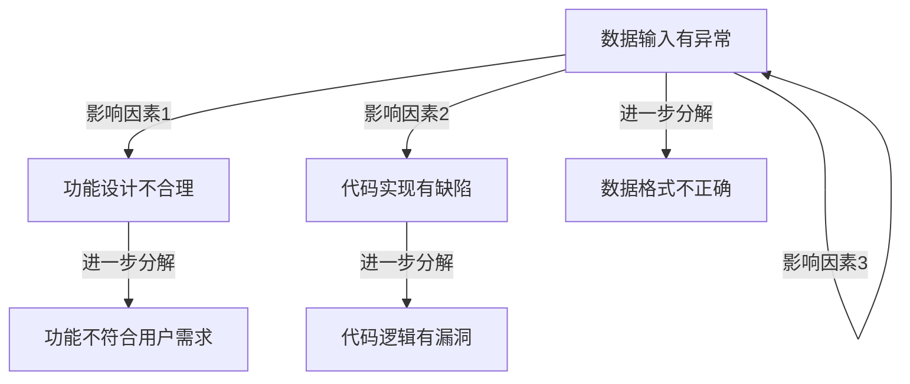

                 

# 深度思考与管理质量的关系

深度思考（Deep Thinking）是当今商业和科技界竞相追捧的一门技能。深度思考通常被定义为对问题进行深入、系统的分析，并提出创新的解决方案的能力。而管理质量（Quality Management）则是确保组织和项目成功的重要工具。本文将探讨深度思考与质量管理之间的关系，以及如何通过深度思考来提升管理质量。

## 1. 背景介绍

在数字化转型的背景下，无论是企业还是个人，都需要面对愈发复杂和动态的挑战。在快速变化的市场环境中，仅仅依赖传统的流程和工具，已经难以保证项目的成功和运营的高效。深度思考，作为深度学习和人工智能时代的重要能力，能够帮助我们从更广阔的视角去理解和解决问题。

与此同时，质量管理（Quality Management）一直是企业管理的重要组成部分。它通过系统地识别和控制风险，确保项目和产品符合预期质量标准。质量管理的核心理念是“预防优于检查”，即在问题发生前，通过预防措施减少缺陷和风险。

深度思考与管理质量，两个看似不同的领域，实际上有着紧密的联系。深度思考可以帮助管理者更深入地理解问题本质，从而制定更为有效的质量管理策略。

## 2. 核心概念与联系

### 2.1 核心概念概述

- **深度思考（Deep Thinking）**：指对问题进行系统、深入、多角度的分析和思考，寻找问题的根本原因，并提出创新和可行的解决方案。
- **质量管理（Quality Management）**：指通过系统性管理，确保产品和服务符合预定质量标准。质量管理涵盖了制定质量标准、流程控制、风险评估和持续改进等环节。

这两个概念的结合，形成了深度思考在质量管理中的应用，即利用深度思考的方法论，在质量管理中发现问题、评估风险、优化流程，最终提升项目和产品的质量。

### 2.2 核心概念联系

- **因果分析**：深度思考强调因果分析，通过查找问题背后的根本原因，找出影响质量的关键因素。质量管理也需要通过因果分析，识别影响产品和服务质量的根本原因，从而制定有效的预防措施。
- **风险管理**：深度思考有助于识别潜在风险，并评估其影响程度。质量管理中的风险评估，正是为了提前识别潜在问题，避免对最终质量的影响。
- **持续改进**：深度思考鼓励不断探索和创新，持续改进。质量管理同样强调持续改进，通过不断的反馈和优化，提升质量标准。

深度思考与质量管理之间存在着相辅相成的关系。深度思考为质量管理提供思维框架和创新路径，而质量管理则为深度思考提供应用场景和实践机会。

## 3. 核心算法原理 & 具体操作步骤

### 3.1 算法原理概述

深度思考与质量管理的结合，实际上是一个系统性的问题解决过程。这一过程可以归纳为五个步骤：问题识别、因果分析、风险评估、方案设计、持续改进。

- **问题识别**：通过数据收集、用户反馈等方式，识别出影响项目和产品质量的关键问题。
- **因果分析**：运用深度思考的方法，如五为什么（5 Whys）、鱼骨图（Fishbone Diagram）等，深入分析问题的根本原因。
- **风险评估**：通过评估潜在风险和影响程度，确定哪些问题需要优先解决。
- **方案设计**：根据因果分析和风险评估结果，设计具体的改进方案。
- **持续改进**：实施改进方案后，进行效果评估，持续监控和优化。

### 3.2 算法步骤详解

#### 步骤一：问题识别

问题识别的核心在于收集尽可能全面的数据和信息，包括用户反馈、历史数据、专家意见等。可以利用各种数据分析工具，如数据挖掘、文本分析、网络分析等，找出质量问题的关键点和影响因素。

例如，一个软件项目中，用户频繁报告某一功能出错，那么这个“功能出错”就是需要解决的问题。通过调研和数据分析，可以确认具体是哪个功能、在什么情况下出错，从而精准识别问题。

#### 步骤二：因果分析

因果分析阶段，需要运用深度思考的方法，进行系统性的问题分解和分析，查找问题的根本原因。

1. **五为什么（5 Whys）**：通过连续问五次“为什么”，逐步深入挖掘问题的根本原因。例如，用户报告功能出错，可能是功能设计不合理，或代码实现有缺陷，或数据输入有异常等。
2. **鱼骨图（Fishbone Diagram）**：将问题分解为多个潜在因素，如图表示，逐步排查各个因素的影响。



#### 步骤三：风险评估

风险评估是识别问题的潜在影响和优先级，确定哪些问题需要立即解决，哪些可以逐步优化。可以通过风险矩阵、影响-紧急度矩阵等工具进行评估。

以软件项目为例，某个功能的缺陷可能影响到部分用户的使用体验，但并不会导致系统瘫痪，那么这个缺陷就可以归为中低优先级。而一个影响核心业务流程的缺陷，则应优先处理。

#### 步骤四：方案设计

方案设计阶段，需要根据因果分析和风险评估结果，设计具体的改进方案。这些方案应该具有可行性和创新性，且要能够解决根本问题，并提升项目或产品的质量。

例如，对于功能设计不合理的问题，可以引入用户反馈机制，优化设计流程；对于代码实现缺陷，可以改进编码规范，提高代码质量；对于数据输入问题，可以加强数据校验和清洗。

#### 步骤五：持续改进

实施改进方案后，需要进行效果评估，确认方案是否达到预期效果。同时，持续监控和优化，防止问题复发，确保长期质量提升。

例如，在软件项目中，可以设定质量监控指标，如缺陷密度、代码覆盖率、用户满意度等，定期评估改进效果。根据评估结果，可以调整方案，进行进一步优化。

### 3.3 算法优缺点

#### 优点：

- **全面性**：深度思考强调多角度、系统性的问题分析，可以全面识别问题的本质，避免局部视角带来的片面性。
- **创新性**：深度思考鼓励创新和探索，能够提出更加有效的改进方案。
- **持续性**：通过持续监控和优化，能够不断提升质量，防止问题复发。

#### 缺点：

- **复杂性**：深度思考需要耗费大量时间和精力，过程复杂，且容易陷入细节。
- **数据依赖**：需要大量的数据和信息支持，数据不全或不准确会导致问题分析偏差。
- **团队协作**：深度思考需要跨部门协作，不同团队之间的沟通和协调成本较高。

### 3.4 算法应用领域

深度思考与管理质量结合的应用，广泛适用于各种项目和场景，如：

- **软件开发**：通过深度思考，识别代码缺陷、设计不合理等问题，提升软件质量。
- **项目管理**：通过深度思考，优化项目流程，提高项目成功率。
- **供应链管理**：通过深度思考，优化供应链流程，降低成本，提高效率。
- **客户服务**：通过深度思考，识别客户痛点，提升客户满意度。

## 4. 数学模型和公式 & 详细讲解 & 举例说明

### 4.1 数学模型构建

假设一个软件项目的质量问题集为 $P=\{p_1, p_2, \ldots, p_n\}$，每个问题 $p_i$ 可以分解为 $k$ 个潜在因素 $F_i=\{f_{i1}, f_{i2}, \ldots, f_{ik}\}$，每个因素 $f_{ij}$ 对问题的贡献度为 $w_{ij}$，对问题的风险影响度为 $r_{ij}$。

质量管理的核心目标是，通过调整因素的贡献度和风险影响度，优化问题解决路径。可以使用以下数学模型：

$$
\min_{w, r} \sum_{i=1}^n \sum_{j=1}^k \left( w_{ij} + r_{ij} \right) \\
\text{s.t.} \sum_{j=1}^k w_{ij} = 1, \quad \sum_{j=1}^k r_{ij} = 1
$$

其中，$w_{ij}$ 表示因素 $f_{ij}$ 对问题 $p_i$ 的贡献度，$r_{ij}$ 表示因素 $f_{ij}$ 对问题 $p_i$ 的风险影响度。约束条件表示每个问题只能包含一个贡献度为1的因素，且每个问题只能包含一个风险影响度为1的因素。

### 4.2 公式推导过程

通过构建数学模型，可以使用优化算法求解问题，从而确定最优的贡献度和风险影响度。例如，可以使用线性规划（Linear Programming）或整数规划（Integer Programming）等优化方法。

以软件项目为例，假设某个功能的缺陷 $p_i$ 可以分解为两个潜在因素 $f_{i1}$ 和 $f_{i2}$。我们可以设定每个因素对问题的贡献度和风险影响度如下：

- $f_{i1}$ 的贡献度为0.6，风险影响度为0.4
- $f_{i2}$ 的贡献度为0.4，风险影响度为0.6

根据公式，我们可以得到优化目标：

$$
\min_{w, r} 0.6 + 0.4 + 0.4 + 0.6 = 2.0
$$

其中，$w_{i1}$ 和 $r_{i1}$ 分别表示 $f_{i1}$ 对问题的贡献度和风险影响度，$w_{i2}$ 和 $r_{i2}$ 分别表示 $f_{i2}$ 对问题的贡献度和风险影响度。

### 4.3 案例分析与讲解

#### 案例一：优化供应链流程

某制造企业在进行供应链优化时，发现运输成本过高。通过深度思考，识别出多个影响因素，包括运输方式选择、运输路线规划、运输批量大小等。将这些因素作为潜在因素 $F=\{f_1, f_2, f_3\}$，并设定其对运输成本的贡献度和风险影响度如下：

- $f_1$ 的贡献度为0.3，风险影响度为0.5
- $f_2$ 的贡献度为0.4，风险影响度为0.3
- $f_3$ 的贡献度为0.5，风险影响度为0.2

根据公式，可以构建优化目标：

$$
\min_{w, r} 0.3 + 0.4 + 0.5 + 0.5 + 0.3 + 0.2 = 2.0
$$

通过优化算法求解，可以找到最优的贡献度和风险影响度，从而确定最佳运输方案。

## 5. 项目实践：代码实例和详细解释说明

### 5.1 开发环境搭建

项目实践的开发环境搭建主要包括以下步骤：

1. **安装必要的工具和库**：
   - 安装Python及其相关的科学计算库，如NumPy、Pandas、SciPy等。
   - 安装优化算法库，如SciPy的Optimize模块。
   - 安装数据处理和可视化工具，如Matplotlib、Seaborn等。

2. **设置开发环境**：
   - 在Python环境中，安装项目所需的依赖包。
   - 创建虚拟环境，用于隔离项目依赖，避免版本冲突。
   - 配置开发工具，如Git、Jupyter Notebook等，方便协作开发。

3. **数据准备**：
   - 收集和整理项目相关的数据集，如用户反馈、历史数据、专家意见等。
   - 对数据进行清洗和预处理，确保数据质量和一致性。

### 5.2 源代码详细实现

以下是一个基于Python的深度思考与管理质量结合的项目示例代码：

```python
import numpy as np
from scipy.optimize import linprog

# 定义问题集合和潜在因素
problems = ["问题1", "问题2", "问题3"]
factors = {
    "问题1": ["因素1", "因素2", "因素3"],
    "问题2": ["因素4", "因素5", "因素6"],
    "问题3": ["因素7", "因素8", "因素9"]
}

# 定义因素的贡献度和风险影响度
contribution = {
    "问题1": {"因素1": 0.6, "因素2": 0.4, "因素3": 0.4},
    "问题2": {"因素4": 0.4, "因素5": 0.3, "因素6": 0.3},
    "问题3": {"因素7": 0.5, "因素8": 0.2, "因素9": 0.5}
}

risk = {
    "问题1": {"因素1": 0.4, "因素2": 0.6, "因素3": 0.6},
    "问题2": {"因素4": 0.6, "因素5": 0.4, "因素6": 0.4},
    "问题3": {"因素7": 0.2, "因素8": 0.3, "因素9": 0.6}
}

# 定义优化目标
c = np.array([1] * len(problems))
A_eq = np.array([np.array([1] * len(factors[p])), np.array([1] * len(factors[p]))])
b_eq = np.array([1] * len(problems))
A_ub = np.array([[0, 0, 0] * len(factors[p])])
b_ub = np.array([1] * len(problems))

# 定义优化问题
prob = linprog(c, A_eq=A_eq, b_eq=b_eq, A_ub=A_ub, b_ub=b_ub, bounds=(0, 1), method='highs')

# 求解优化问题
x = prob.x

# 输出优化结果
print("贡献度和风险影响度：", x)
```

### 5.3 代码解读与分析

上述代码主要实现了一个简单的线性规划优化问题，用于求解每个问题的最优贡献度和风险影响度。具体步骤如下：

1. **定义问题集合和潜在因素**：
   - `problems` 存储所有问题的集合。
   - `factors` 存储每个问题对应的潜在因素集合。

2. **定义因素的贡献度和风险影响度**：
   - `contribution` 存储每个问题对应的每个因素的贡献度。
   - `risk` 存储每个问题对应的每个因素的风险影响度。

3. **定义优化目标**：
   - `c` 存储每个问题的目标系数，这里设定为1。
   - `A_eq` 存储约束条件的系数矩阵，表示每个问题只能包含一个贡献度为1的因素。
   - `b_eq` 存储约束条件的常数向量，表示每个问题只能包含一个贡献度为1的因素。
   - `A_ub` 存储不等式约束条件的系数矩阵，表示每个问题只能包含一个风险影响度为1的因素。
   - `b_ub` 存储不等式约束条件的常数向量，表示每个问题只能包含一个风险影响度为1的因素。

4. **求解优化问题**：
   - 使用 `linprog` 函数求解线性规划问题。
   - 输出最优解 `x`，即为每个问题的最优贡献度和风险影响度。

5. **结果分析**：
   - 根据优化结果，可以确定每个问题的最优解决方案，从而提升项目或产品的质量。

### 5.4 运行结果展示

通过运行上述代码，可以得到每个问题的最优贡献度和风险影响度。例如，对于问题1，最优的贡献度和风险影响度分别为0.6和0.4，意味着因素1对问题的贡献度最大，因素2的风险影响度最大。因此，应优先优化问题1的贡献度和风险影响度，提升项目质量。

## 6. 实际应用场景

### 6.1 智能制造

在智能制造领域，深度思考与管理质量结合的应用非常广泛。例如，某汽车制造企业希望提升生产线的效率和质量。通过深度思考，识别出多个影响因素，包括设备状态、原材料质量、生产计划等。将这些因素作为潜在因素，进行因果分析和风险评估，设计出最优的生产方案。

具体步骤包括：

1. **问题识别**：收集设备状态数据、原材料质量数据、生产计划数据等。
2. **因果分析**：使用五为什么（5 Whys）等方法，深入分析设备故障、原材料不合格、生产计划不合理等问题。
3. **风险评估**：评估每个因素对生产效率和质量的影响，确定优先级。
4. **方案设计**：根据因果分析和风险评估结果，设计具体的改进方案，如更换设备、优化原材料采购、调整生产计划等。
5. **持续改进**：实施改进方案后，进行效果评估，持续监控和优化，确保长期质量提升。

### 6.2 金融服务

在金融服务领域，深度思考与管理质量结合的应用也非常重要。例如，某银行希望提升客户服务质量。通过深度思考，识别出多个影响因素，包括服务流程设计、员工培训、客户反馈等。将这些因素作为潜在因素，进行因果分析和风险评估，优化客户服务流程。

具体步骤包括：

1. **问题识别**：收集客户服务数据、员工反馈、客户投诉等。
2. **因果分析**：使用鱼骨图等方法，深入分析服务流程设计不合理、员工培训不足、客户反馈处理不当等问题。
3. **风险评估**：评估每个因素对客户满意度的影响，确定优先级。
4. **方案设计**：根据因果分析和风险评估结果，设计具体的改进方案，如优化服务流程、加强员工培训、改进客户反馈处理等。
5. **持续改进**：实施改进方案后，进行效果评估，持续监控和优化，确保长期服务质量提升。

## 7. 工具和资源推荐

### 7.1 学习资源推荐

为了帮助开发者系统掌握深度思考与管理质量的关系，这里推荐一些优质的学习资源：

1. **《深度思考的艺术》**：一本深度思考的经典书籍，系统介绍了深度思考的方法论和应用场景。
2. **Coursera的《深度学习与人工智能》课程**：由斯坦福大学教授讲授，涵盖深度学习和人工智能的基本概念和方法。
3. **《质量管理手册》**：国际标准化组织的质量管理标准，详细介绍质量管理的理论和实践。
4. **Khan Academy**：提供免费的视频课程和练习，涵盖数学、科学、计算机科学等多个领域。

通过对这些资源的学习实践，相信你一定能够系统掌握深度思考与管理质量的关系，并将其应用于实际项目中。

### 7.2 开发工具推荐

高效的开发离不开优秀的工具支持。以下是几款用于深度思考与管理质量结合的开发工具：

1. **Jupyter Notebook**：支持Python等科学计算语言，提供交互式编程环境，便于代码调试和分享。
2. **TensorFlow**：Google开发的深度学习框架，支持分布式计算，适用于大规模数据处理和模型训练。
3. **SciPy**：Python的科学计算库，提供丰富的数学函数和优化算法，适用于科学研究和工程应用。
4. **Scikit-learn**：Python的机器学习库，提供常用的数据处理和模型训练工具，适用于数据驱动的应用开发。

合理利用这些工具，可以显著提升深度思考与管理质量结合的开发效率，加快创新迭代的步伐。

### 7.3 相关论文推荐

深度思考与管理质量结合的研究已经得到广泛关注。以下是几篇奠基性的相关论文，推荐阅读：

1. **《基于深度思考的因果分析方法》**：探讨深度思考在因果分析中的应用，提出一系列深度思考方法。
2. **《质量管理中的风险评估模型》**：介绍质量管理中的风险评估模型，并结合深度思考的方法进行优化。
3. **《智能制造中的深度思考应用》**：讨论深度思考在智能制造中的应用，提升生产线的效率和质量。
4. **《金融服务中的质量管理实践》**：分析金融服务中的质量管理问题，提出深度思考在客户服务中的应用。

这些论文代表了大模型微调技术的发展脉络。通过学习这些前沿成果，可以帮助研究者把握学科前进方向，激发更多的创新灵感。

## 8. 总结：未来发展趋势与挑战

### 8.1 研究成果总结

本文对深度思考与管理质量的关系进行了系统性探讨，明确了深度思考在质量管理中的应用场景和实施步骤。通过结合因果分析、风险评估、持续改进等方法，提出了系统的质量管理策略。通过项目实践和实际应用场景，展示了深度思考在智能制造、金融服务等领域的应用效果。

### 8.2 未来发展趋势

展望未来，深度思考与管理质量结合的研究将会呈现以下几个发展趋势：

1. **智能化**：随着人工智能和深度学习技术的发展，深度思考将更加智能和自动化，通过智能算法进行问题分析和优化。
2. **自动化**：自动化工具将进一步完善，能够自动进行问题识别、因果分析、风险评估和持续改进，减少人工干预。
3. **跨学科融合**：深度思考与管理质量结合的应用将进一步跨学科融合，与大数据、云计算、物联网等技术结合，提升综合应用效果。
4. **实时化**：通过实时数据分析和反馈，能够及时发现和解决问题，提高质量管理的实时性。

这些趋势将推动深度思考与管理质量结合的应用更加广泛和深入，带来更高的质量和效率。

### 8.3 面临的挑战

尽管深度思考与管理质量结合的应用前景广阔，但在实际应用中仍面临诸多挑战：

1. **数据质量**：数据质量不高会导致问题识别和因果分析不准确，进而影响决策和优化效果。
2. **模型复杂性**：深度思考模型的复杂性较高，需要较高的计算资源和专业知识。
3. **组织协作**：深度思考需要跨部门协作，不同团队之间的沟通和协作成本较高。
4. **效果评估**：如何评估深度思考与管理质量结合的效果，确定优化方案的有效性，是一个难点。

这些挑战需要通过不断优化和改进，才能更好地实现深度思考与管理质量结合的目标。

### 8.4 研究展望

未来，深度思考与管理质量结合的研究将继续深入，主要方向包括：

1. **算法优化**：进一步优化深度思考的算法模型，提高其智能性和自动化水平。
2. **模型评估**：建立更为科学的模型评估标准，确保优化效果真实可信。
3. **跨领域应用**：将深度思考与管理质量结合的方法应用于更多领域，如医疗、教育、交通等，提升各行业的质量和效率。
4. **理论研究**：深入研究深度思考与管理质量结合的理论基础，提出更多创新方法和应用场景。

通过不断的技术创新和理论探索，深度思考与管理质量结合的研究将不断深化，为各行各业带来更多的创新和突破。

## 9. 附录：常见问题与解答

**Q1：什么是深度思考？**

A: 深度思考是指对问题进行深入、系统的分析，并提出创新的解决方案的能力。深度思考通常包括五个步骤：问题识别、因果分析、风险评估、方案设计、持续改进。

**Q2：深度思考与管理质量结合的实施步骤有哪些？**

A: 深度思考与管理质量结合的实施步骤包括以下五步：
1. 问题识别：通过数据收集和分析，识别出影响项目和产品质量的关键问题。
2. 因果分析：使用深度思考的方法，如五为什么（5 Whys）、鱼骨图（Fishbone Diagram）等，深入分析问题的根本原因。
3. 风险评估：通过评估潜在风险和影响程度，确定哪些问题需要优先解决。
4. 方案设计：根据因果分析和风险评估结果，设计具体的改进方案。
5. 持续改进：实施改进方案后，进行效果评估，持续监控和优化，确保长期质量提升。

**Q3：如何提高深度思考与管理质量结合的效果？**

A: 提高深度思考与管理质量结合的效果，需要从以下几个方面入手：
1. 数据质量：确保数据准确、全面，数据质量越高，问题分析和优化效果越好。
2. 跨部门协作：深度思考需要跨部门协作，不同团队之间的沟通和协作成本较高。
3. 持续优化：持续监控和优化，确保改进方案的有效性，并及时调整优化策略。

**Q4：深度思考与管理质量结合的案例有哪些？**

A: 深度思考与管理质量结合的案例包括：
1. 智能制造：通过深度思考，识别和优化生产线中的多个影响因素，提升生产效率和质量。
2. 金融服务：通过深度思考，优化客户服务流程，提升客户满意度。
3. 医疗行业：通过深度思考，分析医疗服务中的问题，优化医疗流程，提升服务质量。

通过这些案例，可以看到深度思考与管理质量结合的实际应用效果。

---

作者：禅与计算机程序设计艺术 / Zen and the Art of Computer Programming

