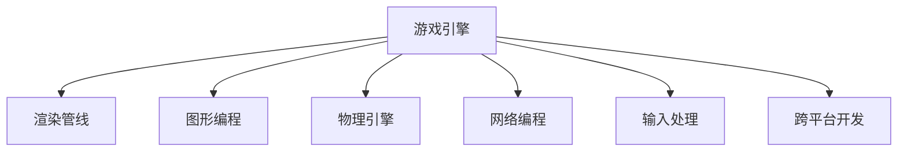

                 

# 游戏框架开发：创建高性能交互式体验

> 关键词：游戏引擎, 渲染管线, 图形编程, 性能优化, 物理引擎, 跨平台开发, 网络编程, 输入处理

## 1. 背景介绍

### 1.1 问题由来
随着计算机图形技术的发展，游戏开发领域逐渐从传统的2D游戏向3D游戏、多人在线游戏等领域扩展。现代游戏开发过程中，游戏引擎扮演了至关重要的角色。游戏引擎负责从低层次的游戏逻辑、渲染、物理模拟，到高层次的AI、音频、用户界面等各个方面，提供了统一的开发接口和底层支持。

现代游戏引擎的复杂性和多样性，使得游戏开发变得越来越具有挑战性。如何构建高性能、易扩展、易维护的游戏框架，是所有游戏开发者面临的重要问题。

### 1.2 问题核心关键点
在构建高性能游戏框架的过程中，我们面临着多个关键问题：

- 渲染管线优化：如何设计高效、可扩展的渲染管线，最大化地利用硬件资源。
- 图形编程：如何高效地处理图形数据和渲染命令，提高渲染效率。
- 物理引擎：如何在游戏世界中实现真实的物理模拟，提升游戏沉浸感。
- 网络编程：如何实现稳定、高效的网络通信，支持多人在线游戏。
- 输入处理：如何处理用户的输入，提供流畅的交互体验。
- 跨平台开发：如何构建可跨多个平台运行的游戏框架，保证游戏在各种设备上的稳定性。

### 1.3 问题研究意义
构建高性能游戏框架对于提升游戏开发效率、提升游戏运行性能、改善用户体验等方面具有重要意义：

- 降低开发难度：游戏框架提供了统一的开发接口和工具，减少了游戏开发者需要关注的技术细节，降低了开发难度。
- 提高运行性能：通过优化渲染管线、图形编程、物理引擎等方面，提升游戏运行效率和稳定性。
- 增强用户体验：通过高效的网络通信和输入处理，提供流畅、自然的用户交互体验。
- 支持跨平台：构建跨平台的游戏框架，允许游戏在各种设备上运行，拓宽游戏受众群体。

## 2. 核心概念与联系

### 2.1 核心概念概述

为了更好地理解高性能游戏框架的构建，本节将介绍几个密切相关的核心概念：

- 游戏引擎(Game Engine)：提供游戏开发所需的底层技术支持，包括渲染、物理模拟、网络通信等。
- 渲染管线(Render Pipeline)：负责从模型、着色器、光照到最终的渲染输出，是渲染效率和效果的关键。
- 图形编程(Graphic Programming)：处理图形数据的编码和渲染命令的执行，直接影响渲染性能。
- 物理引擎(Physics Engine)：模拟真实世界的物理现象，如重力、碰撞、弹性等，提升游戏沉浸感。
- 网络编程(Network Programming)：实现游戏网络通信，支持多人在线游戏。
- 输入处理(Input Handling)：处理用户的输入，如键盘、鼠标、手柄等，提供流畅的交互体验。
- 跨平台开发(Cross-Platform Development)：构建能够在多种设备上运行的游戏框架，保证游戏的兼容性。

这些核心概念之间的逻辑关系可以通过以下Mermaid流程图来展示：



这个流程图展示了一些关键组件之间的联系：

1. 游戏引擎是游戏框架的核心，提供底层技术支持。
2. 渲染管线和图形编程是渲染性能和效果的关键。
3. 物理引擎提供物理模拟，提升游戏沉浸感。
4. 网络编程支持多人在线游戏。
5. 输入处理提供流畅的交互体验。
6. 跨平台开发确保游戏在多种设备上的兼容性。

## 3. 核心算法原理 & 具体操作步骤
### 3.1 算法原理概述

构建高性能游戏框架的核心在于优化渲染管线和图形编程，同时保证物理引擎的实时性和网络编程的稳定性。

### 3.2 算法步骤详解

**Step 1: 设计渲染管线**

1. **定义渲染流程**：从模型加载、着色器编程、光照处理、材质应用到最终渲染输出的全过程，需根据具体需求进行设计。

2. **确定渲染顺序**：在渲染管线中，不同组件的渲染顺序会影响渲染效率和效果。如将几何处理、着色器计算、光照处理、纹理贴图等步骤按合理的顺序进行排列，保证渲染顺序的最小化。

3. **优化渲染状态**：减少不必要的渲染状态切换和状态更新，如通过二级缓冲区、延迟渲染等技术，减少渲染管线的开销。

**Step 2: 图形编程**

1. **设计数据结构**：设计合理的图形数据结构，如顶点结构体、纹理坐标、颜色等，方便图形处理和渲染。

2. **优化图形操作**：使用批处理、合并缓冲区等技术，减少渲染调用次数和缓冲区操作。

3. **利用GPU并行**：充分使用GPU的并行计算能力，如通过着色器并行、多线程渲染等方式，提高渲染效率。

**Step 3: 物理引擎**

1. **模拟物理过程**：定义物理模拟的物理定律和约束条件，如牛顿运动定律、碰撞检测等，保证物理模拟的真实性和准确性。

2. **优化物理计算**：减少不必要的物理计算，如使用时间步长控制、空间离散化等技术，提高物理引擎的实时性。

3. **与渲染管线结合**：将物理模拟与渲染管线相结合，实时更新渲染场景中的物理状态，提升游戏沉浸感。

**Step 4: 网络编程**

1. **设计网络协议**：根据游戏需求，设计高效的网络协议，保证网络通信的低延迟和稳定传输。

2. **优化网络传输**：减少网络传输的数据量，如使用数据压缩、网络缓存等技术，提高网络传输效率。

3. **实现网络同步**：使用网络同步技术，如预测、插值等，保证网络环境中游戏的实时性和同步性。

**Step 5: 输入处理**

1. **设计输入接口**：根据不同的输入设备（如键盘、鼠标、手柄等）设计统一的输入接口，方便处理。

2. **优化输入响应**：减少不必要的输入处理开销，如使用事件驱动、输入缓冲等技术，提高输入响应的实时性。

3. **与游戏逻辑结合**：将输入处理与游戏逻辑相结合，实现自然、流畅的用户交互。

**Step 6: 跨平台开发**

1. **统一平台接口**：根据目标平台特性，设计统一的开发接口，方便跨平台开发。

2. **优化平台特定代码**：针对不同平台，优化平台特定的代码和资源，保证游戏的兼容性。

3. **使用跨平台工具**：使用跨平台开发工具和库，如C++语言、GLSL着色器语言等，方便跨平台开发和优化。

### 3.3 算法优缺点

高性能游戏框架的构建，具有以下优点：

1. **高效性能**：通过优化渲染管线和图形编程，最大化利用硬件资源，提升渲染效率。

2. **稳定性高**：物理引擎和网络编程的优化，保证游戏在各种设备上的稳定运行。

3. **开发效率高**：统一的开发接口和工具，降低了开发难度，提高了开发效率。

4. **扩展性好**：设计可扩展的渲染管线和跨平台开发策略，方便游戏功能的扩展和维护。

但同时，也存在一些局限性：

1. **开发成本高**：构建高性能游戏框架需要大量的技术积累和实践经验，开发成本较高。

2. **复杂度高**：游戏引擎和物理引擎的优化需要深入的技术细节，开发复杂度较高。

3. **依赖硬件**：渲染管线和图形编程的优化依赖硬件资源，硬件配置不足会影响渲染效果。

4. **实时性要求高**：物理引擎和网络编程需要保证实时性，开发和优化难度较大。

5. **跨平台兼容性**：跨平台开发需要考虑多平台特性，开发复杂度较高。

尽管存在这些局限性，但高性能游戏框架仍然是游戏开发的重要工具，具有显著的性能优势和开发优势。

### 3.4 算法应用领域

高性能游戏框架在多个领域得到了广泛应用，例如：

- 2D游戏开发：如《超级马里奥》系列、《愤怒的小鸟》等，采用高效的渲染管线和图形编程。
- 3D游戏开发：如《使命召唤》系列、《荒野大镖客》等，使用先进的物理引擎和图形编程。
- 多人在线游戏：如《魔兽世界》、《英雄联盟》等，需要高效的网络编程和跨平台开发。
- 虚拟现实游戏：如《Beat Saber》、《Half-Life: Alyx》等，需要优化物理引擎和网络编程。

## 4. 数学模型和公式 & 详细讲解 & 举例说明

### 4.1 数学模型构建

为了更好地理解高性能游戏框架的构建，本节将使用数学语言对相关概念进行进一步描述。

**渲染管线的数学模型**

渲染管线涉及的数学概念包括：

- **矩阵变换**：用于将模型空间变换到相机空间、投影空间。
- **光照计算**：使用向量点积、矩阵乘法等进行光照处理。
- **着色器计算**：使用向量、矩阵运算进行着色器计算。

**物理引擎的数学模型**

物理引擎涉及的数学概念包括：

- **牛顿运动定律**：使用向量、矩阵运算进行物理模拟。
- **碰撞检测**：使用几何学、线性代数等进行碰撞检测和响应。

**网络编程的数学模型**

网络编程涉及的数学概念包括：

- **数据压缩**：使用哈夫曼编码、算术编码等进行数据压缩。
- **网络缓存**：使用缓存算法进行网络数据缓存。

### 4.2 公式推导过程

以下我们以渲染管线的顶点变换为例，推导其数学公式。

**顶点变换的数学公式**

假设顶点在模型空间中的坐标为 $\mathbf{V}$，在相机空间中的坐标为 $\mathbf{V}'$，在投影空间中的坐标为 $\mathbf{V}''$。则顶点变换的公式如下：

$$
\mathbf{V}' = \mathbf{M}_{model} \cdot \mathbf{V} + \mathbf{t}_{model}
$$

$$
\mathbf{V}'' = \mathbf{M}_{camera} \cdot \mathbf{V}' + \mathbf{t}_{camera}
$$

$$
\mathbf{V}''' = \mathbf{M}_{perspective} \cdot \mathbf{V}''
$$

其中 $\mathbf{M}_{model}$、$\mathbf{M}_{camera}$、$\mathbf{M}_{perspective}$ 分别为模型、相机、投影矩阵，$\mathbf{t}_{model}$、$\mathbf{t}_{camera}$ 分别为模型、相机平移向量，$\mathbf{V}'''$ 为最终渲染坐标。

### 4.3 案例分析与讲解

**案例分析：高性能渲染管线设计**

以《守望先锋》为例，其渲染管线设计采用了如下策略：

1. **多级缓冲区**：使用二级缓冲区技术，减少不必要的渲染状态切换。

2. **延迟渲染**：使用延迟渲染技术，将几何处理、着色器计算等步骤延迟到下一帧进行，减少渲染调用次数。

3. **着色器优化**：使用优化后的着色器代码，减少不必要的计算开销。

**案例讲解：物理引擎优化**

以《使命召唤：现代战争》为例，其物理引擎设计采用了如下策略：

1. **简化物理模型**：使用简化后的物理模型，减少不必要的物理计算。

2. **预计算碰撞**：使用预计算碰撞技术，减少实时碰撞检测的计算量。

3. **粒子系统**：使用粒子系统模拟爆炸、烟雾等特效，提升游戏沉浸感。

## 5. 项目实践：代码实例和详细解释说明

### 5.1 开发环境搭建

在进行高性能游戏框架的开发之前，我们需要准备好开发环境。以下是使用C++和OpenGL进行游戏框架开发的流程：

1. **安装编译器**：从官网下载并安装编译器，如Visual Studio、CLion等。

2. **安装图形库**：安装图形库和工具，如OpenGL、GLFW、GLUT等。

3. **配置开发环境**：配置开发环境，如添加库路径、环境变量等。

4. **安装IDE**：安装IDE，如CLion、Visual Studio等。

完成上述步骤后，即可在开发环境中开始框架开发。

### 5.2 源代码详细实现

下面以OpenGL为例，展示一个简单的游戏框架的代码实现。

**游戏框架代码**

```c++
#include <GL/glew.h>
#include <GLFW/glfw3.h>
#include <iostream>

int main() {
    // 初始化GLFW窗口
    glfwInit();
    glfwWindowHint(GLFW_CONTEXT_VERSION_MAJOR, 3);
    glfwWindowHint(GLFW_CONTEXT_VERSION_MINOR, 3);
    glfwWindowHint(GLFW_OPENGL_PROFILE, GLFW_OPENGL_CORE_PROFILE);
    glfwWindowHint(GLFW_DOUBLEBUFFER, GL_TRUE);
    GLFWwindow* window = glfwCreateWindow(800, 600, "OpenGL Game", NULL, NULL);
    glfwMakeContextCurrent(window);

    // 初始化OpenGL
    glewExperimental = GL_TRUE;
    if (glewInit() != GLEW_OK) {
        std::cout << "GLEW initialization failed." << std::endl;
        return -1;
    }

    // 加载模型
    // ...

    // 渲染循环
    while (!glfwWindowShouldClose(window)) {
        // 渲染
        // ...

        // 交换缓冲区
        glfwSwapBuffers(window);
    }

    // 清理资源
    glfwDestroyWindow(window);
    glfwTerminate();
    return 0;
}
```

**代码解读与分析**

1. **GLFW窗口初始化**：使用GLFW库创建窗口，设置窗口大小、OpenGL版本等信息。

2. **OpenGL初始化**：使用GLEW库初始化OpenGL，检查是否成功。

3. **模型加载**：加载游戏模型，包括顶点数据、着色器等。

4. **渲染循环**：在渲染循环中，使用OpenGL渲染场景，交换缓冲区，处理窗口事件等。

5. **资源清理**：在渲染循环结束后，清理窗口和OpenGL资源。

### 5.3 运行结果展示

**运行结果**

- **图形显示**：运行上述代码后，会在屏幕上显示一个简单的OpenGL窗口，可以渲染简单的3D模型。
- **交互响应**：可以通过键盘、鼠标等输入设备与游戏交互。

## 6. 实际应用场景

### 6.1 智能游戏

基于高性能游戏框架，可以开发智能游戏，如《星际争霸II：人工智能》等，通过AI技术实现与玩家对战。智能游戏需要实时进行游戏状态分析和决策，高性能游戏框架能提供稳定、高效的计算环境。

### 6.2 虚拟现实游戏

虚拟现实游戏如《Beat Saber》等，需要实时渲染大量3D模型和特效，高性能游戏框架能提供高效渲染管线和图形编程，提升游戏沉浸感。

### 6.3 多人在线游戏

多人在线游戏如《英雄联盟》等，需要高效的网络通信和跨平台开发，高性能游戏框架能提供稳定、可靠的网络编程和跨平台开发支持。

### 6.4 未来应用展望

未来，高性能游戏框架将在更多领域得到应用，为游戏开发提供更高效、更稳定的技术支持。

## 7. 工具和资源推荐

### 7.1 学习资源推荐

为了帮助开发者掌握高性能游戏框架的构建，这里推荐一些优质的学习资源：

1. **OpenGL官方文档**：OpenGL的官方文档，详细介绍了OpenGL的API和函数调用。

2. **《OpenGL核心编程》**：OpenGL核心编程的教材，详细讲解了OpenGL的各种技术和实践。

3. **《游戏引擎设计模式》**：介绍了游戏引擎设计和实现的各种模式和策略。

4. **《Unity游戏开发》**：Unity游戏开发教程，介绍了Unity游戏引擎的使用和开发技巧。

5. **《Unreal Engine 4实战》**：Unreal Engine 4实战教程，介绍了Unreal Engine 4的使用和开发技巧。

通过学习这些资源，相信你一定能够快速掌握高性能游戏框架的构建方法，并用于解决实际的游戏开发问题。

### 7.2 开发工具推荐

高效的开发离不开优秀的工具支持。以下是几款用于高性能游戏框架开发的常用工具：

1. **CLion**：JetBrains开发的IDE，支持C++、OpenGL等，提供了丰富的开发功能和插件。

2. **Visual Studio**：Microsoft开发的IDE，支持C++、OpenGL等，提供了全面的开发环境和调试工具。

3. **GLFW**：跨平台图形库，支持窗口、输入、事件等处理。

4. **GLUT**：OpenGL工具库，支持窗口、输入、事件等处理。

5. **GLEW**：OpenGL扩展库，支持OpenGL的扩展函数。

合理利用这些工具，可以显著提升游戏框架的开发效率，加快创新迭代的步伐。

### 7.3 相关论文推荐

高性能游戏框架的发展得益于学界的持续研究。以下是几篇奠基性的相关论文，推荐阅读：

1. **《Real-Time Rendering》**：涵盖了实时代理、渲染管线、图形编程等技术。

2. **《Real-Time Collaborative Multiplayer Game Programming》**：介绍了实时多人在线游戏的编程技术。

3. **《Physically Based Rendering》**：介绍了物理引擎和渲染管线的技术。

4. **《Network Programming for Multiplayer Game Development》**：介绍了网络编程和网络通信的技术。

这些论文代表了大规模游戏框架的技术发展脉络。通过学习这些前沿成果，可以帮助研究者把握学科前进方向，激发更多的创新灵感。

## 8. 总结：未来发展趋势与挑战

### 8.1 总结

本文对高性能游戏框架的构建方法进行了全面系统的介绍。首先阐述了构建高性能游戏框架的重要性，明确了渲染管线、图形编程、物理引擎、网络编程等核心组件的作用。其次，从原理到实践，详细讲解了各个组件的构建方法和优化策略，给出了框架开发的完整代码实例。同时，本文还广泛探讨了高性能游戏框架在智能游戏、虚拟现实游戏、多人在线游戏等领域的广泛应用前景，展示了高性能游戏框架的巨大潜力。

通过本文的系统梳理，可以看到，高性能游戏框架在提升游戏开发效率、提升游戏运行性能、改善用户体验等方面具有重要意义。构建高性能游戏框架，能够有效降低开发难度，提升游戏运行效率和稳定性，为游戏开发者提供强大的技术支持。

### 8.2 未来发展趋势

展望未来，高性能游戏框架的发展趋势如下：

1. **实时渲染管线的优化**：随着硬件性能的提升和图形技术的进步，实时渲染管线的优化将不断深入，提升渲染效率和效果。

2. **图形编程的高级化**：将图形编程与AI、机器学习等技术结合，提升图形处理的智能化水平，优化渲染过程。

3. **物理引擎的智能化**：引入AI技术进行物理模拟，提升游戏世界的真实感和沉浸感。

4. **网络编程的实时化**：利用低延迟和稳定传输的网络技术，支持多人在线游戏的实时交互。

5. **跨平台开发的灵活化**：采用统一的开发接口和工具，支持跨多个平台运行的游戏开发。

6. **增强现实和虚拟现实**：与AR/VR技术结合，提供更加逼真的游戏体验。

以上趋势凸显了高性能游戏框架的广阔前景。这些方向的探索发展，必将进一步提升游戏开发效率和游戏体验，推动游戏技术的不断进步。

### 8.3 面临的挑战

尽管高性能游戏框架在技术上已经取得显著成就，但在迈向更加智能化、普适化应用的过程中，仍面临诸多挑战：

1. **开发难度高**：高性能游戏框架的构建需要深入的技术细节和实践经验，开发难度较高。

2. **硬件依赖**：渲染管线和图形编程的优化依赖硬件资源，硬件配置不足会影响渲染效果。

3. **实时性要求高**：物理引擎和网络编程需要保证实时性，开发和优化难度较大。

4. **跨平台兼容性**：跨平台开发需要考虑多平台特性，开发复杂度较高。

5. **资源消耗大**：大型游戏场景渲染和物理模拟需要大量计算资源，资源消耗较大。

6. **用户体验优化**：如何提供流畅、自然的用户交互，提升游戏体验，仍需不断优化。

这些挑战需要游戏开发者不断探索和改进，才能实现高性能游戏框架的广泛应用。

### 8.4 研究展望

未来的高性能游戏框架研究将在以下几个方向寻求新的突破：

1. **实时渲染管线的进一步优化**：开发更加高效的渲染管线，提升渲染效率和效果。

2. **图形编程的智能化**：引入AI技术进行图形处理，提升渲染过程的智能化水平。

3. **物理引擎的智能化**：利用AI技术进行物理模拟，提升游戏世界的真实感和沉浸感。

4. **网络编程的实时化**：利用低延迟和稳定传输的网络技术，支持多人在线游戏的实时交互。

5. **跨平台开发的灵活化**：采用统一的开发接口和工具，支持跨多个平台运行的游戏开发。

6. **增强现实和虚拟现实**：与AR/VR技术结合，提供更加逼真的游戏体验。

这些研究方向的探索，必将推动高性能游戏框架的技术进步，提升游戏开发效率和游戏体验，为游戏技术的未来发展注入新的动力。

## 9. 附录：常见问题与解答

**Q1：高性能游戏框架的构建需要哪些核心技术？**

A: 高性能游戏框架的构建需要以下核心技术：

1. **渲染管线**：设计高效、可扩展的渲染管线，最大化利用硬件资源。

2. **图形编程**：高效处理图形数据和渲染命令，提高渲染效率。

3. **物理引擎**：实现真实的物理模拟，提升游戏沉浸感。

4. **网络编程**：实现稳定、高效的网络通信，支持多人在线游戏。

5. **输入处理**：处理用户的输入，提供流畅的交互体验。

6. **跨平台开发**：构建可跨多个平台运行的游戏框架，保证游戏在各种设备上的稳定性。

**Q2：如何优化游戏框架的渲染管线？**

A: 优化游戏框架的渲染管线，主要从以下几个方面进行：

1. **设计高效的渲染流程**：将渲染步骤按合理的顺序排列，减少不必要的渲染状态切换和状态更新。

2. **优化渲染状态**：减少不必要的渲染状态切换和状态更新，如通过二级缓冲区、延迟渲染等技术，减少渲染管线的开销。

3. **利用GPU并行**：充分使用GPU的并行计算能力，如通过着色器并行、多线程渲染等方式，提高渲染效率。

**Q3：如何提升游戏框架的物理引擎性能？**

A: 提升游戏框架的物理引擎性能，主要从以下几个方面进行：

1. **简化物理模型**：使用简化后的物理模型，减少不必要的物理计算。

2. **预计算碰撞**：使用预计算碰撞技术，减少实时碰撞检测的计算量。

3. **优化物理计算**：减少不必要的物理计算，如使用时间步长控制、空间离散化等技术，提高物理引擎的实时性。

**Q4：如何实现高性能游戏框架的网络编程？**

A: 实现高性能游戏框架的网络编程，主要从以下几个方面进行：

1. **设计高效的网络协议**：根据游戏需求，设计高效的网络协议，保证网络通信的低延迟和稳定传输。

2. **优化网络传输**：减少网络传输的数据量，如使用数据压缩、网络缓存等技术，提高网络传输效率。

3. **实现网络同步**：使用网络同步技术，如预测、插值等，保证网络环境中游戏的实时性和同步性。

**Q5：跨平台开发需要注意哪些问题？**

A: 跨平台开发需要注意以下问题：

1. **统一平台接口**：根据目标平台特性，设计统一的开发接口，方便跨平台开发。

2. **优化平台特定代码**：针对不同平台，优化平台特定的代码和资源，保证游戏的兼容性。

3. **使用跨平台工具**：使用跨平台开发工具和库，如C++语言、GLSL着色器语言等，方便跨平台开发和优化。

总之，高性能游戏框架的开发需要多方面的技术支持，合理应用上述核心技术和优化策略，才能实现稳定、高效的性能表现。

---

作者：禅与计算机程序设计艺术 / Zen and the Art of Computer Programming

