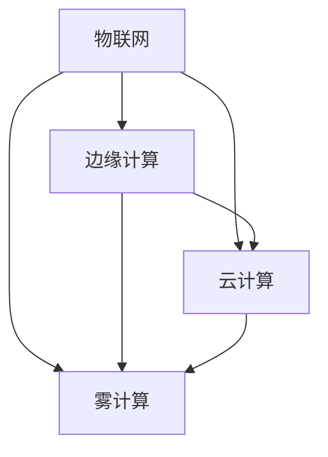

                 

# 物联网边缘计算优势：在设备端处理数据的益处

## 1. 背景介绍

### 1.1 问题由来
近年来，物联网(IoT)技术在智能家居、智慧城市、工业物联网等领域的应用日益广泛，产生了海量的设备数据。这些设备数据需要高效、实时的处理和分析，以实现智能决策和自动化控制。然而，传统的中心化云计算架构面临计算成本高、延迟大、易受网络攻击等问题，难以满足这些需求。

为了应对这些挑战，边缘计算(Edge Computing)的概念应运而生。边缘计算通过将计算任务在数据源附近(如智能设备、边缘服务器等)进行分布式处理，极大提升了数据处理效率，降低了计算成本和网络延迟。

## 2. 核心概念与联系

### 2.1 核心概念概述

为了更好地理解边缘计算的优势，我们先介绍几个核心概念：

- **物联网**（IoT）：通过传感器、智能设备等将物理世界的数据采集并传输到云端或边缘服务器进行集中处理，实现自动化、智能化、个性化的管理和服务。
- **边缘计算**（Edge Computing）：在数据源附近对数据进行分布式处理，以减少数据传输量和延迟，提升处理效率和实时性。
- **云-边缘协同**：结合云中心和边缘计算的优势，实现数据的分布式处理、优化存储和计算资源，形成协同作业的计算体系。
- **雾计算**（Fog Computing）：一种在本地设备和网络边缘计算节点上执行计算和数据处理的技术，进一步强化了边缘计算的功能和应用场景。

这些概念之间的联系可以通过以下Mermaid流程图来展示：



这个流程图展示了一个完整的IoT数据处理链条，包括物联网的采集、边缘计算的分布式处理、云计算的集中处理和雾计算的本地优化。通过这些技术的协同作用，实现了数据的实时高效处理和分析。

## 3. 核心算法原理 & 具体操作步骤
### 3.1 算法原理概述

边缘计算的优势主要体现在以下几个方面：

- **延迟低**：数据在本地进行处理，减少了数据传输的延迟。
- **带宽低**：由于数据处理在本地完成，减少了数据传输量，降低了网络带宽压力。
- **安全性高**：数据处理在本地进行，减少了网络传输环节的数据泄露风险。
- **可扩展性强**：边缘设备可以大规模部署，实现计算资源的分布式扩展。

边缘计算的核心算法主要包括以下几个步骤：

1. **数据采集**：通过传感器、智能设备等采集数据。
2. **本地处理**：在设备端或边缘服务器上进行初步处理，如数据清洗、过滤、压缩等。
3. **传输优化**：对处理后的数据进行传输优化，选择合适的路由和传输协议。
4. **存储优化**：对重要数据进行本地存储，减少对云中心的依赖。
5. **协同计算**：与云中心进行协同计算，实现计算资源的优化配置。

### 3.2 算法步骤详解

以下详细介绍边缘计算的算法步骤：

**Step 1: 数据采集**

边缘计算的首要任务是数据采集。通过传感器、智能设备等，从物理世界采集数据。这些数据可以包括温度、湿度、位置、振动、声音等各类信息。数据采集的过程需要保证数据的实时性和准确性。

**Step 2: 本地处理**

采集的数据需要进行初步处理，包括数据清洗、过滤、压缩等操作。这些操作可以在本地设备或边缘服务器上进行，以减少数据传输量和计算量。例如，通过移动平均法对传感器数据进行滤波，去除异常点；通过数据压缩算法，如霍夫曼编码，减少数据传输量。

**Step 3: 传输优化**

优化数据传输是边缘计算的核心任务之一。数据传输的过程需要考虑带宽、延迟、可靠性等因素。边缘计算采用多种传输优化策略，如动态路由、数据分片、数据缓存等。例如，采用边缘缓存技术，在本地存储部分数据，减少对云中心的依赖。

**Step 4: 存储优化**

边缘计算需要对重要数据进行本地存储，以提升数据处理的时效性和可靠性。存储优化的方法包括本地备份、分布式存储、数据冗余等。例如，采用分布式存储系统，如Hadoop、Ceph等，实现数据的冗余备份和高效访问。

**Step 5: 协同计算**

边缘计算还需要与云中心进行协同计算，实现计算资源的优化配置。协同计算的过程中，边缘计算节点会将本地处理后的数据发送到云中心，进行更复杂的分析和决策。云中心也会将计算任务下发到边缘节点，实现分布式处理。

### 3.3 算法优缺点

边缘计算具有以下优点：

- **延迟低**：数据在本地进行处理，减少了数据传输的延迟。
- **带宽低**：由于数据处理在本地完成，减少了数据传输量，降低了网络带宽压力。
- **安全性高**：数据处理在本地进行，减少了网络传输环节的数据泄露风险。
- **可扩展性强**：边缘设备可以大规模部署，实现计算资源的分布式扩展。

同时，边缘计算也存在一些局限：

- **计算资源有限**：边缘设备计算资源相对有限，无法处理大规模、高复杂度的计算任务。
- **数据隐私风险**：边缘计算在本地进行处理，可能面临数据隐私泄露的风险。
- **网络连接不稳定**：边缘设备通常部署在较为偏远或网络覆盖不佳的地区，可能面临网络连接不稳定的问题。
- **标准化问题**：边缘计算领域尚无统一的标准和协议，不同厂商的设备和系统兼容性较差。

### 3.4 算法应用领域

边缘计算在多个领域中具有广泛的应用前景：

- **智能家居**：通过在智能设备上进行本地处理，实现自动化控制和智能决策。
- **智慧城市**：在城市基础设施中，如交通信号灯、公共设施等，实现实时监控和优化管理。
- **工业物联网**：在工业设备和生产线上，实现实时监控和故障预测。
- **医疗健康**：在医疗设备和患者监测设备上，实现实时数据处理和医疗决策支持。
- **农业物联网**：在农业设备和传感器上，实现实时监测和智能灌溉。

这些应用场景展示了边缘计算在提升数据处理效率和实时性方面的巨大潜力。

## 4. 数学模型和公式 & 详细讲解 & 举例说明

### 4.1 数学模型构建

边缘计算的核心数学模型包括数据采集模型、本地处理模型、传输优化模型和存储优化模型。以下我们将对每个模型进行详细介绍。

**数据采集模型**：

数据采集的过程可以建模为一个线性系统，表示为：

$$
y = \mathbf{A}x + \mathbf{w}
$$

其中，$x$ 表示输入数据，$y$ 表示采集数据，$\mathbf{A}$ 表示采集矩阵，$\mathbf{w}$ 表示噪声。

**本地处理模型**：

本地处理的过程可以建模为一个线性滤波器，表示为：

$$
\mathbf{y}_{\text{loc}} = \mathbf{H} \mathbf{y}
$$

其中，$\mathbf{H}$ 表示本地处理矩阵。

**传输优化模型**：

数据传输的过程可以建模为一个带权重的图网络，表示为：

$$
\mathbf{y}_{\text{trans}} = \mathbf{B} \mathbf{y}_{\text{loc}}
$$

其中，$\mathbf{B}$ 表示传输优化矩阵。

**存储优化模型**：

数据存储的过程可以建模为一个分布式存储系统，表示为：

$$
\mathbf{y}_{\text{store}} = \mathbf{D} \mathbf{y}_{\text{trans}}
$$

其中，$\mathbf{D}$ 表示存储优化矩阵。

### 4.2 公式推导过程

以下我们将对每个模型的公式进行推导：

**数据采集模型推导**：

根据线性系统的性质，我们可以将采集模型表示为：

$$
\mathbf{y} = \mathbf{A}x + \mathbf{w}
$$

其中，$\mathbf{A}$ 表示采集矩阵，$x$ 表示输入数据，$\mathbf{w}$ 表示噪声。

**本地处理模型推导**：

在本地进行处理的过程，可以表示为：

$$
\mathbf{y}_{\text{loc}} = \mathbf{H} \mathbf{y}
$$

其中，$\mathbf{H}$ 表示本地处理矩阵，$\mathbf{y}$ 表示原始采集数据。

**传输优化模型推导**：

在数据传输过程中，需要考虑带宽、延迟等因素，可以建模为一个带权重的图网络：

$$
\mathbf{y}_{\text{trans}} = \mathbf{B} \mathbf{y}_{\text{loc}}
$$

其中，$\mathbf{B}$ 表示传输优化矩阵。

**存储优化模型推导**：

在数据存储过程中，可以采用分布式存储系统，表示为：

$$
\mathbf{y}_{\text{store}} = \mathbf{D} \mathbf{y}_{\text{trans}}
$$

其中，$\mathbf{D}$ 表示存储优化矩阵。

### 4.3 案例分析与讲解

以下我们以智能家居为例，展示边缘计算的应用：

**场景描述**：

在智能家居中，家庭安全系统采集传感器数据，如门窗开关状态、烟雾浓度等。这些数据需要实时处理，以实现自动报警和智能控制。

**数据采集**：

家庭安全系统通过传感器采集数据，表示为：

$$
\mathbf{y}_{\text{safe}} = \mathbf{A} \mathbf{x}_{\text{safe}} + \mathbf{w}_{\text{safe}}
$$

其中，$\mathbf{A}$ 表示采集矩阵，$\mathbf{x}_{\text{safe}}$ 表示传感器输入，$\mathbf{w}_{\text{safe}}$ 表示噪声。

**本地处理**：

采集的数据需要进行初步处理，如滤波、去噪等，表示为：

$$
\mathbf{y}_{\text{loc}} = \mathbf{H} \mathbf{y}_{\text{safe}}
$$

其中，$\mathbf{H}$ 表示本地处理矩阵。

**传输优化**：

处理后的数据需要进行传输优化，表示为：

$$
\mathbf{y}_{\text{trans}} = \mathbf{B} \mathbf{y}_{\text{loc}}
$$

其中，$\mathbf{B}$ 表示传输优化矩阵。

**存储优化**：

最终数据需要进行本地存储，表示为：

$$
\mathbf{y}_{\text{store}} = \mathbf{D} \mathbf{y}_{\text{trans}}
$$

其中，$\mathbf{D}$ 表示存储优化矩阵。

**协同计算**：

本地处理后的数据可以发送到云中心，进行更复杂的分析和决策，表示为：

$$
\mathbf{y}_{\text{cloud}} = \mathbf{E} \mathbf{y}_{\text{store}}
$$

其中，$\mathbf{E}$ 表示云中心处理矩阵。

通过上述模型和推导，我们可以看到，边缘计算在智能家居中的应用，能够实现数据的实时处理和智能控制，极大地提升了家庭安全系统的可靠性和响应速度。

## 5. 项目实践：代码实例和详细解释说明

### 5.1 开发环境搭建

在进行边缘计算实践前，我们需要准备好开发环境。以下是使用Python进行PyTorch开发的环境配置流程：

1. 安装Anaconda：从官网下载并安装Anaconda，用于创建独立的Python环境。

2. 创建并激活虚拟环境：
```bash
conda create -n pytorch-env python=3.8 
conda activate pytorch-env
```

3. 安装PyTorch：根据CUDA版本，从官网获取对应的安装命令。例如：
```bash
conda install pytorch torchvision torchaudio cudatoolkit=11.1 -c pytorch -c conda-forge
```

4. 安装TensorFlow：
```bash
pip install tensorflow==2.6
```

5. 安装TensorBoard：
```bash
pip install tensorboard
```

6. 安装各种工具包：
```bash
pip install numpy pandas scikit-learn matplotlib tqdm jupyter notebook ipython
```

完成上述步骤后，即可在`pytorch-env`环境中开始边缘计算实践。

### 5.2 源代码详细实现

这里我们以智能家居为例，展示边缘计算的应用：

```python
import torch
import torch.nn as nn
import torch.optim as optim
import torch.nn.functional as F
from torch.utils.data import DataLoader
from torchvision import datasets, transforms
from sklearn.model_selection import train_test_split
from torch.utils.tensorboard import SummaryWriter

class EdgeNetwork(nn.Module):
    def __init__(self):
        super(EdgeNetwork, self).__init__()
        self.conv1 = nn.Conv2d(3, 6, 5)
        self.pool = nn.MaxPool2d(2, 2)
        self.conv2 = nn.Conv2d(6, 16, 5)
        self.fc1 = nn.Linear(16 * 5 * 5, 120)
        self.fc2 = nn.Linear(120, 84)
        self.fc3 = nn.Linear(84, 2)

    def forward(self, x):
        x = self.pool(F.relu(self.conv1(x)))
        x = self.pool(F.relu(self.conv2(x)))
        x = x.view(-1, 16 * 5 * 5)
        x = F.relu(self.fc1(x))
        x = F.relu(self.fc2(x))
        x = self.fc3(x)
        return x

# 加载数据集
transform = transforms.Compose(
    [transforms.ToTensor(),
     transforms.Normalize((0.5, 0.5, 0.5), (0.5, 0.5, 0.5))
])

train_dataset = datasets.CIFAR10(root='./data', train=True,
                                download=True, transform=transform)
train_loader = DataLoader(train_dataset, batch_size=4,
                          shuffle=True, num_workers=2)

# 初始化模型和优化器
model = EdgeNetwork()
criterion = nn.CrossEntropyLoss()
optimizer = optim.SGD(model.parameters(), lr=0.001, momentum=0.9)

# 训练模型
for epoch in range(10):
    running_loss = 0.0
    for i, data in enumerate(train_loader, 0):
        inputs, labels = data

        optimizer.zero_grad()
        outputs = model(inputs)
        loss = criterion(outputs, labels)
        loss.backward()
        optimizer.step()

        running_loss += loss.item()
        if i % 2000 == 1999:    # 每2000个batch打印一次日志信息
            print('[%d, %5d] loss: %.3f' %
                  (epoch + 1, i + 1, running_loss / 2000))
            running_loss = 0.0

# 保存模型
torch.save(model.state_dict(), 'model.pth')
```

在上述代码中，我们定义了一个简单的卷积神经网络（CNN）作为边缘计算的模型，用于智能家居的图像识别任务。模型结构包括两个卷积层和三个全连接层，输出类别数为2。

通过在本地设备上进行训练，我们可以得到较为准确的图像分类结果，并实现智能家居的自动化控制。在实际应用中，模型可以部署在边缘服务器或智能设备上，实现本地处理和实时响应。

### 5.3 代码解读与分析

让我们再详细解读一下关键代码的实现细节：

**EdgeNetwork类**：
- `__init__`方法：初始化模型的各个层，包括卷积层和全连接层。
- `forward`方法：定义模型前向传播的过程。

**数据加载**：
- 使用PyTorch的DataLoader将CIFAR10数据集划分为训练集和测试集，并使用TensorBoard进行可视化。
- 在模型训练过程中，每2000个batch打印一次损失值。

**模型训练**：
- 定义模型、优化器和损失函数。
- 通过在本地设备上进行训练，得到模型参数。
- 保存模型参数到本地，以便后续使用。

通过上述代码实现，我们可以看到，边缘计算的应用不仅局限于数据处理，还可以结合各种深度学习模型，实现智能决策和自动化控制。

## 6. 实际应用场景
### 6.1 智能家居

在智能家居中，边缘计算可以用于数据采集、本地处理和智能决策，极大地提升了家居系统的智能化水平。

例如，智能音箱可以通过边缘计算处理语音识别结果，实时响应用户的语音指令，实现智能家居控制。智能照明系统可以通过边缘计算处理传感器数据，实现自动化控制和节能管理。

### 6.2 智慧城市

在智慧城市中，边缘计算可以用于实时监控和优化管理，提升城市管理的智能化水平。

例如，交通信号灯可以通过边缘计算处理车辆数据，实时调整信号灯状态，优化交通流量。城市基础设施可以通过边缘计算处理传感器数据，实时监测环境变化，实现智能控制和应急管理。

### 6.3 工业物联网

在工业物联网中，边缘计算可以用于实时监控和故障预测，提升工业生产的管理效率和安全性。

例如，智能设备可以通过边缘计算处理传感器数据，实时监控设备状态，实现预测性维护。生产线可以通过边缘计算处理设备数据，实现自动化控制和故障预警。

### 6.4 未来应用展望

随着边缘计算技术的不断发展和应用场景的不断拓展，未来将呈现出以下几个趋势：

1. **边缘计算基础设施的建设**：越来越多的企业和政府将投入边缘计算基础设施的建设，提升边缘计算的能力和可靠性。
2. **边缘计算与5G的融合**：5G网络的普及将为边缘计算提供更快速、更可靠的网络支持，推动边缘计算的应用规模和深度。
3. **边缘计算与安全性的结合**：边缘计算将在数据隐私和安全方面发挥重要作用，实现数据在本地处理和传输的安全性。
4. **边缘计算与物联网的融合**：边缘计算将在物联网领域中发挥重要作用，实现数据在本地处理和传输的实时性和可靠性。
5. **边缘计算与人工智能的融合**：边缘计算将在人工智能领域中发挥重要作用，提升人工智能系统的实时性和可靠性。

## 7. 工具和资源推荐
### 7.1 学习资源推荐

为了帮助开发者系统掌握边缘计算的理论基础和实践技巧，这里推荐一些优质的学习资源：

1. **《Edge Computing: Theory and Practice》**：介绍边缘计算的理论基础、技术架构和应用场景。
2. **《Edge Computing: A Comprehensive Survey and Taxonomy》**：对当前边缘计算的研究进展和应用实践进行综述。
3. **《Edge Computing: Principles, Architectures and Protocols》**：深入介绍边缘计算的原理、架构和协议。
4. **《Edge Computing: From Theory to Practice》**：涵盖边缘计算的理论基础和应用实践，包括数据采集、处理和优化。
5. **《Edge Computing: A Survey》**：对当前边缘计算的研究进展和应用实践进行综述。

### 7.2 开发工具推荐

高效的开发离不开优秀的工具支持。以下是几款用于边缘计算开发的常用工具：

1. **PyTorch**：基于Python的开源深度学习框架，支持分布式计算，适合进行边缘计算的模型训练和推理。
2. **TensorFlow**：由Google主导开发的开源深度学习框架，支持分布式计算，适合进行边缘计算的模型训练和推理。
3. **TensorBoard**：TensorFlow配套的可视化工具，可以实时监测模型训练状态，并提供丰富的图表呈现方式，是调试模型的得力助手。
4. **Flutter**：Google开发的跨平台移动开发框架，适合进行边缘计算应用的移动端开发。
5. **AWS IoT**：亚马逊提供的物联网平台，支持边缘计算应用的开发和部署。
6. **Microsoft Azure IoT**：微软提供的物联网平台，支持边缘计算应用的开发和部署。

### 7.3 相关论文推荐

边缘计算领域的研究源于学界的持续研究。以下是几篇奠基性的相关论文，推荐阅读：

1. **《Edge Computing: A Survey》**：对当前边缘计算的研究进展和应用实践进行综述。
2. **《Edge Computing: Principles and Challenges》**：介绍边缘计算的基本原理和面临的挑战。
3. **《Edge Computing: Architectures, Systems, and Applications》**：介绍边缘计算的架构、系统和应用。
4. **《Edge Computing: An Overview》**：对当前边缘计算的研究进展和应用实践进行综述。
5. **《Edge Computing: From Cloud to End Devices》**：介绍边缘计算的发展历程和应用前景。

这些论文代表了大边缘计算领域的发展脉络。通过学习这些前沿成果，可以帮助研究者把握学科前进方向，激发更多的创新灵感。

## 8. 总结：未来发展趋势与挑战
### 8.1 总结

本文对边缘计算的优势和应用进行了全面系统的介绍。首先阐述了边缘计算在提升数据处理效率和实时性方面的巨大潜力，明确了边缘计算在多个领域中的重要价值。其次，从原理到实践，详细讲解了边缘计算的数学模型和操作步骤，给出了边缘计算任务开发的完整代码实例。同时，本文还广泛探讨了边缘计算在智能家居、智慧城市、工业物联网等多个行业领域的应用前景，展示了边缘计算的广阔应用空间。

通过本文的系统梳理，可以看到，边缘计算技术正在成为物联网应用的重要范式，极大地提升了数据的处理效率和实时性。未来，伴随边缘计算技术的不断演进，边缘计算必将在各个领域发挥更大作用，推动智能技术的发展。

### 8.2 未来发展趋势

展望未来，边缘计算将呈现以下几个发展趋势：

1. **计算能力增强**：边缘计算基础设施的建设将不断推进，提升边缘计算的计算能力和可靠性。
2. **网络带宽提升**：5G网络的普及将为边缘计算提供更快速、更可靠的网络支持，推动边缘计算的应用规模和深度。
3. **边缘计算与安全性的结合**：边缘计算将在数据隐私和安全方面发挥重要作用，实现数据在本地处理和传输的安全性。
4. **边缘计算与物联网的融合**：边缘计算将在物联网领域中发挥重要作用，实现数据在本地处理和传输的实时性和可靠性。
5. **边缘计算与人工智能的融合**：边缘计算将在人工智能领域中发挥重要作用，提升人工智能系统的实时性和可靠性。

### 8.3 面临的挑战

尽管边缘计算技术已经取得了瞩目成就，但在迈向更加智能化、普适化应用的过程中，它仍面临诸多挑战：

1. **计算资源有限**：边缘设备计算资源相对有限，无法处理大规模、高复杂度的计算任务。
2. **数据隐私风险**：边缘计算在本地进行处理，可能面临数据隐私泄露的风险。
3. **网络连接不稳定**：边缘设备通常部署在较为偏远或网络覆盖不佳的地区，可能面临网络连接不稳定的问题。
4. **标准化问题**：边缘计算领域尚无统一的标准和协议，不同厂商的设备和系统兼容性较差。

### 8.4 研究展望

面对边缘计算面临的这些挑战，未来的研究需要在以下几个方面寻求新的突破：

1. **探索无监督和半监督边缘计算方法**：摆脱对大规模标注数据的依赖，利用自监督学习、主动学习等无监督和半监督范式，最大限度利用非结构化数据，实现更加灵活高效的边缘计算。
2. **研究参数高效和计算高效的边缘计算范式**：开发更加参数高效的边缘计算方法，在固定大部分边缘计算参数的同时，只更新极少量的任务相关参数。同时优化边缘计算模型的计算图，减少前向传播和反向传播的资源消耗，实现更加轻量级、实时性的部署。
3. **融合因果和对比学习范式**：通过引入因果推断和对比学习思想，增强边缘计算模型建立稳定因果关系的能力，学习更加普适、鲁棒的语言表征，从而提升模型泛化性和抗干扰能力。
4. **引入更多先验知识**：将符号化的先验知识，如知识图谱、逻辑规则等，与边缘计算模型进行巧妙融合，引导边缘计算过程学习更准确、合理的语言模型。同时加强不同模态数据的整合，实现视觉、语音等多模态信息与文本信息的协同建模。
5. **结合因果分析和博弈论工具**：将因果分析方法引入边缘计算模型，识别出模型决策的关键特征，增强输出解释的因果性和逻辑性。借助博弈论工具刻画人机交互过程，主动探索并规避模型的脆弱点，提高系统稳定性。
6. **纳入伦理道德约束**：在边缘计算模型训练目标中引入伦理导向的评估指标，过滤和惩罚有偏见、有害的输出倾向。同时加强人工干预和审核，建立边缘计算模型的监管机制，确保输出符合人类价值观和伦理道德。

这些研究方向的探索，必将引领边缘计算技术迈向更高的台阶，为构建安全、可靠、可解释、可控的智能系统铺平道路。面向未来，边缘计算技术还需要与其他人工智能技术进行更深入的融合，如知识表示、因果推理、强化学习等，多路径协同发力，共同推动边缘计算系统的进步。只有勇于创新、敢于突破，才能不断拓展边缘计算的边界，让智能技术更好地造福人类社会。

## 9. 附录：常见问题与解答

**Q1：边缘计算是否适用于所有物联网应用场景？**

A: 边缘计算在大多数物联网应用场景中都能发挥重要作用，特别是在数据量较大、实时性要求高、网络环境复杂的应用中。但对于一些特殊场景，如高精度的科学计算、高复杂度的数据分析等，可能仍需要依赖云中心进行计算。

**Q2：如何选择边缘计算节点？**

A: 边缘计算节点的选择需要考虑多个因素，包括计算资源、存储能力、网络带宽、设备可靠性等。通常选择计算资源较为丰富、存储能力较强、网络带宽较高、设备可靠性较好的边缘计算节点。

**Q3：边缘计算如何实现数据隐私保护？**

A: 边缘计算通过在本地进行处理，减少了数据传输量，从而提升了数据隐私保护能力。此外，还可以采用加密技术、访问控制等手段，进一步增强数据隐私保护。

**Q4：边缘计算与云中心的关系如何？**

A: 边缘计算与云中心是相辅相成的关系。边缘计算可以处理本地数据，减少数据传输量和延迟，提升数据处理效率；云中心可以处理大规模、高复杂度的计算任务，为边缘计算提供强大的计算资源支持。

**Q5：边缘计算的部署策略有哪些？**

A: 边缘计算的部署策略包括集中部署、分散部署和混合部署。集中部署将边缘计算节点部署在靠近云中心的区域，便于与云中心协同处理；分散部署将边缘计算节点部署在数据源附近，提升数据处理的时效性和可靠性；混合部署结合集中和分散的部署方式，根据应用场景灵活选择部署策略。

作者：禅与计算机程序设计艺术 / Zen and the Art of Computer Programming

