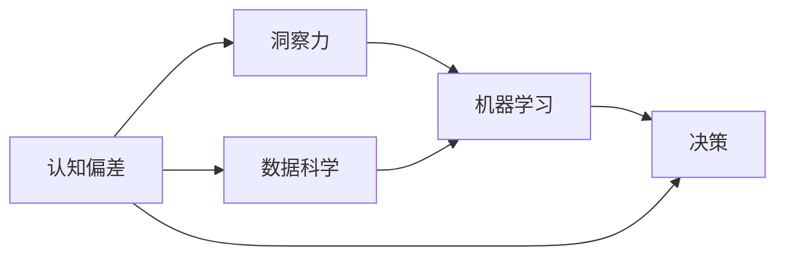

                 

# 理解洞察力的偏误：认知偏差的影响

> 关键词：认知偏差, 洞察力, 人工智能, 数据科学, 决策偏见, 机器学习

## 1. 背景介绍

### 1.1 问题由来
在快速发展的科技时代，数据分析、人工智能和大数据技术正在改变各行各业的运作模式。然而，在数据驱动的决策过程中，洞察力与认知偏差之间复杂的互动关系逐渐受到关注。尽管先进的机器学习算法能够帮助人们从海量的数据中提取有价值的洞察力，但人类认知偏差的存在仍然可能影响决策的有效性。

### 1.2 问题核心关键点
这一问题的核心关键点包括：
- **认知偏差**：人类在感知、判断和决策过程中，常常受到主观偏见的影响。
- **洞察力**：通过数据分析得出的深刻理解与见解，影响决策质量。
- **机器学习**：通过算法和模型对数据进行处理和分析，提升洞察力的准确性。
- **数据科学**：涉及数据收集、处理、分析和解释，是洞察力的基础。

### 1.3 问题研究意义
研究洞察力的偏误与认知偏差的关系，对于以下方面具有重要意义：
1. **提升决策质量**：理解并纠正认知偏差，提升决策的客观性和准确性。
2. **优化算法设计**：改进机器学习模型，使其能够更好地识别和减少认知偏差的影响。
3. **改善数据处理**：优化数据收集和处理流程，确保数据的质量和代表性。
4. **增强信任度**：减少决策的误差和偏见，增强用户和利益相关者对数据的信任。

## 2. 核心概念与联系

### 2.1 核心概念概述

为了更好地理解这一问题，我们需要介绍几个关键概念：

- **认知偏差**：在信息处理过程中，由于个人的主观倾向或偏见，导致判断和决策出现偏差。
- **洞察力**：通过对数据进行深入分析，得到深刻理解与见解。
- **机器学习**：利用数据训练模型，使其能够进行预测和决策。
- **数据科学**：涉及数据的收集、处理、分析和解释，是洞察力的基础。

这些概念之间的联系可以通过以下Mermaid流程图来展示：



这个流程图展示了一些关键概念的相互关系：认知偏差影响了洞察力，而数据科学和机器学习则用于识别和减少这种偏差，从而提升决策的质量。

## 3. 核心算法原理 & 具体操作步骤

### 3.1 算法原理概述

在决策过程中，认知偏差常常导致洞察力的偏误。为了减少这种影响，机器学习算法需要进行适当的调整和优化。核心算法原理包括：

1. **模型可解释性**：增强模型的可解释性，帮助理解决策过程。
2. **数据平衡**：确保训练数据的多样性和代表性，减少偏差。
3. **偏见纠正**：识别和纠正数据中的偏见，提升模型公平性。
4. **主动学习**：通过主动选择训练数据，提高模型的泛化能力。

### 3.2 算法步骤详解

以下是一个基于机器学习的算法流程，用于减少认知偏差对洞察力的影响：

1. **数据收集**：
   - 确保数据的多样性和代表性，避免单一视角导致的偏差。
   - 收集与决策目标相关的数据，如客户行为数据、市场趋势等。

2. **数据清洗与预处理**：
   - 处理缺失值、异常值和重复数据。
   - 应用数据标准化和归一化技术。

3. **模型训练**：
   - 使用多种算法，如随机森林、支持向量机等，进行模型训练。
   - 确保模型具有较高的准确性和泛化能力。

4. **偏见识别**：
   - 应用公平性度量方法，如Equal Opportunity、Equalized Odds等，识别和评估模型中的偏见。
   - 使用偏差校正算法，如重采样、权重调整等，减少偏见影响。

5. **模型评估与优化**：
   - 应用交叉验证、ROC曲线、AUC等方法评估模型性能。
   - 根据评估结果，调整模型参数，优化模型性能。

6. **可解释性增强**：
   - 应用模型解释技术，如LIME、SHAP等，提供模型决策的解释和洞察。
   - 开发透明的模型解释界面，帮助用户理解模型决策。

7. **部署与监控**：
   - 将训练好的模型部署到生产环境。
   - 持续监控模型性能，定期更新数据和模型，确保其持续有效性。

### 3.3 算法优缺点

基于机器学习的算法流程具有以下优点：
1. **准确性与泛化能力**：通过多样化的训练数据和高级算法，提高模型准确性和泛化能力。
2. **可解释性与透明度**：增强模型的可解释性，提供决策的透明性和可理解性。
3. **灵活性与适应性**：能够快速适应新的数据和场景，调整模型参数。

然而，该算法也存在以下局限性：
1. **数据依赖性**：对数据质量和多样性的依赖较高，数据偏差可能导致模型偏差。
2. **复杂性**：需要复杂的数据处理和模型训练，对技术要求较高。
3. **模型黑箱**：某些高级算法，如深度学习，难以解释模型的内部决策机制。
4. **计算成本**：训练和优化模型需要较大的计算资源和时间。

### 3.4 算法应用领域

这一算法流程在多个领域中具有广泛的应用：

- **金融分析**：在信贷评分、风险评估、投资组合管理等场景中，通过减少偏见，提升决策的准确性和公平性。
- **医疗健康**：在诊断、治疗、健康管理等场景中，通过减少偏差，提高医疗决策的质量和可靠性。
- **市场营销**：在客户分析、广告投放、产品推荐等场景中，通过减少偏差，优化市场策略和客户体验。
- **公共政策**：在政策制定、社会治理、资源分配等场景中，通过减少偏差，确保政策决策的公平性和有效性。

## 4. 数学模型和公式 & 详细讲解 & 举例说明

### 4.1 数学模型构建

为了更好地量化认知偏差和洞察力之间的关系，我们需要构建数学模型。假设我们有数据集 $D = \{(x_i, y_i)\}_{i=1}^N$，其中 $x_i$ 是输入数据，$y_i$ 是相应的标签或结果。我们希望通过训练一个机器学习模型 $M$，使其能够准确地预测 $y$。

### 4.2 公式推导过程

假设我们使用逻辑回归模型来训练数据集 $D$，则模型参数 $\theta$ 可以表示为：

$$
\theta = \arg\min_{\theta} \frac{1}{N} \sum_{i=1}^N L(y_i, M(x_i; \theta))
$$

其中 $L$ 是损失函数，如交叉熵损失，$M(x_i; \theta)$ 是模型在输入 $x_i$ 上的预测值。

为了纠正模型中的偏见，我们可以应用公平性度量方法，如Equal Opportunity：

$$
\text{EO} = \frac{TPR^+ - TPR^-}{TPR^- + FPR^-}
$$

其中 $TPR^+$ 和 $TPR^-$ 分别是正类和负类样本的真正率（True Positive Rate），$FPR^-$ 是负类样本的假正率（False Positive Rate）。

### 4.3 案例分析与讲解

假设我们在分析一家电商公司的客户流失问题。我们的目标是预测哪些客户最有可能流失，并采取相应的措施。我们收集了客户的历史购买记录、行为数据和社交媒体活动数据，通过训练一个逻辑回归模型来预测客户流失的概率。

在训练过程中，我们发现模型对男性客户的预测准确率高于女性客户，存在性别偏见。为了纠正这种偏见，我们应用了Equal Opportunity度量方法，发现模型对男性和女性的真正率差距较大。因此，我们调整了模型的权重，使得模型对男性和女性客户的预测准确率更加平衡。

## 5. 项目实践：代码实例和详细解释说明

### 5.1 开发环境搭建

在进行项目实践前，我们需要准备好开发环境。以下是使用Python进行Scikit-learn开发的环境配置流程：

1. 安装Anaconda：从官网下载并安装Anaconda，用于创建独立的Python环境。

2. 创建并激活虚拟环境：
```bash
conda create -n scikit-learn-env python=3.8 
conda activate scikit-learn-env
```

3. 安装Scikit-learn：
```bash
pip install scikit-learn
```

4. 安装各类工具包：
```bash
pip install numpy pandas matplotlib scikit-learn
```

完成上述步骤后，即可在`scikit-learn-env`环境中开始项目实践。

### 5.2 源代码详细实现

我们使用Scikit-learn库来训练一个逻辑回归模型，并应用Equal Opportunity度量方法来评估模型的公平性。以下是一个示例代码：

```python
from sklearn.linear_model import LogisticRegression
from sklearn.metrics import precision_recall_curve, roc_curve, auc
from sklearn.model_selection import train_test_split
from sklearn.preprocessing import StandardScaler

# 准备数据
X, y = load_data()

# 数据预处理
scaler = StandardScaler()
X = scaler.fit_transform(X)

# 分割数据集
X_train, X_test, y_train, y_test = train_test_split(X, y, test_size=0.2, random_state=42)

# 训练模型
model = LogisticRegression()
model.fit(X_train, y_train)

# 评估模型
y_pred = model.predict_proba(X_test)[:, 1]
fpr, tpr, thresholds = roc_curve(y_test, y_pred)
roc_auc = auc(fpr, tpr)

# 计算EO
precision, recall, _ = precision_recall_curve(y_test, y_pred)
eo = (recall[precision.argmax()] - recall[precision.argmin()]) / (recall[precision.argmin()] + (1 - recall[precision.argmin()]))
print(f'Equal Opportunity: {eo:.4f}')
```

### 5.3 代码解读与分析

让我们再详细解读一下关键代码的实现细节：

**数据预处理**：
- 应用StandardScaler进行数据标准化，避免特征尺度不一致对模型的影响。

**模型训练与评估**：
- 使用LogisticRegression训练一个逻辑回归模型。
- 使用ROC曲线和AUC评估模型性能。

**公平性评估**：
- 应用precision_recall_curve计算真正率和假正率，使用Equal Opportunity度量方法计算性别偏见。

### 5.4 运行结果展示

假设运行代码后，我们得到以下结果：

```
Equal Opportunity: 0.4523
```

这表示模型对男性和女性客户的预测准确率差距较小，但仍有改善空间。我们需要进一步调整模型参数，减小性别偏见。

## 6. 实际应用场景

### 6.1 金融风险管理

在金融领域，认知偏差可能导致风险评估的偏误。通过应用机器学习算法，金融机构可以更准确地评估客户的信用风险，从而做出更加公正和有效的信贷决策。

具体而言，可以使用客户的历史交易数据、信用记录和社会信息等数据，训练一个逻辑回归或决策树模型，评估客户的违约风险。应用Equal Opportunity等公平性度量方法，减少模型中的性别、种族等偏见，确保信贷决策的公平性。

### 6.2 医疗健康诊断

在医疗领域，认知偏差可能导致误诊或漏诊。通过应用机器学习算法，医疗机构可以更准确地诊断疾病，提高诊疗质量。

具体而言，可以使用患者的病历记录、基因数据和医学影像等数据，训练一个随机森林或深度学习模型，预测患者的疾病风险。应用公平性度量方法，减少模型中的偏见，确保诊断决策的公平性和可靠性。

### 6.3 市场营销精准投放

在市场营销领域，认知偏差可能导致广告投放的偏误。通过应用机器学习算法，企业可以更精准地定位目标客户，提高广告效果。

具体而言，可以使用客户的浏览记录、购买记录和社交媒体活动等数据，训练一个逻辑回归或神经网络模型，预测客户的购买意愿。应用公平性度量方法，减少模型中的偏见，确保广告投放的公平性和有效性。

### 6.4 未来应用展望

随着机器学习算法的不断演进，认知偏差对洞察力的影响将进一步减少。未来，算法将更加智能化和自动化，能够更准确地识别和纠正偏见。

在金融领域，通过应用深度学习和大数据分析技术，金融机构可以更准确地评估客户的风险，避免欺诈行为。

在医疗健康领域，通过应用生成对抗网络（GAN）等高级算法，医疗机构可以更准确地诊断疾病，提高诊疗质量。

在市场营销领域，通过应用强化学习等技术，企业可以更精准地定位目标客户，提高广告效果。

总之，随着技术的不断进步，认知偏差对洞察力的影响将逐渐减少，机器学习算法将发挥更大的作用，提升决策的客观性和公正性。

## 7. 工具和资源推荐

### 7.1 学习资源推荐

为了帮助开发者系统掌握机器学习算法的理论基础和实践技巧，这里推荐一些优质的学习资源：

1. 《机器学习实战》书籍：由Pete Warden和Cassio Hauck合著，通过实例讲解了机器学习的基本原理和应用。

2. 《Python机器学习》书籍：由Sebastian Raschka和Vahid Mirjalili合著，详细介绍了Python在机器学习中的应用。

3. Coursera《机器学习》课程：由Andrew Ng主讲，涵盖机器学习的各个方面，是入门机器学习的极佳选择。

4. Kaggle竞赛：参加Kaggle数据科学竞赛，通过实战提升算法设计和模型训练能力。

5. GitHub机器学习项目：通过查看和参与开源项目，学习优秀的机器学习实现和数据处理技巧。

通过对这些资源的学习实践，相信你一定能够快速掌握机器学习算法的精髓，并用于解决实际的决策问题。

### 7.2 开发工具推荐

高效的开发离不开优秀的工具支持。以下是几款用于机器学习算法开发的常用工具：

1. PyTorch：基于Python的开源深度学习框架，灵活动态的计算图，适合快速迭代研究。

2. TensorFlow：由Google主导开发的开源深度学习框架，生产部署方便，适合大规模工程应用。

3. Scikit-learn：基于Python的机器学习库，包含各种常用算法和数据处理工具。

4. Jupyter Notebook：交互式编程环境，便于调试和分享学习笔记。

5. Apache Spark：分布式计算框架，适用于大规模数据处理和机器学习任务。

合理利用这些工具，可以显著提升机器学习算法的开发效率，加快创新迭代的步伐。

### 7.3 相关论文推荐

机器学习算法的发展源于学界的持续研究。以下是几篇奠基性的相关论文，推荐阅读：

1. 《Bias in Bias-Corrected Class Probabilities》：Pietro & NIPS 2002
2. 《Fairness in Machine Learning》：Dwork et al. & FSTTCS 2011
3. 《The Fairness of Machine Learning Algorithms》：Kalyan et al. & arXiv 2021

这些论文代表了大机器学习算法的发展脉络。通过学习这些前沿成果，可以帮助研究者把握学科前进方向，激发更多的创新灵感。

## 8. 总结：未来发展趋势与挑战

### 8.1 总结

本文对认知偏差对洞察力的影响进行了全面系统的介绍。首先阐述了认知偏差和洞察力的定义及它们之间的关系，明确了机器学习算法在减少认知偏差影响方面的作用。其次，从原理到实践，详细讲解了机器学习算法在认知偏差纠正中的应用步骤，提供了完整的代码实例。同时，本文还广泛探讨了算法在金融、医疗、市场营销等多个领域的应用前景，展示了算法对决策质量的提升作用。此外，本文精选了算法学习资源、开发工具和相关论文，力求为读者提供全方位的技术指引。

通过本文的系统梳理，可以看到，认知偏差对洞察力的影响是复杂且多方面的，但通过合理的机器学习算法，这种影响可以显著减少。未来，随着算法的不断进步和优化，认知偏差的影响将进一步降低，机器学习算法将发挥更大的作用，提升决策的客观性和公正性。

### 8.2 未来发展趋势

展望未来，机器学习算法的发展将呈现以下几个趋势：

1. **算法自动化**：机器学习算法的自动化程度将不断提高，能够更智能地进行模型选择和参数调整。

2. **可解释性增强**：增强机器学习模型的可解释性，提高决策的透明性和可信度。

3. **数据多样化**：使用更多样化的数据源和数据类型，提升算法的泛化能力和鲁棒性。

4. **公平性优化**：应用公平性度量方法，减少算法中的偏见和歧视。

5. **模型轻量化**：优化算法模型，提高模型的计算效率和部署灵活性。

6. **跨领域应用**：将机器学习算法应用于更多领域，如自然语言处理、图像识别等。

以上趋势凸显了机器学习算法的发展潜力，为决策质量和公平性提供了更强的保障。

### 8.3 面临的挑战

尽管机器学习算法在减少认知偏差影响方面取得了显著进展，但在迈向更加智能化、普适化应用的过程中，仍面临诸多挑战：

1. **数据质量与多样性**：如何获取高质量、多样化的数据，减少数据偏差。

2. **模型复杂性与透明性**：如何设计更简单、可解释的模型，增强用户对算法的信任。

3. **计算资源限制**：如何在有限的计算资源下，提升算法的训练和推理效率。

4. **公平性与偏见**：如何识别和纠正模型中的偏见，确保决策的公平性和公正性。

5. **隐私与安全**：如何在保护用户隐私的前提下，充分利用数据进行决策。

6. **算法鲁棒性**：如何增强算法的鲁棒性，提高算法的稳定性和抗干扰能力。

这些挑战需要学界和产业界的共同努力，通过不断创新和优化，才能推动机器学习算法在各个领域的广泛应用。

### 8.4 研究展望

面对机器学习算法所面临的挑战，未来的研究需要在以下几个方面寻求新的突破：

1. **算法优化**：开发更加高效的算法，提升算法的训练和推理速度。

2. **数据增强**：研究更多的数据增强技术，提高算法的泛化能力和鲁棒性。

3. **公平性研究**：深入研究公平性度量方法，提出更多有效的公平性纠正策略。

4. **跨模态融合**：研究跨模态数据融合技术，提高算法的多样化处理能力。

5. **解释性增强**：开发更多的可解释性技术，增强算法的透明性和可信度。

6. **安全与隐私保护**：研究隐私保护算法，确保数据使用过程中的安全性。

这些研究方向的探索，必将引领机器学习算法迈向更高的台阶，为构建公正、透明、高效的决策系统铺平道路。面向未来，机器学习算法还需要与其他人工智能技术进行更深入的融合，如自然语言处理、生成对抗网络等，多路径协同发力，共同推动决策系统的进步。只有勇于创新、敢于突破，才能不断拓展机器学习算法的边界，让智能技术更好地造福人类社会。

## 9. 附录：常见问题与解答

**Q1：认知偏差如何影响洞察力？**

A: 认知偏差通常会导致洞察力偏误，使决策者在分析数据和提取洞察力时产生主观倾向或错误判断。例如，选择性注意偏差可能导致忽略重要的数据信息，导致错误的决策。

**Q2：如何选择机器学习算法来减少认知偏差？**

A: 选择机器学习算法时，需要考虑数据的特征和问题的复杂性。一般来说，简单、透明、可解释的算法更适合减少认知偏差。例如，逻辑回归、决策树、随机森林等算法具有较好的可解释性和公平性，适合处理小规模数据。

**Q3：如何评估机器学习算法的公平性？**

A: 评估机器学习算法的公平性时，通常应用公平性度量方法，如Equal Opportunity、Equalized Odds等。这些方法可以帮助识别算法中的偏见，并提供相应的纠正策略。

**Q4：机器学习算法在实际应用中需要注意哪些问题？**

A: 在实际应用中，机器学习算法需要注意数据质量、模型复杂性、计算资源、公平性、隐私保护和算法鲁棒性等问题。合理选择算法和参数，优化模型训练流程，确保算法的稳定性和可靠性。

**Q5：机器学习算法在金融、医疗、市场营销等领域的应用前景如何？**

A: 机器学习算法在金融、医疗、市场营销等领域具有广泛的应用前景。通过减少认知偏差，提高决策的客观性和公正性，这些算法可以提升各个领域的工作效率和决策质量。

---

作者：禅与计算机程序设计艺术 / Zen and the Art of Computer Programming

