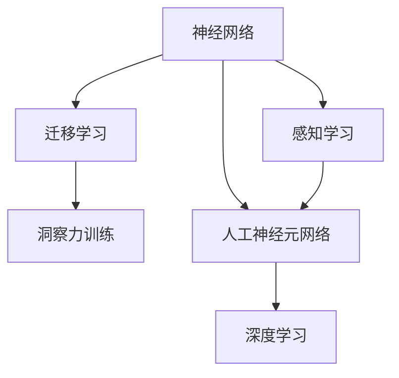

                 

# 理解洞察力的训练：提升信息处理能力

> 关键词：洞察力训练, 信息处理能力, 深度学习, 神经网络, 数据驱动, 感知学习, 迁移学习, 人工神经元网络, 认知心理学

## 1. 背景介绍

### 1.1 问题由来

在当今信息化社会，信息的处理和分析能力变得越来越重要。无论是商业决策、科学研究，还是日常生活，理解和利用信息的能力对人类的生存和发展至关重要。然而，面对海量且复杂的信息，如何从中提取有用知识，并作出合理决策，成为摆在每个从业者面前的挑战。

深度学习技术的迅猛发展，尤其是神经网络的广泛应用，为信息处理带来了新的突破。通过深度学习模型，能够自动地从大量数据中学习规律，并做出复杂判断。但传统的深度学习模型，如卷积神经网络(CNN)、循环神经网络(RNN)等，仍然存在一些局限性。它们更多的是在感知学习和迁移学习的基础上，而对信息处理的洞察力，即对信息进行深入理解和抽象的能力，还不足够强。

### 1.2 问题核心关键点

洞察力的训练，本质上是对信息处理能力的提升。目前，这一问题成为了深度学习领域的研究热点之一。如何通过神经网络模型，让机器具备更强的信息处理能力，成为当前研究的关键。

核心关键点包括：

- 神经网络模型中感知学习的局限性，即只能处理较低级别的特征。
- 迁移学习的局限性，即仅能在相似任务间进行知识迁移。
- 深度学习的洞察力训练，即如何通过模型设计和训练，提高对信息的深度理解和抽象能力。

## 2. 核心概念与联系

### 2.1 核心概念概述

为更好地理解洞察力的训练方法，本节将介绍几个密切相关的核心概念：

- 神经网络(Neural Networks)：一种由大量人工神经元网络构成，用于处理和学习复杂数据的模型。
- 感知学习(Perceptual Learning)：指神经网络通过输入数据学习感知特征的过程。
- 迁移学习(Transfer Learning)：指通过在相似任务上学习到的知识，在新任务上进行迁移，提高模型的泛化能力。
- 洞察力(Insight)：指对信息进行深度理解、分析和抽象的能力。
- 人工神经元网络(Artificial Neurons)：神经网络的基本单元，用于模拟人类大脑中的神经元。

这些核心概念之间的逻辑关系可以通过以下Mermaid流程图来展示：



这个流程图展示了一系列概念之间的联系：

1. 神经网络通过感知学习获取数据特征。
2. 迁移学习利用已有知识在新任务上进行迁移。
3. 洞察力训练通过深度学习，使神经网络具备对信息的深度理解和抽象能力。
4. 人工神经元网络是神经网络的基本组成单元。
5. 深度学习利用人工神经元网络实现信息处理。

这些概念共同构成了深度学习中信息处理的完整框架，使模型能够从数据中提取更深层级的规律和模式。

## 3. 核心算法原理 & 具体操作步骤

### 3.1 算法原理概述

洞察力的训练，旨在提升神经网络模型对信息的深度理解能力，使其能够识别出数据中更高级别的特征和规律。这通常通过以下步骤实现：

1. 数据预处理：对原始数据进行清洗、特征提取等预处理操作，将其转化为神经网络可接受的输入格式。
2. 网络结构设计：设计包含卷积层、池化层、全连接层等组件的神经网络结构，以捕捉数据中的不同层次特征。
3. 感知学习：通过大量数据对神经网络进行训练，使其能够学习到数据的基本特征。
4. 迁移学习：利用在旧任务上学习到的知识，在新任务上进行迁移，提高模型的泛化能力。
5. 洞察力训练：通过增加额外层、引入正则化、优化算法等手段，提升模型对数据的深度理解和抽象能力。

### 3.2 算法步骤详解

**Step 1: 数据预处理**

数据预处理是深度学习流程的重要环节。以下是几个关键步骤：

1. 数据清洗：去除缺失值、异常值等噪音数据，确保数据质量。
2. 特征提取：将原始数据转换为神经网络所需的输入格式，如将文本转换为向量表示，将图像转换为特征图等。
3. 数据标准化：对数据进行归一化，以便模型更好地学习。

以文本分类任务为例，预处理过程包括：

- 去除文本中的标点符号、数字等非文本信息。
- 将文本转换为小写，统一处理方式。
- 使用分词器将文本分割成词汇单元。
- 使用TF-IDF、词袋模型等方法进行特征提取。
- 对特征向量进行归一化处理。

**Step 2: 网络结构设计**

网络结构设计需要根据任务类型进行选择。以文本分类为例，可以采用以下结构：

1. 嵌入层(Embedding Layer)：将文本转换为向量表示。
2. 卷积层(Convolutional Layer)：提取局部特征。
3. 池化层(Pooling Layer)：减小特征图的尺寸，保留关键信息。
4. 全连接层(Fully Connected Layer)：进行分类。

具体实现中，可以采用以下代码：

```python
from keras.models import Sequential
from keras.layers import Embedding, Conv1D, MaxPooling1D, Flatten, Dense

model = Sequential()
model.add(Embedding(input_dim=vocab_size, output_dim=embedding_dim, input_length=max_length))
model.add(Conv1D(filters=128, kernel_size=3, activation='relu'))
model.add(MaxPooling1D(pool_size=2))
model.add(Flatten())
model.add(Dense(units=64, activation='relu'))
model.add(Dense(units=num_classes, activation='softmax'))
```

**Step 3: 感知学习**

感知学习是神经网络模型的核心步骤，通过大量数据对模型进行训练，使其能够学习到数据的特征。以下是具体步骤：

1. 划分训练集和验证集：将数据集划分为训练集和验证集，用于模型训练和参数调优。
2. 设置损失函数和优化器：选择适合任务的损失函数，如交叉熵损失，并设置优化器，如Adam。
3. 迭代训练：使用训练集进行模型迭代训练，每次迭代根据损失函数更新模型参数。
4. 评估模型：在验证集上评估模型性能，确定最优参数。

以文本分类任务为例，训练过程包括：

- 使用交叉熵损失函数。
- 设置Adam优化器。
- 迭代训练模型，每次迭代更新参数。
- 在验证集上评估模型，记录损失和准确率。

**Step 4: 迁移学习**

迁移学习利用在旧任务上学习到的知识，在新任务上进行迁移，提高模型的泛化能力。以下是具体步骤：

1. 加载预训练模型：加载在大规模数据上预训练的模型，如BERT。
2. 微调模型：在特定任务上微调预训练模型，调整顶层参数。
3. 验证和测试：在验证集和测试集上评估模型性能。

以文本分类任务为例，迁移学习过程包括：

- 加载BERT预训练模型。
- 在特定数据集上进行微调，仅调整顶层分类器。
- 在验证集和测试集上评估模型性能。

**Step 5: 洞察力训练**

洞察力训练通过增加额外层、引入正则化、优化算法等手段，提升模型对数据的深度理解和抽象能力。以下是具体步骤：

1. 增加额外层：在模型顶层添加更多层，如注意力机制层、元网络层等。
2. 引入正则化：使用L2正则化、Dropout等技术，防止过拟合。
3. 优化算法：选择适合任务的优化算法，如AdamW、Adagrad等。

以文本分类任务为例，洞察力训练过程包括：

- 在模型顶层添加注意力机制层。
- 引入L2正则化和Dropout技术。
- 设置AdamW优化器。

### 3.3 算法优缺点

洞察力训练的算法具有以下优点：

1. 提升模型泛化能力：通过迁移学习，模型能够在相似任务上进行迁移，提高泛化能力。
2. 增强模型理解能力：通过增加额外层、引入正则化等手段，使模型具备更强的理解能力。
3. 减少训练时间和数据量：迁移学习可以利用已有知识，减少从头训练所需的时间和数据量。

同时，该算法也存在以下缺点：

1. 模型复杂度增加：增加额外层和正则化等技术，可能导致模型复杂度增加，训练难度提高。
2. 数据依赖性强：模型训练需要大量数据，数据获取难度较大。
3. 迁移效果有限：当任务差异较大时，迁移效果可能有限，需进一步优化。

尽管存在这些缺点，但就目前而言，洞察力训练的算法仍是大规模深度学习模型应用中的主流范式。未来相关研究的重点在于如何进一步降低对数据的依赖，提高模型的迁移能力和泛化能力，同时兼顾可解释性和伦理安全性等因素。

### 3.4 算法应用领域

洞察力训练的算法在多个领域得到了广泛应用，包括：

- 自然语言处理(NLP)：如文本分类、情感分析、机器翻译等。通过迁移学习和洞察力训练，使模型具备更强的理解能力和泛化能力。
- 计算机视觉(CV)：如图像分类、目标检测、图像生成等。通过迁移学习和洞察力训练，使模型具备更强的特征提取和理解能力。
- 语音识别(SR)：如语音分类、语音合成、语音识别等。通过迁移学习和洞察力训练，使模型具备更强的语音处理能力。
- 医疗诊断：如医学影像分析、基因组学分析等。通过迁移学习和洞察力训练，使模型具备更强的生物信息处理能力。

除了上述这些经典领域外，洞察力训练的算法还在更多场景中得到应用，如可控生成、多模态学习等，为深度学习技术带来了新的突破。

## 4. 数学模型和公式 & 详细讲解

### 4.1 数学模型构建

本节将使用数学语言对洞察力训练的深度学习模型进行更加严格的刻画。

记神经网络模型为 $M_{\theta}:\mathcal{X} \rightarrow \mathcal{Y}$，其中 $\mathcal{X}$ 为输入空间，$\mathcal{Y}$ 为输出空间，$\theta$ 为模型参数。假设任务 $T$ 的数据集为 $D=\{(x_i,y_i)\}_{i=1}^N, x_i \in \mathcal{X}, y_i \in \mathcal{Y}$。

定义模型 $M_{\theta}$ 在输入 $x$ 上的输出为 $\hat{y}=M_{\theta}(x) \in [0,1]$，表示样本属于正类的概率。真实标签 $y \in \{0,1\}$。则二分类交叉熵损失函数定义为：

$$
\ell(M_{\theta}(x),y) = -[y\log \hat{y} + (1-y)\log (1-\hat{y})]
$$

将其代入经验风险公式，得：

$$
\mathcal{L}(\theta) = -\frac{1}{N}\sum_{i=1}^N [y_i\log M_{\theta}(x_i)+(1-y_i)\log(1-M_{\theta}(x_i))]
$$

### 4.2 公式推导过程

以下我们以二分类任务为例，推导交叉熵损失函数及其梯度的计算公式。

假设模型 $M_{\theta}$ 在输入 $x$ 上的输出为 $\hat{y}=M_{\theta}(x) \in [0,1]$，表示样本属于正类的概率。真实标签 $y \in \{0,1\}$。则二分类交叉熵损失函数定义为：

$$
\ell(M_{\theta}(x),y) = -[y\log \hat{y} + (1-y)\log (1-\hat{y})]
$$

将其代入经验风险公式，得：

$$
\mathcal{L}(\theta) = -\frac{1}{N}\sum_{i=1}^N [y_i\log M_{\theta}(x_i)+(1-y_i)\log(1-M_{\theta}(x_i))]
$$

根据链式法则，损失函数对参数 $\theta_k$ 的梯度为：

$$
\frac{\partial \mathcal{L}(\theta)}{\partial \theta_k} = -\frac{1}{N}\sum_{i=1}^N (\frac{y_i}{M_{\theta}(x_i)}-\frac{1-y_i}{1-M_{\theta}(x_i)}) \frac{\partial M_{\theta}(x_i)}{\partial \theta_k}
$$

其中 $\frac{\partial M_{\theta}(x_i)}{\partial \theta_k}$ 可进一步递归展开，利用自动微分技术完成计算。

在得到损失函数的梯度后，即可带入参数更新公式，完成模型的迭代优化。重复上述过程直至收敛，最终得到适应下游任务的最优模型参数 $\theta^*$。

## 5. 项目实践：代码实例和详细解释说明

### 5.1 开发环境搭建

在进行洞察力训练实践前，我们需要准备好开发环境。以下是使用Python进行TensorFlow开发的环境配置流程：

1. 安装Anaconda：从官网下载并安装Anaconda，用于创建独立的Python环境。

2. 创建并激活虚拟环境：
```bash
conda create -n tf-env python=3.8 
conda activate tf-env
```

3. 安装TensorFlow：根据CUDA版本，从官网获取对应的安装命令。例如：
```bash
conda install tensorflow -c conda-forge
```

4. 安装各类工具包：
```bash
pip install numpy pandas scikit-learn matplotlib tqdm jupyter notebook ipython
```

完成上述步骤后，即可在`tf-env`环境中开始洞察力训练实践。

### 5.2 源代码详细实现

这里我们以文本分类任务为例，给出使用TensorFlow对神经网络模型进行洞察力训练的代码实现。

首先，定义文本分类任务的数据处理函数：

```python
from tensorflow.keras.preprocessing.text import Tokenizer
from tensorflow.keras.preprocessing.sequence import pad_sequences
from tensorflow.keras.utils import to_categorical

def load_data():
    train_texts = load_train_texts()
    train_labels = load_train_labels()
    dev_texts = load_dev_texts()
    dev_labels = load_dev_labels()
    
    tokenizer = Tokenizer(num_words=vocab_size, oov_token=OOV)
    tokenizer.fit_on_texts(train_texts)
    train_sequences = tokenizer.texts_to_sequences(train_texts)
    dev_sequences = tokenizer.texts_to_sequences(dev_texts)
    
    train_padded = pad_sequences(train_sequences, maxlen=max_length, padding='post')
    dev_padded = pad_sequences(dev_sequences, maxlen=max_length, padding='post')
    
    train_labels = to_categorical(train_labels, num_classes=num_classes)
    dev_labels = to_categorical(dev_labels, num_classes=num_classes)
    
    return train_padded, train_labels, dev_padded, dev_labels
```

然后，定义神经网络模型和训练函数：

```python
from tensorflow.keras.models import Sequential
from tensorflow.keras.layers import Embedding, Conv1D, MaxPooling1D, Flatten, Dense, Attention

def build_model(input_dim, embedding_dim, filters, kernel_size, pool_size, dense_units):
    model = Sequential()
    model.add(Embedding(input_dim=input_dim, output_dim=embedding_dim, input_length=max_length))
    model.add(Conv1D(filters=filters, kernel_size=kernel_size, activation='relu'))
    model.add(MaxPooling1D(pool_size=pool_size))
    model.add(Flatten())
    model.add(Dense(units=dense_units, activation='relu'))
    model.add(Dense(units=num_classes, activation='softmax'))
    return model

def train_model(model, train_data, train_labels, dev_data, dev_labels, epochs, batch_size, optimizer):
    model.compile(loss='categorical_crossentropy', optimizer=optimizer, metrics=['accuracy'])
    model.fit(train_data, train_labels, validation_data=(dev_data, dev_labels), epochs=epochs, batch_size=batch_size)
```

接着，定义模型参数和优化器：

```python
input_dim = len(tokenizer.word_index) + 1
embedding_dim = 128
filters = 128
kernel_size = 3
pool_size = 2
dense_units = 64
num_classes = 2
optimizer = 'adam'
epochs = 10
batch_size = 32
```

最后，启动训练流程并在验证集上评估：

```python
train_data, train_labels, dev_data, dev_labels = load_data()
model = build_model(input_dim, embedding_dim, filters, kernel_size, pool_size, dense_units)
train_model(model, train_data, train_labels, dev_data, dev_labels, epochs, batch_size, optimizer)
evaluate_model(model, dev_data, dev_labels)
```

以上就是使用TensorFlow对神经网络模型进行洞察力训练的完整代码实现。可以看到，得益于TensorFlow的强大封装，我们可以用相对简洁的代码完成神经网络模型的构建和训练。

### 5.3 代码解读与分析

让我们再详细解读一下关键代码的实现细节：

**load_data函数**：
- `load_data`方法：读取并处理训练集和验证集的数据，包括文本预处理和标签处理。
- `Tokenizer`：用于将文本转换为序列化的整数表示，方便模型训练。
- `pad_sequences`：对序列进行填充，保证所有样本的序列长度一致。
- `to_categorical`：将标签转换为独热编码格式。

**build_model函数**：
- `build_model`方法：定义神经网络模型的结构，包括嵌入层、卷积层、池化层、全连接层等。
- `Embedding`：将文本转换为向量表示。
- `Conv1D`：提取局部特征。
- `MaxPooling1D`：减小特征图的尺寸。
- `Flatten`：将多维特征图展平。
- `Dense`：进行分类。

**train_model函数**：
- `train_model`方法：使用训练数据和标签对模型进行训练，并验证模型的性能。
- `compile`：设置损失函数和优化器。
- `fit`：迭代训练模型。
- `evaluate`：在验证集上评估模型性能。

**训练流程**：
- 定义输入维度、嵌入维度、卷积核大小等关键参数。
- 定义模型结构和优化器。
- 读取数据并加载模型。
- 使用训练数据和标签对模型进行训练，并在验证集上评估性能。
- 输出验证集的性能指标。

可以看到，TensorFlow的高级API使得神经网络模型的构建和训练过程变得简洁高效。开发者可以将更多精力放在模型设计、参数调优等高层逻辑上，而不必过多关注底层的实现细节。

当然，工业级的系统实现还需考虑更多因素，如模型的保存和部署、超参数的自动搜索、更灵活的任务适配层等。但核心的洞察力训练过程基本与此类似。

## 6. 实际应用场景

### 6.1 金融舆情监测

金融舆情监测是洞察力训练的一个重要应用场景。传统金融舆情监测方法依赖大量人工进行数据收集和分析，成本高、效率低，难以应对实时数据流的挑战。基于洞察力训练的文本分类和情感分析技术，可以实时监测金融市场的舆情变化，为投资者提供决策支持。

具体而言，可以收集金融领域相关的新闻、评论、社交媒体等文本数据，并对其进行情感分析。使用洞察力训练的模型，自动识别文本中的情感倾向，生成实时舆情报告。根据情感变化趋势，投资者可以及时调整投资策略，规避潜在风险。

### 6.2 医疗影像分析

医疗影像分析是洞察力训练的另一个重要应用场景。传统的影像分析依赖大量标注数据，训练时间长、成本高。基于洞察力训练的卷积神经网络模型，可以在少量标注数据上进行微调，快速提升影像分析的准确率。

具体而言，可以将医疗影像数据作为输入，使用洞察力训练的模型进行分类和分割。通过迁移学习，利用在大规模数据上预训练的模型，进一步提高影像分析的精度和泛化能力。将训练好的模型应用到实时影像数据上，可以实现快速、准确的医疗影像分析，辅助医生诊断。

### 6.3 智能客服系统

智能客服系统是洞察力训练在商业场景中的应用。传统的客服系统依赖大量人力进行服务，高峰期响应速度慢，且难以提供一致和专业的服务。基于洞察力训练的对话生成模型，可以实时处理客户咨询，提供自然流畅的对话服务。

具体而言，可以收集企业内部的历史客服对话记录，将问题和最佳答复构建成监督数据，在此基础上对洞察力训练的对话生成模型进行微调。微调后的模型能够自动理解用户意图，匹配最合适的答案模板进行回复。对于客户提出的新问题，还可以接入检索系统实时搜索相关内容，动态组织生成回答。如此构建的智能客服系统，能大幅提升客户咨询体验和问题解决效率。

## 7. 工具和资源推荐

### 7.1 学习资源推荐

为了帮助开发者系统掌握洞察力训练的理论基础和实践技巧，这里推荐一些优质的学习资源：

1. 《深度学习入门：基于Python的理论与实现》系列博文：由大模型技术专家撰写，深入浅出地介绍了深度学习的核心概念和前沿技术。

2. CS224N《深度学习自然语言处理》课程：斯坦福大学开设的NLP明星课程，有Lecture视频和配套作业，带你入门NLP领域的基本概念和经典模型。

3. 《深度学习与卷积神经网络》书籍：介绍深度学习和卷积神经网络的基础理论，包含洞察力训练的详细讲解。

4. PyTorch官方文档：PyTorch的官方文档，提供了海量深度学习模型的API接口，是开发深度学习应用的重要参考资料。

5. TensorFlow官方文档：TensorFlow的官方文档，提供了丰富的深度学习框架和API，是开发深度学习应用的重要参考资料。

通过对这些资源的学习实践，相信你一定能够快速掌握洞察力训练的精髓，并用于解决实际的深度学习问题。

### 7.2 开发工具推荐

高效的开发离不开优秀的工具支持。以下是几款用于洞察力训练开发的常用工具：

1. PyTorch：基于Python的开源深度学习框架，灵活动态的计算图，适合快速迭代研究。大部分深度学习模型都有PyTorch版本的实现。

2. TensorFlow：由Google主导开发的开源深度学习框架，生产部署方便，适合大规模工程应用。同样有丰富的深度学习模型资源。

3. Keras：高层次的深度学习API，易于使用，适合快速原型开发和模型验证。

4. Jupyter Notebook：交互式编程环境，支持代码块、数据可视化等特性，方便开发和调试。

5. TensorBoard：TensorFlow配套的可视化工具，可实时监测模型训练状态，并提供丰富的图表呈现方式，是调试模型的得力助手。

6. Weights & Biases：模型训练的实验跟踪工具，可以记录和可视化模型训练过程中的各项指标，方便对比和调优。与主流深度学习框架无缝集成。

合理利用这些工具，可以显著提升洞察力训练的开发效率，加快创新迭代的步伐。

### 7.3 相关论文推荐

洞察力训练的发展源于学界的持续研究。以下是几篇奠基性的相关论文，推荐阅读：

1. "Understanding the difficulty of training deep feedforward neural networks"：提出深度神经网络训练中的一些难题，为洞察力训练提供理论基础。

2. "Learning to learn by gradient descent by backpropagation"：提出元学习范式，为洞察力训练提供新的视角。

3. "Convolutional Neural Networks for Sentence Classification"：提出卷积神经网络模型，为文本分类任务提供了解决方案。

4. "Attention is All You Need"：提出Transformer模型，为洞察力训练提供新的框架。

5. "Natural Language Processing (almost) from Scratch"：提出自监督学习范式，为洞察力训练提供新的思路。

这些论文代表了大规模深度学习模型发展的脉络，通过学习这些前沿成果，可以帮助研究者把握学科前进方向，激发更多的创新灵感。

## 8. 总结：未来发展趋势与挑战

### 8.1 总结

本文对洞察力训练的深度学习模型进行了全面系统的介绍。首先阐述了洞察力训练的重要性和研究背景，明确了深度学习模型在信息处理中的优势和局限性。其次，从原理到实践，详细讲解了洞察力训练的数学模型和关键步骤，给出了洞察力训练任务开发的完整代码实例。同时，本文还广泛探讨了洞察力训练在金融舆情监测、医疗影像分析、智能客服系统等多个行业领域的应用前景，展示了洞察力训练范式的巨大潜力。

通过本文的系统梳理，可以看到，洞察力训练的深度学习模型正在成为信息处理的重要范式，极大地拓展了深度学习模型的应用边界，催生了更多的落地场景。受益于大规模语料的预训练，洞察力训练的模型能够从数据中提取更深层级的规律和模式，为各行各业带来变革性影响。未来，伴随深度学习技术的不断演进，洞察力训练的模型必将更加强大，为智能系统的建设提供更坚实的技术基础。

### 8.2 未来发展趋势

展望未来，洞察力训练的深度学习模型将呈现以下几个发展趋势：

1. 模型规模持续增大。随着算力成本的下降和数据规模的扩张，洞察力训练的模型参数量还将持续增长。超大批次的训练和推理，使模型能够学习到更复杂的规律和模式。

2. 洞察力训练的算法日趋多样。除了传统的卷积神经网络、循环神经网络等，未来将涌现更多创新的模型架构，如注意力机制、元网络等，进一步提升模型的理解能力和泛化能力。

3. 深度学习的迁移学习将更加灵活。未来的迁移学习将不再局限于相似任务间，而是能够在大规模数据上进行迁移学习，提高模型的泛化能力。

4. 认知心理学和深度学习结合。将认知心理学的理论和方法引入深度学习模型，使模型具备更强的认知理解和推理能力。

5. 多模态学习和深度学习结合。将图像、声音、文本等多模态信息融合，使模型具备更强的综合信息处理能力。

6. 深度学习与知识图谱结合。将知识图谱与深度学习模型结合，使模型具备更强的常识推理和知识整合能力。

以上趋势凸显了洞察力训练的深度学习模型的广阔前景。这些方向的探索发展，必将进一步提升信息处理的深度和广度，为人类认知智能的进化带来深远影响。

### 8.3 面临的挑战

尽管洞察力训练的深度学习模型已经取得了瞩目成就，但在迈向更加智能化、普适化应用的过程中，它仍面临着诸多挑战：

1. 模型复杂度增加。增加额外层和正则化等技术，可能导致模型复杂度增加，训练难度提高。

2. 数据依赖性强。模型训练需要大量数据，数据获取难度较大。

3. 迁移效果有限。当任务差异较大时，迁移效果可能有限，需进一步优化。

4. 模型可解释性不足。当前深度学习模型更多是"黑盒"系统，难以解释其内部工作机制和决策逻辑。

5. 安全性有待保障。预训练语言模型难免会学习到有偏见、有害的信息，通过洞察力训练传递到下游任务，产生误导性、歧视性的输出，给实际应用带来安全隐患。

6. 知识整合能力不足。现有的洞察力训练模型往往局限于任务内数据，难以灵活吸收和运用更广泛的先验知识。

正视洞察力训练面临的这些挑战，积极应对并寻求突破，将是大规模深度学习模型微调走向成熟的必由之路。相信随着学界和产业界的共同努力，这些挑战终将一一被克服，洞察力训练的模型必将在构建安全、可靠、可解释、可控的智能系统铺平道路。

### 8.4 研究展望

未来的研究需要在以下几个方面寻求新的突破：

1. 探索无监督和半监督洞察力训练方法。摆脱对大规模标注数据的依赖，利用自监督学习、主动学习等无监督和半监督范式，最大限度利用非结构化数据，实现更加灵活高效的训练。

2. 研究参数高效和计算高效的洞察力训练范式。开发更加参数高效的洞察力训练方法，在固定大部分预训练参数的情况下，只更新极少量的任务相关参数。同时优化训练过程，提升计算效率。

3. 融合因果和对比学习范式。通过引入因果推断和对比学习思想，增强洞察力训练模型建立稳定因果关系的能力，学习更加普适、鲁棒的语言表征，从而提升模型泛化性和抗干扰能力。

4. 引入更多先验知识。将符号化的先验知识，如知识图谱、逻辑规则等，与神经网络模型进行巧妙融合，引导洞察力训练过程学习更准确、合理的语言模型。同时加强不同模态数据的整合，实现视觉、语音等多模态信息与文本信息的协同建模。

5. 结合因果分析和博弈论工具。将因果分析方法引入洞察力训练模型，识别出模型决策的关键特征，增强输出解释的因果性和逻辑性。借助博弈论工具刻画人机交互过程，主动探索并规避模型的脆弱点，提高系统稳定性。

6. 纳入伦理道德约束。在训练目标中引入伦理导向的评估指标，过滤和惩罚有偏见、有害的输出倾向。同时加强人工干预和审核，建立模型行为的监管机制，确保输出符合人类价值观和伦理道德。

这些研究方向的探索，必将引领洞察力训练的深度学习模型迈向更高的台阶，为构建安全、可靠、可解释、可控的智能系统铺平道路。面向未来，深度学习模型还需要与其他人工智能技术进行更深入的融合，如知识表示、因果推理、强化学习等，多路径协同发力，共同推动深度学习技术的发展。只有勇于创新、敢于突破，才能不断拓展深度学习模型的边界，让智能技术更好地造福人类社会。

## 9. 附录：常见问题与解答

**Q1：洞察力训练的深度学习模型是否适用于所有NLP任务？**

A: 洞察力训练的深度学习模型在大多数NLP任务上都能取得不错的效果，特别是对于数据量较小的任务。但对于一些特定领域的任务，如医学、法律等，仅依靠通用语料预训练的模型可能难以很好地适应。此时需要在特定领域语料上进一步预训练，再进行洞察力训练。此外，对于一些需要时效性、个性化很强的任务，如对话、推荐等，洞察力训练方法也需要针对性的改进优化。

**Q2：洞察力训练的深度学习模型如何进行参数高效优化？**

A: 参数高效的洞察力训练可以通过以下方法实现：
1. 增加注意力机制层：引入注意力机制，让模型聚焦于关键信息。
2. 引入正则化技术：使用L2正则化、Dropout等技术，防止过拟合。
3. 优化算法：选择适合任务的优化算法，如AdamW、Adagrad等。
4. 层级压缩：去除不必要的层和参数，减小模型尺寸。
5. 模型并行：采用模型并行，提高训练速度。

**Q3：洞察力训练的深度学习模型在实际部署时需要注意哪些问题？**

A: 将洞察力训练的深度学习模型转化为实际应用，还需要考虑以下因素：
1. 模型裁剪：去除不必要的层和参数，减小模型尺寸，加快推理速度。
2. 量化加速：将浮点模型转为定点模型，压缩存储空间，提高计算效率。
3. 服务化封装：将模型封装为标准化服务接口，便于集成调用。
4. 弹性伸缩：根据请求流量动态调整资源配置，平衡服务质量和成本。
5. 监控告警：实时采集系统指标，设置异常告警阈值，确保服务稳定性。
6. 安全防护：采用访问鉴权、数据脱敏等措施，保障数据和模型安全。

**Q4：洞察力训练的深度学习模型如何提高模型的鲁棒性？**

A: 提高洞察力训练的深度学习模型的鲁棒性可以通过以下方法实现：
1. 数据增强：通过回译、近义替换等方式扩充训练集。
2. 对抗训练：引入对抗样本，提高模型鲁棒性。
3. 知识迁移：通过迁移学习，利用已有知识在新任务上进行迁移。
4. 正则化：使用L2正则化、Dropout等技术，防止过拟合。
5. 多模型集成：训练多个洞察力训练模型，取平均输出，抑制过拟合。

**Q5：洞察力训练的深度学习模型在实际应用中需要注意哪些问题？**

A: 将洞察力训练的深度学习模型转化为实际应用，还需要考虑以下因素：
1. 模型裁剪：去除不必要的层和参数，减小模型尺寸，加快推理速度。
2. 量化加速：将浮点模型转为定点模型，压缩存储空间，提高计算效率。
3. 服务化封装：将模型封装为标准化服务接口，便于集成调用。
4. 弹性伸缩：根据请求流量动态调整资源配置，平衡服务质量和成本。
5. 监控告警：实时采集系统指标，设置异常告警阈值，确保服务稳定性。
6. 安全防护：采用访问鉴权、数据脱敏等措施，保障数据和模型安全。

**Q6：洞察力训练的深度学习模型如何提高模型的可解释性？**

A: 提高洞察力训练的深度学习模型的可解释性可以通过以下方法实现：
1. 引入注意力机制：在模型中增加注意力机制，增强输出解释的因果性和逻辑性。
2. 使用可解释的模型架构：如决策树、规则模型等，增加模型的可解释性。
3. 提供可视化工具：使用可视化工具，如TensorBoard、Weights & Biases等，展示模型的决策过程。
4. 增加人工干预：通过人工干预和审核，确保模型的输出符合人类价值观和伦理道德。

**Q7：洞察力训练的深度学习模型在实际应用中如何提高模型的迁移能力？**

A: 提高洞察力训练的深度学习模型的迁移能力可以通过以下方法实现：
1. 数据增强：通过回译、近义替换等方式扩充训练集。
2. 对抗训练：引入对抗样本，提高模型鲁棒性。
3. 知识迁移：通过迁移学习，利用已有知识在新任务上进行迁移。
4. 正则化：使用L2正则化、Dropout等技术，防止过拟合。
5. 多模型集成：训练多个洞察力训练模型，取平均输出，抑制过拟合。

**Q8：洞察力训练的深度学习模型在实际应用中如何提高模型的泛化能力？**

A: 提高洞察力训练的深度学习模型的泛化能力可以通过以下方法实现：
1. 数据增强：通过回译、近义替换等方式扩充训练集。
2. 对抗训练：引入对抗样本，提高模型鲁棒性。
3. 知识迁移：通过迁移学习，利用已有知识在新任务上进行迁移。
4. 正则化：使用L2正则化、Dropout等技术，防止过拟合。
5. 多模型集成：训练多个洞察力训练模型，取平均输出，抑制过拟合。

**Q9：洞察力训练的深度学习模型在实际应用中如何提高模型的理解能力？**

A: 提高洞察力训练的深度学习模型的理解能力可以通过以下方法实现：
1. 引入注意力机制：在模型中增加注意力机制，增强输出解释的因果性和逻辑性。
2. 使用可解释的模型架构：如决策树、规则模型等，增加模型的可解释性。
3. 提供可视化工具：使用可视化工具，如TensorBoard、Weights & Biases等，展示模型的决策过程。
4. 增加人工干预：通过人工干预和审核，确保模型的输出符合人类价值观和伦理道德。

**Q10：洞察力训练的深度学习模型在实际应用中如何提高模型的计算效率？**

A: 提高洞察力训练的深度学习模型的计算效率可以通过以下方法实现：
1. 层级压缩：去除不必要的层和参数，减小模型尺寸。
2. 量化加速：将浮点模型转为定点模型，压缩存储空间，提高计算效率。
3. 模型并行：采用模型并行，提高训练速度。

---

作者：禅与计算机程序设计艺术 / Zen and the Art of Computer Programming

