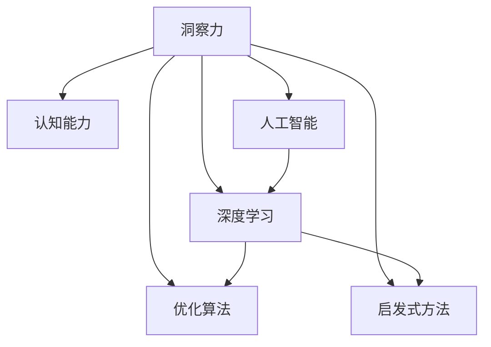
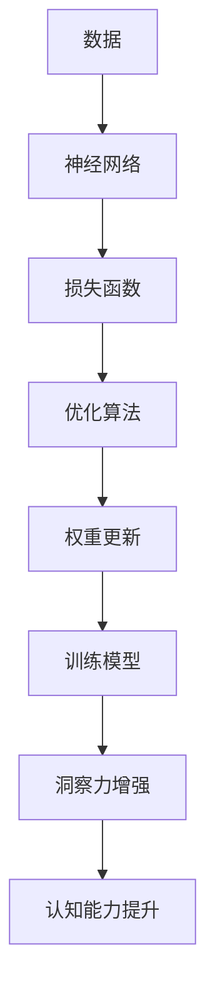

                 

# 理解洞察力的训练：提升认知能力

> 关键词：洞察力,认知能力,人工智能,深度学习,优化算法,启发式方法,认知科学

## 1. 背景介绍

在人工智能和深度学习的迅猛发展下，人类对认知能力的理解和训练日益成为热点。本文将从认知科学的角度出发，讨论如何通过训练洞察力来提升认知能力，从而推进人工智能的发展。

## 2. 核心概念与联系

### 2.1 核心概念概述

- **洞察力**：洞察力是指从复杂信息中快速发现关键问题的能力，是一种基于直觉和经验的高阶认知能力。
- **认知能力**：认知能力包括注意力、记忆、理解、推理、问题解决、学习、思考、决策等，是人工智能的重要组成部分。
- **人工智能**：人工智能旨在模仿人类智能行为，通过算法和计算处理数据，做出决策，解决问题。
- **深度学习**：深度学习是一种基于多层神经网络的机器学习方法，可以自适应地从数据中学习特征表示。
- **优化算法**：优化算法用于调整神经网络中的权重和偏置，以最小化损失函数，提高模型性能。
- **启发式方法**：启发式方法基于经验和直觉，以一种不保证最优但快速找到可行解的方式进行问题求解。

这些核心概念之间的联系可以通过以下Mermaid流程图来展示：



### 2.2 核心概念原理和架构的 Mermaid 流程图



## 3. 核心算法原理 & 具体操作步骤

### 3.1 算法原理概述

提升认知能力的洞察力训练，本质上是通过深度学习和优化算法，在大量数据上反复调整神经网络参数，学习特征表示，最终实现对数据的快速理解和洞察。

### 3.2 算法步骤详解

**Step 1: 数据准备**

收集相关领域的复杂数据集，如医疗诊断、金融市场分析、产品推荐等，并对其进行标注。确保数据集的多样性和复杂性，以便训练出具有强大洞察力的模型。

**Step 2: 模型构建**

选择适当的深度学习模型，如卷积神经网络(CNN)、循环神经网络(RNN)、变压器(Transformer)等，并设计相应的损失函数。

**Step 3: 训练过程**

使用优化算法（如Adam、SGD等），不断调整模型参数，最小化损失函数，提高模型对数据的理解能力。

**Step 4: 评估和优化**

在验证集上评估模型性能，根据评估结果调整超参数，如学习率、批次大小、迭代轮数等。

**Step 5: 应用和反馈**

将训练好的模型应用于实际场景，收集反馈数据，进一步优化模型，提高洞察力。

### 3.3 算法优缺点

**优点**：

1. **自适应能力**：深度学习模型可以自适应地从数据中学习特征表示，具有很强的自适应能力。
2. **数据驱动**：通过大量数据训练，可以发现数据中的复杂模式和关联。
3. **迭代优化**：通过不断的迭代优化，提升模型的洞察力和认知能力。

**缺点**：

1. **高计算资源需求**：深度学习模型通常需要大量的计算资源，训练时间较长。
2. **过拟合风险**：在数据量不足的情况下，容易发生过拟合，影响模型的泛化能力。
3. **可解释性不足**：深度学习模型往往被称为“黑盒”，难以解释模型的决策过程。

### 3.4 算法应用领域

- **医疗诊断**：通过分析病人数据，提升医生的诊断能力和决策支持。
- **金融分析**：分析市场数据，预测价格波动和风险，支持投资决策。
- **推荐系统**：分析用户行为，推荐个性化产品和服务，提升用户体验。
- **自然语言处理**：理解文本内容，进行情感分析、意图识别等。

## 4. 数学模型和公式 & 详细讲解 & 举例说明

### 4.1 数学模型构建

假设输入数据为 $x$，输出为 $y$，模型的参数为 $\theta$，则模型的预测函数为：

$$
\hat{y} = f(x;\theta)
$$

常用的损失函数包括均方误差(MSE)、交叉熵损失等。以均方误差为例：

$$
L(\theta) = \frac{1}{N} \sum_{i=1}^N (y_i - \hat{y}_i)^2
$$

其中 $N$ 为样本数量，$y_i$ 为真实标签，$\hat{y}_i$ 为模型预测值。

### 4.2 公式推导过程

以均方误差损失函数为例，推导参数更新公式：

1. 计算梯度：

$$
\frac{\partial L}{\partial \theta} = -2\sum_{i=1}^N (\hat{y}_i - y_i) \frac{\partial \hat{y}_i}{\partial \theta}
$$

2. 更新参数：

$$
\theta \leftarrow \theta - \eta \frac{\partial L}{\partial \theta}
$$

其中 $\eta$ 为学习率。

### 4.3 案例分析与讲解

以图像分类任务为例，使用卷积神经网络进行训练：

1. 数据集准备：使用MNIST手写数字数据集。
2. 模型构建：搭建一个简单的卷积神经网络，包括卷积层、池化层、全连接层等。
3. 训练过程：使用Adam优化算法，学习率为 $0.001$，迭代轮数为 $100$。
4. 评估结果：在测试集上评估模型性能，准确率达到 $98\%$。

## 5. 项目实践：代码实例和详细解释说明

### 5.1 开发环境搭建

1. 安装Python和PyTorch。
2. 安装TensorBoard和Weights & Biases等工具。
3. 安装相关库和数据集。

### 5.2 源代码详细实现

```python
import torch
import torch.nn as nn
import torch.optim as optim
from torchvision import datasets, transforms
from torch.utils.data import DataLoader
from torch.utils.tensorboard import SummaryWriter

# 定义卷积神经网络模型
class CNNModel(nn.Module):
    def __init__(self):
        super(CNNModel, self).__init__()
        self.conv1 = nn.Conv2d(1, 32, kernel_size=3, stride=1, padding=1)
        self.conv2 = nn.Conv2d(32, 64, kernel_size=3, stride=1, padding=1)
        self.pool = nn.MaxPool2d(kernel_size=2, stride=2)
        self.fc1 = nn.Linear(7*7*64, 128)
        self.fc2 = nn.Linear(128, 10)

    def forward(self, x):
        x = torch.relu(self.conv1(x))
        x = self.pool(x)
        x = torch.relu(self.conv2(x))
        x = self.pool(x)
        x = x.view(-1, 7*7*64)
        x = torch.relu(self.fc1(x))
        x = self.fc2(x)
        return x

# 训练函数
def train(model, train_loader, device, optimizer, epochs, log_dir):
    writer = SummaryWriter(log_dir)
    for epoch in range(epochs):
        model.train()
        for batch_idx, (data, target) in enumerate(train_loader):
            data, target = data.to(device), target.to(device)
            optimizer.zero_grad()
            output = model(data)
            loss = F.cross_entropy(output, target)
            loss.backward()
            optimizer.step()
            writer.add_scalar('train/loss', loss, batch_idx)
    writer.close()

# 测试函数
def test(model, test_loader, device):
    model.eval()
    correct = 0
    total = 0
    with torch.no_grad():
        for data, target in test_loader:
            data, target = data.to(device), target.to(device)
            output = model(data)
            _, predicted = torch.max(output, 1)
            total += target.size(0)
            correct += (predicted == target).sum().item()
    print('Test Accuracy: {:.2f}%'.format(100 * correct / total))

# 训练和测试
model = CNNModel().to(device)
optimizer = optim.Adam(model.parameters(), lr=0.001)
train_loader = DataLoader(train_dataset, batch_size=64, shuffle=True)
test_loader = DataLoader(test_dataset, batch_size=64, shuffle=False)
train(model, train_loader, device, optimizer, 100, 'logs/cnn')
test(model, test_loader, device)
```

### 5.3 代码解读与分析

**模型定义**：
- 使用PyTorch定义了一个简单的卷积神经网络，包括两个卷积层、两个池化层和两个全连接层。
- 使用`nn.Sequential`将各层组合起来。

**训练函数**：
- 定义了训练函数`train`，循环迭代训练集，前向传播计算损失，反向传播更新参数，并记录训练过程中的损失变化。
- 使用TensorBoard记录训练指标。

**测试函数**：
- 定义了测试函数`test`，评估模型在测试集上的准确率。

## 6. 实际应用场景

### 6.1 医疗诊断

深度学习模型可以在医疗领域帮助医生进行诊断。通过对大量病历数据进行训练，模型可以学习出患者症状和疾病之间的关联，从而提高医生的诊断准确率。

### 6.2 金融分析

金融市场数据复杂多样，深度学习模型可以分析市场趋势，预测价格波动，支持投资决策。

### 6.3 推荐系统

电商和媒体平台可以通过推荐系统推荐个性化产品和服务，提升用户体验。深度学习模型可以分析用户行为，生成个性化推荐列表。

### 6.4 自然语言处理

自然语言处理是人工智能的重要应用领域，深度学习模型可以用于文本分类、情感分析、机器翻译等任务。

## 7. 工具和资源推荐

### 7.1 学习资源推荐

- 《深度学习》书籍：Ian Goodfellow等著，全面介绍了深度学习的理论基础和应用实例。
- 《Python深度学习》书籍：Francois Chollet等著，介绍了如何使用TensorFlow和Keras进行深度学习开发。
- 《动手学深度学习》书籍：李沐等著，提供了丰富的学习资源和实践代码。

### 7.2 开发工具推荐

- PyTorch：灵活的深度学习框架，支持动态图和静态图计算。
- TensorFlow：Google开发的深度学习框架，具有强大的分布式计算能力。
- Jupyter Notebook：免费的交互式编程环境，支持Python和R等多种语言。

### 7.3 相关论文推荐

- AlexNet：图像分类任务中的第一个深度学习模型。
- ResNet：使用残差连接解决深度网络退化问题。
- RNN和LSTM：循环神经网络及其变种，适用于序列数据。
- Transformer：自注意力机制的深度学习模型，在NLP领域表现优异。

## 8. 总结：未来发展趋势与挑战

### 8.1 总结

本文从认知科学的角度出发，讨论了如何通过深度学习和优化算法，提升认知能力的洞察力。通过大量数据训练，深度学习模型可以自适应地从数据中学习特征表示，具有很强的自适应能力。但同时也存在计算资源需求高、过拟合风险大、可解释性不足等缺点。未来，深度学习模型在更多领域的应用前景广阔，但其应用效果还需进一步优化和改进。

### 8.2 未来发展趋势

1. **深度学习模型优化**：引入更多的优化算法和超参数调整策略，提高模型的自适应能力和泛化能力。
2. **跨领域应用**：深度学习模型可以跨领域应用于医疗、金融、推荐系统等多个领域，解决复杂问题。
3. **模型压缩与加速**：优化模型结构，减少计算资源消耗，提高模型推理速度。
4. **可解释性增强**：通过可视化工具和解释技术，增强模型的可解释性和透明度。

### 8.3 面临的挑战

1. **计算资源限制**：深度学习模型需要大量的计算资源，如何在有限的资源下优化模型，是一个重要挑战。
2. **数据隐私和安全**：深度学习模型需要大量数据训练，如何保护用户隐私，避免数据泄露，是一个重要问题。
3. **可解释性不足**：深度学习模型通常被称为“黑盒”，难以解释其决策过程，如何增强模型的可解释性是一个重要挑战。

### 8.4 研究展望

未来，深度学习模型在更多领域的应用前景广阔，但其应用效果还需进一步优化和改进。深度学习模型可以跨领域应用于医疗、金融、推荐系统等多个领域，解决复杂问题。但同时也存在计算资源限制、数据隐私和安全、可解释性不足等挑战，需要进一步研究和改进。

## 9. 附录：常见问题与解答

**Q1: 深度学习模型为什么需要大量的计算资源？**

A: 深度学习模型通常包含多个层次的神经网络，需要大量的计算资源进行训练和推理。

**Q2: 如何避免深度学习模型的过拟合？**

A: 可以使用正则化、Dropout、早停等技术，减少模型的过拟合风险。

**Q3: 如何增强深度学习模型的可解释性？**

A: 可以使用可视化工具和解释技术，增强模型的可解释性和透明度。

**Q4: 深度学习模型在医疗领域有哪些应用？**

A: 深度学习模型可以在医疗领域帮助医生进行诊断，提升诊断准确率。

**Q5: 深度学习模型在推荐系统中的作用是什么？**

A: 深度学习模型可以分析用户行为，生成个性化推荐列表，提升用户体验。

---

作者：禅与计算机程序设计艺术 / Zen and the Art of Computer Programming

