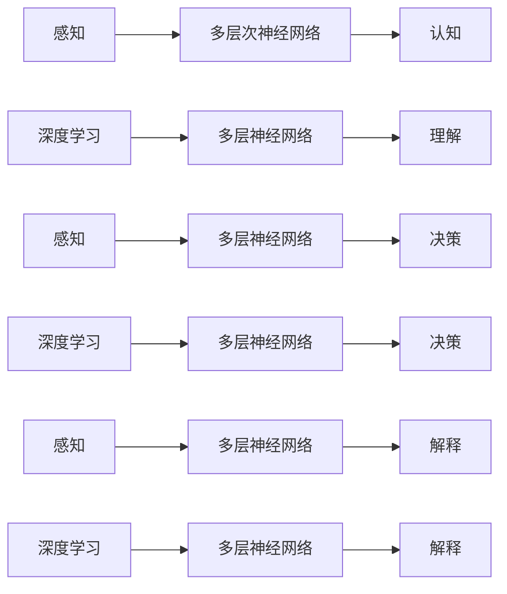

                 

# 理解的层次：从表面到本质的认知过程

> 关键词：认知心理学,神经科学,人工智能,深度学习,感知,决策,解释

## 1. 背景介绍

### 1.1 问题由来

理解和认知过程是心理学、神经科学、人工智能等领域长期研究的重大课题。在过去几十年间，随着大脑成像技术、神经网络模型、机器学习算法的进步，我们对大脑认知机制的理解不断深入，同时在技术层面也在逐步探索如何让机器更好地模拟人的理解与认知。

神经科学的研究已经证实，人类大脑通过皮层下和皮层上多个层次的神经网络，处理感知、记忆、决策、语言、运动等多种复杂认知任务。而基于深度学习的人工智能系统，如卷积神经网络(CNNs)、循环神经网络(RNNs)、变换器(Transformers)等，也在模仿这种多层次的网络结构，并逐步应用于图像、语音、文本等数据形式的理解与生成。

但是，尽管深度学习在处理具体任务上取得了显著成功，如图像分类、语音识别、自然语言处理等，但这些模型往往是基于表面的相似性或模式进行判断，缺乏对内在逻辑和本质的深刻理解。因此，如何让机器在理解和认知过程中从表面相似性走向内在本质，成为当前人工智能研究的一个重要方向。

### 1.2 问题核心关键点

为了更好地探索认知过程，本文将主要关注以下几个关键问题：
- 大脑和机器是如何实现从表面相似性到内在本质的认知转换？
- 什么是理解与认知的关键特征，机器需要模拟这些特征来实现深度理解？
- 如何将这些认知特征与深度学习架构相结合，构建更好的认知模型？
- 如何评估和验证机器是否真正理解了事物的本质，而不是仅仅是模式识别？

## 2. 核心概念与联系

### 2.1 核心概念概述

- 认知心理学（Cognitive Psychology）：研究人类和动物的心理过程，包括知觉、记忆、学习、思维、问题解决等。
- 神经科学（Neuroscience）：研究神经系统及其功能和疾病的科学，包括神经元、神经回路、大脑结构、信息处理等方面。
- 深度学习（Deep Learning）：一种基于多层神经网络的机器学习技术，可以处理高维非线性数据，广泛应用于图像、语音、文本等领域。
- 感知（Perception）：大脑和机器对环境刺激的初步处理和解释，包括视觉、听觉、触觉等多种感知方式。
- 决策（Decision Making）：基于感知和记忆，对多种可能选择进行权衡和判断的过程。
- 解释（Explanation）：对认知过程和结果进行理解、解释和验证，是认知科学和人工智能的重要环节。

这些核心概念之间存在紧密联系。大脑通过感知神经元接收环境刺激，经过多层次的神经网络处理后，形成对事物的内在认知。而机器则需要通过类似的网络结构，利用训练数据学习感知和认知特征，从而实现对输入数据的理解和决策。

### 2.2 核心概念原理和架构的 Mermaid 流程图(Mermaid 流程节点中不要有括号、逗号等特殊字符)



这个流程图展示了感知、认知、决策、解释等核心概念之间的关系。大脑和机器通过感知获取环境信息，然后通过多层次的神经网络进行处理，形成对事物的内在认知和决策。最终，机器通过解释过程，将结果与人类理解进行对比，验证理解是否正确。

## 3. 核心算法原理 & 具体操作步骤

### 3.1 算法原理概述

从表面相似性到内在本质的认知转换，可以通过多层次的神经网络结构实现。假设输入数据为 $x$，表示环境刺激，神经网络为 $M$，输出为 $y$，表示认知结果或决策。则认知过程可以表示为：

$$
y = M(x)
$$

其中，$M$ 是一个多层神经网络，其结构和参数在训练过程中不断调整，以最小化预测结果与实际结果之间的误差。

神经网络由多个层次组成，每个层次包括多个神经元，每个神经元接收来自上一层次的输入，并根据权重和激活函数计算输出。通过逐层处理，输入数据逐渐被抽象为更高级别的特征，最终形成对输入数据的认知结果。

### 3.2 算法步骤详解

神经网络训练和认知转换主要分为以下几个步骤：

**Step 1: 数据准备**

- 收集包含不同表面相似性和内在本质的数据集 $D=\{(x_i,y_i)\}_{i=1}^N$，其中 $x_i$ 表示输入数据，$y_i$ 表示标签或认知结果。
- 将数据集划分为训练集、验证集和测试集，以评估模型在不同数据上的性能。

**Step 2: 模型构建**

- 设计多层神经网络结构，包括输入层、隐藏层、输出层等，每层包括多个神经元。
- 选择合适的激活函数和损失函数，如ReLU、Softmax、交叉熵损失等，以适应不同的认知任务。

**Step 3: 模型训练**

- 使用随机梯度下降(SGD)等优化算法，根据损失函数最小化的目标更新模型参数。
- 在训练过程中，不断调整隐藏层的神经元数量和结构，以提高模型复杂度和泛化能力。

**Step 4: 模型评估**

- 在验证集上评估模型性能，包括精度、召回率、F1值等指标。
- 根据评估结果调整模型参数，重新训练模型，直到达到预设的性能指标。

**Step 5: 模型测试**

- 在测试集上评估最终模型的性能，与人类理解进行对比，验证机器是否真正理解了事物的本质。
- 通过人工干预和解释，进一步验证模型的认知过程和结果。

### 3.3 算法优缺点

深度学习模型在处理表面相似性和内在本质方面，具有以下优点和局限性：

**优点：**
- 可以处理高维、非线性数据，适用于多种输入类型。
- 通过多层网络结构，可以逐步抽象出输入数据的高级特征。
- 通过反向传播算法，可以高效优化模型参数。

**局限性：**
- 模型复杂度较高，需要大量计算资源进行训练和推理。
- 对训练数据依赖较大，容易过拟合。
- 缺乏对认知过程和结果的解释能力，难以验证认知结果的正确性。

### 3.4 算法应用领域

深度学习模型已经在图像识别、语音识别、自然语言处理等领域取得了巨大成功。例如，在图像分类任务中，卷积神经网络通过多层次卷积和池化操作，逐步提取图像中的局部特征和全局特征，形成对图像的高级认知。在自然语言处理任务中，循环神经网络通过时间序列建模，逐步捕捉语言中的语法和语义信息，形成对文本的认知。

此外，深度学习模型还被应用于医疗诊断、智能推荐、金融预测等实际应用中，为各行各业带来了智能化的解决方案。

## 4. 数学模型和公式 & 详细讲解 & 举例说明

### 4.1 数学模型构建

深度学习模型的数学模型可以表示为：

$$
y = M(x; \theta) = \sigma(W_l \sigma(W_{l-1} ... \sigma(W_1 x); \theta_1))
$$

其中，$\theta$ 表示模型参数，$W_l$ 表示第 $l$ 层的权重矩阵，$\sigma$ 表示激活函数，$x$ 表示输入数据，$y$ 表示输出结果。

以一个简单的两层神经网络为例，其数学模型可以表示为：

$$
y = \sigma(W_2 \sigma(W_1 x))
$$

其中，$W_1$ 和 $W_2$ 为权重矩阵，$\sigma$ 为激活函数，如ReLU、Sigmoid等。

### 4.2 公式推导过程

以一个简单的两层神经网络为例，推导其预测结果和误差。

假设输入数据 $x$ 为二维向量，$W_1$ 和 $W_2$ 分别为 $m \times n$ 和 $n \times p$ 的矩阵，$\sigma_1$ 和 $\sigma_2$ 分别为激活函数。则神经网络的预测结果为：

$$
y = \sigma_2(W_2 \sigma_1(W_1 x))
$$

其中，$\sigma_1(W_1 x)$ 表示输入数据 $x$ 经过 $W_1$ 和 $\sigma_1$ 函数处理后的结果，$W_2 \sigma_1(W_1 x)$ 表示第二层网络的输出。

假设模型的输出结果 $y$ 与真实标签 $y^*$ 之间的误差为 $L$，则均方误差损失函数可以表示为：

$$
L = \frac{1}{N} \sum_{i=1}^N (y_i - y_i^*)^2
$$

其中，$N$ 表示样本数，$y_i$ 和 $y_i^*$ 分别表示第 $i$ 个样本的预测结果和真实标签。

### 4.3 案例分析与讲解

以图像分类任务为例，分析深度学习模型如何从表面相似性走向内在本质。

假设输入数据 $x$ 为图像像素矩阵，$W_1$ 和 $W_2$ 分别为 $m \times n$ 和 $n \times p$ 的卷积核矩阵，$\sigma$ 为ReLU激活函数。则神经网络的预测结果为：

$$
y = \sigma_2(W_2 \sigma_1(W_1 x))
$$

其中，$W_1$ 和 $W_2$ 分别通过卷积操作逐步提取图像的局部特征和全局特征，$\sigma_1$ 和 $\sigma_2$ 分别对特征进行激活处理。

深度学习模型通过多层卷积和池化操作，逐步捕捉图像中的高层次特征，如边缘、纹理、形状等，最终形成对图像的认知结果。例如，对于一张猫的图片，深度学习模型能够识别出猫的眼睛、鼻子、耳朵等局部特征，并结合上下文信息，判断这是一只猫。

## 5. 项目实践：代码实例和详细解释说明

### 5.1 开发环境搭建

在进行深度学习项目实践前，需要准备好开发环境。以下是使用Python进行PyTorch开发的环境配置流程：

1. 安装Anaconda：从官网下载并安装Anaconda，用于创建独立的Python环境。

2. 创建并激活虚拟环境：
```bash
conda create -n pytorch-env python=3.8 
conda activate pytorch-env
```

3. 安装PyTorch：根据CUDA版本，从官网获取对应的安装命令。例如：
```bash
conda install pytorch torchvision torchaudio cudatoolkit=11.1 -c pytorch -c conda-forge
```

4. 安装各类工具包：
```bash
pip install numpy pandas scikit-learn matplotlib tqdm jupyter notebook ipython
```

完成上述步骤后，即可在`pytorch-env`环境中开始深度学习项目实践。

### 5.2 源代码详细实现

这里我们以图像分类任务为例，给出使用PyTorch进行卷积神经网络(CNN)开发的代码实现。

首先，定义CNN模型：

```python
import torch
import torch.nn as nn
import torch.optim as optim
from torch.utils.data import DataLoader, Dataset

class CNNModel(nn.Module):
    def __init__(self):
        super(CNNModel, self).__init__()
        self.conv1 = nn.Conv2d(3, 64, kernel_size=3, stride=1, padding=1)
        self.pool1 = nn.MaxPool2d(kernel_size=2, stride=2)
        self.conv2 = nn.Conv2d(64, 128, kernel_size=3, stride=1, padding=1)
        self.pool2 = nn.MaxPool2d(kernel_size=2, stride=2)
        self.fc1 = nn.Linear(128 * 28 * 28, 1024)
        self.fc2 = nn.Linear(1024, 10)

    def forward(self, x):
        x = self.pool1(nn.ReLU(self.conv1(x)))
        x = self.pool2(nn.ReLU(self.conv2(x)))
        x = x.view(-1, 128 * 28 * 28)
        x = nn.ReLU(self.fc1(x))
        x = self.fc2(x)
        return x

# 加载数据集
train_dataset = ImageFolder(train_dir, transform=transforms.ToTensor())
test_dataset = ImageFolder(test_dir, transform=transforms.ToTensor())

# 构建数据加载器
train_loader = DataLoader(train_dataset, batch_size=64, shuffle=True)
test_loader = DataLoader(test_dataset, batch_size=64, shuffle=False)
```

然后，定义损失函数和优化器：

```python
criterion = nn.CrossEntropyLoss()
optimizer = optim.SGD(model.parameters(), lr=0.01, momentum=0.9)
```

接着，定义训练和评估函数：

```python
def train_epoch(model, data_loader, optimizer, criterion):
    model.train()
    losses = []
    corrects = 0
    total = 0
    for batch_idx, (data, target) in enumerate(data_loader):
        optimizer.zero_grad()
        output = model(data)
        loss = criterion(output, target)
        loss.backward()
        optimizer.step()
        losses.append(loss.item())
        _, predicted = output.max(1)
        total += target.size(0)
        corrects += predicted.eq(target).sum().item()
    return losses, corrects, total

def evaluate(model, data_loader, criterion):
    model.eval()
    losses = []
    corrects = 0
    total = 0
    with torch.no_grad():
        for batch_idx, (data, target) in enumerate(data_loader):
            output = model(data)
            loss = criterion(output, target)
            losses.append(loss.item())
            _, predicted = output.max(1)
            total += target.size(0)
            corrects += predicted.eq(target).sum().item()
    return losses, corrects, total
```

最后，启动训练流程并在测试集上评估：

```python
epochs = 10
batch_size = 64

for epoch in range(epochs):
    train_losses, train_corrects, train_total = train_epoch(model, train_loader, optimizer, criterion)
    test_losses, test_corrects, test_total = evaluate(model, test_loader, criterion)
    print(f"Epoch {epoch+1}, Train Loss: {sum(train_losses)/len(train_losses):.4f}, Train Acc: {train_corrects/train_total:.4f}, Test Loss: {sum(test_losses)/len(test_losses):.4f}, Test Acc: {test_corrects/test_total:.4f}")
    
print(f"Final Train Loss: {sum(train_losses)/len(train_losses):.4f}, Final Train Acc: {train_corrects/train_total:.4f}, Final Test Loss: {sum(test_losses)/len(test_losses):.4f}, Final Test Acc: {test_corrects/test_total:.4f}")
```

以上就是使用PyTorch进行图像分类任务CNN微调的完整代码实现。可以看到，通过设计合适的神经网络结构、选择适当的损失函数和优化器，并利用训练集和测试集进行训练和评估，即可实现从表面相似性到内在本质的认知转换。

### 5.3 代码解读与分析

让我们再详细解读一下关键代码的实现细节：

**CNNModel类**：
- `__init__`方法：初始化神经网络结构，包括卷积层、池化层、全连接层等。
- `forward`方法：定义前向传播过程，包括卷积、池化、激活、线性映射等操作。

**数据集加载和处理**：
- 使用`ImageFolder`类加载图像数据集，并进行预处理，如转换为张量。
- 定义训练集和测试集的批处理加载器，支持随机数据排序和批处理操作。

**损失函数和优化器**：
- 使用`nn.CrossEntropyLoss`定义分类任务的损失函数。
- 使用`optim.SGD`定义随机梯度下降优化器，设置学习率、动量等参数。

**训练和评估函数**：
- `train_epoch`函数：定义训练过程，包括前向传播、反向传播、梯度更新等操作，并计算损失和准确率。
- `evaluate`函数：定义评估过程，在测试集上计算损失和准确率，评估模型性能。

**训练流程**：
- 循环迭代每个epoch，在训练集上训练模型，在测试集上评估模型。
- 输出每个epoch的训练损失、准确率、测试损失、准确率。
- 最后输出最终的训练和测试结果。

通过这个例子，可以看出深度学习模型从表面相似性到内在本质的认知转换是如何实现的。训练过程中，神经网络逐步学习图像的局部特征和全局特征，并结合激活函数和全连接层，形成对图像的高级认知。

## 6. 实际应用场景

### 6.1 智能推荐系统

智能推荐系统是深度学习模型在实际应用中的重要应用之一。推荐系统通过分析用户的历史行为数据和兴趣爱好，推荐适合的用户商品。深度学习模型可以从用户的浏览记录、评分记录等表面相似性数据中，抽象出用户的内在兴趣特征，形成对用户的认知。

在推荐系统中，深度学习模型可以通过多层神经网络结构，逐步捕捉用户行为的局部特征和全局特征，如浏览时间、点击次数、评分等级等。通过多层感知器(Multilayer Perceptron, MLP)、循环神经网络(RNN)等模型，逐步构建用户画像，形成对用户行为的认知。最终，模型可以根据用户画像，推荐最合适的商品，实现从表面相似性到内在本质的认知转换。

### 6.2 医疗诊断系统

医疗诊断系统是深度学习模型在医学领域的重要应用。医疗诊断系统通过分析患者的症状和历史病历数据，辅助医生进行疾病诊断。深度学习模型可以从患者的症状描述、实验室检查结果等表面相似性数据中，抽象出疾病的内在特征，形成对疾病的认知。

在医疗诊断系统中，深度学习模型可以通过卷积神经网络(CNNs)、循环神经网络(RNNs)等模型，逐步捕捉患者的症状特征和疾病特征，如肿瘤的大小、位置、形态等。通过多层感知器(MLP)、卷积神经网络(CNNs)等模型，逐步构建疾病特征，形成对疾病的认知。最终，模型可以根据疾病特征，辅助医生进行疾病诊断，实现从表面相似性到内在本质的认知转换。

### 6.3 自然语言处理

自然语言处理是深度学习模型在NLP领域的重要应用。自然语言处理通过分析文本的表面相似性数据，理解文本的内在语义信息，实现从表面相似性到内在本质的认知转换。

在自然语言处理中，深度学习模型可以通过卷积神经网络(CNNs)、循环神经网络(RNNs)、变换器(Transformers)等模型，逐步捕捉文本的局部特征和全局特征，如语法结构、语义关系等。通过多层感知器(MLP)、卷积神经网络(CNNs)、变换器(Transformers)等模型，逐步构建文本的语义特征，形成对文本的认知。最终，模型可以根据文本的语义特征，实现文本分类、情感分析、机器翻译等任务，实现从表面相似性到内在本质的认知转换。

## 7. 工具和资源推荐

### 7.1 学习资源推荐

为了帮助开发者系统掌握深度学习模型的认知过程，这里推荐一些优质的学习资源：

1. 《深度学习》（Ian Goodfellow著）：深入浅出地介绍了深度学习的基本概念、算法和应用，是深度学习领域的经典之作。
2. 《神经网络与深度学习》（Michael Nielsen著）：通俗易懂地介绍了神经网络的数学原理和算法实现，适合初学者入门。
3. 《自然语言处理综论》（Daniel Jurafsky & James H. Martin著）：全面介绍了NLP领域的理论和应用，涵盖多种NLP任务，如机器翻译、文本分类、情感分析等。
4. Coursera的深度学习专项课程：由Andrew Ng教授主讲，系统讲解了深度学习的基本理论和实践技能，适合系统学习。
5. Stanford的CS231n深度学习课程：重点介绍卷积神经网络(CNNs)的原理和应用，适合图像处理领域的学习者。

通过对这些资源的学习实践，相信你一定能够快速掌握深度学习模型的认知过程，并用于解决实际的认知问题。

### 7.2 开发工具推荐

高效的深度学习开发离不开优秀的工具支持。以下是几款用于深度学习开发的常用工具：

1. PyTorch：基于Python的开源深度学习框架，灵活动态的计算图，适合快速迭代研究。
2. TensorFlow：由Google主导开发的开源深度学习框架，生产部署方便，适合大规模工程应用。
3. Keras：高层API封装，易于上手，适合快速原型设计和实验验证。
4. Jupyter Notebook：交互式的Python编程环境，适合数据探索、算法验证和模型训练。
5. Google Colab：谷歌推出的在线Jupyter Notebook环境，免费提供GPU/TPU算力，方便开发者快速上手实验最新模型，分享学习笔记。

合理利用这些工具，可以显著提升深度学习项目的开发效率，加快创新迭代的步伐。

### 7.3 相关论文推荐

深度学习模型在认知过程方面的研究，已经取得了大量成果。以下是几篇奠基性的相关论文，推荐阅读：

1. ImageNet Classification with Deep Convolutional Neural Networks（AlexNet论文）：提出卷积神经网络(CNNs)结构，在图像分类任务上取得了巨大成功。
2. Recurrent Neural Network for Sequence Prediction（LSTM论文）：提出循环神经网络(RNNs)结构，解决了序列数据建模的问题。
3. Attention is All You Need（即Transformer原论文）：提出变换器(Transformers)结构，开启了深度学习模型在NLP领域的应用。
4. Deep Residual Learning for Image Recognition（ResNet论文）：提出残差网络结构，解决了深层网络训练中的梯度消失问题。
5. Generative Adversarial Nets（GAN论文）：提出生成对抗网络(GANs)，在图像生成、文本生成等领域取得了突破性进展。

这些论文代表了大深度学习模型的发展脉络。通过学习这些前沿成果，可以帮助研究者把握学科前进方向，激发更多的创新灵感。

## 8. 总结：未来发展趋势与挑战

### 8.1 总结

本文对深度学习模型的认知过程进行了全面系统的介绍。首先阐述了深度学习模型如何从表面相似性走向内在本质的认知转换，明确了深度学习模型在处理复杂认知任务中的潜力和局限。其次，从原理到实践，详细讲解了深度学习模型的构建和训练过程，给出了具体的代码实现。同时，本文还广泛探讨了深度学习模型在推荐系统、医疗诊断、自然语言处理等领域的实际应用，展示了深度学习模型的强大认知能力。

通过本文的系统梳理，可以看到，深度学习模型在认知过程中实现了从表面相似性到内在本质的转换，为复杂认知任务提供了新的解决方案。尽管深度学习模型在某些领域表现出色，但仍然面临训练数据依赖、模型复杂度高等诸多挑战。未来，需要在数据、模型、算法、工程等方面不断优化和改进，才能更好地发挥深度学习模型的认知能力。

### 8.2 未来发展趋势

深度学习模型的未来发展趋势如下：

1. 模型规模不断增大：随着算力成本的下降和数据规模的扩张，深度学习模型的参数量还将持续增长。超大规模模型蕴含的丰富特征表示，有望支撑更加复杂的认知任务。

2. 认知特征逐步丰富：深度学习模型将逐步学习更多的认知特征，如语义关系、因果推理、决策链等，以增强对认知过程的模拟能力。

3. 认知解释逐步完善：深度学习模型将逐步具备更好的解释能力，能够将内部决策过程与认知结果关联起来，提高认知过程的可解释性。

4. 多模态学习逐步普及：深度学习模型将逐步支持多种模态数据的融合，如图像、语音、文本等，以增强对复杂环境信息的理解能力。

5. 推理效率逐步提高：深度学习模型将逐步优化推理过程，降低计算资源消耗，提高推理速度，实现更高效的认知推理。

6. 知识融合逐步深入：深度学习模型将逐步融合符号化知识和先验知识，增强对认知任务的建模能力。

这些趋势预示着深度学习模型在认知过程中的潜力和进步。相信随着技术的不断进步，深度学习模型将在更多领域发挥重要作用，推动认知科学和人工智能的发展。

### 8.3 面临的挑战

尽管深度学习模型在认知过程中取得了显著进展，但仍然面临诸多挑战：

1. 训练数据依赖：深度学习模型对训练数据依赖较大，难以在没有大量标注数据的情况下进行有效训练。未来需要探索更多的无监督、半监督学习范式，以降低对标注数据的依赖。

2. 模型复杂度高：深度学习模型的结构复杂，训练和推理过程耗时较长，难以大规模应用。未来需要优化模型结构，降低计算资源消耗，提高模型推理效率。

3. 认知过程不透明：深度学习模型的内部决策过程不透明，难以理解其认知过程和结果。未来需要引入解释性方法，增强认知过程的可解释性。

4. 知识整合不足：深度学习模型难以灵活吸收和运用外部知识，导致知识整合能力不足。未来需要引入外部知识库、规则库等专家知识，增强认知模型的知识融合能力。

5. 伦理道德风险：深度学习模型可能学习到有害信息，存在伦理道德风险。未来需要引入伦理导向的评估指标，确保模型的安全和道德合规。

这些挑战预示着深度学习模型在认知过程中仍需不断优化和改进，以更好地实现从表面相似性到内在本质的认知转换。

### 8.4 研究展望

面对深度学习模型在认知过程中面临的挑战，未来的研究方向如下：

1. 探索无监督、半监督学习范式：降低深度学习模型对标注数据的依赖，利用自监督学习、主动学习等方法，提高认知过程的效率和准确性。

2. 开发参数高效、计算高效的认知模型：优化深度学习模型的结构，降低计算资源消耗，提高推理速度，实现更高效的认知推理。

3. 引入因果分析和博弈论工具：增强深度学习模型的决策过程和推理过程，提高认知过程的稳定性和可解释性。

4. 结合符号化和先验知识：引入符号化知识和先验知识，增强深度学习模型的认知过程和结果的解释性。

5. 引入伦理导向的评估指标：引入伦理导向的评估指标，确保深度学习模型的安全和道德合规。

这些研究方向将推动深度学习模型在认知过程中的不断优化和改进，为认知科学和人工智能的发展带来新的突破。

## 9. 附录：常见问题与解答

**Q1：深度学习模型如何实现从表面相似性到内在本质的认知转换？**

A: 深度学习模型通过多层次的神经网络结构，逐步捕捉输入数据的局部特征和全局特征，形成对输入数据的认知。每一层神经元都通过学习输入数据的特征，不断抽象出更高层次的特征，最终形成对输入数据的本质认知。例如，在图像分类任务中，卷积神经网络通过多层卷积和池化操作，逐步提取图像的局部特征和全局特征，形成对图像的高级认知。

**Q2：深度学习模型的参数量对认知过程有何影响？**

A: 深度学习模型的参数量对认知过程有很大的影响。参数量较大的模型通常可以学习到更丰富的特征表示，从而更好地捕捉输入数据的复杂关系，形成更精确的认知结果。但参数量较大的模型也存在训练和推理过程耗时较长、计算资源消耗较大的问题。因此，需要在参数量和认知效果之间进行权衡，选择合适的模型结构。

**Q3：深度学习模型在实际应用中如何处理标注数据依赖？**

A: 深度学习模型在实际应用中处理标注数据依赖的方法包括：
1. 无监督学习：利用未标注数据进行训练，通过自监督学习任务，学习输入数据的特征表示。
2. 半监督学习：利用少量标注数据和大量未标注数据进行联合训练，通过有监督和无监督学习的结合，提高认知过程的效率和准确性。
3. 主动学习：通过模型评估未标注数据的重要性和难度，主动选择最有价值的数据进行标注，提高标注数据的利用率。

这些方法可以在一定程度上降低深度学习模型对标注数据的依赖，提高认知过程的效率和准确性。

**Q4：深度学习模型在认知过程中如何避免过拟合？**

A: 深度学习模型在认知过程中避免过拟合的方法包括：
1. 数据增强：通过数据增强技术，如旋转、缩放、翻转等，扩充训练集的多样性，减少过拟合风险。
2. 正则化：使用L2正则、Dropout等正则化技术，防止模型在训练过程中过拟合。
3. 早停法：在验证集上设置评估阈值，当模型性能不再提升时，停止训练，避免过拟合。
4. 模型简化：通过简化模型结构、减少参数量等方法，降低模型的复杂度，减少过拟合风险。

这些方法可以帮助深度学习模型在认知过程中避免过拟合，提高模型的泛化能力和认知效果。

**Q5：深度学习模型在认知过程中如何提高解释能力？**

A: 深度学习模型在认知过程中提高解释能力的方法包括：
1. 可解释模型：引入可解释模型架构，如决策树、规则库等，增强模型的解释能力。
2. 特征可视化：通过特征可视化技术，如t-SNE、LIME等，展示模型的特征表示和决策过程，增强模型的可解释性。
3. 部分可解释：通过部分可解释方法，如LIME、SHAP等，解释模型的部分决策过程，提高模型的透明度和可信度。

这些方法可以帮助深度学习模型在认知过程中提高解释能力，增强模型的透明度和可信度。

---

作者：禅与计算机程序设计艺术 / Zen and the Art of Computer Programming

