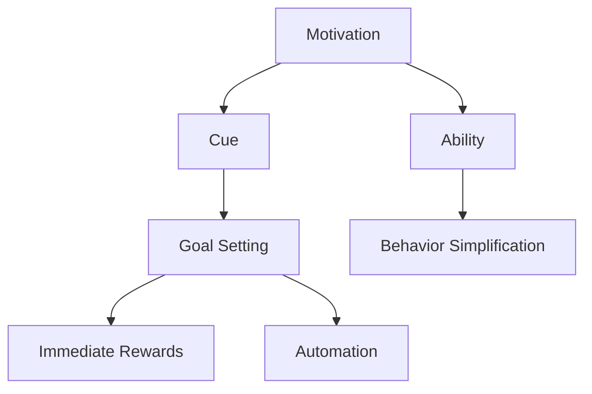

                 

# 用福格模型设计高绩效行为

> 关键词：行为设计(Behavior Design), 动机(Motivation), 习惯(Habit), 目标设定(Goal Setting), 行为简化(Simplification)

## 1. 背景介绍

### 1.1 问题由来

在快速变化和充满竞争的商业环境中，企业需要不断地创新和改进其运营方式，以保持竞争力。然而，企业的运作往往面临诸多挑战：

- 员工缺乏必要的动力和意愿，导致工作投入不足。
- 复杂的工作流程增加了运营成本，降低了效率。
- 缺乏有效的激励机制，难以实现高绩效行为。

行为设计(Behavior Design)作为一项新兴的学科，通过科学的方法改变人类行为，帮助企业和个人实现更高的绩效。福格模型(Behavior Model)是行为设计中最核心的方法之一，由行为科学家宾·福格(BJ Fogg)提出，用于帮助人们理解行为发生的内在机制，并指导如何设计有效的行为触发器。

### 1.2 问题核心关键点

福格模型将行为的产生分为三个必要条件：动机(Motivation)、能力(Ability)和提示(Cue)。一个行为要发生，这三个因素必须同时满足。动机是指个体的内部驱动力，如恐惧、欲望等；能力是指完成一个行为所需的技能和资源；提示是指触发行为的信号或信号环境。

基于福格模型，行为设计关注于如何增强动机、提升能力和设计有效的提示，以促进目标行为的发生。该模型不仅适用于个人行为改变，也广泛应用于企业运营、产品设计等场景。

### 1.3 问题研究意义

掌握福格模型的原理和应用方法，可以帮助企业和个人：

1. **提升员工积极性**：通过精确设计工作流程和激励机制，激发员工的内在动机，增强工作投入。
2. **优化业务流程**：简化复杂的工作流程，提高效率，降低成本。
3. **实现高绩效行为**：通过行为简化和行为提示设计，确保目标行为的发生，实现企业的创新和改进。

掌握福格模型，是实现组织和个人高绩效的关键工具。

## 2. 核心概念与联系

### 2.1 核心概念概述

为更好地理解福格模型的应用，本节将介绍几个密切相关的核心概念：

- 动机(Motivation)：驱动个体进行某种行为的内部或外部因素，如奖励、惩罚、社交认同等。
- 能力(Ability)：完成特定行为所需的技能、资源和环境条件，如时间、知识、工具等。
- 提示(Cue)：触发行为的信号或环境，如手机提示、时间、地点等。
- 目标设定(Goal Setting)：明确的目标设定是实现行为改变的基础，目标应该具体、可测量、可实现。
- 行为简化(Simplification)：简化复杂的行为流程，降低完成行为的难度，增强行为可执行性。
- 即时奖励(Immediate Rewards)：提供即时的正面反馈，增强行为动机和持续性。
- 自动化(Automation)：通过自动化手段，减少行为执行的摩擦，增强行为习惯的形成。

这些概念之间的逻辑关系可以通过以下Mermaid流程图来展示：



这个流程图展示了一些核心概念之间的关系：

1. 动机驱动能力的提升。
2. 提示触发行为的发生。
3. 目标设定明确行为的期望。
4. 简化行为流程，增强执行能力。
5. 即时奖励增强行为持续性。
6. 自动化降低执行摩擦，促进行为形成。

这些概念共同构成了福格模型的理论基础，指导了行为设计的实践操作。

## 3. 核心算法原理 & 具体操作步骤
### 3.1 算法原理概述

福格模型基于行为的产生条件，提出了一套行为设计的基本原则。行为要发生，必须满足以下三个条件：

1. **动机**：动机越强，行为发生的可能性越大。动机可以是内在（如欲望、恐惧）或外在的（如奖励、惩罚）。
2. **能力**：能力越强，行为发生的可能性越大。能力包括物理能力（如体力、技能）和心理能力（如认知、情感）。
3. **提示**：提示越明显，行为发生的可能性越大。提示可以是外部的（如手机提示）或内部的（如情绪状态）。

福格模型通过调整这三个因素，实现行为设计。具体而言，可以通过增强动机、提升能力和设计有效的提示，促进目标行为的实现。

### 3.2 算法步骤详解

福格模型的行为设计一般包括以下几个关键步骤：

**Step 1: 明确目标行为**
- 定义期望的行为，如定期锻炼、准时提交报告等。
- 目标应该具体、可测量、可实现，符合SMART原则。

**Step 2: 评估动机**
- 分析目标行为的动机来源，了解哪些因素可以驱动行为发生。
- 通过问卷调查、访谈等方式，收集目标行为的动机因素。

**Step 3: 分析能力**
- 评估完成目标行为所需的能力，包括物理和心理能力。
- 确定影响能力的因素，并制定相应的提升策略。

**Step 4: 设计提示**
- 选择最有效的提示方式，如手机提醒、日程安排等。
- 测试提示的可见性、频率和强度，确保能够触发行为。

**Step 5: 构建即时奖励机制**
- 设计即时的正面反馈，如小奖励、口头表扬等，增强行为动机。
- 测试即时奖励的效果，确保能够持续增强行为。

**Step 6: 自动化行为流程**
- 简化行为流程，减少执行的复杂性。
- 利用技术手段自动化行为流程，减少执行的摩擦。

**Step 7: 持续监测和反馈**
- 定期监测行为执行情况，识别问题并进行调整。
- 收集反馈信息，持续优化行为设计。

通过以上步骤，可以系统地设计有效的行为，实现高绩效目标。

### 3.3 算法优缺点

福格模型具有以下优点：

1. **系统性**：通过全面分析动机、能力和提示，提供了系统的行为设计方法。
2. **灵活性**：适用于各种行为设计场景，包括个人行为和企业运营。
3. **可操作性**：设计步骤具体明确，易于实施。
4. **适应性**：能够根据实际情况进行调整和优化。

同时，该模型也存在一些局限性：

1. **复杂性**：需要深入分析动机、能力和提示，设计和调整复杂。
2. **效果依赖**：设计的效果依赖于动机和能力的匹配程度，有时难以保证。
3. **个性化要求高**：不同个体和环境的动机、能力差异较大，需要个性化设计。
4. **实施成本**：设计和测试提示、即时奖励等机制，需要额外的时间和资源。

尽管如此，福格模型仍然是一种极具实用价值的行为设计工具，广泛应用于商业、医疗、教育等多个领域。

### 3.4 算法应用领域

福格模型在商业和组织管理中具有广泛的应用，包括：

1. **企业运营**：通过行为设计优化流程、提升员工效率和满意度。如设计激励机制、简化工作流程等。
2. **产品设计**：设计用户体验友好的产品，增强用户粘性和忠诚度。如优化用户界面、设计交互提示等。
3. **人力资源**：通过行为设计提升员工的积极性和绩效。如设计绩效评估系统、优化培训计划等。
4. **市场营销**：通过行为设计促进用户行为，提高品牌影响力和销售额。如设计优惠券、奖励机制等。
5. **健康管理**：通过行为设计促进健康习惯的养成，改善生活质量。如设计锻炼计划、饮食建议等。

福格模型在多个领域的应用实践表明，通过精确的行为设计，可以显著提升组织和个人的绩效。

## 4. 数学模型和公式 & 详细讲解
### 4.1 数学模型构建

福格模型将行为的产生分为动机、能力和提示三个因素，可以使用以下数学模型来描述：

$$
\text{Behavior} = f(\text{Motivation}, \text{Ability}, \text{Cue})
$$

其中，$Behavior$ 表示行为的发生情况，$Motivation$、$Ability$ 和 $Cue$ 分别表示动机、能力和提示。

假设每个因素的概率分布为 $P(\text{Motivation})$、$P(\text{Ability})$ 和 $P(\text{Cue})$，则行为发生的概率为：

$$
P(\text{Behavior}) = P(\text{Motivation}) \cdot P(\text{Ability}) \cdot P(\text{Cue})
$$

### 4.2 公式推导过程

根据福格模型，行为的发生条件可以进一步细化为三个子模型：

1. **动机模型**：
$$
P(\text{Motivation}) = \text{Desire} + \text{Capability} + \text{Satisfaction} + \text{Reward} + \text{Social Pressure}
$$

其中，$\text{Desire}$ 表示内在欲望，$\text{Capability}$ 表示内在能力，$\text{Satisfaction}$ 表示心理满足感，$\text{Reward}$ 表示外在奖励，$\text{Social Pressure}$ 表示社会压力。

2. **能力模型**：
$$
P(\text{Ability}) = \text{Physical Capability} + \text{Mental Capability} + \text{Environmental Capability}
$$

其中，$\text{Physical Capability}$ 表示物理能力，$\text{Mental Capability}$ 表示心理能力，$\text{Environmental Capability}$ 表示环境能力。

3. **提示模型**：
$$
P(\text{Cue}) = \text{Visible Cue} + \text{Audible Cue} + \text{Temporal Cue} + \text{Loci Cue} + \text{Social Cue}
$$

其中，$\text{Visible Cue}$ 表示视觉提示，$\text{Audible Cue}$ 表示听觉提示，$\text{Temporal Cue}$ 表示时间提示，$\text{Loci Cue}$ 表示地点提示，$\text{Social Cue}$ 表示社交提示。

通过上述模型，可以全面分析行为产生的内在机制，为行为设计提供科学依据。

### 4.3 案例分析与讲解

假设一个企业希望提升员工的健康习惯，目标是鼓励员工每天至少走1万步。

**Step 1: 明确目标行为**
- 目标行为：每天走1万步。

**Step 2: 评估动机**
- 内在动机：员工对健康的内在需求和期望。
- 外在动机：企业提供的奖励机制，如步数排名、健康奖励等。

**Step 3: 分析能力**
- 物理能力：员工的体力状况和日常工作强度。
- 心理能力：员工的心理状态和健康意识。
- 环境能力：员工的工作环境和时间安排。

**Step 4: 设计提示**
- 可见提示：在工作区放置步数统计器。
- 听觉提示：手机APP的步数提醒和统计声音。
- 时间提示：设定早上的固定时间段进行步数统计。
- 地点提示：在工作和家中的固定地点放置步数统计器。

**Step 5: 构建即时奖励机制**
- 提供步数排名和健康奖励，如健康餐券、健身房会员卡等。

**Step 6: 自动化行为流程**
- 使用智能手机APP进行步数记录和统计。
- 设定自动同步功能，将步数数据自动同步到企业健康管理平台。

**Step 7: 持续监测和反馈**
- 定期监测步数统计数据，识别步数不足的问题点。
- 收集员工的反馈意见，持续优化步数激励机制。

通过上述步骤，企业可以设计有效的行为提示和即时奖励机制，激发员工的动机和能力，提升健康习惯的形成。

## 5. 项目实践：代码实例和详细解释说明
### 5.1 开发环境搭建

在进行福格模型应用实践前，我们需要准备好开发环境。以下是使用Python进行行为设计应用的开发环境配置流程：

1. 安装Python：从官网下载并安装Python，建议使用3.8以上版本。

2. 安装Pandas和NumPy：
```bash
pip install pandas numpy
```

3. 安装Plotly：用于可视化行为设计数据：
```bash
pip install plotly
```

4. 安装Requests：用于获取外部API数据：
```bash
pip install requests
```

完成上述步骤后，即可在Python环境中进行福格模型的应用实践。

### 5.2 源代码详细实现

下面以企业健康习惯提升为例，给出使用Python进行福格模型行为设计的代码实现。

首先，定义动机、能力和提示的评估函数：

```python
import pandas as pd
import numpy as np

# 定义动机模型
def evaluate_motivation(desire, capability, satisfaction, reward, social_pressure):
    return desire + capability + satisfaction + reward + social_pressure

# 定义能力模型
def evaluate_ability(physical_capability, mental_capability, environmental_capability):
    return physical_capability + mental_capability + environmental_capability

# 定义提示模型
def evaluate_cue(visible_cue, audible_cue, temporal_cue, loci_cue, social_cue):
    return visible_cue + audible_cue + temporal_cue + loci_cue + social_cue
```

然后，定义行为发生的概率函数：

```python
# 定义行为发生概率模型
def behavior_probability(motivation, ability, cue):
    return motivation * ability * cue
```

最后，构建一个企业员工健康习惯提升的案例：

```python
# 定义员工健康习惯提升案例
desire = 5  # 内在欲望
capability = 4  # 内在能力
satisfaction = 3  # 心理满足感
reward = 2  # 外在奖励
social_pressure = 1  # 社会压力

physical_capability = 3  # 物理能力
mental_capability = 4  # 心理能力
environmental_capability = 3  # 环境能力

visible_cue = 5  # 可见提示
audible_cue = 4  # 听觉提示
temporal_cue = 4  # 时间提示
loci_cue = 3  # 地点提示
social_cue = 3  # 社交提示

# 计算行为发生的概率
motivation = evaluate_motivation(desire, capability, satisfaction, reward, social_pressure)
ability = evaluate_ability(physical_capability, mental_capability, environmental_capability)
cue = evaluate_cue(visible_cue, audible_cue, temporal_cue, loci_cue, social_cue)

probability = behavior_probability(motivation, ability, cue)
print(f"行为发生的概率为：{probability:.3f}")
```

以上就是使用Python进行福格模型行为设计的基本代码实现。可以看到，通过定义不同的动机、能力和提示模型，并计算它们对行为发生概率的影响，我们可以系统地设计有效行为。

### 5.3 代码解读与分析

让我们再详细解读一下关键代码的实现细节：

**动机模型和能力模型**：
- 定义了五个动机因素和三个能力因素，每个因素赋值1到5，表示动机和能力强度。
- 评估函数通过加和的方式，计算每个因素对行为动机的贡献。

**提示模型**：
- 定义了五种提示因素，每种因素赋值1到5，表示提示的可见性和强度。
- 评估函数通过加和的方式，计算每种提示对行为发生的贡献。

**行为发生概率**：
- 根据动机、能力和提示模型计算出的数值，使用乘法方式计算行为发生的概率。

这个代码实现展示了如何使用福格模型系统地评估行为发生的动机、能力和提示因素，并计算行为发生的概率。这种思路不仅适用于企业健康习惯提升，也可以应用于其他各种行为设计场景。

## 6. 实际应用场景
### 6.1 企业健康管理

福格模型在企业健康管理中的应用可以显著提升员工的身体健康和幸福感。

**案例描述**：某企业希望提高员工的健康水平，设计了每天走1万步的健康习惯。

**解决方案**：
1. **动机分析**：企业定期组织健康讲座和运动活动，激发员工的内在动机。
2. **能力提升**：提供健康设施和健身指导，提升员工的身体能力。
3. **提示设计**：在工作区放置步数统计器，每天固定时间提醒员工步行。
4. **即时奖励**：步数排名和健康奖励，如健康餐券、健身房会员卡等。
5. **自动化管理**：使用智能手机APP进行步数记录和统计，自动同步数据。

**效果评估**：通过持续监测和反馈，员工的健康习惯显著提升，步数记录和健康状况显著改善。

### 6.2 教育培训

福格模型在教育培训中的应用可以帮助学生养成良好的学习习惯，提高学习效果。

**案例描述**：某教育机构希望提高学生的学习积极性和效果，设计了每日复习的习惯。

**解决方案**：
1. **动机分析**：通过激励机制和竞赛活动，激发学生的内在动机。
2. **能力提升**：提供学习资源和辅导，提升学生的学习能力。
3. **提示设计**：设定固定的学习时间和地点，提醒学生复习。
4. **即时奖励**：学习成果展示和奖励机制，如优秀成绩、学习徽章等。
5. **自动化管理**：使用学习管理平台记录和分析学生的学习数据。

**效果评估**：通过持续监测和反馈，学生的学习效果显著提升，学习成绩和积极性显著提高。

### 6.3 金融理财

福格模型在金融理财中的应用可以帮助客户养成良好的理财习惯，实现财务自由。

**案例描述**：某金融机构希望提高客户的理财效果，设计了每日储蓄的习惯。

**解决方案**：
1. **动机分析**：通过理财目标和奖励机制，激发客户的内在动机。
2. **能力提升**：提供理财建议和工具，提升客户的理财能力。
3. **提示设计**：设定自动转账功能，每天固定时间自动储蓄。
4. **即时奖励**：定期奖金和理财证书，激励客户持续储蓄。
5. **自动化管理**：使用理财平台记录和分析客户的理财数据。

**效果评估**：通过持续监测和反馈，客户的理财效果显著提升，储蓄和理财成绩显著提高。

### 6.4 未来应用展望

福格模型在未来的应用将更加广泛，涵盖更多场景和领域。

1. **智慧城市**：通过行为设计提升居民的环保意识和健康习惯，促进智慧城市的建设。
2. **智慧医疗**：通过行为设计帮助患者养成良好的医疗习惯，提高治疗效果。
3. **智慧教育**：通过行为设计促进学生的自主学习和健康习惯，提升教育质量。
4. **智慧企业**：通过行为设计提升员工的效率和幸福感，增强企业的竞争力。

福格模型不仅限于个人行为设计，其应用将渗透到各个行业的运营中，带来更广泛的创新和改进。

## 7. 工具和资源推荐
### 7.1 学习资源推荐

为了帮助开发者系统掌握福格模型的理论基础和实践技巧，这里推荐一些优质的学习资源：

1. **《行为设计学》（Designing Behavioral Change）**：由宾·福格和拉里·埃尔多安（Larry Eeld）合著的经典书籍，详细介绍了福格模型的理论和实践应用。
2. **Coursera《行为设计》（Behavioral Design）**：宾·福格的在线课程，提供系统化的行为设计理论课程和实践指导。
3. **HBR《行为设计》（Behavioral Design）**：哈佛商业评论（Harvard Business Review）的文章和案例研究，深入探讨行为设计在商业中的应用。
4. **Journal of Business Research《行为设计》（Behavioral Design）**：国际顶级期刊，发表大量行为设计相关研究和案例，供进一步学习和研究。
5. **Journal of Marketing《行为设计》（Behavioral Design）**：国际市场营销期刊，深入研究行为设计在市场营销中的应用。

通过对这些资源的学习实践，相信你一定能够快速掌握福格模型的精髓，并用于解决实际的商业问题。

### 7.2 开发工具推荐

高效的开发离不开优秀的工具支持。以下是几款用于福格模型行为设计开发的常用工具：

1. **Jupyter Notebook**：强大的交互式编程环境，支持Python代码的编写和可视化展示。
2. **Python**：灵活易用的编程语言，支持各种数据处理和分析库。
3. **Plotly**：强大的数据可视化工具，支持生成各种图表和交互式仪表盘。
4. **Pandas**：数据处理和分析库，支持高效的数据处理和分析。
5. **NumPy**：高效的数据处理库，支持各种数值计算和科学计算。

合理利用这些工具，可以显著提升福格模型行为设计的开发效率，加快创新迭代的步伐。

### 7.3 相关论文推荐

福格模型的研究源于学界的持续探索。以下是几篇奠基性的相关论文，推荐阅读：

1. **《行为设计学》（Behavioral Design）**：宾·福格和拉里·埃尔多安（Larry Eeld）发表在《哈佛商业评论》（Harvard Business Review）上的文章，详细介绍了行为设计的基本理论和实践应用。
2. **《行为设计原理》（The Principles of Behavioral Design）**：宾·福格（BJ Fogg）的专著，深入探讨行为设计的基本原理和应用方法。
3. **《行为设计在健康管理中的应用》（Behavioral Design in Health Management）**：研究行为设计在健康管理和疾病预防中的应用效果。
4. **《行为设计在教育中的应用》（Behavioral Design in Education）**：研究行为设计在教育培训中的效果和影响。
5. **《行为设计在金融理财中的应用》（Behavioral Design in Financial Planning）**：研究行为设计在金融理财中的效果和影响。

这些论文代表了大行为设计的研究进展，提供了丰富的理论和实践经验，值得深入学习和借鉴。

## 8. 总结：未来发展趋势与挑战
### 8.1 总结

本文对福格模型的原理和应用进行了全面系统的介绍。首先阐述了福格模型的背景和意义，明确了行为设计的核心原理和步骤。其次，从理论到实践，详细讲解了行为设计的数学模型和具体步骤，给出了行为设计任务开发的完整代码实例。同时，本文还广泛探讨了福格模型在企业运营、教育培训、金融理财等领域的实际应用，展示了福格模型的强大潜力。此外，本文精选了行为设计相关的学习资源、开发工具和论文，力求为读者提供全方位的技术指引。

通过本文的系统梳理，可以看到，福格模型作为行为设计的基础工具，不仅适用于个人行为改变，更适用于企业运营、产品设计等复杂场景。掌握福格模型，是实现组织和个人高绩效的关键工具。

### 8.2 未来发展趋势

展望未来，福格模型在行为设计中的应用将呈现以下几个发展趋势：

1. **个性化行为设计**：通过数据挖掘和分析，提供个性化的行为设计方案，满足不同个体的需求。
2. **动态行为设计**：通过实时监测和反馈，动态调整行为设计策略，提升行为执行的持续性和效果。
3. **跨领域行为设计**：行为设计将广泛应用于多个领域，如教育、医疗、企业运营等，推动跨领域的协同创新。
4. **技术融合**：行为设计与人工智能、大数据等技术的融合，提升行为设计的智能化和自动化水平。
5. **伦理和合规**：行为设计将更加注重伦理和合规问题，确保行为设计的公平性和安全性。

这些趋势凸显了福格模型的广阔前景，为组织和个人行为设计的未来发展提供了新的方向。

### 8.3 面临的挑战

尽管福格模型已经取得了广泛的应用，但在实际应用中仍面临诸多挑战：

1. **动机多样性**：不同个体的动机来源和强度各异，难以统一设计和调整。
2. **能力评估复杂**：能力的评估涉及多个维度，如物理、心理、环境等，难以全面衡量。
3. **提示设计困难**：提示的设计需要考虑可见性、频率、强度等，难以一劳永逸。
4. **即时奖励效果不确定**：即时奖励的效果依赖于个体差异，难以保证一致性。
5. **自动化管理复杂**：自动化管理涉及系统集成和数据处理，技术实现复杂。
6. **效果评估难度大**：行为设计的效果评估需要长期数据和量化指标，难以快速验证。

尽管存在这些挑战，但通过不断优化模型和算法，福格模型在行为设计中的应用前景依然广阔。

### 8.4 研究展望

未来的研究需要在以下几个方面寻求新的突破：

1. **多因素行为设计**：将动机、能力和提示三因素进一步细化，考虑更多影响因素，提升行为设计的精准度。
2. **动态行为优化**：实时监测行为数据，动态调整行为设计策略，确保行为持续性和效果。
3. **跨领域应用拓展**：将行为设计应用于更多领域，推动跨领域协同创新，提升整体效能。
4. **技术融合创新**：将行为设计与人工智能、大数据等技术结合，提升行为设计的智能化和自动化水平。
5. **伦理和合规设计**：引入伦理和合规设计，确保行为设计的公平性和安全性，避免潜在的负面影响。

这些研究方向将推动福格模型向更高层次发展，为行为设计的实践提供更多创新路径。

## 9. 附录：常见问题与解答

**Q1：福格模型如何应用于个人行为设计？**

A: 福格模型可以应用于个人行为设计，通过评估动机、能力和提示，设计有效的行为触发器。例如，如果你想养成每天早上跑步的习惯：
1. **动机**：内在动机可能是身体健康，外在动机可能是社交认同。
2. **能力**：内在能力是跑步技能，环境能力是跑步设备和时间。
3. **提示**：可见提示是跑步装备，听觉提示是闹钟声音，时间提示是固定时间段。

**Q2：如何评估行为设计的有效性？**

A: 评估行为设计的有效性需要长期数据和量化指标。可以通过以下几个步骤：
1. **设定基准**：明确行为设计的初始状态。
2. **监测行为**：定期监测行为数据，记录行为的发生频率和持续性。
3. **效果评估**：使用统计分析和可视化工具，评估行为设计的实际效果。
4. **持续优化**：根据效果评估结果，持续优化行为设计策略。

**Q3：福格模型在企业运营中的应用有哪些？**

A: 福格模型在企业运营中的应用广泛，包括：
1. **员工管理**：通过行为设计提升员工的积极性和效率。
2. **产品设计**：通过行为设计提升用户体验和满意度。
3. **市场营销**：通过行为设计提升用户粘性和忠诚度。
4. **客户服务**：通过行为设计提升客户满意度和忠诚度。

**Q4：如何设计有效的即时奖励机制？**

A: 设计有效的即时奖励机制需要考虑以下几点：
1. **即时性**：奖励应立即给予，增强行为动机。
2. **正面性**：奖励应为正面反馈，增强行为持续性。
3. **多样性**：奖励应多样化，满足不同个体的需求。
4. **可达性**：奖励应易于获得，增强行为执行的意愿。

**Q5：福格模型在多领域应用中应注意哪些问题？**

A: 福格模型在多领域应用中应注意以下几点：
1. **动机差异**：不同领域的动机来源和强度各异，需要个性化设计。
2. **能力评估**：不同领域的能力评估方法和指标不同，需要具体分析。
3. **提示设计**：不同领域的提示设计和可见性要求不同，需要灵活调整。
4. **即时奖励**：不同领域的即时奖励方式和效果不同，需要科学设计。
5. **效果评估**：不同领域的行为设计效果评估方法和指标不同，需要根据实际情况选择。

这些问题是福格模型在多领域应用中需要注意的关键点，通过系统化设计和优化，可以更好地实现行为设计的效果。

---

作者：禅与计算机程序设计艺术 / Zen and the Art of Computer Programming

