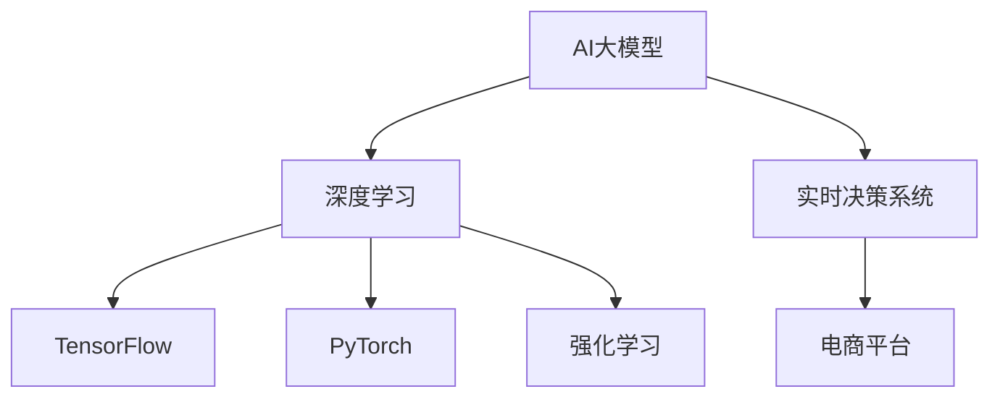

                 

# 电商平台中AI大模型的实时决策系统构建

> 关键词：
- AI大模型
- 电商平台
- 实时决策系统
- 深度学习
- TensorFlow
- PyTorch
- 强化学习

## 1. 背景介绍

随着电子商务的迅猛发展，电商平台成为连接消费者与商家的重要桥梁。为提升用户体验和商家满意度，电商平台需要在各种场景下做出及时准确的决策。传统的基于规则的决策系统，难以应对海量数据和复杂环境的挑战。而利用AI大模型进行实时决策，不仅可以大幅提升决策效率和准确性，还能进行复杂环境和动态变化的有效应对。本文将介绍如何构建基于AI大模型的电商平台实时决策系统，涵盖模型选择、算法实现、系统架构等多个关键环节。

## 2. 核心概念与联系

### 2.1 核心概念概述

为深入理解电商平台的AI大模型实时决策系统，本节将介绍几个关键概念：

- AI大模型：以深度学习为代表的大规模、高性能、通用智能模型，如BERT、GPT-3、DALL·E等，具有强大的特征提取和模式识别能力。
- 电商平台：指通过互联网平台销售商品或服务的交易市场，包括B2B、B2C、C2C等多种模式。
- 实时决策系统：指能够在较短的时间内，基于数据驱动的算法模型，自动化生成决策方案的系统。
- 深度学习：基于神经网络的机器学习技术，通过多层次的特征提取和抽象，学习模型对数据的内在规律。
- TensorFlow：由Google开发的深度学习框架，支持高效的分布式计算和模型训练。
- PyTorch：由Facebook开发的深度学习框架，易于调试和使用，支持动态图模型构建。
- 强化学习：通过与环境交互，不断调整策略，使模型优化决策的算法。

这些概念之间的逻辑关系可以通过以下Mermaid流程图来展示：



这个流程图展示了大模型和实时决策系统的主要概念及其之间的关系：

1. AI大模型通过深度学习技术，学习数据的特征和规律。
2. 实时决策系统利用大模型的特征提取能力，自动化生成决策方案。
3. 电商平台作为应用场景，是大模型和决策系统的共同载体。
4. TensorFlow和PyTorch是大模型训练和实时决策系统的常用框架。
5. 强化学习在大模型的训练和优化中起到重要作用。

## 3. 核心算法原理 & 具体操作步骤

### 3.1 算法原理概述

基于AI大模型的电商平台实时决策系统，本质上是一个基于深度学习的优化问题。其核心思想是：利用大模型学习海量电商数据中的用户行为、商品特征、市场环境等规律，自动生成最优的决策方案，以最大化电商平台的业务目标。

形式化地，假设电商平台决策的任务为 $T$，已有的电商数据为 $D=\{(x_i, y_i)\}_{i=1}^N$，其中 $x_i$ 为电商数据特征，$y_i$ 为对应的决策结果。假设模型为 $M_{\theta}$，其中 $\theta$ 为模型参数。则决策优化的目标为：

$$
\theta^* = \mathop{\arg\min}_{\theta} \mathcal{L}(M_{\theta},D)
$$

其中 $\mathcal{L}$ 为损失函数，用于衡量模型决策与真实决策结果之间的差异。常见的损失函数包括交叉熵损失、均方误差损失等。

### 3.2 算法步骤详解

构建基于AI大模型的电商平台实时决策系统，一般包括以下几个关键步骤：

**Step 1: 数据收集与预处理**
- 收集电商平台的各类数据，包括用户行为数据、商品数据、交易数据、市场环境数据等。
- 对数据进行清洗、归一化、特征提取等预处理操作，以保证数据质量和一致性。

**Step 2: 选择模型与架构**
- 根据任务需求和数据特征，选择合适的AI大模型。如BERT、GPT-3、DALL·E等。
- 设计模型架构，确定模型输入输出、损失函数等关键组件。

**Step 3: 训练模型与优化**
- 使用TensorFlow或PyTorch等框架，将电商数据输入模型进行训练。
- 使用Adam、SGD等优化算法，设置合适的学习率、批大小、迭代轮数等参数。
- 使用L2正则、Dropout等技术，防止过拟合。

**Step 4: 集成与部署**
- 将训练好的模型集成到电商平台实时决策系统中。
- 实现模型推理功能，支持每秒处理数千次的实时决策任务。
- 部署模型于服务器、云平台等环境，确保系统稳定可靠。

**Step 5: 监控与迭代**
- 实时监控模型性能和决策结果，及时调整模型参数和优化策略。
- 定期重新训练模型，适应数据分布的变化，提升决策效果。

### 3.3 算法优缺点

基于AI大模型的电商平台实时决策系统，具有以下优点：

- 高效决策：大模型具备强大的特征提取和模式识别能力，能够在极短时间内输出决策结果。
- 泛化能力强：大模型可以从海量数据中学习通用规律，适应多种场景和复杂变化。
- 自动化程度高：实时决策系统可以实现自动化决策，减轻人工负担，提高决策效率。

但该方法也存在一定的局限性：

- 数据依赖性高：实时决策系统依赖于高质量的电商数据，数据获取和处理成本较高。
- 模型复杂度高：大模型的结构和参数量较大，训练和部署资源消耗高。
- 解释性不足：深度学习模型通常缺乏可解释性，难以理解模型内部工作机制。

尽管存在这些局限性，但就目前而言，基于AI大模型的实时决策系统，仍是一种高效、泛化能力强的决策方案。未来相关研究的重点在于如何进一步降低数据依赖，提高模型的可解释性，提升决策效率和精度。

### 3.4 算法应用领域

基于AI大模型的电商平台实时决策系统，主要应用于以下领域：

- 个性化推荐：根据用户的历史行为和偏好，实时生成个性化商品推荐。
- 库存管理：根据实时订单和市场趋势，自动调整商品库存，优化供应链。
- 欺诈检测：识别异常交易行为，预防潜在的金融风险。
- 价格优化：动态调整商品价格，提高销售量和利润。
- 广告投放：实时分析用户行为，优化广告投放策略，提升广告效果。
- 客户服务：自动化处理客户咨询，提升服务效率和客户满意度。

除了上述这些领域，实时决策系统还可以拓展到物流管理、金融风险控制、市场预测等多个电商场景，为电商平台提供全方位的智能决策支持。

## 4. 数学模型和公式 & 详细讲解

### 4.1 数学模型构建

本节将使用数学语言对电商平台实时决策系统进行更加严格的刻画。

假设电商平台有 $N$ 个用户 $U=\{u_i\}_{i=1}^N$，每个用户每天有 $M$ 个行为 $X=\{x_{u_m}\}_{m=1}^M$。每个行为 $x_{u_m}$ 包含若干特征 $x_{u_m}^k$，记为 $X=\{x_{u_m}\}_{m=1}^M$。决策系统目标是最大化总收益 $R$。

定义模型 $M_{\theta}$ 在用户行为 $x_{u_m}$ 上的决策为 $\hat{y}_{u_m}$。则目标函数为：

$$
\max_{\theta} \sum_{u_m}^N R(\hat{y}_{u_m})
$$

其中 $R(\hat{y}_{u_m})$ 为收益函数，取决于决策结果 $\hat{y}_{u_m}$ 和真实结果 $y_{u_m}$ 的匹配度。

### 4.2 公式推导过程

以下是几个关键公式的推导：

**用户行为特征表示**：
设用户 $u_i$ 的第 $k$ 个行为为 $x_{u_i}^k$，包含 $d$ 个特征 $z_{u_i}^k$，则用户 $u_i$ 的行为向量表示为 $x_{u_i}=[x_{u_i}^1, x_{u_i}^2, \ldots, x_{u_i}^d]$。

**模型训练公式**：
定义模型 $M_{\theta}$ 在用户行为 $x_{u_i}$ 上的输出为 $\hat{y}_{u_i}$，损失函数为 $\ell(\hat{y}_{u_i}, y_{u_i})$。则模型训练公式为：

$$
\theta = \mathop{\arg\min}_{\theta} \sum_{i=1}^N \ell(M_{\theta}(x_{u_i}), y_{u_i})
$$

**收益函数**：
假设决策系统为二分类任务，即 $\hat{y}_{u_i} \in \{0, 1\}$，决策结果为是否购买商品。设购买行为为正样本，则收益函数可以表示为：

$$
R(\hat{y}_{u_i}) = \left\{
\begin{aligned}
& p_{buy}(x_{u_i}) \cdot P_{profit} & & \text{if } \hat{y}_{u_i} = 1 \\
& (1-p_{buy}(x_{u_i})) \cdot P_{cost} & & \text{if } \hat{y}_{u_i} = 0
\end{aligned}
\right.
$$

其中 $p_{buy}(x_{u_i})$ 为购买概率，$P_{profit}$ 为购买行为的收益，$P_{cost}$ 为未购买行为的成本。

### 4.3 案例分析与讲解

假设电商平台每日有 $10,000$ 个用户，每个用户有 $10$ 个行为，每个行为包含 $50$ 个特征。决策系统目标为最大化用户的购买概率。

首先，定义用户行为表示为 $x_{u_i}=[x_{u_i}^1, x_{u_i}^2, \ldots, x_{u_i}^{50}]$，模型训练公式为：

$$
\theta = \mathop{\arg\min}_{\theta} \sum_{i=1}^{10,000} \ell(M_{\theta}(x_{u_i}), y_{u_i})
$$

其次，假设购买概率的计算公式为 $p_{buy}(x_{u_i}) = \text{sigmoid}(W \cdot x_{u_i} + b)$，其中 $W$ 和 $b$ 为可训练参数。则收益函数可以表示为：

$$
R(\hat{y}_{u_i}) = \left\{
\begin{aligned}
& p_{buy}(x_{u_i}) \cdot P_{profit} & & \text{if } \hat{y}_{u_i} = 1 \\
& (1-p_{buy}(x_{u_i})) \cdot P_{cost} & & \text{if } \hat{y}_{u_i} = 0
\end{aligned}
\right.
$$

最后，将用户行为表示、模型训练公式、收益函数结合起来，构建电商平台的实时决策系统。

## 5. 项目实践：代码实例和详细解释说明

### 5.1 开发环境搭建

在进行实时决策系统开发前，我们需要准备好开发环境。以下是使用Python进行TensorFlow和PyTorch开发的环境配置流程：

1. 安装Anaconda：从官网下载并安装Anaconda，用于创建独立的Python环境。

2. 创建并激活虚拟环境：
```bash
conda create -n tf-env python=3.8 
conda activate tf-env
```

3. 安装TensorFlow：根据CUDA版本，从官网获取对应的安装命令。例如：
```bash
conda install tensorflow tensorflow-gpu=cuda11.1 -c conda-forge -c pypi
```

4. 安装PyTorch：根据CUDA版本，从官网获取对应的安装命令。例如：
```bash
conda install pytorch torchvision torchaudio cudatoolkit=11.1 -c pytorch -c conda-forge
```

5. 安装各类工具包：
```bash
pip install numpy pandas scikit-learn matplotlib tqdm jupyter notebook ipython
```

完成上述步骤后，即可在`tf-env`环境中开始实时决策系统开发。

### 5.2 源代码详细实现

下面我们以推荐系统为例，给出使用TensorFlow对电商商品推荐模型进行实时训练和推理的代码实现。

首先，定义推荐系统的数据处理函数：

```python
import tensorflow as tf
import pandas as pd
import numpy as np

# 加载数据
data = pd.read_csv('recommendation_data.csv')

# 定义特征处理函数
def preprocess_data(data):
    # 去除缺失值
    data = data.dropna()
    # 标准化特征
    data = (data - data.mean()) / data.std()
    # 归一化标签
    data['label'] = (data['label'] - 0.5) / 0.5
    return data

# 预处理数据
data = preprocess_data(data)

# 定义特征和标签
X = data.iloc[:, :-1]
y = data.iloc[:, -1]

# 将数据转换为TensorFlow张量
X_tensor = tf.convert_to_tensor(X.values, dtype=tf.float32)
y_tensor = tf.convert_to_tensor(y.values, dtype=tf.float32)
```

然后，定义模型和优化器：

```python
from tensorflow.keras.models import Sequential
from tensorflow.keras.layers import Dense

# 定义模型架构
model = Sequential()
model.add(Dense(32, input_dim=X_tensor.shape[1], activation='relu'))
model.add(Dense(1, activation='sigmoid'))

# 编译模型
model.compile(optimizer='adam', loss='binary_crossentropy', metrics=['accuracy'])

# 训练模型
model.fit(X_tensor, y_tensor, epochs=10, batch_size=64)
```

接着，定义实时推荐系统：

```python
# 实时推荐商品
def recommend_product(user_id):
    # 获取用户历史行为数据
    user_data = data[data['user_id'] == user_id].drop(['user_id', 'label'], axis=1)
    # 标准化特征
    user_data = (user_data - user_data.mean()) / user_data.std()
    # 预测推荐概率
    probability = model.predict(user_data)
    # 返回推荐商品
    return probability[0][0] > 0.5

# 测试推荐系统
print(recommend_product(1001))
```

以上就是使用TensorFlow对电商商品推荐模型进行实时训练和推理的完整代码实现。可以看到，TensorFlow框架使得模型训练和推理的代码实现变得简洁高效。

### 5.3 代码解读与分析

让我们再详细解读一下关键代码的实现细节：

**数据预处理函数**：
- 去除数据中的缺失值，保证数据完整性。
- 对特征进行标准化和归一化处理，保证数据一致性。
- 对标签进行归一化处理，保证模型输出在 $[0, 1]$ 区间。

**模型架构定义**：
- 使用Sequential模型，逐层添加Dense层，定义模型的结构。
- 第一层为全连接层，激活函数为ReLU，增加模型的非线性能力。
- 第二层为输出层，激活函数为Sigmoid，输出推荐概率。

**模型编译和训练**：
- 使用Adam优化器，交叉熵损失函数，准确率作为评估指标。
- 设置训练轮数为10，批次大小为64，进行模型训练。

**实时推荐函数**：
- 根据用户历史行为数据，标准化特征。
- 使用模型进行预测，判断推荐概率是否大于0.5。

**测试推荐系统**：
- 对指定用户ID进行推荐，输出推荐结果。

可以看到，TensorFlow的灵活性和易用性，使得模型训练和实时决策系统开发变得简单高效。开发者可以专注于模型结构和业务逻辑的优化，而不必过多关注底层的实现细节。

当然，工业级的系统实现还需考虑更多因素，如模型的保存和部署、超参数的自动搜索、更灵活的任务适配层等。但核心的实时决策系统开发流程基本与此类似。

## 6. 实际应用场景

### 6.1 电商推荐

基于大模型的电商平台推荐系统，可以实时计算用户的个性化推荐。通过收集用户的历史浏览、购买等行为数据，输入到微调后的模型中，动态生成用户最感兴趣的商品推荐列表，提升用户购买转化率。

在技术实现上，可以定期收集用户的浏览记录和购买记录，提取商品的属性、类别、价格等信息。将这些信息作为模型输入，通过微调后的模型计算用户的兴趣概率，生成推荐列表。推荐系统可以实时更新，确保推荐结果的动态性和时效性。

### 6.2 库存管理

基于大模型的电商平台库存管理系统，可以实时计算商品的需求量和库存量，优化供应链管理。通过收集历史销售数据和市场趋势，输入到微调后的模型中，预测未来商品的销售量和库存需求。系统可以根据预测结果，自动调整库存量，避免库存积压或缺货的情况。

在技术实现上，可以定期收集商品的历史销售记录和市场趋势数据。将这些数据作为模型输入，通过微调后的模型计算商品的需求量和库存量，生成库存调整方案。系统可以实时监测库存变化，确保库存管理策略的及时性和准确性。

### 6.3 客户服务

基于大模型的电商平台客户服务系统，可以自动化处理客户咨询和投诉，提升客户满意度。通过收集客户的历史咨询记录和投诉记录，输入到微调后的模型中，生成自动回复。系统可以根据客户咨询的语义，动态匹配最优的回复模板，减少人工干预，提高服务效率。

在技术实现上，可以定期收集客户的咨询和投诉记录，提取关键词和语义信息。将这些信息作为模型输入，通过微调后的模型生成自动回复。系统可以实时更新回复模板，确保回复内容的准确性和及时性。

### 6.4 未来应用展望

随着大模型和实时决策系统的不断发展，电商平台的智能决策能力将进一步提升。未来，基于大模型的实时决策系统，将拓展到更多电商场景，如物流管理、市场预测、金融风险控制等，为电商平台的运营和决策提供更全面、智能的支持。

1. 物流管理：实时分析货物运输状态，优化运输路线和配送策略，提升物流效率和用户体验。
2. 市场预测：实时分析市场趋势和用户需求，预测未来的销售量和市场走向，指导商家优化商品结构和定价策略。
3. 金融风险控制：实时分析交易数据和用户行为，检测潜在的金融风险，保护商家的资金安全和用户的隐私安全。

## 7. 工具和资源推荐

### 7.1 学习资源推荐

为了帮助开发者系统掌握大模型的实时决策系统理论基础和实践技巧，这里推荐一些优质的学习资源：

1. TensorFlow官方文档：提供详细的TensorFlow框架使用指南和示例代码，是学习和应用TensorFlow的重要资源。
2. PyTorch官方文档：提供详细的PyTorch框架使用指南和示例代码，是学习和应用PyTorch的重要资源。
3. 《深度学习入门》系列书籍：由大模型技术专家撰写，深入浅出地介绍了深度学习的核心概念和经典模型。
4. Coursera《深度学习专项课程》：由深度学习领域的知名教授和专家主讲，涵盖深度学习的各个环节，适合入门学习。
5. Kaggle竞赛平台：提供丰富的深度学习竞赛数据集和实战项目，帮助你锻炼深度学习建模能力。

通过对这些资源的学习实践，相信你一定能够快速掌握大模型实时决策系统的精髓，并用于解决实际的电商问题。

### 7.2 开发工具推荐

高效的开发离不开优秀的工具支持。以下是几款用于大模型实时决策系统开发的常用工具：

1. TensorFlow：由Google主导开发的深度学习框架，支持高效的分布式计算和模型训练，是构建实时决策系统的首选。
2. PyTorch：由Facebook开发的深度学习框架，易于调试和使用，支持动态图模型构建，适合快速迭代研究。
3. Keras：高层次的深度学习框架，支持快速搭建和训练模型，适合初学者快速上手。
4. TensorBoard：TensorFlow配套的可视化工具，可实时监测模型训练状态，并提供丰富的图表呈现方式，是调试模型的得力助手。
5. Weights & Biases：模型训练的实验跟踪工具，可以记录和可视化模型训练过程中的各项指标，方便对比和调优。
6. Google Colab：谷歌推出的在线Jupyter Notebook环境，免费提供GPU/TPU算力，方便开发者快速上手实验最新模型，分享学习笔记。

合理利用这些工具，可以显著提升大模型实时决策系统的开发效率，加快创新迭代的步伐。

### 7.3 相关论文推荐

大模型和实时决策系统的发展源于学界的持续研究。以下是几篇奠基性的相关论文，推荐阅读：

1. Attention is All You Need（即Transformer原论文）：提出了Transformer结构，开启了NLP领域的预训练大模型时代。
2. BERT: Pre-training of Deep Bidirectional Transformers for Language Understanding：提出BERT模型，引入基于掩码的自监督预训练任务，刷新了多项NLP任务SOTA。
3. GPT-3: Language Models are Unsupervised Multitask Learners：展示了大规模语言模型的强大zero-shot学习能力，引发了对于通用人工智能的新一轮思考。
4. Reinforcement Learning for Resource Management in Mobile Clouds：引入强化学习思想，优化电商平台的资源管理，提高资源利用效率。
5. Recommendation Systems: A Comprehensive Survey of the State-of-the-art Techniques：全面综述了推荐系统的各种方法和应用，适合初学者了解推荐系统的发展历程。

这些论文代表了大模型实时决策系统的发展脉络。通过学习这些前沿成果，可以帮助研究者把握学科前进方向，激发更多的创新灵感。

## 8. 总结：未来发展趋势与挑战

### 8.1 总结

本文对基于AI大模型的电商平台实时决策系统进行了全面系统的介绍。首先阐述了实时决策系统在大数据和复杂环境下的优势，明确了实时决策系统在大模型帮助下的高效性和泛化能力。其次，从原理到实践，详细讲解了实时决策系统的数学模型构建、训练优化、系统架构等多个关键环节，给出了详细的代码实例和分析。同时，本文还广泛探讨了实时决策系统在电商推荐、库存管理、客户服务等多个场景中的应用，展示了实时决策系统的巨大潜力。此外，本文精选了实时决策系统的各类学习资源，力求为读者提供全方位的技术指引。

通过本文的系统梳理，可以看到，基于AI大模型的实时决策系统正在成为电商领域的重要范式，极大地提升了电商平台的决策效率和准确性，催生了更多的应用场景。未来，伴随大模型和实时决策系统的不断发展，电商平台将在更多领域中发挥智能决策的威力，带来更高的商业价值。

### 8.2 未来发展趋势

展望未来，大模型实时决策系统将呈现以下几个发展趋势：

1. 模型规模持续增大。随着算力成本的下降和数据规模的扩张，电商平台的实时决策系统将基于更大规模、更高性能的大模型，提供更准确的决策支持。
2. 实时决策能力提升。实时决策系统将从静态规则转向动态优化，通过深度学习和大数据算法，实时分析市场变化和用户行为，动态调整决策策略。
3. 多模态融合。实时决策系统将融合电商平台的多种数据源，如用户行为数据、商品数据、市场数据等，形成多模态决策模型，提升决策的全面性和准确性。
4. 智能客服普及。基于实时决策系统的智能客服系统将逐步普及，通过自然语言处理和知识图谱，实现全天候、个性化的客户服务，提升客户满意度和品牌忠诚度。
5. 个性化推荐增强。基于实时决策系统的推荐系统将引入更多特征和算法，通过个性化推荐，提升用户的购物体验和转化率。

以上趋势凸显了大模型实时决策系统的广阔前景。这些方向的探索发展，必将进一步提升电商平台的决策效率和业务效果，为电商平台的智能化转型提供坚实的基础。

### 8.3 面临的挑战

尽管大模型实时决策系统已经取得了瞩目成就，但在迈向更加智能化、普适化应用的过程中，它仍面临着诸多挑战：

1. 数据依赖性高。实时决策系统依赖于高质量的电商数据，数据获取和处理成本较高，且数据质量对决策结果影响显著。
2. 模型复杂度高。大模型的结构和参数量较大，训练和部署资源消耗高，且模型复杂度对实时决策系统的稳定性要求较高。
3. 可解释性不足。深度学习模型通常缺乏可解释性，难以理解模型内部工作机制，对决策结果的解释和调试难度较大。
4. 实时性要求高。实时决策系统需要具备极高的实时性，确保在毫秒级时间内完成决策计算，这对算力、网络等基础设施提出了较高要求。
5. 系统稳定性差。实时决策系统需要在高并发、高负载环境下稳定运行，避免因数据、模型、网络等问题导致的服务中断。

尽管存在这些挑战，但通过不断的技术创新和优化，实时决策系统必将在未来电商平台中发挥更大的作用，为电商平台提供高效、智能的决策支持。

### 8.4 研究展望

面向未来，实时决策系统的研究需要在以下几个方面寻求新的突破：

1. 引入更多先验知识。将符号化的先验知识，如知识图谱、逻辑规则等，与神经网络模型进行巧妙融合，引导微调过程学习更准确、合理的语言模型。同时加强不同模态数据的整合，实现视觉、语音等多模态信息与文本信息的协同建模。
2. 结合因果分析和博弈论工具。将因果分析方法引入实时决策系统，识别出模型决策的关键特征，增强输出解释的因果性和逻辑性。借助博弈论工具刻画人机交互过程，主动探索并规避模型的脆弱点，提高系统稳定性。
3. 纳入伦理道德约束。在模型训练目标中引入伦理导向的评估指标，过滤和惩罚有偏见、有害的输出倾向。同时加强人工干预和审核，建立模型行为的监管机制，确保输出符合人类价值观和伦理道德。
4. 探索无监督和半监督微调方法。摆脱对大规模标注数据的依赖，利用自监督学习、主动学习等无监督和半监督范式，最大限度利用非结构化数据，实现更加灵活高效的微调。
5. 开发更加参数高效和计算高效的微调范式。开发更加参数高效的微调方法，在固定大部分预训练参数的同时，只更新极少量的任务相关参数。同时优化微调模型的计算图，减少前向传播和反向传播的资源消耗，实现更加轻量级、实时性的部署。

这些研究方向的探索，必将引领实时决策系统迈向更高的台阶，为构建安全、可靠、可解释、可控的智能系统铺平道路。面向未来，实时决策系统还需要与其他人工智能技术进行更深入的融合，如知识表示、因果推理、强化学习等，多路径协同发力，共同推动电商平台的智能化转型。

## 9. 附录：常见问题与解答

**Q1：大模型实时决策系统是否适用于所有电商任务？**

A: 大模型实时决策系统在大多数电商任务上都能取得不错的效果，特别是对于数据量较大的任务。但对于一些特定领域的任务，如个性化推荐、库存管理等，仅依靠通用数据预训练的模型可能难以很好地适应。此时需要在特定领域数据上进一步预训练，再进行微调，才能获得理想效果。此外，对于一些需要时效性、个性化很强的任务，如广告投放、客户服务等，实时决策系统也需要针对性的改进优化。

**Q2：如何优化大模型的实时决策系统？**

A: 优化大模型实时决策系统可以从以下几个方面入手：

1. 数据增强：通过回译、近义替换等方式扩充训练集，提升模型泛化能力。
2. 模型压缩：使用知识蒸馏、模型剪枝等方法，减小模型规模，提高实时决策系统的响应速度。
3. 实时计算优化：优化模型推理算法，使用硬件加速技术，如GPU、TPU等，提升实时决策系统的计算效率。
4. 异步训练：使用异步训练技术，将大模型的训练任务分解为多个子任务，并行执行，提升训练速度。
5. 模型集成：集成多个小模型，通过投票或加权平均等方式，提高实时决策系统的稳定性和准确性。

这些优化措施可以综合应用，根据具体任务和环境进行灵活调整。只有在数据、模型、训练、推理等各环节进行全面优化，才能最大限度地发挥大模型实时决策系统的威力。

**Q3：实时决策系统在实际应用中需要注意哪些问题？**

A: 将实时决策系统转化为实际应用，还需要考虑以下因素：

1. 数据隐私保护：收集和处理用户数据时，需要遵循数据隐私保护法规，确保数据安全和用户隐私。
2. 服务稳定性：实时决策系统需要具备高可用性，设计合理的冗余和备份机制，避免单点故障。
3. 用户体验优化：实时决策系统需要考虑用户的使用习惯和体验，设计友好的用户界面，提升用户体验。
4. 版本控制：实时决策系统需要引入版本控制机制，及时回滚系统更新，避免系统故障。
5. 监控告警：实时决策系统需要实时监测系统指标，设置异常告警阈值，确保系统稳定可靠。

这些问题的解决，需要电商平台的工程团队协同合作，综合考虑业务需求和技术实现，确保实时决策系统的高效、稳定、可靠。

---

作者：禅与计算机程序设计艺术 / Zen and the Art of Computer Programming

