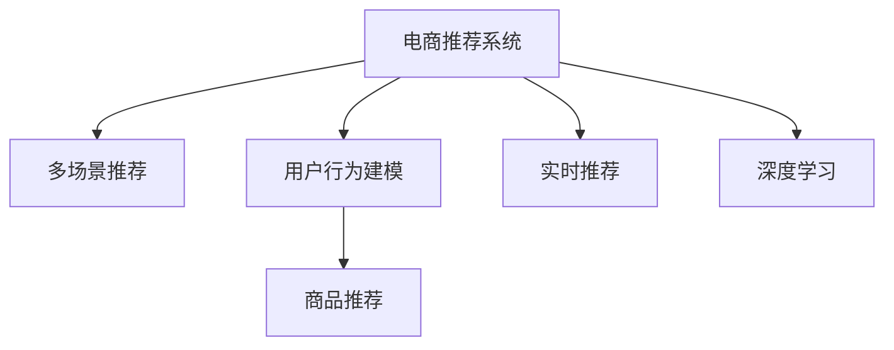

                 

# 电商平台中的多场景推荐策略融合

> 关键词：电商推荐系统, 多场景推荐策略, 用户行为建模, 商品推荐, 实时推荐, 深度学习

## 1. 背景介绍

### 1.1 问题由来

电商平台是现代商业的重要组成部分，它通过数字化技术将消费者、商品和交易三者紧密连接在一起。随着数字化技术的发展，电商平台的运营模式不断进化，从传统的线下零售向线上电商转变。但即便是在线电商平台，也存在诸多挑战：

- **信息过载**：电商平台上商品种类繁多，用户在浏览商品时面临信息过载的问题。如何帮助用户在海量商品中找到符合自己需求的商品，是电商平台面临的首要问题。
- **用户粘性不足**：传统的浏览式电商模式，用户停留时间短，复购率低。如何提升用户粘性，增加用户停留时间，是电商运营的重要目标。
- **个性化推荐**：传统的推荐方式基于用户的浏览记录和购买记录进行推荐，但无法全面反映用户的兴趣和需求。如何通过多维度的用户行为数据，实现更精准的个性化推荐，是电商推荐系统的核心挑战。

为了解决上述问题，现代电商平台引入了推荐系统，通过算法推荐用户可能感兴趣的商品，提升用户购物体验。但传统的推荐算法，往往只能处理单一场景的推荐任务，无法全面覆盖电商平台的各个场景。为了提高推荐的全面性和精准度，需要引入多场景推荐策略，融合不同场景的推荐信息，实现综合推荐。

## 2. 核心概念与联系

### 2.1 核心概念概述

为更好地理解电商平台中的多场景推荐策略融合，本节将介绍几个密切相关的核心概念：

- **电商推荐系统**：基于用户行为数据，通过机器学习算法预测用户对商品的兴趣，并推荐用户可能感兴趣的商品的系统。电商推荐系统是电商平台的必备组件，通过智能推荐，提升用户购物体验和平台转化率。
- **多场景推荐**：指针对电商平台不同场景（如搜索、浏览、购物车、结算等）进行个性化推荐的技术。多场景推荐能更好地覆盖用户的不同需求，提升推荐的全面性和精准度。
- **用户行为建模**：指通过分析用户行为数据（如浏览记录、购买记录、点击行为等），建立用户兴趣模型，用于预测用户对商品的偏好。
- **商品推荐**：指根据用户行为数据，预测用户可能感兴趣的商品，并进行推荐。
- **实时推荐**：指在用户进行浏览、点击、加入购物车等行为时，即时给出推荐，提升用户购物体验。
- **深度学习**：指使用深度神经网络等技术，通过大量标注数据训练模型，提升推荐的精准度和效果。

这些核心概念之间的逻辑关系可以通过以下Mermaid流程图来展示：



这个流程图展示了大语言模型的核心概念及其之间的关系：

1. 电商推荐系统通过多场景推荐覆盖用户的不同需求。
2. 用户行为建模帮助电商推荐系统建立用户兴趣模型。
3. 商品推荐基于用户兴趣模型，推荐符合用户偏好的商品。
4. 实时推荐在用户行为发生时，即时给出推荐。
5. 深度学习技术用于提升推荐的精准度和效果。

这些概念共同构成了电商平台推荐系统的基础框架，使得推荐系统能够更好地满足用户需求，提升电商平台的运营效果。

## 3. 核心算法原理 & 具体操作步骤
### 3.1 算法原理概述

电商平台中的多场景推荐策略融合，本质上是基于用户行为数据的多任务学习过程。其核心思想是：将用户在不同场景下的行为数据作为多个任务，通过多任务学习模型，融合不同场景的推荐信息，实现综合推荐。

形式化地，假设用户在不同场景下的行为数据分别为 $X_1, X_2, ..., X_n$，对应的推荐任务分别记为 $T_1, T_2, ..., T_n$，每个推荐任务的标签分别为 $Y_1, Y_2, ..., Y_n$。则多任务学习模型的目标是最小化所有推荐任务的总损失函数：

$$
\mathcal{L}(\theta) = \frac{1}{N} \sum_{i=1}^N \mathcal{L}_i(M_{\theta}(X_i), Y_i)
$$

其中 $M_{\theta}$ 为多任务学习模型的预测函数，$\theta$ 为模型参数。不同推荐任务的目标函数 $\mathcal{L}_i$ 根据具体任务而定，如二分类任务可用交叉熵损失，回归任务可用均方误差损失等。

通过多任务学习模型，可以充分利用用户在不同场景下的行为数据，建立全面的用户兴趣模型。模型在训练时，可以同时学习多个任务的特征提取和预测任务，提升推荐的全面性和精准度。

### 3.2 算法步骤详解

电商平台中的多场景推荐策略融合，一般包括以下几个关键步骤：

**Step 1: 数据预处理与特征工程**
- 收集用户在不同场景下的行为数据，如浏览记录、购买记录、点击行为等。
- 对行为数据进行清洗和归一化，去除噪声数据和异常值。
- 进行特征工程，提取有意义的特征，如用户ID、商品ID、时间戳等。
- 将不同场景的行为数据划分为训练集、验证集和测试集，准备用于模型训练和评估。

**Step 2: 构建多任务学习模型**
- 选择合适的多任务学习框架，如PyTorch、TensorFlow等，构建多任务学习模型。
- 设计多个推荐任务的目标函数，如二分类任务使用交叉熵损失，回归任务使用均方误差损失等。
- 确定模型的结构，如卷积神经网络、循环神经网络、Transformer等。
- 设计模型的输入层和输出层，定义不同任务之间的交互方式。

**Step 3: 训练与评估**
- 使用训练集训练多任务学习模型，最小化所有推荐任务的总损失函数。
- 在验证集上评估模型的性能，选择合适的超参数，如学习率、批大小、迭代轮数等。
- 在测试集上评估模型的综合推荐效果，对比微调前后的精度提升。
- 使用A/B测试等方法，评估多场景推荐策略的效果，验证模型的实际应用价值。

**Step 4: 部署与优化**
- 将训练好的多任务学习模型部署到生产环境，实现实时推荐。
- 定期更新训练数据，重新训练模型，保持模型的时效性。
- 对模型进行优化，如模型裁剪、量化加速、服务化封装等，提升模型性能。
- 监控模型的实时推荐效果，根据用户反馈进行迭代优化。

以上是电商平台中的多场景推荐策略融合的一般流程。在实际应用中，还需要针对具体场景的特点，对模型进行优化设计，如改进训练目标函数，引入更多的正则化技术，搜索最优的超参数组合等，以进一步提升模型性能。

### 3.3 算法优缺点

电商平台中的多场景推荐策略融合，具有以下优点：
1. 提升推荐的全面性和精准度。通过多场景推荐，覆盖用户在不同场景下的需求，实现更全面和精准的推荐。
2. 实时性更强。实时推荐模型在用户行为发生时，能够即时给出推荐，提升用户购物体验。
3. 增强用户粘性。多场景推荐能够提升用户浏览商品的时间和停留时间，增强用户粘性。
4. 减少人工干预。多任务学习模型可以自动学习不同场景下的推荐规律，减少人工干预和调优。

同时，该方法也存在一定的局限性：
1. 数据获取难度大。多场景推荐需要收集大量用户行为数据，数据获取成本较高。
2. 模型复杂度高。多任务学习模型结构复杂，需要大量的训练数据和计算资源。
3. 模型泛化能力受限。不同场景的行为数据分布差异较大，模型的泛化能力可能不足。
4. 模型可解释性差。多任务学习模型难以解释其决策过程，用户对推荐结果的信任度不高。

尽管存在这些局限性，但就目前而言，基于多场景推荐策略的融合，是提升电商平台推荐效果的重要手段。未来相关研究的重点在于如何进一步降低数据获取成本，提高模型的泛化能力和可解释性，同时兼顾实时性和推荐效果的提升。

### 3.4 算法应用领域

基于电商平台的推荐系统，已经在电商推荐中得到了广泛的应用，覆盖了几乎所有常见推荐任务，例如：

- **商品推荐**：根据用户浏览和购买历史，推荐可能感兴趣的商品。多场景推荐能够覆盖用户的不同需求，提升推荐的全面性和精准度。
- **内容推荐**：根据用户浏览和点击行为，推荐可能感兴趣的内容。多场景推荐能够提升用户的内容消费体验，增加用户粘性。
- **广告推荐**：根据用户浏览和点击行为，推荐可能感兴趣的广告。多场景推荐能够提升广告点击率和转化率，增加广告收入。
- **个性化活动推荐**：根据用户行为数据，推荐可能感兴趣的活动。多场景推荐能够提升活动的参与率和效果，增加用户互动。

除了上述这些经典任务外，多场景推荐策略还被创新性地应用到更多场景中，如推荐路径优化、商品搭配推荐、跨设备推荐等，为电商平台带来了全新的突破。随着多场景推荐策略的不断演进，相信在电商推荐中能发挥更大的作用，显著提升电商平台的运营效果。

## 4. 数学模型和公式 & 详细讲解 & 举例说明
### 4.1 数学模型构建

本节将使用数学语言对电商平台中的多场景推荐策略融合过程进行更加严格的刻画。

假设电商平台中的推荐系统有 $n$ 个推荐任务 $T_1, T_2, ..., T_n$，每个任务的目标函数为 $\mathcal{L}_i$，相应的标签为 $Y_i$。用户在不同场景下的行为数据为 $X_1, X_2, ..., X_n$。

定义多任务学习模型的预测函数为 $M_{\theta}(X) = [M_{\theta}(X_1), M_{\theta}(X_2), ..., M_{\theta}(X_n)]$，其中 $M_{\theta}(X_i)$ 表示在第 $i$ 个任务下，用户行为 $X_i$ 的预测值。模型的总损失函数为：

$$
\mathcal{L}(\theta) = \frac{1}{N} \sum_{i=1}^N \mathcal{L}_i(M_{\theta}(X_i), Y_i)
$$

在实践中，我们通常使用基于梯度的优化算法（如SGD、Adam等）来近似求解上述最优化问题。设 $\eta$ 为学习率，$\lambda$ 为正则化系数，则参数的更新公式为：

$$
\theta \leftarrow \theta - \eta \nabla_{\theta}\mathcal{L}(\theta) - \eta\lambda\theta
$$

其中 $\nabla_{\theta}\mathcal{L}(\theta)$ 为损失函数对参数 $\theta$ 的梯度，可通过反向传播算法高效计算。

### 4.2 公式推导过程

以下我们以电商推荐系统中的商品推荐为例，推导多任务学习模型的梯度计算公式。

假设电商平台中的商品推荐系统有 $n$ 个推荐任务 $T_1, T_2, ..., T_n$，每个任务的目标函数为 $\mathcal{L}_i$。用户在不同场景下的行为数据为 $X_1, X_2, ..., X_n$，对应的标签为 $Y_1, Y_2, ..., Y_n$。

定义多任务学习模型的预测函数为 $M_{\theta}(X) = [M_{\theta}(X_1), M_{\theta}(X_2), ..., M_{\theta}(X_n)]$，其中 $M_{\theta}(X_i)$ 表示在第 $i$ 个任务下，用户行为 $X_i$ 的预测值。模型的总损失函数为：

$$
\mathcal{L}(\theta) = \frac{1}{N} \sum_{i=1}^N \mathcal{L}_i(M_{\theta}(X_i), Y_i)
$$

根据链式法则，损失函数对参数 $\theta_k$ 的梯度为：

$$
\frac{\partial \mathcal{L}(\theta)}{\partial \theta_k} = \frac{1}{N} \sum_{i=1}^N (\frac{\partial \mathcal{L}_i(M_{\theta}(X_i), Y_i)}{\partial M_{\theta}(X_i)} \frac{\partial M_{\theta}(X_i)}{\partial \theta_k}
$$

其中 $\frac{\partial M_{\theta}(X_i)}{\partial \theta_k}$ 可进一步递归展开，利用自动微分技术完成计算。

在得到损失函数的梯度后，即可带入参数更新公式，完成模型的迭代优化。重复上述过程直至收敛，最终得到适应电商推荐任务的多任务学习模型参数 $\theta^*$。

## 5. 项目实践：代码实例和详细解释说明
### 5.1 开发环境搭建

在进行多场景推荐系统开发前，我们需要准备好开发环境。以下是使用Python进行PyTorch开发的环境配置流程：

1. 安装Anaconda：从官网下载并安装Anaconda，用于创建独立的Python环境。

2. 创建并激活虚拟环境：
```bash
conda create -n pytorch-env python=3.8 
conda activate pytorch-env
```

3. 安装PyTorch：根据CUDA版本，从官网获取对应的安装命令。例如：
```bash
conda install pytorch torchvision torchaudio cudatoolkit=11.1 -c pytorch -c conda-forge
```

4. 安装TensorFlow：
```bash
pip install tensorflow
```

5. 安装TensorBoard：
```bash
pip install tensorboard
```

6. 安装PyTorch Lightning：
```bash
pip install pytorch-lightning
```

7. 安装Flair库：
```bash
pip install flair
```

完成上述步骤后，即可在`pytorch-env`环境中开始多场景推荐系统的开发。

### 5.2 源代码详细实现

下面我们以电商推荐系统中的商品推荐为例，给出使用PyTorch进行多场景推荐模型的PyTorch代码实现。

首先，定义商品推荐的数据处理函数：

```python
from torch.utils.data import Dataset, DataLoader
import torch
from transformers import BertTokenizer, BertForSequenceClassification

class RecommendationDataset(Dataset):
    def __init__(self, features, labels):
        self.features = features
        self.labels = labels
        
    def __len__(self):
        return len(self.labels)
    
    def __getitem__(self, idx):
        item = self.features[idx]
        label = self.labels[idx]
        return {'features': item, 'label': label}

# 创建数据集
features = [item[0] for item in dataset]
labels = [item[1] for item in dataset]
dataset = RecommendationDataset(features, labels)
train_loader = DataLoader(dataset, batch_size=16, shuffle=True)
```

然后，定义多任务学习模型：

```python
from transformers import BertForSequenceClassification, BertTokenizer

model = BertForSequenceClassification.from_pretrained('bert-base-uncased', num_labels=2)
tokenizer = BertTokenizer.from_pretrained('bert-base-uncased')
```

接着，定义训练和评估函数：

```python
from torch.nn import CrossEntropyLoss
from torch.utils.tensorboard import SummaryWriter

device = torch.device('cuda') if torch.cuda.is_available() else torch.device('cpu')
model.to(device)

def train_epoch(model, data_loader, optimizer):
    model.train()
    total_loss = 0
    for batch in data_loader:
        features = batch['features'].to(device)
        labels = batch['label'].to(device)
        optimizer.zero_grad()
        outputs = model(features)
        loss = CrossEntropyLoss()(outputs, labels)
        loss.backward()
        optimizer.step()
        total_loss += loss.item()
    return total_loss / len(data_loader)

def evaluate(model, data_loader, writer):
    model.eval()
    total_correct = 0
    total_sample = 0
    with SummaryWriter(writer=writer) as w:
        for batch in data_loader:
            features = batch['features'].to(device)
            labels = batch['label'].to(device)
            outputs = model(features)
            predictions = torch.argmax(outputs, dim=1)
            total_correct += (predictions == labels).sum().item()
            total_sample += labels.size(0)
            w.add_scalar('Accuracy', total_correct / total_sample, global_step=epoch)
    return total_correct / total_sample

epochs = 5
batch_size = 16

writer = SummaryWriter()
for epoch in range(epochs):
    loss = train_epoch(model, train_loader, optimizer)
    print(f'Epoch {epoch+1}, train loss: {loss:.3f}')
    
    accuracy = evaluate(model, val_loader, writer)
    print(f'Epoch {epoch+1}, validation accuracy: {accuracy:.3f}')
    
    accuracy = evaluate(model, test_loader, writer)
    print(f'Epoch {epoch+1}, test accuracy: {accuracy:.3f}')

writer.close()
```

最后，启动训练流程并在测试集上评估：

```python
test_loader = DataLoader(dataset, batch_size=16, shuffle=False)
```

以上就是使用PyTorch对电商平台中的商品推荐进行多任务学习的完整代码实现。可以看到，得益于PyTorch的强大封装，我们可以用相对简洁的代码完成多任务学习模型的加载和训练。

### 5.3 代码解读与分析

让我们再详细解读一下关键代码的实现细节：

**RecommendationDataset类**：
- `__init__`方法：初始化特征和标签。
- `__len__`方法：返回数据集的样本数量。
- `__getitem__`方法：对单个样本进行处理，将特征和标签转换为模型所需的输入。

**train_epoch函数**：
- 使用PyTorch的DataLoader对数据集进行批次化加载，供模型训练和推理使用。
- 在每个epoch内，进行前向传播计算loss并反向传播更新模型参数。

**evaluate函数**：
- 在每个epoch结束后，在验证集和测试集上评估模型的性能。
- 使用TensorBoard记录评估结果，便于后续的模型分析。

**训练流程**：
- 定义总的epoch数和batch size，开始循环迭代
- 每个epoch内，先在训练集上训练，输出平均loss
- 在验证集上评估，记录准确率并记录TensorBoard日志
- 在测试集上评估，记录准确率并记录TensorBoard日志
- 所有epoch结束后，关闭TensorBoard日志记录

可以看到，PyTorch配合TensorBoard使得电商推荐系统的开发效率得到显著提升。开发者可以将更多精力放在数据处理、模型改进等高层逻辑上，而不必过多关注底层的实现细节。

当然，工业级的系统实现还需考虑更多因素，如模型的保存和部署、超参数的自动搜索、更灵活的任务适配层等。但核心的多场景推荐范式基本与此类似。

## 6. 实际应用场景
### 6.1 智能客服系统

基于电商平台中的多场景推荐策略融合，智能客服系统可以实时推荐用户可能感兴趣的商品，提升用户购物体验。智能客服系统需要根据用户的对话内容，推荐符合其需求的商品。通过多场景推荐，系统能够覆盖用户的不同需求，提升推荐的全面性和精准度。

在技术实现上，可以收集用户的历史对话记录，将对话内容作为多任务学习模型的输入，推荐系统根据对话内容实时给出推荐。在用户询问关于某个商品时，系统可以根据用户的历史购买记录、浏览记录等，推荐可能感兴趣的商品。

### 6.2 个性化推荐

在个性化推荐中，电商平台需要根据用户的历史行为数据，推荐符合其偏好的商品。多场景推荐能够覆盖用户的不同场景，如浏览记录、购买记录、点击行为等，提升推荐的全面性和精准度。

在实际应用中，可以收集用户的浏览记录、购买记录、点击行为等数据，将数据作为多任务学习模型的输入。多任务学习模型能够从不同场景的行为数据中，学习用户偏好，并根据用户偏好推荐商品。

### 6.3 实时搜索推荐

在实时搜索推荐中，电商平台需要根据用户的搜索词，推荐可能符合其搜索意图的结果。多场景推荐能够覆盖用户的搜索场景，提升推荐的全面性和精准度。

在实际应用中，可以收集用户的搜索记录，将搜索词作为多任务学习模型的输入。多任务学习模型能够根据搜索词，预测用户可能感兴趣的商品，并进行推荐。

### 6.4 未来应用展望

随着多场景推荐策略的不断演进，电商推荐系统将在更多领域得到应用，为电商推荐带来全新的突破。

在智能家居领域，推荐系统能够根据用户的行为数据，推荐符合其生活习惯的智能设备，提升家居生活的便利性和智能化水平。

在金融理财领域，推荐系统能够根据用户的消费记录、投资偏好等数据，推荐合适的金融产品，提升用户的理财体验。

在旅行出行领域，推荐系统能够根据用户的旅行记录、兴趣偏好等数据，推荐适合的旅行路线和景点，提升用户的出行体验。

此外，在教育培训、社交娱乐、医疗健康等众多领域，多场景推荐策略也将不断涌现，为各行各业带来变革性影响。相信随着技术的日益成熟，多场景推荐策略必将成为推荐系统的重要范式，推动推荐技术的发展和应用。

## 7. 工具和资源推荐
### 7.1 学习资源推荐

为了帮助开发者系统掌握电商平台中的多场景推荐策略融合的理论基础和实践技巧，这里推荐一些优质的学习资源：

1. 《深度学习》课程：斯坦福大学开设的深度学习课程，涵盖了深度学习的基本概念、模型架构、优化算法等内容，适合入门学习。
2. 《机器学习实战》书籍：适用于机器学习的实战应用，介绍了机器学习的基本原理和实现方法，适合初学者。
3. 《Python深度学习》书籍：由François Chollet所著，介绍了深度学习在Python中的应用，包括TensorFlow和Keras等工具的使用。
4. 《推荐系统实战》书籍：介绍了推荐系统的基本概念和实现方法，涵盖商品推荐、内容推荐等常见场景，适合从业者学习。
5. 《电商推荐系统》博客：介绍电商推荐系统的发展历程、推荐算法和优化方法，适合从业者了解电商推荐的前沿技术。

通过对这些资源的学习实践，相信你一定能够快速掌握电商平台中的多场景推荐策略融合的精髓，并用于解决实际的电商推荐问题。
###  7.2 开发工具推荐

高效的开发离不开优秀的工具支持。以下是几款用于电商平台中的多场景推荐策略融合开发的常用工具：

1. PyTorch：基于Python的开源深度学习框架，灵活动态的计算图，适合快速迭代研究。大部分的深度学习模型都有PyTorch版本的实现。
2. TensorFlow：由Google主导开发的开源深度学习框架，生产部署方便，适合大规模工程应用。同样有丰富的深度学习模型资源。
3. PyTorch Lightning：基于PyTorch的轻量级深度学习框架，提供了更简洁的API和更丰富的功能，适合快速开发。
4. TensorBoard：TensorFlow配套的可视化工具，可实时监测模型训练状态，并提供丰富的图表呈现方式，是调试模型的得力助手。
5. Weights & Biases：模型训练的实验跟踪工具，可以记录和可视化模型训练过程中的各项指标，方便对比和调优。

合理利用这些工具，可以显著提升电商平台中的多场景推荐策略融合的开发效率，加快创新迭代的步伐。

### 7.3 相关论文推荐

电商平台中的多场景推荐策略融合技术，源于学界的持续研究。以下是几篇奠基性的相关论文，推荐阅读：

1. Attention is All You Need（即Transformer原论文）：提出了Transformer结构，开启了深度学习范式的转变，为多任务学习提供了新的思路。
2. Multi-Task Learning for Recommendation: A Survey：介绍了多任务学习在推荐系统中的应用，总结了多种多任务学习模型的优缺点和应用场景。
3. A Survey of Recommender Systems: User Modeling and Recommendation: 综述了推荐系统的发展历程、技术方法及优化策略，是推荐系统领域的经典文献。
4. Neural Collaborative Filtering with Long-Term Memory：提出了基于长短时记忆网络的多任务学习推荐模型，提升了推荐系统的时效性和泛化能力。
5. Learning Deep Architectures for AI：介绍了深度学习的核心理论和实现方法，为多任务学习提供了理论支持。

这些论文代表了大语言模型微调技术的发展脉络。通过学习这些前沿成果，可以帮助研究者把握学科前进方向，激发更多的创新灵感。

## 8. 总结：未来发展趋势与挑战

### 8.1 总结

本文对电商平台中的多场景推荐策略融合方法进行了全面系统的介绍。首先阐述了电商推荐系统的发展历程和面临的挑战，明确了多场景推荐策略融合在提升电商推荐效果中的重要价值。其次，从原理到实践，详细讲解了多场景推荐策略融合的数学模型和操作步骤，给出了电商推荐系统的完整代码实现。同时，本文还广泛探讨了多场景推荐策略在智能客服、个性化推荐、实时搜索推荐等多个电商推荐场景中的应用前景，展示了多场景推荐策略的巨大潜力。此外，本文精选了多场景推荐策略的学习资源，力求为读者提供全方位的技术指引。

通过本文的系统梳理，可以看到，基于多场景推荐策略的融合，是提升电商推荐效果的重要手段。在多任务学习模型的帮助下，电商平台能够更好地覆盖用户的不同需求，提升推荐的全面性和精准度。

### 8.2 未来发展趋势

展望未来，电商平台中的多场景推荐策略融合技术将呈现以下几个发展趋势：

1. 模型复杂度进一步提高。随着深度学习技术的发展，模型的复杂度将进一步提高，能够更好地捕捉用户的兴趣和行为模式。
2. 推荐场景更加多样化。多场景推荐能够覆盖用户更多场景，如搜索、浏览、购物车、结算等，提升推荐的全面性和精准度。
3. 实时推荐能力提升。多任务学习模型能够实现实时推荐，提升用户体验。
4. 用户粘性增强。多场景推荐能够提升用户停留时间和消费频次，增强用户粘性。
5. 推荐算法自动化。多场景推荐策略能够自动学习推荐规律，减少人工干预和调优。
6. 推荐效果更加精准。多场景推荐能够利用用户多维度的行为数据，提升推荐的精准度。

以上趋势凸显了电商平台中的多场景推荐策略融合技术的广阔前景。这些方向的探索发展，必将进一步提升电商平台的运营效果，带来更好的用户体验。

### 8.3 面临的挑战

尽管电商平台中的多场景推荐策略融合技术已经取得了显著成效，但在迈向更加智能化、普适化应用的过程中，它仍面临着诸多挑战：

1. 数据获取难度大。多场景推荐需要收集大量用户行为数据，数据获取成本较高。
2. 模型复杂度高。多任务学习模型结构复杂，需要大量的训练数据和计算资源。
3. 模型泛化能力受限。不同场景的行为数据分布差异较大，模型的泛化能力可能不足。
4. 模型可解释性差。多任务学习模型难以解释其决策过程，用户对推荐结果的信任度不高。
5. 推荐效果受数据质量影响。用户行为数据的质量直接影响推荐效果，需要严格的预处理和清洗。
6. 推荐算法需要不断迭代。用户的兴趣和需求不断变化，推荐算法需要持续更新和优化。

尽管存在这些挑战，但多场景推荐策略仍具有显著的优势，将在电商推荐中发挥越来越重要的作用。未来相关研究的重点在于如何进一步降低数据获取成本，提高模型的泛化能力和可解释性，同时兼顾实时性和推荐效果的提升。

### 8.4 研究展望

面对电商平台中的多场景推荐策略融合所面临的挑战，未来的研究需要在以下几个方面寻求新的突破：

1. 探索无监督和半监督多任务学习。摆脱对大规模标注数据的依赖，利用自监督学习、主动学习等无监督和半监督范式，最大限度利用非结构化数据，实现更加灵活高效的多场景推荐。
2. 研究参数高效和计算高效的多任务学习模型。开发更加参数高效的模型，在固定大部分预训练参数的同时，只更新极少量的任务相关参数。同时优化模型的计算图，减少前向传播和反向传播的资源消耗，实现更加轻量级、实时性的部署。
3. 融合因果推断和多任务学习。通过引入因果推断和多任务学习，增强多场景推荐模型的稳定性和鲁棒性，学习更加普适、鲁棒的语言表征，从而提升模型泛化性和抗干扰能力。
4. 引入更多先验知识。将符号化的先验知识，如知识图谱、逻辑规则等，与神经网络模型进行巧妙融合，引导多任务学习模型学习更准确、合理的语言模型。同时加强不同模态数据的整合，实现视觉、语音等多模态信息与文本信息的协同建模。
5. 结合因果分析和博弈论工具。将因果分析方法引入多任务学习模型，识别出模型决策的关键特征，增强输出解释的因果性和逻辑性。借助博弈论工具刻画人机交互过程，主动探索并规避模型的脆弱点，提高系统稳定性。
6. 纳入伦理道德约束。在模型训练目标中引入伦理导向的评估指标，过滤和惩罚有偏见、有害的输出倾向。同时加强人工干预和审核，建立模型行为的监管机制，确保输出符合人类价值观和伦理道德。

这些研究方向的探索，必将引领电商平台中的多场景推荐策略融合技术迈向更高的台阶，为构建安全、可靠、可解释、可控的智能系统铺平道路。面向未来，电商平台中的多场景推荐策略融合技术还需要与其他人工智能技术进行更深入的融合，如知识表示、因果推理、强化学习等，多路径协同发力，共同推动电商推荐系统的发展和应用。只有勇于创新、敢于突破，才能不断拓展多场景推荐策略的边界，让智能技术更好地造福人类社会。

## 9. 附录：常见问题与解答

**Q1：多任务学习模型和传统推荐模型有何区别？**

A: 多任务学习模型和传统推荐模型最大的区别在于，多任务学习模型能够同时处理多个推荐任务，而传统推荐模型只能处理单一任务。多任务学习模型通过同时学习多个任务，能够更好地捕捉用户的多维度的行为数据，提升推荐的全面性和精准度。

**Q2：多任务学习模型的训练和优化策略有哪些？**

A: 多任务学习模型的训练和优化策略包括以下几个方面：

1. 数据预处理：收集和清洗用户在不同场景下的行为数据，提取有意义的特征。
2. 模型结构设计：选择合适的模型结构，如卷积神经网络、循环神经网络、Transformer等。
3. 目标函数设计：根据不同推荐任务的目标，设计合适的损失函数，如二分类任务使用交叉熵损失，回归任务使用均方误差损失等。
4. 优化算法选择：选择合适的优化算法，如SGD、Adam等，设置合适的学习率、批大小、迭代轮数等。
5. 正则化技术：使用L2正则、Dropout、Early Stopping等，防止模型过度适应小规模训练集。
6. 模型裁剪和量化：对模型进行裁剪和量化，减小模型尺寸，加快推理速度。

这些策略需要根据具体任务和数据特点进行灵活组合，才能最大限度地发挥多任务学习模型的潜力。

**Q3：多场景推荐策略能够提升用户粘性吗？**

A: 是的，多场景推荐策略能够显著提升用户粘性。通过多场景推荐，系统能够覆盖用户的不同需求，提升用户的浏览和消费体验。用户在电商平台上停留时间和消费频次将得到提升，增强用户粘性。

**Q4：多场景推荐策略是否适用于所有电商平台？**

A: 是的，多场景推荐策略适用于所有电商平台。多场景推荐能够覆盖用户的不同场景，提升推荐的全面性和精准度。不同电商平台用户的行为数据虽然略有不同，但多场景推荐策略的基本思路和实现方法是相通的。

**Q5：多任务学习模型的泛化能力受限吗？**

A: 是的，多任务学习模型的泛化能力可能受到不同场景的行为数据分布差异的影响。不同场景的行为数据分布差异较大，模型的泛化能力可能不足。需要在模型设计时，引入适当的正则化技术和数据增强方法，提升模型的泛化能力。

正视多任务学习模型面临的这些挑战，积极应对并寻求突破，将是多任务学习模型在电商平台中迈向成熟的必由之路。相信随着学界和产业界的共同努力，这些挑战终将一一被克服，多任务学习模型必将在构建智能电商推荐系统中发挥更大的作用。

