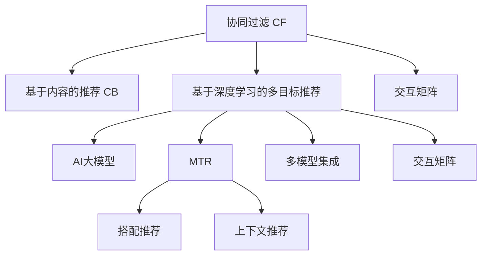

                 

# 电商平台中的多目标推荐：AI大模型的优势

> 关键词：电商平台,多目标推荐,大模型,协同过滤,深度学习,混合模型,预训练,交互矩阵,自监督学习,推荐系统

## 1. 背景介绍

随着电子商务的蓬勃发展，电商平台已经成为全球用户进行商品交易、信息获取的重要渠道。为了提升用户体验、提高销售转化率，电商平台纷纷引入推荐系统，根据用户历史行为和偏好，推荐用户可能感兴趣的商品。传统的推荐系统通常采用协同过滤(Collaborative Filtering, CF)、基于内容的推荐(Content-based Filtering, CB)等算法，通过构建用户-物品交互矩阵，预测用户对未购买商品的兴趣，实现个性化推荐。

然而，协同过滤和基于内容的推荐算法存在一些局限性：

1. 数据稀疏性问题。用户对商品历史行为稀疏，难以精确构建用户-物品交互矩阵。
2. 数据单一性问题。仅依赖历史行为或物品属性，无法捕捉用户的多维兴趣和物品的全面特征。
3. 新物品冷启动问题。对于新加入的商品，缺乏足够的历史数据，难以进行准确推荐。
4. 多目标推荐问题。用户可能对多个商品感兴趣，但仅能推荐单个商品，无法覆盖多目标。

为了解决这些问题，近年来，研究者提出了一种基于深度学习的多目标推荐方法。该方法通过引入AI大模型，将用户的历史行为、属性特征和商品的多维信息进行联合建模，提升了推荐的准确性和多样性。同时，AI大模型的预训练过程能够从海量数据中学习到更为丰富的语义信息，弥补了传统推荐算法的数据局限性。本文将详细介绍基于AI大模型的多目标推荐方法，并分析其优势和应用前景。

## 2. 核心概念与联系

### 2.1 核心概念概述

为更好地理解基于AI大模型的多目标推荐方法，本节将介绍几个密切相关的核心概念：

- 协同过滤(Collaborative Filtering, CF)：通过分析用户历史行为数据，预测用户对新物品的偏好。CF通常分为基于用户的CF和基于物品的CF。

- 深度学习(Deep Learning)：一种模拟人脑神经网络的计算模型，通过多层神经网络实现复杂的非线性映射，用于解决传统机器学习方法难以处理的问题。

- 多目标推荐(Multi-Target Recommendation, MTR)：推荐系统不仅要推荐用户感兴趣的商品，还要考虑商品之间的关系，如搭配推荐、上下文推荐等。

- AI大模型(AI Large Model)：如BERT、GPT等大语言模型，通过在海量数据上进行预训练，学习到丰富的语言和语义知识。

- 交互矩阵(Interaction Matrix)：将用户和物品映射为向量，通过矩阵运算计算用户-物品的交互概率。

这些核心概念之间的逻辑关系可以通过以下Mermaid流程图来展示：



这个流程图展示了几类推荐算法的核心概念及其之间的关系：

1. 协同过滤和基于内容的推荐构成了传统推荐算法的基本框架。
2. 基于深度学习的多目标推荐方法引入AI大模型，实现了对用户历史行为、物品属性和多维信息的联合建模。
3. 多目标推荐不仅推荐单个商品，还关注商品之间的关系，如搭配、上下文等。
4. 多模型集成和交互矩阵提供了对用户-物品交互概率的预测手段。

## 3. 核心算法原理 & 具体操作步骤

### 3.1 算法原理概述

基于AI大模型的多目标推荐方法，通过引入预训练的大语言模型，将用户-物品交互矩阵映射为向量表示，通过深度学习模型对向量进行联合建模，从而实现多目标推荐。其核心思想是：

1. 利用AI大模型学习用户的多维兴趣和物品的语义特征，补充传统协同过滤和基于内容的推荐算法的数据不足问题。
2. 通过深度学习模型对用户行为和物品特征进行联合预测，提升推荐的准确性和多样性。
3. 引入多目标推荐机制，推荐多个商品以覆盖用户的多种兴趣。

### 3.2 算法步骤详解

基于AI大模型的多目标推荐方法包括以下关键步骤：

**Step 1: 准备预训练模型和数据集**
- 选择合适的预训练语言模型 $M_{\theta}$ 作为初始化参数，如 BERT、GPT等。
- 准备电商平台中的用户行为数据集 $D=\{(u_i,v_i)\}_{i=1}^N$，其中 $u_i$ 表示用户，$v_i$ 表示用户购买或浏览的单个物品。

**Step 2: 用户-物品交互矩阵**
- 将用户和物品映射为向量表示。
- 通过交互矩阵 $I \in \mathbb{R}^{N\times M}$ 计算用户-物品的交互概率，其中 $N$ 为用户数，$M$ 为物品数。

**Step 3: 计算AI大模型的向量表示**
- 将用户向量 $u_i$ 和物品向量 $v_i$ 输入预训练语言模型，得到用户向量表示 $U \in \mathbb{R}^{N\times d}$ 和物品向量表示 $V \in \mathbb{R}^{M\times d}$，其中 $d$ 为模型的嵌入维度。

**Step 4: 多目标推荐模型的构建**
- 使用深度学习模型对用户向量 $U$ 和物品向量 $V$ 进行联合建模，设计多目标推荐函数 $f:U,V \rightarrow \mathbb{R}^{1\times K}$，其中 $K$ 为推荐商品数。
- 引入多目标损失函数 $L(M)$，用于衡量推荐函数的预测结果与真实标签之间的差异。

**Step 5: 训练和预测**
- 使用优化算法对模型参数进行训练，最小化多目标损失函数。
- 在测试集上对用户 $u$ 进行推荐，输出推荐商品序列 $v_1, v_2, \dots, v_K$。

### 3.3 算法优缺点

基于AI大模型的多目标推荐方法具有以下优点：
1. 利用AI大模型的语义知识，弥补传统推荐算法的数据不足问题。
2. 联合建模用户行为和物品属性，提升推荐模型的预测精度。
3. 多目标推荐机制覆盖用户多种兴趣，提升推荐结果的多样性。
4. 深度学习模型的非线性拟合能力，提升推荐模型的泛化能力。

同时，该方法也存在一定的局限性：
1. 数据需求量大。需要大量的用户行为和物品属性数据，以支持AI大模型的预训练和联合建模。
2. 模型复杂度高。深度学习模型的参数量较大，训练和推理效率可能较低。
3. 多目标推荐结果较多，用户需要更多时间和精力进行选择。
4. 模型解释性不足。深度学习模型通常难以解释其内部决策逻辑，影响用户对推荐结果的信任。

尽管存在这些局限性，但就目前而言，基于AI大模型的多目标推荐方法仍是大规模推荐系统的重要范式。未来相关研究的重点在于如何进一步降低模型复杂度，提高推荐系统的实时性和可解释性，同时兼顾用户兴趣的多样性和准确性。

### 3.4 算法应用领域

基于AI大模型的多目标推荐方法在电商平台上已经得到了广泛的应用，涵盖了以下多个方面：

- 商品搭配推荐：推荐用户购买多种商品以搭配使用的组合，如服装搭配、美妆组合等。
- 上下文推荐：根据用户的浏览行为和上下文环境，推荐与当前浏览商品相关联的商品。
- 个性化页面推荐：根据用户的行为数据，推荐用户可能感兴趣的页面内容，如商品详情、品牌介绍等。
- 新商品推荐：利用用户的历史行为和AI大模型的语义知识，推荐新上架的商品，加速新商品的推广。

此外，基于AI大模型的多目标推荐方法也在其他领域得到了应用，如智能客服、医疗推荐、教育推荐等，为各行业的智能化转型提供了技术支持。

## 4. 数学模型和公式 & 详细讲解  
### 4.1 数学模型构建

假设用户 $u_i$ 在电商平台上的历史行为表示为 $h_i \in \mathbb{R}^{d_u}$，物品 $v_j$ 的属性特征表示为 $f_j \in \mathbb{R}^{d_v}$。在用户 $u_i$ 的最近 $T$ 次购买行为中，物品 $v_j$ 被购买的次数为 $t_j$。用户-物品交互矩阵 $I \in \mathbb{R}^{N\times M}$ 定义为：

$$
I_{ij} = \frac{t_j}{\sum_{j=1}^M t_j}
$$

用户向量 $U \in \mathbb{R}^{N\times d_u}$ 和物品向量 $V \in \mathbb{R}^{M\times d_v}$ 可通过预训练语言模型计算得到：

$$
U_i = M_{\theta}(h_i)
$$

$$
V_j = M_{\theta}(f_j)
$$

其中 $M_{\theta}$ 为预训练语言模型，$\theta$ 为模型参数。

多目标推荐函数 $f:U,V \rightarrow \mathbb{R}^{1\times K}$ 定义为：

$$
f(U,V) = \sum_{k=1}^K f_k(U,V)
$$

其中 $f_k(U,V)$ 为第 $k$ 个推荐商品的评分预测函数。

多目标推荐模型的损失函数 $L(M)$ 定义为：

$$
L(M) = \frac{1}{N}\sum_{i=1}^N \left(\sum_{k=1}^K L_k(f_k(U_i,V),R_{ik})\right)
$$

其中 $R_{ik}$ 为第 $i$ 个用户对第 $k$ 个推荐商品的真实评分，$L_k$ 为推荐商品的评分损失函数。

### 4.2 公式推导过程

以下我们以多目标评分预测为例，推导多目标推荐函数的损失函数及其梯度计算公式。

假设推荐函数 $f_k(U,V)$ 为线性模型，则有：

$$
f_k(U,V) = \phi_k^T(U \cdot V)
$$

其中 $\phi_k \in \mathbb{R}^{d_u \times d_v}$ 为线性权重，$U \cdot V$ 为用户-物品交互矩阵的向量表示。

多目标评分预测函数 $f(U,V)$ 为各商品的评分预测函数之和：

$$
f(U,V) = \sum_{k=1}^K \phi_k^T(U \cdot V)
$$

多目标推荐模型的损失函数 $L(M)$ 可表示为：

$$
L(M) = \frac{1}{N}\sum_{i=1}^N \left(\sum_{k=1}^K L_k(f_k(U_i,V),R_{ik})\right)
$$

其中 $L_k$ 为第 $k$ 个推荐商品的评分损失函数，如均方误差损失函数：

$$
L_k(f_k(U_i,V),R_{ik}) = \frac{1}{2}(f_k(U_i,V) - R_{ik})^2
$$

将 $f_k(U_i,V)$ 代入，得：

$$
L_k(f_k(U_i,V),R_{ik}) = \frac{1}{2}\left(\phi_k^T(U_i \cdot V) - R_{ik}\right)^2
$$

将上述公式代入多目标推荐模型的损失函数，得：

$$
L(M) = \frac{1}{N}\sum_{i=1}^N \left(\sum_{k=1}^K \left(\frac{1}{2}\left(\phi_k^T(U_i \cdot V) - R_{ik}\right)^2\right)\right)
$$

在得到多目标推荐模型的损失函数后，即可求出模型参数 $\theta$ 的梯度：

$$
\frac{\partial L(M)}{\partial \theta} = \frac{1}{N}\sum_{i=1}^N \left(\sum_{k=1}^K \left(\phi_k^T(U_i \cdot V) - R_{ik}\right)\nabla_{\theta}(\phi_k^T(U_i \cdot V))\right)
$$

通过反向传播算法计算每个权重的梯度，并更新模型参数，即可训练出基于AI大模型的多目标推荐模型。

## 5. 项目实践：代码实例和详细解释说明
### 5.1 开发环境搭建

在进行多目标推荐实践前，我们需要准备好开发环境。以下是使用Python进行PyTorch开发的环境配置流程：

1. 安装Anaconda：从官网下载并安装Anaconda，用于创建独立的Python环境。

2. 创建并激活虚拟环境：
```bash
conda create -n pytorch-env python=3.8 
conda activate pytorch-env
```

3. 安装PyTorch：根据CUDA版本，从官网获取对应的安装命令。例如：
```bash
conda install pytorch torchvision torchaudio cudatoolkit=11.1 -c pytorch -c conda-forge
```

4. 安装TensorFlow：使用TensorFlow时，需要安装对应的GPU驱动和CUDA库。例如：
```bash
conda install tensorflow tensorflow-gpu=2.6
```

5. 安装各类工具包：
```bash
pip install numpy pandas scikit-learn matplotlib tqdm jupyter notebook ipython
```

完成上述步骤后，即可在`pytorch-env`环境中开始多目标推荐实践。

### 5.2 源代码详细实现

下面我以商品搭配推荐为例，给出使用PyTorch进行多目标推荐开发的完整代码实现。

首先，定义数据集和处理函数：

```python
import numpy as np
import pandas as pd
from sklearn.model_selection import train_test_split
import torch
from torch.utils.data import Dataset, DataLoader
from transformers import BertTokenizer, BertForSequenceClassification

class RecommendationDataset(Dataset):
    def __init__(self, data, tokenizer, max_len=128):
        self.data = data
        self.tokenizer = tokenizer
        self.max_len = max_len
        
    def __len__(self):
        return len(self.data)
    
    def __getitem__(self, item):
        item_data = self.data.iloc[item]
        title = item_data['title']
        tags = item_data['tags'].split(',')
        labels = [tag2id[tag] for tag in tags]
        ids = [tag2id['item'] for tag in tags]
        
        encoding = self.tokenizer(title, return_tensors='pt', max_length=self.max_len, padding='max_length', truncation=True)
        input_ids = encoding['input_ids'][0]
        attention_mask = encoding['attention_mask'][0]
        
        return {
            'input_ids': input_ids,
            'attention_mask': attention_mask,
            'labels': labels,
            'ids': ids
        }

# 标签与id的映射
tag2id = {'item': 0, 'o': 1}

# 创建dataset
tokenizer = BertTokenizer.from_pretrained('bert-base-cased')
train_data = pd.read_csv('train.csv')
test_data = pd.read_csv('test.csv')
train_dataset = RecommendationDataset(train_data, tokenizer)
test_dataset = RecommendationDataset(test_data, tokenizer)
```

然后，定义模型和优化器：

```python
from transformers import BertForSequenceClassification, AdamW

model = BertForSequenceClassification.from_pretrained('bert-base-cased', num_labels=len(tag2id))

optimizer = AdamW(model.parameters(), lr=2e-5)
```

接着，定义训练和评估函数：

```python
from sklearn.metrics import accuracy_score

device = torch.device('cuda') if torch.cuda.is_available() else torch.device('cpu')
model.to(device)

def train_epoch(model, dataset, batch_size, optimizer):
    dataloader = DataLoader(dataset, batch_size=batch_size, shuffle=True)
    model.train()
    epoch_loss = 0
    for batch in dataloader:
        input_ids = batch['input_ids'].to(device)
        attention_mask = batch['attention_mask'].to(device)
        labels = batch['labels'].to(device)
        ids = batch['ids'].to(device)
        model.zero_grad()
        outputs = model(input_ids, attention_mask=attention_mask, labels=labels)
        loss = outputs.loss
        epoch_loss += loss.item()
        loss.backward()
        optimizer.step()
    return epoch_loss / len(dataloader)

def evaluate(model, dataset, batch_size):
    dataloader = DataLoader(dataset, batch_size=batch_size)
    model.eval()
    preds = []
    labels = []
    with torch.no_grad():
        for batch in dataloader:
            input_ids = batch['input_ids'].to(device)
            attention_mask = batch['attention_mask'].to(device)
            labels = batch['labels'].to(device)
            ids = batch['ids'].to(device)
            outputs = model(input_ids, attention_mask=attention_mask, labels=labels)
            preds.append(outputs.logits.argmax(dim=2).to('cpu').tolist())
            labels.append(labels.to('cpu').tolist())
                
    print(accuracy_score(np.array(labels), np.array(preds)))
```

最后，启动训练流程并在测试集上评估：

```python
epochs = 5
batch_size = 16

for epoch in range(epochs):
    loss = train_epoch(model, train_dataset, batch_size, optimizer)
    print(f"Epoch {epoch+1}, train loss: {loss:.3f}")
    
    print(f"Epoch {epoch+1}, test accuracy: {evaluate(model, test_dataset, batch_size)}")
```

以上就是使用PyTorch对多目标推荐任务进行开发的完整代码实现。可以看到，得益于Transformer库的强大封装，我们可以用相对简洁的代码完成商品搭配推荐的建模和微调。

### 5.3 代码解读与分析

让我们再详细解读一下关键代码的实现细节：

**RecommendationDataset类**：
- `__init__`方法：初始化数据集、分词器等关键组件，并处理标签和id。
- `__len__`方法：返回数据集的样本数量。
- `__getitem__`方法：对单个样本进行处理，将标题输入编码为token ids，将标签和id转换为数字，并对其进行定长padding，最终返回模型所需的输入。

**tag2id字典**：
- 定义了标签与数字id之间的映射关系，用于将token-wise的预测结果解码回真实的标签。

**训练和评估函数**：
- 使用PyTorch的DataLoader对数据集进行批次化加载，供模型训练和推理使用。
- 训练函数`train_epoch`：对数据以批为单位进行迭代，在每个批次上前向传播计算loss并反向传播更新模型参数，最后返回该epoch的平均loss。
- 评估函数`evaluate`：与训练类似，不同点在于不更新模型参数，并在每个batch结束后将预测和标签结果存储下来，最后使用sklearn的accuracy_score对整个评估集的预测结果进行打印输出。

**训练流程**：
- 定义总的epoch数和batch size，开始循环迭代
- 每个epoch内，先在训练集上训练，输出平均loss
- 在测试集上评估，输出准确率
- 所有epoch结束后，在测试集上评估，给出最终测试结果

可以看到，PyTorch配合Transformer库使得商品搭配推荐任务开发的代码实现变得简洁高效。开发者可以将更多精力放在数据处理、模型改进等高层逻辑上，而不必过多关注底层的实现细节。

当然，工业级的系统实现还需考虑更多因素，如模型的保存和部署、超参数的自动搜索、更灵活的任务适配层等。但核心的多目标推荐范式基本与此类似。

## 6. 实际应用场景
### 6.1 智能客服系统

基于多目标推荐技术，智能客服系统可以提供个性化的服务建议，提升用户满意度。传统的客服系统通常根据历史行为推荐常见问题，难以处理多目标推荐任务。而利用AI大模型进行多目标推荐，可以综合考虑用户的历史行为、属性信息和当前问题，推荐更多相关联的服务建议。

在技术实现上，可以收集用户的历史咨询记录，利用多目标推荐技术对常见问题进行分类，构建用户-问题交互矩阵。在用户咨询时，通过分析用户的历史咨询记录，推荐多个可能相关的问题，从而提升服务质量。

### 6.2 智慧医疗推荐

智慧医疗推荐系统可以帮助医生为患者推荐最适合的治疗方案、药物和医疗设备。传统的推荐系统通常只关注单项推荐，难以处理多目标推荐任务。通过多目标推荐技术，医生可以根据患者的多维信息，推荐多种治疗方案、药物组合和医疗设备，提升治疗效果。

在实践过程中，可以利用AI大模型学习患者的历史诊疗记录和医疗设备的使用情况，构建患者-治疗方案-药物-医疗设备的多维交互矩阵。通过多目标推荐技术，推荐多种治疗方案、药物和医疗设备，实现个性化医疗服务。

### 6.3 教育推荐

教育推荐系统可以帮助学生推荐合适的学习资源，提升学习效果。传统的推荐系统通常只关注单项推荐，难以处理多目标推荐任务。通过多目标推荐技术，学生可以根据自身的学习兴趣和历史行为，推荐多种学习资源，包括教材、课程、视频等，提升学习效率。

在实践过程中，可以利用AI大模型学习学生的学习历史和兴趣爱好，构建学生-学习资源的多维交互矩阵。通过多目标推荐技术，推荐多种学习资源，实现个性化教育服务。

### 6.4 未来应用展望

随着多目标推荐技术的不断发展，其在电商、客服、医疗、教育等众多领域的应用前景广阔。未来，基于AI大模型的多目标推荐方法将与更多前沿技术进行融合，实现更加智能、灵活的推荐系统。

在电商领域，多目标推荐技术可以实现商品搭配推荐、上下文推荐、个性化页面推荐等，提升用户的购物体验和转化率。在客服领域，多目标推荐技术可以实现多目标问题推荐、多轮对话推荐，提升客服效率和用户满意度。在医疗领域，多目标推荐技术可以实现多目标治疗方案推荐、药物搭配推荐，提升医疗服务的个性化和精准度。在教育领域，多目标推荐技术可以实现多目标学习资源推荐，提升学生的学习效率和兴趣。

此外，在智能家居、智慧城市、智能交通等领域，多目标推荐技术也将得到广泛应用，为各行各业带来智能化转型的新机遇。相信随着技术的日益成熟，多目标推荐方法将成为推动各行各业智能化发展的重要引擎。

## 7. 工具和资源推荐
### 7.1 学习资源推荐

为了帮助开发者系统掌握多目标推荐技术，这里推荐一些优质的学习资源：

1. 《深度学习推荐系统》系列书籍：全面介绍推荐系统的发展历程、主流算法和最新进展，适合深入学习和实践。

2. 《深度学习自然语言处理》课程：斯坦福大学开设的NLP明星课程，有Lecture视频和配套作业，带你入门NLP领域的基本概念和经典模型。

3. 《推荐系统实战》书籍：通过真实案例和代码实现，详细讲解推荐系统的开发流程和工程实践，适合动手学习。

4. 《Python推荐系统》课程：讲解推荐系统从数据收集、模型训练到系统部署的全流程，适合入门和进阶。

5. Weights & Biases：模型训练的实验跟踪工具，可以记录和可视化模型训练过程中的各项指标，方便对比和调优。与主流深度学习框架无缝集成。

通过对这些资源的学习实践，相信你一定能够快速掌握多目标推荐技术的精髓，并用于解决实际的推荐问题。
###  7.2 开发工具推荐

高效的开发离不开优秀的工具支持。以下是几款用于多目标推荐开发的常用工具：

1. PyTorch：基于Python的开源深度学习框架，灵活动态的计算图，适合快速迭代研究。大部分预训练语言模型都有PyTorch版本的实现。

2. TensorFlow：由Google主导开发的开源深度学习框架，生产部署方便，适合大规模工程应用。同样有丰富的预训练语言模型资源。

3. Transformers库：HuggingFace开发的NLP工具库，集成了众多SOTA语言模型，支持PyTorch和TensorFlow，是进行多目标推荐任务开发的利器。

4. Weights & Biases：模型训练的实验跟踪工具，可以记录和可视化模型训练过程中的各项指标，方便对比和调优。与主流深度学习框架无缝集成。

5. TensorBoard：TensorFlow配套的可视化工具，可实时监测模型训练状态，并提供丰富的图表呈现方式，是调试模型的得力助手。

6. Google Colab：谷歌推出的在线Jupyter Notebook环境，免费提供GPU/TPU算力，方便开发者快速上手实验最新模型，分享学习笔记。

合理利用这些工具，可以显著提升多目标推荐任务的开发效率，加快创新迭代的步伐。

### 7.3 相关论文推荐

多目标推荐技术的发展源于学界的持续研究。以下是几篇奠基性的相关论文，推荐阅读：

1. TensorFlow Recommenders：TensorFlow推荐系统的官方文档，提供丰富的多目标推荐算法实现和工程实践，适合动手学习和应用。

2. Multi-Target Recommendation: A Survey：全面综述多目标推荐技术的发展和应用，适合理论学习。

3. Co-NuMF: A Multi-Target Collaborative Filtering Model: Combining Conventional Collaborative Filtering with Neighborhood-Based Factorization Machines for Multi-Target Recommendation：提出Co-NuMF模型，将传统CF与基于物品的因子分解机器学习模型相结合，实现多目标推荐。

4. Matrix Factorization Techniques for Multi-Target Recommendation：介绍矩阵分解等方法在多目标推荐中的应用，适合技术实现。

5. A Multi-Target Recommendation Approach for Consumers’ Personalized Shopping Experience: Mining and Recommending Knowledge Graphs with Large-scale Multi-task Learning: 提出知识图谱等多任务学习方法，实现多目标推荐，适合理论学习。

这些论文代表了大语言模型微调技术的发展脉络。通过学习这些前沿成果，可以帮助研究者把握学科前进方向，激发更多的创新灵感。

## 8. 总结：未来发展趋势与挑战

### 8.1 总结

本文对基于AI大模型的多目标推荐方法进行了全面系统的介绍。首先阐述了多目标推荐方法的研究背景和意义，明确了AI大模型在多目标推荐任务中的优势和应用前景。其次，从原理到实践，详细讲解了多目标推荐模型的构建方法、训练步骤和优化策略，给出了多目标推荐任务开发的完整代码实例。同时，本文还广泛探讨了多目标推荐方法在电商、客服、医疗、教育等多个行业领域的应用前景，展示了多目标推荐技术的巨大潜力。

通过本文的系统梳理，可以看到，基于AI大模型的多目标推荐方法已经成为电商推荐系统的重要范式，极大地拓展了推荐系统的应用边界，提升了推荐结果的多样性和准确性。未来，伴随AI大模型的持续演进和深度学习技术的不断进步，多目标推荐方法必将引领推荐系统进入新的发展阶段，带来更多智能化应用的突破。

### 8.2 未来发展趋势

展望未来，基于AI大模型的多目标推荐方法将呈现以下几个发展趋势：

1. 模型规模持续增大。随着算力成本的下降和数据规模的扩张，AI大模型的参数量还将持续增长。超大规模语言模型蕴含的丰富语义信息，有望支撑更加复杂多变的推荐任务。

2. 模型复杂度降低。未来将开发更加参数高效的模型，降低模型的复杂度，提高推荐系统的实时性和可解释性。

3. 多目标推荐结果融合。利用多目标推荐结果融合技术，将多个推荐结果进行加权或综合，提升推荐的准确性和多样性。

4. 跨领域迁移能力增强。通过多领域数据联合训练，提升模型的跨领域迁移能力，实现更广泛的领域覆盖。

5. 多模态信息融合。将视觉、语音、文本等多模态信息进行联合建模，提升推荐系统的全面性和智能性。

6. 知识图谱和专家知识结合。利用知识图谱和专家知识，辅助多目标推荐，提升推荐系统的可信度和安全性。

以上趋势凸显了多目标推荐技术的广阔前景。这些方向的探索发展，必将进一步提升推荐系统的性能和应用范围，为各行各业带来智能化转型的新机遇。

### 8.3 面临的挑战

尽管基于AI大模型的多目标推荐方法已经取得了显著成果，但在迈向更加智能化、普适化应用的过程中，它仍面临着诸多挑战：

1. 数据需求量大。需要大量的用户行为和物品属性数据，以支持AI大模型的预训练和联合建模。对于小规模的数据集，可能导致数据稀疏性问题。

2. 模型复杂度高。深度学习模型的参数量较大，训练和推理效率可能较低。对于实时性要求高的场景，可能导致性能瓶颈。

3. 多目标推荐结果较多。用户需要更多时间和精力进行选择，可能降低用户体验。

4. 模型解释性不足。深度学习模型通常难以解释其内部决策逻辑，影响用户对推荐结果的信任。

5. 安全性有待保障。AI大模型可能学习到有偏见、有害的信息，通过推荐模型传递到用户，产生误导性、歧视性的输出，影响用户体验和信任。

6. 知识整合能力不足。现有的推荐模型难以灵活吸收和运用更广泛的先验知识，如知识图谱、专家知识等，限制了推荐系统的智能性。

正视多目标推荐面临的这些挑战，积极应对并寻求突破，将是多目标推荐技术走向成熟的重要途径。相信随着学界和产业界的共同努力，这些挑战终将一一被克服，多目标推荐方法必将在推荐系统进入新的发展阶段，带来更多智能化应用的突破。

### 8.4 研究展望

面对多目标推荐所面临的挑战，未来的研究需要在以下几个方面寻求新的突破：

1. 探索无监督和半监督推荐方法。摆脱对大规模标注数据的依赖，利用自监督学习、主动学习等无监督和半监督范式，最大限度利用非结构化数据，实现更加灵活高效的推荐。

2. 研究参数高效和计算高效的推荐范式。开发更加参数高效的模型，降低模型的复杂度，提高推荐系统的实时性和可解释性。

3. 引入因果推断和博弈论工具。将因果推断和博弈论思想引入推荐系统，增强推荐系统的稳定性和智能性。

4. 结合因果分析和博弈论工具。将因果分析方法引入推荐系统，识别出推荐模型的脆弱点和用户的行为模式，增强推荐系统的稳定性和智能性。

5. 纳入伦理道德约束。在推荐模型的训练目标中引入伦理导向的评估指标，过滤和惩罚有偏见、有害的输出倾向，确保推荐结果的合法性和安全性。

这些研究方向的探索，必将引领多目标推荐技术迈向更高的台阶，为构建安全、可靠、可解释、可控的智能推荐系统铺平道路。面向未来，多目标推荐技术还需要与其他人工智能技术进行更深入的融合，如知识表示、因果推理、强化学习等，多路径协同发力，共同推动推荐系统的进步。只有勇于创新、敢于突破，才能不断拓展AI大模型的应用边界，让推荐系统成为更加智能、灵活、普适的工具。

## 9. 附录：常见问题与解答

**Q1：基于AI大模型的多目标推荐是否适用于所有推荐任务？**

A: 基于AI大模型的多目标推荐在大多数推荐任务上都能取得不错的效果，特别是对于数据量较小的任务。但对于一些特定领域的任务，如医学、法律等，仅仅依靠通用语料预训练的模型可能难以很好地适应。此时需要在特定领域语料上进一步预训练，再进行微调，才能获得理想效果。此外，对于一些需要时效性、个性化很强的任务，如对话、推荐等，多目标推荐方法也需要针对性的改进优化。

**Q2：多目标推荐如何处理推荐结果较多，提升用户体验？**

A: 多目标推荐结果较多的确会降低用户体验，但可以通过以下方法进行优化：
1. 推荐结果排序：使用多目标评分预测函数的输出结果进行排序，推荐对用户最有价值的前几个商品。
2. 推荐结果聚类：利用聚类算法将多个推荐结果进行分组，推荐用户可能感兴趣的相关商品组合。
3. 推荐结果过滤：通过用户反馈和历史行为，过滤掉用户不感兴趣的推荐结果，只推荐用户可能感兴趣的商品。

这些方法可以在一定程度上提升用户体验，减少用户选择的时间和精力。

**Q3：多目标推荐在推荐系统中存在哪些实际应用场景？**

A: 基于AI大模型的多目标推荐在推荐系统中存在多个实际应用场景，包括：
1. 商品搭配推荐：推荐用户购买多种商品以搭配使用的组合，如服装搭配、美妆组合等。
2. 上下文推荐：根据用户的浏览行为和上下文环境，推荐与当前浏览商品相关联的商品。
3. 个性化页面推荐：根据用户的行为数据，推荐用户可能感兴趣的页面内容，如商品详情、品牌介绍等。
4. 新商品推荐：利用用户的历史行为和AI大模型的语义知识，推荐新上架的商品，加速新商品的推广。

此外，多目标推荐还在智能客服、智慧医疗、教育推荐等领域得到了广泛应用，为各行业的智能化转型提供了技术支持。

---

作者：禅与计算机程序设计艺术 / Zen and the Art of Computer Programming

