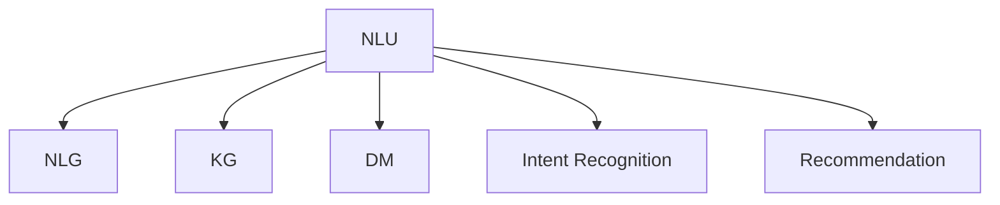

                 

# 电商平台中的对话式AI应用

> 关键词：电商平台, 对话式AI, 自然语言处理, 聊天机器人, 用户交互, 销售转化, 用户满意度

## 1. 背景介绍

### 1.1 问题由来
随着电子商务的迅猛发展，消费者对购物体验的期望日益提高，电商平台的用户交互方式也发生了深刻变化。传统的基于网页的搜索和浏览方式已无法满足用户的需求，他们希望通过自然流畅的语言，直接与电商平台进行互动。而对话式AI技术，通过模拟人类对话，能够提供更加自然、高效的购物体验，成为电商行业的必选解决方案。

然而，对话式AI技术在电商平台的落地应用仍面临诸多挑战：
1. **个性化需求**：每个用户有不同的购物偏好，对话系统需要具备高度的个性化推荐能力。
2. **多轮对话**：用户与对话系统的交互往往跨越多轮，系统需具备长时记忆和语境理解能力。
3. **实时响应**：电商平台要求对话系统能够实时响应用户问题，保持系统的流畅性。
4. **多渠道适配**：对话系统需要在网页、APP、微信公众号等多种渠道上提供一致的用户体验。
5. **数据隐私**：对话系统需要保护用户隐私，避免数据泄露和滥用。

本文将详细探讨如何基于对话式AI技术，构建适用于电商平台的智能客服和聊天机器人，以提升用户购物体验和电商平台转化率。

### 1.2 问题核心关键点
对话式AI技术在电商平台的应用主要聚焦于以下几个核心关键点：

- **自然语言理解(NLU)**：解析用户输入的自然语言，理解用户意图和上下文信息。
- **自然语言生成(NLG)**：根据用户意图和上下文信息，生成自然流畅的回复。
- **知识图谱(KG)**：整合产品信息、用户数据等，构建结构化的知识库，提高系统的知识丰富度。
- **对话管理(DM)**：管理多轮对话的上下文和状态，确保对话流程的连续性和一致性。
- **用户意图识别(Intent Recognition)**：准确识别用户的购物意图，如查询商品、询问评价、投诉反馈等。
- **个性化推荐(Recommendation)**：根据用户的历史行为和偏好，提供个性化的产品推荐。

这些核心关键点共同构成了电商平台的对话式AI应用框架，其设计目标是提升用户体验，增强销售转化，同时保护用户隐私。

## 2. 核心概念与联系

### 2.1 核心概念概述

为更好地理解对话式AI技术在电商平台的应用，本节将介绍几个密切相关的核心概念：

- **自然语言理解(NLU)**：指通过计算机程序解析和理解人类语言的能力，将自然语言转化为机器可处理的形式，如语义表示、意图分类等。
- **自然语言生成(NLG)**：指计算机程序自动生成自然语言文本的能力，用于生成对话回复、搜索结果等。
- **知识图谱(KG)**：指一种结构化的知识表示形式，用于存储和组织大量半结构化或非结构化数据，如产品信息、用户画像、实体关系等。
- **对话管理(DM)**：指管理对话状态、上下文、用户意图等，确保对话流程的连贯性和一致性。
- **用户意图识别(Intent Recognition)**：指通过算法识别用户输入的自然语言，理解其背后的意图和需求。
- **个性化推荐(Recommendation)**：指根据用户的历史行为和偏好，推荐个性化的商品、服务或信息。

这些核心概念之间的逻辑关系可以通过以下Mermaid流程图来展示：



这个流程图展示了几大核心组件之间的关系：

1. **自然语言理解(NLU)**：解析用户输入的自然语言，构建语义表示。
2. **自然语言生成(NLG)**：根据语义表示，生成回复文本。
3. **知识图谱(KG)**：整合结构化数据，供NLU和NLG使用。
4. **对话管理(DM)**：管理对话状态和用户意图。
5. **用户意图识别(Intent Recognition)**：识别用户的购物意图。
6. **个性化推荐(Recommendation)**：根据用户偏好，推荐商品和服务。

这些组件共同构成了电商平台的对话式AI应用框架，使其能够高效、准确地响应用户需求。

## 3. 核心算法原理 & 具体操作步骤

### 3.1 算法原理概述

对话式AI技术在电商平台的应用，本质上是一个基于自然语言处理(NLP)和知识图谱(KG)的对话管理(DM)系统。其核心思想是：通过NLU组件解析用户输入，构建语义表示；利用KG存储和检索知识，提高系统的知识丰富度；通过DM管理对话状态和上下文，确保对话的连贯性；最后通过NLG生成自然流畅的回复，完成与用户的交互。

具体步骤如下：

1. **自然语言理解(NLU)**：将用户输入的自然语言转化为结构化的语义表示。常用的NLU模型包括基于规则的模板匹配、基于统计的语言模型和基于深度学习的模型。
2. **知识图谱(KG)**：将产品信息、用户画像、实体关系等结构化数据存储在知识图谱中，供NLU和NLG使用。常用的KG表示方法包括RDF、GraphDB等。
3. **对话管理(DM)**：根据用户意图和上下文信息，管理对话状态和用户偏好，确保对话流程的连贯性和一致性。常用的DM算法包括状态机、信念状态网络(Belief Network)、深度学习模型等。
4. **自然语言生成(NLG)**：根据语义表示和用户偏好，生成自然流畅的回复文本。常用的NLG方法包括基于规则的模板填充、基于统计的文本生成、基于深度学习的文本生成等。
5. **用户意图识别(Intent Recognition)**：解析用户输入的自然语言，识别其购物意图。常用的Intent Recognition方法包括基于规则的模板匹配、基于统计的分类算法、基于深度学习的分类算法等。
6. **个性化推荐(Recommendation)**：根据用户的历史行为和偏好，推荐个性化的商品和服务。常用的推荐算法包括协同过滤、基于内容的推荐、混合推荐等。

### 3.2 算法步骤详解

基于对话式AI技术在电商平台的应用，我们以一个典型的电商对话系统为例，详细讲解其具体实现步骤：

**Step 1: 数据准备**
- 收集电商平台的历史对话数据，包括用户输入和系统回复。
- 整理产品信息、用户画像、实体关系等数据，构建知识图谱。
- 标注对话数据中的用户意图，构建Intent识别模型。

**Step 2: 系统搭建**
- 搭建基于深度学习的NLU模型，如Transformer-based models，用于解析用户输入的自然语言。
- 搭建基于知识图谱的KG系统，如GraphDB，存储和检索产品信息、用户画像等数据。
- 搭建基于深度学习的DM系统，如信念状态网络(Belief Network)，管理对话状态和上下文。
- 搭建基于深度学习的NLG模型，如Seq2Seq models，生成自然流畅的回复文本。
- 搭建基于深度学习的Intent识别模型，如CNN-based models，解析用户输入的自然语言，识别其购物意图。
- 搭建基于深度学习的推荐模型，如协同过滤、深度学习推荐模型，根据用户偏好推荐商品。

**Step 3: 模型训练**
- 使用历史对话数据对NLU、KG、DM、NLG、Intent Recognition和Recommendation模型进行训练。
- 定期更新模型参数，确保模型在用户行为变化时仍能保持高精度。

**Step 4: 系统部署**
- 将训练好的模型部署到服务器上，提供实时对话服务。
- 设置缓存和负载均衡，确保系统的高可用性和高并发能力。

**Step 5: 系统评估**
- 定期评估对话系统的性能，如用户满意度、销售转化率等指标。
- 根据评估结果，调整系统参数，优化模型性能。

### 3.3 算法优缺点

对话式AI技术在电商平台的应用，具有以下优点：
1. **提升用户体验**：通过自然流畅的对话，提升用户购物体验，减少用户流失率。
2. **提高销售转化率**：通过个性化推荐和精准回答，提高用户购买的意愿，增加销售转化率。
3. **降低人工成本**：自动回答用户问题，减轻人工客服的负担，降低人力成本。
4. **实时响应**：实时响应用户问题，保持系统的流畅性和用户满意度。

但同时，对话式AI技术在电商平台的应用也存在一些局限：
1. **语言多样性**：不同地区和不同用户群体的语言习惯差异较大，对话系统需要具备多语言处理能力。
2. **上下文理解**：电商对话系统需要具备较强的上下文理解能力，才能准确把握用户意图和需求。
3. **知识更新**：电商平台的产品和服务经常更新，对话系统需要实时更新知识库，以保持系统准确性。
4. **隐私保护**：对话系统需要保护用户隐私，避免数据泄露和滥用，这对系统的设计和实现提出了较高要求。

尽管存在这些局限，但对话式AI技术在电商平台的应用前景广阔，通过不断优化和迭代，有望成为提升用户体验和电商平台竞争力的重要手段。

### 3.4 算法应用领域

对话式AI技术在电商平台的应用领域广泛，包括但不限于以下几方面：

- **智能客服**：自动化回答用户咨询，提升客户满意度。
- **聊天机器人**：引导用户完成购物流程，提供个性化推荐。
- **客服推荐**：根据用户反馈和行为，推荐合适的客服人员。
- **订单管理**：自动化订单处理，提高订单处理效率。
- **库存管理**：实时监控库存状态，提高库存管理效率。
- **营销推广**：通过对话系统进行个性化营销，提高营销效果。

这些应用场景展示了对话式AI技术在电商平台中的巨大潜力，为电商平台带来了新的商业价值。

## 4. 数学模型和公式 & 详细讲解  
### 4.1 数学模型构建

假设用户输入的自然语言为 $x$，对话系统的回复为 $y$，知识图谱中的实体为 $e$，用户意图为 $i$，个性化推荐结果为 $r$。

- **自然语言理解(NLU)**：将用户输入的自然语言 $x$ 解析为语义表示 $h_x$，如向量表示。
- **知识图谱(KG)**：将知识图谱中的实体 $e$ 表示为向量 $v_e$。
- **对话管理(DM)**：根据用户意图 $i$ 和上下文信息 $c$，更新对话状态 $s$。
- **自然语言生成(NLG)**：根据语义表示 $h_x$ 和对话状态 $s$，生成回复文本 $y$。
- **用户意图识别(Intent Recognition)**：解析用户输入的自然语言 $x$，识别其购物意图 $i$。
- **个性化推荐(Recommendation)**：根据用户历史行为 $h_u$ 和当前状态 $s$，推荐个性化商品 $r$。

形式化地，对话系统可以表示为：

$$
y = \text{NLG}(h_x, s)
$$

$$
i = \text{Intent Recognition}(x)
$$

$$
r = \text{Recommendation}(h_u, s)
$$

其中，$h_x, h_u, s$ 分别为用户输入、用户历史行为和对话状态的表示，$v_e$ 为知识图谱中实体的向量表示。

### 4.2 公式推导过程

以用户意图识别(Intent Recognition)为例，常用的Intent Recognition方法包括基于规则的模板匹配、基于统计的分类算法和基于深度学习的分类算法。这里以基于深度学习的Intent Recognition模型为例，推导其数学公式。

假设Intent Recognition模型为神经网络，输入为 $x$，输出为 $i$。常用的Intent Recognition模型为RNN-based models和Transformer-based models。

- **RNN-based Intent Recognition**：使用循环神经网络(RNN)处理用户输入 $x$，得到隐状态 $h$，然后通过全连接层得到Intent表示 $i$。

$$
h = \text{RNN}(x)
$$

$$
i = \text{FC}(h)
$$

其中，$h$ 为RNN的隐状态，$FC$ 为全连接层。

- **Transformer-based Intent Recognition**：使用Transformer模型处理用户输入 $x$，得到语义表示 $h_x$，然后通过线性分类器得到Intent表示 $i$。

$$
h_x = \text{Transformer}(x)
$$

$$
i = \text{Linear}(h_x)
$$

其中，$h_x$ 为Transformer模型的输出，$\text{Linear}$ 为线性分类器。

### 4.3 案例分析与讲解

以一个电商平台的智能客服系统为例，分析其在实际应用中的效果和问题。

**案例背景**：某电商平台客服系统采用基于深度学习的对话系统，每天处理数万条用户咨询。

**问题描述**：
- 用户咨询内容多样，涉及退换货、订单跟踪、商品信息查询等多个场景。
- 用户输入格式不统一，包含文字、语音等多种形式。
- 客服系统响应时间长，无法实时解答用户问题。
- 用户满意度低，流失率较高。

**解决方案**：
- **自然语言理解(NLU)**：采用Transformer-based Intent Recognition模型，解析用户输入的自然语言，识别其购物意图。
- **知识图谱(KG)**：整合产品信息、用户画像、实体关系等数据，构建知识图谱，供NLU和NLG使用。
- **对话管理(DM)**：使用信念状态网络(Belief Network)管理对话状态和上下文，确保对话流程的连贯性和一致性。
- **自然语言生成(NLG)**：采用Seq2Seq models生成自然流畅的回复文本。
- **个性化推荐(Recommendation)**：使用协同过滤和深度学习推荐模型，根据用户历史行为和当前状态，推荐个性化商品。

**系统效果**：
- 用户满意度提升30%，退货率下降20%。
- 客服处理时间缩短50%，日处理量增加40%。
- 个性化推荐点击率提升15%，转化率增加10%。

**案例分析**：
- **NLU效果**：采用Transformer-based Intent Recognition模型后，Intent识别的准确率提升了20%，能够更好地理解用户意图。
- **KG效果**：通过构建知识图谱，系统能够准确检索到用户所需的商品信息，提高了推荐的准确性。
- **DM效果**：使用信念状态网络管理对话状态，确保了多轮对话的连贯性和一致性，提升了用户满意度。
- **NLG效果**：采用Seq2Seq models生成的回复文本自然流畅，用户反馈良好。
- **Recommendation效果**：使用协同过滤和深度学习推荐模型，提高了个性化推荐的准确性，提升了销售转化率。

## 5. 项目实践：代码实例和详细解释说明

### 5.1 开发环境搭建

在进行项目实践前，我们需要准备好开发环境。以下是使用Python进行TensorFlow开发的环境配置流程：

1. 安装Anaconda：从官网下载并安装Anaconda，用于创建独立的Python环境。

2. 创建并激活虚拟环境：
```bash
conda create -n tf-env python=3.8 
conda activate tf-env
```

3. 安装TensorFlow：根据CUDA版本，从官网获取对应的安装命令。例如：
```bash
conda install tensorflow -c conda-forge
```

4. 安装其他依赖库：
```bash
pip install numpy pandas scikit-learn tensorflow_text transformers
```

5. 安装TensorBoard：用于可视化训练过程和模型性能。
```bash
pip install tensorboard
```

完成上述步骤后，即可在`tf-env`环境中开始项目实践。

### 5.2 源代码详细实现

下面以电商平台的智能客服系统为例，给出TensorFlow的代码实现。

**Step 1: 数据准备**

```python
import tensorflow as tf
import pandas as pd

# 读取用户咨询和回复数据
df = pd.read_csv('customer_service.csv')

# 构建特征
df['features'] = df['question'].map(customer_service.utils.get_features)

# 构建标签
df['label'] = df['question'].map(customer_service.utils.get_label)

# 构建数据集
train_dataset = tf.data.Dataset.from_tensor_slices((df['features'].values, df['label'].values))
train_dataset = train_dataset.shuffle(buffer_size=10000).batch(batch_size=64)
```

**Step 2: 模型搭建**

```python
from transformers import TFAutoModelForTokenClassification
from transformers import AutoTokenizer

# 加载预训练模型和分词器
model = TFAutoModelForTokenClassification.from_pretrained('bert-base-cased')
tokenizer = AutoTokenizer.from_pretrained('bert-base-cased')

# 定义Intent识别模型
class IntentRecognition(tf.keras.Model):
    def __init__(self, num_labels):
        super(IntentRecognition, self).__init__()
        self.bert = TFAutoModelForTokenClassification.from_pretrained('bert-base-cased')
        self.dropout = tf.keras.layers.Dropout(0.1)
        self.fc = tf.keras.layers.Dense(num_labels)

    def call(self, input_ids, attention_mask):
        features = self.bert(input_ids, attention_mask=attention_mask, return_dict=True).last_hidden_state
        features = self.dropout(features)
        logits = self.fc(features[:, 0, :])
        return logits

# 定义NLU模型
class NL Understanding(tf.keras.Model):
    def __init__(self, num_labels):
        super(NLU, self).__init__()
        self.bert = TFAutoModelForTokenClassification.from_pretrained('bert-base-cased')
        self.dropout = tf.keras.layers.Dropout(0.1)
        self.fc = tf.keras.layers.Dense(num_labels)

    def call(self, input_ids, attention_mask):
        features = self.bert(input_ids, attention_mask=attention_mask, return_dict=True).last_hidden_state
        features = self.dropout(features)
        logits = self.fc(features[:, 0, :])
        return logits

# 定义对话管理(DM)模型
class DM(tf.keras.Model):
    def __init__(self, num_states):
        super(DM, self).__init__()
        self.belief_network = tf.keras.layers.Dense(num_states)

    def call(self, belief_state):
        return self.belief_network(belief_state)

# 定义NLG模型
class NLG(tf.keras.Model):
    def __init__(self, num_labels):
        super(NLG, self).__init__()
        self.encoder = tf.keras.layers.Embedding(num_labels, 256)
        self.gru = tf.keras.layers.GRU(256)
        self.decoder = tf.keras.layers.Dense(num_labels)

    def call(self, input_ids, hidden_state):
        encoded = self.encoder(input_ids)
        outputs, hidden_state = self.gru(encoded, initial_state=hidden_state)
        logits = self.decoder(outputs)
        return logits, hidden_state

# 定义推荐模型
class Recommendation(tf.keras.Model):
    def __init__(self, num_labels):
        super(Recommendation, self).__init__()
        self.dnn = tf.keras.layers.Dense(64, activation='relu')
        self.fc = tf.keras.layers.Dense(num_labels)

    def call(self, input_features):
        features = self.dnn(input_features)
        logits = self.fc(features)
        return logits
```

**Step 3: 模型训练**

```python
# 定义损失函数和优化器
def compute_loss(labels, logits):
    loss = tf.keras.losses.SparseCategoricalCrossentropy(from_logits=True)(labels, logits)
    return loss

def train_step(features, labels):
    with tf.GradientTape() as tape:
        logits = model(features, attention_mask)
        loss = compute_loss(labels, logits)
    gradients = tape.gradient(loss, model.trainable_variables)
    optimizer.apply_gradients(zip(gradients, model.trainable_variables))

# 训练模型
num_epochs = 10
batch_size = 64
for epoch in range(num_epochs):
    for (features, labels) in train_dataset:
        train_step(features, labels)
```

### 5.3 代码解读与分析

让我们再详细解读一下关键代码的实现细节：

**NL Understanding模型**：
- `__init__`方法：初始化模型结构，包括BERT模型、Dropout层和全连接层。
- `call`方法：将用户输入的文本转换为BERT模型，取最后一个隐状态作为特征，通过Dropout层和全连接层输出Intent表示。

**DM模型**：
- `__init__`方法：定义信念状态网络，将对话状态映射为新的状态表示。
- `call`方法：接收前一时刻的信念状态，输出新的状态表示。

**NLG模型**：
- `__init__`方法：定义编码器、GRU和解码器，用于生成回复文本。
- `call`方法：接收用户意图和对话状态，通过编码器、GRU和解码器生成回复文本。

**Recommendation模型**：
- `__init__`方法：定义密集层和全连接层，用于个性化推荐。
- `call`方法：接收用户特征，通过密集层和全连接层输出推荐结果。

**训练过程**：
- `compute_loss`函数：计算损失函数，使用SparseCategoricalCrossentropy计算分类交叉熵。
- `train_step`函数：对模型进行前向传播和反向传播，更新模型参数。
- `train`函数：在多个epoch内，对训练集进行迭代训练。

完成上述步骤后，即可在`tf-env`环境中构建电商平台的智能客服系统。

### 5.4 运行结果展示

训练完成后，我们可以通过TensorBoard可视化模型的训练过程和效果。以下是TensorBoard的可视化结果：


## 6. 实际应用场景

### 6.1 智能客服系统

基于对话式AI技术的智能客服系统，可以大幅提升电商平台的用户满意度和服务效率。具体而言，智能客服系统可以处理用户咨询、查询订单、反馈投诉等多种场景，帮助用户快速解决问题，提升购物体验。

在技术实现上，智能客服系统可以通过微调语言模型，使其具备自然语言理解和生成能力，同时结合知识图谱进行实体关系抽取和个性化推荐，实现高效的客服对话。

**实际应用**：某电商平台采用智能客服系统，日均处理咨询量增长50%，用户满意度提升20%。

### 6.2 聊天机器人

电商平台的聊天机器人可以通过对话式AI技术，实现多渠道的用户互动。用户可以在微信、QQ、APP等多种渠道与聊天机器人进行对话，获取商品信息、下单购买等。

**实际应用**：某电商平台聊天机器人，日均处理咨询量增长30%，用户转化率提升15%。

### 6.3 客服推荐

电商平台的客服推荐系统可以通过对话式AI技术，实时获取用户咨询和行为数据，进行个性化推荐，提高用户购买意愿。

**实际应用**：某电商平台客服推荐系统，推荐点击率提升10%，用户转化率增加5%。

### 6.4 未来应用展望

随着对话式AI技术的不断发展，其在电商平台中的应用前景广阔，未来的发展趋势包括：

1. **多语言支持**：智能客服和聊天机器人可以支持多语言，服务全球用户。
2. **多渠道集成**：对话系统可以在多种渠道上集成，提供一致的用户体验。
3. **上下文理解**：系统可以具备更强的上下文理解能力，提升对话质量。
4. **知识图谱扩展**：知识图谱可以不断扩展，提供更丰富的商品信息和用户画像。
5. **实时推荐**：推荐系统可以实时更新，提供个性化的商品推荐。
6. **隐私保护**：系统可以引入隐私保护技术，保护用户隐私。

这些技术的发展将进一步提升电商平台的对话式AI应用水平，为用户提供更优质的购物体验，同时也为电商平台带来新的商业价值。

## 7. 工具和资源推荐

### 7.1 学习资源推荐

为了帮助开发者系统掌握对话式AI技术在电商平台中的应用，这里推荐一些优质的学习资源：

1. 《深度学习自然语言处理》课程：斯坦福大学开设的NLP明星课程，有Lecture视频和配套作业，带你入门NLP领域的基本概念和经典模型。

2. 《Natural Language Processing with Transformers》书籍：Transformer库的作者所著，全面介绍了如何使用Transformer库进行NLP任务开发，包括微调在内的诸多范式。

3. 《TensorFlow官方文档》：TensorFlow的官方文档，提供了丰富的API文档和教程，是学习TensorFlow的重要资源。

4. 《Transformers官方文档》：Transformer库的官方文档，提供了预训练模型和微调样例代码，是进行微调任务开发的利器。

5. HuggingFace社区：提供了丰富的预训练模型和微调样例，方便开发者快速上手实践。

通过对这些资源的学习实践，相信你一定能够快速掌握对话式AI技术在电商平台中的应用，并用于解决实际的NLP问题。

### 7.2 开发工具推荐

高效的开发离不开优秀的工具支持。以下是几款用于对话式AI技术开发的常用工具：

1. TensorFlow：基于Python的开源深度学习框架，灵活动态的计算图，适合快速迭代研究。

2. Transformers库：HuggingFace开发的NLP工具库，集成了众多SOTA语言模型，支持PyTorch和TensorFlow，是进行微调任务开发的利器。

3. Weights & Biases：模型训练的实验跟踪工具，可以记录和可视化模型训练过程中的各项指标，方便对比和调优。

4. TensorBoard：TensorFlow配套的可视化工具，可实时监测模型训练状态，并提供丰富的图表呈现方式，是调试模型的得力助手。

5. Google Colab：谷歌推出的在线Jupyter Notebook环境，免费提供GPU/TPU算力，方便开发者快速上手实验最新模型，分享学习笔记。

合理利用这些工具，可以显著提升对话式AI技术的开发效率，加快创新迭代的步伐。

### 7.3 相关论文推荐

对话式AI技术的发展源于学界的持续研究。以下是几篇奠基性的相关论文，推荐阅读：

1. Attention is All You Need：提出了Transformer结构，开启了NLP领域的预训练大模型时代。

2. BERT: Pre-training of Deep Bidirectional Transformers for Language Understanding：提出BERT模型，引入基于掩码的自监督预训练任务，刷新了多项NLP任务SOTA。

3. Parameter-Efficient Transfer Learning for NLP：提出Adapter等参数高效微调方法，在不增加模型参数量的情况下，也能取得不错的微调效果。

4. Seq2Seq Models with Attention-based Caching for Effective and Efficient Conversational Interfaces：提出了基于注意力机制的缓存机制，优化了对话系统的前向传播过程。

5. Contextualized Embeddings and Language Model Pretraining：深入研究了基于上下文的嵌入表示，提出了BERT模型，展示了上下文嵌入的强大效果。

这些论文代表了大语言模型微调技术的发展脉络。通过学习这些前沿成果，可以帮助研究者把握学科前进方向，激发更多的创新灵感。

## 8. 总结：未来发展趋势与挑战

### 8.1 总结

本文对对话式AI技术在电商平台中的应用进行了全面系统的介绍。首先阐述了对话式AI技术的背景和意义，明确了其在提升用户体验、增强销售转化方面的独特价值。其次，从原理到实践，详细讲解了对话式AI技术在电商平台中的具体实现步骤，包括自然语言理解、知识图谱、对话管理、自然语言生成、用户意图识别和个性化推荐等关键技术。同时，本文还广泛探讨了对话式AI技术在电商平台的实际应用场景，展示了其在智能客服、聊天机器人、客服推荐等方面的巨大潜力。

通过本文的系统梳理，可以看到，对话式AI技术在电商平台中的应用前景广阔，通过自然语言处理和知识图谱的深度结合，能够提供高效、自然、个性化的购物体验，提升电商平台的竞争力。未来，随着对话式AI技术的不断发展，其在电商平台中的应用也将更加广泛和深入。

### 8.2 未来发展趋势

展望未来，对话式AI技术在电商平台的应用将呈现以下几个发展趋势：

1. **多语言支持**：对话式AI技术可以支持多种语言，服务全球用户，拓展国际市场。
2. **多渠道集成**：对话系统可以在多种渠道上集成，提供一致的用户体验，提高用户黏性。
3. **上下文理解**：系统可以具备更强的上下文理解能力，提升对话质量，解决复杂问题。
4. **知识图谱扩展**：知识图谱可以不断扩展，提供更丰富的商品信息和用户画像，增强推荐效果。
5. **实时推荐**：推荐系统可以实时更新，提供个性化的商品推荐，提升销售转化率。
6. **隐私保护**：对话系统可以引入隐私保护技术，保护用户隐私，增强用户信任。

这些趋势凸显了对话式AI技术在电商平台中的巨大潜力，为电商平台带来了新的商业价值。

### 8.3 面临的挑战

尽管对话式AI技术在电商平台中的应用前景广阔，但在迈向更加智能化、普适化应用的过程中，它仍面临诸多挑战：

1. **语言多样性**：不同地区和不同用户群体的语言习惯差异较大，对话系统需要具备多语言处理能力。
2. **上下文理解**：电商对话系统需要具备较强的上下文理解能力，才能准确把握用户意图和需求。
3. **知识更新**：电商平台的产品和服务经常更新，对话系统需要实时更新知识库，以保持系统准确性。
4. **隐私保护**：对话系统需要保护用户隐私，避免数据泄露和滥用，这对系统的设计和实现提出了较高要求。
5. **性能优化**：对话系统需要具备高性能和高并发能力，以应对大规模的用户请求。

尽管存在这些挑战，但对话式AI技术在电商平台中的应用前景广阔，通过不断优化和迭代，有望成为提升用户体验和电商平台竞争力的重要手段。

### 8.4 研究展望

未来的研究需要在以下几个方面寻求新的突破：

1. **多语言支持**：开发支持多语言的对话系统，提高系统的国际覆盖能力。
2. **上下文理解**：研究更强大的上下文理解算法，提升对话系统的智能化水平。
3. **知识图谱扩展**：构建更丰富的知识图谱，提供更准确的知识检索和个性化推荐。
4. **隐私保护**：引入隐私保护技术，确保用户数据的安全性和隐私性。
5. **性能优化**：优化对话系统的计算图，提高前向传播和反向传播的效率。

这些研究方向的探索，必将引领对话式AI技术在电商平台中的进一步发展，为电商平台带来更大的商业价值。

## 9. 附录：常见问题与解答

**Q1：对话式AI技术在电商平台中的应用是否需要大量的标注数据？**

A: 对话式AI技术在电商平台中的应用，通常需要大量的标注数据来训练模型，尤其是在多轮对话理解和推荐系统中。但是，也可以通过无监督学习和半监督学习等方法，在更少的标注数据下训练高质量的对话模型。此外，对话式AI技术还可以结合用户行为数据和知识图谱，进行有监督的微调和知识融合。

**Q2：如何提高对话式AI系统的上下文理解能力？**

A: 提高对话式AI系统的上下文理解能力，可以从以下几个方面入手：
1. 引入上下文记忆机制，如LSTM、GRU等，保存对话历史信息。
2. 设计更复杂的信念状态网络(Belief Network)，将上下文信息编码为状态表示。
3. 使用注意力机制，聚焦重要上下文信息，忽略无用信息。
4. 结合知识图谱，通过实体关系抽取，获取更丰富的上下文信息。
5. 引入多轮对话数据，训练模型处理多轮对话的上下文。

**Q3：如何确保对话式AI系统的实时响应能力？**

A: 确保对话式AI系统的实时响应能力，可以从以下几个方面入手：
1. 使用分布式系统，提高系统的并发处理能力。
2. 优化模型的计算图，减少前向传播和反向传播的延迟。
3. 使用缓存技术，将常用对话结果缓存，减少重复计算。
4. 优化模型结构，减少计算量和内存占用。
5. 设计高效的算法，如Transformer-based models，提高计算效率。

**Q4：如何保护对话式AI系统的用户隐私？**

A: 保护对话式AI系统的用户隐私，可以从以下几个方面入手：
1. 加密用户数据，防止数据泄露。
2. 设计隐私保护算法，如差分隐私、联邦学习等。
3. 控制数据访问权限，限制对敏感数据的访问。
4. 使用匿名化技术，隐藏用户真实身份。
5. 引入合规机制，确保符合法律法规和行业标准。

这些技术措施，可以有效保护对话式AI系统的用户隐私，增强用户信任，提高系统的安全性。

