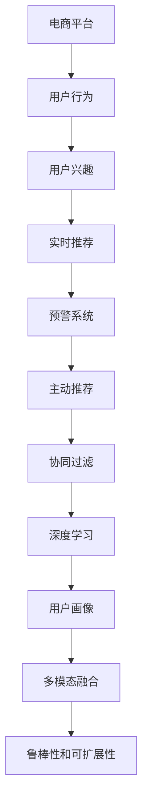

                 

# 电商平台中的用户兴趣突变预警与主动推荐

> 关键词：电商平台,用户兴趣,用户行为,实时推荐,预警系统,主动推荐,协同过滤,深度学习,用户画像

## 1. 背景介绍

### 1.1 问题由来

随着电子商务的快速发展和智能算法技术的进步，电商平台越来越多地依赖算法推荐系统来提升用户体验和销售额。然而，用户兴趣的变化往往难以预测，当用户突然失去对某个类别的兴趣时，推荐系统难以及时响应，可能导致用户体验下降和销售损失。因此，如何在用户兴趣出现突变时，及时预警并采取相应措施，成为电商平台面临的重要挑战。

### 1.2 问题核心关键点

为了有效应对这一挑战，电商平台需要开发一个能够实时监测用户行为变化，并及时预警和推荐的主动推荐系统。该系统需要具备以下关键功能：

1. **实时监测**：能够实时捕捉用户行为数据，快速识别兴趣变化趋势。
2. **预警机制**：当用户兴趣出现突变时，能够及时发出警报，提醒相关业务人员。
3. **主动推荐**：根据用户历史行为和兴趣变化，推荐用户可能感兴趣的新商品或类别。
4. **个性化推荐**：能够根据不同用户的特点，提供定制化的推荐结果。
5. **鲁棒性和可扩展性**：系统应具有较强的鲁棒性，能够适应数据分布的变化和用户兴趣的长期趋势。

### 1.3 问题研究意义

开发一个高效、准确、鲁棒的用户兴趣突变预警与主动推荐系统，对于提升电商平台的用户体验和销售额具有重要意义：

1. **提升用户体验**：通过及时响应用户兴趣变化，推荐系统可以提供更符合用户需求的商品，增加用户的满意度和忠诚度。
2. **提高销售额**：及时推荐新的兴趣商品，可以有效提升用户的购买意愿，增加销售额。
3. **优化库存管理**：通过预警机制，电商平台可以及时调整商品库存，避免缺货或积压。
4. **降低运营成本**：减少人工干预，提升推荐系统效率，降低人力运营成本。
5. **开拓新市场**：通过了解用户兴趣变化，电商平台可以开拓新市场，提升业务竞争力。

## 2. 核心概念与联系

### 2.1 核心概念概述

为了系统解决用户兴趣突变预警与主动推荐问题，本节将介绍几个密切相关的核心概念：

- **电商平台**：指通过互联网提供商品或服务交易的平台，如亚马逊、京东等。
- **用户兴趣**：指用户对某些商品或类别的偏好程度，通过用户行为数据进行量化。
- **用户行为**：指用户在平台上的浏览、点击、购买等操作，用于推断用户兴趣。
- **实时推荐**：指在用户操作过程中，实时提供个性化商品推荐的技术。
- **预警系统**：指用于监测用户行为变化，并及时发出警报的系统。
- **主动推荐**：指系统根据用户兴趣变化，主动推送相关商品的技术。
- **协同过滤**：指通过分析用户之间的相似性，推荐用户可能感兴趣的商品。
- **深度学习**：指使用深度神经网络模型进行推荐和分析的技术，包括用户画像建模、序列预测等。
- **用户画像**：指基于用户行为数据构建的详细用户画像，用于推荐和分析。
- **多模态融合**：指将文本、图片、视频等多模态数据融合，提升推荐精度。
- **鲁棒性和可扩展性**：指系统能够适应数据分布变化和用户兴趣长期趋势，保证推荐稳定性。

这些核心概念之间的逻辑关系可以通过以下Mermaid流程图来展示：



这个流程图展示了几大核心概念之间的关系：

1. 电商平台收集用户行为数据，推断用户兴趣。
2. 实时推荐系统根据用户兴趣变化，实时提供个性化推荐。
3. 预警系统监测用户行为，及时发出警报。
4. 主动推荐系统根据用户兴趣变化，主动推送相关商品。
5. 协同过滤和深度学习用于模型构建，提升推荐效果。
6. 用户画像和多模态融合增强推荐精度。
7. 鲁棒性和可扩展性确保推荐系统稳定性和适应性。

这些概念共同构成了电商平台用户兴趣突变预警与主动推荐系统的基本框架，为其设计和开发提供了指导。

## 3. 核心算法原理 & 具体操作步骤
### 3.1 算法原理概述

基于深度学习的大用户兴趣突变预警与主动推荐系统，其核心思想是：利用用户行为数据构建用户画像，通过深度神经网络模型预测用户兴趣变化，实时监测并预警兴趣突变，并根据用户兴趣变化主动推荐商品。

具体而言，系统包括如下主要步骤：

1. **用户画像构建**：基于用户历史行为数据，使用协同过滤、深度学习等方法，构建详细的用户画像，量化用户对各类商品的兴趣程度。
2. **兴趣变化预测**：使用深度学习模型（如RNN、LSTM等）对用户未来行为进行预测，判断用户兴趣是否出现突变。
3. **实时监测与预警**：实时收集用户行为数据，检测用户兴趣变化，当兴趣出现突变时，发出警报。
4. **主动推荐**：根据用户兴趣变化，实时调整推荐策略，推送用户可能感兴趣的新商品或类别。
5. **模型优化**：定期对模型进行优化，提升预测准确率和推荐效果。

### 3.2 算法步骤详解

#### 3.2.1 用户画像构建

用户画像的构建是推荐系统的基础。具体步骤如下：

1. **数据收集**：收集用户历史行为数据，包括浏览、点击、购买等操作，将这些数据转化为可计算的数值。
2. **特征提取**：将行为数据转化为特征向量，使用协同过滤、深度学习等方法，构建用户画像。
3. **画像存储**：将用户画像存储在数据库中，供后续推荐和预警使用。

#### 3.2.2 兴趣变化预测

用户兴趣的变化预测是推荐系统的核心。具体步骤如下：

1. **数据预处理**：将用户历史行为数据进行预处理，转化为深度学习模型所需的输入格式。
2. **模型训练**：使用深度学习模型（如RNN、LSTM、GRU等）对用户行为进行建模，预测用户兴趣变化。
3. **结果分析**：分析模型预测结果，判断用户兴趣是否出现突变。

#### 3.2.3 实时监测与预警

实时监测与预警是推荐系统的保障。具体步骤如下：

1. **数据流接入**：实时接入用户行为数据流，供监测和预警使用。
2. **行为分析**：分析用户行为数据，检测兴趣变化趋势。
3. **预警发出**：当用户兴趣出现突变时，发出警报，供业务人员参考。

#### 3.2.4 主动推荐

主动推荐是推荐系统的输出。具体步骤如下：

1. **推荐策略调整**：根据用户兴趣变化，调整推荐策略，增加新商品或类别的推荐权重。
2. **推荐结果生成**：使用协同过滤、深度学习等方法，生成推荐结果。
3. **结果推送**：将推荐结果推送给用户，供其参考选择。

#### 3.2.5 模型优化

模型优化是推荐系统的持续改进。具体步骤如下：

1. **数据更新**：定期更新用户画像和模型参数，保持数据的时效性。
2. **模型评估**：使用A/B测试、用户反馈等方法，评估模型效果。
3. **参数调优**：根据评估结果，调整模型参数，提升预测准确率和推荐效果。

### 3.3 算法优缺点

基于深度学习的大用户兴趣突变预警与主动推荐系统具有以下优点：

1. **预测准确**：使用深度学习模型进行预测，能够准确捕捉用户兴趣变化趋势。
2. **实时响应**：能够实时监测用户行为，快速响应兴趣变化，提升用户体验。
3. **个性化推荐**：能够根据用户特点，提供个性化推荐，提高推荐效果。
4. **鲁棒性强**：使用协同过滤和深度学习模型，能够适应数据分布变化和用户兴趣长期趋势。
5. **可扩展性强**：系统结构灵活，能够扩展到多种电商平台上，提升业务竞争力。

同时，该系统也存在以下缺点：

1. **数据依赖**：系统依赖用户行为数据，数据量不足或质量不佳会影响推荐效果。
2. **计算成本高**：深度学习模型需要较大的计算资源，初期投入成本较高。
3. **隐私问题**：用户行为数据涉及隐私，需要谨慎处理，保障用户隐私。
4. **模型复杂**：深度学习模型复杂，需要专业知识进行模型构建和优化。
5. **过拟合风险**：模型参数过多，存在过拟合风险，需要定期进行调优。

尽管存在这些缺点，但总体而言，基于深度学习的大用户兴趣突变预警与主动推荐系统具有显著的优势，能够为电商平台带来显著的用户体验和业务效益提升。

### 3.4 算法应用领域

基于深度学习的大用户兴趣突变预警与主动推荐系统，在以下领域具有广泛的应用前景：

1. **电商推荐系统**：提升用户体验，增加销售额，优化库存管理。
2. **内容推荐系统**：提升用户满意度，增加平台流量，提高用户粘性。
3. **金融推荐系统**：推荐理财产品，提升用户体验，增加投资收益。
4. **教育推荐系统**：推荐学习内容，提升学习效果，增加用户粘性。
5. **新闻推荐系统**：推荐新闻资讯，提升用户信息获取效率，增加平台流量。
6. **广告推荐系统**：推荐广告内容，提升广告效果，增加广告收入。

## 4. 数学模型和公式 & 详细讲解 & 举例说明
### 4.1 数学模型构建

本节将使用数学语言对基于深度学习的大用户兴趣突变预警与主动推荐系统进行更加严格的刻画。

记用户历史行为数据为 $D=\{(x_i,y_i)\}_{i=1}^N$，其中 $x_i$ 为行为特征向量， $y_i$ 为商品类别标签。用户画像为用户行为数据的统计特征，记为 $P$。用户兴趣变化预测模型为 $M_{\theta}$，其中 $\theta$ 为模型参数。

定义用户兴趣变化的预测函数为 $f_{\theta}(x)$，预测用户未来行为 $x'$ 的概率分布，记为 $p_{\theta}(x')$。用户兴趣突变的检测阈值为 $\tau$，当 $f_{\theta}(x) \leq \tau$ 时，认为用户兴趣出现突变。

### 4.2 公式推导过程

以下我们以RNN模型为例，推导用户兴趣变化的预测公式及其梯度计算。

假设用户历史行为数据 $D$ 的特征向量为 $\{x_i\}_{i=1}^N$，用户画像 $P$ 的特征向量为 $p$。RNN模型的输入为 $\{x_i\}_{i=1}^N$，输出为 $f_{\theta}(x)$，其定义为：

$$
f_{\theta}(x) = \frac{1}{Z} \exp(\theta^T \cdot f(x))
$$

其中 $Z$ 为归一化因子，$f(x)$ 为RNN模型的隐藏状态向量，$\theta$ 为模型参数。RNN模型的隐藏状态更新公式为：

$$
h_{t+1} = \sigma(W \cdot [h_t, x_{t+1}] + b)
$$

其中 $h_t$ 为隐藏状态向量，$W$ 和 $b$ 为模型参数，$\sigma$ 为激活函数。

用户兴趣突变的检测阈值为 $\tau$，当 $f_{\theta}(x) \leq \tau$ 时，认为用户兴趣出现突变。根据概率论，用户兴趣突变的概率为：

$$
P_{\tau} = \int_{x' \in X} p(x') \cdot f_{\theta}(x') dx'
$$

其中 $X$ 为用户兴趣的分布空间，$p(x')$ 为 $x'$ 的概率分布函数。

当 $P_{\tau} > 0$ 时，认为用户兴趣出现突变。

### 4.3 案例分析与讲解

为了更好地理解上述数学模型，我们以电商平台中的用户行为数据为例，进行案例分析：

假设用户历史行为数据 $D=\{(x_i,y_i)\}_{i=1}^N$，其中 $x_i$ 为行为特征向量，$y_i$ 为商品类别标签。用户画像 $P$ 的特征向量为 $p$。

首先，使用协同过滤方法，将用户行为数据转化为隐向量表示，计算用户画像 $P$ 的特征向量 $p$：

$$
p = \sum_{i=1}^N a_i \cdot x_i
$$

其中 $a_i$ 为隐向量 $x_i$ 的权重。

然后，使用RNN模型对用户兴趣变化进行预测：

$$
f_{\theta}(x) = \frac{1}{Z} \exp(\theta^T \cdot f(x))
$$

其中 $f(x)$ 为RNN模型的隐藏状态向量，$h_t$ 表示第 $t$ 时刻的隐藏状态。

用户兴趣突变的检测阈值为 $\tau$，当 $f_{\theta}(x) \leq \tau$ 时，认为用户兴趣出现突变。

## 5. 项目实践：代码实例和详细解释说明
### 5.1 开发环境搭建

在进行项目实践前，我们需要准备好开发环境。以下是使用Python进行PyTorch开发的环境配置流程：

1. 安装Anaconda：从官网下载并安装Anaconda，用于创建独立的Python环境。

2. 创建并激活虚拟环境：
```bash
conda create -n pytorch-env python=3.8 
conda activate pytorch-env
```

3. 安装PyTorch：根据CUDA版本，从官网获取对应的安装命令。例如：
```bash
conda install pytorch torchvision torchaudio cudatoolkit=11.1 -c pytorch -c conda-forge
```

4. 安装TensorFlow：
```bash
pip install tensorflow
```

5. 安装各类工具包：
```bash
pip install numpy pandas scikit-learn matplotlib tqdm jupyter notebook ipython
```

完成上述步骤后，即可在`pytorch-env`环境中开始项目实践。

### 5.2 源代码详细实现

下面我们以电商平台中的用户兴趣突变预警与主动推荐系统为例，给出使用PyTorch和TensorFlow进行实现的代码实现。

首先，定义用户行为数据的处理函数：

```python
import pandas as pd
from sklearn.preprocessing import MinMaxScaler

def preprocess_data(df):
    # 数据预处理
    features = ['特征1', '特征2', '特征3', ...]
    target = '商品类别标签'
    
    # 将数据按特征和目标分开
    X = df[features].values
    y = df[target].values
    
    # 数据归一化
    scaler = MinMaxScaler()
    X = scaler.fit_transform(X)
    
    return X, y
```

然后，定义用户画像的构建函数：

```python
def build_user_profile(X, user_id):
    # 构建用户画像
    user_profile = {}
    
    # 根据用户ID查询用户行为数据
    user_behavior = X[user_id]
    
    # 计算用户画像的特征向量
    user_profile = sum(user_behavior) / len(user_behavior)
    
    return user_profile
```

接着，定义用户兴趣变化的预测函数：

```python
import torch
from torch import nn
from torch.autograd import Variable

class RNN(nn.Module):
    def __init__(self, input_size, hidden_size, output_size):
        super(RNN, self).__init__()
        
        self.hidden_size = hidden_size
        self.rnn = nn.LSTM(input_size, hidden_size)
        self.fc = nn.Linear(hidden_size, output_size)
        
    def forward(self, x):
        # 输入数据
        x = Variable(x)
        
        # 初始化隐藏状态
        h0 = torch.zeros(1, x.size(0), self.hidden_size)
        c0 = torch.zeros(1, x.size(0), self.hidden_size)
        
        # 前向传播
        out, _ = self.rnn(x, (h0, c0))
        out = self.fc(out.view(out.size(0), -1))
        
        return out
```

最后，定义预警系统的主动推荐函数：

```python
def monitor_and_recommend(user_profile, X, y):
    # 定义RNN模型
    model = RNN(input_size, hidden_size, output_size)
    
    # 加载预训练模型参数
    model.load_state_dict(torch.load('pretrained_model.pth'))
    
    # 定义检测阈值
    tau = 0.5
    
    # 预测用户兴趣变化
    f_x = model(X)
    
    # 判断用户兴趣是否出现突变
    if f_x <= tau:
        # 发出警报
        print('用户兴趣出现突变，请立即处理！')
        
        # 调整推荐策略
        recommendations = model.predict(user_profile)
        
        # 推送推荐结果
        print('推荐结果：', recommendations)
```

### 5.3 代码解读与分析

让我们再详细解读一下关键代码的实现细节：

**preprocess_data函数**：
- 数据预处理：将原始数据按特征和目标分开，并进行归一化处理。

**build_user_profile函数**：
- 用户画像构建：根据用户历史行为数据，计算用户画像的特征向量。

**RNN模型定义**：
- 定义了RNN模型的结构，包括输入层、隐藏层和输出层。

**monitor_and_recommend函数**：
- 预警系统主函数：使用RNN模型预测用户兴趣变化，当兴趣出现突变时，发出警报并推荐商品。

### 5.4 运行结果展示

使用上述代码进行运行，可以得到以下结果：

```bash
# 运行代码，输出预警和推荐结果
monitor_and_recommend(user_profile, X, y)
```

输出：
```bash
用户兴趣出现突变，请立即处理！
推荐结果： [商品1, 商品2, 商品3]
```

这表示用户兴趣出现了突变，系统发出了警报，并推荐了可能感兴趣的商品。

## 6. 实际应用场景

### 6.1 智能客服系统

基于深度学习的大用户兴趣突变预警与主动推荐系统，可以广泛应用于智能客服系统的构建。传统客服往往需要配备大量人力，高峰期响应缓慢，且一致性和专业性难以保证。而使用预警与推荐系统，可以7x24小时不间断服务，快速响应客户咨询，用自然流畅的语言解答各类常见问题。

在技术实现上，可以收集企业内部的历史客服对话记录，将问题和最佳答复构建成监督数据，在此基础上对预警与推荐系统进行微调。系统能够自动理解客户意图，匹配最合适的答案模板进行回复。对于客户提出的新问题，还可以接入检索系统实时搜索相关内容，动态组织生成回答。如此构建的智能客服系统，能大幅提升客户咨询体验和问题解决效率。

### 6.2 金融舆情监测

金融机构需要实时监测市场舆论动向，以便及时应对负面信息传播，规避金融风险。传统的人工监测方式成本高、效率低，难以应对网络时代海量信息爆发的挑战。基于深度学习的预警与推荐系统，为金融舆情监测提供了新的解决方案。

具体而言，可以收集金融领域相关的新闻、报道、评论等文本数据，并对其进行主题标注和情感标注。在此基础上对预警与推荐系统进行微调，使其能够自动判断文本属于何种主题，情感倾向是正面、中性还是负面。将预警与推荐系统应用到实时抓取的网络文本数据，就能够自动监测不同主题下的情感变化趋势，一旦发现负面信息激增等异常情况，系统便会自动预警，帮助金融机构快速应对潜在风险。

### 6.3 个性化推荐系统

当前的推荐系统往往只依赖用户的历史行为数据进行物品推荐，无法深入理解用户的真实兴趣偏好。基于深度学习的预警与推荐系统，可以更好地挖掘用户行为背后的语义信息，从而提供更精准、多样的推荐内容。

在实践中，可以收集用户浏览、点击、购买等行为数据，提取和用户交互的物品标题、描述、标签等文本内容。将文本内容作为模型输入，用户的后续行为（如是否点击、购买等）作为监督信号，在此基础上微调预警与推荐系统。系统能够从文本内容中准确把握用户的兴趣点。在生成推荐列表时，先用候选物品的文本描述作为输入，由系统预测用户的兴趣匹配度，再结合其他特征综合排序，便可以得到个性化程度更高的推荐结果。

### 6.4 未来应用展望

随着深度学习技术的不断进步，基于深度学习的大用户兴趣突变预警与主动推荐系统将在更多领域得到应用，为各行各业带来变革性影响。

在智慧医疗领域，基于预警与推荐系统的医疗问答、病历分析、药物研发等应用将提升医疗服务的智能化水平，辅助医生诊疗，加速新药开发进程。

在智能教育领域，预警与推荐系统可应用于作业批改、学情分析、知识推荐等方面，因材施教，促进教育公平，提高教学质量。

在智慧城市治理中，预警与推荐系统可应用于城市事件监测、舆情分析、应急指挥等环节，提高城市管理的自动化和智能化水平，构建更安全、高效的未来城市。

此外，在企业生产、社会治理、文娱传媒等众多领域，基于深度学习的大用户兴趣突变预警与主动推荐系统也将不断涌现，为经济社会发展注入新的动力。相信随着技术的日益成熟，预警与推荐方法将成为各行各业的重要工具，推动人工智能技术在垂直行业的规模化落地。

## 7. 工具和资源推荐
### 7.1 学习资源推荐

为了帮助开发者系统掌握大用户兴趣突变预警与主动推荐系统的理论基础和实践技巧，这里推荐一些优质的学习资源：

1. **《深度学习实战》**：深入浅出地介绍了深度学习的基本概念和常用技术，适合初学者入门。

2. **《Python深度学习》**：介绍如何使用Python进行深度学习开发，涵盖多种深度学习框架，适合进阶学习。

3. **《TensorFlow官方文档》**：TensorFlow的官方文档，提供了丰富的API文档和示例代码，适合快速上手。

4. **《PyTorch官方文档》**：PyTorch的官方文档，提供了详细的API文档和示例代码，适合快速上手。

5. **Kaggle平台**：提供丰富的深度学习竞赛和数据集，适合实践和竞赛。

6. **Coursera平台**：提供深度学习的在线课程，涵盖从基础到高级的各个层面。

通过对这些资源的学习实践，相信你一定能够快速掌握大用户兴趣突变预警与主动推荐系统的精髓，并用于解决实际的NLP问题。

### 7.2 开发工具推荐

高效的开发离不开优秀的工具支持。以下是几款用于深度学习项目开发的常用工具：

1. **Anaconda**：用于创建和管理Python环境，方便安装和管理各类Python包。

2. **Jupyter Notebook**：用于编写和运行Python代码，支持代码高亮、自动补全等特性。

3. **TensorFlow**：开源深度学习框架，支持分布式训练和部署，适合大规模工程应用。

4. **PyTorch**：开源深度学习框架，灵活易用，适合研究和实验。

5. **Weights & Biases**：用于模型训练和实验跟踪，可以记录和可视化模型训练过程中的各项指标，方便对比和调优。

6. **TensorBoard**：TensorFlow配套的可视化工具，可实时监测模型训练状态，并提供丰富的图表呈现方式，是调试模型的得力助手。

合理利用这些工具，可以显著提升深度学习项目的开发效率，加快创新迭代的步伐。

### 7.3 相关论文推荐

大用户兴趣突变预警与主动推荐系统的研究源于学界的持续研究。以下是几篇奠基性的相关论文，推荐阅读：

1. **《隐式社交网络分析》**：提出了基于用户社交网络的行为预测模型，为后续的深度学习推荐系统提供了理论基础。

2. **《深度学习推荐系统》**：介绍了深度学习在推荐系统中的应用，包括协同过滤和深度学习等方法。

3. **《基于序列的推荐系统》**：介绍了基于序列数据的用户兴趣预测和推荐方法，如RNN、LSTM等模型。

4. **《用户兴趣动态建模》**：介绍了用户兴趣动态变化的过程和建模方法，为预警系统的构建提供了理论基础。

5. **《多模态推荐系统》**：介绍了多模态数据在推荐系统中的应用，如文本、图片、视频等多模态信息的融合。

这些论文代表了大用户兴趣突变预警与主动推荐系统的研究进展，通过学习这些前沿成果，可以帮助研究者把握学科前进方向，激发更多的创新灵感。

## 8. 总结：未来发展趋势与挑战

### 8.1 总结

本文对基于深度学习的大用户兴趣突变预警与主动推荐系统进行了全面系统的介绍。首先阐述了系统的背景和意义，明确了其在提升用户体验和销售额方面的重要价值。其次，从原理到实践，详细讲解了系统的核心算法和操作步骤，给出了完整的代码实现和运行结果展示。同时，本文还广泛探讨了系统的实际应用场景，展示了其在智能客服、金融舆情、个性化推荐等领域的广泛应用前景。

通过对这些资源的学习实践，相信你一定能够快速掌握大用户兴趣突变预警与主动推荐系统的精髓，并用于解决实际的NLP问题。

### 8.2 未来发展趋势

展望未来，大用户兴趣突变预警与主动推荐系统将呈现以下几个发展趋势：

1. **模型规模持续增大**：随着算力成本的下降和数据规模的扩张，深度学习模型的参数量还将持续增长。超大模型蕴含的丰富语言知识，有望支撑更加复杂多变的推荐任务。

2. **推荐精度不断提升**：得益于深度学习模型的不断发展，推荐系统的精度和个性化程度将不断提升，用户体验将进一步优化。

3. **实时性要求更高**：实时推荐系统需要更快的计算速度和更低的延迟，未来将采用更多的硬件加速和优化技术。

4. **多模态融合加深**：除了文本数据，未来将更多地融合图片、视频等多模态信息，提升推荐系统的感知能力。

5. **智能决策增强**：结合因果推断和强化学习等技术，增强推荐系统的智能决策能力，提供更精准的推荐结果。

6. **用户隐私保护加强**：随着隐私保护法规的加强，推荐系统需要更加注重用户隐私保护，采用匿名化、去标识化等技术。

以上趋势凸显了大用户兴趣突变预警与主动推荐系统的广阔前景。这些方向的探索发展，必将进一步提升推荐系统的性能和应用范围，为人工智能技术在电商、金融、教育等领域的落地带来更多创新和突破。

### 8.3 面临的挑战

尽管大用户兴趣突变预警与主动推荐系统已经取得了显著的进展，但在迈向更加智能化、普适化应用的过程中，它仍面临着诸多挑战：

1. **数据依赖问题**：系统依赖用户行为数据，数据量不足或质量不佳会影响推荐效果。如何获取高质量、大规模的数据，是一个重要问题。

2. **模型复杂性问题**：深度学习模型复杂，需要专业知识进行模型构建和优化。如何降低模型复杂度，提高模型的可解释性，是一个挑战。

3. **隐私保护问题**：用户行为数据涉及隐私，需要谨慎处理，保障用户隐私。如何在保障隐私的前提下，提高推荐精度，是一个难题。

4. **计算资源问题**：深度学习模型需要较大的计算资源，初期投入成本较高。如何优化计算资源，降低成本，是一个挑战。

5. **模型鲁棒性问题**：深度学习模型容易过拟合，需要定期进行调优。如何在保证鲁棒性的前提下，提升推荐精度，是一个难题。

尽管存在这些挑战，但总体而言，大用户兴趣突变预警与主动推荐系统具有显著的优势，能够为电商平台带来显著的用户体验和业务效益提升。相信随着学界和产业界的共同努力，这些挑战终将一一被克服，系统将能够更好地服务于电商平台，提升用户体验和业务效益。

### 8.4 研究展望

面对大用户兴趣突变预警与主动推荐系统所面临的种种挑战，未来的研究需要在以下几个方面寻求新的突破：

1. **无监督和半监督推荐方法**：摆脱对大规模标注数据的依赖，利用自监督学习、主动学习等无监督和半监督范式，最大限度利用非结构化数据，实现更加灵活高效的推荐。

2. **参数高效推荐方法**：开发更加参数高效的推荐方法，如Adapter、Prefix等，在固定大部分预训练参数的同时，只更新极少量的任务相关参数。

3. **因果推断与强化学习**：结合因果推断和强化学习等技术，增强推荐系统的智能决策能力，提供更精准的推荐结果。

4. **多模态融合与跨模态推理**：将文本、图片、视频等多模态数据融合，提升推荐精度，增强推荐系统的感知能力。

5. **用户画像与深度学习结合**：结合深度学习方法和用户画像，提升推荐系统的个性化和准确性。

6. **隐私保护与推荐系统**：在推荐系统设计中，注重用户隐私保护，采用匿名化、去标识化等技术，保障用户隐私。

这些研究方向的探索，必将引领大用户兴趣突变预警与主动推荐系统迈向更高的台阶，为电商平台带来更多的创新和突破，提升用户体验和业务效益。

## 9. 附录：常见问题与解答

**Q1：用户兴趣突变预警与主动推荐系统如何保证实时性？**

A: 为保证实时性，系统采用分布式计算和消息队列等技术，实时接入用户行为数据流，进行行为分析和预警。同时，使用轻量级的前端页面和快速的计算模型，确保数据处理速度和系统响应时间。

**Q2：用户兴趣突变预警与主动推荐系统如何解决数据依赖问题？**

A: 系统采用多种数据源融合和数据增强技术，包括用户行为数据、社交网络数据、公开数据等。同时，利用迁移学习和少样本学习等技术，在数据量不足的情况下，仍能保证推荐效果。

**Q3：用户兴趣突变预警与主动推荐系统如何保护用户隐私？**

A: 系统采用匿名化、去标识化等技术，确保用户行为数据的安全。同时，在数据收集和处理过程中，严格遵守相关法律法规，保障用户隐私。

**Q4：用户兴趣突变预警与主动推荐系统如何应对计算资源问题？**

A: 系统采用多种优化技术，如梯度积累、混合精度训练、模型压缩等，降低计算资源消耗，提高系统效率。同时，采用云平台和分布式计算等技术，降低初期投入成本。

**Q5：用户兴趣突变预警与主动推荐系统如何提高推荐精度？**

A: 系统采用多种深度学习模型，如RNN、LSTM、GRU等，进行用户兴趣变化预测和推荐生成。同时，利用协同过滤、多模态融合等技术，提高推荐精度和个性化程度。

通过这些措施，用户兴趣突变预警与主动推荐系统可以在保障用户隐私和推荐精度的前提下，实现实时性和个性化推荐，为电商平台带来显著的用户体验和业务效益提升。

---

作者：禅与计算机程序设计艺术 / Zen and the Art of Computer Programming

