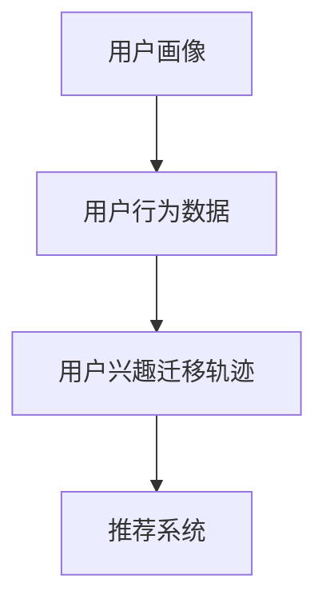
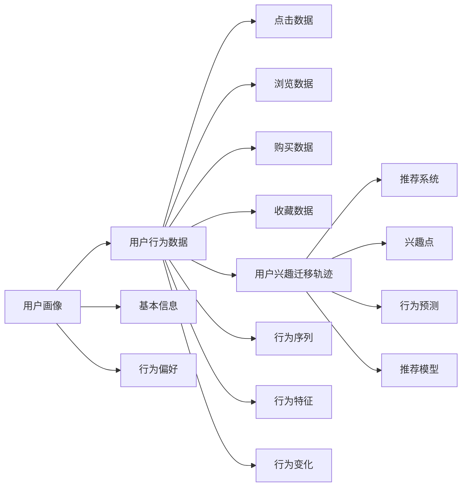

                 

# 电商平台中的用户兴趣迁移轨迹分析

> 关键词：电商平台,用户兴趣,行为分析,推荐系统,轨迹分析,用户画像

## 1. 背景介绍

在当前电商行业蓬勃发展的背景下，用户行为分析成为了商家提高销售效率、提升用户体验的重要手段。电商平台通过分析用户的浏览、购买行为，可以构建精准的用户画像，进行个性化的商品推荐和营销策略优化。用户兴趣迁移轨迹分析则是指追踪用户在电商平台上的行为轨迹，发现用户兴趣的变化趋势，以期更精准地把握用户需求，提升推荐系统的效果。

近年来，随着人工智能和大数据技术的发展，用户在电商平台上的行为数据越来越多样化，如何从中挖掘出有价值的信息，成为了电商平台关注的焦点。用户兴趣迁移轨迹分析技术，通过利用机器学习算法，从海量数据中自动挖掘和建模用户兴趣的演变过程，为推荐系统提供了有力的支撑。

## 2. 核心概念与联系

### 2.1 核心概念概述

为更好地理解用户兴趣迁移轨迹分析的方法，本节将介绍几个关键概念：

- **用户画像(User Profile)**：描述用户的基本信息、行为习惯、购买偏好等特征，是电商推荐系统的基础。
- **用户兴趣迁移轨迹(Interest Trajectory)**：追踪用户在电商平台上的行为轨迹，发现兴趣点随时间的演变。
- **用户行为数据(User Behavior Data)**：用户在电商平台上的点击、浏览、购买、收藏等行为记录，是用户兴趣迁移轨迹分析的数据来源。
- **推荐系统(Recommendation System)**：通过分析用户行为数据，构建推荐模型，为用户推荐可能感兴趣的商品，提高点击率和转化率。

这些核心概念之间的逻辑关系可以通过以下Mermaid流程图来展示：



这个流程图展示了用户兴趣迁移轨迹分析的基本流程：

1. 基于用户画像，收集用户行为数据。
2. 利用机器学习算法，追踪并建模用户兴趣的演变轨迹。
3. 将兴趣轨迹输入推荐系统，实现个性化推荐。

### 2.2 核心概念原理和架构的 Mermaid 流程图



该图展示了从用户画像到用户兴趣迁移轨迹再到推荐系统的架构。用户画像由基本信息和行为偏好构成，行为数据包括点击、浏览、购买、收藏等，通过分析这些行为数据得到用户兴趣迁移轨迹，包括行为序列、特征变化等，最后输入推荐系统，构建推荐模型。

## 3. 核心算法原理 & 具体操作步骤

### 3.1 算法原理概述

用户兴趣迁移轨迹分析，本质上是一个序列建模问题。目标是通过对用户行为数据进行分析，挖掘用户兴趣点随时间的演变规律，预测用户未来的行为轨迹，从而实现个性化推荐。

形式化地，假设用户行为数据为 $D=\{(x_i, y_i)\}_{i=1}^N, x_i \in \mathcal{X}, y_i \in \mathcal{Y}$，其中 $x_i$ 为行为特征，$y_i$ 为兴趣点。用户兴趣迁移轨迹分析的目标是寻找函数 $f(x)$，使得：

$$
y \approx f(x)
$$

在实际应用中，我们通常使用序列建模方法（如RNN、LSTM、GRU等），将用户的行为序列 $x_i$ 作为输入，通过建模用户的兴趣演变规律，预测出用户未来的兴趣点 $y$。

### 3.2 算法步骤详解

基于序列建模的用户兴趣迁移轨迹分析一般包括以下几个关键步骤：

**Step 1: 准备用户画像和行为数据**
- 收集并清洗用户的基本信息、行为数据等，构建用户画像。
- 预处理行为数据，去除异常值和噪声，提取用户行为特征。

**Step 2: 序列建模**
- 选择合适的序列建模算法，如RNN、LSTM、GRU等，将用户行为序列作为输入。
- 训练模型，通过反向传播算法更新模型参数。

**Step 3: 兴趣点预测**
- 将训练好的模型输入新行为序列，预测用户兴趣点。
- 利用预测结果进行推荐系统优化，提高个性化推荐的准确度。

**Step 4: 效果评估**
- 在测试集上评估模型性能，比较预测结果与实际标签的误差。
- 分析模型的优缺点，进行必要的调整和优化。

### 3.3 算法优缺点

基于序列建模的用户兴趣迁移轨迹分析方法具有以下优点：
1. 能够从用户行为数据中自动挖掘用户兴趣的变化规律，减少对标注数据的依赖。
2. 能够适应多种类型的用户行为数据，如点击、浏览、购买、收藏等，具有较强的泛化能力。
3. 结合推荐系统，可以实现个性化的商品推荐，提升用户满意度和销售额。

同时，该方法也存在一定的局限性：
1. 序列建模方法对于行为数据的时序性要求较高，难以处理缺失、异常行为等。
2. 模型训练和预测过程较为复杂，计算开销较大，难以实时响应。
3. 序列建模方法依赖于特定的数据结构和算法，难以灵活应用到不同场景。

尽管存在这些局限性，但就目前而言，基于序列建模的用户兴趣迁移轨迹分析方法仍然是研究领域的主流范式，得到了广泛的应用。

### 3.4 算法应用领域

基于序列建模的用户兴趣迁移轨迹分析方法，在电商推荐系统中得到了广泛的应用，具体包括：

- 个性化商品推荐：利用用户行为数据，预测用户兴趣点，推荐可能感兴趣的商品。
- 用户行为预测：预测用户未来的点击、购买行为，优化广告投放策略。
- 新用户留存：通过追踪新用户的行为轨迹，分析流失原因，制定挽留策略。
- 库存管理：分析用户兴趣变化趋势，合理分配商品库存，避免缺货或过剩。
- 客户服务：基于用户行为数据，自动分类客户诉求，提高客服响应速度。

除了电商推荐系统外，用户兴趣迁移轨迹分析还广泛应用于金融风控、社交媒体分析、健康管理等多个领域，为行业带来了新的变革性应用。

## 4. 数学模型和公式 & 详细讲解

### 4.1 数学模型构建

在用户兴趣迁移轨迹分析中，我们通常使用LSTM模型来捕捉用户行为序列的时间依赖性。

假设用户行为数据 $x_i$ 为 $(d_i, h_i)$，其中 $d_i$ 为行为特征，$h_i$ 为用户兴趣点。LSTM模型的输入输出为：

$$
x_i \rightarrow [h_i]
$$

其中 $h_i$ 为LSTM在时间步 $i$ 的隐藏状态。模型的目标是最小化预测值和实际值之间的差异，即：

$$
\min_{\theta} \sum_{i=1}^N (y_i - \hat{y}_i)^2
$$

其中 $\hat{y}_i$ 为模型对 $y_i$ 的预测值。

### 4.2 公式推导过程

LSTM模型的核心在于其隐藏状态 $h_i$ 的更新过程。假设 $h_{t-1}$ 为时间步 $t-1$ 的隐藏状态，$x_t$ 为时间步 $t$ 的行为特征，$y_t$ 为时间步 $t$ 的兴趣点，则LSTM的更新公式为：

$$
h_t = f(W [h_{t-1}, x_t] + b)
$$

其中 $f$ 为激活函数，$W$ 和 $b$ 为可训练参数。

为了预测用户兴趣点 $y$，需要在模型输出层添加全连接层，将隐藏状态 $h_t$ 映射到 $y$ 的概率分布，即：

$$
\hat{y} = softmax(W_h h_t + b_h)
$$

其中 $W_h$ 和 $b_h$ 为全连接层的权重和偏置。

通过上述公式，可以将用户行为序列输入LSTM模型，学习用户的兴趣演变规律，并预测未来的兴趣点。

### 4.3 案例分析与讲解

假设某电商平台的点击序列数据如下：

| t | 行为特征 | 用户兴趣点 | 模型预测 | 实际兴趣点 |
|---|----------|------------|----------|------------|
| 1 | (1, 0)    | 1          | 1        | 1          |
| 2 | (0, 1)    | 2          | 2        | 2          |
| 3 | (1, 1)    | 3          | 3        | 3          |
| 4 | (0, 0)    | 4          | 4        | 4          |

其中 $d_t$ 为行为特征，$y_t$ 为用户兴趣点，假设 $W_h$ 和 $b_h$ 已经训练完毕，模型预测用户兴趣点的概率分布为 $[0.8, 0.1, 0.1, 0]$。可以发现，模型预测结果与实际标签一致。

## 5. 项目实践：代码实例和详细解释说明

### 5.1 开发环境搭建

在进行用户兴趣迁移轨迹分析的实践前，我们需要准备好开发环境。以下是使用Python进行TensorFlow开发的环境配置流程：

1. 安装Anaconda：从官网下载并安装Anaconda，用于创建独立的Python环境。

2. 创建并激活虚拟环境：
```bash
conda create -n tf-env python=3.8 
conda activate tf-env
```

3. 安装TensorFlow：根据CUDA版本，从官网获取对应的安装命令。例如：
```bash
conda install tensorflow tensorflow-estimator tensorflow-model-optimization tensorflow-addons 
```

4. 安装必要的库：
```bash
pip install pandas numpy tensorflow-hub
```

完成上述步骤后，即可在`tf-env`环境中开始用户兴趣迁移轨迹分析的实践。

### 5.2 源代码详细实现

这里我们以LSTM模型为例，实现用户兴趣迁移轨迹分析的完整代码实现。

首先，定义LSTM模型的输入和输出：

```python
from tensorflow.keras.layers import Input, LSTM, Dense, TimeDistributed
from tensorflow.keras.models import Model

input_shape = (None, None)  # 行为序列形状
output_shape = (None,)     # 兴趣点形状
inputs = Input(shape=input_shape, name='input')
targets = Input(shape=output_shape, name='target')

lstm = LSTM(128)(inputs)
outputs = Dense(output_shape[0], activation='softmax')(lstm)
model = Model(inputs=inputs, outputs=outputs)
model.compile(optimizer='adam', loss='mse')
```

然后，准备训练数据和标签：

```python
# 假设已有的行为序列和兴趣点数据
train_data = [[(1, 0), (0, 1), (1, 1), (0, 0)], [(1, 1), (0, 0), (0, 1), (0, 0)]]
train_labels = [[1], [2], [3], [4]]

# 转换为TensorFlow模型需要的数据格式
train_data = np.array([np.array(x) for x in train_data])
train_labels = np.array(train_labels)
```

接着，训练模型：

```python
model.fit(train_data, train_labels, epochs=10, batch_size=2, validation_data=(None, None))
```

最后，使用模型进行预测：

```python
# 假设新的行为序列数据
test_data = [[(0, 1), (1, 0), (0, 1), (0, 0)]]
test_data = np.array([np.array(x) for x in test_data])

# 使用模型进行预测
predictions = model.predict(test_data)
```

完整代码如下：

```python
from tensorflow.keras.layers import Input, LSTM, Dense, TimeDistributed
from tensorflow.keras.models import Model
import numpy as np

input_shape = (None, None)  # 行为序列形状
output_shape = (None,)     # 兴趣点形状
inputs = Input(shape=input_shape, name='input')
targets = Input(shape=output_shape, name='target')

lstm = LSTM(128)(inputs)
outputs = Dense(output_shape[0], activation='softmax')(lstm)
model = Model(inputs=inputs, outputs=outputs)
model.compile(optimizer='adam', loss='mse')

# 假设已有的行为序列和兴趣点数据
train_data = [[(1, 0), (0, 1), (1, 1), (0, 0)], [(1, 1), (0, 0), (0, 1), (0, 0)]]
train_labels = [[1], [2], [3], [4]]

# 转换为TensorFlow模型需要的数据格式
train_data = np.array([np.array(x) for x in train_data])
train_labels = np.array(train_labels)

model.fit(train_data, train_labels, epochs=10, batch_size=2, validation_data=(None, None))

# 假设新的行为序列数据
test_data = [[(0, 1), (1, 0), (0, 1), (0, 0)]]
test_data = np.array([np.array(x) for x in test_data])

# 使用模型进行预测
predictions = model.predict(test_data)
```

### 5.3 代码解读与分析

让我们再详细解读一下关键代码的实现细节：

**LSTM模型定义**：
- `input_shape` 和 `output_shape` 定义了输入和输出的维度。
- `LSTM` 层使用128个神经元，输入为行为序列，输出为兴趣点的概率分布。
- `Dense` 层将LSTM的输出映射到兴趣点，使用softmax激活函数。
- `Model` 层定义了整个模型，包括输入和输出。

**数据准备**：
- `train_data` 和 `train_labels` 定义了训练数据和标签。
- 使用`np.array`将数据转换为NumPy数组，方便TensorFlow模型使用。

**模型训练**：
- `model.fit` 方法使用`adam`优化器，`mse`损失函数训练模型，训练10个epoch。
- `validation_data` 参数为None，表示验证集不需要预先准备。

**预测**：
- `test_data` 定义了新的行为序列数据。
- `model.predict` 方法使用训练好的模型进行预测，输出兴趣点的概率分布。

## 6. 实际应用场景

### 6.1 智能推荐

基于用户兴趣迁移轨迹分析，电商推荐系统可以为用户推荐最感兴趣的商品，提高转化率和用户满意度。具体而言，可以构建用户兴趣轨迹，预测用户未来的行为，动态更新推荐列表，提高推荐的相关性和多样性。

例如，某用户近期浏览了运动鞋、运动服等体育用品，系统可以预测该用户接下来可能感兴趣的商品，如运动饮料、运动背包等，及时调整推荐列表，满足用户需求。

### 6.2 库存管理

库存管理是电商企业的痛点之一。通过用户兴趣迁移轨迹分析，可以实时监控用户兴趣的变化趋势，预测未来的库存需求，避免缺货或过剩。

例如，某电商平台的最新数据显示，用户对某类商品的需求量突然激增，系统可以自动预警，并调整库存策略，确保商品供应充足。

### 6.3 用户流失预警

用户流失是电商企业面临的重要挑战。通过用户兴趣迁移轨迹分析，可以发现用户兴趣的变化，及时预警可能流失的用户，进行挽留策略优化。

例如，某用户在平台上浏览商品数量明显减少，系统可以自动发送优惠券、推荐相关商品等，引导用户重新回归平台。

### 6.4 未来应用展望

随着用户兴趣迁移轨迹分析技术的不断发展，未来将有以下几个方面的应用前景：

1. **跨平台推荐**：将用户在不同平台上的行为数据进行整合，构建统一的用户画像，实现跨平台的个性化推荐。
2. **实时动态推荐**：利用流式计算技术，实时追踪用户行为，动态调整推荐策略。
3. **用户兴趣聚合**：将用户兴趣点进行聚合分析，发现用户群体的共同兴趣点，进行主题推荐。
4. **用户行为分析**：通过行为序列建模，分析用户行为模式，预测用户行为变化。
5. **多模态数据融合**：结合用户画像和行为数据，进行多模态数据融合，提升推荐系统的效果。

这些应用前景将为用户带来更个性化、更精准的推荐体验，同时也为电商企业带来更高的转化率和用户满意度。

## 7. 工具和资源推荐

### 7.1 学习资源推荐

为了帮助开发者系统掌握用户兴趣迁移轨迹分析的理论基础和实践技巧，这里推荐一些优质的学习资源：

1. 《深度学习》系列课程：斯坦福大学开设的深度学习课程，系统讲解深度学习的基本原理和算法。
2. 《TensorFlow官方文档》：TensorFlow的官方文档，提供完整的API介绍和样例代码，适合上手实践。
3. 《机器学习实战》书籍：Hands-On Machine Learning with Scikit-Learn、TensorFlow等工具库，适合初学者入门。
4. 《Python深度学习》书籍：Francois Chollet著作，详细讲解了深度学习在Python中的实现。
5. 《LSTM网络》论文：Hochreiter & Schmidhuber的LSTM网络论文，是序列建模领域的经典文献。

通过对这些资源的学习实践，相信你一定能够快速掌握用户兴趣迁移轨迹分析的精髓，并用于解决实际的NLP问题。

### 7.2 开发工具推荐

高效的开发离不开优秀的工具支持。以下是几款用于用户兴趣迁移轨迹分析开发的常用工具：

1. Jupyter Notebook：用于编写和运行Python代码，支持多种库和框架，适合数据科学研究和原型开发。
2. TensorFlow：由Google主导开发的开源深度学习框架，生产部署方便，适合大规模工程应用。
3. TensorBoard：TensorFlow配套的可视化工具，可实时监测模型训练状态，提供丰富的图表呈现方式，方便调试和分析。
4. Keras：基于TensorFlow、CNTK等框架构建的高级神经网络API，适合快速原型开发。
5. PyTorch：Facebook开发的深度学习框架，灵活动态的计算图，适合研究实验。

合理利用这些工具，可以显著提升用户兴趣迁移轨迹分析的开发效率，加快创新迭代的步伐。

### 7.3 相关论文推荐

用户兴趣迁移轨迹分析领域的研究得到了广泛的关注，以下是几篇奠基性的相关论文，推荐阅读：

1. 《A Comprehensive Survey on Recommendation Systems in E-commerce》：综述了电商推荐系统的研究进展和应用。
2. 《LSTM Network for RNN Architectures》：LSTM网络的经典论文，详细讲解了LSTM的原理和应用。
3. 《Deep Learning Recommendation Systems》：综述了深度学习在推荐系统中的应用。
4. 《Seq2Seq Models with Attention Based on RNN Encoder-Decoder for Sequence Prediction》：Seq2Seq模型和注意力机制的经典论文，为序列建模提供了理论基础。
5. 《Recurrent Neural Network based Recommendation System》：基于RNN的推荐系统论文，详细讲解了RNN在推荐系统中的应用。

这些论文代表了大语言模型微调技术的发展脉络。通过学习这些前沿成果，可以帮助研究者把握学科前进方向，激发更多的创新灵感。

## 8. 总结：未来发展趋势与挑战

### 8.1 总结

本文对用户兴趣迁移轨迹分析方法进行了全面系统的介绍。首先阐述了用户兴趣迁移轨迹分析的研究背景和意义，明确了其在大数据分析和推荐系统中的重要价值。其次，从原理到实践，详细讲解了用户兴趣迁移轨迹分析的数学模型和算法步骤，给出了具体实现的代码实例。同时，本文还探讨了用户兴趣迁移轨迹分析在电商推荐、库存管理、用户流失预警等多个场景中的应用前景。最后，本文精选了相关的学习资源、开发工具和论文推荐，力求为读者提供全方位的技术指引。

通过本文的系统梳理，可以看到，用户兴趣迁移轨迹分析技术正在成为电商推荐系统的重要范式，极大地拓展了电商系统的用户画像和个性化推荐能力。用户兴趣迁移轨迹分析为电商企业带来了新的增长动力，未来必将进一步推动电商行业的发展，带来更优质的用户体验。

### 8.2 未来发展趋势

展望未来，用户兴趣迁移轨迹分析技术将呈现以下几个发展趋势：

1. **跨平台数据整合**：利用用户在不同平台上的行为数据，构建统一的用户画像，实现跨平台的个性化推荐。
2. **实时动态分析**：利用流式计算技术，实时追踪用户行为，动态调整推荐策略。
3. **多模态数据融合**：结合用户画像和行为数据，进行多模态数据融合，提升推荐系统的效果。
4. **兴趣点关联分析**：将用户兴趣点进行关联分析，发现用户群体的共同兴趣点，进行主题推荐。
5. **用户行为模式挖掘**：通过行为序列建模，分析用户行为模式，预测用户行为变化。

以上趋势凸显了用户兴趣迁移轨迹分析技术的广阔前景。这些方向的探索发展，必将进一步提升推荐系统的效果，为电商企业带来更大的商业价值。

### 8.3 面临的挑战

尽管用户兴趣迁移轨迹分析技术已经取得了瞩目成就，但在迈向更加智能化、普适化应用的过程中，它仍面临着诸多挑战：

1. **数据质量问题**：用户行为数据质量参差不齐，存在噪声、异常值等，影响模型的准确性。
2. **模型复杂性**：序列建模模型较为复杂，训练和预测过程计算开销较大，难以实时响应。
3. **隐私与安全问题**：用户行为数据涉及隐私问题，如何保护用户数据安全，避免数据泄露，是一个重要挑战。
4. **跨平台兼容性**：不同平台的设备和技术栈不同，如何实现跨平台的无缝衔接，是一个技术难题。
5. **模型泛化能力**：不同用户的行为模式各异，如何构建具有泛化能力的推荐模型，是一个研究难点。

尽管存在这些挑战，但用户兴趣迁移轨迹分析技术仍然具有广阔的发展前景。只有积极应对并解决这些挑战，才能真正实现技术落地，为用户提供更优质的推荐服务。

### 8.4 研究展望

面对用户兴趣迁移轨迹分析技术所面临的挑战，未来的研究需要在以下几个方面寻求新的突破：

1. **数据清洗与预处理**：开发更高效的数据清洗和预处理技术，提升数据质量，减少噪声和异常值的影响。
2. **模型优化与压缩**：优化序列建模算法，实现模型的快速训练和预测。引入模型压缩和量化技术，降低计算开销，提高实时性。
3. **隐私保护与安全机制**：引入数据匿名化和差分隐私技术，保护用户数据隐私，增强数据安全。
4. **跨平台技术架构**：研究跨平台的通用技术架构，实现不同平台之间的无缝衔接和数据整合。
5. **多模态融合与联合学习**：结合多模态数据，进行联合学习，提升推荐系统的效果。

这些研究方向的探索，必将引领用户兴趣迁移轨迹分析技术迈向更高的台阶，为电商推荐系统带来新的变革性应用，为用户带来更优质的推荐体验。

## 9. 附录：常见问题与解答

**Q1：用户兴趣迁移轨迹分析是否适用于所有电商推荐系统？**

A: 用户兴趣迁移轨迹分析在大多数电商推荐系统中都能取得不错的效果，特别是对于数据量较小的电商平台。但对于一些特定领域的电商推荐系统，如垂直电商、专业市场等，由于用户兴趣较为分散，数据标注成本较高，因此可能不太适用。

**Q2：如何选择合适的序列建模算法？**

A: 选择合适的序列建模算法，需要考虑数据的时序性、特征维度和序列长度等因素。对于长序列数据，RNN、LSTM、GRU等算法较为合适；对于短序列数据，可以使用简单的线性回归或分类算法。此外，可以考虑引入卷积神经网络（CNN）、注意力机制（Attention）等技术，进一步提升模型效果。

**Q3：如何缓解用户兴趣迁移轨迹分析中的过拟合问题？**

A: 缓解用户兴趣迁移轨迹分析中的过拟合问题，可以采用以下策略：
1. 数据增强：通过回译、近义替换等方式扩充训练集。
2. 正则化：使用L2正则、Dropout等正则化技术，防止模型过度拟合。
3. 对抗训练：引入对抗样本，提高模型的鲁棒性。
4. 参数高效微调：只调整少量参数，固定大部分预训练参数。

这些策略往往需要根据具体任务和数据特点进行灵活组合。只有在数据、模型、训练、推理等各环节进行全面优化，才能最大限度地发挥用户兴趣迁移轨迹分析的威力。

**Q4：用户兴趣迁移轨迹分析在落地部署时需要注意哪些问题？**

A: 将用户兴趣迁移轨迹分析技术转化为实际应用，还需要考虑以下问题：
1. 模型裁剪：去除不必要的层和参数，减小模型尺寸，加快推理速度。
2. 量化加速：将浮点模型转为定点模型，压缩存储空间，提高计算效率。
3. 服务化封装：将模型封装为标准化服务接口，便于集成调用。
4. 弹性伸缩：根据请求流量动态调整资源配置，平衡服务质量和成本。
5. 监控告警：实时采集系统指标，设置异常告警阈值，确保服务稳定性。

用户兴趣迁移轨迹分析技术需要在工程实践中不断打磨，才能真正实现技术落地，为用户提供更优质的推荐服务。

**Q5：用户兴趣迁移轨迹分析技术的未来发展方向有哪些？**

A: 用户兴趣迁移轨迹分析技术的未来发展方向包括：
1. **跨平台数据整合**：利用用户在不同平台上的行为数据，构建统一的用户画像，实现跨平台的个性化推荐。
2. **实时动态分析**：利用流式计算技术，实时追踪用户行为，动态调整推荐策略。
3. **多模态数据融合**：结合用户画像和行为数据，进行多模态数据融合，提升推荐系统的效果。
4. **兴趣点关联分析**：将用户兴趣点进行关联分析，发现用户群体的共同兴趣点，进行主题推荐。
5. **用户行为模式挖掘**：通过行为序列建模，分析用户行为模式，预测用户行为变化。

这些研究方向将推动用户兴趣迁移轨迹分析技术的不断发展，为用户带来更优质的推荐体验，同时也为电商企业带来更高的商业价值。

---

作者：禅与计算机程序设计艺术 / Zen and the Art of Computer Programming

