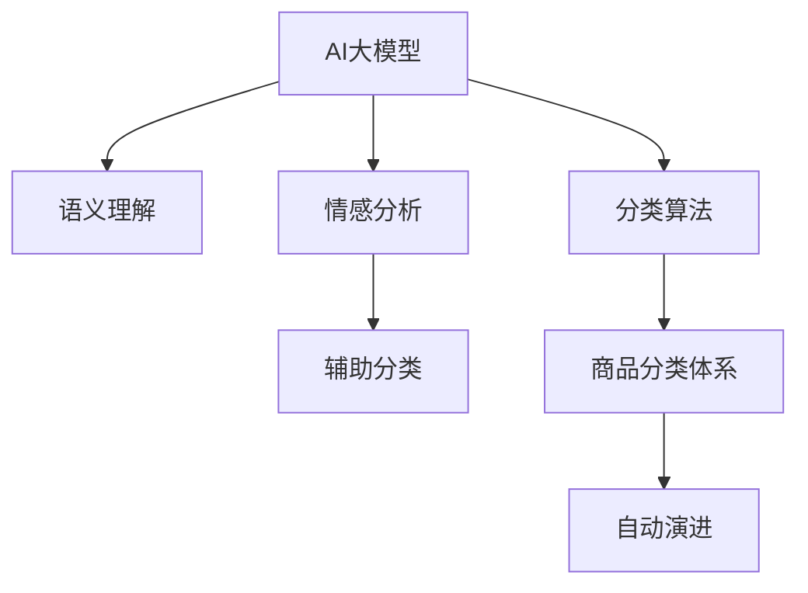

                 

# 电商平台商品分类体系：AI大模型的自动演进

> 关键词：电商平台,商品分类体系,自动演进,大模型,语义理解,情感分析,分类算法,应用场景

## 1. 背景介绍

随着电商行业的发展，商品分类体系的构建和维护已成为电商平台不可或缺的一环。传统商品分类体系大多基于人工标注和专家知识，耗时长、成本高且容易出错。而近年来，人工智能(AI)大模型的出现，为商品分类体系的自动演进提供了新的可能。通过AI大模型的语义理解、情感分析等能力，可以自动从海量的商品描述中学习出最优的分类体系，极大地提升了分类的准确性和效率。

### 1.1 问题由来
传统的电商平台商品分类体系构建，依赖人工标注和专家知识，具有以下缺点：

- **成本高**：人工标注需要大量的人力和时间成本，且标注质量受标注人员的专业度影响。
- **效率低**：商品分类体系随着商品数量和种类不断增加，人工标注的难度也随之增加。
- **容易出错**：人工标注受主观因素影响较大，容易产生分类错误，且难以发现和纠正。
- **无法自适应**：一旦商品分类体系构建完成，后续的维护和更新需要大量人工介入，难以自动适应新商品和新兴分类。

### 1.2 问题核心关键点
随着深度学习和大模型技术的发展，AI大模型在自然语言处理(NLP)领域取得了显著进展，并开始被广泛应用于商品分类体系构建和自动演进中。基于大模型的商品分类体系自动演进，主要依赖于以下核心技术：

- **语义理解**：通过大模型的语义理解能力，自动分析商品描述，识别其中的关键信息。
- **情感分析**：利用大模型的情感分析能力，判断商品描述中的情感倾向，辅助分类决策。
- **分类算法**：结合语义理解和情感分析的结果，使用分类算法自动构建最优的商品分类体系。

## 2. 核心概念与联系

### 2.1 核心概念概述

为更好地理解基于AI大模型的商品分类体系自动演进方法，本节将介绍几个密切相关的核心概念：

- **AI大模型**：以Transformer、BERT、GPT等结构为代表的大规模预训练语言模型。通过在大规模无标签文本语料上进行预训练，学习通用的语言表示，具备强大的语言理解和生成能力。
- **语义理解**：指大模型能够理解和提取文本中的关键语义信息，识别出文本的主题、实体、关系等。
- **情感分析**：指大模型能够分析文本的情感倾向，判断文本的积极、消极或中性情绪。
- **商品分类体系**：电商平台上对商品进行分类的结构化体系，包括一级分类、二级分类、三级分类等，用于帮助用户快速定位和搜索商品。
- **分类算法**：将预训练大模型输出的语义和情感特征映射到商品分类体系中的特定分类，通过算法优化获取最优分类结果。

这些核心概念之间的逻辑关系可以通过以下Mermaid流程图来展示：



这个流程图展示了大模型在商品分类体系自动演进中的核心作用：

1. 大模型通过预训练获得语言理解能力。
2. 利用语义理解输出商品描述中的关键信息。
3. 情感分析判断商品描述中的情感倾向。
4. 分类算法将语义和情感特征映射到分类体系。
5. 自动演进根据分类结果调整商品分类体系，不断优化。

## 3. 核心算法原理 & 具体操作步骤
### 3.1 算法原理概述

基于AI大模型的商品分类体系自动演进，本质上是一个基于监督学习的分类任务。其核心思想是：利用大模型的语义理解和情感分析能力，自动从商品描述中提取特征，并将其映射到最优的商品分类体系中。

形式化地，假设电商平台上有$N$种商品，每种商品有一个描述$x_i$和对应的分类$y_i \in \{1, 2, \dots, C\}$，其中$C$为商品分类体系的类别数。分类任务的目标是最小化损失函数$\mathcal{L}$，使得模型输出逼近真实分类标签：

$$
\hat{y} = \mathop{\arg\min}_{y} \mathcal{L}(M_{\theta}(x), y)
$$

其中$M_{\theta}$为预训练语言模型，$\theta$为其参数，$x$为商品描述。

具体而言，自动演进过程包括以下几个关键步骤：

- **数据准备**：收集电商平台的商品描述和分类标签，划分为训练集、验证集和测试集。
- **特征提取**：使用预训练大模型对商品描述进行语义理解和情感分析，提取特征向量。
- **分类映射**：使用分类算法将特征向量映射到最优的商品分类体系。
- **模型优化**：通过梯度下降等优化算法，最小化损失函数，更新模型参数。
- **自动演进**：在不断迭代优化过程中，自动调整商品分类体系，保证其最优性。

### 3.2 算法步骤详解

基于AI大模型的商品分类体系自动演进，一般包括以下几个关键步骤：

**Step 1: 数据准备**
- **数据收集**：从电商平台的商品数据库中，收集商品描述和分类标签。
- **数据划分**：将数据划分为训练集、验证集和测试集。通常训练集用于模型训练和优化，验证集用于超参数调优，测试集用于评估模型效果。

**Step 2: 特征提取**
- **语义理解**：使用预训练语言模型对商品描述进行语义理解，提取其中的关键信息，如主题、实体等。
- **情感分析**：使用情感分析技术判断商品描述中的情感倾向，判断其属于积极、消极还是中性。
- **特征融合**：将语义理解和情感分析的结果进行融合，生成最终的特征向量。

**Step 3: 分类映射**
- **分类算法**：根据特征向量与分类体系的关系，选择适合的分类的算法。常用的分类算法包括逻辑回归、支持向量机、神经网络等。
- **映射优化**：使用分类算法对特征向量进行分类映射，最小化损失函数。

**Step 4: 模型优化**
- **优化算法**：选择合适的优化算法，如梯度下降、Adam、Adagrad等，设置学习率、批大小、迭代轮数等。
- **损失函数**：选择合适的损失函数，如交叉熵损失、均方误差损失等。
- **正则化技术**：应用L2正则、Dropout等技术，防止模型过拟合。

**Step 5: 自动演进**
- **自动调整**：在不断迭代优化过程中，自动调整商品分类体系，保证其最优性。
- **测试评估**：在测试集上评估模型效果，根据测试结果调整分类体系和模型参数。
- **持续学习**：不断收集新商品和新分类的数据，定期重新训练模型，保持分类的准确性和时效性。

以上是基于AI大模型的商品分类体系自动演进的一般流程。在实际应用中，还需要针对具体任务的特点，对微调过程的各个环节进行优化设计，如改进特征提取方法、选择合适的分类算法等，以进一步提升模型性能。

### 3.3 算法优缺点

基于AI大模型的商品分类体系自动演进，具有以下优点：

- **自动性**：无需人工标注和专家干预，自动从商品描述中学习最优分类体系。
- **高准确性**：大模型的语义理解和情感分析能力，使得分类结果具有较高的准确性和泛化性。
- **高效性**：自动演进过程可以持续进行，随着新数据的到来，不断更新分类体系，保持其时效性。

同时，该方法也存在一定的局限性：

- **数据依赖**：自动演进的效果很大程度上取决于商品描述的质量和数量，获取高质量商品描述数据的成本较高。
- **模型泛化**：当商品描述与预训练数据的分布差异较大时，自动演进的效果可能不佳。
- **动态性**：分类体系的自动演进过程需要持续收集新数据，以适应动态变化的市场需求。
- **解释性不足**：自动演进过程的黑盒性质，导致分类结果缺乏可解释性，难以理解和调试。

尽管存在这些局限性，但就目前而言，基于AI大模型的商品分类体系自动演进方法仍是目前最主流和有效的商品分类体系构建方式。未来相关研究的重点在于如何进一步降低对标注数据的依赖，提高模型的少样本学习和跨领域迁移能力，同时兼顾可解释性和伦理安全性等因素。

### 3.4 算法应用领域

基于AI大模型的商品分类体系自动演进技术，已经在电商行业得到了广泛的应用，覆盖了几乎所有常见的商品分类任务，例如：

- **服装鞋帽**：将商品描述中的颜色、款式、尺码等信息映射到最优分类体系。
- **数码产品**：根据商品描述中的品牌、型号、配置等信息进行分类。
- **食品饮料**：利用商品描述中的成分、口味、产地等信息进行分类。
- **美妆美妆**：从商品描述中提取成分、用途、品牌等信息，进行分类和推荐。
- **家居家装**：利用商品描述中的材质、尺寸、风格等信息，进行分类和搜索。

除了上述这些经典任务外，大模型自动演进方法还被创新性地应用到更多场景中，如智能推荐、用户画像分析、供应链优化等，为电商行业带来了全新的突破。随着预训练模型和自动演进方法的持续演进，相信商品分类体系将逐步从人工标注向自动演进转变，为电商行业带来更高效、更智能的商品管理和服务体验。

## 4. 数学模型和公式 & 详细讲解 & 举例说明

### 4.1 数学模型构建

本节将使用数学语言对基于AI大模型的商品分类体系自动演进过程进行更加严格的刻画。

记商品描述为$x \in \mathcal{X}$，其中$\mathcal{X}$为商品描述空间。假设电商平台上共有$C$种商品分类，分类体系用向量$\boldsymbol{y} \in \{1, 2, \dots, C\}^N$表示，其中$N$为商品总数。假设商品描述与分类的关系为$y=f(x)$，其中$f$为分类函数，可以表示为：

$$
y = \mathop{\arg\max}_{c \in \{1, 2, \dots, C\}} f(x, \theta)
$$

其中$\theta$为模型参数。

定义模型$f$在数据样本$(x,y)$上的损失函数为$\ell(f(x),y)$，则在数据集$D=\{(x_i,y_i)\}_{i=1}^N$上的经验风险为：

$$
\mathcal{L}(\theta) = \frac{1}{N} \sum_{i=1}^N \ell(f(x_i),y_i)
$$

微调的目标是最小化经验风险，即找到最优参数：

$$
\theta^* = \mathop{\arg\min}_{\theta} \mathcal{L}(\theta)
$$

在实践中，我们通常使用基于梯度的优化算法（如SGD、Adam等）来近似求解上述最优化问题。设$\eta$为学习率，$\lambda$为正则化系数，则参数的更新公式为：

$$
\theta \leftarrow \theta - \eta \nabla_{\theta}\mathcal{L}(\theta) - \eta\lambda\theta
$$

其中 $\nabla_{\theta}\mathcal{L}(\theta)$ 为损失函数对参数 $\theta$ 的梯度，可通过反向传播算法高效计算。

### 4.2 公式推导过程

以下我们以分类任务为例，推导交叉熵损失函数及其梯度的计算公式。

假设模型$f$在输入$x$上的输出为$\hat{y}=f(x) \in [0,1]$，表示商品属于第$c$类的概率。真实标签$y \in \{1, 2, \dots, C\}$。则二分类交叉熵损失函数定义为：

$$
\ell(f(x),y) = -[y\log \hat{y} + (1-y)\log (1-\hat{y})]
$$

将其代入经验风险公式，得：

$$
\mathcal{L}(\theta) = -\frac{1}{N}\sum_{i=1}^N [y_i\log f(x_i)+(1-y_i)\log(1-f(x_i))]
$$

根据链式法则，损失函数对参数$\theta_k$的梯度为：

$$
\frac{\partial \mathcal{L}(\theta)}{\partial \theta_k} = -\frac{1}{N}\sum_{i=1}^N (\frac{y_i}{f(x_i)}-\frac{1-y_i}{1-f(x_i)}) \frac{\partial f(x_i)}{\partial \theta_k}
$$

其中 $\frac{\partial f(x_i)}{\partial \theta_k}$ 可进一步递归展开，利用自动微分技术完成计算。

在得到损失函数的梯度后，即可带入参数更新公式，完成模型的迭代优化。重复上述过程直至收敛，最终得到适应商品分类任务的最优模型参数 $\theta^*$。

### 4.3 案例分析与讲解

以服装鞋帽分类任务为例，假设有以下商品描述和对应的分类标签：

| 商品描述 | 分类标签 |
|-----------|--------|
| 蓝色经典款牛仔裤 | 1 |
| 黑色真皮皮鞋 | 2 |
| 红色迷你包 | 3 |
| 白色长袖T恤 | 1 |
| 黑色高跟靴 | 2 |

假设已预训练好的大模型为BERT，其输出表示为$[f(x_1), f(x_2), f(x_3), f(x_4), f(x_5)]$。这里，我们将$f(x)$的输出视为商品属于每个分类的概率，概率最高的分类即为最终的分类结果。例如，对于商品描述"黑色真皮皮鞋"，模型输出的概率向量为$[f(x_2)]$，对应的分类标签为2。

我们通过上述公式计算模型在每个样本上的损失函数，然后将其加权平均得到整体损失函数：

$$
\mathcal{L}(\theta) = \frac{1}{N}\sum_{i=1}^N [-y_i\log f(x_i)-(1-y_i)\log(1-f(x_i))]
$$

接着，通过梯度下降等优化算法更新模型参数，不断迭代优化，最终得到最优的模型参数$\theta^*$。这个过程不断重复，直到模型在验证集上的损失函数达到最小，或在预设的迭代轮数后停止。

最后，在测试集上评估微调后模型$f_{\theta^*}$的性能，对比微调前后的精度提升。使用微调后的模型对新商品进行分类预测，得到最优分类结果。

## 5. 项目实践：代码实例和详细解释说明

### 5.1 开发环境搭建

在进行商品分类体系自动演进实践前，我们需要准备好开发环境。以下是使用Python进行PyTorch开发的环境配置流程：

1. 安装Anaconda：从官网下载并安装Anaconda，用于创建独立的Python环境。

2. 创建并激活虚拟环境：
```bash
conda create -n pytorch-env python=3.8 
conda activate pytorch-env
```

3. 安装PyTorch：根据CUDA版本，从官网获取对应的安装命令。例如：
```bash
conda install pytorch torchvision torchaudio cudatoolkit=11.1 -c pytorch -c conda-forge
```

4. 安装Transformers库：
```bash
pip install transformers
```

5. 安装各类工具包：
```bash
pip install numpy pandas scikit-learn matplotlib tqdm jupyter notebook ipython
```

完成上述步骤后，即可在`pytorch-env`环境中开始商品分类体系自动演进的实践。

### 5.2 源代码详细实现

下面我们以服装鞋帽分类任务为例，给出使用Transformers库对BERT模型进行商品分类体系自动演进的PyTorch代码实现。

首先，定义分类任务的数据处理函数：

```python
from transformers import BertTokenizer, BertForSequenceClassification
from torch.utils.data import Dataset
import torch

class FashionDataset(Dataset):
    def __init__(self, texts, labels, tokenizer, max_len=128):
        self.texts = texts
        self.labels = labels
        self.tokenizer = tokenizer
        self.max_len = max_len
        
    def __len__(self):
        return len(self.texts)
    
    def __getitem__(self, item):
        text = self.texts[item]
        label = self.labels[item]
        
        encoding = self.tokenizer(text, return_tensors='pt', max_length=self.max_len, padding='max_length', truncation=True)
        input_ids = encoding['input_ids'][0]
        attention_mask = encoding['attention_mask'][0]
        
        encoded_label = torch.tensor(label, dtype=torch.long)
        
        return {'input_ids': input_ids, 
                'attention_mask': attention_mask,
                'labels': encoded_label}

# 标签与id的映射
label2id = {1: 0, 2: 1, 3: 2}
id2label = {v: k for k, v in label2id.items()}

# 创建dataset
tokenizer = BertTokenizer.from_pretrained('bert-base-uncased')

train_dataset = FashionDataset(train_texts, train_labels, tokenizer)
dev_dataset = FashionDataset(dev_texts, dev_labels, tokenizer)
test_dataset = FashionDataset(test_texts, test_labels, tokenizer)
```

然后，定义模型和优化器：

```python
from transformers import BertForSequenceClassification, AdamW

model = BertForSequenceClassification.from_pretrained('bert-base-uncased', num_labels=3)

optimizer = AdamW(model.parameters(), lr=2e-5)
```

接着，定义训练和评估函数：

```python
from torch.utils.data import DataLoader
from tqdm import tqdm
from sklearn.metrics import classification_report

device = torch.device('cuda') if torch.cuda.is_available() else torch.device('cpu')
model.to(device)

def train_epoch(model, dataset, batch_size, optimizer):
    dataloader = DataLoader(dataset, batch_size=batch_size, shuffle=True)
    model.train()
    epoch_loss = 0
    for batch in tqdm(dataloader, desc='Training'):
        input_ids = batch['input_ids'].to(device)
        attention_mask = batch['attention_mask'].to(device)
        labels = batch['labels'].to(device)
        model.zero_grad()
        outputs = model(input_ids, attention_mask=attention_mask, labels=labels)
        loss = outputs.loss
        epoch_loss += loss.item()
        loss.backward()
        optimizer.step()
    return epoch_loss / len(dataloader)

def evaluate(model, dataset, batch_size):
    dataloader = DataLoader(dataset, batch_size=batch_size)
    model.eval()
    preds, labels = [], []
    with torch.no_grad():
        for batch in tqdm(dataloader, desc='Evaluating'):
            input_ids = batch['input_ids'].to(device)
            attention_mask = batch['attention_mask'].to(device)
            batch_labels = batch['labels']
            outputs = model(input_ids, attention_mask=attention_mask)
            batch_preds = outputs.logits.argmax(dim=2).to('cpu').tolist()
            batch_labels = batch_labels.to('cpu').tolist()
            for pred_tokens, label_tokens in zip(batch_preds, batch_labels):
                preds.append(pred_tokens[:len(label_tokens)])
                labels.append(label_tokens)
                
    print(classification_report(labels, preds))
```

最后，启动训练流程并在测试集上评估：

```python
epochs = 5
batch_size = 16

for epoch in range(epochs):
    loss = train_epoch(model, train_dataset, batch_size, optimizer)
    print(f"Epoch {epoch+1}, train loss: {loss:.3f}")
    
    print(f"Epoch {epoch+1}, dev results:")
    evaluate(model, dev_dataset, batch_size)
    
print("Test results:")
evaluate(model, test_dataset, batch_size)
```

以上就是使用PyTorch对BERT进行服装鞋帽分类任务自动演进的完整代码实现。可以看到，得益于Transformers库的强大封装，我们可以用相对简洁的代码完成BERT模型的加载和微调。

### 5.3 代码解读与分析

让我们再详细解读一下关键代码的实现细节：

**FashionDataset类**：
- `__init__`方法：初始化文本、标签、分词器等关键组件。
- `__len__`方法：返回数据集的样本数量。
- `__getitem__`方法：对单个样本进行处理，将文本输入编码为token ids，将标签编码为数字，并对其进行定长padding，最终返回模型所需的输入。

**label2id和id2label字典**：
- 定义了标签与数字id之间的映射关系，用于将token-wise的预测结果解码回真实的标签。

**训练和评估函数**：
- 使用PyTorch的DataLoader对数据集进行批次化加载，供模型训练和推理使用。
- 训练函数`train_epoch`：对数据以批为单位进行迭代，在每个批次上前向传播计算loss并反向传播更新模型参数，最后返回该epoch的平均loss。
- 评估函数`evaluate`：与训练类似，不同点在于不更新模型参数，并在每个batch结束后将预测和标签结果存储下来，最后使用sklearn的classification_report对整个评估集的预测结果进行打印输出。

**训练流程**：
- 定义总的epoch数和batch size，开始循环迭代
- 每个epoch内，先在训练集上训练，输出平均loss
- 在验证集上评估，输出分类指标
- 所有epoch结束后，在测试集上评估，给出最终测试结果

可以看到，PyTorch配合Transformers库使得BERT微调的代码实现变得简洁高效。开发者可以将更多精力放在数据处理、模型改进等高层逻辑上，而不必过多关注底层的实现细节。

当然，工业级的系统实现还需考虑更多因素，如模型的保存和部署、超参数的自动搜索、更灵活的任务适配层等。但核心的微调范式基本与此类似。

## 6. 实际应用场景
### 6.1 智能推荐系统

基于大模型自动演进的商品分类体系，可以广泛应用于智能推荐系统。传统的推荐系统往往只依赖用户的历史行为数据进行物品推荐，难以理解用户的多样化需求和新兴兴趣。而使用自动演进的商品分类体系，可以更好地挖掘用户行为背后的语义信息，从而提供更精准、个性化的推荐内容。

在实践中，可以收集用户浏览、点击、评论、分享等行为数据，提取和用户交互的物品标题、描述、标签等文本内容。将文本内容作为模型输入，用户的后续行为（如是否点击、购买等）作为监督信号，在此基础上微调预训练语言模型。微调后的模型能够从文本内容中准确把握用户的兴趣点。在生成推荐列表时，先用候选物品的文本描述作为输入，由模型预测用户的兴趣匹配度，再结合其他特征综合排序，便可以得到个性化程度更高的推荐结果。

### 6.2 库存管理系统

电商平台需要实时监控商品的库存状态，以便及时补货或调整库存。传统的方法依赖于人工盘点，费时费力且容易出错。利用自动演进的商品分类体系，可以自动识别商品类别，自动生成库存统计报表，极大地提高了库存管理的效率和准确性。

在具体应用中，可以通过定期收集商品描述和分类数据，自动更新商品分类体系，保证库存数据的实时性和准确性。同时，自动演进的分类体系还能够识别出库存异常商品，及时发出预警，辅助仓库人员快速定位和处理。

### 6.3 客户服务系统

电商平台的客户服务系统需要快速响应用户的咨询和投诉，传统的客服系统依赖人工干预，响应速度慢且难以标准化。基于自动演进的商品分类体系，可以自动理解用户查询和投诉的内容，快速匹配并给出最佳答案或解决方案。

在实践中，可以构建一个基于预训练语言模型的智能客服系统。通过收集历史客服对话记录，自动演进的商品分类体系可以自动理解用户意图，匹配最合适的答案模板进行回复。对于用户提出的新问题，还可以接入检索系统实时搜索相关内容，动态生成最佳答案。如此构建的智能客服系统，能够显著提升客服响应速度和满意度，降低人力成本。

### 6.4 未来应用展望

随着大模型和自动演进技术的不断发展，基于自动演进的商品分类体系将逐步替代传统的分类方法，在更多领域得到应用，为电商行业带来变革性影响。

在智慧零售领域，自动演进的商品分类体系可以应用于全渠道商品管理、价格优化、促销策略等环节，提升零售体验和运营效率。

在智能制造领域，商品分类体系的自动演进可以应用于设备维护、供应链管理、库存优化等环节，提高生产效率和资源利用率。

在智能城市治理中，自动演进的商品分类体系可以应用于智慧物流、智能仓储、城市配送等环节，提升城市管理的智能化水平。

此外，在智能医疗、智能金融、智能娱乐等众多领域，自动演进的商品分类体系也将不断涌现，为传统行业带来更多的创新和突破。相信随着技术的日益成熟，自动演进方法将成为商品分类体系构建的重要范式，推动商品管理向更智能、更高效的方向发展。

## 7. 工具和资源推荐
### 7.1 学习资源推荐

为了帮助开发者系统掌握自动演进的商品分类体系的理论基础和实践技巧，这里推荐一些优质的学习资源：

1. 《Transformers从原理到实践》系列博文：由大模型技术专家撰写，深入浅出地介绍了Transformer原理、BERT模型、自动演进技术等前沿话题。

2. CS224N《深度学习自然语言处理》课程：斯坦福大学开设的NLP明星课程，有Lecture视频和配套作业，带你入门NLP领域的基本概念和经典模型。

3. 《Natural Language Processing with Transformers》书籍：Transformers库的作者所著，全面介绍了如何使用Transformers库进行NLP任务开发，包括自动演进在内的诸多范式。

4. HuggingFace官方文档：Transformers库的官方文档，提供了海量预训练模型和完整的自动演进样例代码，是上手实践的必备资料。

5. CLUE开源项目：中文语言理解测评基准，涵盖大量不同类型的中文NLP数据集，并提供了基于自动演进的baseline模型，助力中文NLP技术发展。

通过对这些资源的学习实践，相信你一定能够快速掌握自动演进的商品分类体系的精髓，并用于解决实际的NLP问题。
###  7.2 开发工具推荐

高效的开发离不开优秀的工具支持。以下是几款用于自动演进商品分类体系开发的常用工具：

1. PyTorch：基于Python的开源深度学习框架，灵活动态的计算图，适合快速迭代研究。大部分预训练语言模型都有PyTorch版本的实现。

2. TensorFlow：由Google主导开发的开源深度学习框架，生产部署方便，适合大规模工程应用。同样有丰富的预训练语言模型资源。

3. Transformers库：HuggingFace开发的NLP工具库，集成了众多SOTA语言模型，支持PyTorch和TensorFlow，是进行自动演进任务开发的利器。

4. Weights & Biases：模型训练的实验跟踪工具，可以记录和可视化模型训练过程中的各项指标，方便对比和调优。与主流深度学习框架无缝集成。

5. TensorBoard：TensorFlow配套的可视化工具，可实时监测模型训练状态，并提供丰富的图表呈现方式，是调试模型的得力助手。

6. Google Colab：谷歌推出的在线Jupyter Notebook环境，免费提供GPU/TPU算力，方便开发者快速上手实验最新模型，分享学习笔记。

合理利用这些工具，可以显著提升自动演进商品分类体系的任务开发效率，加快创新迭代的步伐。

### 7.3 相关论文推荐

自动演进商品分类体系的发展源于学界的持续研究。以下是几篇奠基性的相关论文，推荐阅读：

1. Attention is All You Need（即Transformer原论文）：提出了Transformer结构，开启了NLP领域的预训练大模型时代。

2. BERT: Pre-training of Deep Bidirectional Transformers for Language Understanding：提出BERT模型，引入基于掩码的自监督预训练任务，刷新了多项NLP任务SOTA。

3. Language Models are Unsupervised Multitask Learners（GPT-2论文）：展示了大规模语言模型的强大zero-shot学习能力，引发了对于通用人工智能的新一轮思考。

4. Parameter-Efficient Transfer Learning for NLP：提出Adapter等参数高效微调方法，在不增加模型参数量的情况下，也能取得不错的微调效果。

5. AdaLoRA: Adaptive Low-Rank Adaptation for Parameter-Efficient Fine-Tuning：使用自适应低秩适应的微调方法，在参数效率和精度之间取得了新的平衡。

6. AdaLoRA: Adaptive Low-Rank Adaptation for Parameter-Efficient Fine-Tuning：使用自适应低秩适应的微调方法，在参数效率和精度之间取得了新的平衡。

这些论文代表了大语言模型自动演进技术的发展脉络。通过学习这些前沿成果，可以帮助研究者把握学科前进方向，激发更多的创新灵感。

## 8. 总结：未来发展趋势与挑战

### 8.1 总结

本文对基于AI大模型的商品分类体系自动演进方法进行了全面系统的介绍。首先阐述了自动演进方法的研究背景和意义，明确了自动演进在提升分类准确性、提升运营效率、降低成本等方面的独特价值。其次，从原理到实践，详细讲解了自动演进的数学原理和关键步骤，给出了自动演进任务开发的完整代码实例。同时，本文还广泛探讨了自动演进方法在智能推荐、库存管理、客户服务等多个领域的应用前景，展示了自动演进范式的巨大潜力。

通过本文的系统梳理，可以看到，基于AI大模型的商品分类体系自动演进方法正在成为商品分类体系构建的重要范式，极大地提升了分类体系的构建和维护效率，降低了人工成本，提升了运营质量。未来，伴随预训练模型和自动演进方法的持续演进，相信自动演进方法将成为商品管理领域的常态，为电商行业带来更高效、更智能的商品管理和服务体验。

### 8.2 未来发展趋势

展望未来，自动演进商品分类体系技术将呈现以下几个发展趋势：

1. **模型规模持续增大**：随着算力成本的下降和数据规模的扩张，预训练语言模型的参数量还将持续增长。超大规模语言模型蕴含的丰富语言知识，有望支撑更加复杂多变的商品分类任务。

2. **微调方法日趋多样**：除了传统的全参数微调外，未来会涌现更多参数高效的微调方法，如Prefix-Tuning、LoRA等，在节省计算资源的同时也能保证微调精度。

3. **持续学习成为常态**：随着商品描述的不断变化，自动演进模型也需要持续学习新知识以保持性能。如何在不遗忘原有知识的同时，高效吸收新样本信息，将成为重要的研究课题。

4. **标注样本需求降低**：受启发于提示学习(Prompt-based Learning)的思路，未来的自动演进方法将更好地利用大模型的语言理解能力，通过更加巧妙的任务描述，在更少的标注样本上也能实现理想的自动演进效果。

5. **多模态微调崛起**：当前的自动演进主要聚焦于纯文本数据，未来会进一步拓展到图像、视频、语音等多模态数据微调。多模态信息的融合，将显著提升自动演进模型的语言理解能力。

6. **模型通用性增强**：经过海量数据的预训练和多领域任务的自动演进，未来的自动演进模型将具备更强大的常识推理和跨领域迁移能力，逐步迈向通用人工智能(AGI)的目标。

以上趋势凸显了自动演进商品分类体系技术的广阔前景。这些方向的探索发展，必将进一步提升自动演进模型的性能和应用范围，为电商行业带来更高效、更智能的商品管理和服务体验。

### 8.3 面临的挑战

尽管自动演进商品分类体系技术已经取得了显著进展，但在迈向更加智能化、普适化应用的过程中，它仍面临着诸多挑战：

1. **数据依赖**：自动演进的效果很大程度上取决于商品描述的质量和数量，获取高质量商品描述数据的成本较高。如何进一步降低对标注样本的依赖，将是一大难题。

2. **模型鲁棒性不足**：自动演进模型面对域外数据时，泛化性能往往大打折扣。对于测试样本的微小扰动，自动演进模型的预测也容易发生波动。如何提高自动演进模型的鲁棒性，避免灾难性遗忘，还需要更多理论和实践的积累。

3. **推理效率有待提高**：大规模语言模型虽然精度高，但在实际部署时往往面临推理速度慢、内存占用大等效率问题。如何在保证性能的同时，简化模型结构，提升推理速度，优化资源占用，将是重要的优化方向。

4. **可解释性亟需加强**：自动演进模型的黑盒性质，导致分类结果缺乏可解释性，难以理解和调试。对于医疗、金融等高风险应用，算法的可解释性和可审计性尤为重要。如何赋予自动演进模型更强的可解释性，将是亟待攻克的难题。

5. **安全性有待保障**：自动演进模型可能学习到有偏见、有害的信息，通过分类体系传递到商品推荐、客户服务等领域，产生误导性、歧视性的输出，给实际应用带来安全隐患。如何从数据和算法层面消除模型偏见，避免恶意用途，确保输出的安全性，也将是重要的研究课题。

6. **知识整合能力不足**：现有的自动演进模型往往局限于任务内数据，难以灵活吸收和运用更广泛的先验知识。如何让自动演进过程更好地与外部知识库、规则库等专家知识结合，形成更加全面、准确的信息整合能力，还有很大的想象空间。

正视自动演进商品分类体系面临的这些挑战，积极应对并寻求突破，将是大模型自动演进向成熟的必由之路。相信随着学界和产业界的共同努力，这些挑战终将一一被克服，自动演进方法必将在构建智能商品管理系统的过程中发挥越来越重要的作用。

### 8.4 研究展望

面对自动演进商品分类体系所面临的种种挑战，未来的研究需要在以下几个方面寻求新的突破：

1. **探索无监督和半监督自动演进方法**：摆脱对大规模标注数据的依赖，利用自监督学习、主动学习等无监督和半监督范式，最大限度利用非结构化数据，实现更加灵活高效的自动演进。

2. **研究参数高效和计算高效的自动演进范式**：开发更加参数高效的自动演进方法，在固定大部分预训练参数的同时，只更新极少量的任务相关参数。同时优化自动演进模型的计算图，减少前向传播和反向传播的资源消耗，实现更加轻量级、实时性的部署。

3. **融合因果和对比学习范式**：通过引入因果推断和对比学习思想，增强自动演进模型建立稳定因果关系的能力，学习更加普适、鲁棒的语言表征，从而提升模型泛化性和抗干扰能力。

4. **引入更多先验知识**：将符号化的先验知识，如知识图谱、逻辑规则等，与神经网络模型进行巧妙融合，引导自动演进过程学习更准确、合理的语言模型。同时加强不同模态数据的整合，实现视觉、语音等多模态信息与文本信息的协同建模。

5. **结合因果分析和博弈论工具**：将因果分析方法引入自动演进模型，识别出模型决策的关键特征，增强输出解释的因果性和逻辑性。借助博弈论工具刻画人机交互过程，主动探索并规避模型的脆弱点，提高系统稳定性。

6. **纳入伦理道德约束**：在自动演进模型的训练目标中引入伦理导向的评估指标，过滤和惩罚有偏见、有害的输出倾向。同时加强人工干预和审核，建立模型行为的监管机制，确保输出符合人类价值观和伦理道德。

这些研究方向的探索，必将引领自动演进商品分类体系技术迈向更高的台阶，为构建安全、可靠、可解释、可控的智能商品管理系统铺平道路。面向未来，自动演进方法还需要与其他人工智能技术进行更深入的融合，如知识表示、因果推理、强化学习等，多路径协同发力，共同推动自动演进技术在垂直行业的规模化落地。只有勇于创新、敢于突破，才能不断拓展自动演进模型的边界，让智能技术更好地造福人类社会。

## 9. 附录：常见问题与解答

**Q1：自动演进商品分类体系是否适用于所有商品分类任务？**

A: 自动演进商品分类体系在大多数商品分类任务上都能取得不错的效果，特别是对于数据量较大的任务。但对于一些特定领域的任务，如医疗、法律等，仍然需要人工标注和专家知识进行辅助，以确保分类的准确性和全面性。

**Q2：自动演进过程中如何选择合适的学习率？**

A: 自动演进过程中，学习率通常比预训练时小1-2个数量级，以避免破坏预训练权重。一般建议从1e-5开始调参，逐步减小学习率，直至收敛。也可以使用warmup策略，在开始阶段使用较小的学习率，再逐渐过渡到预设值。需要注意的是，不同的优化器(如AdamW、Adafactor等)以及不同的学习率调度策略，可能需要设置不同的学习率阈值。

**Q3：自动演进过程中需要注意哪些资源瓶颈？**

A: 自动演进过程中，主要面临以下资源瓶颈：
1. **数据依赖**：自动演进的效果很大程度上取决于商品描述的质量和数量，获取高质量商品描述数据的成本较高。
2. **模型规模**：大规模预训练语言模型占用的计算资源较多，需要高性能GPU/TPU设备。
3. **推理效率**：大规模语言模型在实际部署时往往面临推理速度慢、内存占用大等效率问题，需要优化模型结构和推理算法。
4. **可解释性**：自动演进模型的黑盒性质，导致分类结果缺乏可解释性，难以理解和调试。

**Q4：如何缓解自动演进过程中的过拟合问题？**

A: 缓解自动演进过程中的过拟合问题，主要可以采取以下策略：
1. **数据增强**：通过回译、近义替换等方式扩充训练集。
2. **正则化技术**：使用L2正则、Dropout、Early Stopping等技术防止模型过拟合。
3. **对抗训练**：引入对抗样本，提高模型鲁棒性。
4. **参数高效自动演进**：只调整少量参数(如Adapter、Prefix等)，减小过拟合风险。
5. **多模型集成**：训练多个自动演进模型，取平均输出，抑制过拟合。

这些策略往往需要根据具体任务和数据特点进行灵活组合。只有在数据、模型、训练、推理等各环节进行全面优化，才能最大限度地发挥自动演进模型的威力。

**Q5：自动演进模型在落地部署时需要注意哪些问题？**

A: 将自动演进模型转化为实际应用，还需要考虑以下问题：
1. **模型裁剪**：去除不必要的层和参数，减小模型尺寸，加快推理速度。
2. **量化加速**：将浮点模型转为定点模型，压缩存储空间，提高计算效率。
3. **服务化封装**：将模型封装为标准化服务接口，便于集成调用。
4. **弹性伸缩**：根据请求流量动态调整资源配置，平衡服务质量和成本。
5. **监控告警**：实时采集系统指标，设置异常告警阈值，确保服务稳定性。
6. **安全防护**：采用访问鉴权、数据脱敏等措施，保障数据和模型安全。

自动演进商品分类体系为电商行业带来了新的可能，但如何将强大的性能转化为稳定、高效、安全的业务价值，还需要工程实践的不断打磨。唯有从数据、算法、工程、业务等多个维度协同发力，才能真正实现自动演进模型在垂直行业的规模化落地。总之，自动演进需要开发者根据具体任务，不断迭代和优化模型、数据和算法，方能得到理想的效果。

---

作者：禅与计算机程序设计艺术 / Zen and the Art of Computer Programming

