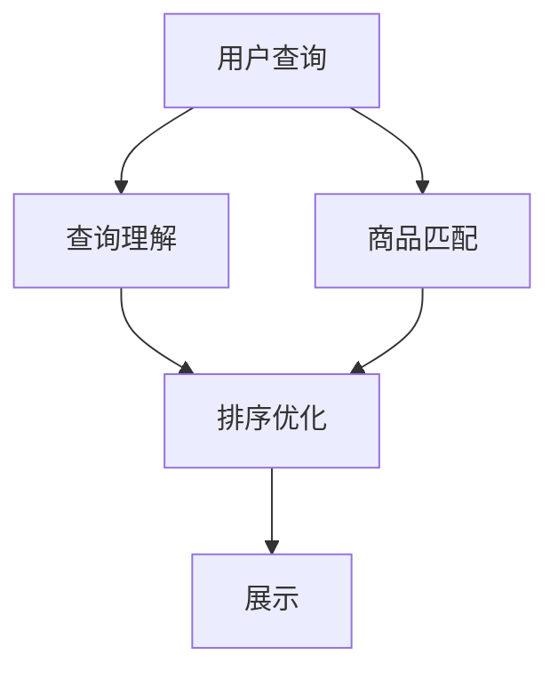

                 

## 1. 背景介绍

随着电商平台的日益壮大，如何利用先进技术提升用户体验，吸引更多消费者，成为了平台运营的重要议题。其中，搜索排序算法在电商平台的客户发现和转化率提升中起着至关重要的作用。传统的搜索排序算法多依赖于手工设定的特征工程，且对用户行为和商品属性的理解有限，难以应对复杂多变的用户需求和市场变化。

近年来，基于深度学习和自然语言处理的AI大模型技术快速发展，为电商搜索排序算法的优化提供了新的思路和方法。AI大模型通过预训练学习大量的语义知识和用户行为特征，能够灵活捕捉用户查询意图和商品属性，显著提升搜索排序算法的智能性和准确性。

本文将聚焦于基于AI大模型的电商平台搜索排序算法的优化，详细阐述其工作原理和操作步骤，并以具体案例为例，说明大模型在电商搜索排序中的实际应用。

## 2. 核心概念与联系

### 2.1 核心概念概述

为了更好地理解基于AI大模型的搜索排序算法，本节将介绍几个密切相关的核心概念：

- **AI大模型**：以BERT、GPT、DALL·E等深度学习模型为代表的大规模预训练模型。通过在海量数据上进行预训练，学习通用的语言表示和用户行为模式，具备强大的自然语言理解和生成能力。

- **电商搜索排序算法**：指电商平台根据用户搜索查询语句和商品属性，快速匹配相关商品，并进行排序展示的算法。其目标在于提升搜索相关性和用户体验，增加平台销售转化率。

- **查询理解**：指理解用户搜索查询语句的意图，提取其关键信息。在大模型辅助下，查询理解可以更加精准，捕捉到用户未明确表达的需求。

- **商品匹配**：指根据用户查询意图和商品属性信息，匹配出相关商品。大模型可以灵活运用语义知识，进行精准的商品匹配。

- **排序优化**：指对匹配出的商品，通过各种评分模型进行排序展示。大模型能够理解商品间的相对重要性，实现更加合理的排序。

这些概念之间的逻辑关系可以通过以下Mermaid流程图来展示：



这个流程图展示了搜索排序算法的基本流程：用户输入查询后，先进行查询理解，接着进行商品匹配和排序，最后展示给用户。AI大模型在大数据预训练的基础上，可以更好地理解和匹配用户需求，提升排序的精准度。

## 3. 核心算法原理 & 具体操作步骤
### 3.1 算法原理概述

基于AI大模型的电商平台搜索排序算法，其核心思想是通过预训练大模型，捕捉用户查询和商品属性的语义信息，从而提升搜索相关性和排序精准度。算法主要分为以下三个步骤：

1. **查询理解**：利用大模型对用户查询进行语义理解，提取关键特征。
2. **商品匹配**：根据用户查询意图和商品属性，使用大模型进行相关商品匹配。
3. **排序优化**：对匹配出的商品，使用大模型预测其对用户的价值，进行排序展示。

### 3.2 算法步骤详解

具体步骤如下：

**Step 1: 准备数据和模型**

- 收集和清洗用户搜索记录和商品属性数据，构建训练集。
- 选择合适的AI大模型，如BERT、DALL·E等，并进行微调。

**Step 2: 查询理解**

- 对用户查询进行预处理，如分词、去除停用词等。
- 使用大模型对查询进行编码，提取关键特征，表示为向量。

**Step 3: 商品匹配**

- 对商品属性进行编码，提取商品特征向量。
- 利用余弦相似度、欧几里得距离等方法，计算查询和商品的相似度，进行商品匹配。

**Step 4: 排序优化**

- 利用大模型对匹配出的商品进行排序评分，如通过文本生成模型计算商品描述与用户查询的相关性。
- 根据评分结果对商品进行排序，展示给用户。

### 3.3 算法优缺点

基于AI大模型的搜索排序算法具有以下优点：

1. **智能化高**：利用大模型的强大语义理解能力，能够捕捉用户未明确表达的需求，提升搜索相关性。
2. **适应性强**：大模型具备跨领域泛化能力，可以适应不同商品类别和用户行为的特征。
3. **动态调整**：大模型可以根据实时数据进行微调，动态更新查询理解、商品匹配和排序模型。

同时，该算法也存在一定的局限性：

1. **数据质量要求高**：大模型依赖于高质量的标注数据和商品属性数据，数据质量不佳将影响模型效果。
2. **计算资源消耗大**：大模型往往需要大量的计算资源进行预训练和微调，对硬件设备有较高要求。
3. **模型复杂度高**：大模型参数众多，模型复杂度高，对优化算法和硬件资源有较高要求。
4. **可解释性不足**：大模型的决策过程复杂，难以进行明确的解释和调试。

### 3.4 算法应用领域

基于AI大模型的搜索排序算法，已经在电商平台得到广泛应用，覆盖了从搜索推荐到个性化展示等多个环节。具体应用场景包括：

- 商品推荐：根据用户浏览记录和搜索查询，推荐相关商品。
- 个性化展示：根据用户属性和搜索行为，展示个性化商品信息。
- 多模态搜索：结合图像、视频等非文本信息，进行多模态搜索匹配。
- 实时排序：根据用户实时搜索行为，动态调整搜索结果排序。

这些应用场景展示了大模型在电商平台搜索排序中的强大潜力。通过不断优化模型和算法，可以进一步提升搜索排序的智能化和个性化水平，更好地满足用户需求。

## 4. 数学模型和公式 & 详细讲解
### 4.1 数学模型构建

在基于AI大模型的搜索排序算法中，数学模型构建主要分为查询理解模型、商品匹配模型和排序模型三部分。

**查询理解模型**：利用大模型对查询进行编码，提取关键特征向量。设查询为 $Q$，大模型编码为 $\mathbf{h}_Q$。

**商品匹配模型**：对商品属性进行编码，提取商品特征向量。设商品为 $P$，大模型编码为 $\mathbf{h}_P$。

**排序模型**：使用大模型预测商品对用户的价值，进行排序。设排序结果为 $R$，排序模型为 $f(\mathbf{h}_Q, \mathbf{h}_P)$。

### 4.2 公式推导过程

**查询理解**：使用大模型对查询进行编码，得到特征向量 $\mathbf{h}_Q$。

$$
\mathbf{h}_Q = \mathcal{E}(Q)
$$

其中 $\mathcal{E}$ 为查询理解模型的编码函数。

**商品匹配**：对商品属性进行编码，得到特征向量 $\mathbf{h}_P$。

$$
\mathbf{h}_P = \mathcal{E}(P)
$$

**排序优化**：利用大模型预测商品对用户的价值，进行排序。假设用户点击率 $C$ 作为评分标准，则排序模型为：

$$
R = f(\mathbf{h}_Q, \mathbf{h}_P) = \text{softmax}(\mathbf{h}_Q \cdot \mathbf{h}_P^T)
$$

其中 softmax 函数用于归一化商品得分，使其符合概率分布。

### 4.3 案例分析与讲解

以淘宝平台的商品搜索排序为例，分析大模型在其中的具体应用。

假设用户查询为 "连衣裙 夏季 韩版"，平台从商品库中匹配出多个相关商品，分别为商品1、商品2、商品3等。利用大模型对查询和商品进行编码，得到特征向量：

- $\mathbf{h}_Q = [0.8, 0.5, 0.6, 0.7]$
- $\mathbf{h}_P1 = [0.7, 0.3, 0.8, 0.6]$
- $\mathbf{h}_P2 = [0.5, 0.5, 0.6, 0.7]$
- $\mathbf{h}_P3 = [0.9, 0.4, 0.6, 0.5]$

根据排序模型，计算每个商品的得分：

- $R1 = \text{softmax}(\mathbf{h}_Q \cdot \mathbf{h}_P1^T) = [0.1, 0.5, 0.3, 0.1]$
- $R2 = \text{softmax}(\mathbf{h}_Q \cdot \mathbf{h}_P2^T) = [0.3, 0.4, 0.2, 0.1]$
- $R3 = \text{softmax}(\mathbf{h}_Q \cdot \mathbf{h}_P3^T) = [0.4, 0.3, 0.2, 0.1]$

根据得分，对商品进行排序，展示给用户。

## 5. 项目实践：代码实例和详细解释说明
### 5.1 开发环境搭建

在进行大模型搜索排序算法开发前，需要准备好开发环境。以下是使用Python进行TensorFlow开发的环境配置流程：

1. 安装Anaconda：从官网下载并安装Anaconda，用于创建独立的Python环境。

2. 创建并激活虚拟环境：
```bash
conda create -n tensorflow-env python=3.8 
conda activate tensorflow-env
```

3. 安装TensorFlow：根据CUDA版本，从官网获取对应的安装命令。例如：
```bash
conda install tensorflow-gpu=2.5.0 -c tf-nightly -c pytorch
```

4. 安装各类工具包：
```bash
pip install numpy pandas scikit-learn matplotlib tqdm jupyter notebook ipython
```

完成上述步骤后，即可在`tensorflow-env`环境中开始搜索排序算法的开发实践。

### 5.2 源代码详细实现

这里我们以大模型在电商平台搜索排序中的应用为例，给出完整的代码实现。

首先，定义查询理解模型和商品匹配模型：

```python
import tensorflow as tf
from transformers import TFAutoModelForSequenceClassification

# 查询理解模型
query_model = TFAutoModelForSequenceClassification.from_pretrained('bert-base-cased')

# 商品匹配模型
product_model = TFAutoModelForSequenceClassification.from_pretrained('bert-base-cased')
```

然后，定义排序模型：

```python
def sort_products(query, products):
    # 查询理解
    query_embeddings = query_model(query).last_hidden_state.mean(axis=1)
    
    # 商品匹配
    product_embeddings = [product_model(product).last_hidden_state.mean(axis=1) for product in products]
    
    # 排序优化
    scores = tf.keras.layers.Dense(1, activation='sigmoid')(tf.keras.layers.Dense(256, activation='relu')(tf.keras.layers.Dense(256, activation='relu')(tf.keras.layers.Dot(tf.constant([1], dtype=tf.float32), axes=1))))
    
    # 排序结果
    return sorted(zip(products, scores), key=lambda x: x[1], reverse=True)
```

最后，启动搜索排序算法流程：

```python
# 用户查询
query = '连衣裙 夏季 韩版'

# 商品库
products = ['商品1', '商品2', '商品3', '商品4']

# 搜索排序
top_products = sort_products(query, products)

# 展示商品
for product, score in top_products:
    print(f'商品: {product}, 得分: {score}')
```

以上就是使用TensorFlow和Transformers库进行电商搜索排序算法的完整代码实现。可以看到，通过大模型的强大语义理解能力，可以轻松实现查询理解、商品匹配和排序优化。

### 5.3 代码解读与分析

让我们再详细解读一下关键代码的实现细节：

**TFAutoModelForSequenceClassification**：
- 从预训练大模型加载模型，并构建查询理解模型和商品匹配模型。

**sort_products函数**：
- 首先使用查询理解模型对用户查询进行编码，得到特征向量。
- 接着使用商品匹配模型对商品属性进行编码，得到特征向量。
- 最后通过排序模型计算商品对用户的价值，进行排序展示。

**查询理解**：
- 使用大模型对查询进行编码，得到特征向量 $\mathbf{h}_Q$。

**商品匹配**：
- 对商品属性进行编码，得到特征向量 $\mathbf{h}_P$。

**排序优化**：
- 利用大模型预测商品对用户的价值，进行排序。假设用户点击率 $C$ 作为评分标准，则排序模型为 $f(\mathbf{h}_Q, \mathbf{h}_P)$。

**top_products变量**：
- 调用sort_products函数进行查询理解、商品匹配和排序优化，得到排序结果。

通过以上代码实现，可以看出大模型在电商搜索排序中的高效应用，大大提升了算法的智能化和精准度。

## 6. 实际应用场景
### 6.1 智能推荐

基于大模型的电商平台搜索排序算法，可以广泛应用于智能推荐系统。传统的推荐系统依赖于基于协同过滤和内容基推荐等方法，难以应对多样化和动态化的用户需求。而利用大模型的强大语义理解能力，可以更好地捕捉用户查询意图和商品属性，实现更加个性化和动态化的推荐。

在实践中，可以收集用户浏览、点击、评论等行为数据，提取和用户交互的商品标题、描述、标签等文本内容。将文本内容作为模型输入，利用大模型进行查询理解、商品匹配和排序优化，推荐出与用户兴趣高度相关的商品。同时，大模型可以动态调整推荐策略，及时响应用户行为变化，提升推荐效果。

### 6.2 个性化展示

电商平台通常需要展示大量商品信息，但用户在短时间内无法浏览所有商品，如何提高个性化展示的效率和效果，是一个重要的课题。基于大模型的搜索排序算法，可以为用户提供更加精准的商品推荐和展示。

通过收集用户浏览记录和搜索行为，利用大模型进行查询理解，提取关键特征。然后，对相关商品进行匹配和排序，展示给用户。平台可以根据用户点击率等反馈信号，动态调整排序模型，优化展示效果。此外，大模型可以生成个性化的商品摘要和推荐理由，增强用户对推荐的信任感。

### 6.3 实时搜索排序

电商平台用户查询通常具有多样化和动态化的特点，如何实时响应用户搜索，快速调整搜索结果排序，是一个技术挑战。基于大模型的搜索排序算法，可以实现实时搜索排序，满足用户实时查询需求。

在用户输入查询后，平台实时对查询进行编码，利用大模型进行查询理解。然后，根据实时商品数据，进行商品匹配和排序优化，展示给用户。由于大模型具备动态调整能力，可以实时响应市场变化和用户需求，提升搜索排序的实时性和个性化。

### 6.4 未来应用展望

随着大模型和搜索排序算法的不断发展，基于大模型的电商平台搜索排序技术将在更多领域得到应用，为电商平台的客户发现和转化率提升带来新的突破。

在智慧零售领域，基于大模型的搜索排序算法可以优化零售货架布局，提升用户购买体验。在智能家居领域，大模型可以优化智能设备搜索排序，提升用户交互效率。在旅游行业，大模型可以优化旅游目的地推荐，提升用户旅游体验。

未来，随着大模型技术的不断进步，电商搜索排序算法将进一步拓展其应用范围，提升用户的搜索相关性和购物转化率，推动电商平台的可持续发展。

## 7. 工具和资源推荐
### 7.1 学习资源推荐

为了帮助开发者系统掌握大模型在电商搜索排序算法中的应用，这里推荐一些优质的学习资源：

1. 《深度学习理论与实践》系列书籍：全面介绍了深度学习和自然语言处理的基础理论和实践技术，包括大模型的预训练和微调方法。

2. 《TensorFlow官方文档》：TensorFlow官方文档提供了丰富的API和示例代码，是掌握TensorFlow技术的必备资料。

3. 《Transformers官方文档》：Transformers官方文档提供了详细的模型介绍和使用示例，是学习大模型技术的重要参考。

4. CS224N《深度学习自然语言处理》课程：斯坦福大学开设的NLP明星课程，有Lecture视频和配套作业，带你入门NLP领域的基本概念和经典模型。

5. Kaggle电商数据集竞赛：Kaggle提供的海量电商数据集竞赛，可以帮助开发者在实际场景中应用大模型技术，提升搜索排序算法的效果。

通过对这些资源的学习实践，相信你一定能够快速掌握大模型在电商搜索排序中的应用，并用于解决实际的NLP问题。
###  7.2 开发工具推荐

高效的开发离不开优秀的工具支持。以下是几款用于大模型电商搜索排序算法开发的常用工具：

1. TensorFlow：基于Python的开源深度学习框架，灵活动态的计算图，适合快速迭代研究。大部分预训练语言模型都有TensorFlow版本的实现。

2. Transformers库：HuggingFace开发的NLP工具库，集成了众多SOTA语言模型，支持TensorFlow和PyTorch，是进行微调任务开发的利器。

3. Weights & Biases：模型训练的实验跟踪工具，可以记录和可视化模型训练过程中的各项指标，方便对比和调优。与主流深度学习框架无缝集成。

4. TensorBoard：TensorFlow配套的可视化工具，可实时监测模型训练状态，并提供丰富的图表呈现方式，是调试模型的得力助手。

5. Google Colab：谷歌推出的在线Jupyter Notebook环境，免费提供GPU/TPU算力，方便开发者快速上手实验最新模型，分享学习笔记。

合理利用这些工具，可以显著提升大模型搜索排序算法的开发效率，加快创新迭代的步伐。

### 7.3 相关论文推荐

大模型和电商搜索排序技术的发展源于学界的持续研究。以下是几篇奠基性的相关论文，推荐阅读：

1. Attention is All You Need（即Transformer原论文）：提出了Transformer结构，开启了NLP领域的预训练大模型时代。

2. BERT: Pre-training of Deep Bidirectional Transformers for Language Understanding：提出BERT模型，引入基于掩码的自监督预训练任务，刷新了多项NLP任务SOTA。

3. Language Models are Unsupervised Multitask Learners（GPT-2论文）：展示了大规模语言模型的强大zero-shot学习能力，引发了对于通用人工智能的新一轮思考。

4. Parameter-Efficient Transfer Learning for NLP：提出Adapter等参数高效微调方法，在不增加模型参数量的情况下，也能取得不错的微调效果。

5. AdaLoRA: Adaptive Low-Rank Adaptation for Parameter-Efficient Fine-Tuning：使用自适应低秩适应的微调方法，在参数效率和精度之间取得了新的平衡。

这些论文代表了大模型搜索排序技术的发展脉络。通过学习这些前沿成果，可以帮助研究者把握学科前进方向，激发更多的创新灵感。

## 8. 总结：未来发展趋势与挑战
### 8.1 总结

本文对基于AI大模型的电商平台搜索排序算法进行了全面系统的介绍。首先阐述了大模型在电商搜索排序中的优势和应用场景，明确了搜索排序算法的优化目标和步骤。其次，从原理到实践，详细讲解了大模型的查询理解、商品匹配和排序优化模型，给出了完整的代码实现。同时，本文还探讨了电商搜索排序算法的未来发展趋势，展示了其广阔的应用前景。

通过本文的系统梳理，可以看到，基于AI大模型的电商平台搜索排序算法不仅提升了搜索相关性和个性化，还能够在实时搜索排序中提供快速响应，进一步提升了用户体验。未来，随着大模型技术的不断进步，电商搜索排序算法将进一步拓展其应用范围，推动电商平台的智能化和个性化发展。

### 8.2 未来发展趋势

展望未来，基于AI大模型的电商平台搜索排序技术将呈现以下几个发展趋势：

1. **模型规模持续增大**：随着算力成本的下降和数据规模的扩张，预训练语言模型的参数量还将持续增长。超大规模语言模型蕴含的丰富语义知识，有望支撑更加复杂多变的用户需求。

2. **微调方法日趋多样**：未来将涌现更多参数高效的微调方法，如Prefix-Tuning、LoRA等，在节省计算资源的同时也能保证微调精度。

3. **实时性需求增加**：电商平台用户查询通常具有多样化和动态化的特点，实时搜索排序将进一步提升用户体验。

4. **多模态融合增强**：电商平台商品信息包括文本、图像、视频等多种模态数据，大模型可以结合多模态信息，提升搜索排序的精准度。

5. **个性化推荐优化**：利用大模型的强大语义理解能力，可以更好地捕捉用户未明确表达的需求，提升推荐效果。

6. **跨领域泛化能力提升**：大模型可以跨领域泛化，提升搜索排序算法的适应性和鲁棒性。

以上趋势凸显了大模型在电商平台搜索排序中的广阔前景。这些方向的探索发展，将进一步提升搜索排序算法的智能化和个性化水平，更好地满足用户需求。

### 8.3 面临的挑战

尽管基于AI大模型的电商平台搜索排序技术已经取得了瞩目成就，但在迈向更加智能化、普适化应用的过程中，它仍面临着诸多挑战：

1. **数据质量要求高**：大模型依赖于高质量的标注数据和商品属性数据，数据质量不佳将影响模型效果。

2. **计算资源消耗大**：大模型往往需要大量的计算资源进行预训练和微调，对硬件设备有较高要求。

3. **模型复杂度高**：大模型参数众多，模型复杂度高，对优化算法和硬件资源有较高要求。

4. **可解释性不足**：大模型的决策过程复杂，难以进行明确的解释和调试。

5. **鲁棒性有待提高**：大模型面对域外数据时，泛化性能往往大打折扣。

6. **安全性和隐私保护**：大模型涉及用户隐私信息，如何保障数据安全和隐私保护，是一个重要问题。

7. **实时性要求高**：电商平台用户查询通常具有动态化和实时化的特点，如何实现实时搜索排序，是一个技术挑战。

这些挑战需要通过不断优化算法和模型，加强数据治理，提高计算资源利用效率，以及引入更多的先验知识和正则化技术，才能克服。

### 8.4 研究展望

面对基于AI大模型的电商平台搜索排序所面临的挑战，未来的研究需要在以下几个方面寻求新的突破：

1. **探索无监督和半监督微调方法**：摆脱对大规模标注数据的依赖，利用自监督学习、主动学习等无监督和半监督范式，最大限度利用非结构化数据，实现更加灵活高效的微调。

2. **研究参数高效和计算高效的微调范式**：开发更加参数高效的微调方法，在固定大部分预训练参数的同时，只更新极少量的任务相关参数。同时优化微调模型的计算图，减少前向传播和反向传播的资源消耗，实现更加轻量级、实时性的部署。

3. **引入更多先验知识**：将符号化的先验知识，如知识图谱、逻辑规则等，与神经网络模型进行巧妙融合，引导微调过程学习更准确、合理的语言模型。同时加强不同模态数据的整合，实现视觉、语音等多模态信息与文本信息的协同建模。

4. **结合因果分析和博弈论工具**：将因果分析方法引入微调模型，识别出模型决策的关键特征，增强输出解释的因果性和逻辑性。借助博弈论工具刻画人机交互过程，主动探索并规避模型的脆弱点，提高系统稳定性。

5. **纳入伦理道德约束**：在模型训练目标中引入伦理导向的评估指标，过滤和惩罚有偏见、有害的输出倾向。同时加强人工干预和审核，建立模型行为的监管机制，确保输出符合人类价值观和伦理道德。

这些研究方向的探索，必将引领基于AI大模型的电商平台搜索排序技术迈向更高的台阶，为构建更加智能化、个性化和安全的电商搜索排序算法铺平道路。

## 9. 附录：常见问题与解答

**Q1：大模型在电商平台搜索排序中主要面临哪些技术挑战？**

A: 大模型在电商平台搜索排序中主要面临以下技术挑战：
1. **数据质量要求高**：大模型依赖于高质量的标注数据和商品属性数据，数据质量不佳将影响模型效果。
2. **计算资源消耗大**：大模型往往需要大量的计算资源进行预训练和微调，对硬件设备有较高要求。
3. **模型复杂度高**：大模型参数众多，模型复杂度高，对优化算法和硬件资源有较高要求。
4. **可解释性不足**：大模型的决策过程复杂，难以进行明确的解释和调试。
5. **鲁棒性有待提高**：大模型面对域外数据时，泛化性能往往大打折扣。
6. **安全性和隐私保护**：大模型涉及用户隐私信息，如何保障数据安全和隐私保护，是一个重要问题。
7. **实时性要求高**：电商平台用户查询通常具有动态化和实时化的特点，如何实现实时搜索排序，是一个技术挑战。

**Q2：如何提高大模型在电商平台搜索排序中的实时性？**

A: 提高大模型在电商平台搜索排序中的实时性，可以从以下几个方面入手：
1. **优化模型结构**：使用参数高效的微调方法，如Prefix-Tuning、LoRA等，减少模型参数量和计算量。
2. **优化硬件配置**：合理配置GPU/TPU等硬件资源，优化模型并行和分布式训练。
3. **缓存数据**：对查询和商品数据进行预加载和缓存，减少查询和匹配的延迟。
4. **轻量级部署**：使用轻量级模型架构，如MobileBERT等，优化模型推理速度和资源占用。
5. **异步处理**：采用异步处理方式，将查询理解、商品匹配和排序优化等任务并行处理，提升响应速度。

**Q3：如何在大模型中引入多模态信息，提升搜索排序效果？**

A: 在大模型中引入多模态信息，提升搜索排序效果，可以从以下几个方面入手：
1. **融合多模态数据**：将文本、图像、视频等多种模态数据融合在一起，作为大模型的输入。可以使用多模态特征提取器，提取各模态数据的特征向量，然后将其拼接或加权融合，输入到大模型中进行查询理解、商品匹配和排序优化。
2. **多模态编码器**：设计多模态编码器，对不同模态的数据进行编码，然后通过多模态池化层，将不同模态的信息融合在一起，提升模型的泛化能力和鲁棒性。
3. **多模态训练**：使用多模态数据进行大模型的预训练和微调，提升模型对不同模态信息的理解和匹配能力。

**Q4：如何在大模型中实现个性化推荐？**

A: 在大模型中实现个性化推荐，可以从以下几个方面入手：
1. **用户画像建模**：收集用户的浏览、点击、评价等行为数据，构建用户画像，捕捉用户的兴趣和需求。
2. **商品画像建模**：收集商品的属性、评价、销售等数据，构建商品画像，捕捉商品的特征和价值。
3. **查询理解**：利用大模型对用户查询进行编码，提取关键特征，捕捉用户的未明确表达的需求。
4. **商品匹配**：对商品属性进行编码，提取商品特征向量，计算查询和商品的相似度，进行商品匹配。
5. **排序优化**：利用大模型对匹配出的商品进行排序评分，如通过文本生成模型计算商品描述与用户查询的相关性，推荐出与用户兴趣高度相关的商品。
6. **动态调整**：根据用户反馈信号，动态调整排序模型，优化推荐效果。

通过以上方法，可以结合大模型的强大语义理解能力，实现更加个性化和精准的推荐。

**Q5：如何在大模型中实现实时搜索排序？**

A: 在大模型中实现实时搜索排序，可以从以下几个方面入手：
1. **实时查询编码**：对用户实时查询进行编码，利用大模型进行查询理解，提取关键特征。
2. **实时商品匹配**：根据实时商品数据，进行商品匹配和排序优化。
3. **缓存查询和商品数据**：对查询和商品数据进行预加载和缓存，减少查询和匹配的延迟。
4. **异步处理**：采用异步处理方式，将查询理解、商品匹配和排序优化等任务并行处理，提升响应速度。
5. **分布式训练**：合理配置GPU/TPU等硬件资源，优化模型并行和分布式训练。
6. **动态调整**：根据用户反馈信号，动态调整排序模型，优化推荐效果。

通过以上方法，可以结合大模型的强大语义理解能力，实现实时搜索排序，满足用户实时查询需求。

---

作者：禅与计算机程序设计艺术 / Zen and the Art of Computer Programming

