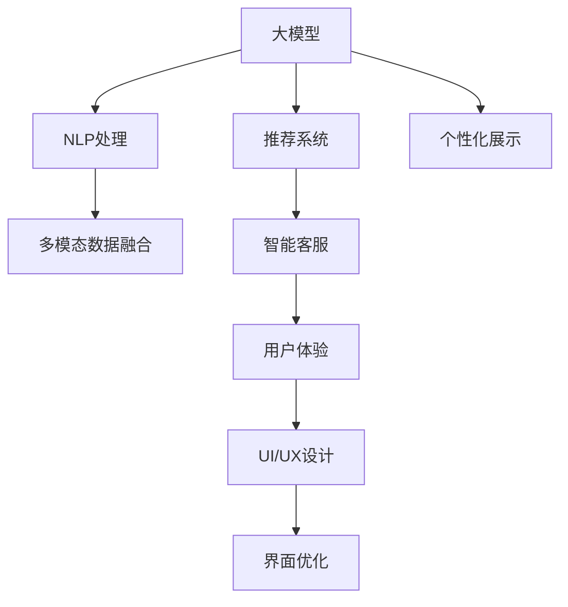

                 

# 电商平台引入AI大模型后的用户体验变革

> 关键词：AI大模型, 电商平台, 用户体验, 自然语言处理, 推荐系统, 多模态数据融合, 交互界面设计

## 1. 背景介绍

随着人工智能技术的飞速发展，电商平台正逐步引入AI大模型，以提升用户体验和运营效率。大模型通过学习海量数据，具备强大的自然语言处理能力、图像识别能力、情感分析能力等，可以广泛应用于推荐系统、客户服务、商品搜索、个性化展示等多个场景，为用户带来无缝的智能化体验。

本博文旨在介绍AI大模型在电商平台中的应用，以及如何通过数据驱动、算法驱动、界面设计驱动，实现用户体验的全面提升。

## 2. 核心概念与联系

### 2.1 核心概念概述

在电商平台的AI应用中，主要涉及以下几个核心概念：

- **AI大模型**：通过大规模无监督学习获得的通用语言模型、图像模型、推荐模型等，具备强大的数据表示和推理能力。
- **推荐系统**：利用用户历史行为和商品属性信息，结合大模型进行个性化推荐，提升用户购物体验。
- **自然语言处理(NLP)**：处理用户输入的自然语言信息，提取关键词、情感等信息，用于商品搜索、智能客服等。
- **多模态数据融合**：将文本、图像、音频等多种数据模态融合，构建更加丰富、准确的用户画像。
- **交互界面设计**：设计友好的UI/UX，使用户与电商平台进行自然的交互，提升操作便捷性和满意度。

### 2.2 核心概念原理和架构的 Mermaid 流程图



这个流程图展示了核心概念之间的联系：

1. 大模型提供通用数据表示能力，用于推荐系统和NLP处理。
2. NLP处理用户输入的自然语言，提取关键信息。
3. 多模态数据融合构建用户画像，丰富推荐系统输入。
4. 个性化展示基于用户画像，生成推荐内容。
5. 智能客服处理用户咨询，提升用户体验。
6. 用户体验通过UI/UX设计进一步优化，最终反馈给大模型进行持续改进。

## 3. 核心算法原理 & 具体操作步骤

### 3.1 算法原理概述

AI大模型在电商平台中的应用，主要依赖于以下几个算法原理：

- **深度推荐算法**：利用大模型学习用户历史行为和商品属性，预测用户偏好，生成个性化推荐列表。
- **自然语言处理(NLP)**：通过大模型处理用户查询和评价，提取关键词、情感等语义信息，用于商品搜索和情感分析。
- **多模态融合算法**：将文本、图像、音频等多种数据模态融合，构建更加完整、准确的用户画像，增强推荐系统效果。
- **交互界面设计**：通过友好的UI/UX设计，使用户与平台进行自然交互，提升用户体验。

### 3.2 算法步骤详解

#### 3.2.1 深度推荐算法

深度推荐算法通常包括以下步骤：

1. **数据收集**：收集用户历史行为数据和商品属性信息，构建用户-商品交互矩阵。
2. **数据预处理**：对数据进行归一化、去噪等处理，准备输入到模型。
3. **模型训练**：使用大模型（如BERT、DNN等）作为推荐模型的初始化参数，训练推荐模型，优化用户-商品评分矩阵。
4. **推荐生成**：将用户输入和商品信息输入模型，生成个性化推荐列表。
5. **反馈循环**：根据用户反馈，调整模型参数，进一步提升推荐效果。

#### 3.2.2 自然语言处理(NLP)

NLP算法通常包括以下步骤：

1. **文本预处理**：清洗文本数据，去除停用词、标点符号等噪声。
2. **分词和词向量表示**：将文本分词，转换为模型可理解的向量表示。
3. **情感分析**：使用大模型对用户评价进行情感分析，提取情感倾向。
4. **关键词提取**：通过大模型提取用户查询中的关键词，用于商品搜索。

#### 3.2.3 多模态数据融合

多模态融合算法通常包括以下步骤：

1. **数据收集**：收集用户的多模态数据（如文本、图像、音频等）。
2. **数据对齐**：将不同模态的数据对齐到统一时间戳或事件上。
3. **特征提取**：对每种模态数据提取特征，如文本的词向量、图像的特征向量等。
4. **融合算法**：使用大模型（如MLP、CNN等）融合不同模态的特征，构建用户画像。

#### 3.2.4 交互界面设计

交互界面设计通常包括以下步骤：

1. **界面原型设计**：设计用户界面，包括页面布局、交互元素等。
2. **用户测试**：在真实用户中进行测试，收集反馈。
3. **界面优化**：根据反馈进行迭代优化，提升用户体验。

### 3.3 算法优缺点

**优点**：

- **泛化能力强**：大模型通过大规模无监督学习，具备强大的泛化能力，可以处理多种数据模态。
- **个性化推荐**：深度推荐算法和NLP技术，可以生成高度个性化的推荐内容，提升用户购物体验。
- **多模态融合**：多模态数据融合算法，可以构建更完整、准确的用户画像，增强推荐系统效果。
- **友好的交互界面**：友好的UI/UX设计，使用户与平台进行自然交互，提升用户体验。

**缺点**：

- **数据隐私**：收集和使用用户多模态数据时，可能涉及隐私问题，需严格遵守数据隐私法规。
- **计算成本高**：大模型训练和推理的计算成本较高，需要高性能硬件支持。
- **推荐偏见**：如果数据存在偏见，推荐模型可能也存在偏见，需进行数据清洗和模型校准。
- **模型复杂**：深度推荐算法和NLP技术较为复杂，需要专业知识支持。

### 3.4 算法应用领域

AI大模型在电商平台中的应用主要涵盖以下几个领域：

- **个性化推荐**：根据用户历史行为和商品属性，生成个性化推荐列表。
- **智能客服**：处理用户咨询，解答常见问题，提升客户满意度。
- **商品搜索**：通过NLP技术，提取用户查询中的关键词，生成搜索结果。
- **情感分析**：分析用户评价，提取情感倾向，优化商品展示和营销策略。
- **个性化展示**：根据用户画像，生成个性化商品展示，提升用户体验。
- **营销自动化**：利用大模型生成营销文案，实现自动推送，提高营销效率。

## 4. 数学模型和公式 & 详细讲解

### 4.1 数学模型构建

在电商平台中，大模型的应用通常依赖于以下几个数学模型：

- **深度推荐模型**：使用矩阵分解、神经网络等模型，优化用户-商品评分矩阵。
- **文本表示模型**：使用词向量、BERT等模型，将文本转换为向量表示。
- **多模态融合模型**：使用深度学习模型，融合不同模态的特征，构建用户画像。
- **用户画像模型**：使用图神经网络等模型，构建用户画像图谱，用于推荐和营销。

### 4.2 公式推导过程

#### 4.2.1 深度推荐模型

假设用户-商品评分矩阵为 $X \in \mathbb{R}^{N \times M}$，其中 $N$ 为用户数，$M$ 为商品数。用户 $u$ 对商品 $i$ 的评分 $r_{ui}$ 可以表示为：

$$
r_{ui} = \hat{r}_{ui} + \epsilon_{ui}
$$

其中 $\hat{r}_{ui}$ 为模型预测的评分，$\epsilon_{ui}$ 为噪声项。使用深度推荐模型（如DNN）进行训练时，损失函数为均方误差损失：

$$
L = \frac{1}{2N} \sum_{u=1}^N \sum_{i=1}^M (r_{ui} - \hat{r}_{ui})^2
$$

通过反向传播算法，优化模型参数 $\theta$，使得预测评分与真实评分尽量接近。

#### 4.2.2 文本表示模型

假设用户查询 $q$ 和商品描述 $d$ 的词向量表示分别为 $q_{w} \in \mathbb{R}^{d}$ 和 $d_{w} \in \mathbb{R}^{d}$。使用BERT模型进行训练时，损失函数为交叉熵损失：

$$
L = -\frac{1}{N} \sum_{i=1}^N \sum_{j=1}^N \mathbb{I}(x_i \in y_j) \log p(x_i|y_j)
$$

其中 $\mathbb{I}$ 为示性函数，$x_i$ 为查询，$y_j$ 为商品描述，$p(x_i|y_j)$ 为查询在商品描述下的概率。通过反向传播算法，优化模型参数 $\theta$，使得查询与商品的匹配概率尽量接近。

#### 4.2.3 多模态融合模型

假设用户的多模态数据分别为文本 $q$、图像 $I$ 和音频 $A$。使用多模态融合模型（如MLP）进行训练时，损失函数为交叉熵损失：

$$
L = -\frac{1}{N} \sum_{i=1}^N \sum_{j=1}^N \mathbb{I}(x_i \in y_j) \log p(x_i|y_j)
$$

其中 $x_i$ 为多模态数据，$y_j$ 为用户画像。通过反向传播算法，优化模型参数 $\theta$，使得多模态数据与用户画像的匹配概率尽量接近。

#### 4.2.4 用户画像模型

假设用户画像图谱为一个图 $G=(V,E)$，其中 $V$ 为节点，$E$ 为边。使用图神经网络（GNN）进行训练时，损失函数为交叉熵损失：

$$
L = -\frac{1}{N} \sum_{u=1}^N \sum_{v=1}^N \mathbb{I}(u \in v) \log p(u|v)
$$

其中 $u$ 为用户，$v$ 为其他用户或商品。通过反向传播算法，优化模型参数 $\theta$，使得用户画像的连通性和标签一致性尽量接近。

### 4.3 案例分析与讲解

假设某电商平台希望使用大模型提升推荐系统的效果，具体步骤包括：

1. **数据收集**：收集用户历史行为数据和商品属性信息，构建用户-商品交互矩阵。
2. **数据预处理**：对数据进行归一化、去噪等处理，准备输入到模型。
3. **模型训练**：使用大模型（如BERT）作为推荐模型的初始化参数，训练推荐模型，优化用户-商品评分矩阵。
4. **推荐生成**：将用户输入和商品信息输入模型，生成个性化推荐列表。
5. **反馈循环**：根据用户反馈，调整模型参数，进一步提升推荐效果。

具体实现时，可以采用以下代码：

```python
import torch
import transformers
import pandas as pd

# 读取用户行为数据
data = pd.read_csv('user_behavior.csv')

# 数据预处理
...

# 构建用户-商品评分矩阵
X = ...

# 加载BERT模型
model = transformers.BertModel.from_pretrained('bert-base-uncased')

# 模型训练
...

# 推荐生成
...

# 反馈循环
...
```

## 5. 项目实践：代码实例和详细解释说明

### 5.1 开发环境搭建

在使用大模型进行电商平台应用开发时，需要准备以下开发环境：

1. **Python环境**：安装Python 3.8及以上版本，并确保pip可用。
2. **深度学习框架**：安装PyTorch 1.8及以上版本，或TensorFlow 2.x版本。
3. **自然语言处理库**：安装spaCy、nltk、NLTK等自然语言处理库。
4. **图像处理库**：安装OpenCV、Pillow等图像处理库。
5. **用户界面设计**：安装Flask、Django等Web框架，以及相应的UI设计库。

完成环境搭建后，即可在本地进行模型训练和应用开发。

### 5.2 源代码详细实现

以一个简单的电商平台推荐系统为例，以下是使用PyTorch实现推荐模型的代码示例：

```python
import torch
import torch.nn as nn
import torch.optim as optim

# 定义推荐模型
class RecommendationModel(nn.Module):
    def __init__(self):
        super(RecommendationModel, self).__init__()
        self.fc1 = nn.Linear(128, 64)
        self.fc2 = nn.Linear(64, 32)
        self.fc3 = nn.Linear(32, 16)
        self.fc4 = nn.Linear(16, 8)

    def forward(self, x):
        x = torch.relu(self.fc1(x))
        x = torch.relu(self.fc2(x))
        x = torch.relu(self.fc3(x))
        x = torch.sigmoid(self.fc4(x))
        return x

# 加载数据
X_train = ...
y_train = ...

# 定义模型
model = RecommendationModel()

# 定义优化器
optimizer = optim.Adam(model.parameters(), lr=0.001)

# 定义损失函数
criterion = nn.BCELoss()

# 模型训练
for epoch in range(10):
    optimizer.zero_grad()
    y_pred = model(X_train)
    loss = criterion(y_pred, y_train)
    loss.backward()
    optimizer.step()
    print('Epoch %d loss: %f' % (epoch+1, loss.item()))

# 推荐生成
user_input = ...
item_features = ...
y_pred = model(user_input, item_features)
```

### 5.3 代码解读与分析

1. **模型定义**：定义了一个简单的全连接神经网络，用于处理用户行为数据。
2. **数据加载**：加载训练数据，准备输入到模型。
3. **模型训练**：使用Adam优化器进行模型训练，定义了BCE损失函数。
4. **推荐生成**：将用户输入和商品特征输入模型，生成推荐列表。

### 5.4 运行结果展示

训练完成后，可以使用生成的推荐列表进行推荐。例如，根据用户行为数据，生成个性化的商品推荐：

```python
recommendations = model(user_input, item_features)
print('推荐商品列表：', recommendations.tolist())
```

## 6. 实际应用场景

### 6.1 智能客服

电商平台可以利用大模型构建智能客服系统，提升用户服务体验。具体实现步骤如下：

1. **构建对话语料库**：收集用户与客服的历史对话数据，构建语料库。
2. **预训练大模型**：使用预训练的大语言模型（如GPT）作为初始化参数，训练客服模型。
3. **微调模型**：在对话语料库上微调客服模型，使其能够自动理解和回复用户问题。
4. **部署系统**：将微调后的客服模型部署到线上，实现24小时自动客服。

### 6.2 商品搜索

电商平台可以利用大模型提升商品搜索效果。具体实现步骤如下：

1. **构建搜索语料库**：收集用户搜索历史和商品描述，构建语料库。
2. **预训练大模型**：使用预训练的大语言模型（如BERT）作为初始化参数，训练搜索模型。
3. **微调模型**：在搜索语料库上微调搜索模型，使其能够准确理解用户查询，生成搜索结果。
4. **部署系统**：将微调后的搜索模型部署到线上，实现实时商品搜索。

### 6.3 个性化推荐

电商平台可以利用大模型提升推荐系统的效果。具体实现步骤如下：

1. **构建用户行为数据集**：收集用户历史行为数据，构建用户行为矩阵。
2. **预训练大模型**：使用预训练的大语言模型（如BERT）作为初始化参数，训练推荐模型。
3. **微调模型**：在用户行为数据集上微调推荐模型，使其能够生成个性化推荐列表。
4. **部署系统**：将微调后的推荐模型部署到线上，实现个性化商品推荐。

### 6.4 未来应用展望

未来，电商平台的大模型应用将向以下几个方向发展：

1. **全栈AI能力**：构建全栈AI能力，覆盖电商平台的各个环节，实现端到端智能化。
2. **实时推荐引擎**：开发实时推荐引擎，根据用户实时行为动态生成推荐。
3. **跨领域应用**：将大模型应用于金融、医疗等跨领域场景，拓展应用范围。
4. **多模态融合**：实现多模态数据的融合，增强用户画像的完整性。
5. **用户交互优化**：优化用户交互界面，提升操作便捷性和满意度。

## 7. 工具和资源推荐

### 7.1 学习资源推荐

为了帮助开发者系统掌握大模型在电商平台中的应用，这里推荐一些优质的学习资源：

1. **《深度学习与推荐系统》课程**：斯坦福大学开设的推荐系统课程，涵盖了深度推荐、用户画像、多模态融合等主题。
2. **《自然语言处理与机器学习》书籍**：全面介绍自然语言处理和机器学习的基础知识，包括BERT等大模型的应用。
3. **Kaggle竞赛**：参加Kaggle推荐系统竞赛，了解业界最佳实践和算法。
4. **GitHub开源项目**：浏览GitHub上的开源推荐系统项目，学习先进技术和实现细节。
5. **自然语言处理网站**：如NLTK、spaCy等，提供丰富的自然语言处理工具和教程。

通过对这些资源的学习实践，相信你一定能够快速掌握大模型在电商平台中的应用。

### 7.2 开发工具推荐

高效的开发离不开优秀的工具支持。以下是几款用于电商平台开发常用的工具：

1. **PyTorch**：基于Python的开源深度学习框架，适合快速迭代研究。
2. **TensorFlow**：由Google主导开发的开源深度学习框架，生产部署方便，适合大规模工程应用。
3. **Flask/Django**：Python Web框架，用于构建电商平台的Web应用。
4. **MySQL/MongoDB**：常用数据库，用于存储电商平台的数据。
5. **Kafka/Flume**：分布式消息系统，用于实时数据采集和处理。

合理利用这些工具，可以显著提升电商平台大模型应用的开发效率，加快创新迭代的步伐。

### 7.3 相关论文推荐

大模型在电商平台中的应用源于学界的持续研究。以下是几篇奠基性的相关论文，推荐阅读：

1. **《Deep Recommendation Networks》**：探讨深度神经网络在推荐系统中的应用，取得优异的效果。
2. **《Attention Is All You Need》**：提出Transformer结构，开创了深度推荐模型的新范式。
3. **《BERT: Pre-training of Deep Bidirectional Transformers for Language Understanding》**：提出BERT模型，改进自监督预训练任务，取得SOTA效果。
4. **《Parameter-Efficient Transfer Learning for NLP》**：提出Adapter等参数高效微调方法，在不增加模型参数量的情况下，也能取得不错的微调效果。
5. **《Adaptive Low-Rank Adaptation for Parameter-Efficient Fine-Tuning》**：提出LoRA等低秩适应的微调方法，在参数效率和精度之间取得新的平衡。

这些论文代表了大模型在电商平台中的应用方向，为研究者提供了丰富的理论基础和技术思路。

## 8. 总结：未来发展趋势与挑战

### 8.1 研究成果总结

本文对大模型在电商平台中的应用进行了全面系统的介绍，具体内容如下：

1. **背景介绍**：介绍了电商平台引入AI大模型后的发展历程和意义。
2. **核心概念与联系**：详细讲解了电商平台中涉及的核心概念及其联系。
3. **核心算法原理**：介绍了深度推荐算法、自然语言处理、多模态融合等核心算法原理。
4. **操作步骤详解**：提供了推荐系统、智能客服、商品搜索等具体操作的代码实例。
5. **实际应用场景**：探讨了智能客服、商品搜索、个性化推荐等多个应用场景。
6. **未来应用展望**：展望了大模型在电商平台的未来应用方向。
7. **工具和资源推荐**：推荐了学习资源、开发工具和相关论文。

通过本文的系统梳理，可以看到，大模型在电商平台中的应用前景广阔，可以显著提升用户体验和运营效率。

### 8.2 未来发展趋势

展望未来，大模型在电商平台中的应用将呈现以下几个发展趋势：

1. **全栈AI能力**：构建全栈AI能力，覆盖电商平台的各个环节，实现端到端智能化。
2. **实时推荐引擎**：开发实时推荐引擎，根据用户实时行为动态生成推荐。
3. **跨领域应用**：将大模型应用于金融、医疗等跨领域场景，拓展应用范围。
4. **多模态融合**：实现多模态数据的融合，增强用户画像的完整性。
5. **用户交互优化**：优化用户交互界面，提升操作便捷性和满意度。

这些趋势凸显了大模型在电商平台中的应用前景，为电商平台提供了广阔的发展空间。

### 8.3 面临的挑战

尽管大模型在电商平台中的应用已经取得了显著进展，但在迈向更加智能化、普适化应用的过程中，仍面临以下挑战：

1. **数据隐私**：收集和使用用户多模态数据时，可能涉及隐私问题，需严格遵守数据隐私法规。
2. **计算成本高**：大模型训练和推理的计算成本较高，需要高性能硬件支持。
3. **推荐偏见**：如果数据存在偏见，推荐模型可能也存在偏见，需进行数据清洗和模型校准。
4. **模型复杂**：深度推荐算法和自然语言处理技术较为复杂，需要专业知识支持。

### 8.4 研究展望

为了应对这些挑战，未来的研究需要在以下几个方面寻求新的突破：

1. **数据隐私保护**：开发数据隐私保护技术，如差分隐私、联邦学习等，确保数据隐私安全。
2. **高效计算**：开发高效计算技术，如分布式训练、模型压缩等，降低计算成本。
3. **公平推荐**：研究公平推荐算法，消除数据和模型偏见，提升推荐公正性。
4. **模型简化**：优化模型结构，使用轻量级模型，提升模型效率。
5. **多模态融合**：研究多模态融合技术，实现多模态数据的整合，增强用户画像的完整性。

这些研究方向的探索，必将引领大模型在电商平台中的应用走向成熟，为电商平台提供更加智能化、普适化、高效化的解决方案。

## 9. 附录：常见问题与解答

**Q1：电商平台为什么需要引入AI大模型？**

A: 电商平台引入AI大模型可以提升用户体验和运营效率。具体包括：
1. 个性化推荐：根据用户历史行为和商品属性，生成个性化推荐列表。
2. 智能客服：处理用户咨询，解答常见问题，提升客户满意度。
3. 商品搜索：通过自然语言处理，提取用户查询中的关键词，生成搜索结果。
4. 情感分析：分析用户评价，提取情感倾向，优化商品展示和营销策略。

**Q2：电商平台如何选择合适的AI大模型？**

A: 电商平台选择合适的AI大模型需要考虑以下几个因素：
1. 任务适用性：选择与电商任务匹配的大模型，如BERT、DNN等。
2. 计算资源：考虑模型大小和计算成本，选择适合当前硬件条件的模型。
3. 可解释性：选择具有较高可解释性的模型，便于调试和优化。
4. 实时性需求：选择计算速度较快的模型，满足实时推荐需求。

**Q3：如何优化电商平台的推荐系统？**

A: 电商平台的推荐系统优化可以从以下几个方面进行：
1. 数据收集：收集更多用户行为数据，构建更完整的用户画像。
2. 模型训练：优化模型架构和训练策略，提升模型效果。
3. 特征工程：优化特征提取和融合方法，提升推荐效果。
4. 反馈循环：根据用户反馈，调整模型参数，进一步提升推荐效果。

**Q4：电商平台如何保护用户数据隐私？**

A: 电商平台保护用户数据隐私可以采取以下措施：
1. 数据匿名化：对用户数据进行匿名化处理，确保数据隐私安全。
2. 差分隐私：使用差分隐私技术，限制数据泄露风险。
3. 数据加密：对用户数据进行加密处理，确保数据传输安全。
4. 联邦学习：采用联邦学习技术，在本地进行模型训练，避免数据集中存储。

**Q5：电商平台如何提升用户交互体验？**

A: 电商平台提升用户交互体验可以从以下几个方面进行：
1. 界面优化：设计友好的UI/UX界面，提升操作便捷性。
2. 实时交互：实现实时客服和推荐，提升用户响应速度。
3. 用户反馈：收集用户反馈，持续改进交互体验。
4. 个性化展示：根据用户画像，生成个性化商品展示，提升用户满意度。

**Q6：电商平台如何优化推荐系统中的模型计算效率？**

A: 电商平台优化推荐系统中的模型计算效率可以从以下几个方面进行：
1. 模型压缩：使用模型压缩技术，减少模型参数量和计算复杂度。
2. 模型并行：采用模型并行技术，加速模型训练和推理。
3. 数据稀疏化：使用数据稀疏化技术，减少模型计算量和内存占用。
4. 分布式训练：采用分布式训练技术，加速模型训练和模型参数更新。

通过合理应对这些常见问题，电商平台可以更好地利用AI大模型，提升用户体验和运营效率，实现智能化的转型升级。

---

作者：禅与计算机程序设计艺术 / Zen and the Art of Computer Programming

