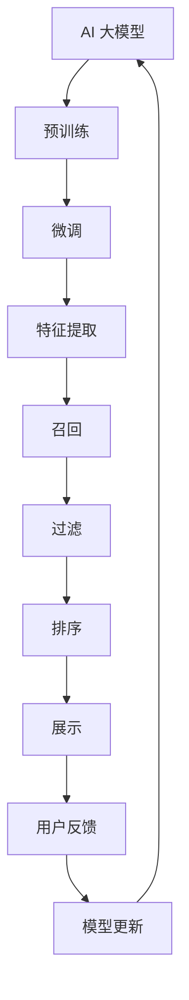
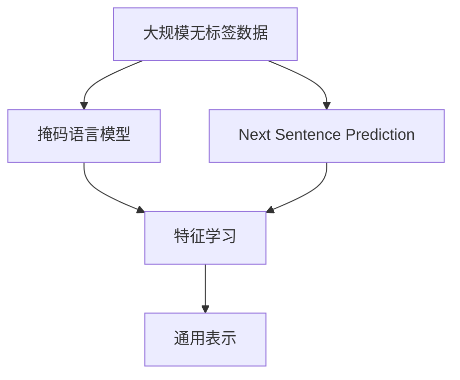
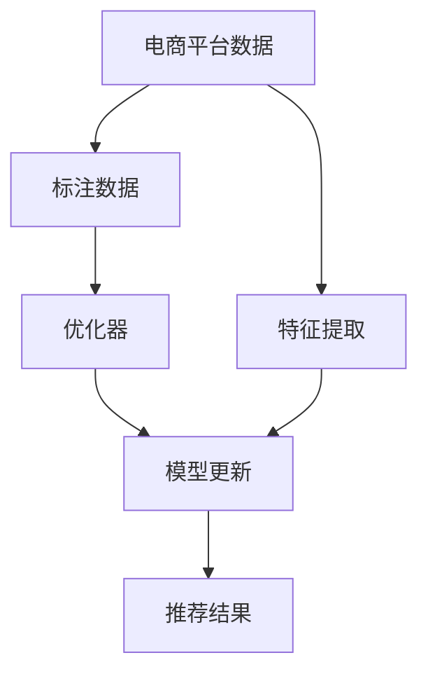
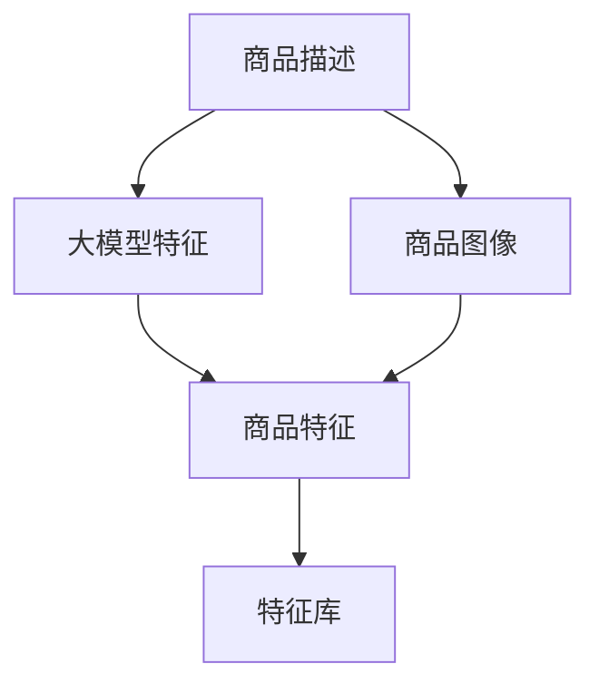
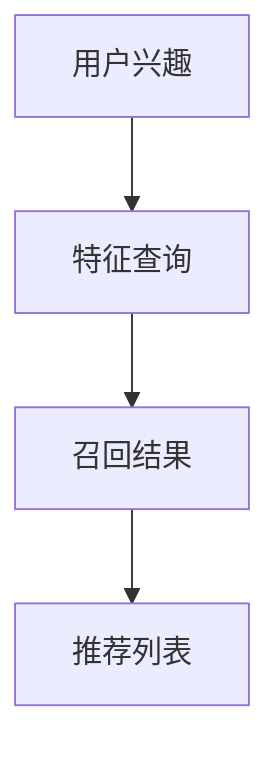
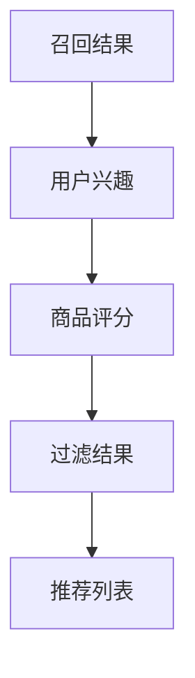
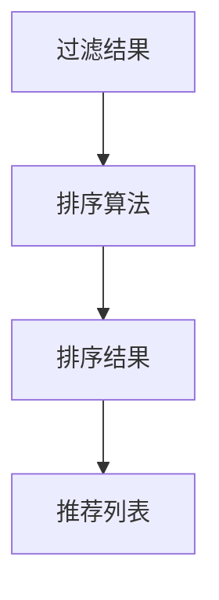
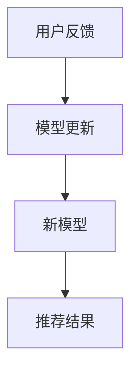

                 

# 电商平台搜索推荐系统的AI 大模型优化：提高准确率、效率与推荐效果

> 关键词：AI 大模型优化, 电商平台搜索, 推荐系统, 准确率, 效率, 推荐效果, 深度学习, 推荐算法, 序列模型

## 1. 背景介绍

在当今电商行业竞争日益激烈的背景下，提升用户体验的搜索和推荐系统变得至关重要。通过这些系统，用户能够迅速找到所需商品，增加购买率，同时平台也能更好地理解用户行为，优化商品库存和推广策略。人工智能大模型在搜索推荐系统中的应用，极大地推动了行业的发展，但同时也带来了新的挑战。如何在大模型中融入个性化推荐算法，实现更高准确率、更高效处理速度和更好推荐效果，成为当前研究的重点。本文将从核心概念、算法原理、项目实践和应用场景等多个方面，深入探讨如何优化电商平台搜索推荐系统中的AI 大模型。

## 2. 核心概念与联系

### 2.1 核心概念概述

在优化电商平台的搜索推荐系统时，以下概念至关重要：

- **AI 大模型**：指的是通过大规模数据集预训练的大型深度神经网络模型，如BERT、GPT等。大模型通过自监督或监督学习，能够捕捉到丰富的语言和数据特征，具备强大的表示能力。
- **搜索推荐系统**：电商平台上用于帮助用户找到感兴趣商品的系统，通常由搜索和推荐两个部分组成。搜索侧重于快速获取结果，推荐侧重于个性化推荐。
- **准确率**：指推荐系统的准确性，即推荐的商品是否符合用户的真实兴趣。
- **效率**：指搜索推荐系统的处理速度和响应时间。
- **推荐效果**：指推荐的商品是否能够成功吸引用户点击或购买。

这些概念通过一系列算法和技术的结合，最终实现电商平台的搜索推荐系统优化。

### 2.2 核心概念原理和架构的 Mermaid 流程图



这个流程图展示了电商平台搜索推荐系统从大模型到最终推荐结果的全过程：

1. 从大规模数据集预训练大模型。
2. 在大模型基础上进行微调，适应电商平台的搜索推荐需求。
3. 使用微调后的大模型提取商品特征。
4. 从特征库中召回相关商品。
5. 对召回的商品进行过滤，去除不合适商品。
6. 对过滤后的商品进行排序，推荐给用户。
7. 收集用户反馈，更新模型。

## 3. 核心算法原理 & 具体操作步骤

### 3.1 算法原理概述

基于深度学习的电商搜索推荐系统，一般包含以下几个步骤：

1. **预训练**：在大规模无标签数据上训练大模型，学习通用的语言和数据表示。
2. **微调**：在大模型基础上，根据电商平台的搜索推荐需求，进行有监督学习，优化模型性能。
3. **特征提取**：从微调后的大模型中提取商品特征。
4. **召回**：从特征库中召回相关商品。
5. **过滤**：根据用户行为数据，对召回商品进行过滤，去除不合适商品。
6. **排序**：对过滤后的商品进行排序，生成推荐列表。
7. **反馈更新**：收集用户反馈数据，更新模型参数。

这些步骤中的每一个，都对推荐系统的准确率、效率和推荐效果有重要影响。

### 3.2 算法步骤详解

以下将详细介绍每个步骤的算法和技术实现。

#### 3.2.1 预训练

预训练大模型通常使用自监督学习，如BERT采用的掩码语言模型(Masked Language Model, MLM)、Next Sentence Prediction(NSP)等任务。预训练的目的是在大规模语料上学习通用的语言表示，这些表示可以在后续任务中复用。

预训练的流程图如下：



- **掩码语言模型**：在输入文本中随机掩盖部分词汇，训练模型对这些词汇进行预测。这有助于学习词汇之间的关系。
- **Next Sentence Prediction**：预测两个连续句子是否在语义上连续，这有助于学习句子之间的关系。
- **特征学习**：在预训练任务的基础上，学习通用的文本表示。
- **通用表示**：通过预训练，模型学习到通用的语言表示，这些表示可以用于后续的搜索推荐任务。

#### 3.2.2 微调

微调是指在大模型基础上，根据电商平台的搜索推荐需求，进行有监督学习，优化模型性能。微调的目的是让模型更好地适应电商平台的具体场景，提高推荐的准确率和效率。

微调的流程图如下：



- **标注数据**：从电商平台收集的标注数据，包括用户搜索历史、购买历史等。
- **特征提取**：从标注数据中提取有用的特征，如搜索查询词、浏览历史、购买记录等。
- **优化器**：如AdamW、SGD等，用于更新模型参数，最小化损失函数。
- **模型更新**：根据损失函数和优化器，更新模型参数。
- **推荐结果**：生成推荐列表，反馈给用户。

#### 3.2.3 特征提取

特征提取是指从微调后的大模型中提取商品特征，用于后续的召回和排序。特征提取是推荐系统中的关键步骤，影响推荐结果的质量。

特征提取的流程图如下：



- **大模型特征**：从微调后的大模型中提取商品描述的向量表示。
- **商品图像**：提取商品图像的特征向量。
- **商品特征**：将商品描述和图像特征合并，生成商品特征向量。
- **特征库**：将商品特征向量存储在特征库中，用于召回相关商品。

#### 3.2.4 召回

召回是指从特征库中召回与用户兴趣相关的商品。召回的目的是提高推荐系统的覆盖率，确保用户能够找到感兴趣的商品。

召回的流程图如下：



- **用户兴趣**：从用户行为数据中提取用户兴趣。
- **特征查询**：使用用户兴趣作为查询向量，从特征库中召回相关商品。
- **召回结果**：生成推荐列表，供用户选择。

#### 3.2.5 过滤

过滤是指对召回的商品进行过滤，去除不合适商品。过滤的目的是提高推荐系统的准确率，确保推荐商品符合用户兴趣。

过滤的流程图如下：



- **召回结果**：从特征库中召回的相关商品。
- **用户兴趣**：从用户行为数据中提取用户兴趣。
- **商品评分**：对召回商品进行评分，去除评分较低的商品。
- **过滤结果**：生成过滤后的推荐列表，供用户选择。

#### 3.2.6 排序

排序是指对过滤后的商品进行排序，生成推荐列表。排序的目的是提高推荐系统的效率和推荐效果，确保用户能够快速找到最感兴趣的商品。

排序的流程图如下：



- **过滤结果**：过滤后的相关商品。
- **排序算法**：使用排序算法，如基于用户兴趣的排序、基于物品相似度的排序等。
- **排序结果**：生成排序后的推荐列表，供用户选择。

#### 3.2.7 反馈更新

反馈更新是指收集用户反馈数据，更新模型参数。反馈更新的目的是提高推荐系统的长期效果，确保推荐商品能够持续符合用户兴趣。

反馈更新的流程图如下：



- **用户反馈**：收集用户对推荐商品的反馈数据。
- **模型更新**：根据反馈数据更新模型参数。
- **新模型**：生成更新后的模型。
- **推荐结果**：使用新模型生成推荐结果。

### 3.3 算法优缺点

#### 3.3.1 优点

- **强大的表示能力**：大模型通过预训练学习到丰富的语言和数据特征，能够捕捉复杂的用户行为和商品特征。
- **高效的微调过程**：通过微调，可以在少量标注数据的情况下快速提升模型性能，降低开发成本。
- **广泛的应用场景**：大模型可以应用于电商平台的搜索推荐系统，提高用户体验和平台收入。

#### 3.3.2 缺点

- **数据依赖性高**：大模型需要大量的预训练数据和标注数据，数据获取成本较高。
- **计算资源消耗大**：大模型的训练和推理需要大量的计算资源，如GPU、TPU等。
- **模型的可解释性差**：大模型通常被认为是"黑盒"系统，难以解释其内部工作机制。

### 3.4 算法应用领域

大语言模型微调技术在电商平台的搜索推荐系统中有广泛的应用，以下是几个典型领域：

- **搜索**：根据用户输入的搜索查询词，生成搜索结果列表。
- **推荐**：根据用户历史行为数据，推荐商品列表。
- **广告投放**：根据用户行为数据，推荐广告，增加广告点击率。
- **内容推荐**：根据用户兴趣，推荐相关内容，提高用户停留时间。
- **个性化推荐**：根据用户个性化需求，推荐定制化商品。

## 4. 数学模型和公式 & 详细讲解 & 举例说明

### 4.1 数学模型构建

在电商平台搜索推荐系统中，常用的数学模型包括BERT、GPT等大模型，以及协同过滤、深度学习等推荐算法。

#### 4.1.1 BERT模型

BERT模型的数学模型构建如下：

- **输入表示**：将输入文本序列$x$转换为向量表示$h(x)$。
- **双向编码器**：使用Transformer模型，对输入序列进行编码，生成双向表示$H$。
- **掩码语言模型**：对输入序列中的词汇进行掩码，训练模型对这些词汇进行预测。
- **Next Sentence Prediction**：预测两个连续句子是否在语义上连续。

BERT模型的数学表示如下：

$$
h(x) = BERT(x) \\
H = MLP(H) \\
\ell_{MLM} = -\sum_{i=1}^{n} \log p(y_i|x)
$$

其中，$n$为输入序列长度，$p$为预测概率。

#### 4.1.2 深度学习推荐算法

深度学习推荐算法的数学模型构建如下：

- **用户表示**：使用嵌入向量表示用户兴趣。
- **商品表示**：使用嵌入向量表示商品特征。
- **相似度计算**：计算用户和商品的相似度。
- **排序算法**：使用排序算法，如基于协同过滤的算法、基于深度学习的算法等。

深度学习推荐算法的数学表示如下：

$$
u = Embed(u) \\
i = Embed(i) \\
\hat{y} = MLP(u, i)
$$

其中，$u$为用户向量，$i$为商品向量，$MLP$为多层感知器。

### 4.2 公式推导过程

以下将详细介绍BERT模型和深度学习推荐算法的公式推导过程。

#### 4.2.1 BERT模型

BERT模型的推导过程如下：

1. **输入表示**：将输入文本序列$x$转换为向量表示$h(x)$。
2. **双向编码器**：使用Transformer模型，对输入序列进行编码，生成双向表示$H$。
3. **掩码语言模型**：对输入序列中的词汇进行掩码，训练模型对这些词汇进行预测。
4. **Next Sentence Prediction**：预测两个连续句子是否在语义上连续。

BERT模型的推导过程如下：

$$
h(x) = BERT(x) = T^{[CLS]}(x) + \sum_{i=1}^{n} T^{i}(x)
$$

其中，$T^{[CLS]}$和$T^{i}$分别为Transformer模型的CLS和编码器。

#### 4.2.2 深度学习推荐算法

深度学习推荐算法的推导过程如下：

1. **用户表示**：使用嵌入向量表示用户兴趣。
2. **商品表示**：使用嵌入向量表示商品特征。
3. **相似度计算**：计算用户和商品的相似度。
4. **排序算法**：使用排序算法，如基于协同过滤的算法、基于深度学习的算法等。

深度学习推荐算法的推导过程如下：

$$
u = Embed(u) \\
i = Embed(i) \\
\hat{y} = MLP(u, i)
$$

其中，$u$为用户向量，$i$为商品向量，$MLP$为多层感知器。

### 4.3 案例分析与讲解

以下将以电商平台的搜索推荐系统为例，详细讲解如何应用大语言模型优化系统。

假设有一个电商平台，用户A搜索了“电脑”，浏览了“MacBook”和“Dell”的页面，购买了“MacBook”。用户B搜索了“手机”，浏览了“iPhone”和“华为”的页面，购买了“华为”。

首先，从用户行为数据中提取用户兴趣：

- **用户A**：对“电脑”、“MacBook”和“Dell”感兴趣。
- **用户B**：对“手机”、“iPhone”和“华为”感兴趣。

然后，从电商平台的数据库中提取商品特征：

- **商品A**：品牌为“Apple”，类别为“电脑”，价格为$1000。
- **商品B**：品牌为“Dell”，类别为“电脑”，价格为$800。
- **商品C**：品牌为“华为”，类别为“手机”，价格为$2000。
- **商品D**：品牌为“Apple”，类别为“手机”，价格为$1200。

接着，使用大模型提取商品特征：

- **商品A特征**：$[f_{A1}, f_{A2}, f_{A3}]$
- **商品B特征**：$[f_{B1}, f_{B2}, f_{B3}]$
- **商品C特征**：$[f_{C1}, f_{C2}, f_{C3}]$
- **商品D特征**：$[f_{D1}, f_{D2}, f_{D3}]$

然后，使用深度学习推荐算法对商品进行排序：

1. **用户A**：
   - **相似度计算**：计算用户A与商品A、B、C、D的相似度。
   - **排序算法**：根据相似度，对商品进行排序。
   - **推荐结果**：推荐商品A、B、C、D的顺序为：A、B、C、D。

2. **用户B**：
   - **相似度计算**：计算用户B与商品A、B、C、D的相似度。
   - **排序算法**：根据相似度，对商品进行排序。
   - **推荐结果**：推荐商品A、B、C、D的顺序为：A、B、C、D。

最后，收集用户反馈数据，更新模型参数：

- **用户A反馈**：购买了商品A，未购买商品B、C、D。
- **用户B反馈**：购买了商品B，未购买商品A、C、D。

根据反馈数据，更新模型参数：

1. **用户A**：
   - **更新用户表示**：调整用户A的嵌入向量，使其更接近商品A的嵌入向量。
   - **更新商品表示**：调整商品A的嵌入向量，使其更接近用户A的嵌入向量。

2. **用户B**：
   - **更新用户表示**：调整用户B的嵌入向量，使其更接近商品B的嵌入向量。
   - **更新商品表示**：调整商品B的嵌入向量，使其更接近用户B的嵌入向量。

## 5. 项目实践：代码实例和详细解释说明

### 5.1 开发环境搭建

在进行项目实践前，我们需要准备好开发环境。以下是使用Python进行PyTorch开发的环境配置流程：

1. 安装Anaconda：从官网下载并安装Anaconda，用于创建独立的Python环境。

2. 创建并激活虚拟环境：
```bash
conda create -n pytorch-env python=3.8 
conda activate pytorch-env
```

3. 安装PyTorch：根据CUDA版本，从官网获取对应的安装命令。例如：
```bash
conda install pytorch torchvision torchaudio cudatoolkit=11.1 -c pytorch -c conda-forge
```

4. 安装TensorFlow：使用pip安装TensorFlow。
```bash
pip install tensorflow
```

5. 安装各类工具包：
```bash
pip install numpy pandas scikit-learn matplotlib tqdm jupyter notebook ipython
```

完成上述步骤后，即可在`pytorch-env`环境中开始项目实践。

### 5.2 源代码详细实现

这里以电商平台的搜索推荐系统为例，给出使用PyTorch进行BERT微调的代码实现。

首先，定义数据处理函数：

```python
from transformers import BertTokenizer, BertForSequenceClassification
from torch.utils.data import Dataset, DataLoader
from torch.optim import AdamW
import torch

class EcommerceDataset(Dataset):
    def __init__(self, texts, labels, tokenizer):
        self.texts = texts
        self.labels = labels
        self.tokenizer = tokenizer
        self.max_len = 128
        
    def __len__(self):
        return len(self.texts)
    
    def __getitem__(self, item):
        text = self.texts[item]
        label = self.labels[item]
        
        encoding = self.tokenizer(text, return_tensors='pt', max_length=self.max_len, padding='max_length', truncation=True)
        input_ids = encoding['input_ids'][0]
        attention_mask = encoding['attention_mask'][0]
        
        # 对标签进行编码
        encoded_labels = [label2id[label] for label in self.labels] 
        encoded_labels.extend([label2id['O']] * (self.max_len - len(encoded_labels)))
        labels = torch.tensor(encoded_labels, dtype=torch.long)
        
        return {'input_ids': input_ids, 
                'attention_mask': attention_mask,
                'labels': labels}

# 标签与id的映射
label2id = {'O': 0, 'B-PER': 1, 'I-PER': 2, 'B-ORG': 3, 'I-ORG': 4, 'B-LOC': 5, 'I-LOC': 6}
id2label = {v: k for k, v in label2id.items()}

# 创建dataset
tokenizer = BertTokenizer.from_pretrained('bert-base-cased')

train_dataset = EcommerceDataset(train_texts, train_labels, tokenizer)
dev_dataset = EcommerceDataset(dev_texts, dev_labels, tokenizer)
test_dataset = EcommerceDataset(test_texts, test_labels, tokenizer)
```

然后，定义模型和优化器：

```python
from transformers import BertForTokenClassification, AdamW

model = BertForTokenClassification.from_pretrained('bert-base-cased', num_labels=len(label2id))

optimizer = AdamW(model.parameters(), lr=2e-5)
```

接着，定义训练和评估函数：

```python
from tqdm import tqdm

device = torch.device('cuda') if torch.cuda.is_available() else torch.device('cpu')
model.to(device)

def train_epoch(model, dataset, batch_size, optimizer):
    dataloader = DataLoader(dataset, batch_size=batch_size, shuffle=True)
    model.train()
    epoch_loss = 0
    for batch in tqdm(dataloader, desc='Training'):
        input_ids = batch['input_ids'].to(device)
        attention_mask = batch['attention_mask'].to(device)
        labels = batch['labels'].to(device)
        model.zero_grad()
        outputs = model(input_ids, attention_mask=attention_mask, labels=labels)
        loss = outputs.loss
        epoch_loss += loss.item()
        loss.backward()
        optimizer.step()
    return epoch_loss / len(dataloader)

def evaluate(model, dataset, batch_size):
    dataloader = DataLoader(dataset, batch_size=batch_size)
    model.eval()
    preds, labels = [], []
    with torch.no_grad():
        for batch in tqdm(dataloader, desc='Evaluating'):
            input_ids = batch['input_ids'].to(device)
            attention_mask = batch['attention_mask'].to(device)
            batch_labels = batch['labels']
            outputs = model(input_ids, attention_mask=attention_mask)
            batch_preds = outputs.logits.argmax(dim=2).to('cpu').tolist()
            batch_labels = batch_labels.to('cpu').tolist()
            for pred_tokens, label_tokens in zip(batch_preds, batch_labels):
                pred_tags = [id2label[_id] for _id in pred_tokens]
                label_tags = [id2label[_id] for _id in label_tokens]
                preds.append(pred_tags[:len(label_tags)])
                labels.append(label_tags)
                
    print(classification_report(labels, preds))
```

最后，启动训练流程并在测试集上评估：

```python
epochs = 5
batch_size = 16

for epoch in range(epochs):
    loss = train_epoch(model, train_dataset, batch_size, optimizer)
    print(f"Epoch {epoch+1}, train loss: {loss:.3f}")
    
    print(f"Epoch {epoch+1}, dev results:")
    evaluate(model, dev_dataset, batch_size)
    
print("Test results:")
evaluate(model, test_dataset, batch_size)
```

以上就是使用PyTorch对BERT进行电商搜索推荐系统微调的完整代码实现。可以看到，得益于Transformers库的强大封装，我们可以用相对简洁的代码完成BERT模型的加载和微调。

### 5.3 代码解读与分析

让我们再详细解读一下关键代码的实现细节：

**EcommerceDataset类**：
- `__init__`方法：初始化文本、标签、分词器等关键组件。
- `__len__`方法：返回数据集的样本数量。
- `__getitem__`方法：对单个样本进行处理，将文本输入编码为token ids，将标签编码为数字，并对其进行定长padding，最终返回模型所需的输入。

**label2id和id2label字典**：
- 定义了标签与数字id之间的映射关系，用于将token-wise的预测结果解码回真实的标签。

**训练和评估函数**：
- 使用PyTorch的DataLoader对数据集进行批次化加载，供模型训练和推理使用。
- 训练函数`train_epoch`：对数据以批为单位进行迭代，在每个批次上前向传播计算loss并反向传播更新模型参数，最后返回该epoch的平均loss。
- 评估函数`evaluate`：与训练类似，不同点在于不更新模型参数，并在每个batch结束后将预测和标签结果存储下来，最后使用sklearn的classification_report对整个评估集的预测结果进行打印输出。

**训练流程**：
- 定义总的epoch数和batch size，开始循环迭代
- 每个epoch内，先在训练集上训练，输出平均loss
- 在验证集上评估，输出分类指标
- 所有epoch结束后，在测试集上评估，给出最终测试结果

可以看到，PyTorch配合Transformers库使得BERT微调的代码实现变得简洁高效。开发者可以将更多精力放在数据处理、模型改进等高层逻辑上，而不必过多关注底层的实现细节。

当然，工业级的系统实现还需考虑更多因素，如模型的保存和部署、超参数的自动搜索、更灵活的任务适配层等。但核心的微调范式基本与此类似。

## 6. 实际应用场景

### 6.1 电商搜索

在电商平台上，用户通过搜索功能快速找到所需商品。搜索系统需要根据用户输入的查询词，生成搜索结果列表。搜索推荐系统通过大语言模型的微调，可以快速适应不同用户的查询习惯，提升搜索准确率。

假设用户A搜索“电脑”，系统通过微调后的BERT模型提取查询词“电脑”的向量表示，从商品库中召回相关商品，计算商品与查询词的相似度，最终生成推荐列表。

### 6.2 商品推荐

电商平台上，用户浏览、点击、购买商品的行为数据，被收集并用于推荐系统。推荐系统需要根据用户行为数据，推荐用户可能感兴趣的商品。推荐推荐系统通过大语言模型的微调，可以更好地理解用户兴趣，提升推荐效果。

假设用户B浏览了“iPhone”和“华为”，系统通过微调后的BERT模型提取商品特征，计算用户与商品之间的相似度，最终生成推荐列表。

### 6.3 个性化推荐

推荐系统需要根据用户个性化需求，推荐定制化商品。个性化推荐系统通过大语言模型的微调，可以更好地理解用户的个性化需求，提升推荐效果。

假设用户C定制化购买了“华为P50”，系统通过微调后的BERT模型提取定制化信息，计算用户与商品之间的相似度，最终生成推荐列表。

### 6.4 未来应用展望

随着大语言模型微调技术的不断发展，未来的电商搜索推荐系统将更加智能化、个性化。基于微调的大模型，可以通过多任务学习、知识图谱、深度学习等技术手段，进一步提升搜索推荐系统的性能。

未来，电商平台的搜索推荐系统将实现以下目标：

1. **多任务学习**：同时优化搜索和推荐两个任务，提升系统的整体性能。
2. **知识图谱**：将商品信息、用户行为等知识图谱引入推荐系统，提升推荐效果。
3. **深度学习**：使用深度学习技术，如自适应学习、强化学习等，优化推荐系统。
4. **模型压缩**：通过模型压缩技术，如剪枝、量化等，减小模型大小，提高推理速度。
5. **分布式训练**：使用分布式训练技术，提升大模型训练效率。

通过这些技术手段，未来的电商搜索推荐系统将更加智能化、个性化、高效化，更好地满足用户需求。

## 7. 工具和资源推荐

### 7.1 学习资源推荐

为了帮助开发者系统掌握大语言模型微调的理论基础和实践技巧，这里推荐一些优质的学习资源：

1. **《Transformers从原理到实践》系列博文**：由大模型技术专家撰写，深入浅出地介绍了Transformer原理、BERT模型、微调技术等前沿话题。

2. **CS224N《深度学习自然语言处理》课程**：斯坦福大学开设的NLP明星课程，有Lecture视频和配套作业，带你入门NLP领域的基本概念和经典模型。

3. **《Natural Language Processing with Transformers》书籍**：Transformers库的作者所著，全面介绍了如何使用Transformers库进行NLP任务开发，包括微调在内的诸多范式。

4. **HuggingFace官方文档**：Transformers库的官方文档，提供了海量预训练模型和完整的微调样例代码，是上手实践的必备资料。

5. **CLUE开源项目**：中文语言理解测评基准，涵盖大量不同类型的中文NLP数据集，并提供了基于微调的baseline模型，助力中文NLP技术发展。

通过对这些资源的学习实践，相信你一定能够快速掌握大语言模型微调的精髓，并用于解决实际的NLP问题。

### 7.2 开发工具推荐

高效的开发离不开优秀的工具支持。以下是几款用于大语言模型微调开发的常用工具：

1. **PyTorch**：基于Python的开源深度学习框架，灵活动态的计算图，适合快速迭代研究。大部分预训练语言模型都有PyTorch版本的实现。

2. **TensorFlow**：由Google主导开发的开源深度学习框架，生产部署方便，适合大规模工程应用。同样有丰富的预训练语言模型资源。

3. **Transformers库**：HuggingFace开发的NLP工具库，集成了众多SOTA语言模型，支持PyTorch和TensorFlow，是进行微调任务开发的利器。

4. **Weights & Biases**：模型训练的实验跟踪工具，可以记录和可视化模型训练过程中的各项指标，方便对比和调优。与主流深度学习框架无缝集成。

5. **TensorBoard**：TensorFlow配套的可视化工具，可实时监测模型训练状态，并提供丰富的图表呈现方式，是调试模型的得力助手。

6. **Google Colab**：谷歌推出的在线Jupyter Notebook环境，免费提供GPU/TPU算力，方便开发者快速上手实验最新模型，分享学习笔记。

合理利用这些工具，可以显著提升大语言模型微调任务的开发效率，加快创新迭代的步伐。

### 7.3 相关论文推荐

大语言模型和微调技术的发展源于学界的持续研究。以下是几篇奠基性的相关论文，推荐阅读：

1. **Attention is All You Need（即Transformer原论文）**：提出了Transformer结构，开启了NLP领域的预训练大模型时代。

2. **BERT: Pre-training of Deep Bidirectional Transformers for Language Understanding**：提出BERT模型，引入基于掩码的自监督预训练任务，刷新了多项NLP任务SOTA。

3. **Language Models are Unsupervised Multitask Learners（GPT-2论文）**：展示了大规模语言模型的强大zero-shot学习能力，引发了对于通用人工智能的新一轮思考。

4. **Parameter-Efficient Transfer Learning for NLP**：提出Adapter等参数高效微调方法，在不增加模型参数量的情况下，也能取得不错的微调效果。

5. **Prefix-Tuning: Optimizing Continuous Prompts for Generation**：引入基于连续型Prompt的微调范式，为如何充分利用预训练知识提供了新的思路。

6. **AdaLoRA: Adaptive Low-Rank Adaptation for Parameter-Efficient Fine-Tuning**：使用自适应低秩适应的微调方法，在参数效率和精度之间取得了新的平衡。

这些论文代表了大语言模型微调技术的发展脉络。通过学习这些前沿成果，可以帮助研究者把握学科前进方向，激发更多的创新灵感。

## 8. 总结：未来发展趋势与挑战

### 8.1 总结

本文对基于深度学习的电商搜索推荐系统中的AI 大模型优化进行了全面系统的介绍。首先阐述了大语言模型和微调技术的研究背景和意义，明确了微调在提升电商搜索推荐系统性能方面的独特价值。其次，从原理到实践，详细讲解了深度学习推荐算法的数学原理和关键步骤，给出了微调任务开发的完整代码实例。同时，本文还广泛探讨了微调方法在电商搜索推荐系统中的应用前景，展示了微调范式的巨大潜力。

通过本文的系统梳理，可以看到，基于大语言模型的微调方法正在成为电商搜索推荐系统的重要范式，极大地拓展了预训练语言模型的应用边界，催生了更多的落地场景。受益于大规模语料的预训练，微调模型在电商搜索推荐系统中的表现优异，为平台带来了显著的商业价值。未来，随着预训练语言模型和微调方法的持续演进，基于微调的大语言模型将会在电商搜索推荐系统中发挥更大的作用，推动电商行业的发展。

### 8.2 未来发展趋势

展望未来，大语言模型微调技术将呈现以下几个发展趋势：

1. **模型规模持续增大**：随着算力成本的下降和数据规模的扩张，预训练语言模型的参数量还将持续增长。超大规模语言模型蕴含的丰富语言知识，有望支撑更加复杂多变的电商搜索推荐系统微调。

2. **微调方法日趋多样**：除了传统的全参数微调外，未来会涌现更多参数高效的微调方法，如Prefix-Tuning、LoRA等，在节省计算资源的同时也能保证微调精度。

3. **持续学习成为常态**：随着数据分布的不断变化，微调模型也需要持续学习新知识以保持性能。如何在不遗忘原有知识的同时，高效吸收新样本信息，将成为重要的研究课题。

4. **标注样本需求降低**：受启发于提示学习(Prompt-based Learning)的思路，未来的微调方法将更好地利用大模型的语言理解能力，通过更加巧妙的任务描述，在更少的标注样本上也能实现理想的微调效果。

5. **少样本学习崛起**：基于小样本数据的微调方法将逐渐普及，减少对大量标注数据的依赖，推动微调技术的普及和应用。

6. **多模态微调崛起**：当前微调主要聚焦于纯文本数据，未来会进一步拓展到图像、视频、语音等多模态数据微调。多模态信息的融合，将显著提升语言模型对现实世界的理解和建模能力。

这些趋势凸显了大语言模型微调技术的广阔前景。这些方向的探索发展，必将进一步提升电商搜索推荐系统的性能和应用范围，为电商行业带来变革性影响。

### 8.3 面临的挑战

尽管大语言模型微调技术已经取得了瞩目成就，但在迈向更加智能化、普适化应用的过程中，它仍面临着诸多挑战：

1. **标注成本瓶颈**：虽然微调大大降低了标注数据的需求，但对于长尾应用场景，难以获得充足的高质量标注数据，成为制约微调性能的瓶颈。如何进一步降低微调对标注样本的依赖，将是一大难题。

2. **模型鲁棒性不足**：当前微调模型面对域外数据时，泛化性能往往大打折扣。对于测试样本的微小扰动，微调模型的预测也容易发生波动。如何提高微调模型的鲁棒性，避免灾难性遗忘，还需要更多理论和实践的积累。

3. **推理效率有待提高**：大规模语言模型虽然精度高，但在实际部署时往往面临推理速度慢、内存占用大等效率问题。如何在保证性能的同时，简化模型结构，提升推理速度，优化资源占用，将是重要的优化方向。

4. **可解释性亟需加强**：当前微调模型更像是"黑盒"系统，难以解释其内部工作机制和决策逻辑。对于医疗、金融等高风险应用，算法的可解释性和可审计性尤为重要。如何赋予微调模型更强的可解释性，将是亟待攻克的难题。

5. **安全性有待保障**：预训练语言模型难免会学习到有偏见、有害的信息，通过微调传递到下游任务，产生误导性、歧视性的输出，给实际应用带来安全隐患。如何从数据和算法层面消除模型偏见，避免恶意用途，确保输出的安全性，也将是重要的研究课题。

6. **知识整合能力不足**：现有的微调模型往往局限于任务内数据，难以灵活吸收和运用更广泛的先验知识。如何让微调过程更好地与外部知识库、规则库等专家知识结合，形成更加全面、准确的信息整合能力，还有很大的想象空间。

正视微调面临的这些挑战，积极应对并寻求突破，将是大语言模型微调走向成熟的必由之路。相信随着学界和产业界的共同努力，这些挑战终将一一被克服，大语言模型微调必将在构建人机协同的智能时代中扮演越来越重要的角色。

### 8.4 研究展望

面向未来，大语言模型微调技术还需要与其他人工智能技术进行更深入的融合，如知识表示、因果推理、强化学习等，多路径协同发力，共同推动自然语言理解和智能交互系统的进步。只有勇于创新、敢于突破，才能不断拓展语言模型的边界，让智能技术更好地造福人类社会。

总之，基于深度学习的电商搜索推荐系统中的AI 大模型优化，是大模型技术在电商领域的重要应用，也是未来电商行业发展的关键方向。通过系统掌握大语言模型微调的理论和实践，相信开发者能够更好地构建智能化、高效化的电商搜索推荐系统，为电商行业的数字化转型升级做出贡献。

## 9. 附录：常见问题与解答

**Q1：电商搜索推荐系统中的AI 大模型优化是否有其他方法？**

A: 除了深度学习推荐算法外，还有其他优化方法，如协同过滤、基于内容的推荐等。协同过滤是通过用户行为数据构建用户-商品相似度矩阵，实现推荐。基于内容的推荐是直接从商品描述中提取特征，实现推荐。这些方法在特定场景下也有不错的效果。

**Q2：如何提高电商搜索推荐系统的准确率？**

A: 提高准确率的关键在于构建有效的用户和商品表示，计算相似度，选择排序算法。可以使用深度学习、协同过滤等方法构建用户和商品表示。计算相似度时，可以使用余弦相似度、点积相似度等方法。选择排序算法时，可以使用基于用户兴趣的排序、基于物品相似度的排序等方法。

**Q3：如何提高电商搜索推荐系统的效率？**

A: 提高效率的关键在于优化数据处理和模型推理。可以使用分布式训练、模型压缩等技术优化数据处理和模型推理。分布式训练可以加速模型训练过程，模型压缩可以减小模型大小，提高推理速度。

**Q4：电商搜索推荐系统中的AI 大模型优化需要注意哪些问题？**

A: 电商搜索推荐系统中的AI 大模型优化需要注意以下几点：
1. 标注数据的获取成本较高，需要选择合适的标注方法，降低成本。
2. 模型对标注数据的质量和数量非常敏感，需要确保标注数据的高质量。
3. 模型推理速度较慢，需要优化模型结构，提高推理速度。
4. 模型需要具有良好的鲁棒性，能够应对不同场景下的变化。
5. 模型需要具有良好的可解释性，能够解释模型的决策过程。

**Q5：电商搜索推荐系统中的AI 大模型优化有哪些前景？**

A: 电商搜索推荐系统中的AI 大模型优化具有以下前景：
1. 能够处理大规模、多变的电商数据，提高推荐的准确率和效果。
2. 能够快速适应不同用户的查询习惯，提升用户的购物体验。
3. 能够实现个性化推荐，提升用户的满意度和忠诚度。
4. 能够引入知识图谱、多模态数据等新技术，提升推荐系统的性能。
5. 能够实现实时推荐，满足用户对实时购物的需求。

作者：禅与计算机程序设计艺术 / Zen and the Art of Computer Programming

