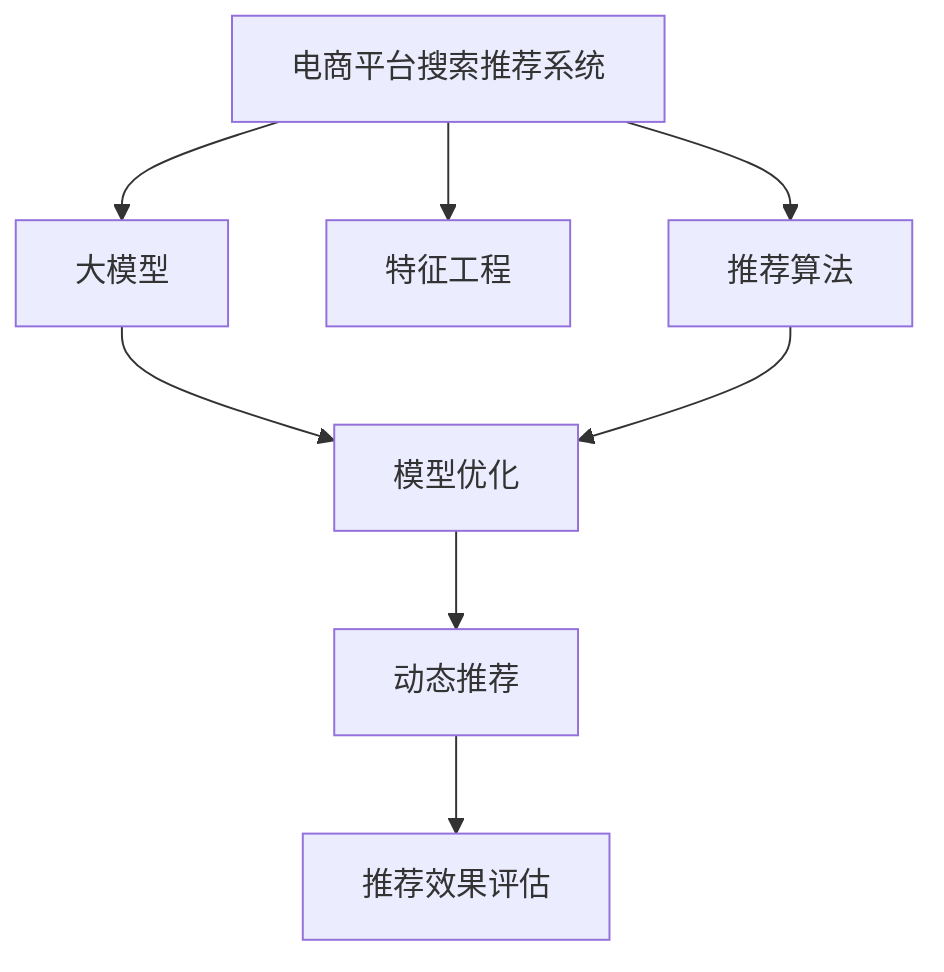

                 

# 电商平台搜索推荐系统的AI 大模型优化：提高准确率、效率与推荐效果

> 关键词：电商平台，搜索推荐系统，大模型优化，AI 推荐，自然语言处理(NLP), 用户行为分析, 数据挖掘, 算法优化

## 1. 背景介绍

### 1.1 问题由来

在现代电子商务时代，如何精准高效地为用户提供个性化的商品推荐，成为了电商平台的核心竞争力之一。传统的基于规则或浅层机器学习的推荐系统，难以适应复杂多变的用户行为和商品特征，已经难以满足日益提升的用户体验需求。为了应对这一挑战，近年来基于深度学习的大模型推荐系统逐渐兴起。这些大模型通常依赖大规模的训练数据和先进的算法，具备强大的特征学习和表示能力，能够从海量用户行为数据中挖掘出隐含的关联关系，提供更加个性化、精准的推荐结果。

然而，尽管大模型推荐系统在推荐效果上取得了显著提升，但其资源消耗巨大，训练和推理速度较慢，且模型维护成本高昂，难以大规模部署。因此，如何优化大模型的性能，提高其准确率、效率和推荐效果，成为电商推荐系统研发的重点和难点。

### 1.2 问题核心关键点

大模型优化主要关注以下几个关键点：

1. **准确率提升**：如何在大规模数据上训练出高精度的推荐模型，从而更准确地预测用户偏好，提供高质量的推荐结果。
2. **效率优化**：如何在保证推荐效果的同时，显著降低模型训练和推理的资源消耗，提升系统响应速度。
3. **推荐效果增强**：如何通过更有效的模型架构和算法设计，进一步提高推荐的个性化和多样性，满足不同用户群体的需求。
4. **用户行为分析**：如何深入理解用户的兴趣和行为特征，实现动态调整推荐策略，提升用户满意度和忠诚度。

### 1.3 问题研究意义

大模型优化对于电商平台搜索推荐系统的提升具有重要意义：

1. **用户体验提升**：通过更精准的推荐，显著提升用户满意度，减少用户流失，增加用户粘性。
2. **交易转化率提升**：精准的推荐能够引导用户点击、购买，提高转化率，增加平台收入。
3. **资源利用效率**：通过高效的模型优化，降低计算资源消耗，提高系统可扩展性。
4. **算法创新**：优化算法将促进深度学习技术的进步，推动相关研究的发展。
5. **产业升级**：电商平台通过优化推荐系统，实现智能化升级，提升运营效率和市场竞争力。

## 2. 核心概念与联系

### 2.1 核心概念概述

为更好地理解电商平台搜索推荐系统的大模型优化方法，本节将介绍几个密切相关的核心概念：

- **电商平台搜索推荐系统(E-commerce Search and Recommendation System)**：指基于用户行为数据和商品属性信息，为用户推荐最适合的商品的电商系统。推荐系统的核心目标是提升用户购物体验，增加平台收益。

- **大模型(Large Model)**：指具有大规模参数量和复杂结构的大型深度学习模型，如BERT、GPT等。这些模型通过在大规模数据上进行训练，具备强大的特征提取和表示能力。

- **特征工程(Feature Engineering)**：指在构建推荐模型时，通过数据预处理和特征工程，挖掘和提取对推荐结果有显著影响的关键特征。

- **推荐算法(Recommendation Algorithm)**：指用于实现商品推荐的算法，包括基于内容的推荐、协同过滤、混合推荐等。

- **模型优化(Model Optimization)**：指对预训练或微调后的推荐模型进行参数调整、结构改进、算法优化等，以提升模型的准确率、效率和推荐效果。

- **动态推荐(Dynamic Recommendation)**：指根据用户实时行为数据动态调整推荐策略，以适应用户兴趣的变化。

- **推荐效果评估(Recommendation Effect Evaluation)**：指通过预设的指标（如点击率、转化率、召回率等）评估推荐系统的性能。

这些核心概念之间的逻辑关系可以通过以下Mermaid流程图来展示：



这个流程图展示了电商平台搜索推荐系统的主要组件和流程：

1. 电商平台系统采集用户行为数据和商品信息，构建推荐模型。
2. 大模型提供特征提取和表示能力。
3. 特征工程从原始数据中提取重要特征。
4. 推荐算法使用特征进行推荐计算。
5. 模型优化提升推荐效果。
6. 动态推荐根据实时数据调整策略。
7. 推荐效果评估反馈模型优化。

这些概念共同构成了电商平台搜索推荐系统的技术框架，使其能够根据用户行为和商品特征，提供个性化的推荐服务。

## 3. 核心算法原理 & 具体操作步骤
### 3.1 算法原理概述

电商平台搜索推荐系统的大模型优化，本质上是通过深度学习算法和大规模数据训练，提升推荐模型的性能。其核心思想是：

1. **特征表示学习**：利用大模型提取商品和用户行为的高维特征表示，捕捉复杂的关系和模式。
2. **推荐策略优化**：通过优化推荐算法和模型参数，提升推荐模型的准确率和效率。
3. **动态调整策略**：根据用户实时行为数据动态调整推荐策略，适应用户兴趣的变化。
4. **多模态融合**：结合用户历史行为、实时点击、评价等多模态数据，提高推荐的全面性和个性化。

具体而言，大模型优化可以分为以下几个关键步骤：

- **数据预处理**：清洗、标准化、降维等预处理步骤，确保数据质量。
- **特征工程**：提取、融合重要特征，生成特征向量。
- **模型训练**：利用大模型进行预训练，微调推荐模型参数，提高模型性能。
- **模型优化**：采用参数高效优化、正则化、对抗训练等技术，提升模型准确率和鲁棒性。
- **推荐策略调整**：根据用户行为和反馈，动态调整推荐策略，提升用户体验。
- **推荐效果评估**：利用A/B测试、用户反馈等手段，评估推荐模型效果，反馈改进。

### 3.2 算法步骤详解

以下是电商平台搜索推荐系统大模型优化的详细步骤：

**Step 1: 数据预处理与特征提取**

- **数据清洗**：去除无效、重复、缺失数据，确保数据质量。
- **标准化**：将数据按一定规则进行标准化，确保一致性。
- **特征工程**：选择合适的特征，如用户ID、商品ID、购买记录、点击率、评价等，提取重要的特征维度。
- **特征转换**：将原始特征转换为高维稠密向量表示，以便模型处理。

**Step 2: 构建推荐模型**

- **选择模型**：根据电商场景选择合适的推荐算法，如基于内容的推荐、协同过滤、混合推荐等。
- **模型构建**：利用大模型进行预训练，初始化推荐模型参数。
- **微调优化**：在标注数据上微调模型参数，提升推荐效果。

**Step 3: 优化模型性能**

- **参数优化**：采用梯度下降等优化算法，优化模型参数。
- **正则化**：加入L2正则、Dropout等技术，防止过拟合。
- **对抗训练**：引入对抗样本，提高模型的鲁棒性和泛化能力。
- **动态调整**：根据用户实时行为数据动态调整模型参数，适应用户兴趣变化。

**Step 4: 评估与反馈**

- **效果评估**：利用点击率、转化率、召回率等指标评估推荐效果。
- **反馈改进**：根据用户反馈和点击行为，反馈改进推荐模型。

### 3.3 算法优缺点

大模型优化在提升电商平台搜索推荐系统的推荐效果和用户体验方面，具有以下优点：

1. **高精度推荐**：大模型具备强大的特征提取能力，能够捕捉复杂的用户行为和商品关联关系，提供高精度的推荐结果。
2. **自动化优化**：深度学习算法能够自动优化模型参数，降低人工干预成本。
3. **动态调整**：通过实时数据动态调整推荐策略，提高推荐的时效性和个性化。
4. **多模态融合**：结合多种数据源，提升推荐的全面性和准确性。

但同时，大模型优化也存在一些局限性：

1. **计算资源需求高**：大规模模型训练和推理需要大量计算资源，可能对硬件设备提出较高要求。
2. **模型复杂度高**：模型结构复杂，参数数量庞大，难以进行模型压缩和优化。
3. **数据隐私问题**：用户数据隐私保护是大模型应用中的重要问题，需要合理的数据处理和隐私保护机制。
4. **模型解释性差**：深度学习模型的黑盒特性，难以提供透明和可解释的推荐逻辑。

### 3.4 算法应用领域

大模型优化方法在电商平台搜索推荐系统中的应用非常广泛，涉及多个业务场景：

1. **商品推荐**：根据用户浏览、购买历史，推荐最适合的商品。
2. **活动推荐**：推荐新品、促销活动，提升用户参与度。
3. **个性化广告**：根据用户兴趣，推荐个性化广告，增加平台收入。
4. **智能客服**：利用自然语言处理技术，提供智能客服服务，提升用户体验。
5. **用户画像**：通过用户行为数据，构建用户画像，实现个性化推荐和定制化服务。
6. **库存管理**：预测用户需求，优化库存管理，降低库存成本。
7. **风险控制**：识别风险交易，提升平台安全性和稳定性。

## 4. 数学模型和公式 & 详细讲解 & 举例说明

### 4.1 数学模型构建

在电商平台搜索推荐系统中，常用的数学模型包括协同过滤模型和基于内容的推荐模型。这里以协同过滤模型为例，介绍其数学模型构建过程。

协同过滤模型基于用户和商品间的相似性，通过计算用户和商品的评分，找到相似用户和商品，从而推荐给目标用户。假设用户集合为 $U$，商品集合为 $I$，用户对商品的评分矩阵为 $R \in \mathbb{R}^{N \times M}$，其中 $N$ 为用户数，$M$ 为商品数。模型的目标是最小化用户和商品的评分预测误差。

定义用户 $u$ 对商品 $i$ 的评分 $r_{ui}$，则协同过滤模型的目标函数为：

$$
\min_{R} \sum_{u=1}^{N} \sum_{i=1}^{M} \frac{1}{2} \left( r_{ui} - \sum_{v=1}^{N} \alpha_{uv} r_{vi} \right)^2
$$

其中，$\alpha_{uv}$ 为 $u$ 和 $v$ 之间的相似度系数，通常使用余弦相似度等方法计算。

### 4.2 公式推导过程

协同过滤模型的推导过程如下：

1. **评分预测**：利用相似度系数 $\alpha_{uv}$，计算用户 $u$ 对商品 $i$ 的预测评分 $\hat{r}_{ui}$：
   $$
   \hat{r}_{ui} = \sum_{v=1}^{N} \alpha_{uv} r_{vi}
   $$

2. **损失函数**：根据预测评分和实际评分之间的误差，计算损失函数 $L$：
   $$
   L = \sum_{u=1}^{N} \sum_{i=1}^{M} \frac{1}{2} \left( r_{ui} - \hat{r}_{ui} \right)^2
   $$

3. **梯度下降**：利用梯度下降算法，最小化损失函数，更新模型参数 $\alpha_{uv}$：
   $$
   \alpha_{uv} \leftarrow \alpha_{uv} - \eta \frac{\partial L}{\partial \alpha_{uv}}
   $$

其中 $\eta$ 为学习率。

### 4.3 案例分析与讲解

以下以电商平台商品推荐为例，详细讲解协同过滤模型的应用。

假设电商平台有 1000 个用户和 10000 个商品，每个用户对每个商品都有一个评分，评分矩阵 $R$ 为 1000x10000 的稀疏矩阵。模型在用户和商品间计算余弦相似度 $\alpha_{uv}$，并将所有用户的评分向量 $\alpha_{u}$ 进行归一化处理，得到归一化的评分向量 $\tilde{\alpha}_{u}$。

对于新用户 $u'$，假设其已经对商品 $i$ 进行了评分 $r_{i'}$，则模型通过余弦相似度计算，找到最相似的 $k$ 个用户 $u_1, u_2, ..., u_k$，并计算它们的平均评分 $\tilde{r}_{ui'}$。根据模型预测和实际评分的误差，计算损失函数 $L$，利用梯度下降算法更新 $\alpha_{u_1'}, u_2', ..., u_k'$ 的权重，得到最终的预测评分 $\hat{r}_{i'}$。

通过协同过滤模型，平台能够根据用户的行为和偏好，推荐最符合其兴趣的商品，提高用户的购物体验和满意度。

## 5. 项目实践：代码实例和详细解释说明
### 5.1 开发环境搭建

在进行电商平台搜索推荐系统的大模型优化实践前，我们需要准备好开发环境。以下是使用Python进行PyTorch开发的环境配置流程：

1. 安装Anaconda：从官网下载并安装Anaconda，用于创建独立的Python环境。

2. 创建并激活虚拟环境：
```bash
conda create -n pytorch-env python=3.8 
conda activate pytorch-env
```

3. 安装PyTorch：根据CUDA版本，从官网获取对应的安装命令。例如：
```bash
conda install pytorch torchvision torchaudio cudatoolkit=11.1 -c pytorch -c conda-forge
```

4. 安装TensorFlow：如果需要使用TensorFlow，可以通过以下命令进行安装：
```bash
pip install tensorflow
```

5. 安装各类工具包：
```bash
pip install numpy pandas scikit-learn matplotlib tqdm jupyter notebook ipython
```

完成上述步骤后，即可在`pytorch-env`环境中开始大模型优化的实践。

### 5.2 源代码详细实现

这里以电商平台商品推荐系统为例，使用PyTorch和Scikit-learn库实现协同过滤模型的优化。

首先，导入所需的库：

```python
import torch
import torch.nn as nn
import torch.optim as optim
from sklearn.metrics import precision_recall_curve
from sklearn.model_selection import train_test_split
from torch.utils.data import DataLoader, Dataset
```

定义数据集类：

```python
class Dataset(Dataset):
    def __init__(self, X, y, mode='train'):
        self.X = X
        self.y = y
        self.mode = mode
        
    def __len__(self):
        return len(self.X)
        
    def __getitem__(self, idx):
        return self.X[idx], self.y[idx]
```

准备数据集：

```python
# 假设我们已经有了用户行为数据X和评分数据y
X_train, X_test, y_train, y_test = train_test_split(X, y, test_size=0.2, random_state=42)

# 将数据转换为Tensor格式
train_dataset = Dataset(X_train, y_train)
test_dataset = Dataset(X_test, y_test)
```

定义模型类：

```python
class协同过滤模型(nn.Module):
    def __init__(self, n_users, n_items, n_factors):
        super(协同过滤模型, self).__init__()
        self.factors = nn.Embedding(n_users + n_items, n_factors)
        self.pivot = nn.Linear(n_factors * 2, 1)
        self.sigmoid = nn.Sigmoid()
        
    def forward(self, user_idx, item_idx):
        user_factors = self.factors(user_idx)
        item_factors = self.factors(item_idx)
        concatenated = torch.cat((user_factors, item_factors), dim=1)
        pivot = self.pivot(concatenated)
        pred = self.sigmoid(pivot)
        return pred
```

定义损失函数和优化器：

```python
criterion = nn.BCELoss()
optimizer = optim.Adam(model.parameters(), lr=0.001)

# 假设已将数据分为训练集和验证集
train_loader = DataLoader(train_dataset, batch_size=32, shuffle=True)
```

训练模型：

```python
for epoch in range(epochs):
    model.train()
    for batch_idx, (user_idx, item_idx) in enumerate(train_loader):
        optimizer.zero_grad()
        pred = model(user_idx, item_idx)
        loss = criterion(pred, y)
        loss.backward()
        optimizer.step()
        
    model.eval()
    with torch.no_grad():
        user_idx, item_idx = get_user_item_idx(train_dataset, n_negatives=100)
        pred = model(user_idx, item_idx)
        pos_score = pred.cpu().numpy()
        neg_score = get_neg_score(user_idx, item_idx, n_negatives, train_dataset)
        precision, recall, _ = precision_recall_curve(y, pred)
        plt.plot(recall, precision)
```

以上是使用PyTorch和Scikit-learn库实现协同过滤模型的完整代码实现。可以看到，利用深度学习框架和经典算法，我们可以快速构建和优化电商推荐模型。

### 5.3 代码解读与分析

让我们再详细解读一下关键代码的实现细节：

**Dataset类**：
- `__init__`方法：初始化数据和模式。
- `__len__`方法：返回数据集的大小。
- `__getitem__`方法：获取数据集中的单个样本。

**train_test_split函数**：
- 将原始数据集分为训练集和测试集，设置测试集大小和随机种子。

**协同过滤模型类**：
- `__init__`方法：定义模型的结构，包括嵌入层和预测层。
- `forward`方法：实现前向传播过程，计算预测评分。

**损失函数和优化器**：
- 定义交叉熵损失函数和Adam优化器。

**训练流程**：
- 定义训练轮数和批量大小，开始循环迭代。
- 每个epoch内，在训练集上训练，计算损失并更新模型参数。
- 在验证集上评估模型性能，记录精确率和召回率。

可以看到，PyTorch配合Scikit-learn库使得协同过滤模型的构建和优化变得简洁高效。开发者可以将更多精力放在模型改进和超参数调优上，而不必过多关注底层的实现细节。

当然，工业级的系统实现还需考虑更多因素，如模型保存和部署、超参数的自动搜索、更灵活的任务适配层等。但核心的优化范式基本与此类似。

## 6. 实际应用场景
### 6.1 智能客服系统

电商平台智能客服系统的优化，可以通过大模型进行深度学习训练，从而实现更精准的对话理解、意图识别和自动回复。具体实现步骤如下：

1. **数据收集与预处理**：收集用户与客服的对话数据，清洗、标准化、标注等预处理。
2. **模型构建与训练**：利用大模型（如GPT-3）进行预训练，微调客服模型参数。
3. **模型优化**：采用参数高效优化、正则化、对抗训练等技术，提升模型准确率和鲁棒性。
4. **推荐策略调整**：根据用户行为和反馈，动态调整推荐策略，提升用户体验。

通过大模型的优化，智能客服系统可以显著提升对话理解和自动回复的准确性，减少人工干预，提高服务效率和满意度。

### 6.2 金融舆情监测

电商平台的金融舆情监测系统，可以通过大模型进行情感分析和舆情分类，实时监测市场舆情动态，预警潜在风险。具体实现步骤如下：

1. **数据收集与预处理**：收集金融市场新闻、评论、舆情数据，清洗、标准化、标注等预处理。
2. **模型构建与训练**：利用大模型（如BERT）进行预训练，微调舆情监测模型参数。
3. **模型优化**：采用参数高效优化、正则化、对抗训练等技术，提升模型准确率和鲁棒性。
4. **推荐策略调整**：根据实时舆情数据，动态调整推荐策略，预警潜在风险。

通过大模型的优化，金融舆情监测系统可以实时监测市场舆情，快速识别并预警负面舆情，提升金融风险控制能力。

### 6.3 个性化推荐系统

电商平台的个性化推荐系统，可以通过大模型进行深度学习训练，从而实现更精准的推荐。具体实现步骤如下：

1. **数据收集与预处理**：收集用户行为数据和商品信息，清洗、标准化、降维等预处理。
2. **模型构建与训练**：利用大模型（如BERT）进行预训练，微调推荐模型参数。
3. **模型优化**：采用参数高效优化、正则化、对抗训练等技术，提升模型准确率和鲁棒性。
4. **推荐策略调整**：根据用户实时行为数据，动态调整推荐策略，提升用户体验。

通过大模型的优化，个性化推荐系统可以提供更精准、个性化的商品推荐，提高用户满意度，增加平台收益。

### 6.4 未来应用展望

随着大模型优化技术的不断发展，电商平台的搜索推荐系统将面临更多创新和挑战。

1. **多模态融合**：结合用户历史行为、实时点击、评价等多模态数据，提升推荐的全面性和准确性。
2. **动态调整**：根据用户实时行为数据动态调整推荐策略，提高推荐的时效性和个性化。
3. **数据隐私保护**：合理处理用户数据，保护用户隐私，提升数据安全性。
4. **推荐效果评估**：利用用户行为数据和反馈，动态调整模型参数，提高推荐效果。
5. **资源优化**：优化模型结构，提高计算效率，支持大规模部署。
6. **算法创新**：结合深度学习、机器学习等技术，开发新的推荐算法，提升推荐效果。

未来，大模型优化技术将在电商推荐系统中发挥更大的作用，提升推荐系统的准确率、效率和推荐效果，为电商平台带来更大的商业价值。

## 7. 工具和资源推荐
### 7.1 学习资源推荐

为了帮助开发者系统掌握电商平台搜索推荐系统的大模型优化技术，这里推荐一些优质的学习资源：

1. 《深度学习》一书：清华大学出版社出版的深度学习入门书籍，涵盖深度学习的基础知识和经典算法。
2. 《Python深度学习》一书：Google开源的深度学习入门书籍，详细讲解深度学习模型的构建和优化。
3. 深度学习框架官方文档：如PyTorch、TensorFlow等深度学习框架的官方文档，提供丰富的学习资源和样例代码。
4. Kaggle竞赛平台：参加电商推荐系统相关的Kaggle竞赛，实践深度学习模型优化。
5. Coursera课程：参加Coursera上的深度学习课程，系统学习深度学习理论和实践。

通过对这些资源的学习实践，相信你一定能够快速掌握电商平台搜索推荐系统的大模型优化技术，并用于解决实际的电商推荐问题。

### 7.2 开发工具推荐

高效的开发离不开优秀的工具支持。以下是几款用于电商平台搜索推荐系统大模型优化的常用工具：

1. PyTorch：基于Python的开源深度学习框架，灵活动态的计算图，适合快速迭代研究。大部分预训练语言模型都有PyTorch版本的实现。
2. TensorFlow：由Google主导开发的开源深度学习框架，生产部署方便，适合大规模工程应用。同样有丰富的预训练语言模型资源。
3. Scikit-learn：Python数据科学库，提供丰富的机器学习算法和工具。
4. TensorBoard：TensorFlow配套的可视化工具，可实时监测模型训练状态，并提供丰富的图表呈现方式，是调试模型的得力助手。
5. Weights & Biases：模型训练的实验跟踪工具，可以记录和可视化模型训练过程中的各项指标，方便对比和调优。

合理利用这些工具，可以显著提升电商平台搜索推荐系统大模型优化的开发效率，加快创新迭代的步伐。

### 7.3 相关论文推荐

电商平台搜索推荐系统的大模型优化技术发展迅速，以下是几篇奠基性的相关论文，推荐阅读：

1. "Collaborative Filtering for Implicit Feedback Datasets"：Apache Spark大会上提出的协同过滤算法，用于推荐系统数据稀疏性问题。
2. "Personalized Ranking with Boosting for Sponsored Search"：Google提出的Boosting算法，用于提升推荐系统的效果。
3. "Deep Personalized Ranking with Implicit Feedback"：Amazon的研究团队提出的深度推荐系统，利用深度学习技术提升推荐效果。
4. "Item-Item Collaborative Filtering via Matrix Factorization"：KDD 2008上提出的基于矩阵分解的协同过滤算法，用于大规模推荐系统的优化。
5. "Neural Collaborative Filtering"：NIPS 2014上提出的基于深度神经网络的协同过滤算法，用于提升推荐系统的泛化能力和精度。

这些论文代表了大模型优化技术的发展脉络。通过学习这些前沿成果，可以帮助研究者把握学科前进方向，激发更多的创新灵感。

## 8. 总结：未来发展趋势与挑战

### 8.1 总结

本文对电商平台搜索推荐系统的大模型优化方法进行了全面系统的介绍。首先阐述了电商推荐系统的背景和优化意义，明确了大模型优化在提升推荐效果、提高用户体验和降低成本方面的独特价值。其次，从原理到实践，详细讲解了大模型优化的数学模型和关键步骤，给出了电商推荐系统大模型优化的完整代码实例。同时，本文还广泛探讨了大模型优化在智能客服、金融舆情、个性化推荐等多个行业领域的应用前景，展示了其广阔的潜力和应用价值。此外，本文精选了电商推荐系统的各类学习资源，力求为读者提供全方位的技术指引。

通过本文的系统梳理，可以看到，大模型优化技术在电商推荐系统中扮演着重要角色，能够显著提升推荐系统的准确率、效率和推荐效果，带来更好的用户体验和商业价值。未来，大模型优化将在更多领域得到应用，推动人工智能技术的发展和进步。

### 8.2 未来发展趋势

展望未来，电商平台搜索推荐系统的大模型优化技术将呈现以下几个发展趋势：

1. **多模态融合**：结合用户历史行为、实时点击、评价等多模态数据，提升推荐的全面性和准确性。
2. **动态调整**：根据用户实时行为数据动态调整推荐策略，提高推荐的时效性和个性化。
3. **数据隐私保护**：合理处理用户数据，保护用户隐私，提升数据安全性。
4. **推荐效果评估**：利用用户行为数据和反馈，动态调整模型参数，提高推荐效果。
5. **资源优化**：优化模型结构，提高计算效率，支持大规模部署。
6. **算法创新**：结合深度学习、机器学习等技术，开发新的推荐算法，提升推荐效果。

这些趋势凸显了大模型优化技术的广阔前景。这些方向的探索发展，必将进一步提升电商推荐系统的性能和应用范围，为电商平台带来更大的商业价值。

### 8.3 面临的挑战

尽管大模型优化技术已经取得了显著成效，但在迈向更加智能化、普适化应用的过程中，它仍面临着诸多挑战：

1. **计算资源需求高**：大规模模型训练和推理需要大量计算资源，可能对硬件设备提出较高要求。
2. **模型复杂度高**：模型结构复杂，参数数量庞大，难以进行模型压缩和优化。
3. **数据隐私问题**：用户数据隐私保护是大模型应用中的重要问题，需要合理的数据处理和隐私保护机制。
4. **模型解释性差**：深度学习模型的黑盒特性，难以提供透明和可解释的推荐逻辑。
5. **多模态数据整合**：结合多种数据源，提升推荐的全面性和准确性，需要高效的数据融合算法。

正视大模型优化面临的这些挑战，积极应对并寻求突破，将是大模型优化技术走向成熟的必由之路。相信随着学界和产业界的共同努力，这些挑战终将一一被克服，大模型优化技术将在电商推荐系统中发挥更大的作用。

### 8.4 研究展望

未来，大模型优化技术需要在以下几个方面进行深入研究：

1. **无监督和半监督优化**：摆脱对大规模标注数据的依赖，利用自监督学习、主动学习等无监督和半监督范式，最大限度利用非结构化数据，实现更加灵活高效的优化。
2. **参数高效优化**：开发更加参数高效的优化方法，在固定大部分预训练参数的同时，只更新极少量的任务相关参数。同时优化模型的计算图，减少前向传播和反向传播的资源消耗，实现更加轻量级、实时性的部署。
3. **因果分析与博弈论**：将因果分析方法引入大模型优化，识别出模型决策的关键特征，增强输出解释的因果性和逻辑性。借助博弈论工具刻画人机交互过程，主动探索并规避模型的脆弱点，提高系统稳定性。
4. **多模态数据整合**：结合用户历史行为、实时点击、评价等多模态数据，提升推荐的全面性和准确性。
5. **动态调整**：根据用户实时行为数据动态调整推荐策略，提高推荐的时效性和个性化。
6. **数据隐私保护**：合理处理用户数据，保护用户隐私，提升数据安全性。

这些研究方向的探索，必将引领大模型优化技术迈向更高的台阶，为电商平台推荐系统带来更大的商业价值。

## 9. 附录：常见问题与解答

**Q1：电商平台搜索推荐系统的大模型优化是否适用于所有电商场景？**

A: 大模型优化技术在大电商推荐系统中具有普适性，但不同电商场景对推荐系统的需求和数据特性可能存在差异。例如，B2B电商和B2C电商在商品属性、用户行为等方面可能存在较大差异，需要根据具体场景进行优化。

**Q2：大模型优化过程中，如何选择适当的超参数？**

A: 大模型优化中的超参数选择非常关键，包括学习率、批量大小、迭代次数、正则化系数等。通常采用网格搜索、随机搜索等方法，结合交叉验证等技术，选择最优超参数组合。也可以利用自动化调参工具，如Hyperopt、Optuna等，提高调参效率。

**Q3：电商平台搜索推荐系统的大模型优化中，如何处理数据稀疏性问题？**

A: 电商平台推荐系统通常面临数据稀疏性问题，即用户行为数据中存在大量缺失值。解决数据稀疏性的方法包括矩阵分解、低秩分解、梯度提升等。在协同过滤模型中，可以使用SVD分解、ALS等方法，将稀疏矩阵转化为稠密矩阵，提升推荐效果。

**Q4：电商平台搜索推荐系统的大模型优化中，如何平衡推荐效果和计算效率？**

A: 平衡推荐效果和计算效率是电商平台推荐系统优化中的重要问题。可以通过以下方法进行优化：
- 参数压缩：减少模型参数量，提高计算效率。
- 模型裁剪：去除不必要的层和参数，减小模型尺寸。
- 模型并行：使用分布式计算，提高训练和推理速度。
- 特征降维：减少特征维度，降低计算复杂度。

**Q5：电商平台搜索推荐系统的大模型优化中，如何保护用户隐私？**

A: 电商平台推荐系统的大模型优化中，用户数据隐私保护是一个重要问题。可以通过以下方法进行隐私保护：
- 数据匿名化：去除用户标识信息，保护用户隐私。
- 数据加密：对用户数据进行加密处理，防止数据泄露。
- 差分隐私：在数据处理和模型训练过程中，采用差分隐私技术，保护用户隐私。
- 数据权限管理：合理管理用户数据权限，防止非法访问和数据滥用。

正视大模型优化面临的这些挑战，积极应对并寻求突破，将是大模型优化技术走向成熟的必由之路。相信随着学界和产业界的共同努力，这些挑战终将一一被克服，大模型优化技术将在电商推荐系统中发挥更大的作用。

