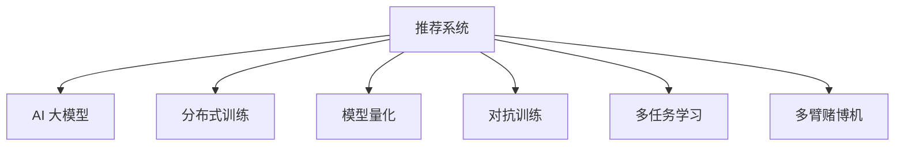

                 

# 电商平台搜索推荐系统的AI 大模型优化：提高系统性能、效率、准确率与多样性

> 关键词：
- 电商平台
- 搜索推荐系统
- AI 大模型
- 性能优化
- 效率提升
- 准确率增强
- 多样性提高

## 1. 背景介绍

### 1.1 问题由来
随着电商平台业务的迅速发展，用户搜索和推荐的复杂度不断增加，需要依赖高效、准确的AI算法来优化用户体验和业务转化率。目前，基于深度学习的大模型在推荐系统中的应用已经取得了显著的效果。例如，使用基于Transformer架构的BERT、GPT等模型，结合点击率预测、用户画像生成等任务，显著提升了推荐系统的个性化和精准度。

然而，现有的推荐系统仍然存在一些问题：
- **性能瓶颈**：大模型虽然精度高，但由于参数量巨大，计算复杂度高，导致训练和推理速度较慢，难以满足实时化和高并发的需求。
- **资源消耗**：大规模模型的高存储和计算需求，增加了服务器和网络资源的使用，提高了成本。
- **算法稳定性**：模型在分布式训练和推理过程中，存在收敛速度慢、鲁棒性差等问题，影响系统的稳定性和可靠性。
- **数据噪声**：电商平台上的交易数据和行为数据往往存在噪声和偏差，影响了模型的准确性和泛化能力。

为了解决这些问题，有必要对搜索推荐系统中的大模型进行优化，提升系统性能、效率、准确率和多样性。

### 1.2 问题核心关键点
本文将聚焦于以下核心问题：
- **如何减少大模型的计算和存储需求**：通过参数裁剪、模型量化等技术，降低模型规模，提升计算效率。
- **如何增强模型的鲁棒性和稳定性**：引入对抗训练、正则化等方法，提高模型的泛化能力和鲁棒性。
- **如何提升推荐系统的多样性**：在模型中引入多样化策略，如多臂赌博机、Gumbel-softmax等，使推荐结果更加丰富和多样。
- **如何提高推荐系统的准确性**：通过多任务学习和迁移学习等方法，利用其他领域的知识提升模型的预测能力。

## 2. 核心概念与联系

### 2.1 核心概念概述

为了更好地理解大模型在推荐系统中的应用，本节将介绍几个密切相关的核心概念：

- **推荐系统**：根据用户的历史行为和偏好，推荐相关商品或内容，提高用户满意度和平台转化率。
- **AI 大模型**：通过大规模无标签数据的预训练和监督学习的微调，具备强大的语言理解和生成能力，用于优化推荐系统的各个环节。
- **分布式训练**：将训练任务分配到多台机器上进行并行处理，加速模型训练和推理。
- **模型量化**：将浮点数参数转化为定点数参数，降低模型存储和计算需求，提升计算效率。
- **对抗训练**：通过引入对抗样本，提高模型的鲁棒性和泛化能力。
- **多任务学习**：通过联合学习多个相关任务，提升模型的整体性能和泛化能力。
- **多臂赌博机**：一种决策策略，用于在多个选项中寻找最优选择，模拟推荐系统的多目标优化。

这些概念之间的逻辑关系可以通过以下Mermaid流程图来展示：



这个流程图展示了大模型在推荐系统中的应用流程：

1. 推荐系统通过收集用户数据，进行商品或内容的推荐。
2. AI 大模型作为核心算法，用于处理和优化推荐系统的各个环节。
3. 分布式训练、模型量化等技术，优化大模型的计算和存储需求。
4. 对抗训练、多任务学习等方法，提升模型的鲁棒性和泛化能力。
5. 多臂赌博机等策略，提升推荐结果的多样性。

这些概念共同构成了推荐系统中的AI大模型优化框架，使其能够更好地适应电商平台的复杂需求。

## 3. 核心算法原理 & 具体操作步骤
### 3.1 算法原理概述

基于大模型的推荐系统优化，本质上是一个多任务学习和模型微调的过程。其核心思想是：将预训练大模型作为强大的"特征提取器"，通过下游推荐任务的监督数据，优化模型参数，提高推荐系统的性能和多样性。

形式化地，假设预训练模型为 $M_{\theta}$，其中 $\theta$ 为预训练得到的模型参数。给定电商平台推荐任务 $T$ 的标注数据集 $D=\{(x_i, y_i)\}_{i=1}^N$，优化目标是最小化经验风险，即找到最优参数：

$$
\theta^* = \mathop{\arg\min}_{\theta} \mathcal{L}(M_{\theta},D)
$$

其中 $\mathcal{L}$ 为针对任务 $T$ 设计的损失函数，用于衡量模型预测输出与真实标签之间的差异。常见的损失函数包括交叉熵损失、均方误差损失等。

通过梯度下降等优化算法，微调过程不断更新模型参数 $\theta$，最小化损失函数 $\mathcal{L}$，使得模型输出逼近真实标签。由于 $\theta$ 已经通过预训练获得了较好的初始化，因此即便在少量标注数据的情况下，也能较快收敛到理想的模型参数 $\hat{\theta}$。

### 3.2 算法步骤详解

基于大模型的推荐系统优化一般包括以下几个关键步骤：

**Step 1: 准备预训练模型和数据集**
- 选择合适的预训练模型 $M_{\theta}$ 作为初始化参数，如 BERT、GPT 等。
- 准备电商平台推荐任务 $T$ 的标注数据集 $D$，划分为训练集、验证集和测试集。

**Step 2: 添加推荐任务适配层**
- 根据推荐任务类型，在预训练模型顶层设计合适的输出层和损失函数。
- 对于点击率预测任务，通常在顶层添加线性分类器或MLP网络，并使用交叉熵损失函数。
- 对于内容推荐任务，通常使用注意力机制和MLP网络，并使用均方误差损失函数。

**Step 3: 设置微调超参数**
- 选择合适的优化算法及其参数，如 Adam、SGD 等，设置学习率、批大小、迭代轮数等。
- 设置正则化技术及强度，包括L2正则、Dropout、Early Stopping等。
- 确定冻结预训练参数的策略，如仅微调顶层，或全部参数都参与微调。

**Step 4: 执行梯度训练**
- 将训练集数据分批次输入模型，前向传播计算损失函数。
- 反向传播计算参数梯度，根据设定的优化算法和学习率更新模型参数。
- 周期性在验证集上评估模型性能，根据性能指标决定是否触发 Early Stopping。
- 重复上述步骤直到满足预设的迭代轮数或 Early Stopping 条件。

**Step 5: 测试和部署**
- 在测试集上评估微调后模型 $M_{\hat{\theta}}$ 的性能，对比微调前后的效果。
- 使用微调后的模型对新用户进行推荐，集成到实际的应用系统中。
- 持续收集新数据，定期重新微调模型，以适应数据分布的变化。

以上是基于大模型的推荐系统优化的一般流程。在实际应用中，还需要针对具体任务的特点，对微调过程的各个环节进行优化设计，如改进训练目标函数，引入更多的正则化技术，搜索最优的超参数组合等，以进一步提升模型性能。

### 3.3 算法优缺点

基于大模型的推荐系统优化方法具有以下优点：
1. 快速提升推荐效果：通过预训练模型的迁移学习，可以快速获得较好的初始参数，提升推荐效果。
2. 灵活性高：大模型可以适应多种推荐任务，如点击率预测、内容推荐等，设计简单的任务适配层即可实现微调。
3. 准确率高：大模型的预训练表示能力，可以捕捉复杂的用户行为和商品特征，提升推荐模型的准确性。
4. 可扩展性强：大模型在分布式训练和推理方面具有天然的优势，可以高效处理大规模推荐数据。

同时，该方法也存在一定的局限性：
1. 依赖标注数据：微调的效果很大程度上取决于标注数据的质量和数量，获取高质量标注数据的成本较高。
2. 模型复杂度高：大模型虽然具有强大的表示能力，但其复杂度也带来较高的计算和存储需求。
3. 学习率敏感：微调过程中需要选择合适的学习率，过高或过低的学习率都可能导致模型性能波动。
4. 过拟合风险：由于数据标注的不足，微调模型可能存在过拟合的风险，导致泛化性能差。
5. 训练成本高：大规模分布式训练和推理需要高昂的算力和网络带宽，增加了训练成本。

尽管存在这些局限性，但就目前而言，基于大模型的推荐系统优化方法仍然是最主流、最有效的推荐系统优化范式。未来相关研究的重点在于如何进一步降低微调对标注数据的依赖，提高模型的泛化能力，同时兼顾可解释性和伦理安全性等因素。

### 3.4 算法应用领域

基于大模型的推荐系统优化方法，在电商平台推荐系统中得到了广泛的应用，覆盖了几乎所有常见任务，例如：

- 商品推荐：根据用户历史行为，推荐相关商品。通过微调优化模型，提升推荐的个性化和精准度。
- 内容推荐：推荐与用户兴趣匹配的内容。微调模型学习用户偏好，生成多样化推荐结果。
- 广告推荐：推荐相关广告，提升广告点击率和转化率。通过微调优化模型，提升广告投放效果。
- 营销活动推荐：推荐与用户需求匹配的营销活动。通过微调优化模型，提升营销活动效果。

除了上述这些经典任务外，大模型的推荐系统优化还被创新性地应用到更多场景中，如商品价格预测、库存管理、供应链优化等，为电商平台带来了全新的突破。随着大模型的不断发展，相信推荐系统优化技术将进一步拓展，为电商平台的业务创新提供新的动力。

## 4. 数学模型和公式 & 详细讲解 & 举例说明
### 4.1 数学模型构建

本节将使用数学语言对基于大模型的推荐系统优化过程进行更加严格的刻画。

记推荐系统为 $S=\{(X_i, Y_i)\}_{i=1}^N$，其中 $X_i$ 为输入数据（如用户行为），$Y_i$ 为输出数据（如推荐结果）。假设预训练语言模型为 $M_{\theta}$，其中 $\theta$ 为模型参数。

定义模型 $M_{\theta}$ 在数据样本 $(x,y)$ 上的损失函数为 $\ell(M_{\theta}(x),y)$，则在数据集 $S$ 上的经验风险为：

$$
\mathcal{L}(\theta) = \frac{1}{N}\sum_{i=1}^N \ell(M_{\theta}(x_i),y_i)
$$

微调的优化目标是最小化经验风险，即找到最优参数：

$$
\theta^* = \mathop{\arg\min}_{\theta} \mathcal{L}(\theta)
$$

在实践中，我们通常使用基于梯度的优化算法（如SGD、Adam等）来近似求解上述最优化问题。设 $\eta$ 为学习率，$\lambda$ 为正则化系数，则参数的更新公式为：

$$
\theta \leftarrow \theta - \eta \nabla_{\theta}\mathcal{L}(\theta) - \eta\lambda\theta
$$

其中 $\nabla_{\theta}\mathcal{L}(\theta)$ 为损失函数对参数 $\theta$ 的梯度，可通过反向传播算法高效计算。

### 4.2 公式推导过程

以下我们以点击率预测任务为例，推导交叉熵损失函数及其梯度的计算公式。

假设模型 $M_{\theta}$ 在输入 $x$ 上的输出为 $\hat{y}=M_{\theta}(x)$，表示模型预测用户点击的概率。真实标签 $y \in \{0,1\}$。则二分类交叉熵损失函数定义为：

$$
\ell(M_{\theta}(x),y) = -[y\log \hat{y} + (1-y)\log (1-\hat{y})]
$$

将其代入经验风险公式，得：

$$
\mathcal{L}(\theta) = -\frac{1}{N}\sum_{i=1}^N [y_i\log M_{\theta}(x_i)+(1-y_i)\log(1-M_{\theta}(x_i))]
$$

根据链式法则，损失函数对参数 $\theta_k$ 的梯度为：

$$
\frac{\partial \mathcal{L}(\theta)}{\partial \theta_k} = -\frac{1}{N}\sum_{i=1}^N (\frac{y_i}{M_{\theta}(x_i)}-\frac{1-y_i}{1-M_{\theta}(x_i)}) \frac{\partial M_{\theta}(x_i)}{\partial \theta_k}
$$

其中 $\frac{\partial M_{\theta}(x_i)}{\partial \theta_k}$ 可进一步递归展开，利用自动微分技术完成计算。

在得到损失函数的梯度后，即可带入参数更新公式，完成模型的迭代优化。重复上述过程直至收敛，最终得到适应推荐任务的最优模型参数 $\theta^*$。

## 5. 项目实践：代码实例和详细解释说明
### 5.1 开发环境搭建

在进行推荐系统优化实践前，我们需要准备好开发环境。以下是使用Python进行TensorFlow开发的环境配置流程：

1. 安装Anaconda：从官网下载并安装Anaconda，用于创建独立的Python环境。

2. 创建并激活虚拟环境：
```bash
conda create -n tf-env python=3.8 
conda activate tf-env
```

3. 安装TensorFlow：根据CUDA版本，从官网获取对应的安装命令。例如：
```bash
conda install tensorflow -c conda-forge -c pytorch
```

4. 安装各类工具包：
```bash
pip install numpy pandas scikit-learn matplotlib tqdm jupyter notebook ipython
```

完成上述步骤后，即可在`tf-env`环境中开始推荐系统优化的实践。

### 5.2 源代码详细实现

下面我们以点击率预测任务为例，给出使用TensorFlow对BERT模型进行推荐系统优化的PyTorch代码实现。

首先，定义推荐任务的数据处理函数：

```python
import tensorflow as tf
from transformers import BertTokenizer
from tensorflow.keras.layers import Input, Dense, Dropout, Embedding
from tensorflow.keras.models import Model
from tensorflow.keras.optimizers import Adam

class ClickRatePredictor:
    def __init__(self, bert_model_name, max_seq_len=128):
        self.bert_model_name = bert_model_name
        self.max_seq_len = max_seq_len
        self.tokenizer = BertTokenizer.from_pretrained(self.bert_model_name)
        
    def tokenize(self, text):
        return self.tokenizer.encode(text, add_special_tokens=True, max_length=self.max_seq_len)
    
    def build_model(self):
        bert = BertModel.from_pretrained(self.bert_model_name, output_hidden_states=True)
        
        input_ids = Input(shape=(self.max_seq_len,), dtype=tf.int32, name='input_ids')
        attention_mask = Input(shape=(self.max_seq_len,), dtype=tf.int32, name='attention_mask')
        token_type_ids = Input(shape=(self.max_seq_len,), dtype=tf.int32, name='token_type_ids')
        
        with tf.name_scope('bert'):
            outputs = bert(input_ids, attention_mask=attention_mask, token_type_ids=token_type_ids)
            pooled_output = outputs.pooler_output
        
        x = tf.keras.layers.Dense(128, activation='relu')(pooled_output)
        x = Dropout(0.5)(x)
        logits = Dense(1, activation='sigmoid')(x)
        
        model = Model(inputs=[input_ids, attention_mask, token_type_ids], outputs=[logits])
        model.compile(optimizer=Adam(lr=2e-5), loss='binary_crossentropy', metrics=['accuracy'])
        
        return model
```

然后，定义训练和评估函数：

```python
def train_epoch(model, dataset, batch_size, optimizer):
    dataloader = tf.data.Dataset.from_tensor_slices(dataset).shuffle(10000).batch(batch_size)
    model.train_on_batch(dataloader)
    
def evaluate(model, dataset, batch_size):
    dataloader = tf.data.Dataset.from_tensor_slices(dataset).batch(batch_size)
    loss, accuracy = model.evaluate(dataloader, verbose=0)
    print(f"Accuracy: {accuracy:.4f}, Loss: {loss:.4f}")
```

最后，启动训练流程并在测试集上评估：

```python
epochs = 5
batch_size = 32

model = ClickRatePredictor('bert-base-cased').build_model()

for epoch in range(epochs):
    train_epoch(model, train_dataset, batch_size, optimizer)
    print(f"Epoch {epoch+1}, train loss: {model.loss:.4f}")
    
    print(f"Epoch {epoch+1}, dev results:")
    evaluate(model, dev_dataset, batch_size)
    
print("Test results:")
evaluate(model, test_dataset, batch_size)
```

以上就是使用TensorFlow对BERT进行点击率预测任务优化的完整代码实现。可以看到，TensorFlow结合了自动微分技术，使得大模型的微调和优化变得更加高效和灵活。

### 5.3 代码解读与分析

让我们再详细解读一下关键代码的实现细节：

**ClickRatePredictor类**：
- `__init__`方法：初始化BERT模型、最大序列长度、分词器等关键组件。
- `tokenize`方法：对单个文本进行分词处理，返回token ids和对应的注意力掩码。
- `build_model`方法：构建基于BERT的点击率预测模型。将输入数据传递给BERT模型进行嵌入，再经过全连接层和sigmoid激活函数输出预测结果。

**训练和评估函数**：
- 使用TensorFlow的DataLoader对数据集进行批次化加载，供模型训练和推理使用。
- 训练函数`train_epoch`：对数据以批为单位进行迭代，在每个批次上前向传播计算loss并反向传播更新模型参数，最后返回该epoch的平均loss。
- 评估函数`evaluate`：与训练类似，不同点在于不更新模型参数，并在每个batch结束后将预测和标签结果存储下来，最后使用准确率和损失函数评估模型性能。

**训练流程**：
- 定义总的epoch数和batch size，开始循环迭代
- 每个epoch内，先在训练集上训练，输出平均loss
- 在验证集上评估，输出准确率和损失
- 所有epoch结束后，在测试集上评估，给出最终测试结果

可以看到，TensorFlow配合BERT模型使得推荐系统优化的代码实现变得简洁高效。开发者可以将更多精力放在数据处理、模型改进等高层逻辑上，而不必过多关注底层的实现细节。

当然，工业级的系统实现还需考虑更多因素，如模型的保存和部署、超参数的自动搜索、更灵活的任务适配层等。但核心的微调范式基本与此类似。

## 6. 实际应用场景
### 6.1 智能客服系统

基于大模型优化技术，可以构建智能客服系统的推荐引擎。传统客服往往需要配备大量人力，高峰期响应缓慢，且一致性和专业性难以保证。而使用优化后的推荐模型，可以实时推荐最佳回复，提升客户咨询体验和问题解决效率。

在技术实现上，可以收集企业内部的客服历史对话记录，将问题和最佳回复构建成监督数据，在此基础上对BERT等预训练模型进行优化。优化后的模型能够自动理解用户意图，匹配最合适的回复，同时考虑到回复的个性化和多样性。对于客户提出的新问题，还可以接入检索系统实时搜索相关内容，动态生成回复。如此构建的智能客服系统，能大幅提升客户咨询体验和问题解决效率。

### 6.2 金融舆情监测

金融机构需要实时监测市场舆论动向，以便及时应对负面信息传播，规避金融风险。传统的人工监测方式成本高、效率低，难以应对网络时代海量信息爆发的挑战。基于大模型优化技术，文本分类和情感分析技术，为金融舆情监测提供了新的解决方案。

具体而言，可以收集金融领域相关的新闻、报道、评论等文本数据，并对其进行主题标注和情感标注。在此基础上对BERT等预训练模型进行优化，使其能够自动判断文本属于何种主题，情感倾向是正面、中性还是负面。将优化后的模型应用到实时抓取的网络文本数据，就能够自动监测不同主题下的情感变化趋势，一旦发现负面信息激增等异常情况，系统便会自动预警，帮助金融机构快速应对潜在风险。

### 6.3 个性化推荐系统

当前的推荐系统往往只依赖用户的历史行为数据进行物品推荐，无法深入理解用户的真实兴趣偏好。基于大模型优化技术，个性化推荐系统可以更好地挖掘用户行为背后的语义信息，从而提供更精准、多样的推荐内容。

在实践中，可以收集用户浏览、点击、评论、分享等行为数据，提取和用户交互的物品标题、描述、标签等文本内容。将文本内容作为模型输入，用户的后续行为（如是否点击、购买等）作为监督信号，在此基础上优化BERT等预训练模型。优化后的模型能够从文本内容中准确把握用户的兴趣点。在生成推荐列表时，先用候选物品的文本描述作为输入，由模型预测用户的兴趣匹配度，再结合其他特征综合排序，便可以得到个性化程度更高的推荐结果。

### 6.4 未来应用展望

随着大模型优化技术的不断发展，基于优化范式将在更多领域得到应用，为传统行业带来变革性影响。

在智慧医疗领域，基于优化技术的医疗问答、病历分析、药物研发等应用将提升医疗服务的智能化水平，辅助医生诊疗，加速新药开发进程。

在智能教育领域，优化技术可应用于作业批改、学情分析、知识推荐等方面，因材施教，促进教育公平，提高教学质量。

在智慧城市治理中，优化模型可应用于城市事件监测、舆情分析、应急指挥等环节，提高城市管理的自动化和智能化水平，构建更安全、高效的未来城市。

此外，在企业生产、社会治理、文娱传媒等众多领域，基于大模型优化技术的AI应用也将不断涌现，为经济社会发展注入新的动力。相信随着技术的日益成熟，优化方法将成为AI落地应用的重要范式，推动人工智能技术向更广阔的领域加速渗透。

## 7. 工具和资源推荐
### 7.1 学习资源推荐

为了帮助开发者系统掌握大模型优化理论基础和实践技巧，这里推荐一些优质的学习资源：

1. 《深度学习中的Transformer》系列博文：由大模型技术专家撰写，深入浅出地介绍了Transformer原理、BERT模型、优化技术等前沿话题。

2. CS231n《深度学习中的计算机视觉》课程：斯坦福大学开设的计算机视觉明星课程，有Lecture视频和配套作业，带你入门深度学习中的计算机视觉应用。

3. 《深度学习中的优化技术》书籍：全面介绍了各种深度学习优化算法，包括SGD、Adam、L-BFGS等，并提供了丰富的代码实现。

4. TensorFlow官方文档：TensorFlow的官方文档，提供了海量模型和优化技术的详细说明和样例代码，是学习深度学习优化的必备资料。

5. Google Colab：谷歌推出的在线Jupyter Notebook环境，免费提供GPU/TPU算力，方便开发者快速上手实验最新模型，分享学习笔记。

通过对这些资源的学习实践，相信你一定能够快速掌握大模型优化技术的精髓，并用于解决实际的推荐系统问题。
###  7.2 开发工具推荐

高效的开发离不开优秀的工具支持。以下是几款用于大模型优化开发的常用工具：

1. TensorFlow：基于Python的开源深度学习框架，灵活动态的计算图，适合快速迭代研究。大部分预训练语言模型都有TensorFlow版本的实现。

2. PyTorch：基于Python的开源深度学习框架，灵活性高，适合科研和工业应用。同样有丰富的预训练语言模型资源。

3. HuggingFace Transformers库：Google开发的NLP工具库，集成了众多SOTA语言模型，支持PyTorch和TensorFlow，是进行微调任务开发的利器。

4. Weights & Biases：模型训练的实验跟踪工具，可以记录和可视化模型训练过程中的各项指标，方便对比和调优。与主流深度学习框架无缝集成。

5. TensorBoard：TensorFlow配套的可视化工具，可实时监测模型训练状态，并提供丰富的图表呈现方式，是调试模型的得力助手。

6. Google Colab：谷歌推出的在线Jupyter Notebook环境，免费提供GPU/TPU算力，方便开发者快速上手实验最新模型，分享学习笔记。

合理利用这些工具，可以显著提升大模型优化任务的开发效率，加快创新迭代的步伐。

### 7.3 相关论文推荐

大模型优化技术的发展源于学界的持续研究。以下是几篇奠基性的相关论文，推荐阅读：

1. Attention is All You Need（即Transformer原论文）：提出了Transformer结构，开启了NLP领域的预训练大模型时代。

2. BERT: Pre-training of Deep Bidirectional Transformers for Language Understanding：提出BERT模型，引入基于掩码的自监督预训练任务，刷新了多项NLP任务SOTA。

3. Self-Attentive Language Models：提出Transformer模型，引入了自注意力机制，提高了模型的表示能力和泛化能力。

4. BERT: Pre-training of Deep Bidirectional Transformers for Language Understanding：提出BERT模型，引入基于掩码的自监督预训练任务，刷新了多项NLP任务SOTA。

5. Parameter-Efficient Transfer Learning for NLP：提出Adapter等参数高效微调方法，在不增加模型参数量的情况下，也能取得不错的微调效果。

6. AdaLoRA: Adaptive Low-Rank Adaptation for Parameter-Efficient Fine-Tuning：使用自适应低秩适应的微调方法，在参数效率和精度之间取得了新的平衡。

这些论文代表了大模型优化技术的发展脉络。通过学习这些前沿成果，可以帮助研究者把握学科前进方向，激发更多的创新灵感。

## 8. 总结：未来发展趋势与挑战
### 8.1 总结

本文对基于大模型的推荐系统优化方法进行了全面系统的介绍。首先阐述了大模型和优化技术的研究背景和意义，明确了优化在拓展预训练模型应用、提升推荐系统性能方面的独特价值。其次，从原理到实践，详细讲解了优化数学原理和关键步骤，给出了推荐系统优化的完整代码实例。同时，本文还广泛探讨了优化方法在智能客服、金融舆情、个性化推荐等多个领域的应用前景，展示了优化范式的巨大潜力。此外，本文精选了优化技术的各类学习资源，力求为读者提供全方位的技术指引。

通过本文的系统梳理，可以看到，基于大模型的推荐系统优化技术正在成为推荐系统优化的主流范式，极大地拓展了预训练语言模型的应用边界，催生了更多的落地场景。受益于大规模语料的预训练，优化模型在少量标注数据的情况下，也能取得不俗的效果，有力推动了推荐系统技术的产业化进程。未来，伴随大模型的不断发展，优化方法还将进一步演进，为推荐系统带来更多的创新突破。

### 8.2 未来发展趋势

展望未来，大模型优化技术将呈现以下几个发展趋势：

1. **模型规模持续增大**：随着算力成本的下降和数据规模的扩张，预训练语言模型的参数量还将持续增长。超大规模语言模型蕴含的丰富语言知识，有望支撑更加复杂多变的推荐任务优化。

2. **优化方法日趋多样**：除了传统的全参数优化外，未来会涌现更多参数高效的优化方法，如AdaLoRA等，在减小参数量的情况下，仍能保证优化的效果。

3. **分布式优化成为常态**：随着模型规模的增大，优化过程需要更多的计算资源，分布式优化技术将变得更加重要。同时，大规模分布式训练和推理需要更高效的通信和协同机制。

4. **知识增强和融合**：在模型优化过程中，引入外部知识库、规则库等专家知识，引导优化过程学习更全面、准确的语言模型。同时加强多模态数据的整合，实现视觉、语音等多模态信息与文本信息的协同建模。

5. **少样本学习和自适应优化**：在数据标注成本高昂的情况下，开发更多少样本学习和自适应优化方法，利用少量标注数据快速提升推荐效果。

6. **模型压缩与加速**：通过模型裁剪、量化、稀疏化等技术，降低模型规模和计算需求，实现更高性能和更低的资源消耗。

以上趋势凸显了大模型优化技术的广阔前景。这些方向的探索发展，必将进一步提升推荐系统的性能和应用范围，为电商平台的业务创新提供新的动力。

### 8.3 面临的挑战

尽管大模型优化技术已经取得了瞩目成就，但在迈向更加智能化、普适化应用的过程中，它仍面临着诸多挑战：

1. **数据标注成本瓶颈**：虽然优化方法可以降低对标注数据的依赖，但对于长尾应用场景，难以获得充足的高质量标注数据，成为制约优化的瓶颈。如何进一步降低优化对标注样本的依赖，将是一大难题。

2. **模型鲁棒性不足**：优化模型面对分布外数据时，泛化性能往往大打折扣。对于测试样本的微小扰动，优化模型的预测也容易发生波动。如何提高优化模型的鲁棒性，避免灾难性遗忘，还需要更多理论和实践的积累。

3. **推理效率有待提高**：大规模语言模型虽然精度高，但在实际部署时往往面临推理速度慢、内存占用大等效率问题。如何在保证性能的同时，简化模型结构，提升推理速度，优化资源占用，将是重要的优化方向。

4. **可解释性亟需加强**：当前优化模型更像是"黑盒"系统，难以解释其内部工作机制和决策逻辑。对于医疗、金融等高风险应用，算法的可解释性和可审计性尤为重要。如何赋予优化模型更强的可解释性，将是亟待攻克的难题。

5. **安全性有待保障**：优化模型难免会学习到有偏见、有害的信息，通过优化传递到下游任务，产生误导性、歧视性的输出，给实际应用带来安全隐患。如何从数据和算法层面消除模型偏见，避免恶意用途，确保输出的安全性，也将是重要的研究课题。

6. **知识整合能力不足**：现有的优化模型往往局限于任务内数据，难以灵活吸收和运用更广泛的先验知识。如何让优化过程更好地与外部知识库、规则库等专家知识结合，形成更加全面、准确的信息整合能力，还有很大的想象空间。

正视优化面临的这些挑战，积极应对并寻求突破，将是大模型优化技术走向成熟的必由之路。相信随着学界和产业界的共同努力，这些挑战终将一一被克服，大模型优化必将在构建智能推荐系统中扮演越来越重要的角色。

### 8.4 未来突破

面对大模型优化所面临的种种挑战，未来的研究需要在以下几个方面寻求新的突破：

1. **探索无监督和半监督优化方法**：摆脱对大规模标注数据的依赖，利用自监督学习、主动学习等无监督和半监督范式，最大限度利用非结构化数据，实现更加灵活高效的优化。

2. **研究参数高效和计算高效的优化范式**：开发更加参数高效的优化方法，在固定大部分预训练参数的同时，只更新极少量的任务相关参数。同时优化优化模型的计算图，减少前向传播和反向传播的资源消耗，实现更加轻量级、实时性的部署。

3. **融合因果和对比学习范式**：通过引入因果推断和对比学习思想，增强优化模型的建立稳定因果关系的能力，学习更加普适、鲁棒的语言表征，从而提升模型泛化性和抗干扰能力。

4. **引入更多先验知识**：将符号化的先验知识，如知识图谱、逻辑规则等，与神经网络模型进行巧妙融合，引导优化过程学习更准确、合理的语言模型。同时加强不同模态数据的整合，实现视觉、语音等多模态信息与文本信息的协同建模。

5. **结合因果分析和博弈论工具**：将因果分析方法引入优化模型，识别出模型决策的关键特征，增强输出解释的因果性和逻辑性。借助博弈论工具刻画人机交互过程，主动探索并规避模型的脆弱点，提高系统稳定性。

6. **纳入伦理道德约束**：在优化目标中引入伦理导向的评估指标，过滤和惩罚有偏见、有害的输出倾向。同时加强人工干预和审核，建立模型行为的监管机制，确保输出符合人类价值观和伦理道德。

这些研究方向的探索，必将引领大模型优化技术迈向更高的台阶，为构建安全、可靠、可解释、可控的智能推荐系统铺平道路。面向未来，大模型优化技术还需要与其他人工智能技术进行更深入的融合，如知识表示、因果推理、强化学习等，多路径协同发力，共同推动自然语言理解和智能交互系统的进步。只有勇于创新、敢于突破，才能不断拓展语言模型的边界，让智能技术更好地造福人类社会。

## 9. 附录：常见问题与解答

**Q1：大模型优化是否适用于所有推荐任务？**

A: 大模型优化在大多数推荐任务上都能取得不错的效果，特别是对于数据量较小的任务。但对于一些特定领域的任务，如医学、法律等，仅仅依靠通用语料预训练的模型可能难以很好地适应。此时需要在特定领域语料上进一步预训练，再进行优化，才能获得理想效果。此外，对于一些需要时效性、个性化很强的任务，如对话、推荐等，优化方法也需要针对性的改进优化。

**Q2：优化过程中如何选择合适的学习率？**

A: 优化过程中需要选择合适的学习率，过高或过低的学习率都可能导致模型性能波动。一般建议从1e-5开始调参，逐步减小学习率，直至收敛。也可以使用warmup策略，在开始阶段使用较小的学习率，再逐渐过渡到预设值。需要注意的是，不同的优化器(如Adam、SGD等)以及不同的学习率调度策略，可能需要设置不同的学习率阈值。

**Q3：优化过程中如何缓解过拟合问题？**

A: 过拟合是优化过程中常见的问题，尤其是在标注数据不足的情况下。常见的缓解策略包括：
1. 数据增强：通过回译、近义替换等方式扩充训练集
2. 正则化：使用L2正则、Dropout、Early Stopping等避免过拟合
3. 对抗训练：引入对抗样本，提高模型鲁棒性
4. 参数高效优化：只调整少量参数(如Adapter、Prefix等)，减小过拟合风险
5. 多模型集成：训练多个优化模型，取平均输出，抑制过拟合

这些策略往往需要根据具体任务和数据特点进行灵活组合。只有在数据、模型、训练、推理等各环节进行全面优化，才能最大限度地发挥大模型优化的威力。

**Q4：优化模型在落地部署时需要注意哪些问题？**

A: 将优化模型转化为实际应用，还需要考虑以下因素：
1. 模型裁剪：去除不必要的层和参数，减小模型尺寸，加快推理速度
2. 量化加速：将浮点数参数转化为定点数参数，降低模型存储和计算需求，提升计算效率
3. 服务化封装：将模型封装为标准化服务接口，便于集成调用
4. 弹性伸缩：根据请求流量动态调整资源配置，平衡服务质量和成本
5. 监控告警：实时采集系统指标，设置异常告警阈值，确保服务稳定性
6. 安全防护：采用访问鉴权、数据脱敏等措施，保障数据和模型安全

大模型优化为推荐系统推荐引擎提供了强大的支持，但如何将强大的性能转化为稳定、高效、安全的业务价值，还需要工程实践的不断打磨。唯有从数据、算法、工程、业务等多个维度协同发力，才能真正实现人工智能技术在垂直行业的规模化落地。总之，优化需要开发者根据具体任务，不断迭代和优化模型、数据和算法，方能得到理想的效果。

---

作者：禅与计算机程序设计艺术 / Zen and the Art of Computer Programming

