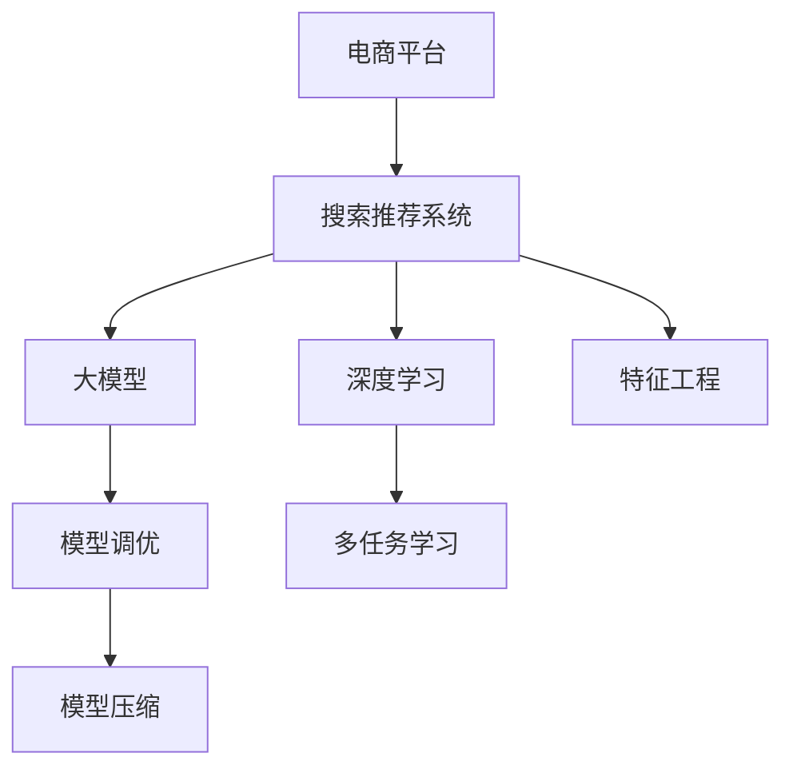

                 

# 电商平台搜索推荐系统的AI 大模型应用：提高系统性能、效率、准确率与多样性

> 关键词：电商平台、搜索推荐系统、大模型、AI、性能优化、效率提升、准确率提高、多样性增强

## 1. 背景介绍

### 1.1 问题由来

随着互联网电商的迅猛发展，各大电商平台都面临着巨大的数据量和用户增长压力。如何有效地处理海量用户行为数据，为用户提供精准的商品推荐，成为了电商平台的重大挑战。传统的推荐系统基于手工设计的特征提取和分类算法，存在复杂度高、扩展性差、鲁棒性低等缺点。而人工智能技术，尤其是基于大模型的推荐系统，在处理大数据量和多样性需求方面具有显著优势。

### 1.2 问题核心关键点

在大数据时代，电商平台的推荐系统需要具备以下关键能力：
- **高性能**：在处理大规模用户行为数据时，推荐系统需要具备高效的计算和存储能力。
- **高准确性**：推荐系统需要准确理解用户需求，预测用户可能感兴趣的商品，减少用户流失率。
- **高多样性**：推荐系统需要为用户推荐多样化的商品，避免"茧房效应"，提升用户体验。

基于大模型的推荐系统通过学习用户行为数据，利用深度神经网络的能力，能够在大规模数据上实现高性能、高准确性、高多样性的推荐服务。因此，本文将详细探讨如何在电商平台搜索推荐系统中应用大模型，并结合实际数据和工程实践，给出系统优化建议。

### 1.3 问题研究意义

在电商平台搜索推荐系统中应用大模型，对于提升用户体验、增加平台营收、降低运营成本具有重要意义：
- **提升用户体验**：大模型能够根据用户历史行为，提供更加个性化和多样化的商品推荐，提升用户满意度。
- **增加平台营收**：精准的推荐能够增加用户购买转化率，提升平台销售额。
- **降低运营成本**：自动化的推荐系统减少了人工干预的环节，降低了运营成本。

## 2. 核心概念与联系

### 2.1 核心概念概述

为更好地理解大模型在电商搜索推荐系统中的应用，本节将介绍几个密切相关的核心概念：

- **电商平台(E-Commerce Platform)**：通过互联网技术提供商品销售服务的平台，如淘宝、京东、亚马逊等。
- **搜索推荐系统(Recommendation System)**：根据用户行为数据，为用户推荐可能感兴趣的商品的系统，是电商平台的核心功能之一。
- **大模型(Large Model)**：指具有亿级参数的深度学习模型，如BERT、GPT-3、T5等。这些模型通过大规模无标签数据进行预训练，具备强大的数据建模能力。
- **深度学习(Deep Learning)**：一种通过多层神经网络模型处理复杂数据的技术，能够在电商搜索推荐系统等场景中提取高层次的特征表示。
- **特征工程(Feature Engineering)**：在大模型应用中，通过设计合理的输入特征，提升模型的预测性能。
- **模型调优(Model Tuning)**：针对电商搜索推荐系统，对大模型进行参数调整和优化，提升其准确性、效率和多样性。
- **多任务学习(Multi-Task Learning, MTL)**：利用电商平台的多个任务（如搜索、推荐、评分）的共享特征，提升模型的泛化能力。
- **模型压缩(Model Compression)**：在大模型应用中，通过剪枝、量化等技术，降低模型的计算和存储需求。

这些核心概念之间的逻辑关系可以通过以下Mermaid流程图来展示：



这个流程图展示了大模型在电商搜索推荐系统中的应用路径：

1. 电商平台提供商品数据和用户行为数据。
2. 利用深度学习技术，对用户行为数据进行处理，提取高层次特征。
3. 应用大模型对高层次特征进行建模，并基于多任务学习进行联合优化。
4. 通过模型调优提升模型的准确性、效率和多样性。
5. 最后，利用模型压缩技术，降低模型的计算和存储需求，确保系统的高效运行。

## 3. 核心算法原理 & 具体操作步骤
### 3.1 算法原理概述

在电商平台搜索推荐系统中应用大模型，本质上是一个结合电商数据特点的大规模深度学习任务。其核心思想是：利用大模型的强大数据建模能力，通过深度学习技术，学习用户行为数据中的高层次特征，并在此基础上进行推荐预测。

形式化地，假设电商平台的大模型为 $M_{\theta}$，其中 $\theta$ 为模型参数。假设电商平台收集到用户历史行为数据 $D=\{(x_i, y_i)\}_{i=1}^N$，其中 $x_i$ 为用户的搜索、浏览、点击等行为特征向量，$y_i$ 为用户对这些行为感兴趣的商品ID列表。则搜索推荐系统的目标是通过训练，得到模型 $M_{\theta}$，使得：

$$
\hat{y}_i = M_{\theta}(x_i)
$$

其中 $\hat{y}_i$ 为模型预测的用户对商品 $i$ 的兴趣度。

### 3.2 算法步骤详解

基于大模型的电商平台搜索推荐系统一般包括以下几个关键步骤：

**Step 1: 数据准备与预处理**

- **数据采集**：收集电商平台的用户历史行为数据，如搜索记录、浏览记录、点击记录、购买记录等。
- **数据清洗**：对数据进行去重、缺失值处理、异常值检测等，确保数据质量。
- **特征构建**：设计合适的特征提取方法，将用户行为数据转换为模型可处理的向量形式。例如，将用户的搜索关键词提取出来，转化为TF-IDF特征向量。
- **数据分割**：将数据集分为训练集、验证集和测试集，一般采用8:1:1的比例划分。

**Step 2: 大模型选择与预训练**

- **模型选择**：根据数据量和计算资源，选择合适的预训练大模型，如BERT、T5、DALL-E等。
- **预训练**：利用大规模无标签文本数据（如维基百科、新闻、小说等）进行预训练，学习通用的语言和视觉特征。

**Step 3: 模型微调**

- **模型适配**：根据电商平台的推荐任务，在预训练模型的顶层设计新的输出层和损失函数。例如，对于推荐任务，可以使用多分类交叉熵损失函数。
- **训练流程**：使用电商平台的标注数据，以微学习率训练模型，优化模型的推荐预测能力。
- **模型评估**：在验证集上评估模型的准确性、效率和多样性，根据评估结果调整训练策略。
- **模型部署**：将微调后的模型部署到推荐系统中，进行实时推荐预测。

**Step 4: 系统优化**

- **特征工程**：根据模型性能和特征重要性，优化特征提取方法，提升模型预测能力。
- **模型压缩**：通过剪枝、量化等技术，降低模型的计算和存储需求。
- **模型调优**：针对特定应用场景，调整模型参数，提升模型的实际效果。
- **系统监控**：实时监控推荐系统的运行状态，及时调整模型参数和资源配置。

### 3.3 算法优缺点

基于大模型的电商平台搜索推荐系统具有以下优点：
1. **高准确性**：大模型具备强大的特征表示能力，能够准确理解用户行为数据中的复杂信息，提升推荐预测的准确性。
2. **高效率**：大模型的计算图经过优化，可以高效地进行前向和反向传播，减少计算时间。
3. **高多样性**：大模型能够学习到用户的长期行为模式，推荐多样化的商品，避免"茧房效应"。

同时，该方法也存在一定的局限性：
1. **高计算资源需求**：大模型的参数量庞大，对计算和存储资源要求较高。
2. **数据依赖性强**：模型的性能很大程度上依赖于电商平台的标注数据质量。
3. **模型可解释性不足**：大模型通常被视为"黑盒"系统，难以解释其内部决策逻辑。
4. **数据隐私问题**：电商平台的推荐系统需要处理大量用户数据，存在数据隐私和安全问题。

尽管存在这些局限性，但就目前而言，基于大模型的推荐系统仍是电商平台搜索推荐的主流范式。未来相关研究的重点在于如何进一步降低计算资源需求，提高模型的可解释性和数据隐私保护，同时兼顾推荐系统的准确性、效率和多样性。

### 3.4 算法应用领域

基于大模型的电商平台搜索推荐系统已经广泛应用于各种电商平台的推荐场景中，例如：

- **商品推荐**：根据用户的浏览、点击、购买等行为，预测用户可能感兴趣的商品。
- **个性化营销**：利用用户的历史行为数据，个性化定制广告和推荐内容。
- **库存管理**：预测热门商品的需求量，帮助电商平台优化库存管理，避免过剩或缺货。
- **用户行为分析**：分析用户的行为模式，帮助电商平台优化产品和服务。

除了这些经典任务外，大模型推荐系统还被创新性地应用到更多场景中，如内容推荐、商品分类、情感分析等，为电商平台的业务创新提供了新的驱动力。

## 4. 数学模型和公式 & 详细讲解  
### 4.1 数学模型构建

本节将使用数学语言对基于大模型的电商平台搜索推荐过程进行更加严格的刻画。

假设电商平台的大模型为 $M_{\theta}$，其输入为电商用户行为数据 $x_i \in \mathbb{R}^d$，输出为对商品 $i$ 的兴趣度 $\hat{y}_i \in \mathbb{R}$。电商平台收集到的标注数据为 $D=\{(x_i, y_i)\}_{i=1}^N$，其中 $y_i$ 为商品ID列表。

定义模型 $M_{\theta}$ 在数据样本 $(x,y)$ 上的损失函数为 $\ell(M_{\theta}(x),y)$，则在数据集 $D$ 上的经验风险为：

$$
\mathcal{L}(\theta) = \frac{1}{N}\sum_{i=1}^N \ell(M_{\theta}(x_i),y_i)
$$

其中 $\ell$ 为任务特定的损失函数，如交叉熵损失。

微调的目标是最小化经验风险，即找到最优参数：

$$
\theta^* = \mathop{\arg\min}_{\theta} \mathcal{L}(\theta)
$$

在得到损失函数的梯度后，即可带入参数更新公式，完成模型的迭代优化。重复上述过程直至收敛，最终得到适应电商平台推荐任务的最优模型参数 $\theta^*$。

### 4.2 公式推导过程

以下我们以电商平台的商品推荐任务为例，推导交叉熵损失函数及其梯度的计算公式。

假设电商平台的大模型 $M_{\theta}$ 在输入 $x$ 上的输出为 $\hat{y}=M_{\theta}(x) \in [0,1]$，表示用户对商品 $i$ 的兴趣度。真实标签 $y \in \{0,1\}$，即用户是否对商品 $i$ 感兴趣。则二分类交叉熵损失函数定义为：

$$
\ell(M_{\theta}(x),y) = -[y\log \hat{y} + (1-y)\log (1-\hat{y})]
$$

将其代入经验风险公式，得：

$$
\mathcal{L}(\theta) = -\frac{1}{N}\sum_{i=1}^N [y_i\log M_{\theta}(x_i)+(1-y_i)\log(1-M_{\theta}(x_i))]
$$

根据链式法则，损失函数对参数 $\theta_k$ 的梯度为：

$$
\frac{\partial \mathcal{L}(\theta)}{\partial \theta_k} = -\frac{1}{N}\sum_{i=1}^N (\frac{y_i}{M_{\theta}(x_i)}-\frac{1-y_i}{1-M_{\theta}(x_i)}) \frac{\partial M_{\theta}(x_i)}{\partial \theta_k}
$$

其中 $\frac{\partial M_{\theta}(x_i)}{\partial \theta_k}$ 可进一步递归展开，利用自动微分技术完成计算。

在得到损失函数的梯度后，即可带入参数更新公式，完成模型的迭代优化。重复上述过程直至收敛，最终得到适应电商平台推荐任务的最优模型参数 $\theta^*$。

## 5. 项目实践：代码实例和详细解释说明
### 5.1 开发环境搭建

在进行电商搜索推荐系统的大模型应用实践前，我们需要准备好开发环境。以下是使用Python进行PyTorch开发的环境配置流程：

1. 安装Anaconda：从官网下载并安装Anaconda，用于创建独立的Python环境。

2. 创建并激活虚拟环境：
```bash
conda create -n ecommerce-env python=3.8 
conda activate ecommerce-env
```

3. 安装PyTorch：根据CUDA版本，从官网获取对应的安装命令。例如：
```bash
conda install pytorch torchvision torchaudio cudatoolkit=11.1 -c pytorch -c conda-forge
```

4. 安装Transformers库：
```bash
pip install transformers
```

5. 安装各类工具包：
```bash
pip install numpy pandas scikit-learn matplotlib tqdm jupyter notebook ipython
```

完成上述步骤后，即可在`ecommerce-env`环境中开始电商搜索推荐系统的开发实践。

### 5.2 源代码详细实现

下面我们以电商平台的商品推荐任务为例，给出使用Transformers库对BERT模型进行电商推荐微调的PyTorch代码实现。

首先，定义商品推荐任务的数据处理函数：

```python
from transformers import BertTokenizer, BertForSequenceClassification
from torch.utils.data import Dataset
import torch

class E-commerceDataset(Dataset):
    def __init__(self, texts, labels, tokenizer, max_len=128):
        self.texts = texts
        self.labels = labels
        self.tokenizer = tokenizer
        self.max_len = max_len
        
    def __len__(self):
        return len(self.texts)
    
    def __getitem__(self, item):
        text = self.texts[item]
        label = self.labels[item]
        
        encoding = self.tokenizer(text, return_tensors='pt', max_length=self.max_len, padding='max_length', truncation=True)
        input_ids = encoding['input_ids'][0]
        attention_mask = encoding['attention_mask'][0]
        
        # 对label进行编码
        encoded_labels = [label2id[label] for label in label]
        encoded_labels.extend([label2id['O']] * (self.max_len - len(encoded_labels)))
        labels = torch.tensor(encoded_labels, dtype=torch.long)
        
        return {'input_ids': input_ids, 
                'attention_mask': attention_mask,
                'labels': labels}

# 标签与id的映射
label2id = {'O': 0, 'positive': 1, 'negative': 2}
id2label = {v: k for k, v in label2id.items()}

# 创建dataset
tokenizer = BertTokenizer.from_pretrained('bert-base-cased')

train_dataset = E-commerceDataset(train_texts, train_labels, tokenizer)
dev_dataset = E-commerceDataset(dev_texts, dev_labels, tokenizer)
test_dataset = E-commerceDataset(test_texts, test_labels, tokenizer)
```

然后，定义模型和优化器：

```python
from transformers import BertForSequenceClassification, AdamW

model = BertForSequenceClassification.from_pretrained('bert-base-cased', num_labels=len(label2id))

optimizer = AdamW(model.parameters(), lr=2e-5)
```

接着，定义训练和评估函数：

```python
from torch.utils.data import DataLoader
from tqdm import tqdm
from sklearn.metrics import accuracy_score

device = torch.device('cuda') if torch.cuda.is_available() else torch.device('cpu')
model.to(device)

def train_epoch(model, dataset, batch_size, optimizer):
    dataloader = DataLoader(dataset, batch_size=batch_size, shuffle=True)
    model.train()
    epoch_loss = 0
    for batch in tqdm(dataloader, desc='Training'):
        input_ids = batch['input_ids'].to(device)
        attention_mask = batch['attention_mask'].to(device)
        labels = batch['labels'].to(device)
        model.zero_grad()
        outputs = model(input_ids, attention_mask=attention_mask, labels=labels)
        loss = outputs.loss
        epoch_loss += loss.item()
        loss.backward()
        optimizer.step()
    return epoch_loss / len(dataloader)

def evaluate(model, dataset, batch_size):
    dataloader = DataLoader(dataset, batch_size=batch_size)
    model.eval()
    preds, labels = [], []
    with torch.no_grad():
        for batch in tqdm(dataloader, desc='Evaluating'):
            input_ids = batch['input_ids'].to(device)
            attention_mask = batch['attention_mask'].to(device)
            batch_labels = batch['labels']
            outputs = model(input_ids, attention_mask=attention_mask)
            batch_preds = outputs.logits.argmax(dim=2).to('cpu').tolist()
            batch_labels = batch_labels.to('cpu').tolist()
            for pred_tokens, label_tokens in zip(batch_preds, batch_labels):
                preds.append(pred_tokens[:len(label_tokens)])
                labels.append(label_tokens)
                
    print(accuracy_score(labels, preds))
```

最后，启动训练流程并在测试集上评估：

```python
epochs = 5
batch_size = 16

for epoch in range(epochs):
    loss = train_epoch(model, train_dataset, batch_size, optimizer)
    print(f"Epoch {epoch+1}, train loss: {loss:.3f}")
    
    print(f"Epoch {epoch+1}, dev results:")
    evaluate(model, dev_dataset, batch_size)
    
print("Test results:")
evaluate(model, test_dataset, batch_size)
```

以上就是使用PyTorch对BERT进行电商推荐任务微调的完整代码实现。可以看到，得益于Transformers库的强大封装，我们可以用相对简洁的代码完成BERT模型的加载和微调。

### 5.3 代码解读与分析

让我们再详细解读一下关键代码的实现细节：

**E-commerceDataset类**：
- `__init__`方法：初始化文本、标签、分词器等关键组件。
- `__len__`方法：返回数据集的样本数量。
- `__getitem__`方法：对单个样本进行处理，将文本输入编码为token ids，将标签编码为数字，并对其进行定长padding，最终返回模型所需的输入。

**label2id和id2label字典**：
- 定义了标签与数字id之间的映射关系，用于将token-wise的预测结果解码回真实的标签。

**训练和评估函数**：
- 使用PyTorch的DataLoader对数据集进行批次化加载，供模型训练和推理使用。
- 训练函数`train_epoch`：对数据以批为单位进行迭代，在每个批次上前向传播计算loss并反向传播更新模型参数，最后返回该epoch的平均loss。
- 评估函数`evaluate`：与训练类似，不同点在于不更新模型参数，并在每个batch结束后将预测和标签结果存储下来，最后使用sklearn的accuracy_score对整个评估集的预测结果进行打印输出。

**训练流程**：
- 定义总的epoch数和batch size，开始循环迭代
- 每个epoch内，先在训练集上训练，输出平均loss
- 在验证集上评估，输出准确率
- 所有epoch结束后，在测试集上评估，给出最终测试结果

可以看到，PyTorch配合Transformers库使得BERT微调的代码实现变得简洁高效。开发者可以将更多精力放在数据处理、模型改进等高层逻辑上，而不必过多关注底层的实现细节。

当然，工业级的系统实现还需考虑更多因素，如模型的保存和部署、超参数的自动搜索、更灵活的任务适配层等。但核心的微调范式基本与此类似。

## 6. 实际应用场景
### 6.1 智能客服系统

基于大模型的电商推荐技术，可以广泛应用于智能客服系统的构建。传统客服往往需要配备大量人力，高峰期响应缓慢，且一致性和专业性难以保证。而使用微调后的电商推荐系统，可以7x24小时不间断服务，快速响应客户咨询，用推荐商品的方式提升用户体验。

在技术实现上，可以收集企业内部的历史电商推荐数据，将用户行为和商品信息构建成监督数据，在此基础上对预训练电商推荐模型进行微调。微调后的电商推荐模型能够自动理解用户意图，推荐符合用户期望的商品。对于客户提出的新需求，还可以接入检索系统实时搜索相关商品，动态组织生成推荐。如此构建的智能客服系统，能大幅提升客户满意度，减少人工客服的运营成本。

### 6.2 个性化推荐系统

当前的推荐系统往往只依赖用户的历史行为数据进行物品推荐，无法深入理解用户的真实兴趣偏好。基于大模型的电商推荐系统可以更好地挖掘用户行为背后的语义信息，从而提供更精准、多样的推荐内容。

在实践中，可以收集用户浏览、点击、购买等行为数据，提取和商品相关的文本内容。将文本内容作为模型输入，用户的后续行为（如是否点击、购买等）作为监督信号，在此基础上微调预训练语言模型。微调后的模型能够从文本内容中准确把握用户的兴趣点。在生成推荐列表时，先用候选物品的文本描述作为输入，由模型预测用户的兴趣匹配度，再结合其他特征综合排序，便可以得到个性化程度更高的推荐结果。

### 6.3 未来应用展望

随着大模型和电商推荐技术的不断发展，基于微调范式将在更多领域得到应用，为电商平台的业务创新带来变革性影响。

在智慧零售领域，基于微调的商品推荐技术可以提升消费者购物体验，增加电商平台销量。

在个性化服务中，电商推荐系统结合用户画像和场景信息，提供更加精准的个性化推荐，提升用户体验和平台营收。

在金融风控中，电商推荐系统能够根据用户行为数据，提前识别潜在风险用户，防止不良行为发生，保障金融安全。

此外，在社交电商、教育培训等众多领域，基于大模型的电商推荐系统也将不断涌现，为电商平台的业务发展注入新的动力。相信随着技术的日益成熟，微调方法将成为电商推荐系统的重要范式，推动电商平台搜索推荐系统的不断优化和升级。

## 7. 工具和资源推荐
### 7.1 学习资源推荐

为了帮助开发者系统掌握大模型在电商推荐系统中的应用理论基础和实践技巧，这里推荐一些优质的学习资源：

1. 《深度学习与自然语言处理》课程：斯坦福大学开设的深度学习课程，涵盖NLP基础和深度学习技术，适合电商推荐系统的学习者。

2. 《电商推荐系统》书籍：详细讲解电商推荐系统的原理和实现方法，包括大模型应用、特征工程、多任务学习等内容。

3. 《推荐系统实践》课程：实战导向的电商推荐系统教程，涵盖推荐算法、模型评估、系统优化等主题。

4. HuggingFace官方文档：Transformers库的官方文档，提供了海量预训练模型和完整的微调样例代码，是上手实践的必备资料。

5. Kaggle电商推荐系统竞赛：Kaggle平台上的电商推荐系统竞赛，涵盖大量电商推荐数据集和模型评估指标，适合进行实际训练和调优。

通过对这些资源的学习实践，相信你一定能够快速掌握电商推荐系统的大模型应用，并用于解决实际的电商问题。
###  7.2 开发工具推荐

高效的开发离不开优秀的工具支持。以下是几款用于电商推荐系统开发的大模型应用的常用工具：

1. PyTorch：基于Python的开源深度学习框架，灵活动态的计算图，适合快速迭代研究。大部分预训练语言模型都有PyTorch版本的实现。

2. TensorFlow：由Google主导开发的开源深度学习框架，生产部署方便，适合大规模工程应用。同样有丰富的预训练语言模型资源。

3. Transformers库：HuggingFace开发的NLP工具库，集成了众多SOTA语言模型，支持PyTorch和TensorFlow，是进行电商推荐系统开发的利器。

4. Weights & Biases：模型训练的实验跟踪工具，可以记录和可视化模型训练过程中的各项指标，方便对比和调优。与主流深度学习框架无缝集成。

5. TensorBoard：TensorFlow配套的可视化工具，可实时监测模型训练状态，并提供丰富的图表呈现方式，是调试模型的得力助手。

6. Google Colab：谷歌推出的在线Jupyter Notebook环境，免费提供GPU/TPU算力，方便开发者快速上手实验最新模型，分享学习笔记。

合理利用这些工具，可以显著提升电商推荐系统开发效率，加快创新迭代的步伐。

### 7.3 相关论文推荐

大模型在电商推荐系统中的应用源于学界的持续研究。以下是几篇奠基性的相关论文，推荐阅读：

1. Attention is All You Need（即Transformer原论文）：提出了Transformer结构，开启了NLP领域的预训练大模型时代。

2. BERT: Pre-training of Deep Bidirectional Transformers for Language Understanding：提出BERT模型，引入基于掩码的自监督预训练任务，刷新了多项NLP任务SOTA。

3. Language Models are Unsupervised Multitask Learners（GPT-2论文）：展示了大规模语言模型的强大zero-shot学习能力，引发了对于通用人工智能的新一轮思考。

4. Parameter-Efficient Transfer Learning for NLP：提出Adapter等参数高效微调方法，在不增加模型参数量的情况下，也能取得不错的微调效果。

5. Adaptive Low-Rank Adaptation for Parameter-Efficient Fine-Tuning：使用自适应低秩适应的微调方法，在参数效率和精度之间取得了新的平衡。

这些论文代表了大模型在电商推荐系统中的应用发展脉络。通过学习这些前沿成果，可以帮助研究者把握学科前进方向，激发更多的创新灵感。

## 8. 总结：未来发展趋势与挑战

### 8.1 总结

本文对基于大模型的电商平台搜索推荐系统进行了全面系统的介绍。首先阐述了大模型在电商推荐系统中的应用背景和意义，明确了电商推荐系统的核心目标。其次，从原理到实践，详细讲解了电商推荐系统的数学原理和关键步骤，给出了电商推荐任务开发的完整代码实例。同时，本文还探讨了大模型在电商推荐系统中的应用前景，展示了电商推荐范式的巨大潜力。

通过本文的系统梳理，可以看到，基于大模型的电商推荐系统正在成为电商平台的推荐主流的推荐范式，极大地提升了电商平台的推荐效果和用户体验。未来，伴随大模型和电商推荐技术的持续演进，基于微调范式必将在电商搜索推荐系统的优化和升级中扮演越来越重要的角色。

### 8.2 未来发展趋势

展望未来，大模型在电商推荐系统中的应用将呈现以下几个发展趋势：

1. **模型规模持续增大**：随着算力成本的下降和数据规模的扩张，电商平台的推荐模型参数量还将持续增长。超大规模模型蕴含的丰富知识，有望支撑更加复杂多变的电商推荐需求。

2. **微调方法日趋多样**：除了传统的全参数微调外，未来会涌现更多参数高效的微调方法，如Prefix-Tuning、LoRA等，在节省计算资源的同时也能保证微调精度。

3. **持续学习成为常态**：随着电商平台的业务数据动态变化，推荐模型需要持续学习新数据，保持性能。如何在不遗忘原有知识的同时，高效吸收新数据信息，将成为重要的研究课题。

4. **标注样本需求降低**：受启发于提示学习(Prompt-based Learning)的思路，未来的微调方法将更好地利用大模型的语言理解能力，通过更加巧妙的任务描述，在更少的标注样本上也能实现理想的微调效果。

5. **模型通用性增强**：经过海量电商数据预训练和电商任务微调，推荐模型将具备更强大的跨领域迁移能力，能够应用于更多电商场景，如社交电商、二手电商等。

以上趋势凸显了大模型在电商推荐系统中的应用前景。这些方向的探索发展，必将进一步提升电商平台的推荐性能和用户体验，为电商平台的业务创新提供新的驱动力。

### 8.3 面临的挑战

尽管大模型在电商推荐系统中的应用已经取得了瞩目成就，但在迈向更加智能化、普适化应用的过程中，它仍面临诸多挑战：

1. **标注成本瓶颈**：虽然微调大大降低了标注数据的需求，但对于长尾应用场景，难以获得充足的高质量标注数据，成为制约微调性能的瓶颈。如何进一步降低微调对标注样本的依赖，将是一大难题。

2. **模型鲁棒性不足**：当前微调模型面对电商平台的域外数据时，泛化性能往往大打折扣。对于测试样本的微小扰动，微调模型的预测也容易发生波动。如何提高微调模型的鲁棒性，避免灾难性遗忘，还需要更多理论和实践的积累。

3. **推理效率有待提高**：大规模语言模型虽然精度高，但在实际部署时往往面临推理速度慢、内存占用大等效率问题。如何在保证性能的同时，简化模型结构，提升推理速度，优化资源占用，将是重要的优化方向。

4. **可解释性亟需加强**：当前微调模型通常被视为"黑盒"系统，难以解释其内部决策逻辑。对于电商推荐系统等高风险应用，算法的可解释性和可审计性尤为重要。如何赋予微调模型更强的可解释性，将是亟待攻克的难题。

5. **数据隐私问题**：电商平台的推荐系统需要处理大量用户数据，存在数据隐私和安全问题。如何在使用大模型进行推荐时保护用户隐私，保障数据安全，也将是重要的研究课题。

6. **知识整合能力不足**：现有的微调模型往往局限于电商平台的内部数据，难以灵活吸收和运用更广泛的先验知识。如何让微调过程更好地与外部知识库、规则库等专家知识结合，形成更加全面、准确的信息整合能力，还有很大的想象空间。

正视电商推荐系统应用中大模型面临的这些挑战，积极应对并寻求突破，将是大模型推荐系统走向成熟的必由之路。相信随着学界和产业界的共同努力，这些挑战终将一一被克服，大模型推荐系统必将在构建智能推荐系统、提升用户体验、促进电商业务创新中发挥更大的作用。

### 8.4 研究展望

面对电商推荐系统应用中大模型面临的种种挑战，未来的研究需要在以下几个方面寻求新的突破：

1. **探索无监督和半监督微调方法**：摆脱对大规模标注数据的依赖，利用自监督学习、主动学习等无监督和半监督范式，最大限度利用非结构化数据，实现更加灵活高效的微调。

2. **研究参数高效和计算高效的微调范式**：开发更加参数高效的微调方法，在固定大部分预训练参数的同时，只更新极少量的任务相关参数。同时优化微调模型的计算图，减少前向传播和反向传播的资源消耗，实现更加轻量级、实时性的部署。

3. **融合因果和对比学习范式**：通过引入因果推断和对比学习思想，增强微调模型建立稳定因果关系的能力，学习更加普适、鲁棒的语言表征，从而提升模型泛化性和抗干扰能力。

4. **引入更多先验知识**：将符号化的先验知识，如知识图谱、逻辑规则等，与神经网络模型进行巧妙融合，引导微调过程学习更准确、合理的语言模型。同时加强不同模态数据的整合，实现视觉、语音等多模态信息与文本信息的协同建模。

5. **结合因果分析和博弈论工具**：将因果分析方法引入微调模型，识别出模型决策的关键特征，增强输出解释的因果性和逻辑性。借助博弈论工具刻画人机交互过程，主动探索并规避模型的脆弱点，提高系统稳定性。

6. **纳入伦理道德约束**：在模型训练目标中引入伦理导向的评估指标，过滤和惩罚有偏见、有害的输出倾向。同时加强人工干预和审核，建立模型行为的监管机制，确保输出符合人类价值观和伦理道德。

这些研究方向的探索，必将引领大模型推荐系统技术迈向更高的台阶，为构建智能、可靠、可解释、可控的电商推荐系统铺平道路。面向未来，大模型推荐系统还需要与其他人工智能技术进行更深入的融合，如知识表示、因果推理、强化学习等，多路径协同发力，共同推动电商推荐系统的进步。只有勇于创新、敢于突破，才能不断拓展语言模型的边界，让智能技术更好地服务于电商平台，提升用户体验，推动电商业务的创新与发展。

