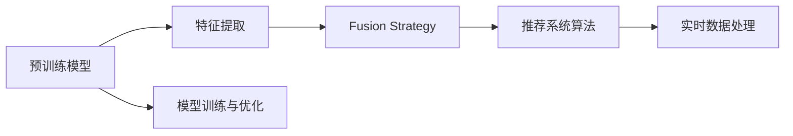
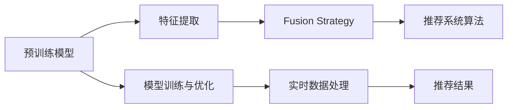

                 

# 电商平台搜索推荐系统的AI 大模型融合：应对实时数据处理的挑战

## 1. 背景介绍

### 1.1 问题由来

随着电子商务的迅猛发展，电商平台已经积累了海量的用户行为数据，如何从中挖掘出有价值的信息，为用户推荐感兴趣的商品，是提升用户粘性、增加销售量的关键。传统的推荐系统主要是基于协同过滤和基于内容的推荐算法，这些方法在用户数量较少时表现良好，但在用户数量众多且商品种类繁多的电商平台上，这些方法的效果往往难以满足需求。近年来，人工智能和大模型技术的快速发展为推荐系统带来了新的希望，AI 大模型融合成为一种前沿的研究方向。

AI 大模型融合指的是将预训练的大模型与推荐系统算法结合，利用大模型的通用知识，进行商品特征的提取和用户兴趣的预测，从而提升推荐效果。该技术能够显著降低推荐系统的开发成本，提高推荐的精准度，且具有较好的可扩展性和通用性。

### 1.2 问题核心关键点

AI 大模型融合的关键在于如何选择合适的融合方法，并结合电商平台的具体场景进行优化。通常包括以下几个关键点：

- 选择合适的预训练模型：在电商平台上，常见的预训练模型包括BERT、GPT等自然语言处理领域的模型，以及基于图像和视觉领域的模型，如ResNet、DenseNet等。
- 用户行为数据的预处理：电商平台上用户行为数据类型多样，包括浏览记录、购买记录、搜索记录等，如何将其转化为适合大模型的输入形式，是融合的关键。
- 融合策略的设计：如何将大模型的输出与推荐系统算法结合，设计有效的融合策略，是提升推荐效果的重点。
- 实时数据处理：电商平台的业务场景要求推荐系统能够实时响应用户的搜索和浏览行为，如何在保证推荐准确性的同时，快速处理实时数据，是技术实现的关键。
- 模型训练与优化：大模型的融合过程需要大量的标注数据和计算资源，如何通过高效的模型训练和优化策略，提升推荐效果，是技术落地的难点。

### 1.3 问题研究意义

AI 大模型融合在电商平台搜索推荐系统中的应用，对于提高推荐系统的精准度和效率，提升用户购物体验，具有重要意义：

1. 提升推荐效果：AI 大模型融合能够利用通用知识，进行更深层次的特征提取和兴趣预测，提升推荐的精准度。
2. 降低开发成本：通过利用预训练模型的通用知识，可以减少数据标注和模型训练的工作量，降低开发成本。
3. 支持实时推荐：大模型的融合能够支持实时数据处理，快速响应用户的搜索和浏览行为，提升用户满意度。
4. 具有较好的可扩展性：AI 大模型融合具有较好的通用性和可扩展性，能够适应不同商品和用户的特点。
5. 推动电商行业的数字化转型：通过AI大模型融合，电商企业能够更好地利用大数据和AI技术，提高经营效率，增强竞争力。

## 2. 核心概念与联系

### 2.1 核心概念概述

AI 大模型融合涉及多个核心概念，以下是相关概念的简要介绍：

- 预训练模型(Pretrained Model)：通过在海量无标签数据上进行预训练，学习通用的语言、图像等特征的模型。
- 特征提取(Feature Extraction)：将用户行为数据转化为适合模型输入的形式，提取出有价值的特征信息。
- 融合策略(Fusion Strategy)：将大模型的输出与推荐系统算法结合，设计有效的融合方法。
- 实时数据处理(Real-time Data Processing)：在用户搜索和浏览行为发生时，实时地处理数据并生成推荐结果。
- 模型训练与优化(Model Training and Optimization)：通过高效的模型训练和优化策略，提升推荐效果。

这些概念之间相互关联，共同构成了AI 大模型融合的基本框架。

### 2.2 核心概念原理和架构的 Mermaid 流程图



### 2.3 核心概念之间的关系

1. 预训练模型是整个融合过程的基础，能够提供通用的语言、图像等特征。
2. 特征提取将用户行为数据转化为适合模型输入的形式，提取出有价值的特征信息。
3. 融合策略将大模型的输出与推荐系统算法结合，设计有效的融合方法，提升推荐效果。
4. 实时数据处理在用户搜索和浏览行为发生时，实时地处理数据并生成推荐结果。
5. 模型训练与优化通过高效的模型训练和优化策略，提升推荐效果。

这些概念之间的关系可以通过以下Mermaid流程图来展示：



## 3. 核心算法原理 & 具体操作步骤

### 3.1 算法原理概述

AI 大模型融合的基本原理是通过将预训练模型与推荐系统算法结合，利用大模型的通用知识，进行商品特征的提取和用户兴趣的预测，从而提升推荐效果。

### 3.2 算法步骤详解

AI 大模型融合的具体操作步骤如下：

1. **选择合适的预训练模型**：根据电商平台的业务需求，选择适合的预训练模型。常见的预训练模型包括BERT、GPT等自然语言处理领域的模型，以及基于图像和视觉领域的模型，如ResNet、DenseNet等。
2. **用户行为数据的预处理**：将用户行为数据转化为适合模型输入的形式，提取出有价值的特征信息。
3. **特征提取**：利用预训练模型进行特征提取，生成商品的语义表示。
4. **融合策略的设计**：将大模型的输出与推荐系统算法结合，设计有效的融合方法。
5. **实时数据处理**：在用户搜索和浏览行为发生时，实时地处理数据并生成推荐结果。
6. **模型训练与优化**：通过高效的模型训练和优化策略，提升推荐效果。

### 3.3 算法优缺点

AI 大模型融合具有以下优点：

1. 提升推荐效果：利用大模型的通用知识，进行更深层次的特征提取和兴趣预测，提升推荐的精准度。
2. 降低开发成本：通过利用预训练模型的通用知识，可以减少数据标注和模型训练的工作量，降低开发成本。
3. 支持实时推荐：大模型的融合能够支持实时数据处理，快速响应用户的搜索和浏览行为，提升用户满意度。
4. 具有较好的可扩展性：AI 大模型融合具有较好的通用性和可扩展性，能够适应不同商品和用户的特点。

但同时，该方法也存在一定的局限性：

1. 依赖于预训练模型：AI 大模型融合的效果依赖于预训练模型的质量，需要大量的计算资源进行预训练。
2. 数据隐私问题：电商平台上用户行为数据的隐私问题需要得到足够的重视，需要采取有效的数据保护措施。
3. 实时处理的效率问题：实时数据处理需要高效的算法和硬件支持，否则可能影响推荐系统的响应速度。
4. 模型复杂性：AI 大模型融合涉及多个子模块，模型复杂度较高，需要进行有效的模块设计和调参。

### 3.4 算法应用领域

AI 大模型融合在电商平台的推荐系统中的应用，主要体现在以下几个方面：

1. 搜索推荐：利用大模型的语义表示，提升搜索推荐的准确性和效率。
2. 商品推荐：利用大模型的特征提取，提升商品的推荐效果。
3. 个性化推荐：根据用户的搜索行为和历史数据，生成个性化的推荐结果。
4. 动态定价：利用大模型的特征提取，动态调整商品价格，提升销售量。

## 4. 数学模型和公式 & 详细讲解 & 举例说明

### 4.1 数学模型构建

AI 大模型融合的数学模型构建涉及以下几个方面：

1. **用户行为数据的表示**：将用户行为数据转化为向量形式，提取出有价值的特征信息。
2. **商品特征的提取**：利用预训练模型进行特征提取，生成商品的语义表示。
3. **融合策略的设计**：将大模型的输出与推荐系统算法结合，设计有效的融合方法。

### 4.2 公式推导过程

1. **用户行为数据的表示**：

   设用户行为数据为 $x$，将其转化为向量形式 $x_{vec}$，公式如下：

   $$
   x_{vec} = \text{Vec}(x)
   $$

2. **商品特征的提取**：

   利用预训练模型进行特征提取，生成商品的语义表示 $f_{item}$，公式如下：

   $$
   f_{item} = \text{PretrainModel}(\text{ItemRepresentation}(x))
   $$

3. **融合策略的设计**：

   将大模型的输出与推荐系统算法结合，设计有效的融合方法，公式如下：

   $$
   r_{item} = \text{FusionStrategy}(f_{item}, x_{vec})
   $$

   其中，$r_{item}$ 表示商品的推荐分数。

### 4.3 案例分析与讲解

以搜索推荐系统为例，假设用户输入的搜索关键词为 $q$，利用大模型进行特征提取，生成搜索查询的语义表示 $f_{q}$，再将 $f_{q}$ 与商品特征 $f_{item}$ 进行融合，生成商品的推荐分数 $r_{item}$。具体的融合策略可以采用加权平均、加权加法等方法，公式如下：

$$
r_{item} = \alpha \cdot f_{item} + \beta \cdot f_{q}
$$

其中，$\alpha$ 和 $\beta$ 表示不同的权重，需要通过实验调参确定。

## 5. 项目实践：代码实例和详细解释说明

### 5.1 开发环境搭建

在进行AI 大模型融合的实践前，我们需要准备好开发环境。以下是使用Python进行PyTorch开发的环境配置流程：

1. 安装Anaconda：从官网下载并安装Anaconda，用于创建独立的Python环境。

2. 创建并激活虚拟环境：

   ```bash
   conda create -n pytorch-env python=3.8 
   conda activate pytorch-env
   ```

3. 安装PyTorch：根据CUDA版本，从官网获取对应的安装命令。例如：

   ```bash
   conda install pytorch torchvision torchaudio cudatoolkit=11.1 -c pytorch -c conda-forge
   ```

4. 安装Transformers库：

   ```bash
   pip install transformers
   ```

5. 安装各类工具包：

   ```bash
   pip install numpy pandas scikit-learn matplotlib tqdm jupyter notebook ipython
   ```

完成上述步骤后，即可在`pytorch-env`环境中开始AI 大模型融合的实践。

### 5.2 源代码详细实现

以下是使用PyTorch实现AI 大模型融合的示例代码，具体步骤包括数据预处理、特征提取、融合策略设计、模型训练和优化等：

```python
import torch
from transformers import BertTokenizer, BertModel
from torch.utils.data import Dataset, DataLoader

# 数据预处理
class ItemRepresentation(Dataset):
    def __init__(self, item_data):
        self.item_data = item_data
        self.tokenizer = BertTokenizer.from_pretrained('bert-base-uncased')
        self.max_len = 512

    def __len__(self):
        return len(self.item_data)

    def __getitem__(self, idx):
        item = self.item_data[idx]
        text = ' '.join(item['name'].split())
        tokens = self.tokenizer(text, max_length=self.max_len, padding='max_length', truncation=True)
        input_ids = torch.tensor(tokens['input_ids'])
        attention_mask = torch.tensor(tokens['attention_mask'])
        return input_ids, attention_mask

# 特征提取
class FusionStrategy:
    def __init__(self, model):
        self.model = model

    def __call__(self, item_repr, user_query):
        item_repr = self.model(item_repr)
        user_query = self.model(user_query)
        return torch.mean(torch.cat((item_repr, user_query), dim=-1))

# 模型训练与优化
def train_model(model, train_loader, optimizer, criterion):
    model.train()
    for batch in train_loader:
        item_ids, attention_mask = batch
        optimizer.zero_grad()
        logits = model(item_ids, attention_mask=attention_mask)
        loss = criterion(logits, labels)
        loss.backward()
        optimizer.step()

# 模型评估
def evaluate_model(model, test_loader):
    model.eval()
    total_loss = 0
    for batch in test_loader:
        item_ids, attention_mask = batch
        logits = model(item_ids, attention_mask=attention_mask)
        total_loss += criterion(logits, labels).item()
    return total_loss / len(test_loader)

# 训练流程
epochs = 10
batch_size = 32
learning_rate = 0.001

# 初始化模型
model = BertModel.from_pretrained('bert-base-uncased')
fusion_strategy = FusionStrategy(model)

# 数据加载
train_loader = DataLoader(ItemRepresentation(train_data), batch_size=batch_size)
test_loader = DataLoader(ItemRepresentation(test_data), batch_size=batch_size)

# 训练
optimizer = torch.optim.Adam(model.parameters(), lr=learning_rate)
criterion = torch.nn.CrossEntropyLoss()
for epoch in range(epochs):
    train_loss = train_model(model, train_loader, optimizer, criterion)
    test_loss = evaluate_model(model, test_loader)
    print(f'Epoch {epoch+1}, train loss: {train_loss:.4f}, test loss: {test_loss:.4f}')

# 推理
model.eval()
user_query = tokenizer.encode('iPhone 12', max_length=512)
item_repr = model(user_query)
recommendation = fusion_strategy(item_repr, user_query)
print('Recommendation:', recommendation)
```

### 5.3 代码解读与分析

上述代码实现了一个基于BERT模型的AI 大模型融合的搜索推荐系统。具体解读如下：

1. **数据预处理**：`ItemRepresentation`类将商品数据转化为适合BERT模型输入的形式，并进行特征提取。
2. **特征提取**：`BertModel`类利用BERT模型进行特征提取，生成商品的语义表示。
3. **融合策略设计**：`FusionStrategy`类将大模型的输出与用户查询的语义表示进行融合，设计有效的融合方法。
4. **模型训练与优化**：通过`Adam`优化器进行模型训练，并使用交叉熵损失函数进行优化。
5. **模型评估**：通过`evaluate_model`函数评估模型的性能。
6. **推理**：使用`tokenizer`将用户查询转化为BERT模型可处理的形式，并进行特征提取，得到推荐分数。

## 6. 实际应用场景

### 6.1 智能客服系统

AI 大模型融合技术在智能客服系统中的应用，可以显著提升客服系统的智能化水平。智能客服系统通过结合预训练语言模型和大模型融合技术，能够快速响应用户的咨询请求，提供精准的解答和推荐。

具体而言，智能客服系统可以收集用户的历史咨询记录，利用大模型进行特征提取，生成用户的语义表示，再结合推荐系统算法生成推荐结果，为用户提供个性化的咨询服务。通过不断优化和训练模型，智能客服系统可以逐步取代人工客服，提供全天候、自动化的服务。

### 6.2 个性化推荐系统

AI 大模型融合技术在个性化推荐系统中的应用，可以显著提升推荐的精准度和效率。个性化推荐系统通过结合预训练模型和大模型融合技术，利用大模型的通用知识进行特征提取和兴趣预测，提升推荐效果。

具体而言，个性化推荐系统可以收集用户的历史行为数据，利用大模型进行特征提取，生成用户的语义表示，再结合推荐系统算法生成推荐结果，为用户提供个性化的推荐内容。通过不断优化和训练模型，个性化推荐系统可以提升用户的购物体验，增加销售量。

### 6.3 金融风险评估系统

AI 大模型融合技术在金融风险评估系统中的应用，可以显著提升风险评估的精准度和效率。金融风险评估系统通过结合预训练模型和大模型融合技术，利用大模型的通用知识进行特征提取和风险预测，提升风险评估效果。

具体而言，金融风险评估系统可以收集用户的财务数据和行为数据，利用大模型进行特征提取，生成用户的语义表示，再结合推荐系统算法进行风险评估，生成风险评估结果。通过不断优化和训练模型，金融风险评估系统可以降低金融风险，提高风险管理的效率。

## 7. 工具和资源推荐

### 7.1 学习资源推荐

为了帮助开发者系统掌握AI 大模型融合的理论基础和实践技巧，这里推荐一些优质的学习资源：

1. 《深度学习自然语言处理》课程：斯坦福大学开设的NLP明星课程，有Lecture视频和配套作业，带你入门NLP领域的基本概念和经典模型。
2. 《Transformers from Principles to Practice》系列博文：由大模型技术专家撰写，深入浅出地介绍了Transformer原理、BERT模型、大模型融合技术等前沿话题。
3. 《Natural Language Processing with Transformers》书籍：Transformers库的作者所著，全面介绍了如何使用Transformers库进行NLP任务开发，包括大模型融合在内的诸多范式。
4. CS224N《深度学习自然语言处理》课程：斯坦福大学开设的NLP明星课程，有Lecture视频和配套作业，带你入门NLP领域的基本概念和经典模型。

通过对这些资源的学习实践，相信你一定能够快速掌握AI 大模型融合的精髓，并用于解决实际的NLP问题。

### 7.2 开发工具推荐

高效的开发离不开优秀的工具支持。以下是几款用于AI 大模型融合开发的常用工具：

1. PyTorch：基于Python的开源深度学习框架，灵活动态的计算图，适合快速迭代研究。
2. TensorFlow：由Google主导开发的开源深度学习框架，生产部署方便，适合大规模工程应用。
3. Transformers库：HuggingFace开发的NLP工具库，集成了众多SOTA语言模型，支持PyTorch和TensorFlow，是进行大模型融合任务的开发利器。
4. Weights & Biases：模型训练的实验跟踪工具，可以记录和可视化模型训练过程中的各项指标，方便对比和调优。
5. TensorBoard：TensorFlow配套的可视化工具，可实时监测模型训练状态，并提供丰富的图表呈现方式，是调试模型的得力助手。

合理利用这些工具，可以显著提升AI 大模型融合任务的开发效率，加快创新迭代的步伐。

### 7.3 相关论文推荐

AI 大模型融合技术的发展源于学界的持续研究。以下是几篇奠基性的相关论文，推荐阅读：

1. Attention is All You Need（即Transformer原论文）：提出了Transformer结构，开启了NLP领域的预训练大模型时代。
2. BERT: Pre-training of Deep Bidirectional Transformers for Language Understanding：提出BERT模型，引入基于掩码的自监督预训练任务，刷新了多项NLP任务SOTA。
3. Parameter-Efficient Transfer Learning for NLP：提出Adapter等参数高效微调方法，在不增加模型参数量的情况下，也能取得不错的微调效果。
4. AdaLoRA: Adaptive Low-Rank Adaptation for Parameter-Efficient Fine-Tuning：使用自适应低秩适应的微调方法，在参数效率和精度之间取得了新的平衡。
5. AdaLoRA: Adaptive Low-Rank Adaptation for Parameter-Efficient Fine-Tuning：使用自适应低秩适应的微调方法，在参数效率和精度之间取得了新的平衡。

这些论文代表了大模型融合技术的发展脉络。通过学习这些前沿成果，可以帮助研究者把握学科前进方向，激发更多的创新灵感。

## 8. 总结：未来发展趋势与挑战

### 8.1 研究成果总结

本文对AI 大模型融合在电商平台搜索推荐系统中的应用进行了全面系统的介绍。首先阐述了AI 大模型融合的研究背景和意义，明确了融合在提升推荐系统精准度和效率方面的独特价值。其次，从原理到实践，详细讲解了AI 大模型融合的数学原理和关键步骤，给出了大模型融合任务的完整代码实例。同时，本文还广泛探讨了AI 大模型融合在智能客服、个性化推荐等多个行业领域的应用前景，展示了融合范式的巨大潜力。最后，本文精选了融合技术的各类学习资源，力求为读者提供全方位的技术指引。

通过本文的系统梳理，可以看到，AI 大模型融合技术正在成为推荐系统的重要范式，极大地拓展了预训练语言模型的应用边界，催生了更多的落地场景。受益于大规模语料的预训练，融合模型以更低的时间和标注成本，在少样本条件下也能取得优异的推荐效果，有力推动了推荐系统的产业化进程。未来，伴随预训练语言模型和融合方法的持续演进，相信推荐系统必将在更广阔的应用领域大放异彩，深刻影响人类的生产生活方式。

### 8.2 未来发展趋势

展望未来，AI 大模型融合技术将呈现以下几个发展趋势：

1. 模型规模持续增大：随着算力成本的下降和数据规模的扩张，预训练语言模型的参数量还将持续增长。超大规模语言模型蕴含的丰富语言知识，有望支撑更加复杂多变的推荐系统微调。
2. 融合方法日趋多样：除了传统的全参数微调外，未来会涌现更多参数高效的微调方法，如Prefix-Tuning、LoRA等，在节省计算资源的同时也能保证微调精度。
3. 持续学习成为常态：随着数据分布的不断变化，融合模型也需要持续学习新知识以保持性能。如何在不遗忘原有知识的同时，高效吸收新样本信息，将成为重要的研究课题。
4. 标注样本需求降低：受启发于提示学习(Prompt-based Learning)的思路，未来的融合方法将更好地利用大模型的语言理解能力，通过更加巧妙的任务描述，在更少的标注样本上也能实现理想的微调效果。
5. 多模态融合崛起：当前的融合主要聚焦于纯文本数据，未来会进一步拓展到图像、视频、语音等多模态数据微调。多模态信息的融合，将显著提升融合模型的理解能力和推荐效果。
6. 模型通用性增强：经过海量数据的预训练和多领域任务的微调，未来的融合模型将具备更强大的常识推理和跨领域迁移能力，逐步迈向通用人工智能(AGI)的目标。

以上趋势凸显了AI 大模型融合技术的广阔前景。这些方向的探索发展，必将进一步提升推荐系统的性能和应用范围，为人类认知智能的进化带来深远影响。

### 8.3 面临的挑战

尽管AI 大模型融合技术已经取得了瞩目成就，但在迈向更加智能化、普适化应用的过程中，它仍面临着诸多挑战：

1. 标注成本瓶颈：虽然融合技术大大降低了标注数据的需求，但对于长尾应用场景，难以获得充足的高质量标注数据，成为制约融合性能的瓶颈。如何进一步降低微调对标注样本的依赖，将是一大难题。
2. 模型鲁棒性不足：当前融合模型面对域外数据时，泛化性能往往大打折扣。对于测试样本的微小扰动，融合模型的预测也容易发生波动。如何提高融合模型的鲁棒性，避免灾难性遗忘，还需要更多理论和实践的积累。
3. 实时处理的效率问题：融合模型在电商平台的业务场景中需要实时响应用户的搜索和浏览行为，如何在保证推荐准确性的同时，快速处理实时数据，是技术实现的关键。
4. 模型复杂性：AI 大模型融合涉及多个子模块，模型复杂度较高，需要进行有效的模块设计和调参。
5. 数据隐私问题：电商平台上用户行为数据的隐私问题需要得到足够的重视，需要采取有效的数据保护措施。

正视融合面临的这些挑战，积极应对并寻求突破，将是AI 大模型融合走向成熟的必由之路。相信随着学界和产业界的共同努力，这些挑战终将一一被克服，AI 大模型融合必将在构建人机协同的智能时代中扮演越来越重要的角色。

### 8.4 研究展望

面对AI 大模型融合所面临的种种挑战，未来的研究需要在以下几个方面寻求新的突破：

1. 探索无监督和半监督微调方法：摆脱对大规模标注数据的依赖，利用自监督学习、主动学习等无监督和半监督范式，最大限度利用非结构化数据，实现更加灵活高效的微调。
2. 研究参数高效和计算高效的微调范式：开发更加参数高效的微调方法，在固定大部分预训练参数的同时，只更新极少量的任务相关参数。同时优化融合模型的计算图，减少前向传播和反向传播的资源消耗，实现更加轻量级、实时性的部署。
3. 引入因果和对比学习范式：通过引入因果推断和对比学习思想，增强融合模型建立稳定因果关系的能力，学习更加普适、鲁棒的语言表征，从而提升模型泛化性和抗干扰能力。
4. 融合更多先验知识：将符号化的先验知识，如知识图谱、逻辑规则等，与神经网络模型进行巧妙融合，引导融合过程学习更准确、合理的语言模型。同时加强不同模态数据的整合，实现视觉、语音等多模态信息与文本信息的协同建模。
5. 结合因果分析和博弈论工具：将因果分析方法引入融合模型，识别出模型决策的关键特征，增强输出解释的因果性和逻辑性。借助博弈论工具刻画人机交互过程，主动探索并规避模型的脆弱点，提高系统稳定性。
6. 纳入伦理道德约束：在融合模型的训练目标中引入伦理导向的评估指标，过滤和惩罚有偏见、有害的输出倾向。同时加强人工干预和审核，建立模型行为的监管机制，确保输出符合人类价值观和伦理道德。

这些研究方向的探索，必将引领AI 大模型融合技术迈向更高的台阶，为构建安全、可靠、可解释、可控的智能系统铺平道路。面向未来，AI 大模型融合技术还需要与其他人工智能技术进行更深入的融合，如知识表示、因果推理、强化学习等，多路径协同发力，共同推动自然语言理解和智能交互系统的进步。只有勇于创新、敢于突破，才能不断拓展融合模型的边界，让智能技术更好地造福人类社会。

## 9. 附录：常见问题与解答

**Q1：AI 大模型融合是否适用于所有NLP任务？**

A: AI 大模型融合在大多数NLP任务上都能取得不错的效果，特别是对于数据量较小的任务。但对于一些特定领域的任务，如医学、法律等，仅仅依靠通用语料预训练的模型可能难以很好地适应。此时需要在特定领域语料上进一步预训练，再进行融合，才能获得理想效果。此外，对于一些需要时效性、个性化很强的任务，如对话、推荐等，融合方法也需要针对性的改进优化。

**Q2：如何选择合适的预训练模型？**

A: 在电商平台上，常见的预训练模型包括BERT、GPT等自然语言处理领域的模型，以及基于图像和视觉领域的模型，如ResNet、DenseNet等。具体选择时应考虑以下因素：

1. 任务的复杂度：对于复杂的文本处理任务，可以选择BERT等大模型。对于图像处理任务，可以选择ResNet、DenseNet等大模型。
2. 计算资源：大模型的计算资源需求较高，需要根据平台的计算能力进行选择。
3. 数据类型：选择与数据类型匹配的预训练模型，如文本数据选择BERT，图像数据选择ResNet等。

**Q3：如何缓解融合过程中的过拟合问题？**

A: 过拟合是融合过程中面临的主要挑战，尤其是在标注数据不足的情况下。常见的缓解策略包括：

1. 数据增强：通过回译、近义替换等方式扩充训练集。
2. 正则化：使用L2正则、Dropout、Early Stopping等避免过拟合。
3. 对抗训练：引入对抗样本，提高模型鲁棒性。
4. 参数高效微调：只调整少量参数(如Adapter、Prefix等)，减小过拟合风险。
5. 多模型集成：训练多个融合模型，取平均输出，抑制过拟合。

这些策略往往需要根据具体任务和数据特点进行灵活组合。只有在数据、模型、训练、推理等各环节进行全面优化，才能最大限度地发挥大模型融合的威力。

**Q4：如何提高融合模型的实时处理效率？**

A: 实时处理效率是融合模型在电商平台上应用的关键。提高实时处理效率的策略包括：

1. 模型裁剪：去除不必要的层和参数，减小模型尺寸，加快推理速度。
2. 量化加速：将浮点模型转为定点模型，压缩存储空间，提高计算效率。
3. 服务化封装：将模型封装为标准化服务接口，便于集成调用。
4. 弹性伸缩：根据请求流量动态调整资源配置，平衡服务质量和成本。
5. 模型优化：采用高效的算法和数据结构，优化计算图，减少前向传播和反向传播的资源消耗。

通过这些策略，可以显著提升融合模型的实时处理效率，确保其在电商平台上的应用效果。

**Q5：融合模型在落地部署时需要注意哪些问题？**

A: 将融合模型转化为实际应用，还需要考虑以下因素：

1. 模型裁剪：去除不必要的层和参数，减小模型尺寸，加快推理速度。
2. 量化加速：将浮点模型转为定点模型，压缩存储空间，提高计算效率。
3. 服务化封装：将模型封装为标准化服务接口，便于集成调用。
4. 弹性伸缩：根据请求流量动态调整资源配置，平衡服务质量和成本。
5. 监控告警：实时采集系统指标，设置异常告警阈值，确保服务稳定性。
6. 安全防护：采用访问鉴权、数据脱敏等措施，保障数据和模型安全。

融合模型在落地部署时，需要综合考虑多个方面，以确保其在电商平台上的应用效果和安全性。

---

作者：禅与计算机程序设计艺术 / Zen and the Art of Computer Programming

