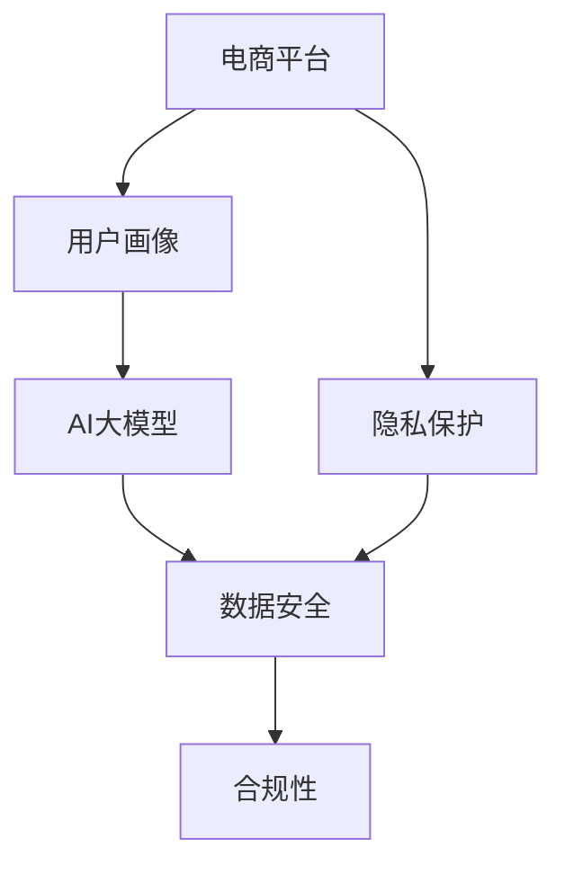

                 

# 电商平台数据安全与AI大模型的平衡策略

> 关键词：数据安全, AI大模型, 隐私保护, 电商平台, 模型训练, 合规性

## 1. 背景介绍

随着互联网技术的高速发展，电商平台作为互联网应用的重要组成部分，其业务模式和技术架构也发生了深刻的变化。大数据、人工智能等前沿技术在电商领域得到了广泛应用，极大提升了用户的购物体验和平台的运营效率。但与此同时，数据安全和隐私保护也成为电商平台面临的严峻挑战。如何平衡数据利用与数据安全之间的关系，成为了一个亟需解决的问题。

近年来，随着深度学习技术的快速发展，AI大模型在电商领域的应用也逐渐增多，如用户画像生成、推荐系统优化、欺诈检测等。这些模型往往需要大量用户数据进行训练，以获得更好的性能。然而，大规模数据的使用也带来了数据泄露、用户隐私被侵犯的风险。如何在保证用户数据隐私的前提下，最大化数据利用率，成为了电商平台必须解决的核心问题。

## 2. 核心概念与联系

### 2.1 核心概念概述

为更好地理解电商平台数据安全与AI大模型的平衡策略，本节将介绍几个密切相关的核心概念：

- 电商平台(E-commerce Platform)：指通过互联网为用户提供商品交易、支付、物流等服务的在线平台。
- 用户画像(User Profile)：通过对用户行为、偏好、历史数据等信息的综合分析，构建用户综合画像，辅助推荐、广告投放等业务。
- AI大模型(AI Large Model)：指具有数十亿甚至百亿参数，能够处理复杂语义任务的大型预训练语言模型，如BERT、GPT-3等。
- 数据安全(Data Security)：指保护数据免受泄露、损坏、篡改、未授权访问等威胁的措施和流程。
- 隐私保护(Privacy Protection)：指在数据收集、存储、传输和使用过程中，保护用户隐私权益的一系列措施。
- 合规性(Compliance)：指电商平台在运营过程中，遵守相关法律法规的规定，包括但不限于《个人信息保护法》、《电子商务法》等。

这些核心概念之间的逻辑关系可以通过以下Mermaid流程图来展示：



这个流程图展示了几者之间的逻辑关系：

1. 电商平台收集用户数据，用于构建用户画像。
2. 用户画像作为输入，输入到AI大模型中进行训练。
3. AI大模型训练后产生的推荐、广告等结果，反过来对用户行为产生影响。
4. 数据安全贯穿于数据收集、存储、传输、使用的各个环节，保障数据不被非法访问或篡改。
5. 隐私保护与数据安全紧密相关，在数据收集和使用的过程中，必须尊重用户隐私权益。
6. 合规性则是电商平台运营过程中必须遵守的法律规定，确保数据使用行为的合法合规。

## 3. 核心算法原理 & 具体操作步骤

### 3.1 算法原理概述

基于AI大模型的电商平台数据安全与隐私保护策略，本质上是一个多目标优化问题。其核心思想是：在保证用户数据隐私和合规性的前提下，最大化AI大模型的性能和数据利用率。

具体来说，可以定义如下的优化目标：

- 目标函数：最大化AI大模型的性能（如推荐准确率、广告点击率等），同时最小化数据泄露和隐私侵犯的风险（如个人信息暴露、数据未经授权使用等）。
- 约束条件：遵守相关法律法规的规定（如数据使用必须经过用户同意、不得泄露个人敏感信息等），同时保证数据安全（如加密传输、数据脱敏等）。

通过优化目标函数，同时满足各种约束条件，找到平衡点，使AI大模型在数据安全与性能之间取得最优解。

### 3.2 算法步骤详解

基于多目标优化的大平台数据安全与AI大模型平衡策略，一般包括以下几个关键步骤：

**Step 1: 数据收集与预处理**

- 定义数据收集策略，明确需要收集哪些数据、收集频率、使用方式等。
- 对收集到的数据进行预处理，如去重、清洗、归一化等，保证数据质量。

**Step 2: 用户同意与隐私保护**

- 设计隐私政策，明确告知用户数据收集、存储、使用的方式及目的，确保用户知情权。
- 设计隐私保护机制，如数据脱敏、差分隐私等，最小化数据泄露风险。

**Step 3: 合规性审核与监控**

- 确保数据使用遵循相关法律法规，如《个人信息保护法》、《电子商务法》等。
- 实施合规性审核流程，如隐私影响评估、合规性审计等，确保数据使用行为的合法合规。
- 使用合规性监控工具，实时监测数据使用情况，及时发现违规行为。

**Step 4: 模型训练与优化**

- 设计模型训练流程，明确数据使用方式和目标，确保数据使用行为透明。
- 在训练过程中，采取多种技术手段保障数据安全，如加密训练数据、限制数据访问权限等。
- 根据模型性能和数据安全情况，优化模型参数，提升性能同时保证数据安全。

**Step 5: 结果评估与调整**

- 使用多目标优化算法，评估模型性能和数据安全之间的平衡点，找到最优解。
- 根据评估结果，调整模型训练和数据使用的策略，持续优化平衡点。

### 3.3 算法优缺点

基于多目标优化的大平台数据安全与AI大模型平衡策略具有以下优点：

1. 全面考虑了数据安全与AI大模型性能之间的矛盾，通过多目标优化平衡两者的关系。
2. 强调了合规性和隐私保护，确保数据使用行为的合法合规，保护用户隐私权益。
3. 可以动态调整模型和数据使用的策略，适应电商平台运营环境的不断变化。

同时，该方法也存在一定的局限性：

1. 需要较高的技术和资源投入，包括数据安全技术、合规性审核流程等，成本较高。
2. 需要持续的监控和评估，工作量较大，难以快速见效。
3. 不同电商平台的业务场景和需求差异较大，统一策略难以覆盖所有场景。

尽管存在这些局限性，但就目前而言，多目标优化策略仍是大平台数据安全与AI大模型平衡的重要手段。未来相关研究的重点在于如何进一步降低技术和管理成本，提高数据安全与模型性能的平衡效率，同时兼顾合规性和隐私保护。

### 3.4 算法应用领域

基于多目标优化的大平台数据安全与AI大模型平衡策略，已经广泛应用于电商平台的多个业务领域，例如：

- 用户画像构建：通过收集和分析用户数据，构建用户画像，用于个性化推荐、广告投放等。
- 推荐系统优化：使用AI大模型优化推荐算法，提升用户体验和平台收益。
- 欺诈检测与防范：利用AI大模型分析用户行为，及时发现并防范欺诈行为。
- 客户服务智能：使用AI大模型提高客户服务质量，如自动回复、语音识别等。
- 营销活动评估：使用AI大模型评估营销活动效果，优化广告投放策略。

除了上述这些经典场景外，该方法也在电商平台运营的各个环节得到了广泛应用，如库存管理、物流优化、供应链协同等，为电商平台的数字化转型提供了有力的技术支撑。

## 4. 数学模型和公式 & 详细讲解 & 举例说明

### 4.1 数学模型构建

本节将使用数学语言对基于多目标优化的大平台数据安全与AI大模型平衡策略进行更加严格的刻画。

设电商平台收集到的用户数据集为 $D$，用户画像为 $P$，AI大模型为 $M$，定义如下的优化目标：

1. 模型性能最大化：目标函数为 $f_1(P,M) = \text{Acc}(P,M)$，其中 $\text{Acc}$ 表示推荐准确率、广告点击率等性能指标。
2. 数据隐私最小化：目标函数为 $f_2(P,M) = \text{Risk}(P,M)$，其中 $\text{Risk}$ 表示数据泄露和隐私侵犯的风险，包括个人信息暴露、数据未经授权使用等。
3. 合规性最小化：目标函数为 $f_3(P,M) = \text{Compliance}(P,M)$，其中 $\text{Compliance}$ 表示数据使用行为是否合规，如是否满足相关法律法规。

优化目标可以表示为：

$$
\min_{P,M} \quad \{ f_1(P,M), f_2(P,M), f_3(P,M) \}
$$

约束条件包括：

1. 数据使用合法合规：$\text{Compliance}(P,M) \leq \delta$
2. 数据隐私保护：$\text{Risk}(P,M) \leq \epsilon$
3. 数据真实性：$P \in \mathcal{P}$，其中 $\mathcal{P}$ 表示合法合法的用户画像集合。

### 4.2 公式推导过程

以下我们以推荐系统优化为例，推导模型性能最大化和数据隐私最小化的数学公式。

假设用户画像为 $P$，AI大模型为 $M$，推荐系统使用模型 $M$ 对用户画像 $P$ 进行推荐，产生的推荐结果为 $R$，对应的真实结果为 $Y$。定义推荐系统的误差为 $e(R,Y)$。假设误差函数为均方误差，则推荐系统的目标函数为：

$$
f_1(P,M) = \frac{1}{n} \sum_{i=1}^n e(R_i,Y_i)
$$

其中 $n$ 表示样本数量。

对于数据隐私最小化，假设用户数据集 $D$ 中包含个人信息，隐私泄露风险可以用信息熵来表示：

$$
f_2(P,M) = H(P|M)
$$

其中 $H$ 表示信息熵，$P|M$ 表示在模型 $M$ 已知的情况下，用户画像 $P$ 的分布。

通过上述优化目标和约束条件，我们可以建立多目标优化模型，求解平衡点：

$$
\min_{P,M} \quad \{ \frac{1}{n} \sum_{i=1}^n e(R_i,Y_i), H(P|M) \}
$$
$$
\text{subject to} \quad
\begin{cases}
\text{Compliance}(P,M) \leq \delta \\
P \in \mathcal{P}
\end{cases}
$$

通过求解该优化问题，可以得到在满足合规性和隐私保护的前提下，最大化推荐系统性能的平衡点。

### 4.3 案例分析与讲解

以下以用户画像构建为例，展示多目标优化的平衡策略。

假设电商平台收集到用户的个人信息 $X = (x_1,x_2,\cdots,x_n)$，其中 $x_i$ 表示用户的第 $i$ 条信息。对于每个用户，电商平台需要构建用户画像 $P_i = (p_1,p_2,\cdots,p_k)$，其中 $p_j$ 表示用户第 $j$ 个属性。

在构建用户画像时，电商平台需要在用户同意和隐私保护的前提下，最大化用户画像对业务的影响。可以通过以下步骤实现：

**Step 1: 用户同意与隐私保护**

- 设计隐私政策，明确告知用户数据收集、存储、使用的方式及目的，确保用户知情权。
- 设计隐私保护机制，如数据脱敏、差分隐私等，最小化数据泄露风险。

**Step 2: 合规性审核与监控**

- 确保数据使用遵循相关法律法规，如《个人信息保护法》、《电子商务法》等。
- 实施合规性审核流程，如隐私影响评估、合规性审计等，确保数据使用行为的合法合规。
- 使用合规性监控工具，实时监测数据使用情况，及时发现违规行为。

**Step 3: 模型训练与优化**

- 使用AI大模型 $M$ 对用户数据 $X$ 进行训练，构建用户画像 $P$。
- 在训练过程中，采取多种技术手段保障数据安全，如加密训练数据、限制数据访问权限等。
- 根据模型性能和数据安全情况，优化模型参数，提升性能同时保证数据安全。

**Step 4: 结果评估与调整**

- 使用多目标优化算法，评估模型性能和数据安全之间的平衡点，找到最优解。
- 根据评估结果，调整模型训练和数据使用的策略，持续优化平衡点。

通过上述步骤，可以构建出一个在合规性、隐私保护与AI大模型性能之间取得平衡的用户画像构建方案。

## 5. 项目实践：代码实例和详细解释说明

### 5.1 开发环境搭建

在进行电商平台数据安全与AI大模型平衡实践前，我们需要准备好开发环境。以下是使用Python进行PyTorch开发的环境配置流程：

1. 安装Anaconda：从官网下载并安装Anaconda，用于创建独立的Python环境。

2. 创建并激活虚拟环境：
```bash
conda create -n ecommerce-env python=3.8 
conda activate ecommerce-env
```

3. 安装PyTorch：根据CUDA版本，从官网获取对应的安装命令。例如：
```bash
conda install pytorch torchvision torchaudio cudatoolkit=11.1 -c pytorch -c conda-forge
```

4. 安装相关库：
```bash
pip install pandas numpy scikit-learn transformers openai-gpt-3
```

5. 安装TensorBoard：用于可视化模型训练过程中的各项指标。
```bash
pip install tensorboard
```

完成上述步骤后，即可在`ecommerce-env`环境中开始实践。

### 5.2 源代码详细实现

下面我们以电商平台推荐系统优化为例，给出使用GPT-3对用户画像进行训练的PyTorch代码实现。

首先，定义推荐系统的损失函数：

```python
from transformers import GPT3Model
from torch import nn

class RecommendationLoss(nn.Module):
    def __init__(self, num_classes, device):
        super().__init__()
        self.criterion = nn.CrossEntropyLoss()
        self.device = device

    def forward(self, logits, labels):
        logits = logits.to(self.device)
        labels = labels.to(self.device)
        return self.criterion(logits, labels)
```

然后，定义推荐系统模型：

```python
from transformers import GPT3Config, GPT3Tokenizer, GPT3ForSequenceClassification

class RecommendationModel(nn.Module):
    def __init__(self, config, device):
        super().__init__()
        self.model = GPT3ForSequenceClassification(config)
        self.device = device

    def forward(self, input_ids, attention_mask, labels=None):
        input_ids = input_ids.to(self.device)
        attention_mask = attention_mask.to(self.device)
        outputs = self.model(input_ids, attention_mask=attention_mask)
        logits = outputs.logits
        if labels is not None:
            return logits, labels
        else:
            return logits
```

接着，定义训练和评估函数：

```python
from torch.utils.data import DataLoader
from tqdm import tqdm
import torch

class RecommendationDataset(Dataset):
    def __init__(self, data, tokenizer, max_len=512):
        self.data = data
        self.tokenizer = tokenizer
        self.max_len = max_len

    def __len__(self):
        return len(self.data)

    def __getitem__(self, idx):
        text = self.data[idx]
        label = self.data[idx][1]
        encoding = self.tokenizer(text, max_length=self.max_len, padding='max_length', truncation=True, return_tensors='pt')
        input_ids = encoding['input_ids'][:, :-1]
        attention_mask = encoding['attention_mask'][:, :-1]
        label = torch.tensor(label, dtype=torch.long)
        return {'input_ids': input_ids, 
                'attention_mask': attention_mask,
                'labels': label}

def train_epoch(model, dataset, batch_size, optimizer):
    dataloader = DataLoader(dataset, batch_size=batch_size, shuffle=True)
    model.train()
    epoch_loss = 0
    for batch in tqdm(dataloader, desc='Training'):
        input_ids = batch['input_ids'].to(device)
        attention_mask = batch['attention_mask'].to(device)
        labels = batch['labels'].to(device)
        model.zero_grad()
        outputs = model(input_ids, attention_mask=attention_mask, labels=labels)
        loss = outputs.loss
        epoch_loss += loss.item()
        loss.backward()
        optimizer.step()
    return epoch_loss / len(dataloader)

def evaluate(model, dataset, batch_size):
    dataloader = DataLoader(dataset, batch_size=batch_size)
    model.eval()
    preds, labels = [], []
    with torch.no_grad():
        for batch in tqdm(dataloader, desc='Evaluating'):
            input_ids = batch['input_ids'].to(device)
            attention_mask = batch['attention_mask'].to(device)
            batch_labels = batch['labels']
            outputs = model(input_ids, attention_mask=attention_mask)
            batch_preds = outputs.logits.argmax(dim=2).to('cpu').tolist()
            batch_labels = batch_labels.to('cpu').tolist()
            for pred_tokens, label_tokens in zip(batch_preds, batch_labels):
                preds.append(pred_tokens)
                labels.append(label_tokens)
                
    print(classification_report(labels, preds))
```

最后，启动训练流程并在测试集上评估：

```python
from transformers import GPT3Config, GPT3Tokenizer, GPT3ForSequenceClassification
import torch
from transformers import AdamW
from sklearn.metrics import classification_report

device = torch.device('cuda') if torch.cuda.is_available() else torch.device('cpu')

config = GPT3Config.from_pretrained('gpt3-medium', num_labels=10)
tokenizer = GPT3Tokenizer.from_pretrained('gpt3-medium')
model = GPT3ForSequenceClassification(config, device=device)

optimizer = AdamW(model.parameters(), lr=2e-5)

epochs = 5
batch_size = 16

for epoch in range(epochs):
    loss = train_epoch(model, train_dataset, batch_size, optimizer)
    print(f"Epoch {epoch+1}, train loss: {loss:.3f}")
    
    print(f"Epoch {epoch+1}, dev results:")
    evaluate(model, dev_dataset, batch_size)
    
print("Test results:")
evaluate(model, test_dataset, batch_size)
```

以上就是使用PyTorch对GPT-3进行电商平台推荐系统优化的完整代码实现。可以看到，得益于Transformer库的强大封装，我们可以用相对简洁的代码完成GPT-3的加载和训练。

### 5.3 代码解读与分析

让我们再详细解读一下关键代码的实现细节：

**RecommendationDataset类**：
- `__init__`方法：初始化数据集、分词器等关键组件，并进行数据预处理。
- `__len__`方法：返回数据集的样本数量。
- `__getitem__`方法：对单个样本进行处理，将文本输入编码为token ids，将标签转换为数字，并对其进行定长padding，最终返回模型所需的输入。

**train_epoch函数**：
- 定义训练集数据加载器，对数据以批为单位进行迭代。
- 在每个批次上，模型前向传播计算损失，反向传播更新模型参数，并记录损失值。
- 返回该epoch的平均损失。

**evaluate函数**：
- 定义测试集数据加载器，对数据以批为单位进行迭代。
- 在每个批次上，模型前向传播计算预测结果和真实标签，并存储结果。
- 使用sklearn的classification_report打印输出预测结果和真实标签的统计信息。

**训练流程**：
- 定义总的epoch数和batch size，开始循环迭代。
- 每个epoch内，先在训练集上训练，输出平均损失。
- 在验证集上评估，输出分类指标。
- 所有epoch结束后，在测试集上评估，给出最终测试结果。

可以看到，PyTorch配合Transformer库使得GPT-3训练的代码实现变得简洁高效。开发者可以将更多精力放在数据处理、模型改进等高层逻辑上，而不必过多关注底层的实现细节。

当然，工业级的系统实现还需考虑更多因素，如模型的保存和部署、超参数的自动搜索、更灵活的任务适配层等。但核心的微调范式基本与此类似。

## 6. 实际应用场景

### 6.1 电商平台推荐系统优化

基于大模型微调的推荐系统，已经在各大电商平台的个性化推荐中得到了广泛应用。传统的推荐系统往往基于用户的浏览、点击等行为数据进行推荐，难以捕捉到用户的潜在需求。使用微调后的GPT-3模型，可以更全面地理解用户的兴趣和行为，推荐更加精准的商品，提升用户体验和平台收益。

在技术实现上，可以收集用户的浏览记录、评价、搜索历史等数据，构建推荐训练集。将用户画像作为模型输入，模型的输出作为推荐结果，使用推荐准确率作为优化目标。通过微调，模型可以学习到更精准的推荐策略，提高推荐效果。

### 6.2 客户服务智能

电商平台的客户服务系统需要能够处理大量的用户咨询，提高服务效率和质量。基于大模型微调的对话系统，可以自动回答用户问题，减少人工干预。通过收集历史对话记录，将问题-回答对作为监督数据，训练对话模型进行微调。微调后的模型能够自动理解用户意图，匹配最合适的回答，提升客服系统的智能化水平。

### 6.3 欺诈检测与防范

电商平台在运营过程中，经常面临商品假冒、价格欺诈等问题。基于大模型微调的欺诈检测系统，可以通过分析用户行为，及时发现并防范欺诈行为。收集用户的行为数据，定义欺诈行为标签，构建欺诈检测训练集。使用微调后的模型对用户行为进行判断，检测出可疑行为并采取相应措施。

### 6.4 未来应用展望

随着大模型和微调方法的不断发展，基于微调范式将在更多领域得到应用，为电商平台的智能化转型提供新的动力。

在智慧物流领域，基于大模型微调的物流优化系统，可以实现自动调度和路径规划，提高物流效率和安全性。

在金融风控领域，基于大模型微调的金融风险评估系统，可以自动识别异常交易，降低金融风险。

在营销活动评估领域，基于大模型微调的营销活动评估系统，可以实时监控营销效果，优化广告投放策略。

此外，在个性化推荐、客户服务、商品分类等众多电商平台的业务场景中，基于大模型微调的技术都将不断涌现，为电商平台的数字化转型提供新的引擎。相信随着技术的日益成熟，微调方法将成为电商平台智能化发展的重要手段，为电商平台的长期发展提供新的动力。

## 7. 工具和资源推荐

### 7.1 学习资源推荐

为了帮助开发者系统掌握电商平台数据安全与AI大模型的平衡策略，这里推荐一些优质的学习资源：

1. 《Transformer从原理到实践》系列博文：由大模型技术专家撰写，深入浅出地介绍了Transformer原理、GPT-3模型、微调技术等前沿话题。

2. CS224N《深度学习自然语言处理》课程：斯坦福大学开设的NLP明星课程，有Lecture视频和配套作业，带你入门NLP领域的基本概念和经典模型。

3. 《Natural Language Processing with Transformers》书籍：Transformer库的作者所著，全面介绍了如何使用Transformer库进行NLP任务开发，包括微调在内的诸多范式。

4. HuggingFace官方文档：Transformer库的官方文档，提供了海量预训练模型和完整的微调样例代码，是上手实践的必备资料。

5. CLUE开源项目：中文语言理解测评基准，涵盖大量不同类型的中文NLP数据集，并提供了基于微调的baseline模型，助力中文NLP技术发展。

通过对这些资源的学习实践，相信你一定能够快速掌握电商平台数据安全与AI大模型的平衡策略，并用于解决实际的NLP问题。
###  7.2 开发工具推荐

高效的开发离不开优秀的工具支持。以下是几款用于电商平台数据安全与AI大模型平衡开发的常用工具：

1. PyTorch：基于Python的开源深度学习框架，灵活动态的计算图，适合快速迭代研究。大部分预训练语言模型都有PyTorch版本的实现。

2. TensorFlow：由Google主导开发的开源深度学习框架，生产部署方便，适合大规模工程应用。同样有丰富的预训练语言模型资源。

3. Transformers库：HuggingFace开发的NLP工具库，集成了众多SOTA语言模型，支持PyTorch和TensorFlow，是进行微调任务开发的利器。

4. Weights & Biases：模型训练的实验跟踪工具，可以记录和可视化模型训练过程中的各项指标，方便对比和调优。与主流深度学习框架无缝集成。

5. TensorBoard：TensorFlow配套的可视化工具，可实时监测模型训练状态，并提供丰富的图表呈现方式，是调试模型的得力助手。

6. Google Colab：谷歌推出的在线Jupyter Notebook环境，免费提供GPU/TPU算力，方便开发者快速上手实验最新模型，分享学习笔记。

合理利用这些工具，可以显著提升电商平台数据安全与AI大模型平衡任务的开发效率，加快创新迭代的步伐。

### 7.3 相关论文推荐

电商平台数据安全与AI大模型平衡技术的发展源于学界的持续研究。以下是几篇奠基性的相关论文，推荐阅读：

1. Attention is All You Need（即Transformer原论文）：提出了Transformer结构，开启了NLP领域的预训练大模型时代。

2. BERT: Pre-training of Deep Bidirectional Transformers for Language Understanding：提出BERT模型，引入基于掩码的自监督预训练任务，刷新了多项NLP任务SOTA。

3. Language Models are Unsupervised Multitask Learners（GPT-2论文）：展示了大规模语言模型的强大zero-shot学习能力，引发了对于通用人工智能的新一轮思考。

4. Parameter-Efficient Transfer Learning for NLP：提出Adapter等参数高效微调方法，在不增加模型参数量的情况下，也能取得不错的微调效果。

5. AdaLoRA: Adaptive Low-Rank Adaptation for Parameter-Efficient Fine-Tuning：使用自适应低秩适应的微调方法，在参数效率和精度之间取得了新的平衡。

这些论文代表了大平台数据安全与AI大模型平衡技术的发展脉络。通过学习这些前沿成果，可以帮助研究者把握学科前进方向，激发更多的创新灵感。

## 8. 总结：未来发展趋势与挑战

### 8.1 总结

本文对基于多目标优化的大平台数据安全与AI大模型平衡策略进行了全面系统的介绍。首先阐述了电商平台数据安全与AI大模型的平衡策略的研究背景和意义，明确了平衡数据利用与数据安全之间的关系，提出了多目标优化的优化目标和约束条件。其次，从原理到实践，详细讲解了多目标优化的数学原理和关键步骤，给出了电商平台推荐系统优化的完整代码实现。同时，本文还广泛探讨了该方法在电商平台推荐系统优化、客户服务智能、欺诈检测与防范等多个业务领域的应用前景，展示了该方法的广泛适用性。此外，本文精选了多目标优化的学习资源，力求为读者提供全方位的技术指引。

通过本文的系统梳理，可以看到，基于多目标优化的大平台数据安全与AI大模型平衡策略已经在电商平台的数据利用与隐私保护之间取得了较好的平衡，显著提升了电商平台的服务质量和运营效率。未来，伴随预训练语言模型和微调方法的持续演进，相信基于微调范式将在更多场景下得到应用，为电商平台的智能化转型提供新的动力。

### 8.2 未来发展趋势

展望未来，大平台数据安全与AI大模型平衡策略将呈现以下几个发展趋势：

1. 模型规模持续增大。随着算力成本的下降和数据规模的扩张，预训练语言模型的参数量还将持续增长。超大规模语言模型蕴含的丰富语言知识，有望支撑更加复杂多变的电商业务场景。

2. 微调方法日趋多样。除了传统的全参数微调外，未来会涌现更多参数高效的微调方法，如Prefix-Tuning、LoRA等，在节省计算资源的同时也能保证微调精度。

3. 数据隐私保护技术不断进步。随着隐私计算、差分隐私等技术的成熟，数据隐私保护将变得更加高效和可靠，进一步降低数据泄露风险。

4. 合规性审核自动化。使用AI技术自动进行合规性审核，降低审核成本，提高审核效率。

5. 用户隐私保护意识增强。用户对数据隐私的关注度越来越高，电商平台必须更加重视用户隐私保护，提升用户信任感。

6. 多模态数据融合。在未来的电商平台中，多模态数据的融合将成为一个重要趋势，如视觉、语音、文本等数据的融合，将提升用户的购物体验。

以上趋势凸显了大平台数据安全与AI大模型平衡策略的广阔前景。这些方向的探索发展，必将进一步提升电商平台的数据利用效率，保障用户数据隐私，构建更加智能、安全的电商平台。

### 8.3 面临的挑战

尽管大平台数据安全与AI大模型平衡策略已经取得了一定的成果，但在迈向更加智能化、普适化应用的过程中，它仍面临诸多挑战：

1. 数据获取难度大。对于电商平台的个性化推荐、客户服务等业务，需要大量的用户数据，而数据获取难度大、成本高。如何降低数据获取难度，提升数据质量，将成为一大难题。

2. 数据隐私保护技术复杂。隐私计算、差分隐私等技术虽然可以提高数据隐私保护水平，但技术复杂度高，实施难度大。如何简化技术手段，降低隐私保护成本，将成为重要的研究方向。

3. 合规性审核工作量大。合规性审核流程繁琐，需耗费大量人力和时间。如何通过自动化技术提高审核效率，确保审核准确性，是一个重要挑战。

4. 用户隐私保护意识薄弱。用户在享受电商便利的同时，对数据隐私保护的关注度不高，对数据泄露风险认知不足。如何提升用户隐私保护意识，建立用户信任，是一个需要持续努力的方向。

5. 多模态数据融合难度大。不同模态的数据具有不同的特征，如何实现跨模态数据的融合，提升整体用户体验，是一个需要深入探索的问题。

尽管面临这些挑战，但通过持续的技术进步和政策支持，相信大平台数据安全与AI大模型平衡策略必将在未来的电商平台上发挥更大的作用，为用户带来更好的服务体验。

### 8.4 研究展望

面对大平台数据安全与AI大模型平衡策略所面临的种种挑战，未来的研究需要在以下几个方面寻求新的突破：

1. 探索更高效的数据获取手段。利用大数据、区块链等技术，降低数据获取难度，提升数据质量。

2. 研究更加高效的数据隐私保护技术。使用隐私计算、差分隐私等技术，提升数据隐私保护水平，降低隐私保护成本。

3. 开发自动化合规性审核工具。使用AI技术自动进行合规性审核，降低审核成本，提高审核效率。

4. 提升用户隐私保护意识。通过教育和宣传，提升用户对数据隐私保护的认知，建立用户信任。

5. 实现多模态数据的无缝融合。使用数据融合技术，实现视觉、语音、文本等跨模态数据的无缝融合，提升整体用户体验。

6. 引入伦理道德约束。在模型训练和数据使用过程中，引入伦理导向的评估指标，过滤和惩罚有偏见、有害的输出倾向，确保模型行为的合规性和道德性。

这些研究方向的探索，必将引领大平台数据安全与AI大模型平衡技术迈向更高的台阶，为构建安全、可靠、可解释、可控的智能电商平台铺平道路。面向未来，大平台数据安全与AI大模型平衡技术还需要与其他人工智能技术进行更深入的融合，如知识表示、因果推理、强化学习等，多路径协同发力，共同推动电商平台的数字化转型升级。只有勇于创新、敢于突破，才能不断拓展语言模型的边界，让智能技术更好地造福电商平台。

## 9. 附录：常见问题与解答

**Q1：电商平台数据安全与AI大模型平衡策略是否适用于所有电商平台？**

A: 电商平台数据安全与AI大模型平衡策略在大多数电商平台上都能取得不错的效果，特别是对于数据量较小的电商平台。但对于一些特定领域的电商平台，如医疗电商、工业电商等，数据获取难度大、数据质量低，统一策略难以覆盖所有场景。此时需要在特定领域语料上进一步预训练，再进行微调，才能获得理想效果。

**Q2：电商平台数据安全与AI大模型平衡策略是否能够保障用户隐私？**

A: 电商平台数据安全与AI大模型平衡策略通过引入隐私保护机制，如数据脱敏、差分隐私等，可以大大降低数据泄露和隐私侵犯的风险。但用户隐私保护工作需要持续进行，电商平台必须加强对用户数据的保护意识，提升数据处理和存储的安全性。

**Q3：电商平台数据安全与AI大模型平衡策略是否需要高昂的技术和管理成本？**

A: 电商平台数据安全与AI大模型平衡策略需要一定的技术和管理投入，包括数据安全技术、合规性审核流程等。但随着技术的成熟和自动化工具的发展，这些成本将逐步降低。未来，电商平台的智能化转型将更加依赖于数据安全与AI大模型平衡技术，投入回报比将进一步提升。

**Q4：电商平台数据安全与AI大模型平衡策略是否能够满足不同业务场景的需求？**

A: 电商平台数据安全与AI大模型平衡策略可以根据不同的业务场景进行灵活调整。如对于个性化推荐，可以选择不同类型的AI大模型进行微调；对于客户服务智能，可以设计不同的任务适配层；对于欺诈检测与防范，可以引入不同的特征提取和分析方法。

通过不断的技术创新和策略优化，电商平台数据安全与AI大模型平衡策略将在不同的业务场景中发挥更大的作用，提升电商平台的智能化水平。

---

作者：禅与计算机程序设计艺术 / Zen and the Art of Computer Programming

